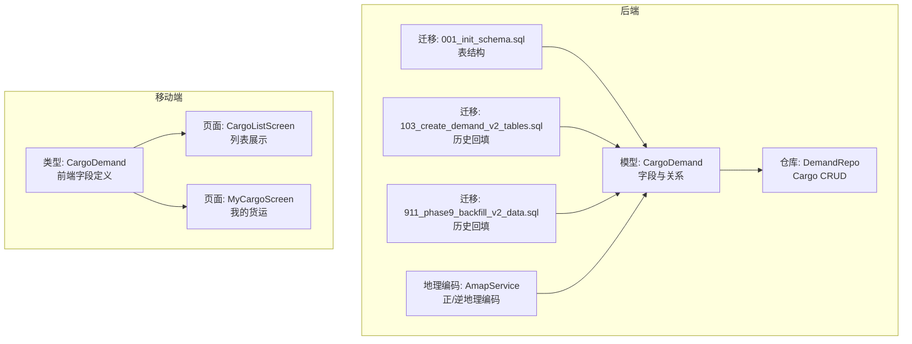
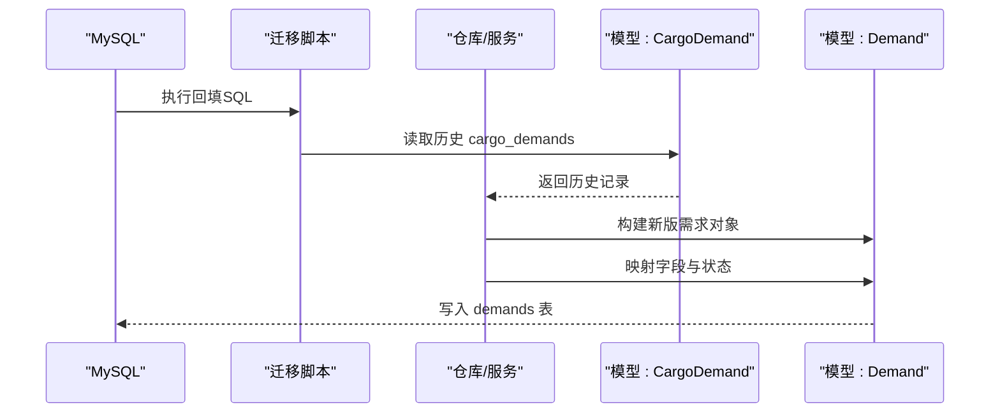
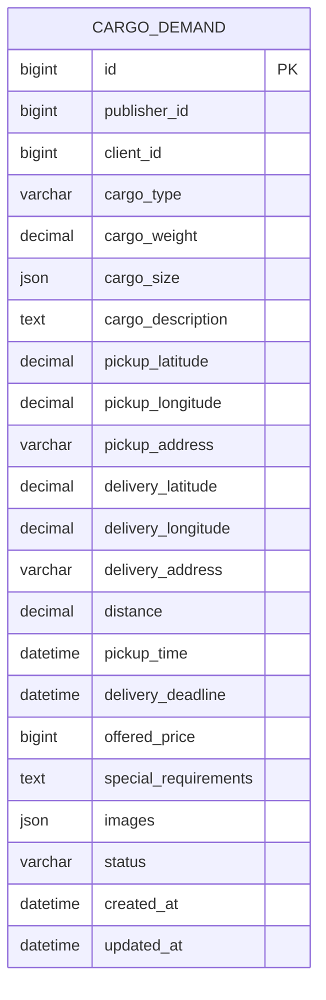
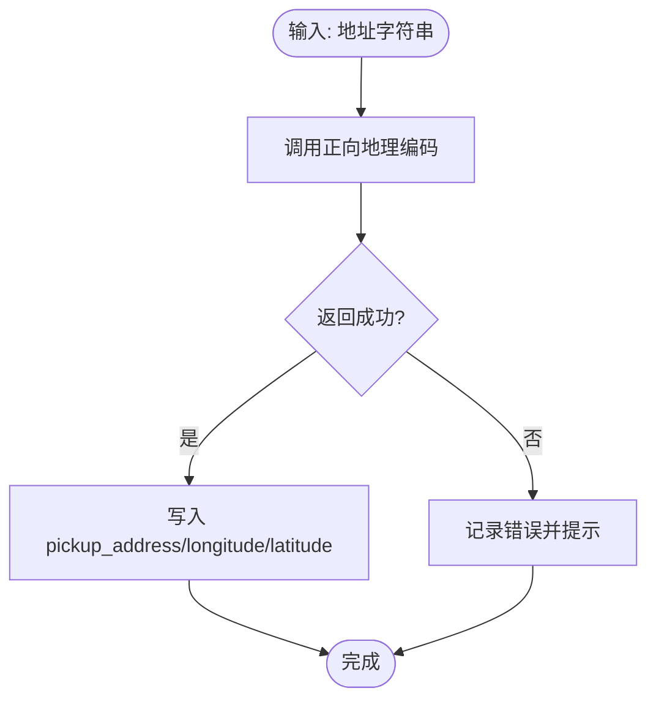
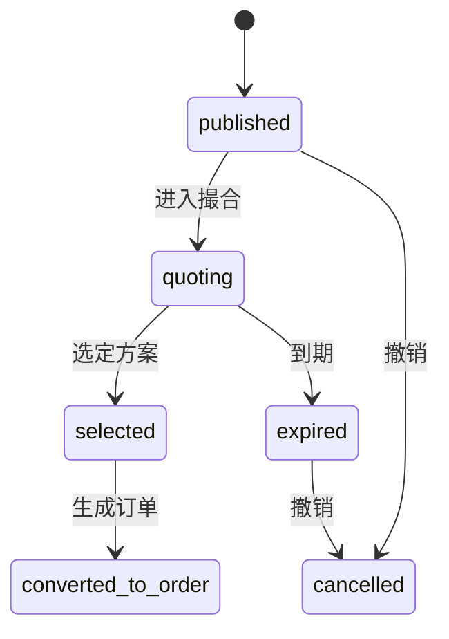
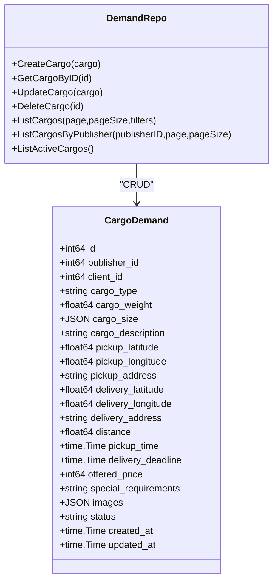
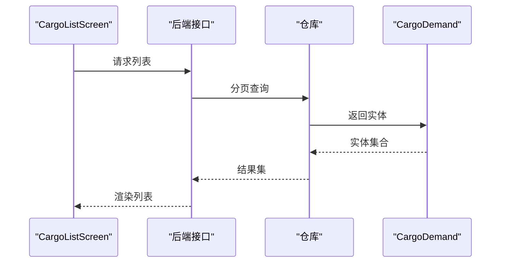
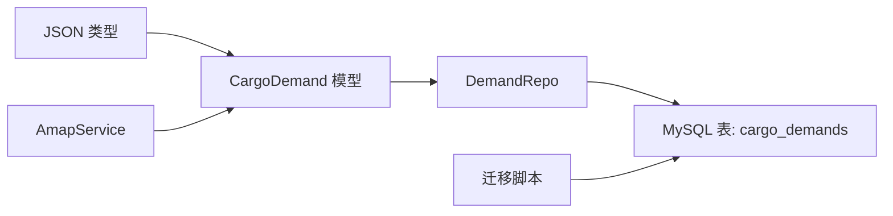

# 货运需求表 (CargoDemand)

<cite>
**本文引用的文件**
- [models.go](file://backend/internal/model/models.go)
- [001_init_schema.sql](file://backend/migrations/001_init_schema.sql)
- [demand_domain_repo.go](file://backend/internal/repository/demand_domain_repo.go)
- [demand_repo.go](file://backend/internal/repository/demand_repo.go)
- [amap.go](file://backend/internal/pkg/amap/amap.go)
- [index.ts](file://mobile/src/types/index.ts)
- [CargoListScreen.tsx](file://mobile/src/screens/cargo/CargoListScreen.tsx)
- [MyCargoScreen.tsx](file://mobile/src/screens/profile/MyCargoScreen.tsx)
- [103_create_demand_v2_tables.sql](file://backend/migrations/103_create_demand_v2_tables.sql)
- [911_phase9_backfill_v2_data.sql](file://backend/migrations/911_phase9_backfill_v2_data.sql)
</cite>

## 目录
1. [简介](#简介)
2. [项目结构](#项目结构)
3. [核心组件](#核心组件)
4. [架构总览](#架构总览)
5. [详细组件分析](#详细组件分析)
6. [依赖关系分析](#依赖关系分析)
7. [性能考量](#性能考量)
8. [故障排查指南](#故障排查指南)
9. [结论](#结论)
10. [附录](#附录)

## 简介
本文件为“货运需求表 (CargoDemand)”的结构设计与业务生命周期文档。围绕发布者ID、客户ID、货物类型、重量、尺寸、描述、起止地点坐标与地址、距离、取货时间、交付截止时间、报价、特殊要求、图片等字段，系统性阐述其业务含义与约束；并结合历史数据迁移与回填策略，说明从发布到完成的完整生命周期状态映射与流转。

## 项目结构
- 后端模型层定义了 CargoDemand 的字段与索引；
- 数据库迁移脚本定义了表结构与索引；
- 仓库层提供 CargoDemand 的增删改查接口；
- 地理编码服务支持地址与坐标的双向转换；
- 移动端类型定义与界面展示体现了字段的使用方式；
- 历史数据迁移脚本将旧版 cargo_demands 回填至新版 demands 表，并进行状态映射。

**图表来源**
- [models.go:291-321](file://backend/internal/model/models.go#L291-L321)
- [001_init_schema.sql:122-150](file://backend/migrations/001_init_schema.sql#L122-L150)
- [demand_repo.go:174-216](file://backend/internal/repository/demand_repo.go#L174-L216)
- [amap.go:105-185](file://backend/internal/pkg/amap/amap.go#L105-L185)
- [index.ts:165-179](file://mobile/src/types/index.ts#L165-L179)
- [CargoListScreen.tsx:11-94](file://mobile/src/screens/cargo/CargoListScreen.tsx#L11-L94)
- [MyCargoScreen.tsx:71-101](file://mobile/src/screens/profile/MyCargoScreen.tsx#L71-L101)
- [103_create_demand_v2_tables.sql:171-253](file://backend/migrations/103_create_demand_v2_tables.sql#L171-L253)
- [911_phase9_backfill_v2_data.sql:381-419](file://backend/migrations/911_phase9_backfill_v2_data.sql#L381-L419)

**章节来源**
- [models.go:291-321](file://backend/internal/model/models.go#L291-L321)
- [001_init_schema.sql:122-150](file://backend/migrations/001_init_schema.sql#L122-L150)
- [demand_repo.go:174-216](file://backend/internal/repository/demand_repo.go#L174-L216)
- [amap.go:105-185](file://backend/internal/pkg/amap/amap.go#L105-L185)
- [index.ts:165-179](file://mobile/src/types/index.ts#L165-L179)
- [CargoListScreen.tsx:11-94](file://mobile/src/screens/cargo/CargoListScreen.tsx#L11-L94)
- [MyCargoScreen.tsx:71-101](file://mobile/src/screens/profile/MyCargoScreen.tsx#L71-L101)
- [103_create_demand_v2_tables.sql:171-253](file://backend/migrations/103_create_demand_v2_tables.sql#L171-L253)
- [911_phase9_backfill_v2_data.sql:381-419](file://backend/migrations/911_phase9_backfill_v2_data.sql#L381-L419)

## 核心组件
- CargoDemand 模型：定义了货运需求的核心字段、索引与关联关系。
- 数据库表结构：由迁移脚本定义，包含字段类型、默认值与索引。
- 仓库接口：提供创建、查询、更新、删除与分页列表能力。
- 地理编码服务：支持地址字符串与经纬度的标准化转换。
- 前端类型与界面：展示字段在移动端的呈现与交互。

**章节来源**
- [models.go:291-321](file://backend/internal/model/models.go#L291-L321)
- [001_init_schema.sql:122-150](file://backend/migrations/001_init_schema.sql#L122-L150)
- [demand_repo.go:174-216](file://backend/internal/repository/demand_repo.go#L174-L216)
- [amap.go:105-185](file://backend/internal/pkg/amap/amap.go#L105-L185)
- [index.ts:165-179](file://mobile/src/types/index.ts#L165-L179)

## 架构总览
CargoDemand 在系统中的角色是“历史遗留数据源”，通过迁移脚本回填至新版需求表 demands，并进行状态映射与字段对齐。下图展示了从历史 cargo_demands 到新版 demands 的回填过程与关键字段映射。

**图表来源**
- [103_create_demand_v2_tables.sql:171-253](file://backend/migrations/103_create_demand_v2_tables.sql#L171-L253)
- [911_phase9_backfill_v2_data.sql:381-419](file://backend/migrations/911_phase9_backfill_v2_data.sql#L381-L419)
- [demand_domain_repo.go:149-202](file://backend/internal/repository/demand_domain_repo.go#L149-L202)

**章节来源**
- [103_create_demand_v2_tables.sql:171-253](file://backend/migrations/103_create_demand_v2_tables.sql#L171-L253)
- [911_phase9_backfill_v2_data.sql:381-419](file://backend/migrations/911_phase9_backfill_v2_data.sql#L381-L419)
- [demand_domain_repo.go:149-202](file://backend/internal/repository/demand_domain_repo.go#L149-L202)

## 详细组件分析

### 字段设计与业务含义
- 发布者ID (publisher_id)：标识发布货运需求的用户，用于权限控制与归属追踪。
- 客户ID (client_id)：可选字段，用于区分实际委托方与发布方。
- 货物类型 (cargo_type)：枚举值，支持 package、equipment、material、other 等，用于分类与计费策略。
- 重量 (cargo_weight)：单位为千克，用于飞行载重评估与报价计算。
- 尺寸 (cargo_size)：JSON 结构，包含 length、width、height（毫米），用于体积计算与装载评估。
- 描述 (cargo_description)：文本描述，便于撮合与沟通。
- 取货地址 (pickup_address) 与坐标 (pickup_latitude, pickup_longitude)：取货点的地址字符串与标准化经纬度。
- 送达地址 (delivery_address) 与坐标 (delivery_latitude, delivery_longitude)：送达点的地址字符串与标准化经纬度。
- 距离 (distance)：单位为千米，用于估算飞行距离与成本。
- 取货时间 (pickup_time)：计划取货时间，作为撮合与排程依据。
- 交付截止时间 (delivery_deadline)：可空，用于约束交付时效。
- 报价 (offered_price)：整数分，用于预算范围与报价展示。
- 特殊要求 (special_requirements)：文本，描述温控、防震、禁烟等特殊条件。
- 图片 (images)：JSON 数组，存储图片URL或元数据。
- 状态 (status)：默认 active，支持 active、quoting、matched、selected、expired、cancelled 等映射至新版需求状态。
- 时间戳 (created_at, updated_at)：记录创建与更新时间。

**图表来源**
- [001_init_schema.sql:122-150](file://backend/migrations/001_init_schema.sql#L122-L150)
- [models.go:291-321](file://backend/internal/model/models.go#L291-L321)

**章节来源**
- [001_init_schema.sql:122-150](file://backend/migrations/001_init_schema.sql#L122-L150)
- [models.go:291-321](file://backend/internal/model/models.go#L291-L321)

### 地理位置信息存储与标准化
- 存储方式：
  - 地址字符串：pickup_address、delivery_address，便于人类阅读与展示。
  - 经纬度：pickup_latitude、pickup_longitude、delivery_latitude、delivery_longitude，用于地图与距离计算。
- 标准化处理：
  - 正向地理编码：地址字符串转经纬度与标准化地址。
  - 逆向地理编码：经纬度转标准地址字符串。
  - 服务实现位于高德地图封装模块，支持格式化地址、省市区层级信息提取。

**图表来源**
- [amap.go:105-185](file://backend/internal/pkg/amap/amap.go#L105-L185)

**章节来源**
- [amap.go:105-185](file://backend/internal/pkg/amap/amap.go#L105-L185)

### 货运需求生命周期管理
- 历史状态映射：
  - active/open → published
  - quoting/matching/matched → quoting
  - selected → selected
  - ordered/converted/completed → converted_to_order
  - expired → expired
  - cancelled/canceled/closed/deleted → cancelled
- 回填策略：
  - 使用 SQL 将 cargo_demands 的字段映射到 demands，并根据 deadline 推导结束时间与到期时间。
  - 体积由 cargo_size 的 length/width/height 计算得到（立方米）。
  - 预算 min/max 均设为 offered_price。

**图表来源**
- [demand_domain_repo.go:252-269](file://backend/internal/repository/demand_domain_repo.go#L252-L269)
- [103_create_demand_v2_tables.sql:251-253](file://backend/migrations/103_create_demand_v2_tables.sql#L251-L253)
- [911_phase9_backfill_v2_data.sql:417-419](file://backend/migrations/911_phase9_backfill_v2_data.sql#L417-L419)

**章节来源**
- [demand_domain_repo.go:252-269](file://backend/internal/repository/demand_domain_repo.go#L252-L269)
- [103_create_demand_v2_tables.sql:251-253](file://backend/migrations/103_create_demand_v2_tables.sql#L251-L253)
- [911_phase9_backfill_v2_data.sql:417-419](file://backend/migrations/911_phase9_backfill_v2_data.sql#L417-L419)

### 实际货运场景与业务差异
- 包裹 (package)：轻小件，常用于同城或短途配送，强调时效与安全。
- 设备 (equipment)：高价值、易损或有特殊温控要求，强调保险与固定绑扎。
- 材料 (material)：大件或重型，强调载重与尺寸限制，可能需要多次运输或专用吊具。
- 其他 (other)：未归类或特殊场景，需在描述与特殊要求中明确约束。

字段体现：
- cargo_type 用于分类与计费策略；
- cargo_weight 与 cargo_size 用于载重与装载评估；
- special_requirements 用于表达温控、防震、禁烟等差异化的服务要求；
- images 用于提供装货与设备照片，辅助风险评估。

**章节来源**
- [models.go:295-310](file://backend/internal/model/models.go#L295-L310)
- [103_create_demand_v2_tables.sql:221-234](file://backend/migrations/103_create_demand_v2_tables.sql#L221-L234)

### 数据访问与接口
- 仓库接口提供：
  - 创建、更新、删除 CargoDemand；
  - 按 ID 查询与分页列表；
  - 按发布者过滤；
  - 查询 active 状态的货运需求。

**图表来源**
- [models.go:291-321](file://backend/internal/model/models.go#L291-L321)
- [demand_repo.go:174-216](file://backend/internal/repository/demand_repo.go#L174-L216)

**章节来源**
- [models.go:291-321](file://backend/internal/model/models.go#L291-L321)
- [demand_repo.go:174-216](file://backend/internal/repository/demand_repo.go#L174-L216)

### 前端展示与交互
- 类型定义：前端使用 CargoDemand 类型描述字段，便于统一展示与校验。
- 列表页面：展示货物类型、重量、描述、起止地址、距离与报价。
- 我的货运页面：展示状态徽章与颜色，便于快速识别状态。

**图表来源**
- [CargoListScreen.tsx:20-36](file://mobile/src/screens/cargo/CargoListScreen.tsx#L20-L36)
- [index.ts:165-179](file://mobile/src/types/index.ts#L165-L179)

**章节来源**
- [CargoListScreen.tsx:20-36](file://mobile/src/screens/cargo/CargoListScreen.tsx#L20-L36)
- [MyCargoScreen.tsx:71-101](file://mobile/src/screens/profile/MyCargoScreen.tsx#L71-L101)
- [index.ts:165-179](file://mobile/src/types/index.ts#L165-L179)

## 依赖关系分析
- 模型依赖：CargoDemand 依赖 JSON 自定义类型以支持 JSON 字段。
- 仓库依赖：DemandRepo 对 CargoDemand 提供 CRUD 与筛选能力。
- 迁移依赖：历史回填脚本依赖 CargoDemand 字段与状态映射逻辑。
- 地理编码依赖：地址与坐标标准化依赖高德地图服务。

**图表来源**
- [models.go:291-321](file://backend/internal/model/models.go#L291-L321)
- [demand_repo.go:174-216](file://backend/internal/repository/demand_repo.go#L174-L216)
- [001_init_schema.sql:122-150](file://backend/migrations/001_init_schema.sql#L122-L150)
- [amap.go:105-185](file://backend/internal/pkg/amap/amap.go#L105-L185)

**章节来源**
- [models.go:291-321](file://backend/internal/model/models.go#L291-L321)
- [demand_repo.go:174-216](file://backend/internal/repository/demand_repo.go#L174-L216)
- [001_init_schema.sql:122-150](file://backend/migrations/001_init_schema.sql#L122-L150)
- [amap.go:105-185](file://backend/internal/pkg/amap/amap.go#L105-L185)

## 性能考量
- 索引优化：对 publisher_id、cargo_type、status、deleted_at 建立索引，提升查询与筛选效率。
- JSON 字段：cargo_size 与 images 采用 JSON 存储，便于扩展但查询条件受限，建议在高频查询场景下考虑冗余字段或物化视图。
- 距离计算：distance 字段可直接用于排序与筛选，减少重复计算。
- 分页与预加载：仓库接口支持分页与预加载发布者信息，避免 N+1 查询。

**章节来源**
- [001_init_schema.sql:146-149](file://backend/migrations/001_init_schema.sql#L146-L149)
- [demand_repo.go:193-205](file://backend/internal/repository/demand_repo.go#L193-L205)

## 故障排查指南
- 地址标准化失败：检查高德服务配置与网络连通性，确认返回状态与解析逻辑。
- JSON 字段异常：确认 JSON 序列化/反序列化路径，避免空值与格式错误。
- 状态映射异常：核对 legacy 状态与新版需求状态映射函数，确保边界值处理一致。
- 回填数据不一致：核对迁移脚本中的字段映射与默认值，特别是体积计算与到期时间推导。

**章节来源**
- [amap.go:105-185](file://backend/internal/pkg/amap/amap.go#L105-L185)
- [demand_domain_repo.go:252-269](file://backend/internal/repository/demand_domain_repo.go#L252-L269)
- [103_create_demand_v2_tables.sql:215-253](file://backend/migrations/103_create_demand_v2_tables.sql#L215-L253)

## 结论
CargoDemand 表通过清晰的字段设计与完善的索引策略，支撑了从发布到撮合再到订单转化的完整业务闭环。配合地理编码服务与历史数据回填机制，系统实现了对多类型货物场景的兼容与扩展。建议在后续迭代中持续关注 JSON 字段的查询性能与状态映射的一致性，以保障用户体验与运营效率。

## 附录
- 相关迁移脚本与回填逻辑见“章节来源”中对应文件。
- 前端类型与页面展示见“章节来源”中对应文件。