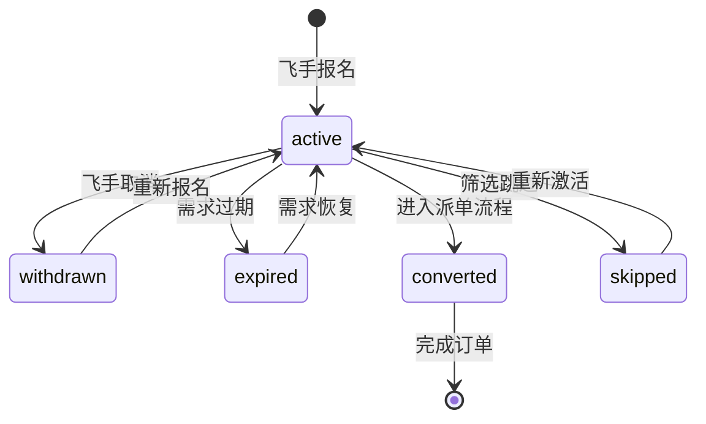
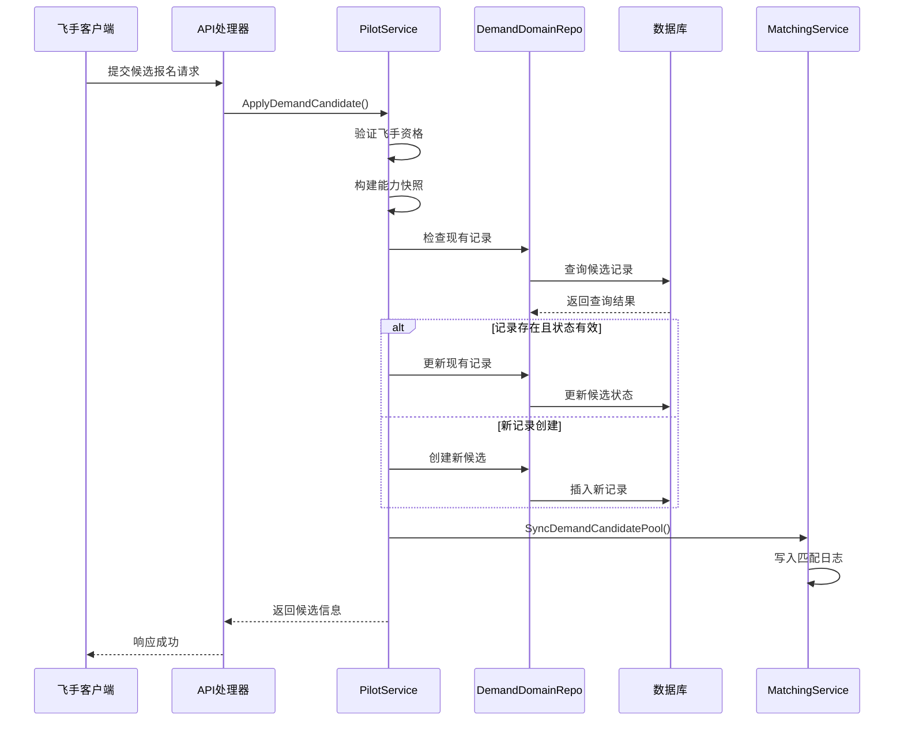
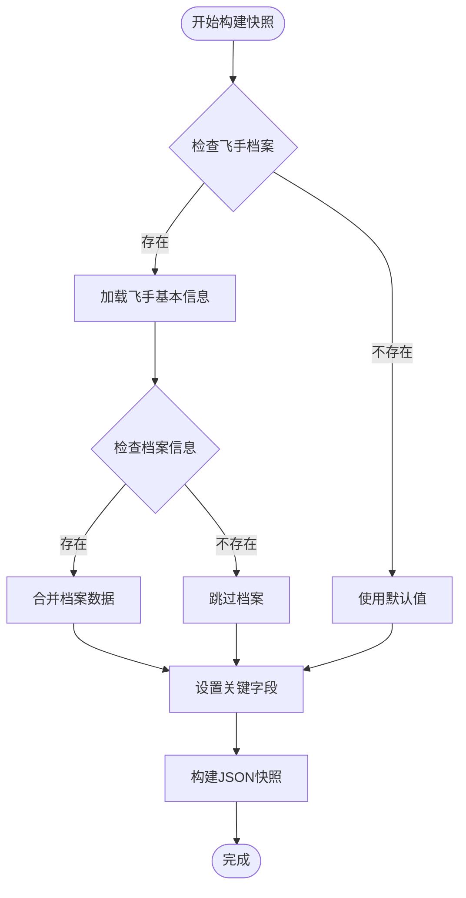
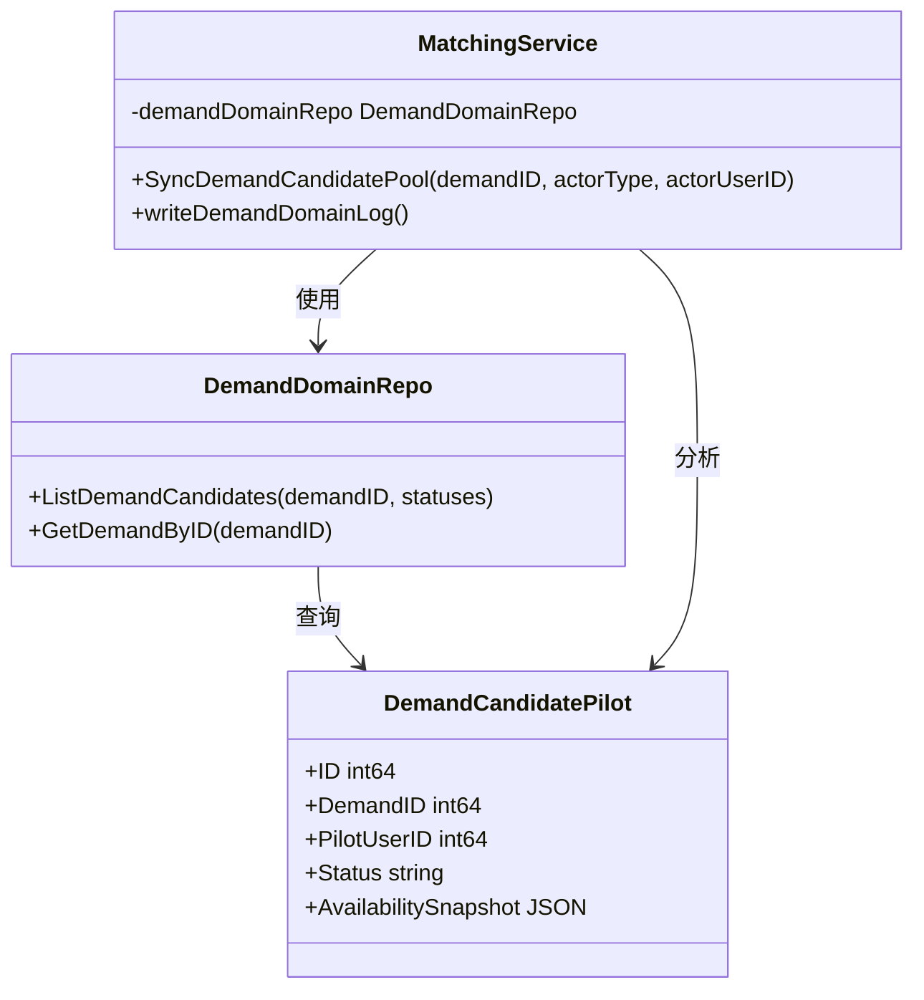
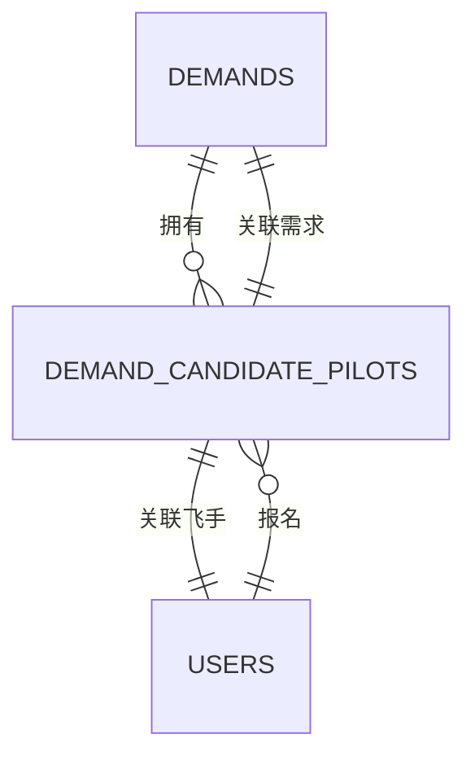
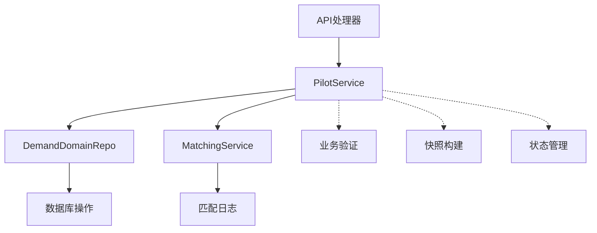

# 需求候选飞手表 (DemandCandidatePilot)

<cite>
**本文档引用的文件**
- [models.go](file://backend/internal/model/models.go)
- [pilot_service.go](file://backend/internal/service/pilot_service.go)
- [pilot_domain_repo.go](file://backend/internal/repository/pilot_domain_repo.go)
- [handler.go](file://backend/internal/api/v2/pilot/handler.go)
- [matching_service.go](file://backend/internal/service/matching_service.go)
- [103_create_demand_v2_tables.sql](file://backend/migrations/103_create_demand_v2_tables.sql)
- [BUSINESS_FIELD_DICTIONARY.md](file://BUSINESS_FIELD_DICTIONARY.md)
</cite>

## 目录
1. [简介](#简介)
2. [项目结构](#项目结构)
3. [核心组件](#核心组件)
4. [架构概览](#架构概览)
5. [详细组件分析](#详细组件分析)
6. [依赖关系分析](#依赖关系分析)
7. [性能考虑](#性能考虑)
8. [故障排除指南](#故障排除指南)
9. [结论](#结论)

## 简介

需求候选飞手表(DemandCandidatePilot)是无人机租赁平台中用于管理飞手候选报名的核心数据表。该表设计的目的在于：

- **建立飞手与需求的双向选择机制**：允许飞手主动报名参与特定需求的执行
- **维护候选池状态管理**：提供完整的候选状态生命周期管理
- **记录能力快照**：保存飞手报名时的实时服务能力信息
- **支持智能匹配**：为后续的自动化匹配和派单提供数据基础

该表通过JSON格式的availability_snapshot字段，记录飞手在报名时刻的关键能力指标，包括资质状态、服务能力范围、评分等信息，确保即使飞手后续状态发生变化，也能基于历史快照进行准确的匹配决策。

## 项目结构

```mermaid
graph TB
subgraph "数据库层"
DCP[demand_candidate_pilots 表]
DEMANDS[demands 表]
USERS[users 表]
end
subgraph "业务逻辑层"
SERVICE[PilotService]
MATCHING[MatchingService]
REPO[DemandDomainRepo]
end
subgraph "接口层"
HANDLER[API Handler]
MODEL[Model定义]
end
HANDLER --> SERVICE
SERVICE --> REPO
SERVICE --> MATCHING
REPO --> DCP
DCP <- --> DEMANDS
DCP <- --> USERS
MODEL --> DCP
```

**图表来源**
- [models.go:381-396](file://backend/internal/model/models.go#L381-L396)
- [pilot_service.go:568-641](file://backend/internal/service/pilot_service.go#L568-L641)
- [pilot_domain_repo.go:53-84](file://backend/internal/repository/pilot_domain_repo.go#L53-L84)

## 核心组件

### 数据表结构设计

需求候选飞手表采用以下核心字段设计：

| 字段名 | 类型 | 约束 | 描述 |
|--------|------|------|------|
| id | bigint | 主键, 自增 | 候选记录唯一标识 |
| demand_id | bigint | 非空, 索引 | 关联的需求ID |
| pilot_user_id | bigint | 非空, 索引 | 飞手用户ID |
| status | varchar(20) | 默认'active', 索引 | 候选状态: active, withdrawn, expired, converted, skipped |
| availability_snapshot | json | | 飞手报名时的能力快照 |
| created_at | datetime | 默认当前时间 | 创建时间 |
| updated_at | datetime | 默认当前时间, 自动更新 | 更新时间 |

### 状态管理机制

候选状态提供了完整的生命周期管理：



**图表来源**
- [BUSINESS_FIELD_DICTIONARY.md:413-425](file://BUSINESS_FIELD_DICTIONARY.md#L413-L425)

**章节来源**
- [103_create_demand_v2_tables.sql:63-77](file://backend/migrations/103_create_demand_v2_tables.sql#L63-L77)
- [models.go:381-396](file://backend/internal/model/models.go#L381-L396)

## 架构概览



**图表来源**
- [pilot_service.go:568-641](file://backend/internal/service/pilot_service.go#L568-L641)
- [pilot_domain_repo.go:53-84](file://backend/internal/repository/pilot_domain_repo.go#L53-L84)
- [matching_service.go:330-368](file://backend/internal/service/matching_service.go#L330-L368)

## 详细组件分析

### 飞手候选报名流程

#### 业务规则验证

系统在飞手报名时执行多层验证：

1. **飞手身份验证**：确认飞手已注册并通过审核
2. **需求状态检查**：验证需求处于可报名状态
3. **服务类型匹配**：确保需求属于允许飞手候选的类型
4. **时效性验证**：检查需求是否在有效期内

#### 能力快照构建



**图表来源**
- [pilot_service.go:1442-1478](file://backend/internal/service/pilot_service.go#L1442-L1478)

#### 状态转换逻辑

```mermaid
flowchart LR
Active[active状态] --> |重复报名| Active
Active --> |取消报名| Withdrawn[withdrawn状态]
Active --> |需求过期| Expired[expired状态]
Active --> |进入派单| Converted[converted状态]
Active --> |筛选跳过| Skipped[skipped状态]
Withdrawn --> |重新激活| Active
Expired --> |需求恢复| Active
Converted --> |完成订单| [*]
Skipped --> |重新激活| Active
```

**图表来源**
- [pilot_service.go:604-641](file://backend/internal/service/pilot_service.go#L604-L641)

**章节来源**
- [pilot_service.go:568-641](file://backend/internal/service/pilot_service.go#L568-L641)
- [pilot_service.go:1442-1478](file://backend/internal/service/pilot_service.go#L1442-L1478)

### 可用性快照功能

#### 快照字段结构

可用性快照记录飞手在报名时刻的关键能力指标：

| 字段名 | 类型 | 描述 |
|--------|------|------|
| pilot_user_id | number | 飞手用户ID |
| verification_status | string | 资质审核状态 |
| availability_status | string | 在线可用状态 |
| service_radius_km | number | 服务半径(km) |
| service_city | string | 服务城市 |
| caac_license_type | string | CAAC执照类型 |
| service_rating | number | 服务评分(0-5) |
| credit_score | number | 信用分数 |
| generated_at | timestamp | 快照生成时间 |

#### 快照更新机制

快照采用"报名时快照"策略，确保：
- **数据一致性**：基于固定时间点的数据，避免后续状态变化影响匹配结果
- **审计追踪**：完整记录飞手的历史能力状态
- **匹配准确性**：为智能匹配提供稳定的参考数据

**章节来源**
- [pilot_service.go:1442-1478](file://backend/internal/service/pilot_service.go#L1442-L1478)
- [BUSINESS_FIELD_DICTIONARY.md:409](file://BUSINESS_FIELD_DICTIONARY.md#L409)

### 匹配服务集成

#### 候选池同步



**图表来源**
- [matching_service.go:330-368](file://backend/internal/service/matching_service.go#L330-L368)
- [pilot_domain_repo.go:34-51](file://backend/internal/repository/pilot_domain_repo.go#L34-L51)

#### 匹配日志记录

系统自动记录候选池的状态变化，包括：
- 候选人数统计
- 活跃候选数量
- 候选状态分布
- 触发操作的用户信息

**章节来源**
- [matching_service.go:330-368](file://backend/internal/service/matching_service.go#L330-L368)

## 依赖关系分析

### 数据模型依赖



**图表来源**
- [models.go:381-396](file://backend/internal/model/models.go#L381-L396)

### 业务逻辑依赖



**图表来源**
- [handler.go:241-279](file://backend/internal/api/v2/pilot/handler.go#L241-L279)
- [pilot_service.go:568-641](file://backend/internal/service/pilot_service.go#L568-L641)

**章节来源**
- [models.go:381-396](file://backend/internal/model/models.go#L381-L396)
- [handler.go:241-279](file://backend/internal/api/v2/pilot/handler.go#L241-L279)

## 性能考虑

### 查询优化

1. **索引策略**
   - 主键索引：支持快速定位特定候选记录
   - 复合索引：优化按需求ID、飞手ID、状态的查询
   - 状态过滤：利用索引快速筛选活跃候选

2. **分页查询**
   - 默认每页20条记录
   - 支持自定义页面大小
   - 优化大数据量下的查询性能

### 缓存策略

1. **快照缓存**
   - JSON快照减少重复计算
   - 版本控制避免数据过期
   - 内存缓存提升查询速度

2. **状态缓存**
   - 候选状态统计缓存
   - 最近更新时间戳缓存
   - 统计数据定期刷新

## 故障排除指南

### 常见问题及解决方案

#### 报名失败问题

| 问题类型 | 可能原因 | 解决方案 |
|----------|----------|----------|
| 飞手未注册 | 用户档案不存在 | 提示先完成飞手注册 |
| 资质未审核 | verification_status != verified | 等待审核通过 |
| 需求状态不符 | demand.Status not in ['published','quoting'] | 检查需求状态 |
| 已报名重复 | existing.Status == 'active' | 提示已报名状态 |

#### 快照数据异常

| 异常类型 | 症状 | 处理方法 |
|----------|------|----------|
| 快照为空 | availability_snapshot为null | 重新构建快照 |
| 字段缺失 | 关键字段不完整 | 检查飞手档案完整性 |
| 时间戳错误 | generated_at异常 | 验证系统时间同步 |

**章节来源**
- [pilot_service.go:568-641](file://backend/internal/service/pilot_service.go#L568-L641)

## 结论

需求候选飞手表作为无人机租赁平台的核心数据表，通过以下关键特性实现了高效的飞手-需求匹配：

1. **完整的状态管理体系**：支持候选的全生命周期管理
2. **可靠的快照机制**：确保匹配决策的准确性
3. **灵活的查询接口**：支持多种筛选和排序需求
4. **完善的日志记录**：提供完整的审计追踪能力

该设计为平台的智能匹配和自动化派单奠定了坚实的数据基础，能够有效提升飞手与需求的匹配效率和成功率。