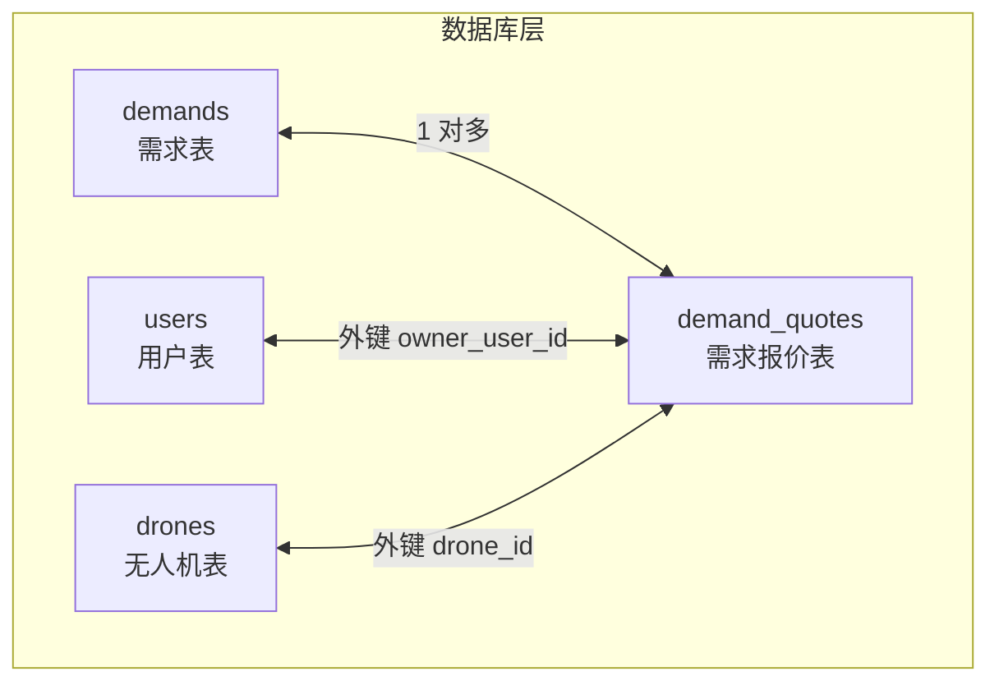
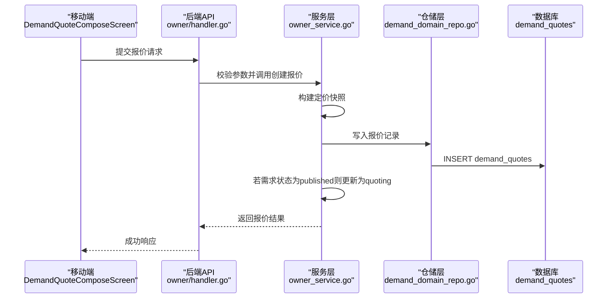
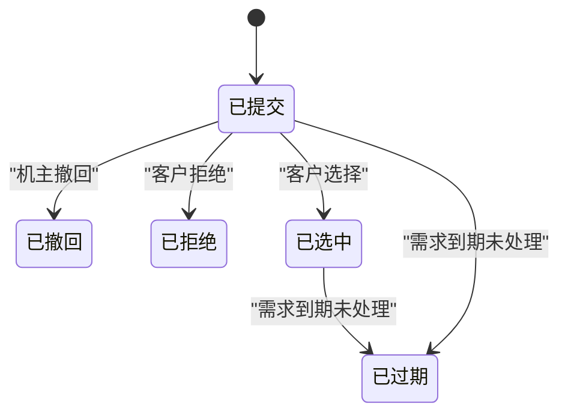
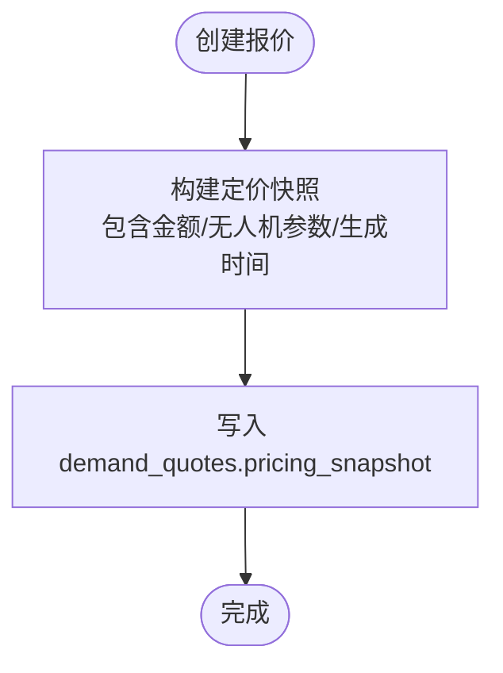
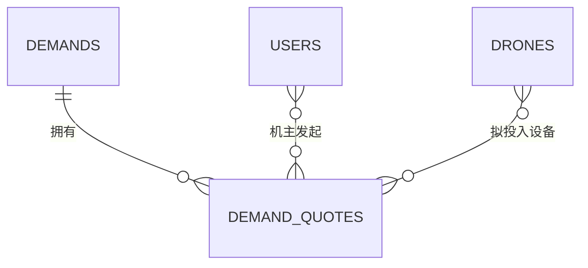
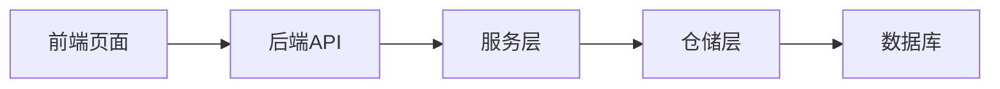

# 需求报价表 (DemandQuote)

<cite>
**本文引用的文件列表**
- [models.go](file://backend/internal/model/models.go)
- [103_create_demand_v2_tables.sql](file://backend/migrations/103_create_demand_v2_tables.sql)
- [BUSINESS_FIELD_DICTIONARY.md](file://BUSINESS_FIELD_DICTIONARY.md)
- [owner_service.go](file://backend/internal/service/owner_service.go)
- [client_demand_service.go](file://backend/internal/service/client_demand_service.go)
- [DemandQuoteComposeScreen.tsx](file://mobile/src/screens/demand/DemandQuoteComposeScreen.tsx)
- [MyQuotesScreen.tsx](file://mobile/src/screens/profile/MyQuotesScreen.tsx)
- [DemandDetailScreen.tsx](file://mobile/src/screens/demand/DemandDetailScreen.tsx)
- [demand_domain_repo.go](file://backend/internal/repository/demand_domain_repo.go)
</cite>

## 目录
1. [简介](#简介)
2. [项目结构与定位](#项目结构与定位)
3. [核心数据模型](#核心数据模型)
4. [架构总览](#架构总览)
5. [详细组件解析](#详细组件解析)
6. [依赖关系分析](#依赖关系分析)
7. [性能与扩展性考虑](#性能与扩展性考虑)
8. [故障排查指南](#故障排查指南)
9. [结论](#结论)
10. [附录：业务场景示例](#附录业务场景示例)

## 简介
本文档围绕“需求报价表（DemandQuote）”进行系统化设计说明，覆盖表结构、字段含义、生命周期、定价快照机制、与需求/机主/无人机的关联关系，以及典型业务场景（如价格竞争、服务方案对比）的处理流程。目标读者既包括技术开发人员，也包括产品与运营人员。

## 项目结构与定位
- 数据模型与约束定义位于后端模型层与数据库迁移脚本中，确保结构稳定与演进可追溯。
- 业务服务层负责报价创建、状态流转与事件通知，前端页面负责报价提交与展示。
- 本表与需求表（Demands）形成一对多关系，与机主用户（Users）及无人机（Drones）建立外键关联，支撑撮合与履约闭环。

图表来源
- [103_create_demand_v2_tables.sql:41-61](file://backend/migrations/103_create_demand_v2_tables.sql#L41-L61)
- [models.go:359-379](file://backend/internal/model/models.go#L359-L379)

章节来源
- [103_create_demand_v2_tables.sql:41-61](file://backend/migrations/103_create_demand_v2_tables.sql#L41-L61)
- [models.go:359-379](file://backend/internal/model/models.go#L359-L379)

## 核心数据模型
- 表名：demand_quotes
- 主键：id
- 关键字段与含义（以字段字典为准）：
  - quote_no：报价编号（唯一）
  - demand_id：对应需求ID（外键至demands）
  - owner_user_id：报价机主用户ID（外键至users）
  - drone_id：拟投入无人机ID（外键至drones）
  - price_amount：报价金额（单位：分）
  - pricing_snapshot：报价快照（JSON，保存报价时的价格计算依据与条件）
  - execution_plan：执行说明（文本）
  - status：报价状态（submitted/withdrawn/rejected/selected/expired）
  - created_at/updated_at：创建与更新时间

状态建议与含义：
- submitted：已提交
- withdrawn：已撤回
- rejected：已拒绝
- selected：已选中（客户选定）
- expired：已过期（需求到期未处理）

章节来源
- [BUSINESS_FIELD_DICTIONARY.md:373-397](file://BUSINESS_FIELD_DICTIONARY.md#L373-L397)
- [103_create_demand_v2_tables.sql:41-61](file://backend/migrations/103_create_demand_v2_tables.sql#L41-L61)
- [models.go:359-379](file://backend/internal/model/models.go#L359-L379)

## 架构总览
需求报价贯穿“机主报价—客户选择—订单生成”的业务闭环。前端负责报价提交与查看；后端负责报价持久化、状态变更、与需求主表联动；数据库通过外键与索引保证一致性与查询效率。

图表来源
- [DemandQuoteComposeScreen.tsx:75-109](file://mobile/src/screens/demand/DemandQuoteComposeScreen.tsx#L75-L109)
- [owner_service.go:381-420](file://backend/internal/service/owner_service.go#L381-L420)
- [demand_domain_repo.go:1-200](file://backend/internal/repository/demand_domain_repo.go#L1-L200)

章节来源
- [DemandQuoteComposeScreen.tsx:75-109](file://mobile/src/screens/demand/DemandQuoteComposeScreen.tsx#L75-L109)
- [owner_service.go:381-420](file://backend/internal/service/owner_service.go#L381-L420)
- [demand_domain_repo.go:1-200](file://backend/internal/repository/demand_domain_repo.go#L1-L200)

## 详细组件解析

### 1) 表结构与索引设计
- 主键与唯一约束：id自增主键；quote_no唯一，便于外部识别与幂等。
- 外键约束：
  - demand_id → demands(id)：确保报价归属有效需求。
  - owner_user_id → users(id)：确保报价机主为有效用户。
  - drone_id → drones(id)：确保拟投入设备有效。
- 索引设计：
  - 对 demand_id、owner_user_id、drone_id、status 建立索引，支撑常见查询与过滤。
- JSON字段：pricing_snapshot用于保存报价时的价格构成与条件，便于审计与复现。

章节来源
- [103_create_demand_v2_tables.sql:41-61](file://backend/migrations/103_create_demand_v2_tables.sql#L41-L61)
- [models.go:359-379](file://backend/internal/model/models.go#L359-L379)

### 2) 报价生命周期与状态机
- 提交：机主提交报价，状态为submitted；若需求状态为published，则更新为quoting。
- 选择：客户在需求详情页选择报价，触发需求状态转换为converted_to_order，并记录selected_quote_id与selected_provider_user_id。
- 其他状态：withdrawn（撤回）、rejected（拒绝）、expired（过期）由系统或业务规则驱动。

图表来源
- [BUSINESS_FIELD_DICTIONARY.md:391-397](file://BUSINESS_FIELD_DICTIONARY.md#L391-L397)
- [client_demand_service.go:326-453](file://backend/internal/service/client_demand_service.go#L326-L453)

章节来源
- [BUSINESS_FIELD_DICTIONARY.md:391-397](file://BUSINESS_FIELD_DICTIONARY.md#L391-L397)
- [client_demand_service.go:326-453](file://backend/internal/service/client_demand_service.go#L326-L453)

### 3) 定价快照机制
- 触发时机：创建报价时，服务层构建定价快照并写入pricing_snapshot。
- 快照内容：包含报价金额、无人机ID、最大起飞重量、有效载荷、最大航程等关键参数，以及生成时间。
- 作用：确保未来审计、复核与争议处理时，能还原报价时的真实条件与计算依据。

图表来源
- [owner_service.go:748-757](file://backend/internal/service/owner_service.go#L748-L757)

章节来源
- [owner_service.go:748-757](file://backend/internal/service/owner_service.go#L748-L757)

### 4) 与需求/机主/无人机的关联
- 与需求（Demands）：一对多关系，一个需求可有多个报价；客户选择后更新需求的selected_quote_id与selected_provider_user_id。
- 与机主（Users）：通过owner_user_id关联，体现报价发起者。
- 与无人机（Drones）：通过drone_id关联，体现拟投入设备。

图表来源
- [103_create_demand_v2_tables.sql:41-61](file://backend/migrations/103_create_demand_v2_tables.sql#L41-L61)
- [models.go:359-379](file://backend/internal/model/models.go#L359-L379)

章节来源
- [103_create_demand_v2_tables.sql:41-61](file://backend/migrations/103_create_demand_v2_tables.sql#L41-L61)
- [models.go:359-379](file://backend/internal/model/models.go#L359-L379)

### 5) 前端交互与展示
- 报价提交：机主在“提交报价”页面选择无人机、输入金额（元）、填写执行方案，提交后弹窗提示。
- 我的报价：机主可在“我的报价”页面查看所有报价及其状态、关联需求与执行设备。
- 需求详情：客户在需求详情页可查看报价列表，进行选择并生成订单。

章节来源
- [DemandQuoteComposeScreen.tsx:75-109](file://mobile/src/screens/demand/DemandQuoteComposeScreen.tsx#L75-L109)
- [MyQuotesScreen.tsx:31-101](file://mobile/src/screens/profile/MyQuotesScreen.tsx#L31-L101)
- [DemandDetailScreen.tsx:78-136](file://mobile/src/screens/demand/DemandDetailScreen.tsx#L78-L136)

## 依赖关系分析
- 服务层依赖仓储层进行数据持久化与查询。
- 业务服务在创建报价时构建定价快照，在客户选择报价时更新需求状态并生成订单。
- 前端通过API与后端交互，完成报价提交与查看。

图表来源
- [DemandQuoteComposeScreen.tsx:75-109](file://mobile/src/screens/demand/DemandQuoteComposeScreen.tsx#L75-L109)
- [owner_service.go:381-420](file://backend/internal/service/owner_service.go#L381-L420)
- [demand_domain_repo.go:1-200](file://backend/internal/repository/demand_domain_repo.go#L1-L200)

章节来源
- [DemandQuoteComposeScreen.tsx:75-109](file://mobile/src/screens/demand/DemandQuoteComposeScreen.tsx#L75-L109)
- [owner_service.go:381-420](file://backend/internal/service/owner_service.go#L381-L420)
- [demand_domain_repo.go:1-200](file://backend/internal/repository/demand_domain_repo.go#L1-L200)

## 性能与扩展性考虑
- 索引优化：对demand_id、owner_user_id、drone_id、status建立索引，提升查询与过滤性能。
- JSON字段：pricing_snapshot为JSON，建议控制快照体量，避免过大影响IO与备份。
- 状态机：通过需求主表状态与报价状态联动，减少跨表复杂度，利于扩展新的匹配/排序策略。
- 幂等性：报价编号quote_no唯一，可用于前端幂等提交与后端去重。

[本节为通用建议，无需特定文件引用]

## 故障排查指南
- 报价无法提交
  - 检查无人机是否满足准入与可用性要求（服务层校验）。
  - 检查前端输入金额是否为正数、无人机是否选择。
- 报价状态异常
  - 核对需求状态是否为published/quoting，报价状态是否正确流转。
  - 检查定价快照是否正常写入。
- 客户无法选择报价
  - 确认需求状态为quoting/selected，且报价状态为submitted/selected。
  - 检查服务层选择报价流程是否成功更新需求与订单状态。

章节来源
- [owner_service.go:766-771](file://backend/internal/service/owner_service.go#L766-L771)
- [DemandQuoteComposeScreen.tsx:75-109](file://mobile/src/screens/demand/DemandQuoteComposeScreen.tsx#L75-L109)
- [client_demand_service.go:326-453](file://backend/internal/service/client_demand_service.go#L326-L453)

## 结论
需求报价表（DemandQuote）通过清晰的字段设计、完善的索引与外键约束、严谨的定价快照机制与完整状态机，支撑了从机主报价到客户选择再到订单生成的全流程。其与需求、机主、无人机的关联关系明确，便于后续扩展匹配算法与风控策略。

[本节为总结性内容，无需特定文件引用]

## 附录：业务场景示例

### 场景一：价格竞争
- 多个机主对同一需求提交报价，客户在需求详情页比较不同报价的金额与执行方案。
- 客户选择最优报价后，需求状态变为converted_to_order，系统生成订单并通知相关方。

章节来源
- [DemandDetailScreen.tsx:78-136](file://mobile/src/screens/demand/DemandDetailScreen.tsx#L78-L136)
- [client_demand_service.go:326-453](file://backend/internal/service/client_demand_service.go#L326-L453)

### 场景二：服务方案对比
- 不同机主可能提供不同的执行方案（如架次、保障措施、时间窗口），客户结合报价金额与执行说明进行综合评估。
- 前端展示报价金额与执行方案摘要，辅助决策。

章节来源
- [DemandQuoteComposeScreen.tsx:174-187](file://mobile/src/screens/demand/DemandQuoteComposeScreen.tsx#L174-L187)
- [MyQuotesScreen.tsx:69-101](file://mobile/src/screens/profile/MyQuotesScreen.tsx#L69-L101)