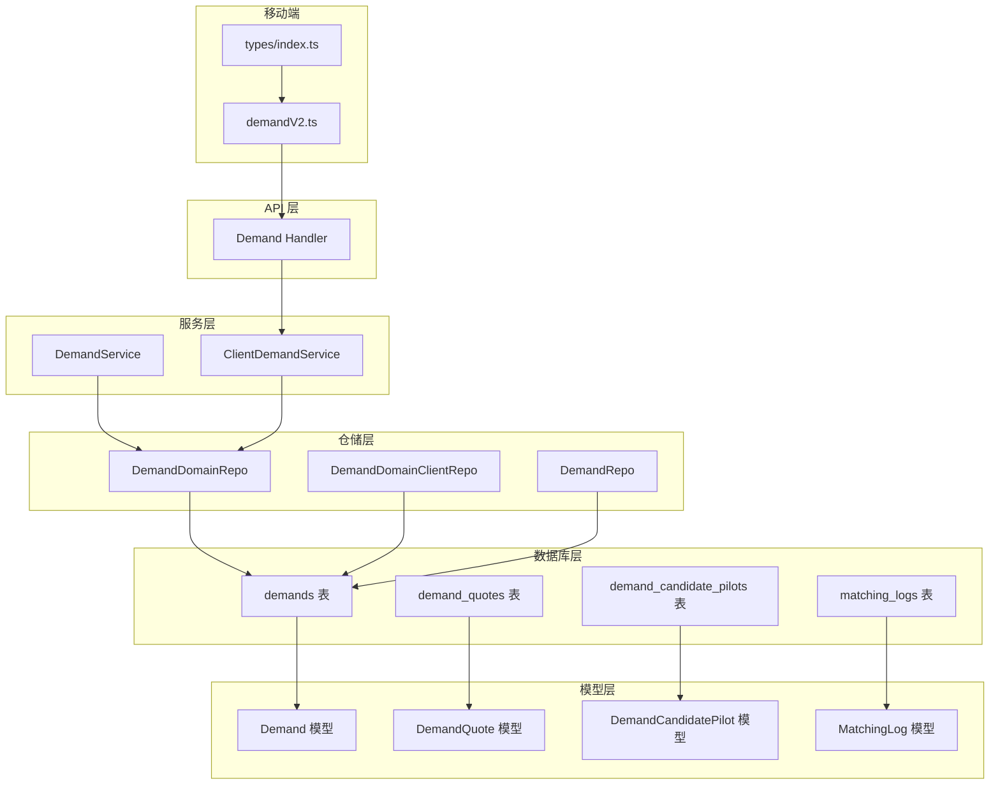
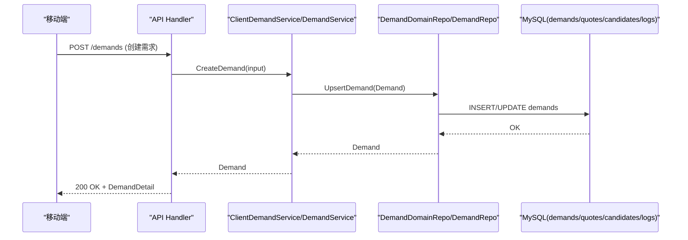
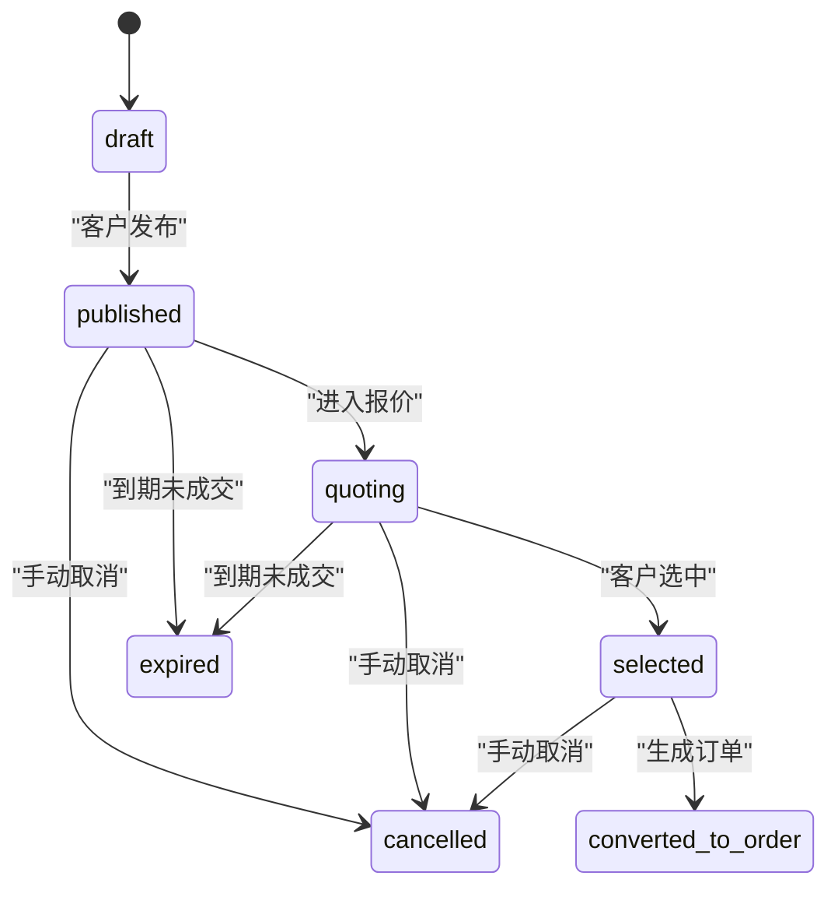
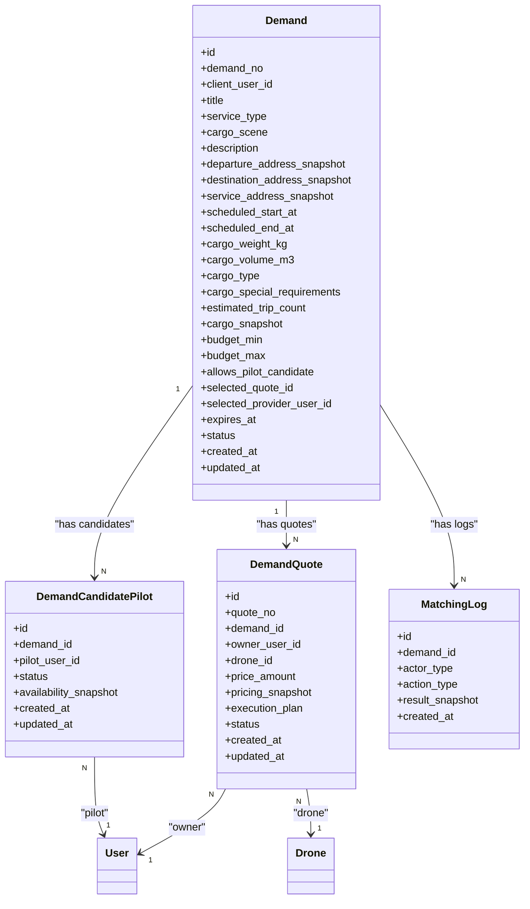

# 需求管理表

<cite>
**本文引用的文件列表**
- [103_create_demand_v2_tables.sql](file://backend/migrations/103_create_demand_v2_tables.sql)
- [models.go](file://backend/internal/model/models.go)
- [demand_domain_repo.go](file://backend/internal/repository/demand_domain_repo.go)
- [demand_domain_client_repo.go](file://backend/internal/repository/demand_domain_client_repo.go)
- [demand_repo.go](file://backend/internal/repository/demand_repo.go)
- [demand_service.go](file://backend/internal/service/demand_service.go)
- [client_demand_service.go](file://backend/internal/service/client_demand_service.go)
- [handler.go](file://backend/internal/api/v2/demand/handler.go)
- [demandV2.ts](file://mobile/src/services/demandV2.ts)
- [index.ts](file://mobile/src/types/index.ts)
- [911_phase9_backfill_v2_data.sql](file://backend/migrations/911_phase9_backfill_v2_data.sql)
- [phase10_role_acceptance.sh](file://backend/scripts/phase10_role_acceptance.sh)
</cite>

## 目录
1. [简介](#简介)
2. [项目结构](#项目结构)
3. [核心组件](#核心组件)
4. [架构总览](#架构总览)
5. [详细组件分析](#详细组件分析)
6. [依赖关系分析](#依赖关系分析)
7. [性能考量](#性能考量)
8. [故障排查指南](#故障排查指南)
9. [结论](#结论)
10. [附录](#附录)

## 简介
本文件面向无人机租赁平台的需求管理模块，聚焦 v2 需求体系中的核心表结构与业务流程，包括：
- 需求表 demands 的字段设计与业务含义
- 货运需求与租赁需求的历史回填策略
- 需求状态管理机制（draft、published、quoting、selected、converted_to_order、expired、cancelled）
- 需求与用户、客户、地址等实体的关联关系
- 实际业务场景示例与差异对比

## 项目结构
需求管理模块由“迁移脚本”“领域模型”“仓储层”“服务层”“API 层”“移动端接口”共同组成，形成完整的 v2 需求生命周期闭环。

图表来源
- [103_create_demand_v2_tables.sql:5-91](file://backend/migrations/103_create_demand_v2_tables.sql#L5-L91)
- [models.go:323-411](file://backend/internal/model/models.go#L323-L411)
- [demand_domain_repo.go:16-326](file://backend/internal/repository/demand_domain_repo.go#L16-L326)
- [demand_domain_client_repo.go:13-225](file://backend/internal/repository/demand_domain_client_repo.go#L13-L225)
- [demand_repo.go:9-216](file://backend/internal/repository/demand_repo.go#L9-L216)
- [demand_service.go:13-343](file://backend/internal/service/demand_service.go#L13-L343)
- [client_demand_service.go:193-242](file://backend/internal/service/client_demand_service.go#L193-L242)
- [handler.go:16-410](file://backend/internal/api/v2/demand/handler.go#L16-L410)
- [demandV2.ts:1-84](file://mobile/src/services/demandV2.ts#L1-L84)
- [index.ts:457-492](file://mobile/src/types/index.ts#L457-L492)

章节来源
- [103_create_demand_v2_tables.sql:5-91](file://backend/migrations/103_create_demand_v2_tables.sql#L5-L91)
- [models.go:323-411](file://backend/internal/model/models.go#L323-L411)

## 核心组件
- demands 表：v2 客户公开需求表，承载需求发布、报价、候选飞手、匹配日志等全链路数据。
- demand_quotes 表：需求报价表，记录机主对需求的报价与状态。
- demand_candidate_pilots 表：需求候选飞手池，记录飞手对需求的报名与状态。
- matching_logs 表：匹配日志表，记录系统或人工触发的推荐/排序等动作。

章节来源
- [103_create_demand_v2_tables.sql:5-91](file://backend/migrations/103_create_demand_v2_tables.sql#L5-L91)
- [models.go:323-411](file://backend/internal/model/models.go#L323-L411)

## 架构总览
v2 需求从“移动端/客户端输入”到“数据库持久化”，再到“服务层处理与状态推进”，最后通过 API 返回给前端。历史数据通过迁移脚本回填至 demands 表，确保兼容性。

图表来源
- [handler.go:24-49](file://backend/internal/api/v2/demand/handler.go#L24-L49)
- [demand_service.go:118-140](file://backend/internal/service/demand_service.go#L118-L140)
- [demand_domain_repo.go:65-81](file://backend/internal/repository/demand_domain_repo.go#L65-L81)
- [103_create_demand_v2_tables.sql:5-39](file://backend/migrations/103_create_demand_v2_tables.sql#L5-L39)

## 详细组件分析

### 表结构设计：demands（v2 需求）
- 主键与唯一标识
  - id：自增主键
  - demand_no：全局唯一需求编号，用于历史回填与跨系统识别
- 关联关系
  - client_user_id：客户账号 ID，外键关联 users 表
- 标题与描述
  - title：需求标题
  - description：需求描述
- 服务与场景
  - service_type：服务类型（如 heavy_cargo_lift_transport）
  - cargo_scene：货物场景（如 grid_power_material_transport）
- 地理位置快照
  - departure_address_snapshot：出发地快照（JSON：text、经纬度、城市等）
  - destination_address_snapshot：目的地快照（JSON）
  - service_address_snapshot：作业地快照（JSON）
- 时间窗口
  - scheduled_start_at / scheduled_end_at：预约起止时间
  - expires_at：需求有效期截止时间
- 货物信息
  - cargo_weight_kg / cargo_volume_m3：货物重量与体积
  - cargo_type：货物类型
  - cargo_special_requirements：特殊要求
  - estimated_trip_count：预计架次
  - cargo_snapshot：货物/任务快照（JSON，含历史来源标记）
- 预算
  - budget_min / budget_max：预算上下限（单位：分）
- 报价与飞手
  - allows_pilot_candidate：是否允许飞手候选
  - selected_quote_id / selected_provider_user_id：已选报价与机主
- 状态与审计
  - status：需求状态（draft/published/quoting/selected/converted_to_order/expired/cancelled）
  - created_at / updated_at：创建与更新时间戳

索引与约束
- client_user_id、status、cargo_scene、expires_at 上建立索引
- 外键约束：client_user_id -> users(id)（级联删除）

章节来源
- [103_create_demand_v2_tables.sql:5-39](file://backend/migrations/103_create_demand_v2_tables.sql#L5-L39)
- [models.go:323-353](file://backend/internal/model/models.go#L323-L353)

### 表结构设计：demand_quotes（需求报价）
- 主键与唯一标识
  - id：自增主键
  - quote_no：报价编号（全局唯一）
- 关联关系
  - demand_id：关联需求 ID，外键 demands(id)
  - owner_user_id：机主账号 ID，外键 users(id)
  - drone_id：拟投入无人机 ID，外键 drones(id)
- 报价与执行
  - price_amount：报价金额（分）
  - pricing_snapshot：报价快照（JSON）
  - execution_plan：执行说明（文本）
- 状态与审计
  - status：submitted/withdrawn/rejected/selected/expired
  - created_at / updated_at

索引与约束
- demand_id、owner_user_id、drone_id、status 建索引
- 外键约束：demand_id -> demands(id)、owner_user_id -> users(id)、drone_id -> drones(id)

章节来源
- [103_create_demand_v2_tables.sql:41-61](file://backend/migrations/103_create_demand_v2_tables.sql#L41-L61)
- [models.go:359-375](file://backend/internal/model/models.go#L359-L375)

### 表结构设计：demand_candidate_pilots（候选飞手池）
- 主键与唯一标识
  - id：自增主键
- 关联关系
  - demand_id：关联需求 ID，外键 demands(id)
  - pilot_user_id：飞手账号 ID，外键 users(id)
- 能力快照与状态
  - availability_snapshot：报名时能力快照（JSON）
  - status：active/withdrawn/expired/converted/skipped
- 审计
  - created_at / updated_at

索引与约束
- demand_id、pilot_user_id、status 建索引
- 外键约束：demand_id -> demands(id)、pilot_user_id -> users(id)

章节来源
- [103_create_demand_v2_tables.sql:63-77](file://backend/migrations/103_create_demand_v2_tables.sql#L63-L77)
- [models.go:381-392](file://backend/internal/model/models.go#L381-L392)

### 表结构设计：matching_logs（匹配日志）
- 主键与唯一标识
  - id：自增主键
- 关联关系
  - demand_id：关联需求 ID，外键 demands(id)
- 动作与结果
  - actor_type：触发方（system/client/owner/pilot）
  - action_type：动作类型（recommend_owner/quote_rank/candidate_rank/auto_push）
  - result_snapshot：结果快照（JSON）
- 审计
  - created_at

索引与约束
- demand_id、actor_type、action_type 建索引
- 外键约束：demand_id -> demands(id)

章节来源
- [103_create_demand_v2_tables.sql:79-91](file://backend/migrations/103_create_demand_v2_tables.sql#L79-L91)
- [models.go:398-407](file://backend/internal/model/models.go#L398-L407)

### 历史回填：rental_demands 与 cargo_demands
- 回填目标
  - 将 legacy 表 rental_demands 与 cargo_demands 的数据回填至 demands 表
- 回填策略
  - demand_no 使用约定格式（DMRLEGACY/DMCLEGACY + legacyID）
  - 地址快照采用 JSON 结构，包含 text、经纬度、城市等
  - 货物快照包含 legacy 来源类型、legacy 源 ID、必要特征、紧急度等
  - 状态映射：legacy 状态到 v2 状态（如 quoting/selected/converted_to_order/expired/cancelled）
- 迁移脚本
  - 通过 INSERT INTO ... SELECT FROM ... 完成批量回填
  - 对 legacy matching_records 同步回填 matching_logs

章节来源
- [103_create_demand_v2_tables.sql:93-296](file://backend/migrations/103_create_demand_v2_tables.sql#L93-L296)
- [911_phase9_backfill_v2_data.sql:313-335](file://backend/migrations/911_phase9_backfill_v2_data.sql#L313-L335)
- [demand_domain_repo.go:99-202](file://backend/internal/repository/demand_domain_repo.go#L99-L202)

### 需求状态管理机制
- 状态集合
  - draft：草稿（默认）
  - published：已发布（可被匹配）
  - quoting：报价中（等待机主报价）
  - selected：已选中（客户选择报价）
  - converted_to_order：已转订单（下单成功）
  - expired：已过期（系统自动关闭）
  - cancelled：已取消（手动或系统）
- 状态流转
  - draft -> published：客户发布需求
  - published -> quoting：进入报价阶段
  - quoting -> selected：客户选择报价
  - selected -> converted_to_order：生成订单
  - published/quoting -> expired：到期未成交
  - 其他 -> cancelled：手动取消
- 自动过期
  - ClientDemandService 提供 CloseExpiredDemands，扫描到期需求并批量关闭

图表来源
- [handler.go:83-133](file://backend/internal/api/v2/demand/handler.go#L83-L133)
- [client_demand_service.go:193-242](file://backend/internal/service/client_demand_service.go#L193-L242)
- [demand_domain_repo.go:252-269](file://backend/internal/repository/demand_domain_repo.go#L252-L269)

章节来源
- [handler.go:83-133](file://backend/internal/api/v2/demand/handler.go#L83-L133)
- [client_demand_service.go:193-242](file://backend/internal/service/client_demand_service.go#L193-L242)
- [demand_domain_repo.go:252-269](file://backend/internal/repository/demand_domain_repo.go#L252-L269)

### 需求与用户、客户、地址等实体的关系
- 与用户（users）的关系
  - demands.client_user_id -> users(id)
  - demand_quotes.owner_user_id -> users(id)
  - demand_candidate_pilots.pilot_user_id -> users(id)
- 与客户（client_profiles）的关系
  - 通过 client_user_id 间接关联到客户资料
- 与无人机（drones）的关系
  - demand_quotes.drone_id -> drones(id)
- 地址与快照
  - departure/destination/service_address_snapshot 以 JSON 存储地址文本、经纬度、城市等
- 移动端类型
  - AddressSnapshot、DemandDetail、DemandSummary 等类型定义了前端消费的数据结构

章节来源
- [103_create_demand_v2_tables.sql:38-61](file://backend/migrations/103_create_demand_v2_tables.sql#L38-L61)
- [models.go:323-411](file://backend/internal/model/models.go#L323-L411)
- [index.ts:335-492](file://mobile/src/types/index.ts#L335-L492)

### 字段设计思路与业务要点
- 时间字段
  - scheduled_start_at/scheduled_end_at：明确作业窗口；expires_at 控制有效期
- 预算字段
  - budget_min/budget_max：支持价格区间；报价表 price_amount 为最终落定价格
- 地址快照
  - 采用 JSON 结构便于扩展，同时保留 text、经纬度、城市等关键信息
- 货物信息
  - cargo_weight_kg/cargo_volume_m3/cargo_type/cargo_special_requirements/estimated_trip_count/cargo_snapshot：全面覆盖重载运输场景
- 飞手候选
  - allows_pilot_candidate 控制是否开放飞手报名；candidate_pilots 记录报名与状态
- 历史兼容
  - legacy 回填时将历史字段映射到新的 JSON 快照中，保证查询与展示一致

章节来源
- [103_create_demand_v2_tables.sql:13-29](file://backend/migrations/103_create_demand_v2_tables.sql#L13-L29)
- [models.go:323-353](file://backend/internal/model/models.go#L323-L353)
- [demand_domain_repo.go:99-202](file://backend/internal/repository/demand_domain_repo.go#L99-L202)

### 业务场景示例与差异对比
- 场景一：电力塔材吊运
  - 适用 cargo_scene：grid_power_material_transport
  - 货物：重量/体积/类型明确，特殊要求（山地工况、重载吊运）
  - 时间：起止时间明确，有效期控制
  - 预算：min/max 设定，报价表最终落价
- 场景二：普通重载运输
  - 适用 cargo_scene：other_heavy_lift
  - 货物：重量/体积/类型，可能无特殊要求
  - 时间：起止时间与有效期
- 差异对比
  - legacy rental_demands 与 cargo_demands 的字段差异较大，v2 通过统一的 JSON 快照与标准化字段进行收敛
  - legacy matching_records 的回填映射到 matching_logs，保留匹配分数、原因与状态

章节来源
- [phase10_role_acceptance.sh:294-329](file://backend/scripts/phase10_role_acceptance.sh#L294-L329)
- [103_create_demand_v2_tables.sql:93-296](file://backend/migrations/103_create_demand_v2_tables.sql#L93-L296)
- [demand_domain_repo.go:204-229](file://backend/internal/repository/demand_domain_repo.go#L204-L229)

## 依赖关系分析

图表来源
- [models.go:323-411](file://backend/internal/model/models.go#L323-L411)

章节来源
- [models.go:323-411](file://backend/internal/model/models.go#L323-L411)

## 性能考量
- 索引策略
  - demands 表：client_user_id、status、cargo_scene、expires_at 建立索引，支撑按客户、状态、场景、到期筛选
  - quotes/candidates/logs 表：按 demand_id、status 等维度建立索引，提升查询与统计效率
- 查询优化
  - 列表接口优先使用索引列过滤，避免全表扫描
  - 统计类查询（报价数、候选飞手数）通过分组聚合实现
- 写入优化
  - 批量回填使用 INSERT INTO ... SELECT FROM，减少网络往返
  - 事务包裹关键写入操作，保证一致性

[本节为通用指导，无需特定文件来源]

## 故障排查指南
- 发布/更新需求失败
  - 检查移动端请求体字段是否符合 v2 规范（如 service_type、cargo_scene、地址快照）
  - 查看 API 层错误响应与服务层异常日志
- 需求状态异常
  - 检查 CloseExpiredDemands 是否正常运行，确认到期需求被正确关闭
  - 核对 legacy 状态映射逻辑，确保历史回填后的状态一致
- 报价与飞手统计异常
  - 确认 quotes/candidates 表 status 字段是否正确更新
  - 使用仓储层提供的统计方法核对数量

章节来源
- [handler.go:24-49](file://backend/internal/api/v2/demand/handler.go#L24-L49)
- [client_demand_service.go:193-242](file://backend/internal/service/client_demand_service.go#L193-L242)
- [demand_domain_client_repo.go:90-140](file://backend/internal/repository/demand_domain_client_repo.go#L90-L140)

## 结论
v2 需求表以统一的字段与 JSON 快照为核心，实现了对历史数据的平滑迁移与对新业务场景的灵活扩展。通过完善的索引、状态机与自动化过期机制，平台能够高效地支撑客户发布、机主报价、飞手报名与订单转化的完整流程。

[本节为总结性内容，无需特定文件来源]

## 附录

### 字段对照与移动端类型
- 地址快照：AddressSnapshot（text、经纬度、城市等）
- 需求详情：DemandDetail（含 departure/destination/service_address、cargo_*、预算、有效期、状态等）
- 需求摘要：DemandSummary（含 quote_count、candidate_pilot_count、my_quote、my_candidate 等）

章节来源
- [index.ts:335-492](file://mobile/src/types/index.ts#L335-L492)
- [demandV2.ts:21-40](file://mobile/src/services/demandV2.ts#L21-L40)