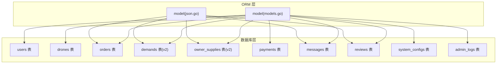
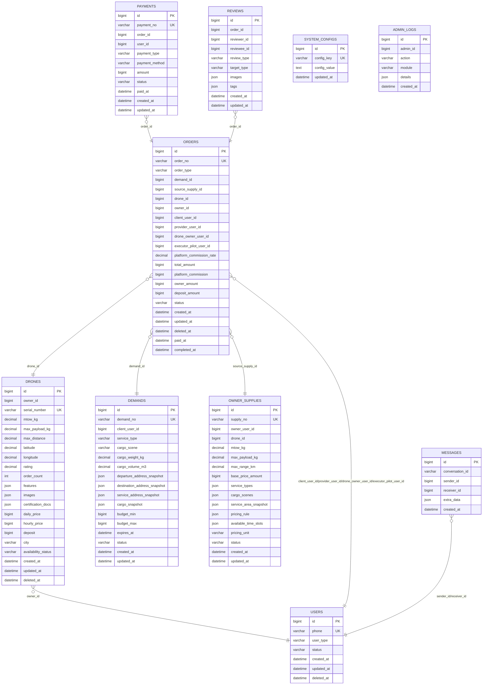
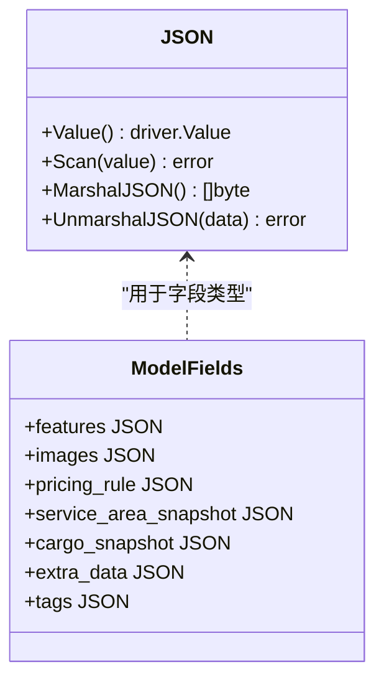
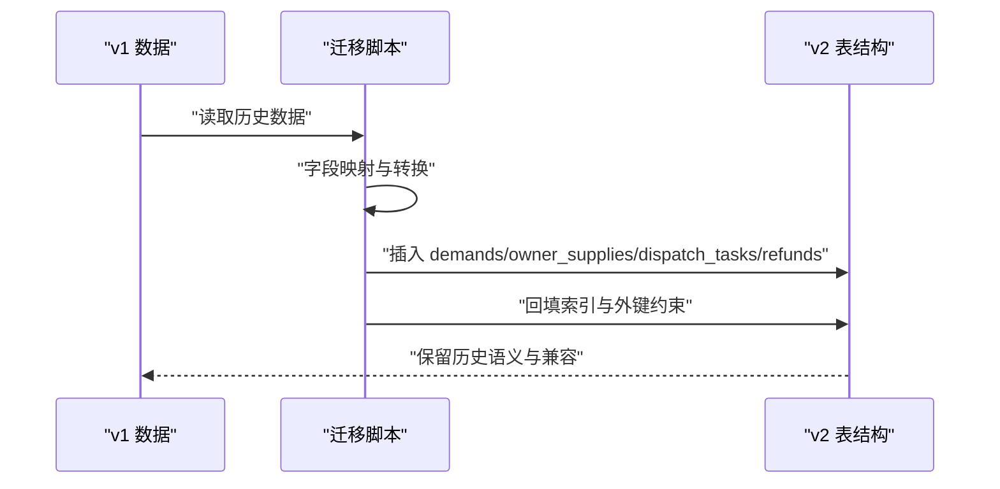
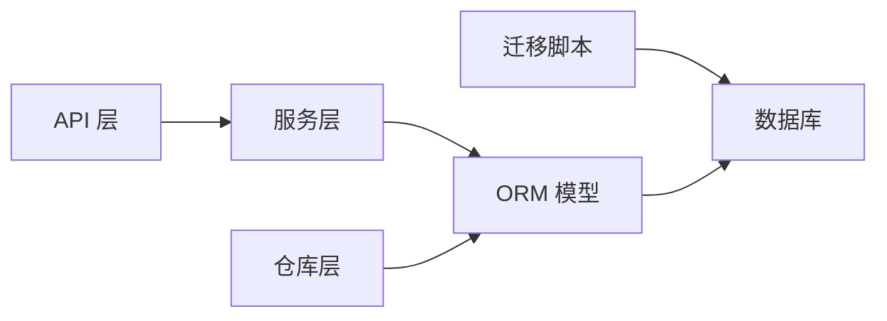

# 数据类型与约束

<cite>
**本文引用的文件**
- [001_init_schema.sql](file://backend/migrations/001_init_schema.sql)
- [103_create_demand_v2_tables.sql](file://backend/migrations/103_create_demand_v2_tables.sql)
- [104_extend_orders_for_v2_sources.sql](file://backend/migrations/104_extend_orders_for_v2_sources.sql)
- [105_create_order_artifacts.sql](file://backend/migrations/105_create_order_artifacts.sql)
- [106_split_dispatch_pool_and_formal_dispatch.sql](file://backend/migrations/106_split_dispatch_pool_and_formal_dispatch.sql)
- [models.go](file://backend/internal/model/models.go)
- [json.go](file://backend/internal/model/json.go)
- [API_V1_V2_DIFF.md](file://backend/docs/API_V1_V2_DIFF.md)
</cite>

## 目录
1. [简介](#简介)
2. [项目结构](#项目结构)
3. [核心组件](#核心组件)
4. [架构总览](#架构总览)
5. [详细组件分析](#详细组件分析)
6. [依赖分析](#依赖分析)
7. [性能考量](#性能考量)
8. [故障排查指南](#故障排查指南)
9. [结论](#结论)
10. [附录](#附录)

## 简介
本文件面向无人机租赁平台的数据库与模型层，系统梳理数据类型与约束设计，覆盖如下主题：
- 特殊数据类型：JSON、decimal、timestamp 的使用与精度控制
- 字段约束：唯一性、非空、默认值、检查约束、外键约束
- 索引策略：单列索引、复合索引、唯一索引、外键索引
- 数据验证规则：业务规则、格式校验、取值范围控制
- v1 到 v2 的变更：数据类型与约束演进、向后兼容与迁移策略

## 项目结构
数据库层采用 SQL 迁移脚本定义表结构与约束，ORM 层通过 Go 结构体映射字段类型与约束，配合 JSON 类型处理灵活元数据。

图表来源
- [models.go](file://backend/internal/model/models.go)
- [json.go](file://backend/internal/model/json.go)
- [001_init_schema.sql](file://backend/migrations/001_init_schema.sql)

章节来源
- [models.go](file://backend/internal/model/models.go)
- [json.go](file://backend/internal/model/json.go)
- [001_init_schema.sql](file://backend/migrations/001_init_schema.sql)

## 核心组件
- JSON 类型：用于存储灵活的配置、快照、元数据与多态内容，统一通过自定义 JSON 类型进行序列化/反序列化与扫描。
- decimal 类型：用于价格、费率、重量、体积、经纬度等高精度数值，确保金融与地理计算的准确性。
- timestamp 类型：统一使用带毫秒精度的时间戳字段，支持创建、更新、删除时间以及业务关键时间点。
- 约束与索引：通过唯一索引保证关键字段唯一性，通过普通索引与复合索引支撑高频查询与关联查询。

章节来源
- [models.go](file://backend/internal/model/models.go)
- [json.go](file://backend/internal/model/json.go)
- [001_init_schema.sql](file://backend/migrations/001_init_schema.sql)

## 架构总览
v2 引入独立的“需求/供给/订单/派单/飞行记录”语义，同时保留 v1 历史数据的兼容与回填路径，ORM 层通过统一的 JSON 类型与 decimal 字段承载灵活与精确的业务数据。

图表来源
- [models.go](file://backend/internal/model/models.go)
- [001_init_schema.sql](file://backend/migrations/001_init_schema.sql)

章节来源
- [models.go](file://backend/internal/model/models.go)
- [001_init_schema.sql](file://backend/migrations/001_init_schema.sql)

## 详细组件分析

### JSON 类型设计与约束
- 设计原则
  - 使用统一的 JSON 自定义类型，确保数据库与应用层一致的序列化/反序列化行为。
  - 对空 JSON 值进行显式处理，避免无效或错误的 JSON 文本。
  - 通过迁移脚本与 ORM 字段注解，限定 JSON 列的使用范围与默认值策略。
- 应用范围
  - 需求/供给/订单/消息/评价等实体中的快照、配置、元数据字段。
- 约束与校验
  - JSON 字段本身不强制结构校验，业务层通过解析与断言保障结构一致性。
  - 对于必填 JSON 字段，通过默认空对象或数组的方式降低解析风险。

图表来源
- [json.go](file://backend/internal/model/json.go)
- [models.go](file://backend/internal/model/models.go)

章节来源
- [json.go](file://backend/internal/model/json.go)
- [models.go](file://backend/internal/model/models.go)

### decimal 类型设计与约束
- 设计原则
  - 价格、费率、重量、体积、经纬度等高精度数值统一使用 decimal，避免浮点误差。
  - 金额类字段采用“分”为单位的整型存储，decimal 用于比率与系数。
- 典型字段
  - 价格与费用：每日/每小时价格、押金、总金额、平台佣金、机主分成。
  - 几何与地理：最大起飞重量、有效载荷、最大航程、经纬度、体积、重量。
- 约束与校验
  - 金额类字段通常设置默认值 0，避免空值导致的计算异常。
  - 比率类字段设置合理的小数位，确保业务计算精度。

章节来源
- [models.go](file://backend/internal/model/models.go)
- [001_init_schema.sql](file://backend/migrations/001_init_schema.sql)

### timestamp 类型设计与约束
- 设计原则
  - 使用带毫秒精度的时间戳字段，统一记录创建、更新、删除与业务关键时间点。
  - 删除标记采用可空时间戳，支持软删除与审计追踪。
- 典型字段
  - created_at、updated_at、deleted_at、paid_at、completed_at、expires_at、scheduled_start_at/end_at。
- 约束与校验
  - 默认值与自动更新策略在迁移脚本中定义，ORM 层通过 time.Time 映射。

章节来源
- [models.go](file://backend/internal/model/models.go)
- [001_init_schema.sql](file://backend/migrations/001_init_schema.sql)

### 字段约束设计原则
- 唯一性约束
  - 用户手机号、无人机序列号、订单号、支付单号、需求编号、供给编号等关键标识使用唯一索引。
- 非空约束
  - 关键业务字段（如订单类型、来源、状态）在 ORM 注解中标注非空。
- 默认值设置
  - 数值型字段普遍设置默认值 0；字符串型字段设置默认空串；枚举型字段设置默认状态。
- 检查约束
  - MySQL 5.7 不支持显式 CHECK 约束，通过迁移脚本与业务层校验实现数据完整性。
- 外键约束
  - v2 引入显式外键约束，确保跨表引用的一致性与级联删除策略。

章节来源
- [103_create_demand_v2_tables.sql](file://backend/migrations/103_create_demand_v2_tables.sql)
- [104_extend_orders_for_v2_sources.sql](file://backend/migrations/104_extend_orders_for_v2_sources.sql)
- [models.go](file://backend/internal/model/models.go)

### 索引策略设计
- 单列索引
  - 常用于高选择性的过滤字段：用户类型、状态、城市、手机号、序列号、支付状态等。
- 复合索引
  - 需求/供给/订单/消息等高频联合查询字段组合建立复合索引，提升查询效率。
- 唯一索引
  - 订单号、支付单号、需求编号、供给编号、用户手机号等唯一标识。
- 外键索引
  - 外键字段自动建立索引，便于关联查询与约束检查。

章节来源
- [001_init_schema.sql](file://backend/migrations/001_init_schema.sql)
- [103_create_demand_v2_tables.sql](file://backend/migrations/103_create_demand_v2_tables.sql)
- [104_extend_orders_for_v2_sources.sql](file://backend/migrations/104_extend_orders_for_v2_sources.sql)

### 数据验证规则实现
- 业务规则验证
  - 通过服务层对 JSON 快照结构进行解析与断言，确保字段存在与类型正确。
  - 对金额、比率、时间区间等进行范围校验，防止非法输入。
- 数据格式校验
  - JSON 类型字段在入库前进行格式校验，失败时返回结构化错误。
- 取值范围控制
  - decimal 字段设置合理的取值范围与默认值，避免极端值影响计算。
  - 时间字段根据业务语义限制起止时间与有效期。

章节来源
- [models.go](file://backend/internal/model/models.go)
- [json.go](file://backend/internal/model/json.go)

### v1 到 v2 的数据类型与约束变更
- 表结构拆分
  - v2 明确拆分需求(demands)、供给(owner_supplies)、订单(orders)、派单(dispatch_tasks)、飞行记录等语义，统一字段命名与约束。
- JSON 与 decimal 的扩展使用
  - v2 对 JSON 字段的使用更规范，统一通过自定义类型处理；decimal 字段在定价与地理信息上更严格。
- 外键约束与索引增强
  - v2 迁移脚本显式添加外键约束与索引，提升数据一致性与查询性能。
- 历史数据回填
  - 通过迁移脚本将 v1 的需求、供给、派单、退款等历史数据映射到 v2 表结构，保留业务语义与时间线。

图表来源
- [103_create_demand_v2_tables.sql](file://backend/migrations/103_create_demand_v2_tables.sql)
- [104_extend_orders_for_v2_sources.sql](file://backend/migrations/104_extend_orders_for_v2_sources.sql)
- [105_create_order_artifacts.sql](file://backend/migrations/105_create_order_artifacts.sql)
- [106_split_dispatch_pool_and_formal_dispatch.sql](file://backend/migrations/106_split_dispatch_pool_and_formal_dispatch.sql)

章节来源
- [103_create_demand_v2_tables.sql](file://backend/migrations/103_create_demand_v2_tables.sql)
- [104_extend_orders_for_v2_sources.sql](file://backend/migrations/104_extend_orders_for_v2_sources.sql)
- [105_create_order_artifacts.sql](file://backend/migrations/105_create_order_artifacts.sql)
- [106_split_dispatch_pool_and_formal_dispatch.sql](file://backend/migrations/106_split_dispatch_pool_and_formal_dispatch.sql)
- [API_V1_V2_DIFF.md](file://backend/docs/API_V1_V2_DIFF.md)

## 依赖分析
- ORM 与数据库层耦合
  - ORM 结构体通过 GORM 注解映射数据库字段类型与约束，JSON 类型统一处理。
- 迁移脚本与业务层协同
  - 迁移脚本定义表结构与约束，业务层通过服务与仓库层实现数据校验与回填。
- v1 到 v2 的兼容层
  - 通过迁移脚本与路由别名实现 v1 写入冻结、v2 为主的新架构。

图表来源
- [models.go](file://backend/internal/model/models.go)
- [API_V1_V2_DIFF.md](file://backend/docs/API_V1_V2_DIFF.md)

章节来源
- [models.go](file://backend/internal/model/models.go)
- [API_V1_V2_DIFF.md](file://backend/docs/API_V1_V2_DIFF.md)

## 性能考量
- 索引优化
  - 针对高频过滤与连接字段建立单列/复合索引，避免全表扫描。
- JSON 查询
  - JSON 字段建议仅在必要时使用，避免在 WHERE 子句中直接对 JSON 键进行函数操作。
- decimal 计算
  - 金额计算统一在应用层进行，避免复杂 decimal 运算带来的性能损耗。
- 软删除与审计
  - 通过 deleted_at 字段与索引支持高效软删除与审计查询。

## 故障排查指南
- JSON 解析错误
  - 检查 JSON 字段是否为空或格式非法，必要时回退到默认结构。
- decimal 计算异常
  - 核对 decimal 精度与单位（如金额以“分”存储），确保运算前后的单位一致。
- 外键约束冲突
  - 确认关联记录是否存在且状态合法，检查迁移脚本是否正确回填。
- 时间戳异常
  - 核对 created_at/updated_at/paid_at/completed_at 的赋值逻辑，确保业务事件驱动更新。

章节来源
- [json.go](file://backend/internal/model/json.go)
- [models.go](file://backend/internal/model/models.go)

## 结论
本设计通过统一的 JSON、decimal、timestamp 类型与严格的约束、索引策略，结合 v1 到 v2 的迁移与兼容机制，实现了灵活与稳健的数据层架构。建议在新增字段时遵循现有命名与约束规范，确保跨版本一致性与查询性能。

## 附录
- 字段字典与 API 契约参见项目文档与迁移脚本注释。
- 迁移与回填策略详见各版本迁移脚本与差异说明文档。