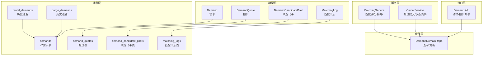
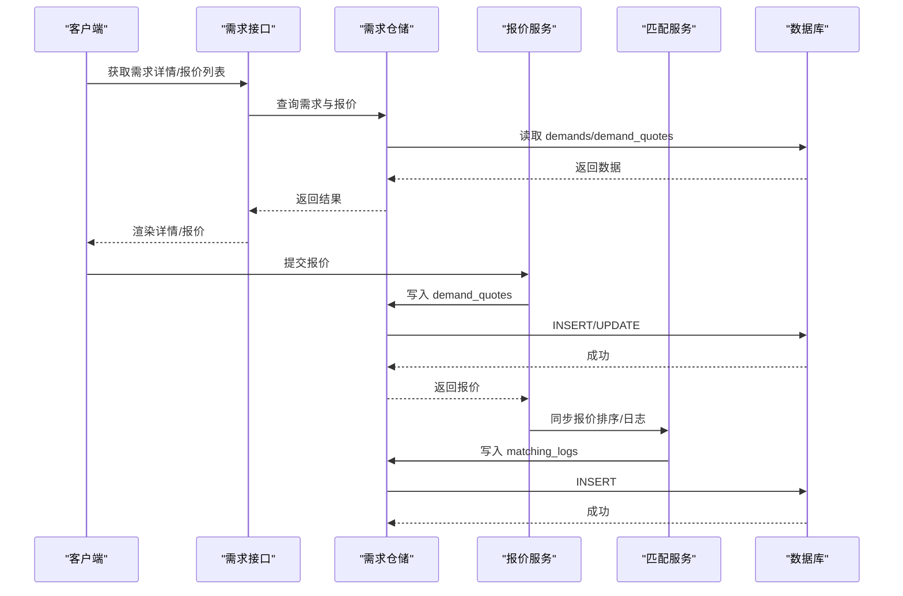
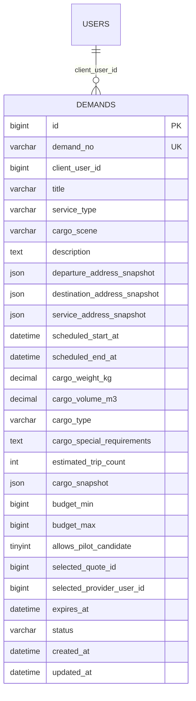
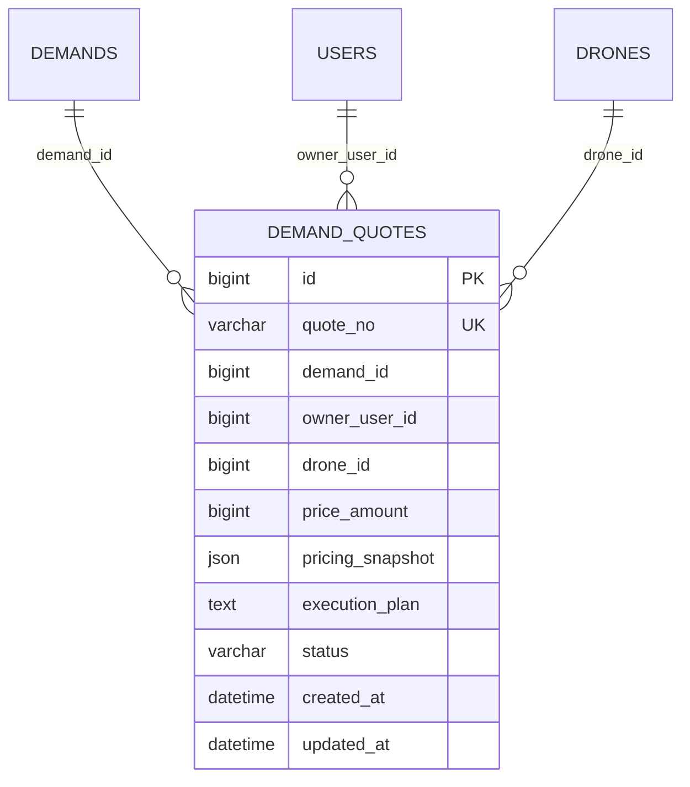
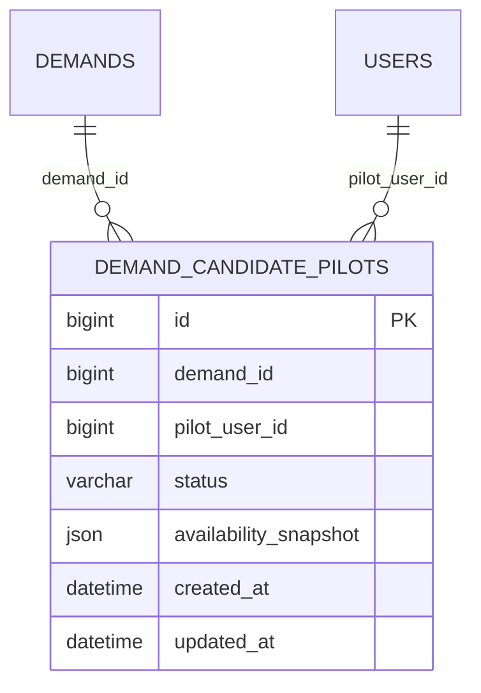
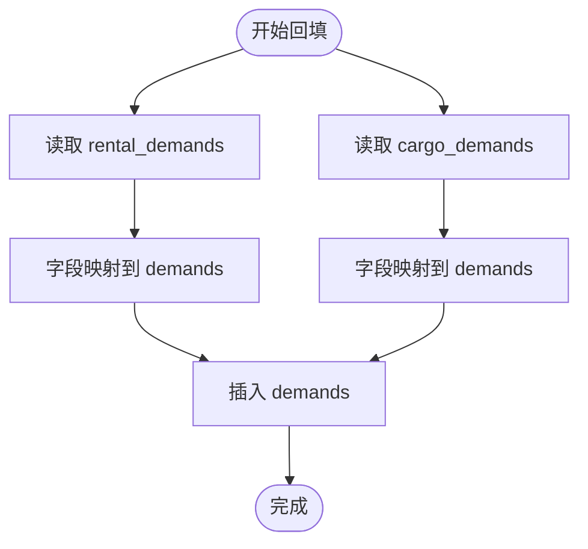
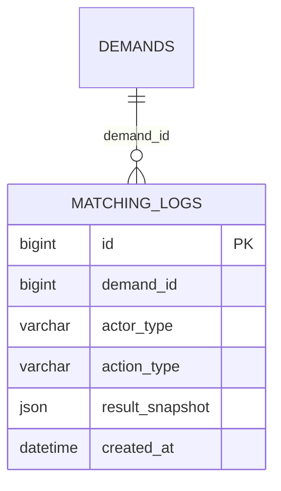
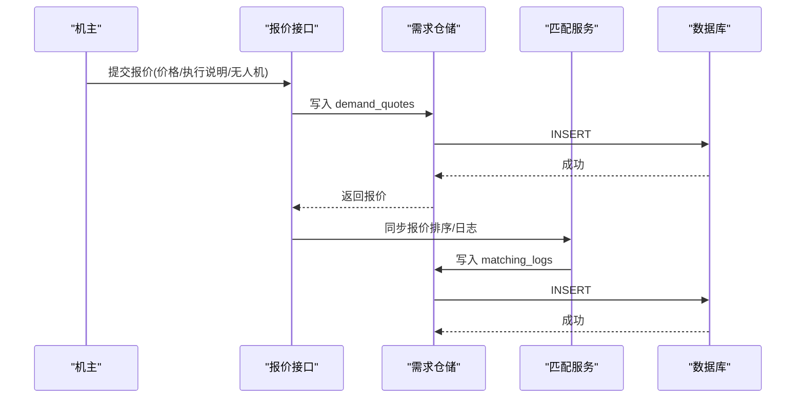
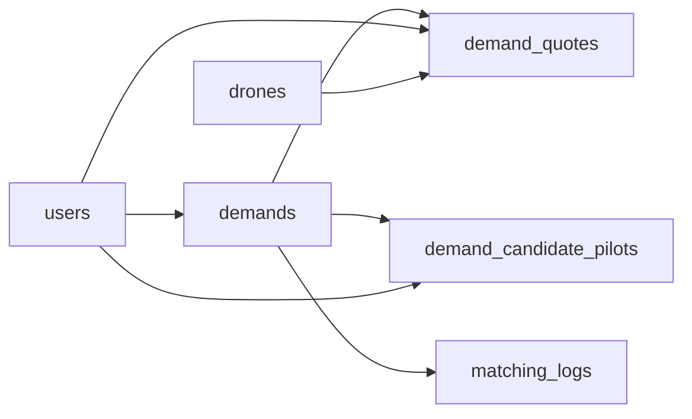

# 业务供需表

<cite>
**本文引用的文件**
- [models.go](file://backend/internal/model/models.go)
- [103_create_demand_v2_tables.sql](file://backend/migrations/103_create_demand_v2_tables.sql)
- [001_init_schema.sql](file://backend/migrations/001_init_schema.sql)
- [901_phase9_prepare_v2_schema.sql](file://backend/migrations/901_phase9_prepare_v2_schema.sql)
- [matching_service.go](file://backend/internal/service/matching_service.go)
- [demand_domain_client_repo.go](file://backend/internal/repository/demand_domain_client_repo.go)
- [owner_service.go](file://backend/internal/service/owner_service.go)
- [demand/handler.go](file://backend/internal/api/v2/demand/handler.go)
</cite>

## 目录
1. [简介](#简介)
2. [项目结构](#项目结构)
3. [核心组件](#核心组件)
4. [架构总览](#架构总览)
5. [详细组件分析](#详细组件分析)
6. [依赖分析](#依赖分析)
7. [性能考量](#性能考量)
8. [故障排查指南](#故障排查指南)
9. [结论](#结论)
10. [附录](#附录)

## 简介
本文件面向无人机租赁平台的业务供需表，聚焦以下核心表结构与规则：
- 需求表：demands（统一v2需求）、rental_demands（历史遗留）、cargo_demands（历史遗留）
- 报价表：demand_quotes
- 候选飞手表：demand_candidate_pilots
- 匹配日志：matching_logs
- 业务规则：需求紧急度（urgency）、报价状态（status）、报价排序与匹配分数（match_score）等

目标是帮助产品、研发与运维人员理解表结构、字段含义、约束与索引策略，并掌握供需撮合在表层的体现与演进路径。

## 项目结构
围绕供需表，后端采用“模型+迁移+服务+仓储+接口”的分层组织：
- 模型层：定义实体与字段约束（models.go）
- 迁移层：定义表结构与索引（103_create_demand_v2_tables.sql、001_init_schema.sql、901_phase9_prepare_v2_schema.sql）
- 服务层：实现报价排序、候选池同步、匹配评分等业务逻辑（matching_service.go、owner_service.go）
- 仓储层：封装查询与更新（demand_domain_client_repo.go）
- 接口层：对外暴露需求详情与报价列表（demand/handler.go）

图表来源
- [models.go](file://backend/internal/model/models.go)
- [103_create_demand_v2_tables.sql](file://backend/migrations/103_create_demand_v2_tables.sql)
- [001_init_schema.sql](file://backend/migrations/001_init_schema.sql)
- [901_phase9_prepare_v2_schema.sql](file://backend/migrations/901_phase9_prepare_v2_schema.sql)
- [matching_service.go](file://backend/internal/service/matching_service.go)
- [owner_service.go](file://backend/internal/service/owner_service.go)
- [demand_domain_client_repo.go](file://backend/internal/repository/demand_domain_client_repo.go)
- [demand/handler.go](file://backend/internal/api/v2/demand/handler.go)

章节来源
- [models.go](file://backend/internal/model/models.go)
- [103_create_demand_v2_tables.sql](file://backend/migrations/103_create_demand_v2_tables.sql)
- [001_init_schema.sql](file://backend/migrations/001_init_schema.sql)
- [901_phase9_prepare_v2_schema.sql](file://backend/migrations/901_phase9_prepare_v2_schema.sql)

## 核心组件
- 需求表 demands（v2统一需求）
  - 字段要点：需求编号、客户用户ID、服务类型、场景类型、描述、地址快照、预约时间、货物参数、预算、是否允许飞手候选、有效期、状态、已选报价与机主等
  - 索引：client_user_id、status、cargo_scene、expires_at
  - 约束：外键 client_user_id → users(id)
- 报价表 demand_quotes
  - 字段要点：报价编号、需求ID、机主用户ID、无人机ID、报价金额、报价快照、执行说明、状态
  - 索引：demand_id、owner_user_id、drone_id、status
  - 约束：外键 demand_id → demands(id)、owner_user_id → users(id)、drone_id → drones(id)
- 候选飞手表 demand_candidate_pilots
  - 字段要点：需求ID、飞手用户ID、状态、能力快照
  - 索引：demand_id、pilot_user_id、status
  - 约束：外键 demand_id → demands(id)、pilot_user_id → users(id)
- 历史遗留表（回填至 demands）
  - rental_demands（租赁需求）
  - cargo_demands（货运需求）
- 匹配日志 matching_logs
  - 字段要点：需求ID、触发方、动作类型、结果快照
  - 索引：demand_id、actor_type、action_type
  - 约束：外键 demand_id → demands(id)

章节来源
- [models.go](file://backend/internal/model/models.go)
- [103_create_demand_v2_tables.sql](file://backend/migrations/103_create_demand_v2_tables.sql)
- [001_init_schema.sql](file://backend/migrations/001_init_schema.sql)
- [901_phase9_prepare_v2_schema.sql](file://backend/migrations/901_phase9_prepare_v2_schema.sql)

## 架构总览
供需撮合在表层的体现：
- 需求侧：demands 提供统一的公开需求入口，支持报价、候选飞手、有效期与状态管理
- 供给侧：demand_quotes 提供报价提交、排序与状态流转；demand_candidate_pilots 提供飞手候选池
- 匹配侧：matching_logs 记录系统/客户端/机主/飞手的动作与结果快照，便于审计与复盘
- 历史迁移：通过迁移脚本将历史 rental_demands/cargo_demands 回填到 demands，并保留历史快照

图表来源
- [demand/handler.go](file://backend/internal/api/v2/demand/handler.go)
- [owner_service.go](file://backend/internal/service/owner_service.go)
- [matching_service.go](file://backend/internal/service/matching_service.go)
- [demand_domain_client_repo.go](file://backend/internal/repository/demand_domain_client_repo.go)

## 详细组件分析

### 需求表 Demands（v2统一需求）
- 字段与类型
  - 唯一编号、客户用户ID、标题、服务类型、场景类型、描述、地址快照、预约时间、货物参数、预算、是否允许飞手候选、已选报价与机主、有效期、状态、创建/更新时间
- 约束与索引
  - 唯一索引：demand_no
  - 普通索引：client_user_id、status、cargo_scene、expires_at
  - 外键：client_user_id → users(id)
- 业务规则
  - 状态枚举：draft、published、quoting、selected、converted_to_order、expired、cancelled
  - 允许飞手候选：用于控制是否开启候选飞手池
  - 有效期：用于自动过期与清理
- 历史回填
  - 通过迁移脚本将 rental_demands/cargo_demands 的字段映射到 demands，并保留 legacy 快照

图表来源
- [103_create_demand_v2_tables.sql](file://backend/migrations/103_create_demand_v2_tables.sql)
- [models.go](file://backend/internal/model/models.go)

章节来源
- [103_create_demand_v2_tables.sql](file://backend/migrations/103_create_demand_v2_tables.sql)
- [models.go](file://backend/internal/model/models.go)

### 报价表 DemandQuotes
- 字段与类型
  - 报价编号、需求ID、机主用户ID、无人机ID、报价金额、报价快照、执行说明、状态
- 约束与索引
  - 唯一索引：quote_no
  - 普通索引：demand_id、owner_user_id、drone_id、status
  - 外键：demand_id → demands(id)、owner_user_id → users(id)、drone_id → drones(id)
- 业务规则
  - 状态枚举：submitted、withdrawn、rejected、selected、expired
  - 报价金额以“分”为最小单位，便于精确计算与排序
  - 提交报价后若需求状态为 published，会自动切换为 quoting
- 报价排序机制
  - 优先级：状态优先（selected < submitted < withdrawn < rejected < expired）
  - 金额优先：同状态按价格升序
  - ID辅助：同金额同状态按ID升序

图表来源
- [103_create_demand_v2_tables.sql](file://backend/migrations/103_create_demand_v2_tables.sql)
- [models.go](file://backend/internal/model/models.go)

章节来源
- [103_create_demand_v2_tables.sql](file://backend/migrations/103_create_demand_v2_tables.sql)
- [models.go](file://backend/internal/model/models.go)
- [matching_service.go](file://backend/internal/service/matching_service.go)
- [owner_service.go](file://backend/internal/service/owner_service.go)

### 候选飞手表 DemandCandidatePilots
- 字段与类型
  - 需求ID、飞手用户ID、状态、能力快照、创建/更新时间
- 约束与索引
  - 普通索引：demand_id、pilot_user_id、status
  - 外键：demand_id → demands(id)、pilot_user_id → users(id)
- 业务规则
  - 状态枚举：active、withdrawn、expired、converted、skipped
  - 能力快照：记录报名时的飞手能力，便于后续审计与复盘
- 与撮合的关系
  - 由匹配服务同步候选池，记录候选数量与活跃数量

图表来源
- [103_create_demand_v2_tables.sql](file://backend/migrations/103_create_demand_v2_tables.sql)
- [models.go](file://backend/internal/model/models.go)

章节来源
- [103_create_demand_v2_tables.sql](file://backend/migrations/103_create_demand_v2_tables.sql)
- [models.go](file://backend/internal/model/models.go)
- [matching_service.go](file://backend/internal/service/matching_service.go)

### 历史遗留表与回填
- rental_demands（租赁需求）
  - 字段：租客、需求类型、标题、描述、所需功能、载重、经纬度、地址、城市、起止时间、预算、状态、紧急度、创建/更新/删除时间
  - 索引：renter_id、demand_type、status、city、urgency、deleted_at
- cargo_demands（货运需求）
  - 字段：发布者、货物类型、重量、尺寸、描述、起降经纬度与地址、距离、提货/交货时间、报价、特殊要求、图片、状态、创建/更新/删除时间
  - 索引：publisher_id、cargo_type、status、deleted_at
- 回填策略
  - 通过迁移脚本将历史数据映射到 demands，并保留 legacy 快照，确保历史业务可追溯

图表来源
- [103_create_demand_v2_tables.sql](file://backend/migrations/103_create_demand_v2_tables.sql)
- [001_init_schema.sql](file://backend/migrations/001_init_schema.sql)

章节来源
- [103_create_demand_v2_tables.sql](file://backend/migrations/103_create_demand_v2_tables.sql)
- [001_init_schema.sql](file://backend/migrations/001_init_schema.sql)

### 匹配日志 MatchingLogs
- 字段与类型
  - 需求ID、触发方（system/client/owner/pilot）、动作类型（recommend_owner、quote_rank、candidate_rank、auto_push）、结果快照、创建时间
- 约束与索引
  - 普通索引：demand_id、actor_type、action_type
  - 外键：demand_id → demands(id)
- 用途
  - 记录系统/用户/机主/飞手对需求的操作与结果，便于审计与复盘

图表来源
- [103_create_demand_v2_tables.sql](file://backend/migrations/103_create_demand_v2_tables.sql)
- [models.go](file://backend/internal/model/models.go)

章节来源
- [103_create_demand_v2_tables.sql](file://backend/migrations/103_create_demand_v2_tables.sql)
- [models.go](file://backend/internal/model/models.go)

### 报价匹配机制与排序
- 报价排序规则
  - 状态优先级：selected < submitted < withdrawn < rejected < expired
  - 金额优先：同状态按价格升序
  - ID辅助：同金额同状态按ID升序
- 日志记录
  - 同步报价排序时写入 matching_logs，记录报价数量、已选报价、排序明细等
- 提交报价流程
  - 机主提交报价后，若需求状态为 published，则更新为 quoting
  - 触发匹配服务同步报价排序与日志

图表来源
- [owner_service.go](file://backend/internal/service/owner_service.go)
- [matching_service.go](file://backend/internal/service/matching_service.go)
- [demand_domain_client_repo.go](file://backend/internal/repository/demand_domain_client_repo.go)

章节来源
- [matching_service.go](file://backend/internal/service/matching_service.go)
- [owner_service.go](file://backend/internal/service/owner_service.go)
- [demand_domain_client_repo.go](file://backend/internal/repository/demand_domain_client_repo.go)

### 需求类型区分（租赁需求 vs 货运需求）
- 历史遗留差异
  - rental_demands：强调“租赁使用”，字段包含需求类型、所需功能、载重、起止时间、预算、紧急度等
  - cargo_demands：强调“货运搬运”，字段包含货物类型、重量、尺寸、提货/交货时间、报价、特殊要求等
- v2统一后的差异
  - demands 通过 service_type/cargo_scene/cargo_type 等字段统一表达两类需求的语义
  - 回填时保留 legacy 快照，确保历史字段可追溯
- 实际影响
  - 业务侧可通过 service_type/cargo_scene 判断需求类别，从而选择合适的供给（如重型吊运）

章节来源
- [103_create_demand_v2_tables.sql](file://backend/migrations/103_create_demand_v2_tables.sql)
- [001_init_schema.sql](file://backend/migrations/001_init_schema.sql)

### 业务规则与字段说明
- 需求紧急度 urgency
  - 类型：字符串，默认值 medium
  - 场景：历史遗留 rental_demands 使用 urgency 字段，v2 demands 通过 legacy 快照保留
- 报价状态 status
  - 类型：字符串，默认值 submitted
  - 枚举：submitted、withdrawn、rejected、selected、expired
- 匹配分数 match_score
  - 类型：整数
  - 来源：匹配服务对不同需求类型的评分（距离、载重、价格、评分等维度加权）
- 其他关键字段
  - expires_at：需求有效期截止时间，用于自动过期
  - allows_pilot_candidate：是否允许飞手候选
  - selected_quote_id/selected_provider_user_id：已选报价与机主

章节来源
- [models.go](file://backend/internal/model/models.go)
- [matching_service.go](file://backend/internal/service/matching_service.go)

## 依赖分析
- 外键依赖
  - demands.client_user_id → users(id)
  - demand_quotes.demand_id → demands(id)
  - demand_quotes.owner_user_id → users(id)
  - demand_quotes.drone_id → drones(id)
  - demand_candidate_pilots.demand_id → demands(id)
  - demand_candidate_pilots.pilot_user_id → users(id)
  - matching_logs.demand_id → demands(id)
- 索引策略
  - 高频查询字段建立索引：client_user_id、status、cargo_scene、expires_at、demand_id、owner_user_id、drone_id、pilot_user_id、actor_type、action_type
- 潜在循环依赖
  - 通过外键与仓储层解耦，避免服务层直接依赖模型层的数据库行为

图表来源
- [103_create_demand_v2_tables.sql](file://backend/migrations/103_create_demand_v2_tables.sql)
- [models.go](file://backend/internal/model/models.go)

章节来源
- [103_create_demand_v2_tables.sql](file://backend/migrations/103_create_demand_v2_tables.sql)
- [models.go](file://backend/internal/model/models.go)

## 性能考量
- 索引覆盖
  - 需求查询：按 client_user_id/status/cargo_scene/expires_at 过滤，建议保持现有索引
  - 报价查询：按 demand_id/status 排序，建议保持现有索引
  - 候选飞手：按 demand_id/status/pilot_user_id 查询，建议保持现有索引
- 数据量增长
  - 建议定期归档 matching_logs 与历史回填数据，减少主表膨胀
- 排序成本
  - 报价排序基于状态+金额+ID，可在应用层预排序或数据库层使用复合索引优化
- 写入热点
  - 报价提交与匹配日志写入较为频繁，建议评估批量写入与异步化策略

## 故障排查指南
- 常见问题
  - 报价排序异常：检查报价状态是否正确，确认 quote_status_priority 的排序逻辑
  - 需求状态不一致：核对提交报价后是否正确从 published 切换到 quoting
  - 候选飞手统计异常：检查 demand_candidate_pilots 的 active 数量统计逻辑
- 审计与定位
  - 通过 matching_logs 的 actor_type/action_type 快速定位问题来源
  - 对照 legacy 快照（legacy 快照）回溯历史数据
- 排查步骤
  - 确认需求状态与有效期
  - 核对报价状态与金额
  - 检查候选飞手池数量与活跃数量
  - 查看匹配日志中的结果快照

章节来源
- [matching_service.go](file://backend/internal/service/matching_service.go)
- [demand_domain_client_repo.go](file://backend/internal/repository/demand_domain_client_repo.go)

## 结论
- v2 需求表 demands 统一了租赁与货运两类需求，通过 service_type/cargo_scene/cargo_type 等字段表达语义，并保留 legacy 快照以保障历史可追溯
- 报价表 demand_quotes 与候选飞手表 demand_candidate_pilots 提供了清晰的供需撮合与协作机制
- 匹配日志 matching_logs 记录了系统/用户/机主/飞手的关键动作，便于审计与优化
- 通过迁移脚本将历史遗留数据回填到 demands，确保业务连续性

## 附录
- DDL 示例（字段说明与约束）
  - demands
    - 唯一索引：demand_no
    - 普通索引：client_user_id、status、cargo_scene、expires_at
    - 外键：client_user_id → users(id)
  - demand_quotes
    - 唯一索引：quote_no
    - 普通索引：demand_id、owner_user_id、drone_id、status
    - 外键：demand_id → demands(id)、owner_user_id → users(id)、drone_id → drones(id)
  - demand_candidate_pilots
    - 普通索引：demand_id、pilot_user_id、status
    - 外键：demand_id → demands(id)、pilot_user_id → users(id)
  - matching_logs
    - 普通索引：demand_id、actor_type、action_type
    - 外键：demand_id → demands(id)

章节来源
- [103_create_demand_v2_tables.sql](file://backend/migrations/103_create_demand_v2_tables.sql)
- [models.go](file://backend/internal/model/models.go)