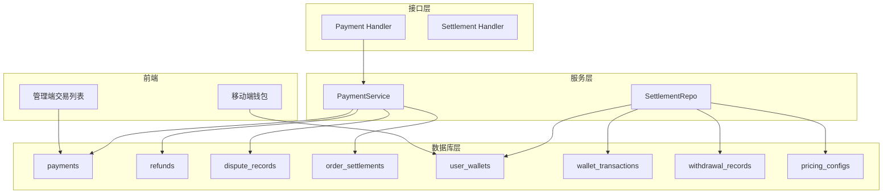
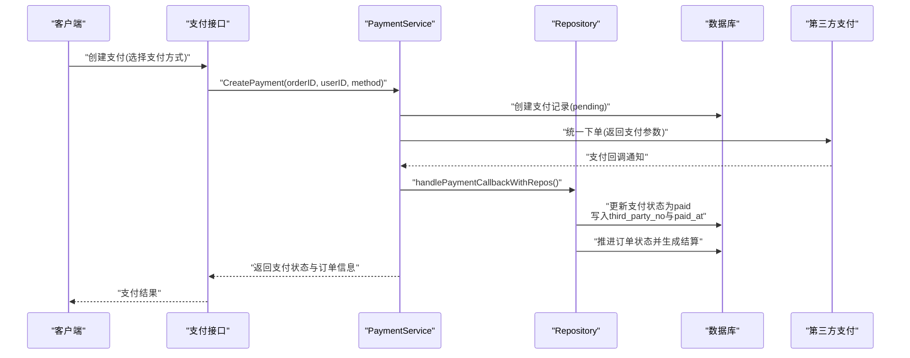
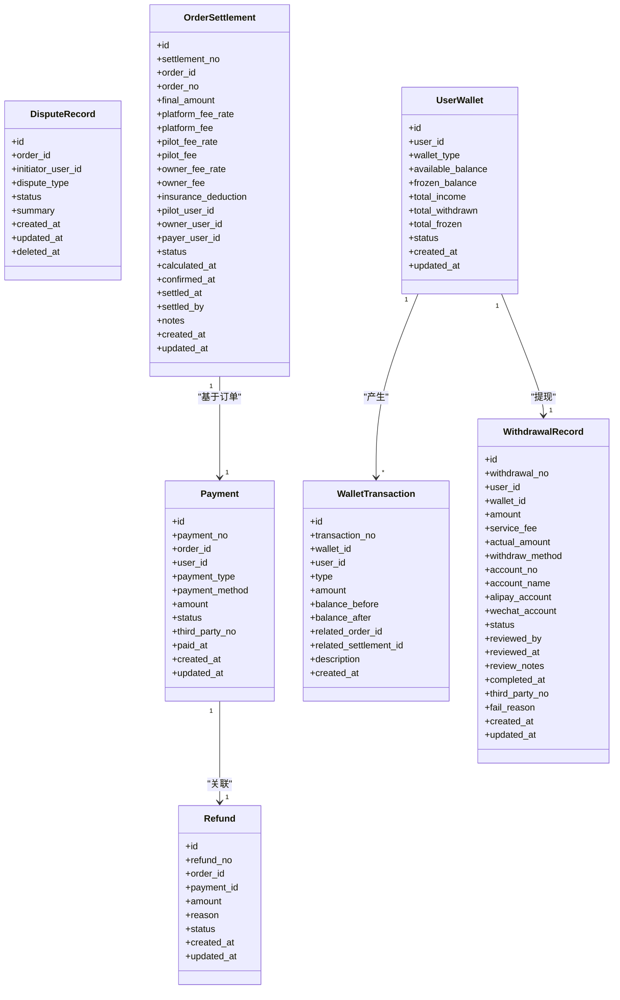

# 支付结算表

<cite>
**本文档引用的文件**
- [models.go](file://backend/internal/model/models.go)
- [011_add_settlement_tables.sql](file://backend/migrations/011_add_settlement_tables.sql)
- [002_seed_data.sql](file://backend/migrations/002_seed_data.sql)
- [handler.go](file://backend/internal/api/v2/payment/handler.go)
- [payment_service.go](file://backend/internal/service/payment_service.go)
- [settlement_repo.go](file://backend/internal/repository/settlement_repo.go)
- [WalletScreen.tsx](file://mobile/src/screens/settlement/WalletScreen.tsx)
- [settlement.ts](file://mobile/src/services/settlement.ts)
- [TransactionList.tsx](file://admin/src/pages/Finance/TransactionList.tsx)
- [BUSINESS_FIELD_DICTIONARY.md](file://BUSINESS_FIELD_DICTIONARY.md)
</cite>

## 目录
1. [简介](#简介)
2. [项目结构](#项目结构)
3. [核心组件](#核心组件)
4. [架构总览](#架构总览)
5. [详细组件分析](#详细组件分析)
6. [依赖关系分析](#依赖关系分析)
7. [性能考虑](#性能考虑)
8. [故障排除指南](#故障排除指南)
9. [结论](#结论)

## 简介
本文件面向无人机租赁平台的支付结算体系，聚焦支付表(Payment)、退款表(Refund)、争议记录(DisputeRecord)以及结算表(OrderSettlement)、钱包表(UserWallet)、流水表(WalletTransactions)、提现记录表(WithdrawalRecords)等核心表的表结构设计。文档详细说明字段定义、数据类型、约束条件与索引策略，阐述支付类型区分与分账机制，解释第三方支付平台对接与状态管理，并给出完整的DDL示例路径与字段说明。

## 项目结构
支付结算相关的核心代码与数据结构分布于以下模块：
- 数据库迁移：支付与结算相关表的DDL定义与默认配置
- 模型定义：Go语言ORM模型，映射数据库表结构
- 服务层：支付回调处理、订单推进、结算生成等业务逻辑
- 接口层：支付创建、状态查询、退款等API接口
- 移动端与管理端：钱包、流水、结算、提现等功能展示

**图表来源**
- [011_add_settlement_tables.sql:6-136](file://backend/migrations/011_add_settlement_tables.sql#L6-L136)
- [models.go:515-570](file://backend/internal/model/models.go#L515-L570)
- [handler.go:27-82](file://backend/internal/api/v2/payment/handler.go#L27-L82)
- [settlement_repo.go:12-46](file://backend/internal/repository/settlement_repo.go#L12-L46)

**章节来源**
- [011_add_settlement_tables.sql:1-189](file://backend/migrations/011_add_settlement_tables.sql#L1-L189)
- [models.go:515-570](file://backend/internal/model/models.go#L515-L570)

## 核心组件

### 支付表(Payments)
- 表名：payments
- 主要字段
  - id：自增主键
  - payment_no：支付流水号，唯一索引
  - order_id：关联订单ID，普通索引
  - user_id：付款用户ID，普通索引
  - payment_type：支付类型，枚举('order','deposit','refund','withdrawal')
  - payment_method：支付方式，枚举('wechat','alipay','mock')
  - amount：金额(分)
  - status：状态('pending','paid','failed','refunded')
  - third_party_no：第三方流水号
  - paid_at：支付完成时间
  - created_at/updated_at：创建与更新时间戳
- 约束与索引
  - 唯一索引：payment_no
  - 普通索引：order_id、user_id、status
- 典型业务规则
  - 订单支付：payment_type='order'，status从'pending'变为'paid'后推进订单状态并生成结算
  - 退款：payment_type='refund'，与原支付记录关联
  - 第三方回调：填充third_party_no与paid_at，更新状态为'paid'

**章节来源**
- [models.go:515-532](file://backend/internal/model/models.go#L515-L532)
- [002_seed_data.sql:93-98](file://backend/migrations/002_seed_data.sql#L93-L98)

### 退款表(Refunds)
- 表名：refunds
- 主要字段
  - id：自增主键
  - refund_no：退款流水号，唯一索引
  - order_id：关联订单ID，普通索引
  - payment_id：关联原支付ID，唯一索引
  - amount：退款金额(分)
  - reason：退款原因
  - status：状态('pending','processing','success','failed')，普通索引
  - created_at/updated_at：创建与更新时间戳
- 约束与索引
  - 唯一索引：refund_no、payment_id
  - 普通索引：order_id、status
- 关联关系
  - 一对一关联到payments表，确保每笔退款对应唯一一笔支付

**章节来源**
- [models.go:534-551](file://backend/internal/model/models.go#L534-L551)
- [011_add_settlement_tables.sql:20-34](file://backend/migrations/011_add_settlement_tables.sql#L20-L34)

### 争议记录(DisputeRecord)
- 表名：dispute_records
- 主要字段
  - id：自增主键
  - order_id：关联订单ID，普通索引
  - initiator_user_id：争议发起用户ID，普通索引
  - dispute_type：争议类型
  - status：状态('open','processing','resolved','closed')，普通索引
  - summary：争议摘要
  - created_at/updated_at：创建与更新时间戳
  - deleted_at：软删除时间戳
- 约束与索引
  - 普通索引：order_id、initiator_user_id、status、deleted_at
- 业务意义
  - 记录订单相关的争议事件，支持争议中状态下的资金冻结与结算暂停

**章节来源**
- [models.go:553-570](file://backend/internal/model/models.go#L553-L570)
- [BUSINESS_FIELD_DICTIONARY.md:735-753](file://BUSINESS_FIELD_DICTIONARY.md#L735-L753)

### 订单结算表(OrderSettlement)
- 表名：order_settlements
- 核心字段
  - settlement_no：结算单号，唯一
  - order_id：订单ID，唯一
  - order_no：订单编号
  - 金额明细：total_amount、base_fee、mileage_fee、duration_fee、weight_fee、difficulty_fee、insurance_fee、surge_pricing、coupon_discount、final_amount
  - 分账明细：platform_fee_rate、platform_fee、pilot_fee_rate、pilot_fee、owner_fee_rate、owner_fee、insurance_deduction
  - 参与方：pilot_user_id、owner_user_id、payer_user_id
  - 定价参数：flight_distance、flight_duration、cargo_weight、difficulty_factor、cargo_value、insurance_rate
  - 状态管理：status('pending','calculated','confirmed','settled','disputed')及相应时间戳
  - notes：备注
- 约束与索引
  - 唯一索引：settlement_no、order_id
  - 普通索引：status、pilot_user_id、owner_user_id、payer_user_id
- 分账逻辑
  - 平台抽成：platform_fee = final_amount × platform_fee_rate
  - 飞手分成：pilot_fee = final_amount × pilot_fee_rate
  - 机主分成：owner_fee = final_amount × owner_fee_rate
  - 保险代扣：insurance_deduction = insurance_fee × insurance_deduction_rate
  - 三者合计应等于final_amount（允许微小舍入差异）

**章节来源**
- [011_add_settlement_tables.sql:6-62](file://backend/migrations/011_add_settlement_tables.sql#L6-L62)
- [models.go:1927-1980](file://backend/internal/model/models.go#L1927-L1980)

### 用户钱包表(UserWallet)
- 表名：user_wallets
- 字段
  - id、user_id、wallet_type('general','pilot','owner')
  - balance字段：available_balance、frozen_balance、total_income、total_withdrawn、total_frozen
  - status('active','frozen','closed')
  - created_at/updated_at
- 约束与索引
  - 唯一索引：(user_id, wallet_type)
  - 普通索引：status
- 业务用途
  - 记录用户在各钱包类型的余额与累计收支，支持分账入账与提现冻结

**章节来源**
- [011_add_settlement_tables.sql:64-80](file://backend/migrations/011_add_settlement_tables.sql#L64-L80)

### 钱包流水表(WalletTransactions)
- 表名：wallet_transactions
- 字段
  - transaction_no、wallet_id、user_id、type('income','withdraw','freeze','unfreeze','deduct','refund')
  - amount、balance_before、balance_after
  - related_order_id、related_settlement_id
  - description、created_at
- 约束与索引
  - 唯一索引：transaction_no
  - 普通索引：wallet_id、user_id、related_order_id、type
- 业务用途
  - 记录钱包余额变动流水，支持对账与审计

**章节来源**
- [011_add_settlement_tables.sql:82-101](file://backend/migrations/011_add_settlement_tables.sql#L82-L101)

### 提现记录表(WithdrawalRecords)
- 表名：withdrawal_records
- 字段
  - withdrawal_no、user_id、wallet_id、amount、service_fee、actual_amount
  - withdraw_method('bank_card','alipay','wechat')及对应收款信息
  - status('pending','processing','completed','rejected','failed')及审核信息
  - third_party_no、fail_reason、review_notes
  - created_at/updated_at
- 约束与索引
  - 唯一索引：withdrawal_no
  - 普通索引：user_id、status
- 业务用途
  - 记录提现申请、审核与执行状态，支持银行、支付宝、微信三种渠道

**章节来源**
- [011_add_settlement_tables.sql:103-136](file://backend/migrations/011_add_settlement_tables.sql#L103-L136)

### 定价配置表(PricingConfigs)
- 表名：pricing_configs
- 字段
  - config_key、config_value、unit、description、category('base','mileage','duration','weight','difficulty','insurance','split','surge')、is_active
  - created_at/updated_at
- 业务用途
  - 存储分账比例、费率、计价规则等配置，支持动态调整

**章节来源**
- [011_add_settlement_tables.sql:138-189](file://backend/migrations/011_add_settlement_tables.sql#L138-L189)

## 架构总览
支付结算整体流程从订单支付开始，经由第三方回调更新支付状态，随后推进订单状态并生成结算记录，最后完成分账入账与钱包流水记录。

**图表来源**
- [handler.go:27-82](file://backend/internal/api/v2/payment/handler.go#L27-L82)
- [payment_service.go:166-211](file://backend/internal/service/payment_service.go#L166-L211)

**章节来源**
- [handler.go:27-82](file://backend/internal/api/v2/payment/handler.go#L27-L82)
- [payment_service.go:166-211](file://backend/internal/service/payment_service.go#L166-L211)

## 详细组件分析

### 支付类型与场景区分
- order：订单支付，触发订单状态推进与结算生成
- deposit：押金支付，通常与订单生命周期相关但独立记账
- refund：退款，与原支付记录关联，生成退款记录
- withdrawal：提现，从钱包冻结余额转出至银行/第三方账户

**章节来源**
- [models.go:520-521](file://backend/internal/model/models.go#L520-L521)

### 第三方支付平台对接
- 支持平台：wechat(微信)、alipay(支付宝)、mock(模拟)
- 对接要点
  - 统一下单：返回前端支付参数，引导用户完成支付
  - 回调处理：接收第三方回调，校验签名与金额，更新支付状态
  - 幂等性：根据payment_no与third_party_no保证重复回调不重复入账

**章节来源**
- [handler.go:27-82](file://backend/internal/api/v2/payment/handler.go#L27-L82)
- [payment_service.go:166-211](file://backend/internal/service/payment_service.go#L166-L211)

### 结算分账机制
- 分账比例
  - 平台费率：platform_fee_rate
  - 飞手分成：pilot_fee_rate
  - 机主分成：owner_fee_rate
  - 保险代扣：insurance_deduction
- 分账计算
  - platform_fee = final_amount × platform_fee_rate
  - pilot_fee = final_amount × pilot_fee_rate
  - owner_fee = final_amount × owner_fee_rate
  - insurance_deduction = insurance_fee × 代扣比例
- 资金流向
  - 平台：计入平台账户，用于运营与服务成本
  - 飞手：计入飞手钱包，支持提现
  - 机主：计入机主钱包，支持提现
  - 保险：按约定代扣后进入保险账户

**章节来源**
- [011_add_settlement_tables.sql:24-32](file://backend/migrations/011_add_settlement_tables.sql#L24-L32)
- [settlement_repo.go:125-145](file://backend/internal/repository/settlement_repo.go#L125-L145)

### 资金流水与财务结算
- 资金流水
  - 收入：订单结算入账，记录income流水
  - 冻结：提现申请时从可用余额转入冻结
  - 解冻：提现失败或撤销，从冻结转回可用
  - 扣款：平台服务费、保险代扣等
  - 退款：原路退回，记录refund流水
- 财务结算
  - 结算表记录每笔订单的最终分账结果
  - 钱包表记录用户余额变动
  - 流水表支撑对账与审计

**章节来源**
- [011_add_settlement_tables.sql:82-101](file://backend/migrations/011_add_settlement_tables.sql#L82-L101)
- [settlement_repo.go:125-145](file://backend/internal/repository/settlement_repo.go#L125-L145)

### DDL示例与字段说明
- 支付表DDL
  - 字段：payment_no(唯一)、order_id(索引)、user_id(索引)、payment_type、payment_method、amount、status(索引)、third_party_no、paid_at、created_at/updated_at
  - 索引：唯一(payment_no)、普通(order_id,user_id,status)
- 退款表DDL
  - 字段：refund_no(唯一)、order_id(索引)、payment_id(唯一)、amount、reason、status(索引)
  - 索引：唯一(refund_no,payment_id)、普通(order_id,status)
- 争议记录DDL
  - 字段：order_id(索引)、initiator_user_id(索引)、dispute_type、status(索引)、summary、deleted_at(软删)
  - 索引：普通(order_id,initiator_user_id,status,deleted_at)
- 结算表DDL
  - 字段：settlement_no(唯一)、order_id(唯一)、final_amount、分账比例与金额、参与方ID、定价参数、状态与时间戳
  - 索引：唯一(settlement_no,order_id)、普通(status,pilot_user_id,owner_user_id,payer_user_id)
- 钱包表DDL
  - 字段：user_id、wallet_type、available_balance/frozen_balance/total_*、status
  - 索引：唯一(user_id,wallet_type)、普通(status)
- 流水表DDL
  - 字段：transaction_no(唯一)、wallet_id(索引)、user_id(索引)、type、amount、balance_*、related_*、description
  - 索引：普通(wallet_id,user_id,related_order_id,type)
- 提现记录DDL
  - 字段：withdrawal_no(唯一)、user_id(索引)、wallet_id、amount、service_fee、actual_amount、withdraw_method、收款信息、status(索引)、third_party_no、fail_reason、review_notes
  - 索引：唯一(withdrawal_no)、普通(user_id,status)
- 定价配置DDL
  - 字段：config_key(唯一)、config_value、unit、description、category、is_active
  - 索引：普通(category,is_active)

**章节来源**
- [011_add_settlement_tables.sql:6-136](file://backend/migrations/011_add_settlement_tables.sql#L6-L136)

### 前端与管理端集成
- 移动端钱包
  - 展示钱包余额、流水、结算记录
  - 支持切换tab查看概览、流水、结算
- 管理端交易列表
  - 展示支付流水号、订单ID、类型、支付方式、金额、状态、第三方流水号、支付/创建时间
  - 支持按类型与状态筛选

**章节来源**
- [WalletScreen.tsx:25-40](file://mobile/src/screens/settlement/WalletScreen.tsx#L25-L40)
- [TransactionList.tsx:89-133](file://admin/src/pages/Finance/TransactionList.tsx#L89-L133)

## 依赖关系分析

**图表来源**
- [models.go:515-570](file://backend/internal/model/models.go#L515-L570)
- [011_add_settlement_tables.sql:6-136](file://backend/migrations/011_add_settlement_tables.sql#L6-L136)

**章节来源**
- [models.go:515-570](file://backend/internal/model/models.go#L515-L570)

## 性能考虑
- 索引优化
  - 支付表：按status、order_id、user_id建立索引，提升查询与状态统计效率
  - 结算表：按status、pilot/owner/payer_user_id建立索引，支持按角色分页查询
  - 钱包流水：按wallet_id、user_id、related_order_id、type建立索引，便于对账与报表
- 分账批处理
  - 结算生成采用事务，确保分账入账一致性，避免重复入账
- 缓存与异步
  - 支付回调可异步处理，减少接口响应延迟
  - 钱包余额可缓存热点用户，降低读压力

## 故障排除指南
- 支付回调未生效
  - 检查third_party_no与payment_no是否正确回写
  - 核对回调签名与金额一致性
- 退款异常
  - 确认原支付状态为'paid'且未被重复退款
  - 核对退款金额与原支付金额一致
- 结算状态异常
  - 检查final_amount与分账合计是否平衡
  - 核对争议状态(disputed)下是否冻结相关资金
- 提现失败
  - 核对账户信息加密存储与解密流程
  - 检查钱包冻结余额是否充足

**章节来源**
- [payment_service.go:166-211](file://backend/internal/service/payment_service.go#L166-L211)
- [settlement_repo.go:148-165](file://backend/internal/repository/settlement_repo.go#L148-L165)

## 结论
本文档系统梳理了无人机租赁平台支付结算表的结构设计与业务实现，明确了支付类型、分账比例、第三方对接与状态管理的关键规则，并给出了DDL示例路径与字段说明。通过支付表、退款表、争议记录、结算表、钱包与流水等表的协同，实现了从订单支付到财务结算的全链路闭环，为平台的合规运营与财务透明提供了坚实的数据基础。