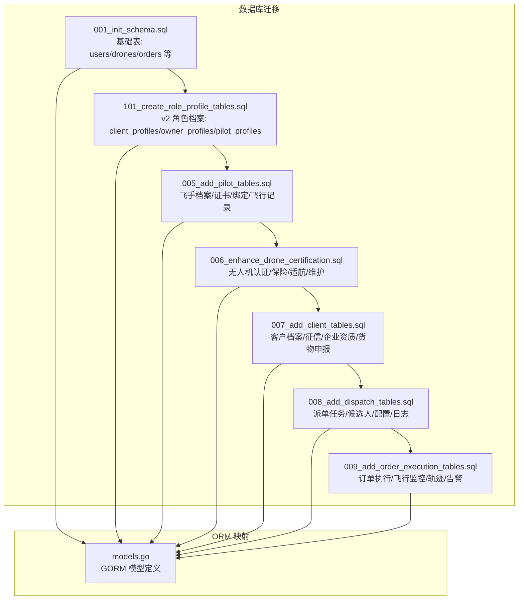
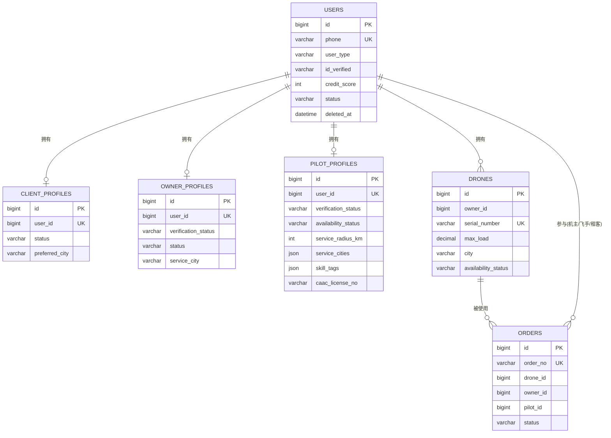
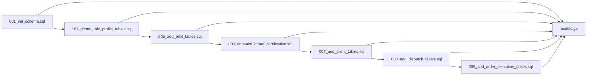

# 核心业务表

<cite>
**本文引用的文件**
- [001_init_schema.sql](file://backend/migrations/001_init_schema.sql)
- [101_create_role_profile_tables.sql](file://backend/migrations/101_create_role_profile_tables.sql)
- [005_add_pilot_tables.sql](file://backend/migrations/005_add_pilot_tables.sql)
- [006_enhance_drone_certification.sql](file://backend/migrations/006_enhance_drone_certification.sql)
- [007_add_client_tables.sql](file://backend/migrations/007_add_client_tables.sql)
- [008_add_dispatch_tables.sql](file://backend/migrations/008_add_dispatch_tables.sql)
- [009_add_order_execution_tables.sql](file://backend/migrations/009_add_order_execution_tables.sql)
- [models.go](file://backend/internal/model/models.go)
</cite>

## 目录
1. [简介](#简介)
2. [项目结构](#项目结构)
3. [核心组件](#核心组件)
4. [架构总览](#架构总览)
5. [详细组件分析](#详细组件分析)
6. [依赖分析](#依赖分析)
7. [性能考虑](#性能考虑)
8. [故障排查指南](#故障排查指南)
9. [结论](#结论)
10. [附录](#附录)

## 简介
本文件面向无人机租赁平台的核心业务表，聚焦用户(User)、客户档案(ClientProfile)、机主档案(OwnerProfile)、飞手档案(PilotProfile)、无人机(Drone)等关键实体，系统性梳理字段定义、数据类型、约束与索引策略，并解释表间关联关系、业务约束与核心逻辑在表结构层面的体现。文档同时提供DDL示例路径与字段说明，帮助开发者与运维人员快速理解并正确使用这些表。

## 项目结构
- 数据库层采用多阶段迁移脚本逐步演进，涵盖基础表、角色档案、飞手/机主/客户扩展、智能派单、订单执行与飞行监控等模块。
- ORM 层通过 GORM 模型映射，确保字段类型、默认值、索引与约束与数据库一致。



**图表来源**
- [001_init_schema.sql:1-314](file://backend/migrations/001_init_schema.sql#L1-L314)
- [101_create_role_profile_tables.sql:1-141](file://backend/migrations/101_create_role_profile_tables.sql#L1-L141)
- [005_add_pilot_tables.sql:1-143](file://backend/migrations/005_add_pilot_tables.sql#L1-L143)
- [006_enhance_drone_certification.sql:1-87](file://backend/migrations/006_enhance_drone_certification.sql#L1-L87)
- [007_add_client_tables.sql:1-189](file://backend/migrations/007_add_client_tables.sql#L1-L189)
- [008_add_dispatch_tables.sql:1-185](file://backend/migrations/008_add_dispatch_tables.sql#L1-L185)
- [009_add_order_execution_tables.sql:1-468](file://backend/migrations/009_add_order_execution_tables.sql#L1-L468)
- [models.go:1-200](file://backend/internal/model/models.go#L1-L200)

**章节来源**
- [001_init_schema.sql:1-314](file://backend/migrations/001_init_schema.sql#L1-L314)
- [models.go:1-200](file://backend/internal/model/models.go#L1-L200)

## 核心组件
本节对核心业务表进行字段与约束的系统性说明，重点覆盖以下实体：
- 用户表(User)
- 客户档案(ClientProfile)
- 机主档案(OwnerProfile)
- 飞手档案(PilotProfile)
- 无人机(Drone)

为避免冗长，此处仅给出字段清单、类型、约束与索引策略概览；具体实现细节请参见“详细组件分析”。

- 用户表(User)
  - 字段要点：手机号(phone, 唯一)、用户类型(user_type)、实名认证状态(id_verified)、信用分(credit_score)、状态(status)、软删(deleted_at)
  - 约束与索引：唯一索引(phone)、普通索引(user_type, status, deleted_at)
  - 默认值与校验：user_type 默认租客；credit_score 默认 100；status 默认 active；deleted_at 为空表示未删除
  - 业务意义：统一身份入口，承载角色扩展与信用控制

- 客户档案(ClientProfile)
  - 字段要点：关联用户(user_id 唯一)、状态(status)、默认联系人、常用城市、备注
  - 约束与索引：唯一外键(user_id -> users.id, 级联删除)、索引(status, preferred_city, deleted_at)
  - 业务意义：将原租客/货主角色整合为统一客户视角，支持偏好与联系信息管理

- 机主档案(OwnerProfile)
  - 字段要点：关联用户(user_id 唯一)、审核状态(verification_status)、服务城市、联系方式、简介
  - 约束与索引：唯一外键(user_id -> users.id, 级联删除)、索引(verification_status, status, service_city, deleted_at)
  - 业务意义：机主资质与服务能力的集中管理，支撑供给发布与匹配

- 飞手档案(PilotProfile)
  - 字段要点：关联用户(user_id 唯一)、审核状态(verification_status)、接单状态(availability_status)、服务半径、服务城市、技能标签、CAAC 证号与到期时间
  - 约束与索引：唯一外键(user_id -> users.id, 级联删除)、索引(verification_status, availability_status, caac_license_no, deleted_at)
  - 业务意义：飞手资质、能力与可用性的统一档案，支撑智能派单与风控

- 无人机(Drone)
  - 字段要点：归属机主(owner_id)、品牌/型号/序列号、载重/续航/航程、特性与图片、证书状态与文档、价格与押金、地理坐标与地址、可用状态、评分与订单量、描述
  - 扩展字段：UOM 登记号/状态/时间/证明、保险单号/公司/保额/到期/文件/状态、适航证书编号/到期/文件/状态、维护记录、最近/下次维护日期
  - 约束与索引：唯一索引(serial_number)、索引(owner_id, city, certification_status, availability_status, deleted_at)
  - 业务意义：资产全生命周期管理，支撑市场准入、定价与风控

**章节来源**
- [001_init_schema.sql:7-62](file://backend/migrations/001_init_schema.sql#L7-L62)
- [101_create_role_profile_tables.sql:5-61](file://backend/migrations/101_create_role_profile_tables.sql#L5-L61)
- [006_enhance_drone_certification.sql:5-36](file://backend/migrations/006_enhance_drone_certification.sql#L5-L36)
- [models.go:9-148](file://backend/internal/model/models.go#L9-L148)

## 架构总览
下图展示核心实体与关键关联关系，体现“用户”作为根身份，“角色档案”扩展用户能力，“资产与订单”贯穿业务闭环。



**图表来源**
- [001_init_schema.sql:7-62](file://backend/migrations/001_init_schema.sql#L7-L62)
- [101_create_role_profile_tables.sql:5-61](file://backend/migrations/101_create_role_profile_tables.sql#L5-L61)
- [models.go:9-148](file://backend/internal/model/models.go#L9-L148)

## 详细组件分析

### 用户表(User)
- 字段与类型
  - id: 主键
  - phone: 唯一索引
  - user_type: 默认租客，支持 pilot、drone_owner、client、admin 等扩展
  - id_verified: 实名认证状态，默认 pending
  - credit_score: 默认 100
  - status: 默认 active
  - deleted_at: 软删
- 约束与索引
  - 唯一索引: phone
  - 普通索引: user_type, status, deleted_at
- 业务约束
  - 用户状态与信用分用于风控与权限控制
  - 角色扩展通过 user_type 与角色档案表实现解耦
- DDL 示例路径
  - [用户表定义:7-26](file://backend/migrations/001_init_schema.sql#L7-L26)
  - [ORM 映射:9-26](file://backend/internal/model/models.go#L9-L26)

**章节来源**
- [001_init_schema.sql:7-26](file://backend/migrations/001_init_schema.sql#L7-L26)
- [models.go:9-26](file://backend/internal/model/models.go#L9-L26)

### 客户档案(ClientProfile)
- 字段与类型
  - user_id: 唯一外键，指向 users.id
  - status: 默认 active
  - default_contact_name/phone: 默认联系信息
  - preferred_city: 常用城市
  - remark: 备注
  - deleted_at: 软删
- 约束与索引
  - 唯一外键: user_id -> users.id (级联删除)
  - 普通索引: status, preferred_city, deleted_at
- 业务约束
  - 一个用户仅能有一份客户档案
  - 客户偏好与联系信息用于需求匹配与通知
- DDL 示例路径
  - [客户档案表定义:5-21](file://backend/migrations/101_create_role_profile_tables.sql#L5-L21)
  - [ORM 映射:32-45](file://backend/internal/model/models.go#L32-L45)

**章节来源**
- [101_create_role_profile_tables.sql:5-21](file://backend/migrations/101_create_role_profile_tables.sql#L5-L21)
- [models.go:32-45](file://backend/internal/model/models.go#L32-L45)

### 机主档案(OwnerProfile)
- 字段与类型
  - user_id: 唯一外键，指向 users.id
  - verification_status: 默认 pending
  - status: 默认 active
  - service_city: 常驻服务城市
  - contact_phone: 业务联系电话
  - intro: 机主介绍
  - deleted_at: 软删
- 约束与索引
  - 唯一外键: user_id -> users.id (级联删除)
  - 普通索引: verification_status, status, service_city, deleted_at
- 业务约束
  - 机主资质审核与服务范围管理
- DDL 示例路径
  - [机主档案表定义:23-41](file://backend/migrations/101_create_role_profile_tables.sql#L23-L41)
  - [ORM 映射:51-64](file://backend/internal/model/models.go#L51-L64)

**章节来源**
- [101_create_role_profile_tables.sql:23-41](file://backend/migrations/101_create_role_profile_tables.sql#L23-L41)
- [models.go:51-64](file://backend/internal/model/models.go#L51-L64)

### 飞手档案(PilotProfile)
- 字段与类型
  - user_id: 唯一外键，指向 users.id
  - verification_status: 默认 pending
  - availability_status: 默认 offline
  - service_radius_km: 默认 50
  - service_cities/skill_tags: JSON
  - caac_license_no: CAAC 证号
  - caac_license_expire_at: 到期时间
  - deleted_at: 软删
- 约束与索引
  - 唯一外键: user_id -> users.id (级联删除)
  - 普通索引: verification_status, availability_status, caac_license_no, deleted_at
- 业务约束
  - 飞手资质与可用性直接影响派单成功率
- DDL 示例路径
  - [飞手档案表定义:42-61](file://backend/migrations/101_create_role_profile_tables.sql#L42-L61)
  - [ORM 映射:70-85](file://backend/internal/model/models.go#L70-L85)

**章节来源**
- [101_create_role_profile_tables.sql:42-61](file://backend/migrations/101_create_role_profile_tables.sql#L42-L61)
- [models.go:70-85](file://backend/internal/model/models.go#L70-L85)

### 无人机(Drone)
- 字段与类型
  - owner_id: 归属机主
  - brand/model/serial_number: 唯一索引(serial_number)
  - max_load/max_flight_time/max_distance: 参数
  - features/images: JSON
  - certification_status/certification_docs: 证书状态与文档
  - daily_price/hourly_price/deposit: 价格与押金
  - latitude/longitude/address/city: 地理与地址
  - availability_status: 默认 available
  - rating/order_count/description: 评分与统计
  - UOM/保险/适航/维护扩展字段
- 约束与索引
  - 唯一索引: serial_number
  - 普通索引: owner_id, city, certification_status, availability_status, deleted_at
- 业务约束
  - 可用状态、证书状态、UOM/保险/适航验证共同决定是否可入市
- DDL 示例路径
  - [无人机表定义:28-62](file://backend/migrations/001_init_schema.sql#L28-L62)
  - [无人机字段增强:5-36](file://backend/migrations/006_enhance_drone_certification.sql#L5-L36)
  - [ORM 映射:91-148](file://backend/internal/model/models.go#L91-L148)

**章节来源**
- [001_init_schema.sql:28-62](file://backend/migrations/001_init_schema.sql#L28-L62)
- [006_enhance_drone_certification.sql:5-36](file://backend/migrations/006_enhance_drone_certification.sql#L5-L36)
- [models.go:91-148](file://backend/internal/model/models.go#L91-L148)

### 关联关系与外键设计
- 一对一
  - users → client_profiles
  - users → owner_profiles
  - users → pilot_profiles
- 一对多
  - users → drones(owner_id)
  - drones → orders(drone_id)
  - users → orders(owner_id/pilot_id/renter_id/client_id)
- 外键策略
  - 角色档案表均以 user_id 为唯一外键，删除策略为级联删除，保证用户注销时档案同步清理
  - 资产与订单表通过 owner_id/pilot_id/drone_id 等字段建立关联，便于按角色维度检索与统计

```mermaid
classDiagram
class User {
+int64 id
+string phone
+string user_type
+string id_verified
+int credit_score
+string status
+datetime deleted_at
}
class ClientProfile {
+int64 id
+int64 user_id
+string status
+string preferred_city
}
class OwnerProfile {
+int64 id
+int64 user_id
+string verification_status
+string status
+string service_city
}
class PilotProfile {
+int64 id
+int64 user_id
+string verification_status
+string availability_status
+int service_radius_km
+json service_cities
+json skill_tags
+string caac_license_no
}
class Drone {
+int64 id
+int64 owner_id
+string serial_number
+string availability_status
+string city
}
class Order {
+int64 id
+int64 drone_id
+int64 owner_id
+int64 pilot_id
+string status
}
User ||--o| ClientProfile : "一对一"
User ||--o| OwnerProfile : "一对一"
User ||--o| PilotProfile : "一对一"
User ||--o{ Drone : "一对多"
Drone ||--o{ Order : "一对多"
User ||--o{ Order : "多方参与"
```

**图表来源**
- [101_create_role_profile_tables.sql:5-61](file://backend/migrations/101_create_role_profile_tables.sql#L5-L61)
- [001_init_schema.sql:28-62](file://backend/migrations/001_init_schema.sql#L28-L62)
- [models.go:9-148](file://backend/internal/model/models.go#L9-L148)

## 依赖分析
- 迁移脚本依赖顺序
  - 基础表(001) → 角色档案(101) → 飞手(005) → 无人机增强(006) → 客户(007) → 派单(008) → 订单执行(009)
- ORM 与数据库一致性
  - models.go 中字段类型、默认值、索引与约束与迁移脚本保持一致，确保查询与写入行为稳定
- 外部依赖
  - 订单执行与飞行监控依赖轨迹与告警表，形成闭环的数据采集与风控机制



**图表来源**
- [001_init_schema.sql:1-314](file://backend/migrations/001_init_schema.sql#L1-L314)
- [101_create_role_profile_tables.sql:1-141](file://backend/migrations/101_create_role_profile_tables.sql#L1-L141)
- [005_add_pilot_tables.sql:1-143](file://backend/migrations/005_add_pilot_tables.sql#L1-L143)
- [006_enhance_drone_certification.sql:1-87](file://backend/migrations/006_enhance_drone_certification.sql#L1-L87)
- [007_add_client_tables.sql:1-189](file://backend/migrations/007_add_client_tables.sql#L1-L189)
- [008_add_dispatch_tables.sql:1-185](file://backend/migrations/008_add_dispatch_tables.sql#L1-L185)
- [009_add_order_execution_tables.sql:1-468](file://backend/migrations/009_add_order_execution_tables.sql#L1-L468)
- [models.go:1-200](file://backend/internal/model/models.go#L1-L200)

**章节来源**
- [models.go:1-200](file://backend/internal/model/models.go#L1-L200)

## 性能考虑
- 索引策略
  - 高频过滤字段建立索引：user_type、status、city、certification_status、availability_status、deleted_at
  - 唯一索引：phone、serial_number，避免重复与提升关联效率
- 查询优化建议
  - 在角色扩展与资产筛选场景，优先使用复合索引覆盖查询条件
  - 对 JSON 字段查询谨慎使用，必要时考虑规范化或物化字段
- 写入与一致性
  - 使用事务保证订单与时间线、支付、评价等跨表写入的一致性
  - 软删字段统一管理，避免误删与统计偏差

## 故障排查指南
- 常见问题定位
  - 用户无法登录：检查 users.phone 唯一性与 status、id_verified 状态
  - 无人机不可入市：检查 availability_status、certification_status、UOM/保险/适航验证状态
  - 飞手不可接单：检查 availability_status、verification_status、license 到期
- 排查步骤
  - 核对角色档案完整性：client_profiles/owner_profiles/pilot_profiles 的 user_id 是否存在且未软删
  - 核对资产状态：drones 的 city、availability_status、certification_status、deleted_at
  - 核对订单状态流转：orders.status 与 order_timelines 的最新节点
- 相关表与字段路径
  - [用户表与索引:7-26](file://backend/migrations/001_init_schema.sql#L7-L26)
  - [角色档案外键与索引:5-61](file://backend/migrations/101_create_role_profile_tables.sql#L5-L61)
  - [无人机状态与证书字段:5-36](file://backend/migrations/006_enhance_drone_certification.sql#L5-L36)
  - [订单状态与时间线:1-120](file://backend/migrations/009_add_order_execution_tables.sql#L1-L120)

**章节来源**
- [001_init_schema.sql:7-26](file://backend/migrations/001_init_schema.sql#L7-L26)
- [101_create_role_profile_tables.sql:5-61](file://backend/migrations/101_create_role_profile_tables.sql#L5-L61)
- [006_enhance_drone_certification.sql:5-36](file://backend/migrations/006_enhance_drone_certification.sql#L5-L36)
- [009_add_order_execution_tables.sql:1-120](file://backend/migrations/009_add_order_execution_tables.sql#L1-L120)

## 结论
本文从表结构、字段设计、约束与索引、关联关系与业务约束五个维度，系统梳理了用户、客户、机主、飞手与无人机等核心实体。通过迁移脚本与 ORM 的一致性映射，确保了业务逻辑在表结构层面的可落地性与可维护性。建议在后续迭代中持续完善索引覆盖与查询计划，结合订单执行与飞行监控数据，进一步优化匹配与风控策略。

## 附录
- DDL 示例路径汇总
  - [用户表:7-26](file://backend/migrations/001_init_schema.sql#L7-L26)
  - [角色档案表:5-61](file://backend/migrations/101_create_role_profile_tables.sql#L5-L61)
  - [飞手档案/证书/绑定/飞行记录:5-143](file://backend/migrations/005_add_pilot_tables.sql#L5-L143)
  - [无人机增强(UOM/保险/适航/维护):5-87](file://backend/migrations/006_enhance_drone_certification.sql#L5-L87)
  - [客户档案/征信/企业资质/货物申报:4-189](file://backend/migrations/007_add_client_tables.sql#L4-L189)
  - [派单任务/候选人/配置/日志:4-185](file://backend/migrations/008_add_dispatch_tables.sql#L4-L185)
  - [订单执行/飞行监控/轨迹/告警:4-468](file://backend/migrations/009_add_order_execution_tables.sql#L4-L468)
- ORM 映射路径
  - [GORM 模型定义:9-148](file://backend/internal/model/models.go#L9-L148)