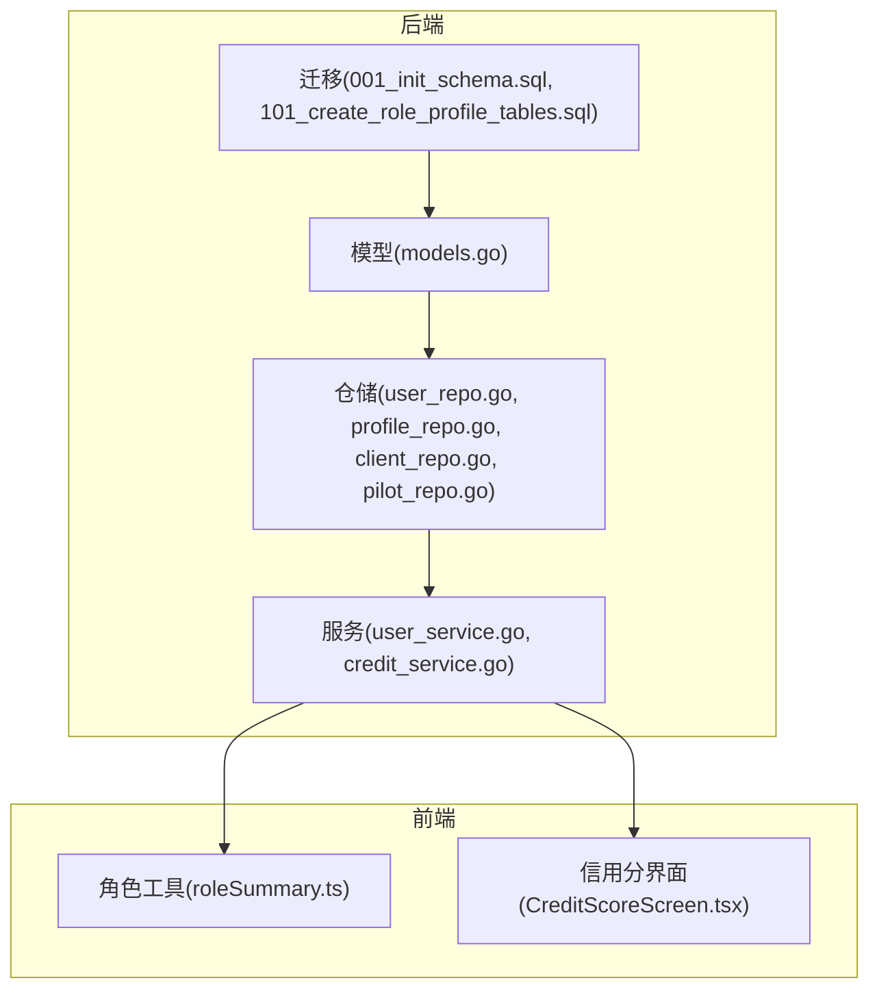
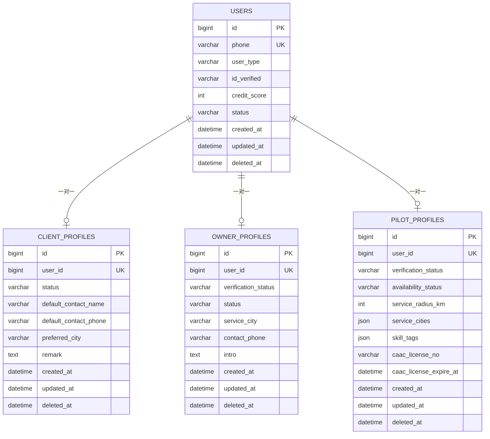
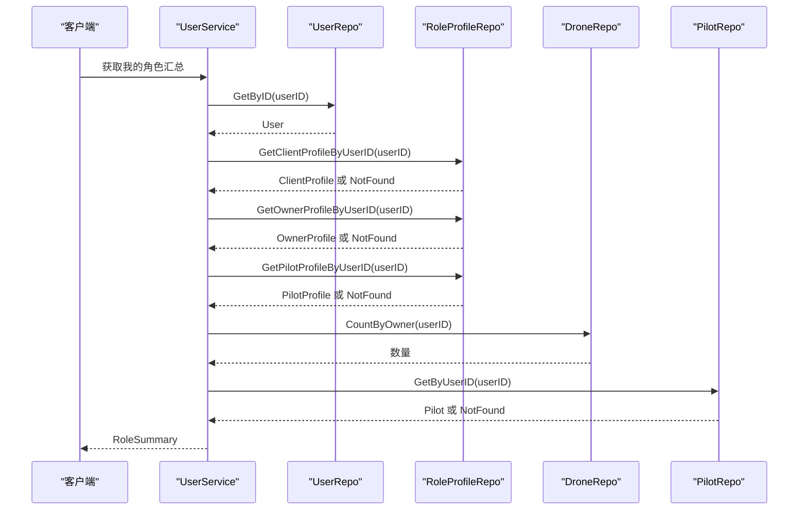
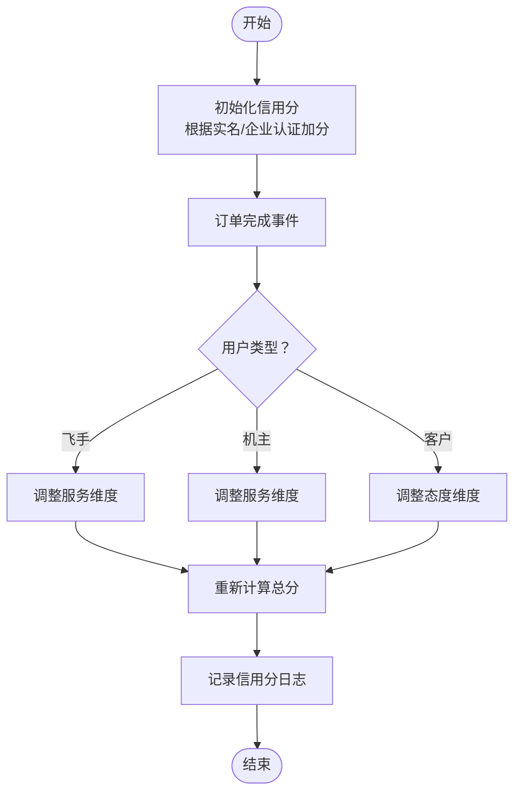
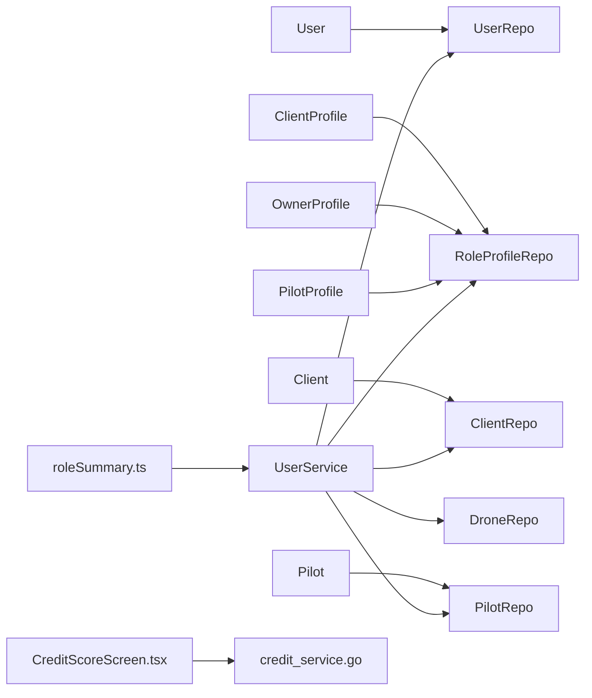

# 用户管理表

<cite>
**本文引用的文件**
- [models.go](file://backend/internal/model/models.go)
- [user_repo.go](file://backend/internal/repository/user_repo.go)
- [profile_repo.go](file://backend/internal/repository/profile_repo.go)
- [client_repo.go](file://backend/internal/repository/client_repo.go)
- [pilot_repo.go](file://backend/internal/repository/pilot_repo.go)
- [user_service.go](file://backend/internal/service/user_service.go)
- [001_init_schema.sql](file://backend/migrations/001_init_schema.sql)
- [101_create_role_profile_tables.sql](file://backend/migrations/101_create_role_profile_tables.sql)
- [auth.go](file://backend/internal/api/middleware/auth.go)
- [roleSummary.ts](file://mobile/src/utils/roleSummary.ts)
- [CreditScoreScreen.tsx](file://mobile/src/screens/credit/CreditScoreScreen.tsx)
- [credit_service.go](file://backend/internal/service/credit_service.go)
</cite>

## 目录
1. [简介](#简介)
2. [项目结构](#项目结构)
3. [核心组件](#核心组件)
4. [架构总览](#架构总览)
5. [详细组件分析](#详细组件分析)
6. [依赖分析](#依赖分析)
7. [性能考虑](#性能考虑)
8. [故障排查指南](#故障排查指南)
9. [结论](#结论)
10. [附录](#附录)

## 简介
本文件面向无人机租赁平台的“用户管理表”设计，聚焦于用户表（User）、客户档案（ClientProfile）、机主档案（OwnerProfile）、飞手档案（PilotProfile）等核心用户相关表的字段定义、数据类型、约束条件与索引策略，并解释字段设计意图（如用户状态字段 status、角色类型枚举 user_type、实名认证状态 id_verified、信用评分计算 credit_score 等）。同时阐述表之间的关联关系（一对一的用户档案关联设计），提供完整的 DDL 示例与字段说明，包含数据验证规则、默认值设置与业务约束；并解释用户角色扩展模型在表结构层面的体现（用户类型枚举、状态管理等）。

## 项目结构
围绕用户管理的核心代码位于后端 Go 语言模块，采用分层架构：
- 数据模型层：定义实体结构与 GORM 映射
- 仓储层：封装数据库访问逻辑
- 服务层：实现业务规则与角色汇总
- 迁移脚本：定义数据库表结构与索引
- 前端工具：角色展示与信用分维度显示

图表来源
- [models.go](file://backend/internal/model/models.go)
- [user_repo.go](file://backend/internal/repository/user_repo.go)
- [profile_repo.go](file://backend/internal/repository/profile_repo.go)
- [client_repo.go](file://backend/internal/repository/client_repo.go)
- [pilot_repo.go](file://backend/internal/repository/pilot_repo.go)
- [user_service.go](file://backend/internal/service/user_service.go)
- [credit_service.go](file://backend/internal/service/credit_service.go)
- [001_init_schema.sql](file://backend/migrations/001_init_schema.sql)
- [101_create_role_profile_tables.sql](file://backend/migrations/101_create_role_profile_tables.sql)
- [roleSummary.ts](file://mobile/src/utils/roleSummary.ts)
- [CreditScoreScreen.tsx](file://mobile/src/screens/credit/CreditScoreScreen.tsx)

章节来源
- [models.go](file://backend/internal/model/models.go)
- [user_repo.go](file://backend/internal/repository/user_repo.go)
- [profile_repo.go](file://backend/internal/repository/profile_repo.go)
- [client_repo.go](file://backend/internal/repository/client_repo.go)
- [pilot_repo.go](file://backend/internal/repository/pilot_repo.go)
- [user_service.go](file://backend/internal/service/user_service.go)
- [001_init_schema.sql](file://backend/migrations/001_init_schema.sql)
- [101_create_role_profile_tables.sql](file://backend/migrations/101_create_role_profile_tables.sql)
- [roleSummary.ts](file://mobile/src/utils/roleSummary.ts)
- [CreditScoreScreen.tsx](file://mobile/src/screens/credit/CreditScoreScreen.tsx)

## 核心组件
- 用户表（User）
  - 字段：id、phone、password_hash、nickname、avatar_url、user_type、id_card_no、id_verified、credit_score、status、wechat_open_id、wechat_union_id、qq_open_id、created_at、updated_at、deleted_at
  - 约束与索引：唯一索引 phone；索引 user_type、status、deleted_at
  - 默认值：user_type 默认租客（renter），id_verified 默认 pending，credit_score 默认 100，status 默认 active
  - 设计意图：统一用户身份入口，承载角色扩展与状态管理；敏感字段不对外暴露

- 客户档案（ClientProfile）
  - 字段：id、user_id、status、default_contact_name、default_contact_phone、preferred_city、remark、created_at、updated_at、deleted_at
  - 约束与索引：user_id 唯一索引；索引 status、preferred_city、deleted_at
  - 默认值：status 默认 active
  - 设计意图：为租客/货主提供默认联系信息与偏好设置，与用户表一对一关联

- 机主档案（OwnerProfile）
  - 字段：id、user_id、verification_status、status、service_city、contact_phone、intro、created_at、updated_at、deleted_at
  - 约束与索引：user_id 唯一索引；索引 verification_status、status、service_city、deleted_at
  - 默认值：verification_status 默认 pending，status 默认 active
  - 设计意图：记录机主的审核状态、服务能力与联系方式，支撑机主角色扩展

- 飞手档案（PilotProfile）
  - 字段：id、user_id、verification_status、availability_status、service_radius_km、service_cities、skill_tags、caac_license_no、caac_license_expire_at、created_at、updated_at、deleted_at
  - 约引与索引：user_id 唯一索引；索引 verification_status、availability_status、caac_license_no、deleted_at
  - 默认值：availability_status 默认 offline，service_radius_km 默认 50
  - 设计意图：记录飞手资质、接单状态、服务范围与技能标签，支撑飞手角色扩展

章节来源
- [models.go](file://backend/internal/model/models.go)
- [101_create_role_profile_tables.sql](file://backend/migrations/101_create_role_profile_tables.sql)

## 架构总览
用户管理表的结构与业务流如下：
- 用户表作为根实体，承载用户类型与状态
- 客户/机主/飞手档案表与用户表建立一对一外键关联
- 服务层根据用户类型与档案存在性进行角色汇总
- 前端基于角色汇总与信用分维度进行展示

图表来源
- [models.go](file://backend/internal/model/models.go)
- [101_create_role_profile_tables.sql](file://backend/migrations/101_create_role_profile_tables.sql)

## 详细组件分析

### 用户表（User）
- 字段与约束
  - 主键：id（自增）
  - 唯一索引：phone
  - 索引：user_type、status、deleted_at
  - 默认值：user_type 默认租客（renter），id_verified 默认 pending，credit_score 默认 100，status 默认 active
- 设计意图
  - user_type 作为角色扩展入口，结合服务层的角色汇总逻辑，决定用户具备的业务角色
  - id_verified 与 status 用于实名认证与账户治理
  - credit_score 作为平台内部信用分的基础字段，配合独立的信用分表进行更细维度的计算
- 数据验证与业务约束
  - phone 唯一性保证登录入口唯一
  - deleted_at 支持软删除与审计
  - status 控制账户可用性（active/suspended/banned）

章节来源
- [models.go](file://backend/internal/model/models.go)
- [001_init_schema.sql](file://backend/migrations/001_init_schema.sql)

### 客户档案（ClientProfile）
- 字段与约束
  - 主键：id（自增）
  - 唯一索引：user_id（与用户表一对一）
  - 索引：status、preferred_city、deleted_at
  - 默认值：status 默认 active
- 设计意图
  - 提供默认联系人与常用城市等偏好信息，便于下单与沟通
  - 与用户表一对一，确保每个用户仅有一份客户档案
- 数据验证与业务约束
  - 通过唯一索引保证一对一关系
  - soft delete 支持

章节来源
- [models.go](file://backend/internal/model/models.go)
- [101_create_role_profile_tables.sql](file://backend/migrations/101_create_role_profile_tables.sql)

### 机主档案（OwnerProfile）
- 字段与约束
  - 主键：id（自增）
  - 唯一索引：user_id（与用户表一对一）
  - 索引：verification_status、status、service_city、deleted_at
  - 默认值：verification_status 默认 pending，status 默认 active
- 设计意图
  - 记录机主的审核状态、服务能力与联系方式，支撑机主角色扩展
- 数据验证与业务约束
  - verification_status 与 status 用于运营审核与运营治理
  - service_city 用于服务区域管理

章节来源
- [models.go](file://backend/internal/model/models.go)
- [101_create_role_profile_tables.sql](file://backend/migrations/101_create_role_profile_tables.sql)

### 飞手档案（PilotProfile）
- 字段与约束
  - 主键：id（自增）
  - 唯一索引：user_id（与用户表一对一）
  - 索引：verification_status、availability_status、caac_license_no、deleted_at
  - 默认值：availability_status 默认 offline，service_radius_km 默认 50
- 设计意图
  - 记录飞手资质、接单状态、服务范围与技能标签，支撑飞手角色扩展
- 数据验证与业务约束
  - verification_status 与 availability_status 用于调度与风控
  - service_radius_km 与 service_cities 用于就近匹配

章节来源
- [models.go](file://backend/internal/model/models.go)
- [101_create_role_profile_tables.sql](file://backend/migrations/101_create_role_profile_tables.sql)

### 角色扩展模型与状态管理
- 用户类型枚举（user_type）
  - 在模型中注释给出可能取值 pilot、drone_owner、renter、cargo_owner、admin
  - 服务层根据 user_type 与档案存在性进行角色汇总
- 状态管理
  - user_type：角色扩展入口
  - id_verified：实名认证状态（pending/approved/rejected）
  - status：账户状态（active/suspended/banned）
  - verification_status/availability_status：角色特定状态
- 角色汇总（服务层）
  - HasClientRole、HasOwnerRole、HasPilotRole
  - CanPublishSupply、CanAcceptDispatch、CanSelfExecute
- 前端展示
  - 角色标签构建与显示文本拼接

图表来源
- [user_service.go](file://backend/internal/service/user_service.go)
- [user_repo.go](file://backend/internal/repository/user_repo.go)
- [profile_repo.go](file://backend/internal/repository/profile_repo.go)
- [client_repo.go](file://backend/internal/repository/client_repo.go)
- [pilot_repo.go](file://backend/internal/repository/pilot_repo.go)

章节来源
- [user_service.go](file://backend/internal/service/user_service.go)
- [roleSummary.ts](file://mobile/src/utils/roleSummary.ts)

### 信用评分计算与维度
- 信用分表（CreditScore）
  - 维度：飞手（资质、服务、安全、活跃）、机主（合规、服务、履约、态度）、客户（身份、支付、态度、订单质量）
  - 统计：总订单数、完成/取消/纠纷、平均评分、违规次数、最后违规时间
  - 状态：冻结/黑名单标记与原因
- 信用分计算（服务层）
  - 初始化：根据实名认证与企业认证给予基础分
  - 订单完成后：根据评分与取消行为调整相应维度
  - 日志记录：变更类型、维度、分数变化、操作者类型
- 前端展示
  - 根据用户类型渲染不同维度的可视化卡片

图表来源
- [credit_service.go](file://backend/internal/service/credit_service.go)
- [CreditScoreScreen.tsx](file://mobile/src/screens/credit/CreditScoreScreen.tsx)

章节来源
- [models.go](file://backend/internal/model/models.go)
- [credit_service.go](file://backend/internal/service/credit_service.go)
- [CreditScoreScreen.tsx](file://mobile/src/screens/credit/CreditScoreScreen.tsx)

## 依赖分析
- 模型到仓储
  - User -> UserRepo
  - ClientProfile/OwnerProfile/PilotProfile -> RoleProfileRepo
  - Client -> ClientRepo
  - Pilot -> PilotRepo
- 服务层依赖
  - UserService 依赖 UserRepo、RoleProfileRepo、ClientRepo、DroneRepo、PilotRepo
- 前端依赖
  - 角色工具依赖服务层返回的 RoleSummary
  - 信用分界面依赖信用分维度数据

图表来源
- [models.go](file://backend/internal/model/models.go)
- [user_repo.go](file://backend/internal/repository/user_repo.go)
- [profile_repo.go](file://backend/internal/repository/profile_repo.go)
- [client_repo.go](file://backend/internal/repository/client_repo.go)
- [pilot_repo.go](file://backend/internal/repository/pilot_repo.go)
- [user_service.go](file://backend/internal/service/user_service.go)
- [credit_service.go](file://backend/internal/service/credit_service.go)
- [roleSummary.ts](file://mobile/src/utils/roleSummary.ts)
- [CreditScoreScreen.tsx](file://mobile/src/screens/credit/CreditScoreScreen.tsx)

章节来源
- [models.go](file://backend/internal/model/models.go)
- [user_repo.go](file://backend/internal/repository/user_repo.go)
- [profile_repo.go](file://backend/internal/repository/profile_repo.go)
- [client_repo.go](file://backend/internal/repository/client_repo.go)
- [pilot_repo.go](file://backend/internal/repository/pilot_repo.go)
- [user_service.go](file://backend/internal/service/user_service.go)
- [roleSummary.ts](file://mobile/src/utils/roleSummary.ts)
- [CreditScoreScreen.tsx](file://mobile/src/screens/credit/CreditScoreScreen.tsx)

## 性能考虑
- 索引策略
  - 用户表：phone 唯一索引、user_type/status/deleted_at 索引，满足登录、角色过滤与软删除场景
  - 档案表：user_id 唯一索引，确保一对一关系；status/city/license_no 等字段建立索引以支持常见查询
- 查询优化
  - 服务层通过预加载（Preload）减少 N+1 查询
  - 分页查询与条件过滤结合，避免全表扫描
- 数据一致性
  - 外键约束与唯一索引保证一对一关系
  - 软删除（deleted_at）支持审计与恢复

## 故障排查指南
- 登录失败
  - 检查 phone 是否唯一且存在
  - 检查 user_type 与状态是否允许登录
- 角色缺失
  - 确认是否存在对应档案（ClientProfile/OwnerProfile/PilotProfile）
  - 检查 verification_status/availability_status 是否影响角色判定
- 信用分异常
  - 检查信用分日志（CreditScoreLog）中的变更类型与维度
  - 核对订单完成事件是否触发更新
- 权限校验
  - 中间件中 user_type 与权限控制需一致

章节来源
- [auth.go](file://backend/internal/api/middleware/auth.go)
- [user_service.go](file://backend/internal/service/user_service.go)
- [models.go](file://backend/internal/model/models.go)

## 结论
本设计通过用户表与三大角色档案表的一对一关联，实现了清晰的角色扩展模型。字段设计兼顾业务需求与性能，索引策略覆盖高频查询场景。服务层提供角色汇总与信用分计算，前端据此进行角色与信用分的可视化展示。整体方案在可扩展性、可维护性与性能之间取得平衡。

## 附录

### DDL 示例与字段说明
以下为关键表的 DDL 与字段说明（基于迁移脚本与模型定义）：

- 用户表（users）
  - 字段：id（主键）、phone（唯一索引）、user_type（默认租客）、id_verified（默认 pending）、credit_score（默认 100）、status（默认 active）、wechat_open_id、wechat_union_id、qq_open_id、created_at、updated_at、deleted_at
  - 索引：phone（唯一）、user_type、status、deleted_at
  - 默认值：user_type=renter、id_verified=pending、credit_score=100、status=active
  - 说明：统一用户身份入口，承载角色扩展与状态管理

- 客户档案（client_profiles）
  - 字段：id（主键）、user_id（唯一索引，关联 users.id）、status（默认 active）、default_contact_name、default_contact_phone、preferred_city、remark、created_at、updated_at、deleted_at
  - 索引：status、preferred_city、deleted_at
  - 默认值：status=active
  - 说明：客户默认联系信息与偏好设置，一对一关联用户

- 机主档案（owner_profiles）
  - 字段：id（主键）、user_id（唯一索引，关联 users.id）、verification_status（默认 pending）、status（默认 active）、service_city、contact_phone、intro、created_at、updated_at、deleted_at
  - 索引：verification_status、status、service_city、deleted_at
  - 默认值：verification_status=pending、status=active
  - 说明：机主审核与服务能力记录，一对一关联用户

- 飞手档案（pilot_profiles）
  - 字段：id（主键）、user_id（唯一索引，关联 users.id）、verification_status（默认 pending）、availability_status（默认 offline）、service_radius_km（默认 50）、service_cities（JSON）、skill_tags（JSON）、caac_license_no、caac_license_expire_at、created_at、updated_at、deleted_at
  - 索引：verification_status、availability_status、caac_license_no、deleted_at
  - 默认值：availability_status=offline、service_radius_km=50
  - 说明：飞手资质、接单状态与技能标签，一对一关联用户

章节来源
- [001_init_schema.sql](file://backend/migrations/001_init_schema.sql)
- [101_create_role_profile_tables.sql](file://backend/migrations/101_create_role_profile_tables.sql)
- [models.go](file://backend/internal/model/models.go)