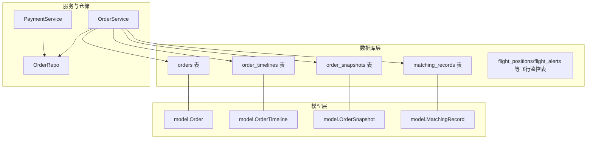
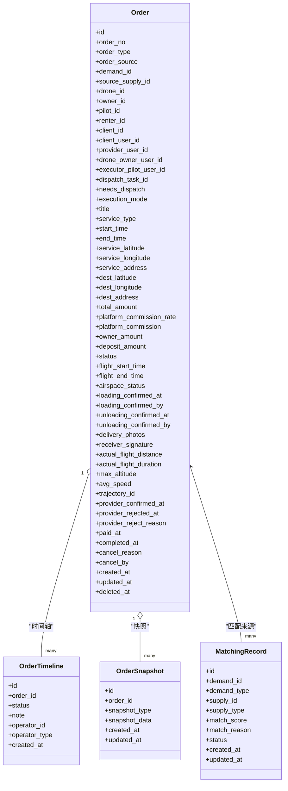
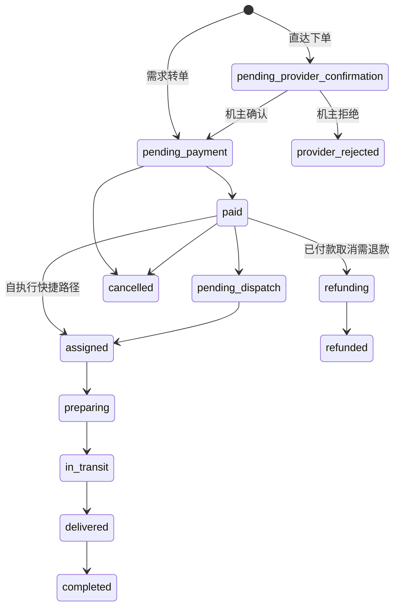
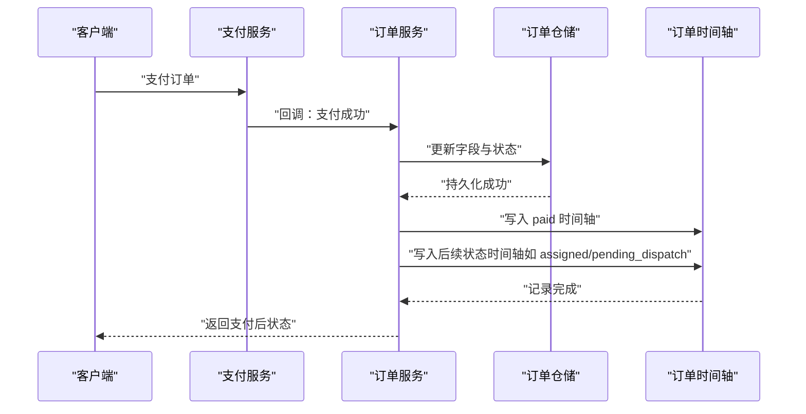
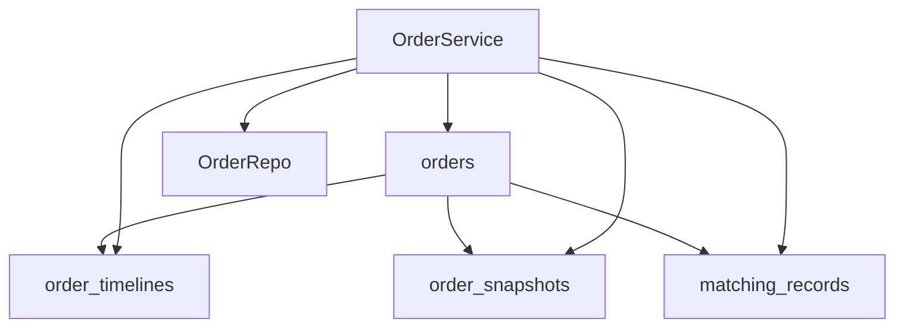

# 订单执行表

<cite>
**本文引用的文件**
- [009_add_order_execution_tables.sql](file://backend/migrations/009_add_order_execution_tables.sql)
- [models.go](file://backend/internal/model/models.go)
- [order_repo.go](file://backend/internal/repository/order_repo.go)
- [order_service.go](file://backend/internal/service/order_service.go)
- [payment_service.go](file://backend/internal/service/payment_service.go)
- [BUSINESS_ROLE_REDESIGN.md](file://BUSINESS_ROLE_REDESIGN.md)
- [001_init_schema.sql](file://backend/migrations/001_init_schema.sql)
- [105_create_order_artifacts.sql](file://backend/migrations/105_create_order_artifacts.sql)
- [901_phase9_prepare_v2_schema.sql](file://backend/migrations/901_phase9_prepare_v2_schema.sql)
</cite>

## 目录
1. [简介](#简介)
2. [项目结构](#项目结构)
3. [核心组件](#核心组件)
4. [架构总览](#架构总览)
5. [详细组件分析](#详细组件分析)
6. [依赖分析](#依赖分析)
7. [性能考量](#性能考量)
8. [故障排查指南](#故障排查指南)
9. [结论](#结论)
10. [附录](#附录)

## 简介
本文件面向无人机租赁平台的订单执行表结构设计，聚焦以下核心表：
- 订单表（Order）
- 订单时间轴（OrderTimeline）
- 订单快照（OrderSnapshot）
- 匹配记录（MatchingRecord）

围绕这些表，文档将系统阐述字段定义、数据类型、约束与索引策略，解释订单状态机（创建、支付、执行中、完成、取消等）的流转逻辑，以及关键执行字段（如飞行时间、实际飞行距离、执行模式等）在表结构层面的体现。同时给出业务规则（如订单来源、派单任务关联等）与生命周期管理在数据库层面的设计落点，并提供DDL示例与字段说明。

## 项目结构
- 数据库层：通过迁移脚本定义表结构与索引，包含订单执行相关扩展与历史演进。
- 模型层：GORM 模型映射订单相关实体，定义字段、索引与关联关系。
- 仓储与服务层：封装订单的增删改查、状态推进、快照生成与支付后处理等业务逻辑。

图表来源
- [models.go](file://backend/internal/model/models.go)
- [order_repo.go](file://backend/internal/repository/order_repo.go)
- [order_service.go](file://backend/internal/service/order_service.go)
- [payment_service.go](file://backend/internal/service/payment_service.go)

章节来源
- [models.go](file://backend/internal/model/models.go)
- [order_repo.go](file://backend/internal/repository/order_repo.go)
- [order_service.go](file://backend/internal/service/order_service.go)
- [payment_service.go](file://backend/internal/service/payment_service.go)

## 核心组件
本节聚焦订单相关表的字段定义、约束与索引策略，以及与业务规则的对应关系。

- 订单表（Order）
  - 字段要点：订单号、订单类型、来源、需求/供给关联、无人机/机主/飞手/租客/客户等多方标识、执行模式、起止时间、服务地址、金额与分成、状态、飞行时间与距离、轨迹ID、空域状态、结算状态与收益等。
  - 约束与索引：唯一索引（订单号）、多处业务索引（drone_id、owner_id、renter_id、status、order_type、execution_mode、dispatch_task_id等），以支撑查询与状态统计。
  - 业务规则：订单来源（如需求市场、直达下单）、派单任务关联（dispatch_task_id）、执行模式（自执行/派单池）、结算状态（待结算/处理中/已结算/失败）等。

- 订单时间轴（OrderTimeline）
  - 字段要点：订单ID、目标状态、备注、操作人与操作方类型（机主/租客/系统/管理员）。
  - 约束与索引：索引（order_id），用于按订单检索状态变迁。

- 订单快照（OrderSnapshot）
  - 字段要点：订单ID、快照类型（client、demand、supply、pricing、execution）、快照数据（JSON）、创建/更新时间。
  - 约束与索引：唯一索引（order_id, snapshot_type），确保每种类型的快照唯一；索引（order_id）加速查询。

- 匹配记录（MatchingRecord）
  - 字段要点：需求/供给ID与类型、匹配分数与原因、状态（推荐/已查看/已联系/已下单/过期）。
  - 约束与索引：索引（demand_id、supply_id、status），支持匹配查询与状态统计。

章节来源
- [models.go](file://backend/internal/model/models.go)
- [009_add_order_execution_tables.sql](file://backend/migrations/009_add_order_execution_tables.sql)
- [105_create_order_artifacts.sql](file://backend/migrations/105_create_order_artifacts.sql)
- [901_phase9_prepare_v2_schema.sql](file://backend/migrations/901_phase9_prepare_v2_schema.sql)

## 架构总览
订单执行表在系统中的作用：
- 订单表承载订单生命周期与关键执行指标；
- 订单时间轴记录状态推进轨迹；
- 订单快照沉淀关键业务快照（客户端、定价、执行等）；
- 匹配记录支撑撮合与溯源。

图表来源
- [models.go](file://backend/internal/model/models.go)

章节来源
- [models.go](file://backend/internal/model/models.go)

## 详细组件分析

### 订单表（Order）字段与约束
- 基础标识与来源
  - 订单号（唯一）、订单类型（rental/cargo）、订单来源（demand_market/supply_direct等）、需求/供给关联ID、派单任务ID。
- 多方角色
  - 无人机、机主、飞手、租客、客户、执行飞手用户ID、提供方用户ID等。
- 服务与时间
  - 服务起止时间、服务经纬度与地址、目的地经纬度与地址、标题、服务类型。
- 价格与分成
  - 总金额、平台抽成率与抽成金额、机主收益、押金金额。
- 状态与时间线
  - 订单状态（默认created）、支付时间、完成时间、取消原因与取消方。
- 飞行与轨迹
  - 起飞/降落时间、实际飞行距离/时长、最大高度、平均速度、轨迹ID。
- 空域与结算
  - 空域申请状态、结算状态、结算时间、飞手收益与分成比例。
- 装载/卸载与交付
  - 装载确认时间/人、卸载确认时间/人、送达照片、收货人签名。
- 索引策略
  - 唯一索引（订单号）、业务索引（drone_id、owner_id、renter_id、status、order_type、execution_mode、dispatch_task_id、airspace_status、settlement_status）。

章节来源
- [models.go](file://backend/internal/model/models.go)
- [009_add_order_execution_tables.sql](file://backend/migrations/009_add_order_execution_tables.sql)
- [001_init_schema.sql](file://backend/migrations/001_init_schema.sql)

### 订单时间轴（OrderTimeline）
- 字段与用途
  - 记录每次状态推进的目标状态、备注、操作人与操作方类型（owner/renter/system/admin），用于审计与追溯。
- 索引
  - 对 order_id 建立索引，便于按订单查询状态变迁。

章节来源
- [models.go](file://backend/internal/model/models.go)

### 订单快照（OrderSnapshot）
- 字段与用途
  - 快照类型：client、demand、supply、pricing、execution；快照数据为JSON，记录关键业务快照。
- 约束与索引
  - 唯一索引（order_id, snapshot_type），确保每类快照唯一；对 order_id 建立索引。

章节来源
- [models.go](file://backend/internal/model/models.go)
- [105_create_order_artifacts.sql](file://backend/migrations/105_create_order_artifacts.sql)
- [901_phase9_prepare_v2_schema.sql](file://backend/migrations/901_phase9_prepare_v2_schema.sql)

### 匹配记录（MatchingRecord）
- 字段与用途
  - 记录撮合来源（需求/供给ID与类型）、匹配分数与原因、状态（recommended/viewed/contacted/ordered/expired）。
- 索引
  - 对 demand_id、supply_id、status 建立索引，支撑匹配查询与状态统计。

章节来源
- [models.go](file://backend/internal/model/models.go)

### 订单状态机与生命周期
- 状态机（基于业务文档）
  - 初始：pending_provider_confirmation（直达下单待机主确认）、pending_payment（需求转单待支付）。
  - 支付后：paid；随后进入 pending_dispatch（需要派单）或 assigned（自执行直接进入）。
  - 执行阶段：preparing → in_transit → delivered → completed。
  - 取消与退款：pending_payment/cancelled、paid/refunding → refunded。
- 执行阶段推进规则
  - assigned → preparing：飞手点击“开始准备”。
  - preparing → in_transit：飞手上报起飞或系统检测到首个飞行位置点。
  - in_transit → delivered：飞手到达目的地点击“确认投送”。
  - delivered → completed：客户签收或系统自动确认。

图表来源
- [BUSINESS_ROLE_REDESIGN.md](file://BUSINESS_ROLE_REDESIGN.md)

章节来源
- [BUSINESS_ROLE_REDESIGN.md](file://BUSINESS_ROLE_REDESIGN.md)

### 关键字段与业务规则
- 订单来源（order_source）
  - 支持 demand_market（需求市场）、supply_direct（供给直达）等，影响初始状态与流程。
- 派单任务关联（dispatch_task_id）
  - 订单与派单任务的关联，用于派单池执行场景。
- 执行模式（execution_mode）
  - self_execute（自执行）、dispatch_pool（派单池），影响支付后状态推进与飞手绑定。
- 飞行时间与距离
  - flight_start_time/flight_end_time、actual_flight_distance、actual_flight_duration、max_altitude、avg_speed，用于飞行监控与结算。
- 结算与收益
  - settlement_status、settled_at、pilot_amount、pilot_commission_rate，用于结算与分账。

章节来源
- [models.go](file://backend/internal/model/models.go)
- [009_add_order_execution_tables.sql](file://backend/migrations/009_add_order_execution_tables.sql)
- [BUSINESS_ROLE_REDESIGN.md](file://BUSINESS_ROLE_REDESIGN.md)

### 支付后状态推进与时间轴
- 支付后处理
  - 根据执行模式与飞手状态，可能直接进入 assigned（自执行），否则进入 pending_dispatch。
  - 更新 paid_at、pilot_id、executor_pilot_user_id、needs_dispatch、execution_mode 等字段。
  - 写入 paid 与后续状态的时间轴记录。
- 仓储与服务交互
  - 服务层负责解析支付后的状态推进与字段更新，仓储层负责持久化与时间轴写入。

图表来源
- [payment_service.go](file://backend/internal/service/payment_service.go)
- [order_repo.go](file://backend/internal/repository/order_repo.go)
- [order_service.go](file://backend/internal/service/order_service.go)

章节来源
- [payment_service.go](file://backend/internal/service/payment_service.go)
- [order_repo.go](file://backend/internal/repository/order_repo.go)
- [order_service.go](file://backend/internal/service/order_service.go)

## 依赖分析
- 订单表与时间轴/快照/匹配记录的依赖
  - 订单时间轴与快照均以订单为主键建立外键关系，保证订单状态与关键快照的完整性。
  - 匹配记录与订单存在业务关联（订单来源于匹配），便于溯源。
- 索引与查询耦合
  - 订单表的多处业务索引（drone_id、owner_id、status、execution_mode、dispatch_task_id等）支撑查询与报表统计。
- 服务与仓储协作
  - 服务层负责状态推进与快照生成，仓储层负责数据持久化与索引查询。

图表来源
- [models.go](file://backend/internal/model/models.go)
- [order_repo.go](file://backend/internal/repository/order_repo.go)
- [order_service.go](file://backend/internal/service/order_service.go)

章节来源
- [models.go](file://backend/internal/model/models.go)
- [order_repo.go](file://backend/internal/repository/order_repo.go)
- [order_service.go](file://backend/internal/service/order_service.go)

## 性能考量
- 索引策略
  - 订单表已建立多处业务索引，建议结合查询模式（按状态、按角色、按执行模式、按派单任务）评估是否需要复合索引或分区。
- JSON 字段
  - 快照数据采用 JSON 存储，适合灵活扩展，但查询与排序需谨慎，建议仅在必要时使用。
- 写入热点
  - 支付后状态推进与时间轴写入较为频繁，建议在高并发场景下考虑批量写入与异步化。

## 故障排查指南
- 状态推进异常
  - 检查订单状态推进逻辑与时间轴记录是否一致；确认支付后处理是否正确更新字段与写入时间轴。
- 快照缺失
  - 确认快照生成流程是否在关键节点（创建、支付、执行、完成）触发；检查唯一索引与JSON数据格式。
- 索引失效
  - 检查查询SQL是否命中预期索引；对高频查询字段评估复合索引或物化视图。

章节来源
- [order_service.go](file://backend/internal/service/order_service.go)
- [order_repo.go](file://backend/internal/repository/order_repo.go)
- [105_create_order_artifacts.sql](file://backend/migrations/105_create_order_artifacts.sql)

## 结论
订单执行表结构在平台中承担核心职责：承载订单生命周期、记录状态推进轨迹、沉淀关键业务快照、支撑匹配与派单。通过合理的字段设计、约束与索引策略，以及清晰的状态机与业务规则，能够有效支撑订单的高效执行与可观测性。建议在后续迭代中持续优化索引与查询模式，完善快照与审计能力，提升系统的稳定性与可维护性。

## 附录
- DDL示例与字段说明（基于迁移与模型）
  - 订单表（部分字段）
    - 订单号（唯一）、订单类型、订单来源、需求/供给关联、无人机/机主/飞手/租客/客户/执行飞手用户ID、派单任务ID、执行模式、标题、服务类型、起止时间、服务与目的地地址、总金额、平台抽成率与抽成金额、机主收益、押金金额、状态、支付/完成时间、飞行时间与距离、最大高度、平均速度、轨迹ID、空域状态、结算状态与时间、飞手收益与分成比例、装载/卸载确认与交付照片/签名等。
  - 订单时间轴
    - 订单ID、目标状态、备注、操作人与操作方类型。
  - 订单快照
    - 订单ID、快照类型（client/demand/supply/pricing/execution）、快照数据（JSON）。
  - 匹配记录
    - 需求/供给ID与类型、匹配分数与原因、状态（recommended/viewed/contacted/ordered/expired）。

章节来源
- [009_add_order_execution_tables.sql](file://backend/migrations/009_add_order_execution_tables.sql)
- [105_create_order_artifacts.sql](file://backend/migrations/105_create_order_artifacts.sql)
- [models.go](file://backend/internal/model/models.go)