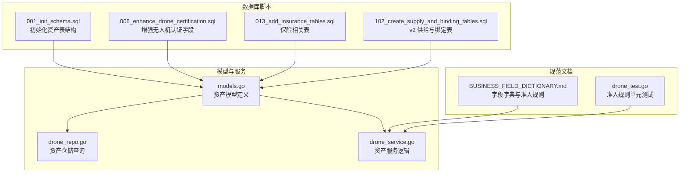
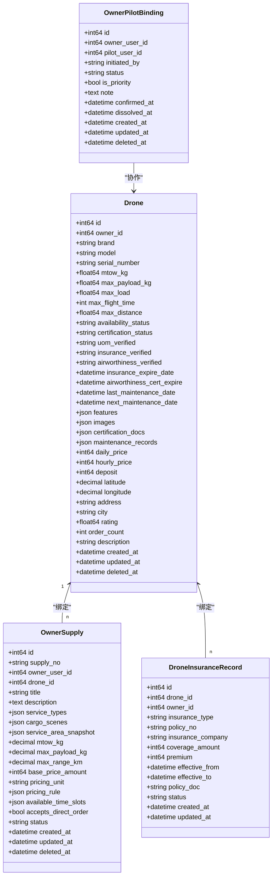
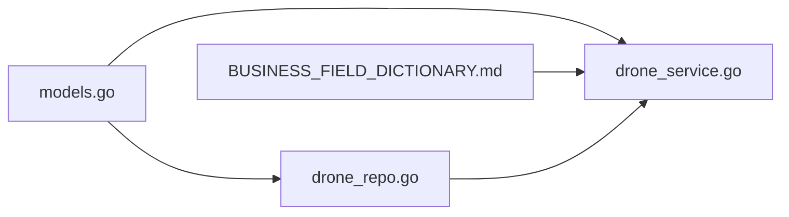

# 资产管理表

<cite>
**本文引用的文件**
- [models.go](file://backend/internal/model/models.go)
- [001_init_schema.sql](file://backend/migrations/001_init_schema.sql)
- [006_enhance_drone_certification.sql](file://backend/migrations/006_enhance_drone_certification.sql)
- [013_add_insurance_tables.sql](file://backend/migrations/013_add_insurance_tables.sql)
- [102_create_supply_and_binding_tables.sql](file://backend/migrations/102_create_supply_and_binding_tables.sql)
- [drone_repo.go](file://backend/internal/repository/drone_repo.go)
- [drone_service.go](file://backend/internal/service/drone_service.go)
- [BUSINESS_FIELD_DICTIONARY.md](file://BUSINESS_FIELD_DICTIONARY.md)
- [drone_test.go](file://backend/internal/model/drone_test.go)
</cite>

## 目录
1. [简介](#简介)
2. [项目结构](#项目结构)
3. [核心组件](#核心组件)
4. [架构总览](#架构总览)
5. [详细组件分析](#详细组件分析)
6. [依赖分析](#依赖分析)
7. [性能考虑](#性能考虑)
8. [故障排查指南](#故障排查指南)
9. [结论](#结论)
10. [附录](#附录)

## 简介
本文件面向无人机租赁平台的资产管理表，聚焦于无人机(Drone)、机主供给(OwnerSupply)、机主-飞手协作(OwnerPilotBinding)等资产相关表的表结构设计与业务规则落地。重点涵盖：
- 无人机关键参数字段（最大起飞重量MTOW、最大载荷MaxPayload、续航时间MaxFlightTime等）的定义与约束
- 无人机状态管理（可用性状态availability_status、认证状态certification_status、保险状态、适航状态等）
- 资产准入门槛与市场准入规则（重载门槛、资质校验、有效期校验）
- 资产生命周期管理在表结构层面的体现（供给状态、索引策略、外键约束）

## 项目结构
资产管理相关的核心文件分布如下：
- 数据库初始化与增强脚本：负责初始表结构与后续字段增强
- 模型定义：定义了 Drone、OwnerSupply、OwnerPilotBinding 等资产相关实体及其字段、约束与关系
- 仓储与服务：封装了资产查询、状态更新、准入校验等业务逻辑
- 字典与规范：统一字段命名、状态枚举、准入门槛等业务规范

图表来源
- [001_init_schema.sql:28-62](file://backend/migrations/001_init_schema.sql#L28-L62)
- [006_enhance_drone_certification.sql:1-87](file://backend/migrations/006_enhance_drone_certification.sql#L1-L87)
- [013_add_insurance_tables.sql:1-241](file://backend/migrations/013_add_insurance_tables.sql#L1-L241)
- [102_create_supply_and_binding_tables.sql:1-227](file://backend/migrations/102_create_supply_and_binding_tables.sql#L1-L227)
- [models.go:91-148](file://backend/internal/model/models.go#L91-L148)
- [drone_repo.go:1-201](file://backend/internal/repository/drone_repo.go#L1-L201)
- [drone_service.go:1-472](file://backend/internal/service/drone_service.go#L1-L472)
- [BUSINESS_FIELD_DICTIONARY.md:74-86](file://BUSINESS_FIELD_DICTIONARY.md#L74-L86)
- [drone_test.go:1-38](file://backend/internal/model/drone_test.go#L1-L38)

章节来源
- [001_init_schema.sql:28-62](file://backend/migrations/001_init_schema.sql#L28-L62)
- [006_enhance_drone_certification.sql:1-87](file://backend/migrations/006_enhance_drone_certification.sql#L1-L87)
- [013_add_insurance_tables.sql:1-241](file://backend/migrations/013_add_insurance_tables.sql#L1-L241)
- [102_create_supply_and_binding_tables.sql:1-227](file://backend/migrations/102_create_supply_and_binding_tables.sql#L1-L227)
- [models.go:91-148](file://backend/internal/model/models.go#L91-L148)
- [drone_repo.go:1-201](file://backend/internal/repository/drone_repo.go#L1-L201)
- [drone_service.go:1-472](file://backend/internal/service/drone_service.go#L1-L472)
- [BUSINESS_FIELD_DICTIONARY.md:74-86](file://BUSINESS_FIELD_DICTIONARY.md#L74-L86)
- [drone_test.go:1-38](file://backend/internal/model/drone_test.go#L1-L38)

## 核心组件
- 无人机资产表(drones)：承载无人机基本信息、参数、认证状态、地理位置、价格与保险/适航等合规字段
- 机主供给表(owner_supplies)：表达机主当前可被撮合的服务能力，与无人机绑定并受准入门槛与资质状态影响
- 机主-飞手协作表(owner_pilot_bindings)：表达长期协作关系，支撑派单与履约协同
- 保险相关表：保险保单、理赔、产品配置等，支撑无人机保险合规与风险控制
- 仓储与服务：提供准入校验、状态更新、地理检索、维护与保险记录管理等能力

章节来源
- [models.go:91-148](file://backend/internal/model/models.go#L91-L148)
- [models.go:230-255](file://backend/internal/model/models.go#L230-L255)
- [models.go:880-899](file://backend/internal/model/models.go#L880-L899)
- [models.go:928-951](file://backend/internal/model/models.go#L928-L951)
- [drone_repo.go:1-201](file://backend/internal/repository/drone_repo.go#L1-L201)
- [drone_service.go:1-472](file://backend/internal/service/drone_service.go#L1-L472)

## 架构总览
资产管理表的架构围绕“资产主体(drones)”、“供给能力(owner_supplies)”、“协作关系(owner_pilot_bindings)”以及“合规凭证(保险/适航/维护)”展开，通过模型、仓储与服务层实现准入门槛、状态流转与生命周期管理。

图表来源
- [models.go:91-148](file://backend/internal/model/models.go#L91-L148)
- [models.go:230-255](file://backend/internal/model/models.go#L230-L255)
- [models.go:880-899](file://backend/internal/model/models.go#L880-L899)
- [models.go:928-951](file://backend/internal/model/models.go#L928-L951)

## 详细组件分析

### 无人机资产表(drones)字段定义与约束
- 基础信息：品牌、型号、序列号、经纬度、地址、城市、描述
- 参数字段：最大起飞重量(mtow_kg)、最大载荷(max_payload_kg)、最大航程(max_distance)、续航时间(max_flight_time)、最大载荷(max_load)、图片与特性(features/images)
- 价格与押金：日租/小时租价格、押金
- 位置与评分：经纬度、城市、评分(rating)、订单数(order_count)
- 状态字段：可用性状态(availability_status)、认证状态(certification_status)
- UOM登记：登记号(uom_registration_no)、验证状态(uom_verified)、验证时间(uom_verified_at)、登记证明(uom_registration_doc)
- 保险信息：保单号(insurance_policy_no)、保险公司(insurance_company)、保额(insurance_coverage)、到期日(insurance_expire_date)、保险证明(insurance_doc)、验证状态(insurance_verified)
- 适航证书：证书编号(airworthiness_cert_no)、到期日(airworthiness_cert_expire)、证明文件(airworthiness_cert_doc)、验证状态(airworthiness_verified)
- 维护记录：最近维护日期(last_maintenance_date)、下次维护日期(next_maintenance_date)、维护记录历史(maintenance_records)
- 软删除索引：deleted_at

索引策略
- 唯一索引：serial_number
- 普通索引：owner_id、city、certification_status、availability_status、deleted_at
- 新增认证相关索引：uom_registration_no、uom_verified、insurance_verified、airworthiness_verified

章节来源
- [001_init_schema.sql:28-62](file://backend/migrations/001_init_schema.sql#L28-L62)
- [006_enhance_drone_certification.sql:7-36](file://backend/migrations/006_enhance_drone_certification.sql#L7-L36)
- [models.go:91-148](file://backend/internal/model/models.go#L91-L148)

### 机主供给表(owner_supplies)字段定义与约束
- 基本信息：供给编号(supply_no)、机主用户ID(owner_user_id)、关联无人机ID(drone_id)、标题(title)、描述(description)
- 能力与场景：服务类型(service_types)、可承接场景(cargo_scenes)、服务区域快照(service_area_snapshot)
- 资产能力：最大起飞重量(mtow_kg)、最大载重(max_payload_kg)、最大航程(max_range_km)
- 计价：基础价格(base_price_amount)、计价单位(pricing_unit)、计价规则(pricing_rule)、可服务时间段(available_time_slots)
- 行为开关：是否接受直达下单(accepts_direct_order)
- 状态：draft、active、paused、closed
- 软删除索引：deleted_at

索引策略
- owner_user_id、drone_id、status、deleted_at

章节来源
- [102_create_supply_and_binding_tables.sql:5-34](file://backend/migrations/102_create_supply_and_binding_tables.sql#L5-L34)
- [models.go:230-255](file://backend/internal/model/models.go#L230-L255)

### 机主-飞手协作表(owner_pilot_bindings)字段定义与约束
- 关联：机主用户ID(owner_user_id)、飞手用户ID(pilot_user_id)
- 关系属性：发起方(initiated_by)、状态(status)、是否优先(is_priority)、备注(note)
- 时间：确认时间(confirmed_at)、解除时间(dissolved_at)
- 软删除索引：deleted_at

索引策略
- owner_user_id、pilot_user_id、pair组合索引、status、deleted_at

章节来源
- [102_create_supply_and_binding_tables.sql:36-57](file://backend/migrations/102_create_supply_and_binding_tables.sql#L36-L57)
- [models.go:880-899](file://backend/internal/model/models.go#L880-L899)

### 保险相关表
- 保险保单表(insurance_policies)：保单号、保单类型、投保人信息、被保险标的、保险金额与费用、保险公司、保险期限、状态与支付状态、附件等
- 保险理赔表(insurance_claims)：理赔单号、关联保单/订单、报案人信息、事故信息、损失金额、证据材料、责任认定、流程状态与时间节点、处理人员、备注
- 理赔时间线表(claim_timelines)：动作类型、操作人、附件、备注
- 保险产品配置表(insurance_products)：产品代码、名称、险种、保险公司、费率与保额区间、保障范围与免责条款、强制性与启用状态

章节来源
- [013_add_insurance_tables.sql:6-68](file://backend/migrations/013_add_insurance_tables.sql#L6-L68)
- [013_add_insurance_tables.sql:70-150](file://backend/migrations/013_add_insurance_tables.sql#L70-L150)
- [013_add_insurance_tables.sql:152-168](file://backend/migrations/013_add_insurance_tables.sql#L152-L168)
- [013_add_insurance_tables.sql:170-203](file://backend/migrations/013_add_insurance_tables.sql#L170-L203)

### 无人机参数存储与准入门槛
- 关键参数字段
  - 最大起飞重量(MTOW)：mtow_kg
  - 最大载荷(MaxPayload)：max_payload_kg 或 max_load
  - 续航时间(MaxFlightTime)：max_flight_time
  - 最大航程(MaxDistance)：max_distance
- 适航性判断逻辑
  - 重载门槛：mtow_kg ≥ 150、max_payload_kg 或 max_load ≥ 50
  - 市场准入条件：availability_status = available、certification_status = approved、uom_verified = verified、insurance_verified = verified、airworthiness_verified = verified
  - 有效期校验：insurance_expire_date > now、airworthiness_cert_expire > now
- 业务规则
  - 关键资质重新提交并进入pending时，owner_supplies必须降级为paused
  - 历史legacy供给在满足门槛与资质后可自动恢复为active

章节来源
- [BUSINESS_FIELD_DICTIONARY.md:74-86](file://BUSINESS_FIELD_DICTIONARY.md#L74-L86)
- [models.go:154-199](file://backend/internal/model/models.go#L154-L199)
- [drone_repo.go:59-72](file://backend/internal/repository/drone_repo.go#L59-L72)
- [drone_repo.go:171-200](file://backend/internal/repository/drone_repo.go#L171-L200)
- [drone_service.go:325-358](file://backend/internal/service/drone_service.go#L325-L358)
- [drone_test.go:1-38](file://backend/internal/model/drone_test.go#L1-L38)

### 资产生命周期管理
- 无人机生命周期：创建→参数完善→提交认证→审核→发布/暂停/关闭
- 供给生命周期：草稿→发布→暂停→关闭（终态）
- 协作关系生命周期：待确认→激活→暂停→拒绝→过期→解除（终态）
- 自动化规则
  - 关键资质回到pending/rejected/expired或不再满足重载门槛时，供给自动降级为paused
  - legacy供给在满足门槛与资质后可自动从paused恢复为active

章节来源
- [BUSINESS_FIELD_DICTIONARY.md:74-86](file://BUSINESS_FIELD_DICTIONARY.md#L74-L86)
- [102_create_supply_and_binding_tables.sql:59-138](file://backend/migrations/102_create_supply_and_binding_tables.sql#L59-L138)
- [102_create_supply_and_binding_tables.sql:140-227](file://backend/migrations/102_create_supply_and_binding_tables.sql#L140-L227)

## 依赖分析
- 模型依赖
  - Drone 与 OwnerSupply 通过 drone_id 关联
  - Drone 与 DroneInsuranceRecord 通过 drone_id 关联
  - OwnerPilotBinding 通过 owner_user_id/pilot_user_id 关联用户
- 仓储依赖
  - DroneRepo 提供准入校验、地理检索、维护与保险记录查询
  - DroneService 封装准入状态检查、UOM/保险/适航审核、维护记录添加等业务流程
- 规范依赖
  - BUSINESS_FIELD_DICTIONARY.md 统一字段命名、状态枚举与准入门槛

图表来源
- [models.go:91-148](file://backend/internal/model/models.go#L91-L148)
- [drone_repo.go:1-201](file://backend/internal/repository/drone_repo.go#L1-L201)
- [drone_service.go:1-472](file://backend/internal/service/drone_service.go#L1-L472)
- [BUSINESS_FIELD_DICTIONARY.md:74-86](file://BUSINESS_FIELD_DICTIONARY.md#L74-L86)

章节来源
- [models.go:91-148](file://backend/internal/model/models.go#L91-L148)
- [drone_repo.go:1-201](file://backend/internal/repository/drone_repo.go#L1-L201)
- [drone_service.go:1-472](file://backend/internal/service/drone_service.go#L1-L472)
- [BUSINESS_FIELD_DICTIONARY.md:74-86](file://BUSINESS_FIELD_DICTIONARY.md#L74-L86)

## 性能考虑
- 索引优化
  - 在 drones 上增加 uo_verification、insurance_verified、airworthiness_verified 等高频过滤字段索引，提升准入查询效率
  - owner_supplies 的 owner_user_id、drone_id、status 等字段建立复合索引，加速供给检索与状态过滤
- 查询路径
  - 使用 Haversine 公式进行地理范围检索，并结合索引与距离投影，减少全表扫描
  - 对历史回填与迁移场景，采用分批处理与事务控制，降低锁竞争
- 存储与归档
  - 维护记录与保险记录采用 JSON 字段存储，便于扩展但需注意查询性能，必要时拆分独立表

[本节为通用指导，无需特定文件引用]

## 故障排查指南
- 常见问题
  - 无人机无法进入市场：检查 availability_status、certification_status、uom_verified、insurance_verified、airworthiness_verified 是否均为有效状态，且 mtow_kg 与 max_payload_kg/max_load 满足重载门槛
  - 供给状态异常：当关键资质回到 pending/rejected/expired 或不再满足门槛时，系统会自动降级为 paused；检查相关字段与迁移回填逻辑
  - 保险/适航过期：确保 insurance_expire_date 与 airworthiness_cert_expire 未过期，否则将影响准入
- 排查步骤
  - 使用 DroneRepo 的准入校验方法与地理检索方法快速定位问题
  - 检查 DroneService 的认证状态检查接口返回，确认各项验证结果
  - 对历史 legacy 供给，核对回填逻辑与状态转换规则

章节来源
- [drone_repo.go:59-72](file://backend/internal/repository/drone_repo.go#L59-L72)
- [drone_repo.go:171-200](file://backend/internal/repository/drone_repo.go#L171-L200)
- [drone_service.go:438-471](file://backend/internal/service/drone_service.go#L438-L471)
- [102_create_supply_and_binding_tables.sql:59-138](file://backend/migrations/102_create_supply_and_binding_tables.sql#L59-L138)

## 结论
本资产管理表设计以“准入门槛+状态管理+生命周期自动化”为核心，通过 drones、owner_supplies、owner_pilot_bindings 与保险/适航/维护等合规字段的协同，实现了重载吊运场景下的资产准入与市场匹配。配合完善的索引策略与服务层封装，既能满足高并发检索与状态更新需求，又能保证业务规则的可追溯与可审计。

[本节为总结，无需特定文件引用]

## 附录
- DDL示例（基于脚本与模型）
  - 无人机表(drones)：参见 [001_init_schema.sql:28-62](file://backend/migrations/001_init_schema.sql#L28-L62) 与 [006_enhance_drone_certification.sql:7-36](file://backend/migrations/006_enhance_drone_certification.sql#L7-L36)
  - 机主供给表(owner_supplies)：参见 [102_create_supply_and_binding_tables.sql:5-34](file://backend/migrations/102_create_supply_and_binding_tables.sql#L5-L34)
  - 机主-飞手协作表(owner_pilot_bindings)：参见 [102_create_supply_and_binding_tables.sql:36-57](file://backend/migrations/102_create_supply_and_binding_tables.sql#L36-L57)
  - 保险相关表：参见 [013_add_insurance_tables.sql:6-68](file://backend/migrations/013_add_insurance_tables.sql#L6-L68)、[013_add_insurance_tables.sql:70-150](file://backend/migrations/013_add_insurance_tables.sql#L70-L150)、[013_add_insurance_tables.sql:152-168](file://backend/migrations/013_add_insurance_tables.sql#L152-L168)、[013_add_insurance_tables.sql:170-203](file://backend/migrations/013_add_insurance_tables.sql#L170-L203)
- 业务规则参考
  - 重载门槛与准入规则：参见 [BUSINESS_FIELD_DICTIONARY.md:74-86](file://BUSINESS_FIELD_DICTIONARY.md#L74-L86)
  - 准入校验与状态检查：参见 [drone_repo.go:59-72](file://backend/internal/repository/drone_repo.go#L59-L72)、[drone_repo.go:171-200](file://backend/internal/repository/drone_repo.go#L171-L200)、[drone_service.go:438-471](file://backend/internal/service/drone_service.go#L438-L471)
  - 单元测试：参见 [drone_test.go:1-38](file://backend/internal/model/drone_test.go#L1-L38)