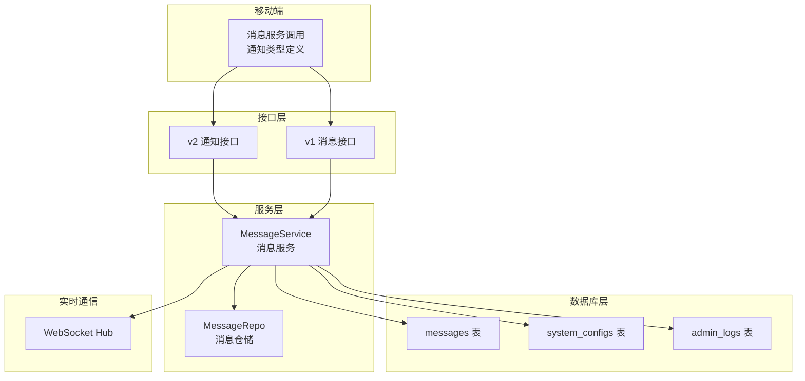
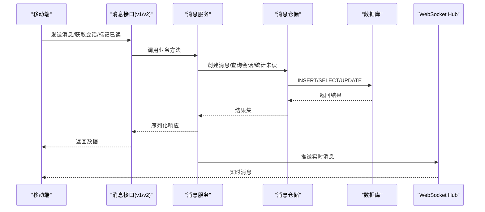
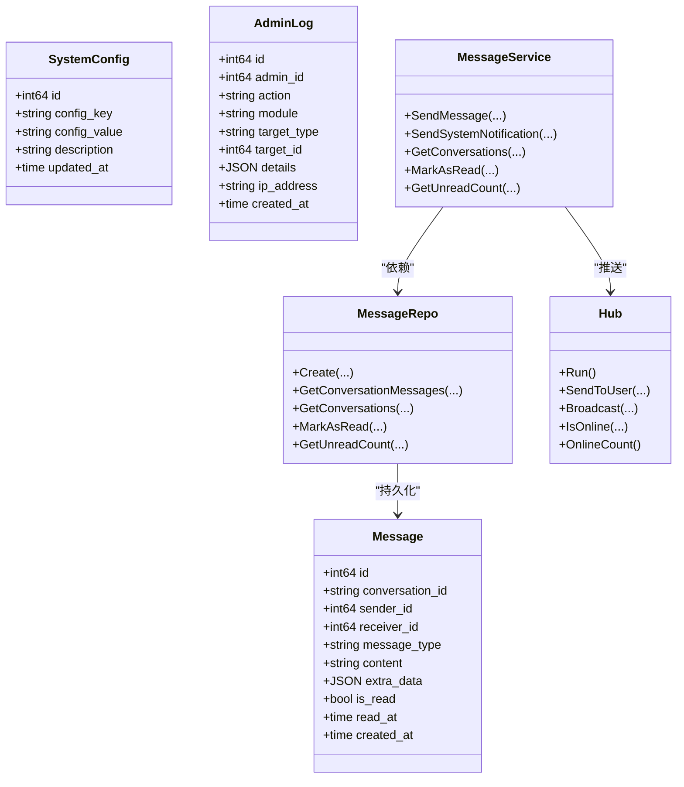
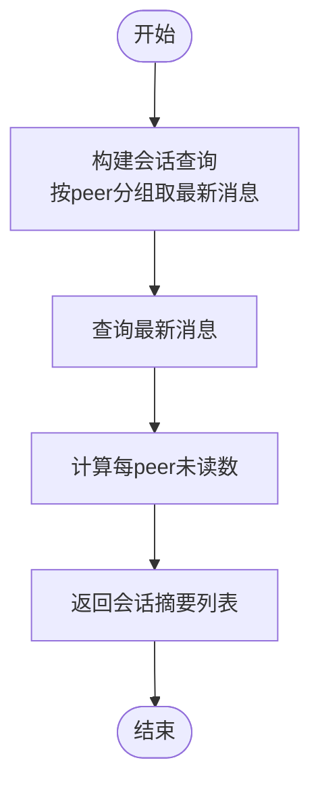
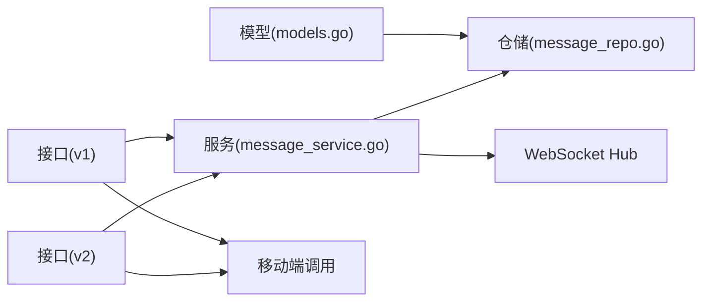

# 通信通知表

<cite>
**本文档引用的文件**
- [backend/internal/model/models.go](file://backend/internal/model/models.go)
- [backend/migrations/001_init_schema.sql](file://backend/migrations/001_init_schema.sql)
- [backend/migrations/002_seed_data.sql](file://backend/migrations/002_seed_data.sql)
- [backend/migrations/004_fix_conversation_id.sql](file://backend/migrations/004_fix_conversation_id.sql)
- [backend/internal/service/message_service.go](file://backend/internal/service/message_service.go)
- [backend/internal/repository/message_repo.go](file://backend/internal/repository/message_repo.go)
- [backend/internal/api/v1/message/handler.go](file://backend/internal/api/v1/message/handler.go)
- [backend/internal/websocket/hub.go](file://backend/internal/websocket/hub.go)
- [backend/internal/api/v2/notification/handler.go](file://backend/internal/api/v2/notification/handler.go)
- [mobile/src/services/message.ts](file://mobile/src/services/message.ts)
- [mobile/src/types/index.ts](file://mobile/src/types/index.ts)
</cite>

## 目录
1. [简介](#简介)
2. [项目结构](#项目结构)
3. [核心组件](#核心组件)
4. [架构总览](#架构总览)
5. [详细组件分析](#详细组件分析)
6. [依赖关系分析](#依赖关系分析)
7. [性能考虑](#性能考虑)
8. [故障排除指南](#故障排除指南)
9. [结论](#结论)
10. [附录](#附录)

## 简介
本文件面向无人机租赁平台的通信通知表设计，聚焦消息表（Message）、系统配置表（SystemConfig）、管理员日志表（AdminLog）以及实时通信机制。文档从表结构、字段定义、约束与索引策略出发，解释消息类型（文本、图片、位置、订单等）在数据库中的表达方式，并阐述会话标识（conversation_id）、发送接收方（sender_id/receiver_id）、已读状态（is_read）等核心字段如何支撑用户间沟通与系统通知。同时，结合迁移脚本与服务层实现，给出完整的DDL示例与字段说明，覆盖消息内容存储（JSON格式）、额外数据扩展（extra_data）等业务规则。

## 项目结构
围绕通信通知的核心文件分布如下：
- 数据库初始化与迁移：messages、system_configs、admin_logs 表的建表与种子数据
- 业务模型与仓储：Message、SystemConfig、AdminLog 模型定义与仓储查询
- 服务层：消息发送、会话管理、系统通知、未读统计等
- 接口层：v1/v2 的消息与通知接口
- 实时通信：WebSocket Hub 广播与点对点推送
- 移动端：消息服务调用与通知类型定义

**图表来源**
- [backend/migrations/001_init_schema.sql:220-235](file://backend/migrations/001_init_schema.sql#L220-L235)
- [backend/internal/model/models.go:572-587](file://backend/internal/model/models.go#L572-L587)
- [backend/internal/service/message_service.go:13-19](file://backend/internal/service/message_service.go#L13-L19)
- [backend/internal/repository/message_repo.go:9-15](file://backend/internal/repository/message_repo.go#L9-L15)
- [backend/internal/api/v1/message/handler.go:57-87](file://backend/internal/api/v1/message/handler.go#L57-L87)
- [backend/internal/api/v2/notification/handler.go:62-93](file://backend/internal/api/v2/notification/handler.go#L62-L93)
- [backend/internal/websocket/hub.go:12-43](file://backend/internal/websocket/hub.go#L12-L43)
- [mobile/src/services/message.ts:1-35](file://mobile/src/services/message.ts#L1-L35)
- [mobile/src/types/index.ts:278-305](file://mobile/src/types/index.ts#L278-L305)

**章节来源**
- [backend/migrations/001_init_schema.sql:220-235](file://backend/migrations/001_init_schema.sql#L220-L235)
- [backend/internal/model/models.go:572-587](file://backend/internal/model/models.go#L572-L587)

## 核心组件
本节概述三个关键表及其职责与关联：
- 消息表（messages）：承载用户间通信与系统通知，支持多种消息类型与JSON扩展字段
- 系统配置表（system_configs）：集中存储平台运行参数，支持动态调整
- 管理员日志表（admin_logs）：记录管理员操作轨迹，便于审计与追踪

字段与约束要点（以模型定义为准）：
- 消息表（Message）
  - 主键：id（自增）
  - 会话标识：conversation_id（varchar(50)，非空，索引）
  - 发送方/接收方：sender_id、receiver_id（bigint，非空，索引）
  - 消息类型：message_type（varchar(20)，默认text；支持text/image/location/order/system）
  - 内容：content（text）
  - 扩展：extra_data（json）
  - 已读：is_read（bool，默认false），read_at（datetime）
  - 时间：created_at（datetime）

- 系统配置表（SystemConfig）
  - 主键：id（自增）
  - 键值：config_key（varchar(100)，唯一索引，非空），config_value（text）
  - 描述：description（varchar(255)）
  - 更新：updated_at（datetime）

- 管理员日志表（AdminLog）
  - 主键：id（自增）
  - 管理员：admin_id（bigint，非空，索引）
  - 动作：action（varchar(50)）
  - 模块/目标：module（varchar(50)）、target_type（varchar(50)）、target_id（bigint，默认0）
  - 明细：details（json）
  - IP：ip_address（varchar(50)）
  - 时间：created_at（datetime）

**章节来源**
- [backend/internal/model/models.go:572-587](file://backend/internal/model/models.go#L572-L587)
- [backend/internal/model/models.go:626-636](file://backend/internal/model/models.go#L626-L636)
- [backend/internal/model/models.go:638-648](file://backend/internal/model/models.go#L638-L648)

## 架构总览
消息与通知的端到端流程如下：
- 移动端通过消息服务发起发送请求
- 服务层构造消息并写入消息表
- 仓储层执行SQL插入与查询
- WebSocket Hub 将实时消息推送给在线用户
- 通知接口支持系统通知列表与标记已读

**图表来源**
- [mobile/src/services/message.ts:1-35](file://mobile/src/services/message.ts#L1-L35)
- [backend/internal/api/v1/message/handler.go:57-87](file://backend/internal/api/v1/message/handler.go#L57-L87)
- [backend/internal/api/v2/notification/handler.go:62-93](file://backend/internal/api/v2/notification/handler.go#L62-L93)
- [backend/internal/service/message_service.go:21-40](file://backend/internal/service/message_service.go#L21-L40)
- [backend/internal/repository/message_repo.go:17-29](file://backend/internal/repository/message_repo.go#L17-L29)
- [backend/internal/websocket/hub.go:99-116](file://backend/internal/websocket/hub.go#L99-L116)

## 详细组件分析

### 消息表（messages）设计
- 字段定义与约束
  - conversation_id：会话标识，统一格式“小ID-大ID”，用于唯一确定双方会话
  - sender_id/receiver_id：消息发送与接收方，均建立索引以支持查询
  - message_type：消息类型枚举，支持text、image、location、order、system等
  - content：消息正文，text类型
  - extra_data：JSON扩展字段，承载图片URL、位置坐标、订单ID等结构化数据
  - is_read/read_at：已读状态与读取时间，支持未读统计与消息标记
  - created_at：消息创建时间

- 索引策略
  - 对 conversation_id、sender_id、receiver_id 建立索引，满足会话查询、发件人/收件人过滤与未读统计

- DDL示例（基于初始化脚本）
  - 建表语句包含主键、字段类型、默认值、索引与字符集设置
  - 参考路径：[backend/migrations/001_init_schema.sql:220-235](file://backend/migrations/001_init_schema.sql#L220-L235)

- 迁移与一致性
  - 历史数据存在两种conversation_id格式，迁移脚本统一为“小ID-大ID”
  - 参考路径：[backend/migrations/004_fix_conversation_id.sql:1-55](file://backend/migrations/004_fix_conversation_id.sql#L1-L55)

- 消息类型与内容存储
  - 文本（text）：content直接存储文本
  - 图片（image）：content存储简要描述或占位，extra_data存储图片URL数组
  - 位置（location）：content存储简要描述，extra_data存储经纬度与地址
  - 订单（order）：content存储简要描述，extra_data携带订单ID、状态、金额等
  - 系统（system）：content为系统提示文本，extra_data携带标题与事件类型等

- 业务规则
  - 会话ID由较小用户ID与较大用户ID拼接组成，确保同一会话唯一性
  - 系统通知使用特殊会话ID前缀“system-用户ID”，便于筛选与统计

**章节来源**
- [backend/migrations/001_init_schema.sql:220-235](file://backend/migrations/001_init_schema.sql#L220-L235)
- [backend/migrations/004_fix_conversation_id.sql:1-55](file://backend/migrations/004_fix_conversation_id.sql#L1-L55)
- [backend/internal/model/models.go:572-587](file://backend/internal/model/models.go#L572-L587)
- [backend/internal/service/message_service.go:123-137](file://backend/internal/service/message_service.go#L123-L137)

### 系统配置表（system_configs）设计
- 字段定义与约束
  - config_key：唯一键，作为配置项标识
  - config_value：文本形式存储配置值
  - description：配置项说明
  - updated_at：自动更新时间戳

- 使用场景
  - 平台运营参数：如佣金比例、支付超时、匹配半径等
  - 动态开关：通过修改配置值控制功能开关或阈值

- DDL示例（基于初始化脚本）
  - 唯一键与索引、默认值与字符集
  - 参考路径：[backend/migrations/001_init_schema.sql:275-283](file://backend/migrations/001_init_schema.sql#L275-L283)

**章节来源**
- [backend/migrations/001_init_schema.sql:275-283](file://backend/migrations/001_init_schema.sql#L275-L283)
- [backend/internal/model/models.go:626-636](file://backend/internal/model/models.go#L626-L636)

### 管理员日志表（admin_logs）设计
- 字段定义与约束
  - admin_id：管理员用户ID，索引加速查询
  - action/module/target_type/target_id：记录操作动作、模块、目标类型与ID
  - details：JSON结构记录操作详情（如审批结果、变更前后值）
  - ip_address：操作IP
  - created_at：记录时间

- 使用场景
  - 审批与配置变更审计
  - 用户与设备状态变更追踪

- DDL示例（基于初始化脚本）
  - 索引策略与JSON字段
  - 参考路径：[backend/migrations/001_init_schema.sql:285-299](file://backend/migrations/001_init_schema.sql#L285-L299)

**章节来源**
- [backend/migrations/001_init_schema.sql:285-299](file://backend/migrations/001_init_schema.sql#L285-L299)
- [backend/internal/model/models.go:638-648](file://backend/internal/model/models.go#L638-L648)

### 实时通信机制
- 会话标识与消息路由
  - conversation_id统一为“小ID-大ID”，确保双向会话唯一
  - 系统通知使用“system-用户ID”会话ID，便于定向推送

- WebSocket Hub
  - 支持注册/注销客户端、广播与定向推送
  - 类型字段（chat、order_update、system、matching）用于前端路由渲染

- 服务集成
  - 消息服务在成功入库后触发推送，确保在线用户即时收到消息
  - 未读统计与标记已读通过仓储查询与更新实现

**图表来源**
- [backend/internal/model/models.go:572-587](file://backend/internal/model/models.go#L572-L587)
- [backend/internal/model/models.go:626-636](file://backend/internal/model/models.go#L626-L636)
- [backend/internal/model/models.go:638-648](file://backend/internal/model/models.go#L638-L648)
- [backend/internal/service/message_service.go:13-19](file://backend/internal/service/message_service.go#L13-L19)
- [backend/internal/repository/message_repo.go:9-15](file://backend/internal/repository/message_repo.go#L9-L15)
- [backend/internal/websocket/hub.go:12-43](file://backend/internal/websocket/hub.go#L12-L43)

**章节来源**
- [backend/internal/service/message_service.go:21-40](file://backend/internal/service/message_service.go#L21-L40)
- [backend/internal/repository/message_repo.go:67-85](file://backend/internal/repository/message_repo.go#L67-L85)
- [backend/internal/websocket/hub.go:99-116](file://backend/internal/websocket/hub.go#L99-L116)

### 消息类型与内容存储策略
- 文本（text）
  - content：纯文本
  - extra_data：可选，用于附加元数据
- 图片（image）
  - content：简要描述或占位
  - extra_data：图片URL数组或缩略图信息
- 位置（location）
  - content：简要描述
  - extra_data：经纬度、精确地址、POI名称
- 订单（order）
  - content：简要描述
  - extra_data：订单ID、状态、金额、起止时间、服务地址
- 系统（system）
  - content：系统提示文本
  - extra_data：标题、事件类型、业务类型、相关ID、状态、原因等

- 存储与查询
  - 文本与JSON字段配合，既保证通用性又支持灵活扩展
  - 通过message_type与extra_data联合解析，前端可按类型渲染不同UI

**章节来源**
- [backend/internal/service/message_service.go:85-121](file://backend/internal/service/message_service.go#L85-L121)
- [backend/internal/api/v2/notification/handler.go:75-93](file://backend/internal/api/v2/notification/handler.go#L75-L93)
- [mobile/src/types/index.ts:278-305](file://mobile/src/types/index.ts#L278-L305)

### 会话与未读统计流程
- 会话聚合
  - 通过最新一条消息聚合每对用户的会话摘要，包含最后一条消息、类型、对方ID与未读数
- 未读统计
  - 统计某用户对所有联系人的未读消息数
  - 统计系统通知未读数（sender_id=0）

**图表来源**
- [backend/internal/repository/message_repo.go:31-56](file://backend/internal/repository/message_repo.go#L31-L56)

**章节来源**
- [backend/internal/repository/message_repo.go:31-56](file://backend/internal/repository/message_repo.go#L31-L56)
- [backend/internal/service/message_service.go:42-44](file://backend/internal/service/message_service.go#L42-L44)

## 依赖关系分析
- 模型到仓储
  - Message/ SystemConfig/ AdminLog 模型映射到对应表，仓储负责具体SQL执行
- 服务到仓储
  - MessageService 聚合业务逻辑，委托仓储完成数据访问
- 接口到服务
  - v1/v2 接口层负责参数校验与响应封装，调用服务层
- 实时通信
  - 服务层在消息入库后触发WebSocket推送，Hub负责路由与广播

**图表来源**
- [backend/internal/model/models.go:572-587](file://backend/internal/model/models.go#L572-L587)
- [backend/internal/repository/message_repo.go:9-15](file://backend/internal/repository/message_repo.go#L9-L15)
- [backend/internal/service/message_service.go:13-19](file://backend/internal/service/message_service.go#L13-L19)
- [backend/internal/api/v1/message/handler.go:57-87](file://backend/internal/api/v1/message/handler.go#L57-L87)
- [backend/internal/api/v2/notification/handler.go:62-93](file://backend/internal/api/v2/notification/handler.go#L62-L93)
- [backend/internal/websocket/hub.go:12-43](file://backend/internal/websocket/hub.go#L12-L43)
- [mobile/src/services/message.ts:1-35](file://mobile/src/services/message.ts#L1-L35)

**章节来源**
- [backend/internal/service/message_service.go:13-19](file://backend/internal/service/message_service.go#L13-L19)
- [backend/internal/repository/message_repo.go:9-15](file://backend/internal/repository/message_repo.go#L9-L15)
- [backend/internal/api/v1/message/handler.go:57-87](file://backend/internal/api/v1/message/handler.go#L57-L87)
- [backend/internal/api/v2/notification/handler.go:62-93](file://backend/internal/api/v2/notification/handler.go#L62-L93)

## 性能考虑
- 索引优化
  - 会话查询：conversation_id 索引
  - 发送/接收过滤：sender_id、receiver_id 索引
  - 未读统计：receiver_id+is_read 组合条件需评估是否需要复合索引
- 分页与排序
  - 按 created_at DESC 分页，避免全表扫描
- JSON字段
  - extra_data 为JSON类型，查询时建议仅在必要字段上进行过滤
- 实时推送
  - Hub采用通道与并发安全map，注意高并发下的内存与连接数控制

[本节为通用指导，无需特定文件引用]

## 故障排除指南
- 会话ID不一致导致消息丢失
  - 症状：移动端显示异常或消息缺失
  - 处理：执行会话ID统一迁移脚本，确保格式为“小ID-大ID”
  - 参考：[backend/migrations/004_fix_conversation_id.sql:1-55](file://backend/migrations/004_fix_conversation_id.sql#L1-L55)
- 未读统计异常
  - 症状：未读数不准确
  - 处理：检查仓储未读统计SQL，确认receiver_id与is_read条件
  - 参考：[backend/internal/repository/message_repo.go:73-85](file://backend/internal/repository/message_repo.go#L73-L85)
- 系统通知无法标记已读
  - 症状：通知列表存在未读
  - 处理：确认通知ID与接收者匹配，sender_id=0 条件正确
  - 参考：[backend/internal/repository/message_repo.go:113-117](file://backend/internal/repository/message_repo.go#L113-L117)
- WebSocket 推送失败
  - 症状：在线用户未收到消息
  - 处理：检查Hub注册/注销流程与TargetID路由
  - 参考：[backend/internal/websocket/hub.go:45-97](file://backend/internal/websocket/hub.go#L45-L97)

**章节来源**
- [backend/migrations/004_fix_conversation_id.sql:1-55](file://backend/migrations/004_fix_conversation_id.sql#L1-L55)
- [backend/internal/repository/message_repo.go:73-85](file://backend/internal/repository/message_repo.go#L73-L85)
- [backend/internal/repository/message_repo.go:113-117](file://backend/internal/repository/message_repo.go#L113-L117)
- [backend/internal/websocket/hub.go:45-97](file://backend/internal/websocket/hub.go#L45-L97)

## 结论
本文档从表结构、字段定义、约束与索引策略入手，系统梳理了消息表（Message）、系统配置表（SystemConfig）、管理员日志表（AdminLog）在通信通知体系中的作用，并结合服务层与仓储层实现，给出了消息类型区分、会话标识、已读状态等核心字段的设计要点与业务规则。通过迁移脚本与接口实现，平台实现了稳定的消息通信与系统通知能力，同时具备良好的扩展性与可维护性。

[本节为总结性内容，无需特定文件引用]

## 附录
- DDL示例（建表与种子数据）
  - 消息表：[backend/migrations/001_init_schema.sql:220-235](file://backend/migrations/001_init_schema.sql#L220-L235)
  - 系统配置表：[backend/migrations/001_init_schema.sql:275-283](file://backend/migrations/001_init_schema.sql#L275-L283)
  - 管理员日志表：[backend/migrations/001_init_schema.sql:285-299](file://backend/migrations/001_init_schema.sql#L285-L299)
  - 种子数据（消息与管理员日志）：[backend/migrations/002_seed_data.sql:100-112](file://backend/migrations/002_seed_data.sql#L100-L112), [backend/migrations/002_seed_data.sql:140-148](file://backend/migrations/002_seed_data.sql#L140-L148)
- 消息类型与extra_data约定
  - 参考：[backend/internal/service/message_service.go:85-121](file://backend/internal/service/message_service.go#L85-L121), [mobile/src/types/index.ts:278-305](file://mobile/src/types/index.ts#L278-L305)
- 接口与移动端调用
  - v1消息接口：[backend/internal/api/v1/message/handler.go:57-87](file://backend/internal/api/v1/message/handler.go#L57-L87)
  - v2通知接口：[backend/internal/api/v2/notification/handler.go:62-93](file://backend/internal/api/v2/notification/handler.go#L62-L93)
  - 移动端消息服务：[mobile/src/services/message.ts:1-35](file://mobile/src/services/message.ts#L1-L35)

**章节来源**
- [backend/migrations/001_init_schema.sql:220-235](file://backend/migrations/001_init_schema.sql#L220-L235)
- [backend/migrations/001_init_schema.sql:275-283](file://backend/migrations/001_init_schema.sql#L275-L283)
- [backend/migrations/001_init_schema.sql:285-299](file://backend/migrations/001_init_schema.sql#L285-L299)
- [backend/migrations/002_seed_data.sql:100-112](file://backend/migrations/002_seed_data.sql#L100-L112)
- [backend/migrations/002_seed_data.sql:140-148](file://backend/migrations/002_seed_data.sql#L140-L148)
- [backend/internal/service/message_service.go:85-121](file://backend/internal/service/message_service.go#L85-L121)
- [mobile/src/types/index.ts:278-305](file://mobile/src/types/index.ts#L278-L305)
- [backend/internal/api/v1/message/handler.go:57-87](file://backend/internal/api/v1/message/handler.go#L57-L87)
- [backend/internal/api/v2/notification/handler.go:62-93](file://backend/internal/api/v2/notification/handler.go#L62-L93)
- [mobile/src/services/message.ts:1-35](file://mobile/src/services/message.ts#L1-L35)