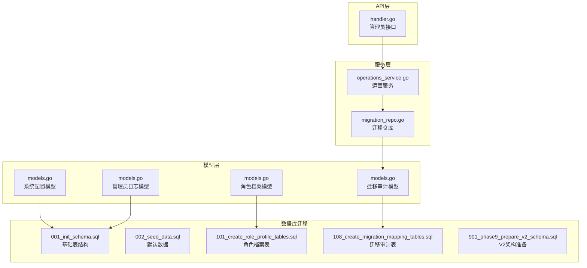
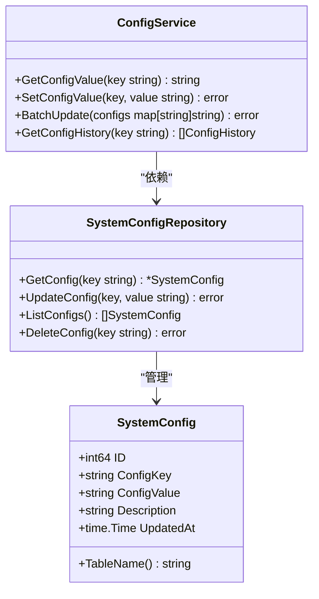
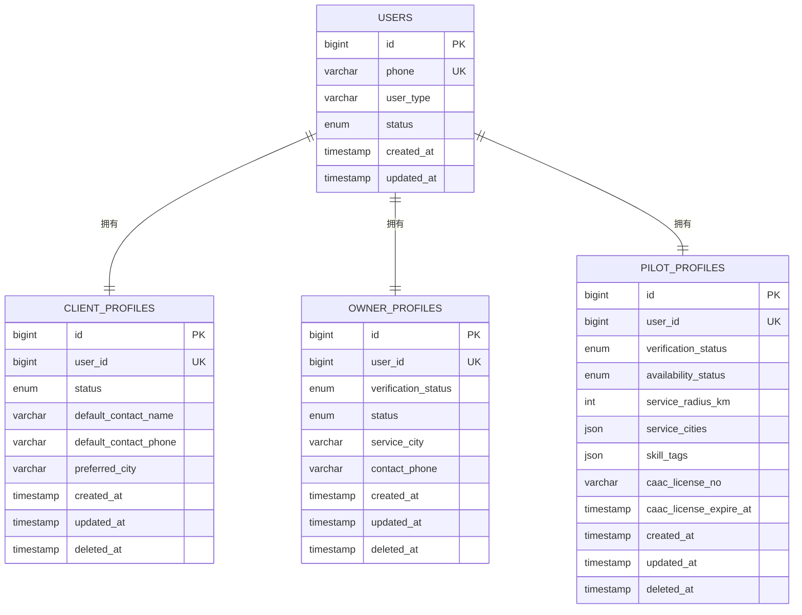
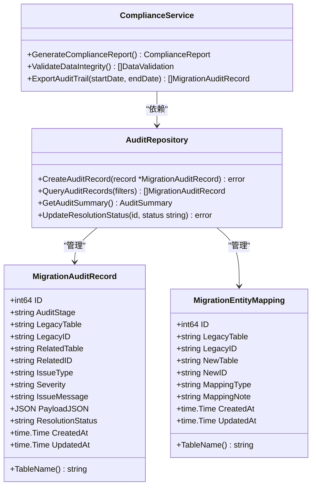
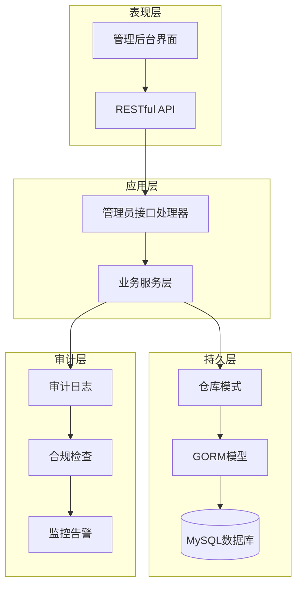
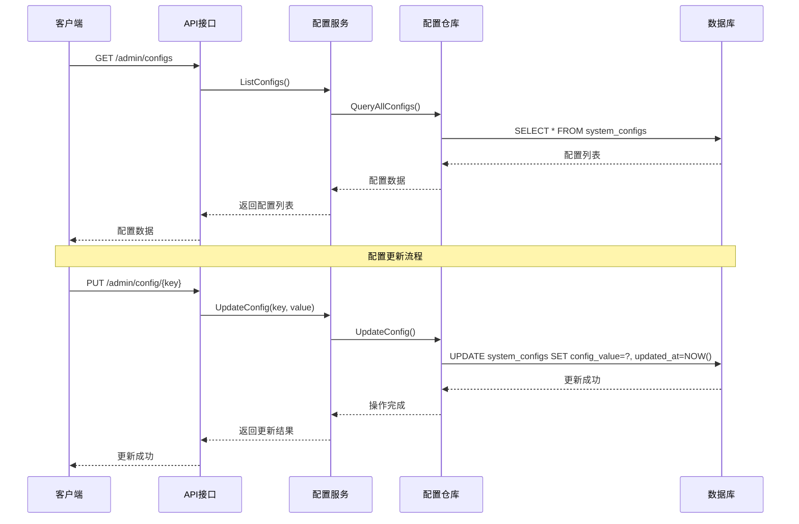
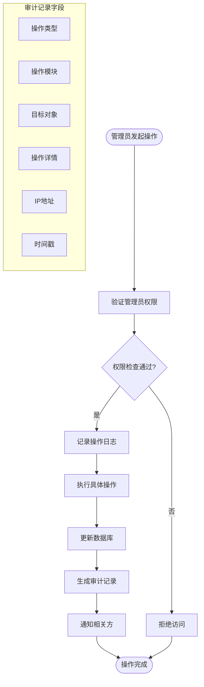
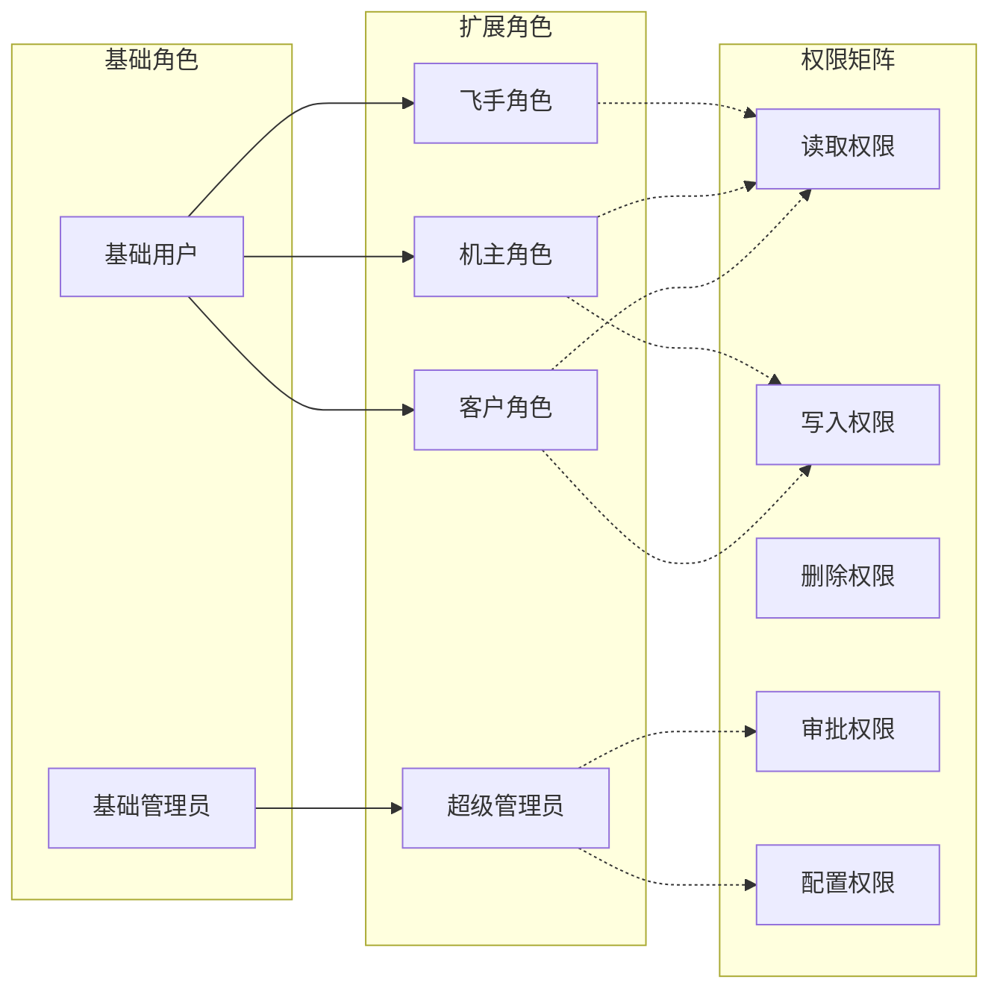
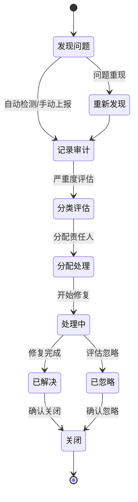
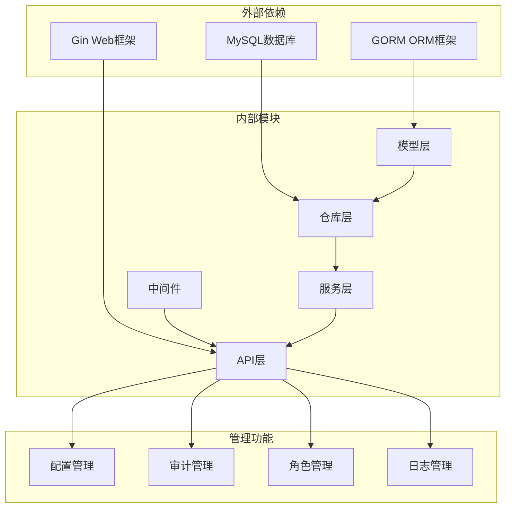

# 系统管理表

<cite>
**本文档引用的文件**
- [models.go](file://backend/internal/model/models.go)
- [001_init_schema.sql](file://backend/migrations/001_init_schema.sql)
- [002_seed_data.sql](file://backend/migrations/002_seed_data.sql)
- [101_create_role_profile_tables.sql](file://backend/migrations/101_create_role_profile_tables.sql)
- [108_create_migration_mapping_tables.sql](file://backend/migrations/108_create_migration_mapping_tables.sql)
- [901_phase9_prepare_v2_schema.sql](file://backend/migrations/901_phase9_prepare_v2_schema.sql)
- [migration_repo.go](file://backend/internal/repository/migration_repo.go)
- [operations_service.go](file://backend/internal/service/operations_service.go)
- [handler.go](file://backend/internal/api/v1/admin/handler.go)
</cite>

## 目录
1. [简介](#简介)
2. [项目结构](#项目结构)
3. [核心组件](#核心组件)
4. [架构概览](#架构概览)
5. [详细组件分析](#详细组件分析)
6. [依赖分析](#依赖分析)
7. [性能考虑](#性能考虑)
8. [故障排除指南](#故障排除指南)
9. [结论](#结论)

## 简介

本文档详细描述无人机租赁平台的系统管理功能相关的表结构设计，重点关注以下管理相关表：

- 系统配置(SystemConfig)：动态配置管理、配置版本控制、配置生效机制
- 管理员日志(AdminLog)：管理员操作记录、操作类型分类、操作详情记录、IP地址追踪
- 角色权限体系：角色定义、权限分配、权限继承
- 系统审计(SystemAudit)：数据变更追踪、操作回滚、合规性检查

该系统采用基于GORM的ORM映射，所有管理相关表都通过统一的模型定义进行管理，并提供完整的索引优化以确保查询性能。

## 项目结构

系统管理功能涉及的核心文件组织如下：



**图表来源**
- [models.go:626-688](file://backend/internal/model/models.go#L626-L688)
- [001_init_schema.sql:275-299](file://backend/migrations/001_init_schema.sql#L275-L299)
- [101_create_role_profile_tables.sql:1-61](file://backend/migrations/101_create_role_profile_tables.sql#L1-L61)

**章节来源**
- [models.go:626-688](file://backend/internal/model/models.go#L626-L688)
- [001_init_schema.sql:275-299](file://backend/migrations/001_init_schema.sql#L275-L299)

## 核心组件

### 系统配置表(SystemConfig)

系统配置表提供动态配置管理功能，支持运行时配置修改而无需重启服务。



**图表来源**
- [models.go:626-636](file://backend/internal/model/models.go#L626-L636)

系统配置表的关键特性：

- **唯一键约束**：`config_key` 唯一标识配置项
- **文本存储**：`config_value` 使用TEXT类型支持复杂配置
- **时间戳**：`updated_at` 自动更新配置修改时间
- **索引优化**：对 `config_key` 建立唯一索引

### 管理员日志表(AdminLog)

管理员日志表记录所有管理员的操作行为，提供完整的审计追踪能力。

```mermaid
classDiagram
class AdminLog {
+int64 ID
+int64 AdminID
+string Action
+string Module
+string TargetType
+int64 TargetID
+JSON Details
+string IpAddress
+time.Time CreatedAt
+TableName() string
}
class AdminLogRepository {
+CreateLog(log *AdminLog) error
+QueryLogs(filters) []AdminLog
+ExportLogs(startDate, endDate) []AdminLog
+GetLogStats() LogStats
}
class AuditService {
+LogAdminAction(adminID int64, action, module string, target interface{}, details map[string]interface{}) error
+GenerateAuditReport(filters) AuditReport
+GetRecentActivity(limit int) []AdminLog
}
AdminLogRepository --> AdminLog : "管理"
AuditService --> AdminLogRepository : "依赖"
```

**图表来源**
- [models.go:638-652](file://backend/internal/model/models.go#L638-L652)

管理员日志的关键字段说明：

- **操作类型分类**：`action` 字段支持 approve、reject、update、delete 等操作类型
- **模块分类**：`module` 字段标识操作所属模块（user、drone、config等）
- **目标追踪**：`target_type` 和 `target_id` 提供精确的目标定位
- **详情记录**：`details` JSON字段存储操作详情和变更前后值
- **IP追踪**：`ip_address` 记录操作来源IP地址

### 角色权限体系

角色权限体系通过角色档案表实现，支持多角色管理和权限继承。



**图表来源**
- [101_create_role_profile_tables.sql:5-61](file://backend/migrations/101_create_role_profile_tables.sql#L5-L61)

角色权限表的设计特点：

- **一对一关系**：每个用户仅对应一个角色档案
- **状态管理**：支持激活、禁用、审核等状态控制
- **灵活字段**：使用JSON字段存储动态配置和技能标签
- **索引优化**：对关键查询字段建立索引

### 系统审计表

系统审计表提供数据变更追踪和合规性检查功能。



**图表来源**
- [models.go:654-688](file://backend/internal/model/models.go#L654-L688)

系统审计的关键功能：

- **迁移追踪**：记录数据迁移过程中的问题和异常
- **实体映射**：跟踪旧系统实体与新系统实体的对应关系
- **严重度分级**：支持 info、warning、critical 三个级别的问题分类
- **处理状态**：跟踪问题从发现到解决的完整生命周期

**章节来源**
- [models.go:626-688](file://backend/internal/model/models.go#L626-L688)
- [101_create_role_profile_tables.sql:1-141](file://backend/migrations/101_create_role_profile_tables.sql#L1-L141)

## 架构概览

系统管理功能采用分层架构设计，确保职责分离和可维护性：



**图表来源**
- [handler.go:317-342](file://backend/internal/api/v1/admin/handler.go#L317-L342)
- [operations_service.go:8-18](file://backend/internal/service/operations_service.go#L8-L18)
- [migration_repo.go:11-21](file://backend/internal/repository/migration_repo.go#L11-L21)

## 详细组件分析

### 系统配置管理流程

系统配置管理采用"键值对+版本控制"的设计模式：



**图表来源**
- [models.go:626-636](file://backend/internal/model/models.go#L626-L636)
- [001_init_schema.sql:275-283](file://backend/migrations/001_init_schema.sql#L275-L283)

### 管理员操作审计流程

管理员操作审计提供完整的操作追踪能力：



**图表来源**
- [models.go:638-652](file://backend/internal/model/models.go#L638-L652)
- [002_seed_data.sql:140-148](file://backend/migrations/002_seed_data.sql#L140-L148)

### 角色权限继承机制

角色权限体系通过继承和组合实现灵活的权限管理：



**图表来源**
- [101_create_role_profile_tables.sql:5-61](file://backend/migrations/101_create_role_profile_tables.sql#L5-L61)

### 系统审计工作流

系统审计提供从发现问题到解决问题的完整工作流：



**图表来源**
- [models.go:670-688](file://backend/internal/model/models.go#L670-L688)
- [108_create_migration_mapping_tables.sql:21-41](file://backend/migrations/108_create_migration_mapping_tables.sql#L21-L41)

**章节来源**
- [models.go:626-688](file://backend/internal/model/models.go#L626-L688)
- [001_init_schema.sql:275-299](file://backend/migrations/001_init_schema.sql#L275-L299)
- [002_seed_data.sql:140-148](file://backend/migrations/002_seed_data.sql#L140-L148)
- [101_create_role_profile_tables.sql:1-141](file://backend/migrations/101_create_role_profile_tables.sql#L1-L141)
- [108_create_migration_mapping_tables.sql:21-41](file://backend/migrations/108_create_migration_mapping_tables.sql#L21-L41)

## 依赖分析

系统管理功能的依赖关系呈现清晰的分层结构：



**图表来源**
- [handler.go:317-342](file://backend/internal/api/v1/admin/handler.go#L317-L342)
- [operations_service.go:8-18](file://backend/internal/service/operations_service.go#L8-L18)
- [migration_repo.go:11-21](file://backend/internal/repository/migration_repo.go#L11-L21)

**章节来源**
- [handler.go:317-342](file://backend/internal/api/v1/admin/handler.go#L317-L342)
- [operations_service.go:8-18](file://backend/internal/service/operations_service.go#L8-L18)
- [migration_repo.go:11-21](file://backend/internal/repository/migration_repo.go#L11-L21)

## 性能考虑

系统管理功能在设计时充分考虑了性能优化：

### 索引策略
- **唯一索引**：配置键、用户手机号、实体映射唯一性保证
- **复合索引**：审计记录按严重度和更新时间排序
- **全文检索**：支持审计消息的模糊查询

### 查询优化
- **分页查询**：所有列表查询支持分页，避免大数据量加载
- **条件过滤**：支持多维度过滤和排序
- **批量操作**：支持批量配置更新和审计记录处理

### 缓存策略
- **配置缓存**：热点配置项内存缓存
- **权限缓存**：用户权限信息缓存
- **审计统计**：高频统计查询结果缓存

## 故障排除指南

### 常见问题及解决方案

**配置无法更新**
- 检查配置键是否存在且未被锁定
- 验证数据库连接和权限
- 查看配置历史记录确认变更

**审计记录缺失**
- 确认审计开关是否开启
- 检查数据库表结构完整性
- 验证审计服务进程状态

**权限验证失败**
- 检查用户角色状态
- 验证权限继承链
- 确认权限缓存同步

**章节来源**
- [models.go:626-688](file://backend/internal/model/models.go#L626-L688)
- [migration_repo.go:23-59](file://backend/internal/repository/migration_repo.go#L23-L59)

## 结论

无人机租赁平台的系统管理功能通过精心设计的表结构和完善的架构实现了：

1. **完整的配置管理体系**：支持动态配置、版本控制和热更新
2. **全面的审计追踪能力**：提供操作日志、数据变更和合规检查
3. **灵活的角色权限架构**：支持多角色管理和权限继承
4. **高效的性能表现**：通过索引优化和缓存策略确保系统响应

这些设计为平台的稳定运行和合规管理提供了坚实的技术基础，同时保持了良好的可扩展性和可维护性。