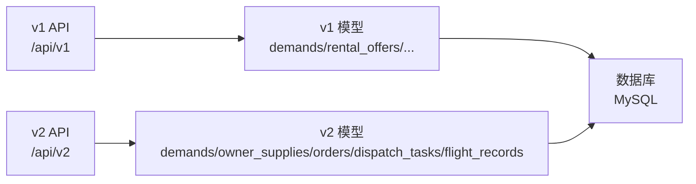
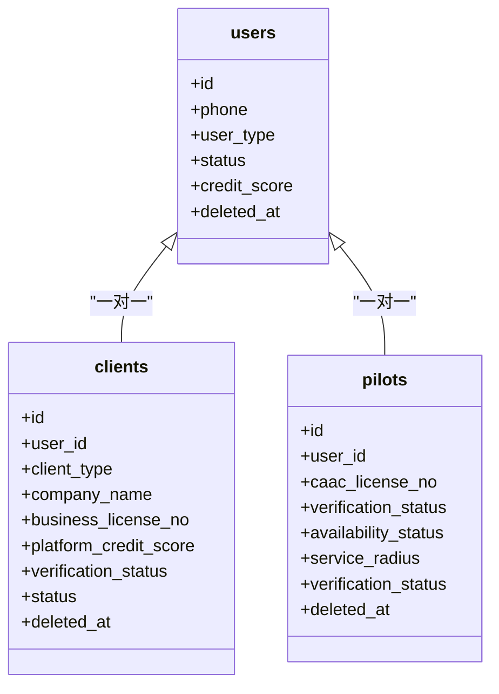
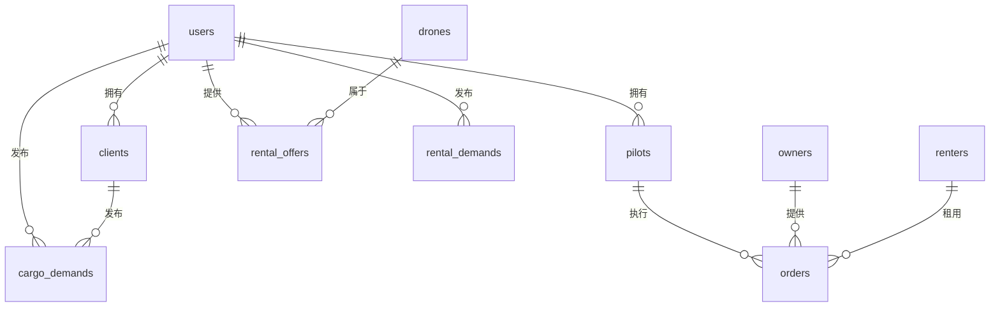
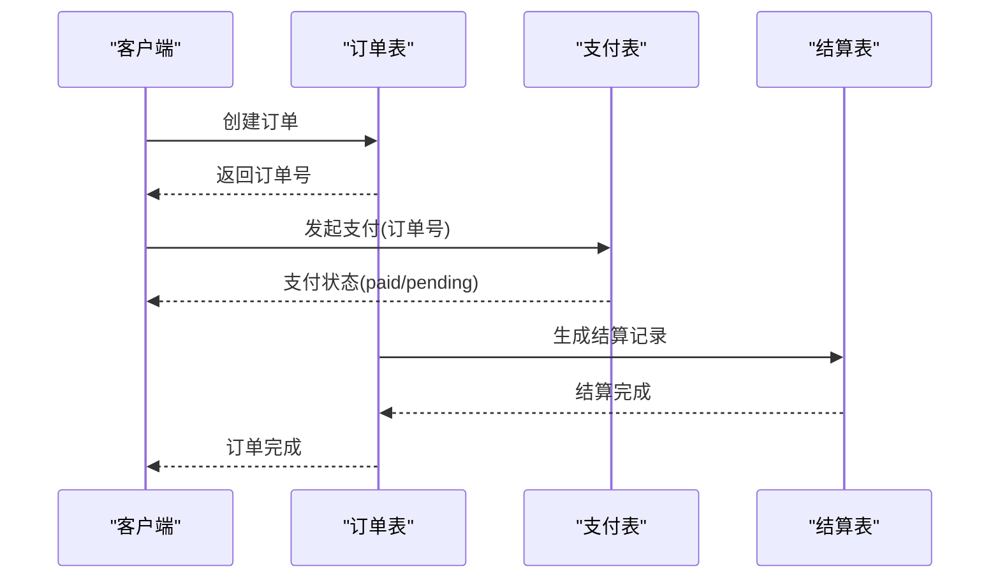
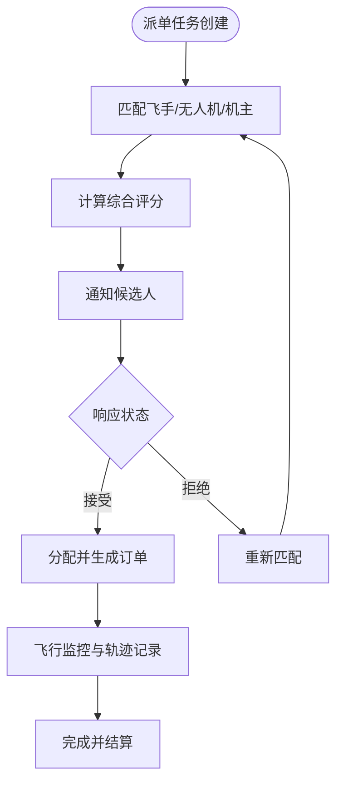
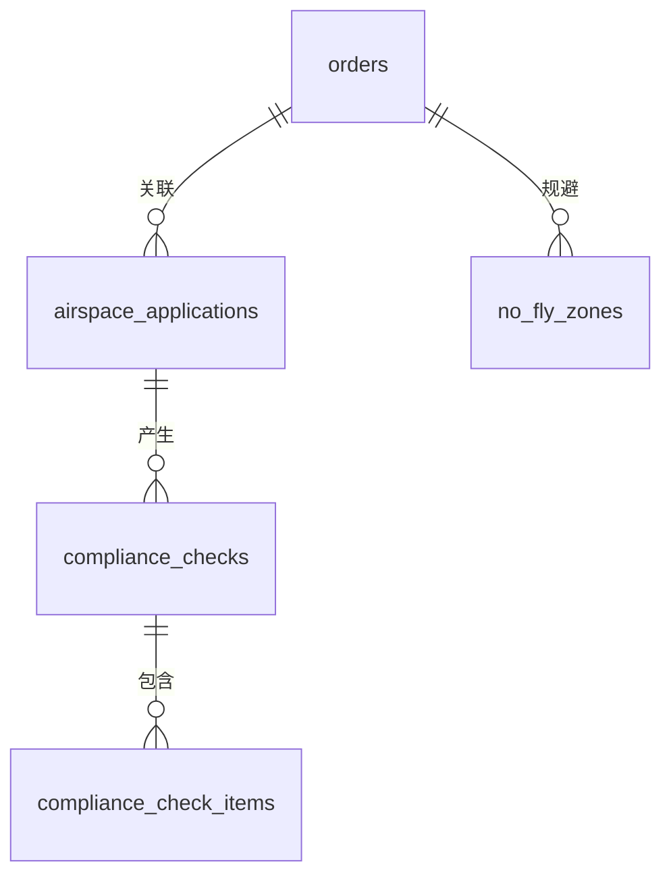
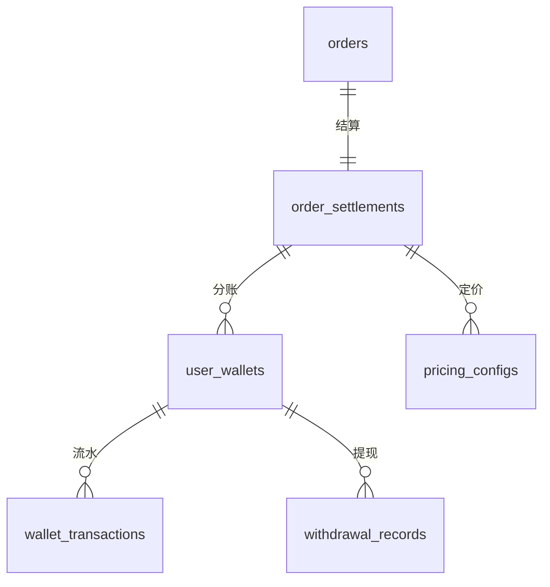
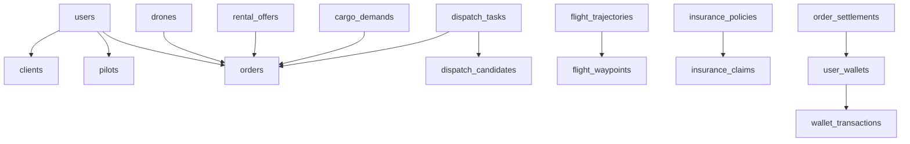

# 表结构设计

<cite>
**本文引用的文件**
- [001_init_schema.sql](file://backend/migrations/001_init_schema.sql)
- [002_seed_data.sql](file://backend/migrations/002_seed_data.sql)
- [003_add_admin_orders.sql](file://backend/migrations/003_add_admin_orders.sql)
- [005_add_pilot_tables.sql](file://backend/migrations/005_add_pilot_tables.sql)
- [007_add_client_tables.sql](file://backend/migrations/007_add_client_tables.sql)
- [008_add_dispatch_tables.sql](file://backend/migrations/008_add_dispatch_tables.sql)
- [009_add_order_execution_tables.sql](file://backend/migrations/009_add_order_execution_tables.sql)
- [010_add_airspace_tables.sql](file://backend/migrations/010_add_airspace_tables.sql)
- [011_add_settlement_tables.sql](file://backend/migrations/011_add_settlement_tables.sql)
- [012_add_credit_control_tables.sql](file://backend/migrations/012_add_credit_control_tables.sql)
- [013_add_insurance_tables.sql](file://backend/migrations/013_add_insurance_tables.sql)
- [014_add_analytics_tables.sql](file://backend/migrations/014_add_analytics_tables.sql)
- [models.go](file://backend/internal/model/models.go)
- [API_V1_V2_DIFF.md](file://backend/docs/API_V1_V2_DIFF.md)
</cite>

## 目录
1. [简介](#简介)
2. [项目结构](#项目结构)
3. [核心组件](#核心组件)
4. [架构总览](#架构总览)
5. [详细组件分析](#详细组件分析)
6. [依赖分析](#依赖分析)
7. [性能考虑](#性能考虑)
8. [故障排查指南](#故障排查指南)
9. [结论](#结论)
10. [附录](#附录)

## 简介
本文件面向无人机租赁平台的数据表结构设计，系统梳理 v1 到 v2 的演进路径，明确各表字段定义、数据类型、约束与索引策略，并解释关键设计决策（如用户状态、订单状态、价格金额存储、主外键关系与复合索引）。同时提供完整的 DDL 与表结构图，帮助开发者与运维人员理解数据库模型与业务边界。

## 项目结构
数据库迁移采用阶段化推进，覆盖用户与角色、供给与需求、订单与支付、派单与执行、空域与合规、结算与分账、风控与信用、保险与理赔、数据分析等模块。v2 通过新的 API 边界与数据模型逐步替换 v1 的旧入口，形成“新模型 + 兼容读写”的过渡状态。

```mermaid
graph TB
subgraph "用户与角色"
users["users<br/>用户基础信息"]
clients["clients<br/>客户档案"]
pilots["pilots<br/>飞手档案"]
end
subgraph "供给与需求"
rental_offers["rental_offers<br/>租赁供给"]
rental_demands["rental_demands<br/>租赁需求"]
cargo_demands["cargo_demands<br/>货运需求"]
demands["demands<br/>v2需求"]
owner_supplies["owner_supplies<br/>v2机主供给"]
end
subgraph "订单与支付"
orders["orders<br/>订单"]
order_timelines["order_timelines<br/>订单时间线"]
payments["payments<br/>支付记录"]
refunds["refunds<br/>退款记录"]
dispute_records["dispute_records<br/>争议记录"]
end
subgraph "派单与执行"
dispatch_tasks["dispatch_tasks<br/>派单任务"]
dispatch_candidates["dispatch_candidates<br/>派单候选人"]
flight_positions["flight_positions<br/>飞行位置"]
flight_alerts["flight_alerts<br/>飞行告警"]
geofences["geofences<br/>电子围栏"]
geofence_violations["geofence_violations<br/>围栏违规"]
flight_trajectories["flight_trajectories<br/>飞行轨迹"]
flight_waypoints["flight_waypoints<br/>航点"]
saved_routes["saved_routes<br/>保存路线模板"]
multi_point_tasks["multi_point_tasks<br/>多点任务"]
multi_point_task_stops["multi_point_task_stops<br/>多点任务站点"]
end
subgraph "空域与合规"
airspace_applications["airspace_applications<br/>空域申请"]
no_fly_zones["no_fly_zones<br/>禁飞区"]
compliance_checks["compliance_checks<br/>合规检查"]
compliance_check_items["compliance_check_items<br/>合规检查项"]
end
subgraph "结算与分账"
order_settlements["order_settlements<br/>订单结算"]
user_wallets["user_wallets<br/>用户钱包"]
wallet_transactions["wallet_transactions<br/>钱包流水"]
withdrawal_records["withdrawal_records<br/>提现记录"]
pricing_configs["pricing_configs<br/>定价配置"]
end
subgraph "风控与信用"
credit_scores["credit_scores<br/>信用分"]
credit_score_logs["credit_score_logs<br/>信用分日志"]
risk_controls["risk_controls<br/>风控记录"]
violations["violations<br/>违规记录"]
blacklists["blacklists<br/>黑名单"]
deposits["deposits<br/>保证金"]
end
subgraph "保险与理赔"
insurance_policies["insurance_policies<br/>保险保单"]
insurance_claims["insurance_claims<br/>保险理赔"]
claim_timelines["claim_timelines<br/>理赔时间线"]
insurance_products["insurance_products<br/>保险产品配置"]
end
subgraph "数据分析"
daily_statistics["daily_statistics<br/>每日统计"]
hourly_metrics["hourly_metrics<br/>小时指标"]
region_statistics["region_statistics<br/>区域统计"]
analytics_reports["analytics_reports<br/>分析报表"]
heatmap_data["heatmap_data<br/>热力图数据"]
realtime_dashboard["realtime_dashboard<br/>实时看板"]
end
users --> clients
users --> pilots
rental_offers --> orders
rental_demands --> orders
cargo_demands --> orders
demands --> orders
owner_supplies --> orders
orders --> order_timelines
orders --> payments
orders --> refunds
orders --> dispute_records
orders --> dispatch_tasks
dispatch_tasks --> dispatch_candidates
orders --> flight_positions
orders --> flight_alerts
orders --> geofences
orders --> geofence_violations
orders --> flight_trajectories
flight_trajectories --> flight_waypoints
orders --> saved_routes
orders --> multi_point_tasks
multi_point_tasks --> multi_point_task_stops
orders --> airspace_applications
airspace_applications --> no_fly_zones
orders --> compliance_checks
compliance_checks --> compliance_check_items
orders --> order_settlements
order_settlements --> user_wallets
user_wallets --> wallet_transactions
user_wallets --> withdrawal_records
orders --> pricing_configs
users --> credit_scores
credit_scores --> credit_score_logs
users --> risk_controls
users --> violations
users --> blacklists
users --> deposits
orders --> insurance_policies
insurance_policies --> insurance_claims
insurance_claims --> claim_timelines
insurance_policies --> insurance_products
orders --> daily_statistics
orders --> hourly_metrics
orders --> region_statistics
orders --> analytics_reports
orders --> heatmap_data
orders --> realtime_dashboard
```

**图表来源**
- [001_init_schema.sql:7-314](file://backend/migrations/001_init_schema.sql#L7-L314)
- [005_add_pilot_tables.sql:5-143](file://backend/migrations/005_add_pilot_tables.sql#L5-L143)
- [007_add_client_tables.sql:4-189](file://backend/migrations/007_add_client_tables.sql#L4-L189)
- [008_add_dispatch_tables.sql:4-185](file://backend/migrations/008_add_dispatch_tables.sql#L4-L185)
- [009_add_order_execution_tables.sql:4-468](file://backend/migrations/009_add_order_execution_tables.sql#L4-L468)
- [010_add_airspace_tables.sql:4-182](file://backend/migrations/010_add_airspace_tables.sql#L4-L182)
- [011_add_settlement_tables.sql:5-189](file://backend/migrations/011_add_settlement_tables.sql#L5-L189)
- [012_add_credit_control_tables.sql:6-255](file://backend/migrations/012_add_credit_control_tables.sql#L6-L255)
- [013_add_insurance_tables.sql:6-241](file://backend/migrations/013_add_insurance_tables.sql#L6-L241)
- [014_add_analytics_tables.sql:6-234](file://backend/migrations/014_add_analytics_tables.sql#L6-L234)

**章节来源**
- [001_init_schema.sql:1-314](file://backend/migrations/001_init_schema.sql#L1-L314)
- [005_add_pilot_tables.sql:1-143](file://backend/migrations/005_add_pilot_tables.sql#L1-L143)
- [007_add_client_tables.sql:1-189](file://backend/migrations/007_add_client_tables.sql#L1-L189)
- [008_add_dispatch_tables.sql:1-185](file://backend/migrations/008_add_dispatch_tables.sql#L1-L185)
- [009_add_order_execution_tables.sql:1-468](file://backend/migrations/009_add_order_execution_tables.sql#L1-L468)
- [010_add_airspace_tables.sql:1-182](file://backend/migrations/010_add_airspace_tables.sql#L1-L182)
- [011_add_settlement_tables.sql:1-189](file://backend/migrations/011_add_settlement_tables.sql#L1-L189)
- [012_add_credit_control_tables.sql:1-255](file://backend/migrations/012_add_credit_control_tables.sql#L1-L255)
- [013_add_insurance_tables.sql:1-241](file://backend/migrations/013_add_insurance_tables.sql#L1-L241)
- [014_add_analytics_tables.sql:1-234](file://backend/migrations/014_add_analytics_tables.sql#L1-L234)

## 核心组件
本节聚焦关键表的字段定义、数据类型、约束与索引策略，并解释设计要点。

- 用户表 users
  - 字段要点：手机号唯一、用户类型、实名认证状态、信用分、状态、软删除时间
  - 索引：手机号唯一索引、用户类型、状态、软删除
  - 设计说明：手机号唯一便于登录与绑定；状态字段支持封禁与恢复；信用分用于风控与匹配

- 无人机表 drones
  - 字段要点：归属机主、品牌型号序列号、载重/续航/航程、价格与押金、定位与地址、可用状态、评分与订单数
  - 索引：序列号唯一、机主、城市、认证状态、可用状态、软删除
  - 设计说明：序列号唯一保证资产唯一性；价格以分为单位避免浮点误差

- 租赁供给表 rental_offers
  - 字段要点：关联无人机与机主、服务类型、时间窗、经纬度、服务半径、计费类型与单价、状态、浏览量
  - 索引：无人机、机主、状态、服务类型、软删除
  - 设计说明：服务半径与经纬度支撑就近匹配；计费类型区分日/小时/一口价

- 租赁需求表 rental_demands
  - 字段要点：关联租客、需求类型、所需功能、载重、经纬度、城市、时间窗、预算、紧急度
  - 索引：租客、需求类型、状态、城市、紧急度、软删除
  - 设计说明：紧急度与预算辅助匹配与排序

- 货运需求表 cargo_demands
  - 字段要点：发布者、货物类型/重量/尺寸、起止经纬度与地址、距离、取送时间、报价、特殊要求、图片
  - 索引：发布者、货物类型、状态、软删除
  - 设计说明：距离与经纬度支持路径规划与围栏校验

- 订单表 orders
  - 字段要点：订单号唯一、订单类型、关联需求/供给/无人机/机主/租客/飞手/业主、服务时间与地址、金额与分账、状态、取消原因与责任方、执行与飞行信息、结算状态
  - 索引：订单号唯一、无人机、机主、租客、状态、订单类型、软删除；v2 新增派单任务、空域状态、结算状态等字段
  - 设计说明：金额以分为单位；分账比例与平台佣金字段支持财务聚合；执行字段细化履约过程

- 支付表 payments
  - 字段要点：支付单号唯一、关联订单与用户、支付类型/方式、金额、状态、第三方流水号、支付时间
  - 索引：支付单号唯一、订单、用户、状态
  - 设计说明：支付单号唯一便于幂等与对账；状态字段支持异步回调处理

- 飞手档案 pilots
  - 字段要点：关联用户、执照号/类型/有效期、无犯罪/健康体检状态与文件、飞行时长/订单数/评分、信用分、在线状态、服务半径、特殊技能、认证状态与时间
  - 索引：用户唯一、执照号、城市、在线状态、认证状态、软删除
  - 设计说明：统一飞手角色，支撑派单与飞行执行

- 客户档案 clients
  - 字段要点：关联用户、客户类型、企业信息、征信来源与分数、平台内部信用分、服务偏好、统计信息、认证状态与时间、状态
  - 索引：用户唯一、客户类型、统一社会信用代码、征信状态、企业认证状态、认证状态、状态、软删除
  - 设计说明：v2 将原租客与货主角色整合为“客户”，统一管理

- 派单任务 dispatch_tasks
  - 字段要点：任务编号唯一、关联订单/货运需求/业主、任务类型/优先级、状态、货物信息、位置与时间约束、预算、匹配要求、分配结果、匹配统计与失败原因
  - 索引：任务编号唯一、订单、货运需求、业主、状态、任务类型、优先级、分配飞手/无人机、软删除
  - 设计说明：多维匹配与评分体系支撑智能派单

- 飞行监控与轨迹 flight_positions / flight_alerts / geofences / geofence_violations / flight_trajectories / flight_waypoints / saved_routes / multi_point_tasks / multi_point_task_stops
  - 字段要点：实时位置、告警类型/级别/详情、围栏类型/高度/时间限制、违规类型与处理、轨迹点与模板、多点任务站点与确认信息
  - 设计说明：围绕订单生命周期提供飞行可视化与合规保障

- 空域与合规 airspace_applications / no_fly_zones / compliance_checks / compliance_check_items
  - 字段要点：飞行计划、航线、高度、UOM对接、禁飞区类型/范围/限制、合规检查项与结果
  - 设计说明：对接监管平台，确保飞行合法合规

- 结算与分账 order_settlements / user_wallets / wallet_transactions / withdrawal_records / pricing_configs
  - 字段要点：结算单号唯一、金额明细与分账比例、钱包余额与流水、提现信息、定价配置
  - 设计说明：精细化定价与分账，支持财务对账与风控

- 风控与信用 credit_scores / credit_score_logs / risk_controls / violations / blacklists / deposits
  - 字段要点：信用分维度与等级、变动日志、风险记录、违规与处置、黑名单与保证金
  - 设计说明：多维度信用评估与处置机制

- 保险与理赔 insurance_policies / insurance_claims / claim_timelines / insurance_products
  - 字段要点：保单类型/状态/金额/费率、理赔单号/事故/损失/责任/流程状态、产品配置
  - 设计说明：覆盖飞行全生命周期的保险保障

- 数据分析 daily_statistics / hourly_metrics / region_statistics / analytics_reports / heatmap_data / realtime_dashboard
  - 字段要点：每日/小时指标、区域统计、报表内容与附件、热力图与看板缓存
  - 设计说明：支撑运营分析与实时监控

**章节来源**
- [001_init_schema.sql:7-314](file://backend/migrations/001_init_schema.sql#L7-L314)
- [005_add_pilot_tables.sql:5-143](file://backend/migrations/005_add_pilot_tables.sql#L5-L143)
- [007_add_client_tables.sql:4-189](file://backend/migrations/007_add_client_tables.sql#L4-L189)
- [008_add_dispatch_tables.sql:4-185](file://backend/migrations/008_add_dispatch_tables.sql#L4-L185)
- [009_add_order_execution_tables.sql:4-468](file://backend/migrations/009_add_order_execution_tables.sql#L4-L468)
- [010_add_airspace_tables.sql:4-182](file://backend/migrations/010_add_airspace_tables.sql#L4-L182)
- [011_add_settlement_tables.sql:5-189](file://backend/migrations/011_add_settlement_tables.sql#L5-L189)
- [012_add_credit_control_tables.sql:6-255](file://backend/migrations/012_add_credit_control_tables.sql#L6-L255)
- [013_add_insurance_tables.sql:6-241](file://backend/migrations/013_add_insurance_tables.sql#L6-L241)
- [014_add_analytics_tables.sql:6-234](file://backend/migrations/014_add_analytics_tables.sql#L6-L234)

## 架构总览
v2 通过新的 API 边界与数据模型，将原本混杂在 v1 的“需求/供给/订单/派单/飞行记录”等语义进行清晰拆分，形成更贴近业务领域的表结构。下图展示 v1 与 v2 的映射关系与迁移方向：

**图表来源**
- [API_V1_V2_DIFF.md:36-52](file://backend/docs/API_V1_V2_DIFF.md#L36-L52)

**章节来源**
- [API_V1_V2_DIFF.md:1-222](file://backend/docs/API_V1_V2_DIFF.md#L1-L222)

## 详细组件分析

### 用户与角色表
- users
  - 主键：id
  - 唯一索引：phone
  - 普通索引：user_type, status, deleted_at
  - 设计要点：手机号唯一、状态字段支持封禁；软删除支持审计与恢复

- clients
  - 主键：id
  - 唯一索引：user_id
  - 普通索引：client_type, business_license_no, credit_check_status, enterprise_verified, verification_status, status, deleted_at
  - 设计要点：v2 整合租客与货主角色，统一客户档案；平台内部信用分与外部征信并存

- pilots
  - 主键：id
  - 唯一索引：user_id, caac_license_no
  - 普通索引：current_city, availability_status, verification_status, deleted_at
  - 设计要点：飞手资质与认证状态；服务半径与在线状态支撑派单

**图表来源**
- [001_init_schema.sql:7-62](file://backend/migrations/001_init_schema.sql#L7-L62)
- [007_add_client_tables.sql:4-65](file://backend/migrations/007_add_client_tables.sql#L4-L65)
- [005_add_pilot_tables.sql:5-45](file://backend/migrations/005_add_pilot_tables.sql#L5-L45)

**章节来源**
- [001_init_schema.sql:7-62](file://backend/migrations/001_init_schema.sql#L7-L62)
- [007_add_client_tables.sql:4-65](file://backend/migrations/007_add_client_tables.sql#L4-L65)
- [005_add_pilot_tables.sql:5-45](file://backend/migrations/005_add_pilot_tables.sql#L5-L45)

### 供给与需求表
- rental_offers
  - 主键：id
  - 普通索引：drone_id, owner_id, status, service_type, deleted_at
  - 设计要点：服务半径与计费类型支撑就近与灵活定价

- rental_demands
  - 主键：id
  - 普通索引：renter_id, demand_type, status, city, urgency, deleted_at
  - 设计要点：紧急度与预算辅助匹配

- cargo_demands
  - 主键：id
  - 普通索引：publisher_id, cargo_type, status, deleted_at
  - 设计要点：货物类型与距离支撑路径规划

- v2 需求与供给
  - demands：统一需求对象，包含服务类型、货载、时间窗、预算等
  - owner_supplies：机主供给，包含服务类型集合、可用时间、定价规则等

**图表来源**
- [001_init_schema.sql:64-150](file://backend/migrations/001_init_schema.sql#L64-L150)
- [007_add_client_tables.sql:178-189](file://backend/migrations/007_add_client_tables.sql#L178-L189)
- [005_add_pilot_tables.sql:136-143](file://backend/migrations/005_add_pilot_tables.sql#L136-L143)

**章节来源**
- [001_init_schema.sql:64-150](file://backend/migrations/001_init_schema.sql#L64-L150)
- [007_add_client_tables.sql:178-189](file://backend/migrations/007_add_client_tables.sql#L178-L189)
- [005_add_pilot_tables.sql:136-143](file://backend/migrations/005_add_pilot_tables.sql#L136-L143)

### 订单与支付表
- orders
  - 主键：id
  - 唯一索引：order_no
  - 普通索引：drone_id, owner_id, renter_id, status, order_type, client_id, pilot_id, dispatch_task_id, airspace_status, settlement_status, deleted_at
  - 设计要点：v2 新增派单任务、空域状态、结算状态、执行字段；金额以分为单位；分账比例与平台佣金字段

- order_timelines
  - 主键：id
  - 普通索引：order_id
  - 设计要点：记录订单状态变迁与操作者类型

- payments
  - 主键：id
  - 唯一索引：payment_no
  - 普通索引：order_id, user_id, status
  - 设计要点：支付单号唯一；状态支持异步回调

- refunds / dispute_records
  - 主键：id
  - 普通索引：order_id, status, initiator_user_id
  - 设计要点：退款与争议流程化管理

**图表来源**
- [001_init_schema.sql:152-198](file://backend/migrations/001_init_schema.sql#L152-L198)
- [011_add_settlement_tables.sql:5-62](file://backend/migrations/011_add_settlement_tables.sql#L5-L62)

**章节来源**
- [001_init_schema.sql:152-198](file://backend/migrations/001_init_schema.sql#L152-L198)
- [011_add_settlement_tables.sql:5-62](file://backend/migrations/011_add_settlement_tables.sql#L5-L62)

### 派单与执行表
- dispatch_tasks
  - 主键：id
  - 唯一索引：task_no
  - 普通索引：order_id, cargo_demand_id, client_id, status, task_type, priority, assigned_pilot_id, assigned_drone_id, deleted_at
  - 设计要点：任务类型/优先级/匹配要求；分配结果与匹配统计

- dispatch_candidates
  - 主键：id
  - 普通索引：task_id, pilot_id, drone_id, owner_id, status, total_score
  - 设计要点：综合评分与各维度得分；状态与响应时间

- 飞行监控与轨迹
  - flight_positions / flight_alerts / geofences / geofence_violations
  - flight_trajectories / flight_waypoints
  - saved_routes
  - multi_point_tasks / multi_point_task_stops
  - 设计要点：实时位置与告警；电子围栏与违规；轨迹录制与模板；多点任务站点与确认

**图表来源**
- [008_add_dispatch_tables.sql:4-185](file://backend/migrations/008_add_dispatch_tables.sql#L4-L185)
- [009_add_order_execution_tables.sql:46-468](file://backend/migrations/009_add_order_execution_tables.sql#L46-L468)

**章节来源**
- [008_add_dispatch_tables.sql:4-185](file://backend/migrations/008_add_dispatch_tables.sql#L4-L185)
- [009_add_order_execution_tables.sql:46-468](file://backend/migrations/009_add_order_execution_tables.sql#L46-L468)

### 空域与合规表
- airspace_applications
  - 主键：id
  - 普通索引：order_id, pilot_id, drone_id, status, uom_application_no, planned_start_time
  - 设计要点：飞行计划、UOM对接、审批状态

- no_fly_zones
  - 主键：id
  - 普通索引：zone_type, status, center_latitude, center_longitude
  - 设计要点：禁飞区类型/范围/高度/生效时间

- compliance_checks / compliance_check_items
  - 主键：id
  - 普通索引：order_id, pilot_id, drone_id, airspace_application_id, overall_result
  - 设计要点：合规检查项与结果；阻断性与警告级别

**图表来源**
- [010_add_airspace_tables.sql:4-182](file://backend/migrations/010_add_airspace_tables.sql#L4-L182)

**章节来源**
- [010_add_airspace_tables.sql:4-182](file://backend/migrations/010_add_airspace_tables.sql#L4-L182)

### 结算与分账表
- order_settlements
  - 主键：id
  - 唯一索引：settlement_no, order_id
  - 普通索引：status, pilot_user_id, owner_user_id, payer_user_id
  - 设计要点：金额明细与分账比例；状态管理

- user_wallets / wallet_transactions
  - 主键：id
  - 唯一索引：(user_id, wallet_type)
  - 普通索引：status
  - 设计要点：钱包余额与流水；交易类型与对账

- withdrawal_records
  - 主键：id
  - 唯一索引：withdrawal_no
  - 普通索引：user_id, status
  - 设计要点：提现状态与手续费

- pricing_configs
  - 主键：id
  - 唯一索引：config_key
  - 设计要点：基础/里程/时长/重量/难度/保险/分账/溢价配置

**图表来源**
- [011_add_settlement_tables.sql:5-189](file://backend/migrations/011_add_settlement_tables.sql#L5-L189)

**章节来源**
- [011_add_settlement_tables.sql:5-189](file://backend/migrations/011_add_settlement_tables.sql#L5-L189)

### 风控与信用表
- credit_scores
  - 主键：id
  - 唯一索引：user_id
  - 普通索引：user_type, score_level, is_frozen, is_blacklisted
  - 设计要点：多维度信用分；冻结与拉黑状态

- credit_score_logs
  - 主键：id
  - 普通索引：user_id, change_type, related_order_id, created_at
  - 设计要点：信用分变动日志

- risk_controls
  - 主键：id
  - 唯一索引：risk_no
  - 普通索引：user_id, order_id, risk_phase, risk_type, risk_level, status, created_at
  - 设计要点：风险类型/级别/处置

- violations / blacklists / deposits
  - 主键：id
  - 唯一索引：violation_no, deposit_no
  - 普通索引：user_id, order_id, violation_type, violation_level, status, appeal_status, created_at
  - 设计要点：违规处置与保证金管理

**章节来源**
- [012_add_credit_control_tables.sql:6-255](file://backend/migrations/012_add_credit_control_tables.sql#L6-L255)

### 保险与理赔表
- insurance_policies
  - 主键：id
  - 唯一索引：policy_no
  - 普通索引：holder_id, holder_type, policy_type, insured_id, status, effective_from
  - 设计要点：保单类型/状态/金额/费率

- insurance_claims
  - 主键：id
  - 唯一索引：claim_no
  - 普通索引：policy_id, order_id, claimant_id, incident_type, status, reported_at
  - 设计要点：理赔流程状态与责任认定

- claim_timelines
  - 主键：id
  - 普通索引：claim_id, action, created_at
  - 设计要点：理赔时间线

- insurance_products
  - 主键：id
  - 唯一索引：product_code
  - 普通索引：policy_type, is_mandatory, is_active
  - 设计要点：产品配置与费率

**章节来源**
- [013_add_insurance_tables.sql:6-241](file://backend/migrations/013_add_insurance_tables.sql#L6-L241)

### 数据分析表
- daily_statistics / hourly_metrics / region_statistics
  - 主键：id
  - 普通索引：stat_date, metric_time, region_code
  - 设计要点：每日/小时/区域统计

- analytics_reports
  - 主键：id
  - 唯一索引：report_no
  - 普通索引：report_type, period_start, status, deleted_at
  - 设计要点：报表内容与附件

- heatmap_data / realtime_dashboard
  - 主键：id
  - 普通索引：data_type, stat_date, grid_key, metric_key
  - 设计要点：热力图与看板缓存

**章节来源**
- [014_add_analytics_tables.sql:6-234](file://backend/migrations/014_add_analytics_tables.sql#L6-L234)

## 依赖分析
- 外键关系
  - users 与 clients/pilots：一对一
  - users 与 orders：多对一（租客/机主/飞手/业主）
  - drones 与 orders：多对一
  - rental_offers 与 orders：多对一
  - cargo_demands 与 orders：多对一
  - dispatch_tasks 与 orders：多对一
  - dispatch_tasks 与 dispatch_candidates：一对多
  - flight_trajectories 与 flight_waypoints：一对多
  - insurance_policies 与 insurance_claims：一对多
  - order_settlements 与 user_wallets：一对多
  - user_wallets 与 wallet_transactions：一对多

- 索引策略
  - 唯一索引：手机号、订单号、支付单号、派单任务号、保单号、提现单号、策略键
  - 普通索引：状态、类型、角色、时间、地理坐标、软删除
  - 复合索引：需求/供给匹配、派单候选排序、合规检查结果、风控状态

**图表来源**
- [001_init_schema.sql:7-314](file://backend/migrations/001_init_schema.sql#L7-L314)
- [005_add_pilot_tables.sql:44-134](file://backend/migrations/005_add_pilot_tables.sql#L44-L134)
- [007_add_client_tables.sql:64-172](file://backend/migrations/007_add_client_tables.sql#L64-L172)
- [008_add_dispatch_tables.sql:78-124](file://backend/migrations/008_add_dispatch_tables.sql#L78-L124)
- [009_add_order_execution_tables.sql:198-277](file://backend/migrations/009_add_order_execution_tables.sql#L198-L277)
- [011_add_settlement_tables.sql:5-101](file://backend/migrations/011_add_settlement_tables.sql#L5-L101)
- [013_add_insurance_tables.sql:6-150](file://backend/migrations/013_add_insurance_tables.sql#L6-L150)

**章节来源**
- [001_init_schema.sql:7-314](file://backend/migrations/001_init_schema.sql#L7-L314)
- [005_add_pilot_tables.sql:44-134](file://backend/migrations/005_add_pilot_tables.sql#L44-L134)
- [007_add_client_tables.sql:64-172](file://backend/migrations/007_add_client_tables.sql#L64-L172)
- [008_add_dispatch_tables.sql:78-124](file://backend/migrations/008_add_dispatch_tables.sql#L78-L124)
- [009_add_order_execution_tables.sql:198-277](file://backend/migrations/009_add_order_execution_tables.sql#L198-L277)
- [011_add_settlement_tables.sql:5-101](file://backend/migrations/011_add_settlement_tables.sql#L5-L101)
- [013_add_insurance_tables.sql:6-150](file://backend/migrations/013_add_insurance_tables.sql#L6-L150)

## 性能考虑
- 索引优化
  - 高频过滤字段建立单列索引（状态、类型、角色、时间）
  - 匹配与排序字段建立复合索引（需求/供给、派单候选、合规检查）
  - 地理位置建立空间索引（经纬度）以支持范围查询

- 数据类型与精度
  - 金额统一使用整型“分”存储，避免浮点误差
  - 时间使用带毫秒的时间戳，支持精确审计与时序分析

- 分表与分区
  - 按时间分区（日/小时）统计表，降低扫描范围
  - 大流量表（支付、轨迹、告警）可考虑分表与归档

- 查询优化
  - 使用覆盖索引减少回表
  - 避免 SELECT *，只取必要字段
  - 对高频报表使用物化视图或缓存

## 故障排查指南
- 订单状态异常
  - 检查 order_timelines 是否存在缺失状态
  - 核对 payments 状态与第三方回调
  - 核对 airspace_applications 与 no_fly_zones

- 支付与退款问题
  - 核对支付单号唯一性与状态
  - 核对退款记录与支付记录关联
  - 核对钱包流水与提现记录

- 飞行合规与告警
  - 检查 geofences 与 geofence_violations
  - 核对飞行轨迹与航点
  - 检查合规检查项与结果

- 信用与风控
  - 核对信用分日志与变动原因
  - 核对风险记录与处置状态
  - 核对违规与黑名单状态

**章节来源**
- [001_init_schema.sql:188-256](file://backend/migrations/001_init_schema.sql#L188-L256)
- [011_add_settlement_tables.sql:82-136](file://backend/migrations/011_add_settlement_tables.sql#L82-L136)
- [012_add_credit_control_tables.sql:88-231](file://backend/migrations/012_add_credit_control_tables.sql#L88-L231)
- [010_add_airspace_tables.sql:113-174](file://backend/migrations/010_add_airspace_tables.sql#L113-L174)

## 结论
本设计文档系统梳理了无人机租赁平台从 v1 到 v2 的表结构演进，明确了关键字段设计、索引策略与主外键关系。通过统一的 API 边界与数据模型，平台实现了需求/供给/订单/派单/执行的清晰拆分，为后续扩展与治理奠定了坚实基础。建议在生产环境中持续优化索引与查询，完善数据一致性与审计机制，并基于业务增长进行分表与分区策略调整。

## 附录
- 字段命名规范
  - 采用下划线命名法，如 order_no、service_type
  - 金额字段统一以“分”为单位，如 total_amount、price
  - 时间字段统一使用带毫秒的时间戳，如 created_at、updated_at

- 数据验证规则
  - 唯一索引字段（手机号、订单号、支付单号等）禁止重复
  - 状态字段枚举值严格控制（如 status、verification_status、risk_level）
  - 金额字段非负，时间字段遵循先后顺序

- 默认值设置
  - 状态字段默认值：active、pending、draft 等
  - 计费字段默认值：0 或 0.00
  - 信用分默认值：600 或 500
  - 服务半径默认值：50 公里

- v1 到 v2 变更要点
  - 用户类型扩展：pilot、drone_owner、client、admin
  - 客户角色整合：租客与货主合并为 client
  - 飞手模型独立：pilots 表独立管理
  - 订单模型细化：v2 引入派单任务、空域状态、结算状态等字段
  - API 边界清晰：demands/owner_supplies/orders/dispatch_tasks/flight_records

**章节来源**
- [API_V1_V2_DIFF.md:36-148](file://backend/docs/API_V1_V2_DIFF.md#L36-L148)
- [models.go:9-26](file://backend/internal/model/models.go#L9-L26)