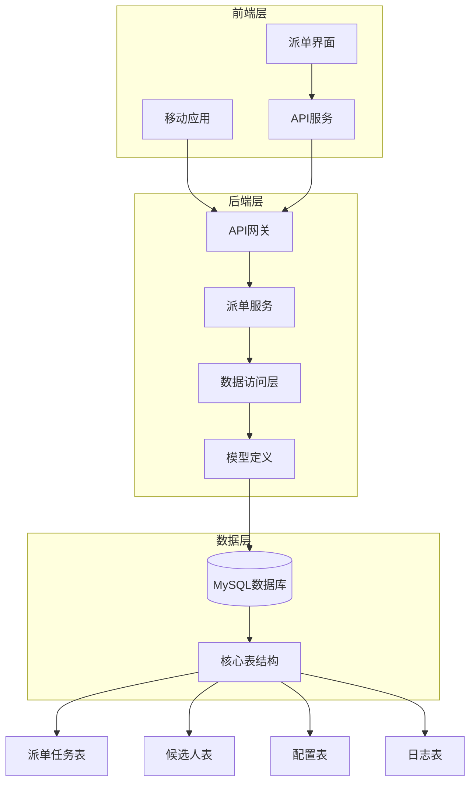
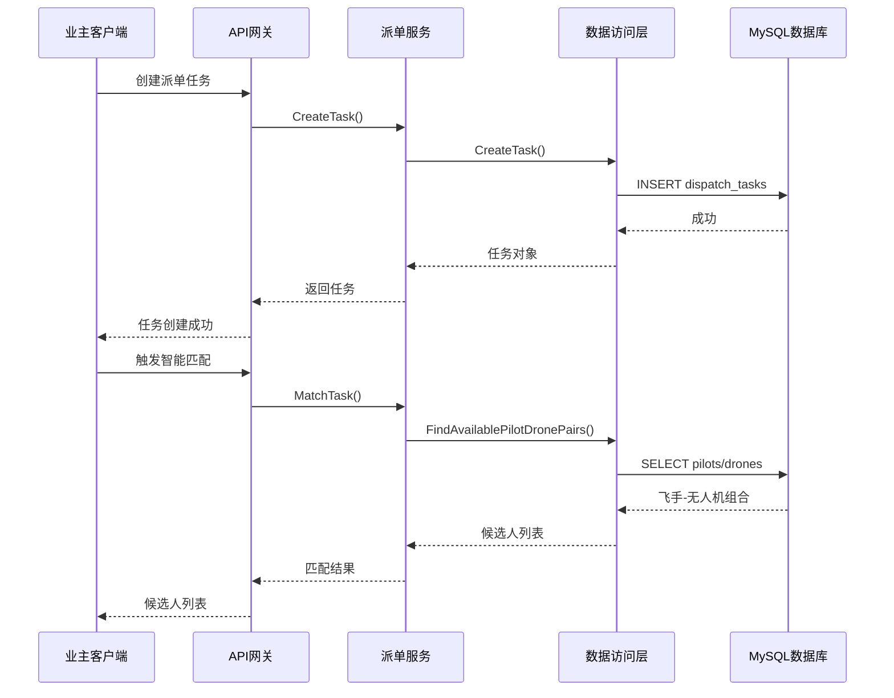
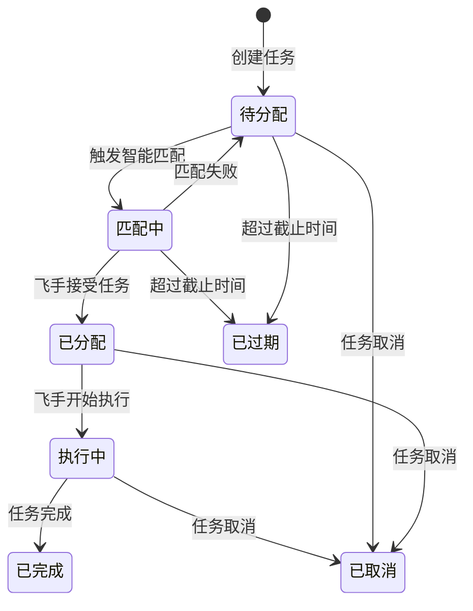
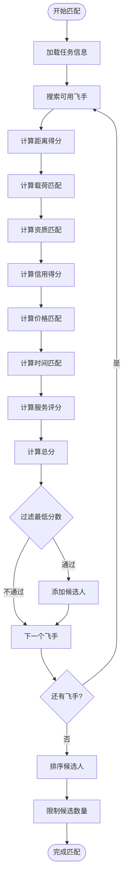
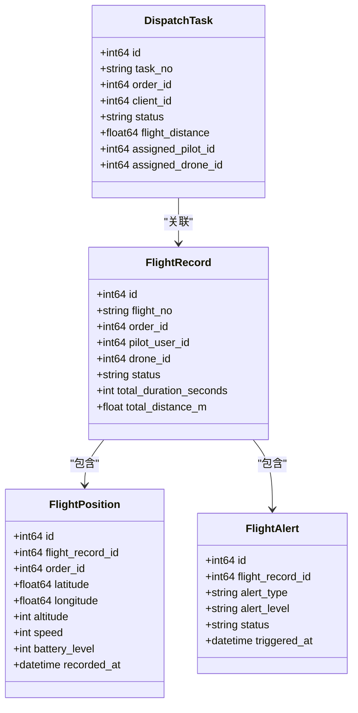
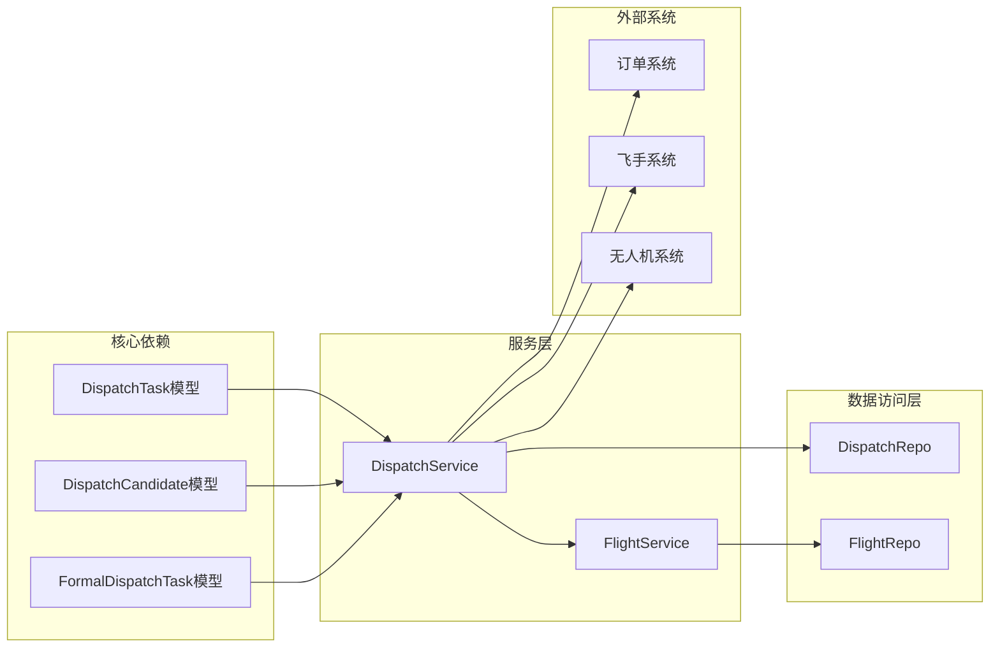

# 派单任务表

<cite>
**本文档引用的文件**
- [008_add_dispatch_tables.sql](file://backend/migrations/008_add_dispatch_tables.sql)
- [009_add_order_execution_tables.sql](file://backend/migrations/009_add_order_execution_tables.sql)
- [models.go](file://backend/internal/model/models.go)
- [dispatch_repo.go](file://backend/internal/repository/dispatch_repo.go)
- [dispatch_service.go](file://backend/internal/service/dispatch_service.go)
- [flight_repo.go](file://backend/internal/repository/flight_repo.go)
- [flight_service.go](file://backend/internal/service/flight_service.go)
- [DispatchTaskListScreen.tsx](file://mobile/src/screens/dispatch/DispatchTaskListScreen.tsx)
- [CreateDispatchTaskScreen.tsx](file://mobile/src/screens/dispatch/CreateDispatchTaskScreen.tsx)
- [dispatch.ts](file://mobile/src/services/dispatch.ts)
</cite>

## 目录
1. [项目概述](#项目概述)
2. [项目结构](#项目结构)
3. [核心组件](#核心组件)
4. [架构概览](#架构概览)
5. [详细组件分析](#详细组件分析)
6. [依赖关系分析](#依赖关系分析)
7. [性能考虑](#性能考虑)
8. [故障排除指南](#故障排除指南)
9. [结论](#结论)

## 项目概述

无人机租赁平台的派单任务表(DispatchTask)是整个智能匹配与派单系统的核心数据结构。该系统实现了从订单创建到任务执行的完整闭环管理，包括任务池匹配、正式派单、飞手执行、飞行监控等功能模块。

系统采用三层架构设计：前端移动应用负责用户交互，后端服务提供业务逻辑，数据库存储所有核心数据。派单任务表作为核心实体，承载着订单关联、飞手分配、状态管理、调度算法等关键功能。

## 项目结构

**图表来源**
- [models.go:1120-1187](file://backend/internal/model/models.go#L1120-L1187)
- [dispatch_repo.go:1-50](file://backend/internal/repository/dispatch_repo.go#L1-L50)
- [dispatch_service.go:1-50](file://backend/internal/service/dispatch_service.go#L1-L50)

**章节来源**
- [models.go:1120-1187](file://backend/internal/model/models.go#L1120-L1187)
- [dispatch_repo.go:1-50](file://backend/internal/repository/dispatch_repo.go#L1-L50)
- [dispatch_service.go:1-50](file://backend/internal/service/dispatch_service.go#L1-L50)

## 核心组件

### 派单任务表结构

派单任务表(DispatchTask)是系统的核心实体，包含以下关键字段：

**基础标识字段**
- `id`: 主键自增ID
- `task_no`: 任务编号，唯一索引
- `order_id`: 关联订单ID
- `client_id`: 业主ID

**任务类型与优先级**
- `task_type`: 任务类型(instant, scheduled, batch)
- `priority`: 优先级1-10，默认5

**状态管理**
- `status`: 任务状态(pending, matching, dispatching, assigned, cancelled, expired)

**货物信息**
- `cargo_weight`: 货物重量(kg)
- `cargo_volume`: 货物体积(立方厘米)
- `cargo_category`: 货物类别
- `is_hazardous`: 是否危险品

**位置信息**
- `pickup_*`: 取货点经纬度和地址
- `delivery_*`: 送货点经纬度和地址
- `flight_distance`: 飞行距离(km)

**时间约束**
- `required_*`: 要求取货/送达时间
- `time_window_*`: 时间窗口
- `dispatch_deadline`: 派单截止时间

**预算约束**
- `budget_min/max`: 预算范围(分)
- `offered_price`: 业主出价(分)

**匹配要求**
- `required_license_type`: 执照类型要求
- `min_pilot_rating`: 飞手最低评分
- `min_drone_rating`: 无人机最低评分
- `min_credit_score`: 最低信用分

**派单结果**
- `assigned_pilot_id`: 分配飞手ID
- `assigned_drone_id`: 分配无人机ID
- `assigned_owner_id`: 分配机主ID
- `assigned_at`: 分配时间
- `final_price`: 最终成交价(分)
- `match_score`: 匹配得分
- `match_details`: 匹配详情(JSON)

**匹配统计**
- `match_attempts`: 匹配尝试次数
- `max_attempts`: 最大尝试次数
- `last_match_time`: 最后匹配时间
- `fail_reason`: 失败原因

**章节来源**
- [models.go:1120-1187](file://backend/internal/model/models.go#L1120-L1187)
- [008_add_dispatch_tables.sql:5-79](file://backend/migrations/008_add_dispatch_tables.sql#L5-L79)

### 派单候选人表

候选人表存储每个任务的候选飞手信息，包含：

- `total_score`: 综合得分(0-100)
- `distance_score`: 距离得分(0-25)
- `load_score`: 载荷匹配得分(0-15)
- `qualification_score`: 资质匹配得分(0-20)
- `credit_score`: 信用得分(0-15)
- `price_score`: 价格得分(0-10)
- `time_score`: 时间匹配得分(0-10)
- `rating_score`: 服务评分得分(0-5)

**章节来源**
- [models.go:1194-1205](file://backend/internal/model/models.go#L1194-L1205)
- [008_add_dispatch_tables.sql:82-124](file://backend/migrations/008_add_dispatch_tables.sql#L82-L124)

### 派单配置表

配置表存储系统运行参数：

- `matching_radius_km`: 默认匹配半径(公里)
- `batch_window_seconds`: 批量匹配时间窗口(秒)
- `candidate_response_timeout_seconds`: 候选人响应超时(秒)
- `max_candidates_per_task`: 每个任务最大候选人数
- `min_match_score`: 最低匹配分数

**章节来源**
- [008_add_dispatch_tables.sql:126-174](file://backend/migrations/008_add_dispatch_tables.sql#L126-L174)

## 架构概览

**图表来源**
- [dispatch_service.go:189-260](file://backend/internal/service/dispatch_service.go#L189-L260)
- [dispatch_repo.go:26-58](file://backend/internal/repository/dispatch_repo.go#L26-L58)

**章节来源**
- [dispatch_service.go:189-260](file://backend/internal/service/dispatch_service.go#L189-L260)
- [dispatch_repo.go:26-58](file://backend/internal/repository/dispatch_repo.go#L26-L58)

## 详细组件分析

### 派单任务状态管理

派单任务采用有限状态机设计，包含以下状态转换：

**状态业务含义**:
- `pending`: 待分配 - 任务刚创建，等待匹配
- `matching`: 匹配中 - 系统正在进行智能匹配
- `dispatching`: 派单中 - 已找到候选人，正在通知飞手
- `assigned`: 已分配 - 飞手接受任务，准备执行
- `cancelled`: 已取消 - 任务被取消
- `expired`: 已过期 - 超过截止时间未完成

**章节来源**
- [models.go:1129-1129](file://backend/internal/model/models.go#L1129-L1129)
- [dispatch_service.go:289-381](file://backend/internal/service/dispatch_service.go#L289-L381)

### 智能匹配算法

系统采用多维度评分算法，计算飞手-无人机组合的匹配度：

**匹配算法权重**:
- 距离得分: 25分权重
- 载荷匹配: 15分权重  
- 资质匹配: 20分权重
- 信用得分: 15分权重
- 价格匹配: 10分权重
- 时间匹配: 10分权重
- 服务评分: 5分权重

**章节来源**
- [dispatch_service.go:289-497](file://backend/internal/service/dispatch_service.go#L289-L497)
- [008_add_dispatch_tables.sql:155-174](file://backend/migrations/008_add_dispatch_tables.sql#L155-L174)

### 飞行监控集成

派单任务与飞行监控系统深度集成，实现实时数据同步：

**图表来源**
- [models.go:1310-1372](file://backend/internal/model/models.go#L1310-L1372)
- [models.go:1378-1421](file://backend/internal/model/models.go#L1378-L1421)

**章节来源**
- [models.go:1310-1421](file://backend/internal/model/models.go#L1310-L1421)
- [flight_service.go:112-158](file://backend/internal/service/flight_service.go#L112-L158)

### 移动端交互界面

系统提供完整的移动端派单管理界面：

**派单任务列表界面**:
- 支持状态筛选(全部、待响应、已接单、执行中、已结束)
- 显示任务编号、起终点、飞手信息、订单状态
- 支持下拉刷新和查看详情

**创建派单界面**:
- 支持三种派单模式：绑定飞手、候选飞手池、普通飞手池
- 显示订单上下文和绑定飞手列表
- 支持填写派单说明和发起正式派单

**章节来源**
- [DispatchTaskListScreen.tsx:24-102](file://mobile/src/screens/dispatch/DispatchTaskListScreen.tsx#L24-L102)
- [CreateDispatchTaskScreen.tsx:25-148](file://mobile/src/screens/dispatch/CreateDispatchTaskScreen.tsx#L25-L148)

## 依赖关系分析

**图表来源**
- [dispatch_service.go:17-29](file://backend/internal/service/dispatch_service.go#L17-L29)
- [flight_service.go:17-26](file://backend/internal/service/flight_service.go#L17-L26)

**章节来源**
- [dispatch_service.go:17-29](file://backend/internal/service/dispatch_service.go#L17-L29)
- [flight_service.go:17-26](file://backend/internal/service/flight_service.go#L17-L26)

### 数据库索引优化

派单任务表建立了完善的索引体系以支持高频查询：

**核心索引**:
- `idx_dispatch_tasks_task_no`: 任务编号唯一索引
- `idx_dispatch_tasks_order_id`: 订单关联索引
- `idx_dispatch_tasks_client_id`: 业主关联索引
- `idx_dispatch_tasks_status`: 状态查询索引
- `idx_dispatch_tasks_priority`: 优先级排序索引
- `idx_dispatch_tasks_assigned_pilot_id`: 飞手分配索引

**查询优化**:
- 支持按状态批量查询待处理任务
- 支持按优先级和创建时间排序
- 支持按飞手ID查询个人任务列表

**章节来源**
- [008_add_dispatch_tables.sql:68-79](file://backend/migrations/008_add_dispatch_tables.sql#L68-L79)
- [dispatch_repo.go:62-74](file://backend/internal/repository/dispatch_repo.go#L62-L74)

## 性能考虑

### 查询性能优化

系统采用多种策略优化查询性能：

**批量查询优化**:
- 支持批量获取待处理任务，限制查询数量
- 使用索引优化按状态、优先级的查询
- 提供分页查询支持大数据量场景

**缓存策略**:
- 配置参数从数据库加载后缓存
- 候选人列表按飞手ID去重缓存
- 最新位置信息实时缓存

**索引优化**:
- 在高频查询字段上建立合适索引
- 避免全表扫描的查询条件
- 合理使用复合索引

### 存储优化

**数据压缩**:
- JSON字段存储结构化数据
- 二进制格式存储地理位置信息
- 压缩存储历史统计数据

**分区策略**:
- 按时间分区存储历史数据
- 按状态分区优化查询
- 自动清理过期数据

## 故障排除指南

### 常见问题诊断

**任务匹配失败**:
- 检查飞手可用性和资质状态
- 验证无人机载荷和认证状态
- 确认匹配半径和时间窗口设置

**飞手响应超时**:
- 检查通知系统是否正常
- 验证飞手端应用状态
- 检查网络连接质量

**飞行监控异常**:
- 检查位置上报频率配置
- 验证围栏规则设置
- 确认告警阈值配置

### 日志分析

系统提供完整的日志记录机制：

**派单日志**:
- 任务创建、匹配、分配等关键操作
- 飞手响应和状态变更
- 异常情况和错误信息

**飞行监控日志**:
- 位置上报和处理记录
- 告警触发和处理过程
- 围栏违规记录

**章节来源**
- [dispatch_service.go:254-258](file://backend/internal/service/dispatch_service.go#L254-L258)
- [flight_service.go:471-533](file://backend/internal/service/flight_service.go#L471-L533)

## 结论

无人机租赁平台的派单任务表设计体现了现代分布式系统的最佳实践：

**架构优势**:
- 清晰的分层架构，职责分离明确
- 完善的状态管理和事务控制
- 高性能的查询优化和索引设计
- 实时的飞行监控和数据同步

**功能完整性**:
- 支持多种任务类型和调度策略
- 完整的飞手匹配算法
- 丰富的飞行监控功能
- 用户友好的移动端界面

**扩展性设计**:
- 模块化的服务架构
- 灵活的配置管理系统
- 可扩展的数据存储方案
- 完善的监控和日志体系

该系统为无人机租赁业务提供了坚实的技术基础，能够支持大规模的业务扩展和复杂的功能演进。