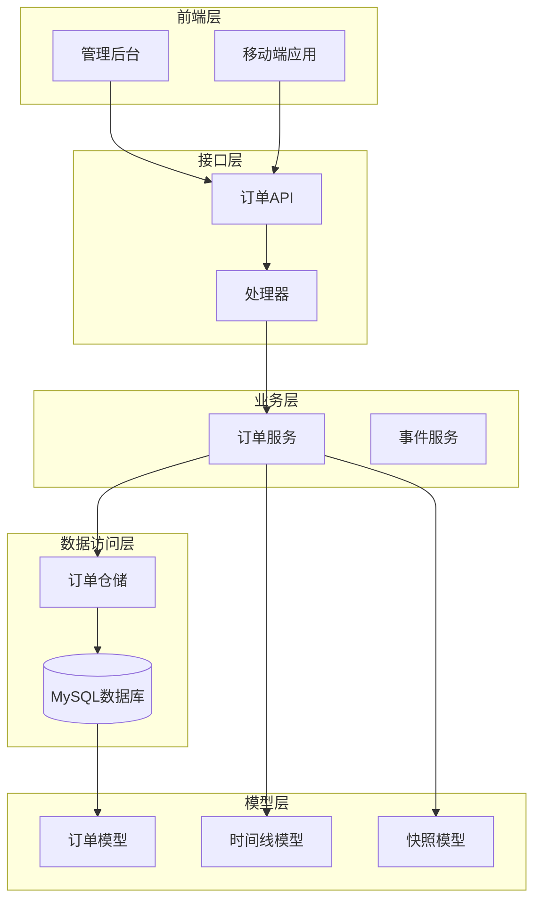
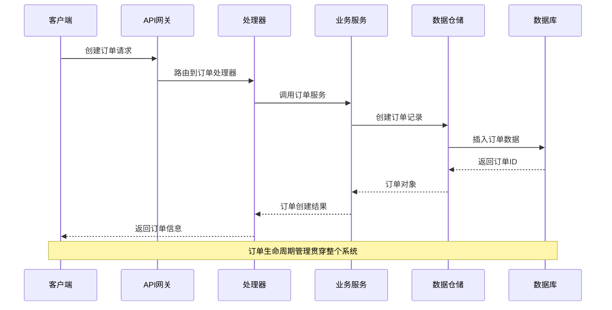
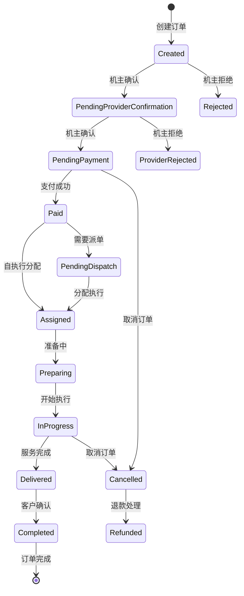
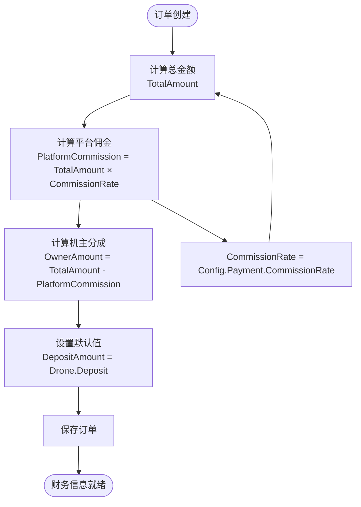
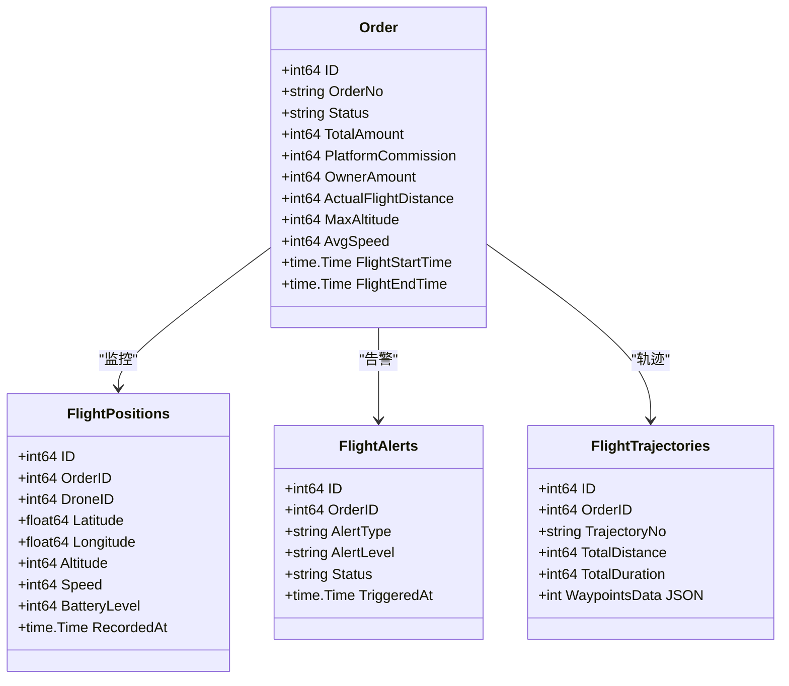
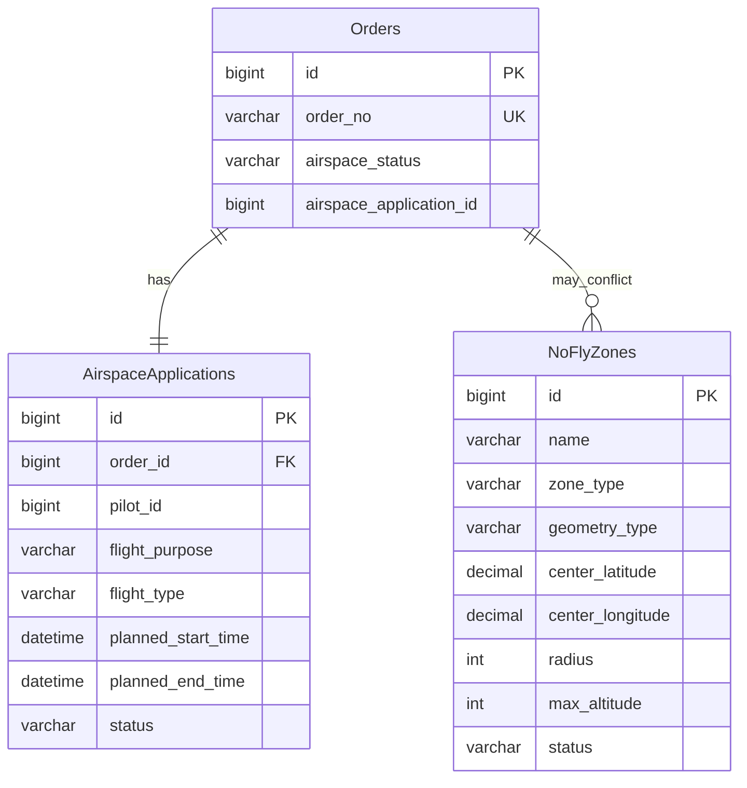
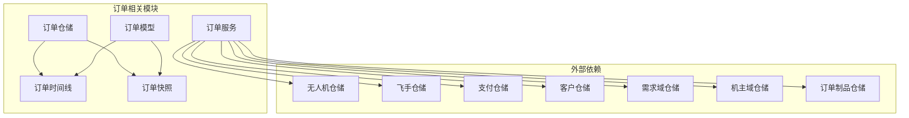

# 订单主表设计

<cite>
**本文档引用的文件**
- [models.go](file://backend/internal/model/models.go)
- [order_repo.go](file://backend/internal/repository/order_repo.go)
- [order_service.go](file://backend/internal/service/order_service.go)
- [handler.go](file://backend/internal/api/v1/order/handler.go)
- [009_add_order_execution_tables.sql](file://backend/migrations/009_add_order_execution_tables.sql)
- [010_add_airspace_tables.sql](file://backend/migrations/010_add_airspace_tables.sql)
- [OrderList.tsx](file://admin/src/pages/Order/OrderList.tsx)
</cite>

## 目录
1. [简介](#简介)
2. [项目结构](#项目结构)
3. [核心组件](#核心组件)
4. [架构概览](#架构概览)
5. [详细组件分析](#详细组件分析)
6. [依赖关系分析](#依赖关系分析)
7. [性能考虑](#性能考虑)
8. [故障排除指南](#故障排除指南)
9. [结论](#结论)

## 简介

本文档为无人机租赁平台的订单主表(Order)提供详细的表结构设计文档。该设计涵盖了订单核心字段、状态管理、财务计算、执行监控等关键业务要素，旨在为平台的订单生命周期管理提供完整的数据基础和业务逻辑支撑。

## 项目结构

订单主表设计涉及后端模型层、仓储层、服务层以及前端展示层的协同工作：

**图表来源**
- [handler.go:13-19](file://backend/internal/api/v1/order/handler.go#L13-L19)
- [order_service.go:18-31](file://backend/internal/service/order_service.go#L18-L31)
- [order_repo.go:10-20](file://backend/internal/repository/order_repo.go#L10-L20)

**章节来源**
- [handler.go:1-155](file://backend/internal/api/v1/order/handler.go#L1-L155)
- [order_service.go:1-90](file://backend/internal/service/order_service.go#L1-L90)
- [order_repo.go:1-31](file://backend/internal/repository/order_repo.go#L1-L31)

## 核心组件

### 订单主表结构

订单主表采用GORM框架定义，包含以下核心字段：

#### 基础标识字段
- `OrderNo`: 订单编号，唯一索引，格式为"WRJ"+时间戳毫秒级
- `OrderType`: 订单类型，支持"rental"(租赁)和"cargo"(货运)
- `RelatedID`: 相关ID，关联需求或供给的标识
- `OrderSource`: 订单来源，支持"demand_market"(需求转单)和"supply_direct"(供给直达)

#### 关系字段
- `DemandID`: 关联需求ID
- `SourceSupplyID`: 关联供给ID
- `DroneID`: 无人机ID
- `OwnerID`: 机主ID
- `PilotID`: 飞手ID
- `RenterID`: 租客ID
- `ClientID`: 客户ID
- `ClientUserID`: 客户用户ID

#### 执行配置字段
- `ExecutionMode`: 执行模式，支持"self_execute"(自执行)、"bound_pilot"(绑定飞手)、"dispatch_pool"(正式派单)
- `NeedsDispatch`: 是否需要派单
- `DispatchTaskID`: 派单任务ID

#### 服务信息字段
- `Title`: 订单标题
- `ServiceType`: 服务类型
- `StartTime/EndTime`: 服务开始和结束时间
- `ServiceLatitude/ServiceLongitude`: 服务坐标
- `ServiceAddress`: 服务地址
- `DestLatitude/DestLongitude`: 目的地坐标
- `DestAddress`: 目的地地址

#### 财务字段
- `TotalAmount`: 总金额(分)
- `PlatformCommissionRate`: 平台佣金率(%)
- `PlatformCommission`: 平台佣金(分)
- `OwnerAmount`: 机主分成(分)
- `DepositAmount`: 押金(分)

#### 状态字段
- `Status`: 订单状态，默认"created"(已创建)

#### 时间字段
- `CreatedAt/UpdatedAt/DeletedAt`: 创建、更新、删除时间

**章节来源**
- [models.go:413-484](file://backend/internal/model/models.go#L413-L484)

### 订单时间线模型

订单时间线记录订单状态变更历史：
- `OrderID`: 关联订单ID
- `Status`: 状态值
- `Note`: 变更说明
- `OperatorID`: 操作者ID
- `OperatorType`: 操作者类型

**章节来源**
- [models.go:486-498](file://backend/internal/model/models.go#L486-L498)

### 订单快照模型

订单快照存储订单的关键数据快照：
- `OrderID`: 关联订单ID
- `SnapshotType`: 快照类型
- `SnapshotData`: 快照数据(JSON)
- `CreatedAt/UpdatedAt`: 创建和更新时间

**章节来源**
- [models.go:500-513](file://backend/internal/model/models.go#L500-L513)

## 架构概览

订单系统的整体架构采用分层设计，确保业务逻辑清晰分离：

**图表来源**
- [handler.go:21-35](file://backend/internal/api/v1/order/handler.go#L21-L35)
- [order_service.go:65-90](file://backend/internal/service/order_service.go#L65-L90)
- [order_repo.go:22-31](file://backend/internal/repository/order_repo.go#L22-L31)

## 详细组件分析

### 订单状态管理系统

订单状态管理是系统的核心功能，涵盖完整的生命周期：

**图表来源**
- [order_service.go:542-639](file://backend/internal/service/order_service.go#L542-L639)
- [order_service.go:1037-1165](file://backend/internal/service/order_service.go#L1037-L1165)

#### 状态转换规则

1. **创建阶段**: 新订单默认状态为"created"
2. **机主确认**: 对于直达订单，需要机主确认后才能进入支付阶段
3. **支付阶段**: 支付成功后根据执行模式进入不同状态
4. **执行阶段**: 服务开始后进入"progressing"状态
5. **完成阶段**: 服务完成后等待客户确认签收
6. **取消阶段**: 支持在特定状态下取消并生成退款

**章节来源**
- [order_service.go:542-639](file://backend/internal/service/order_service.go#L542-L639)
- [order_service.go:1037-1165](file://backend/internal/service/order_service.go#L1037-L1165)

### 财务计算系统

财务计算系统确保平台、机主和用户的资金分配准确无误：

**图表来源**
- [order_service.go:142-145](file://backend/internal/service/order_service.go#L142-L145)
- [order_service.go:281-283](file://backend/internal/service/order_service.go#L281-L283)

#### 财务字段设计

1. **总金额(TotalAmount)**: 订单的总费用，以分为单位存储
2. **平台佣金(PlatformCommission)**: 平台抽取的佣金，基于佣金率计算
3. **机主分成(OwnerAmount)**: 机主应得的收入，等于总金额减去平台佣金
4. **押金(DepositAmount)**: 无人机的押金，通常在订单创建时确定

**章节来源**
- [models.go:443-447](file://backend/internal/model/models.go#L443-L447)
- [order_service.go:142-145](file://backend/internal/service/order_service.go#L142-L145)

### 订单执行监控系统

执行监控系统提供飞行过程的实时跟踪和数据收集：

**图表来源**
- [models.go:413-484](file://backend/internal/model/models.go#L413-L484)
- [009_add_order_execution_tables.sql:48-81](file://backend/migrations/009_add_order_execution_tables.sql#L48-L81)

#### 执行监控字段

1. **飞行时间**: `FlightStartTime/FlightEndTime` 记录实际飞行开始和结束时间
2. **实际飞行距离**: `ActualFlightDistance` 存储实际飞行距离(米)
3. **最大海拔**: `MaxAltitude` 记录飞行过程中的最大高度(米)
4. **平均速度**: `AvgSpeed` 存储平均飞行速度(米/秒×100)
5. **飞行轨迹**: 通过`TrajectoryID`关联飞行轨迹表

**章节来源**
- [models.go:449-460](file://backend/internal/model/models.go#L449-L460)
- [009_add_order_execution_tables.sql:25-31](file://backend/migrations/009_add_order_execution_tables.sql#L25-L31)

### 空域管理集成

系统集成了空域申请和管理功能：

**图表来源**
- [009_add_order_execution_tables.sql:7-9](file://backend/migrations/009_add_order_execution_tables.sql#L7-L9)
- [010_add_airspace_tables.sql:5-69](file://backend/migrations/010_add_airspace_tables.sql#L5-L69)

**章节来源**
- [009_add_order_execution_tables.sql:7-9](file://backend/migrations/009_add_order_execution_tables.sql#L7-L9)
- [010_add_airspace_tables.sql:71-111](file://backend/migrations/010_add_airspace_tables.sql#L71-L111)

## 依赖关系分析

订单系统与其他模块存在密切的依赖关系：

**图表来源**
- [order_service.go:18-59](file://backend/internal/service/order_service.go#L18-L59)
- [order_repo.go:10-20](file://backend/internal/repository/order_repo.go#L10-L20)

**章节来源**
- [order_service.go:18-59](file://backend/internal/service/order_service.go#L18-L59)
- [order_repo.go:10-20](file://backend/internal/repository/order_repo.go#L10-L20)

## 性能考虑

### 数据库优化策略

1. **索引设计**: 订单表建立了多个关键索引，包括唯一索引的订单号、状态索引、用户ID索引等
2. **查询优化**: 使用预加载机制避免N+1查询问题
3. **事务处理**: 关键业务操作采用数据库事务保证数据一致性

### 缓存策略

1. **热点数据缓存**: 经常访问的订单状态和统计数据可以考虑缓存
2. **查询结果缓存**: 对于复杂的统计查询结果进行缓存
3. **配置缓存**: 系统配置和费率参数进行缓存

### 异步处理

1. **事件通知**: 订单状态变更通过事件服务异步通知相关模块
2. **批量处理**: 大量订单的统计和报表处理采用异步队列
3. **监控告警**: 飞行监控数据采用异步处理和存储

## 故障排除指南

### 常见问题诊断

1. **订单状态异常**
   - 检查状态转换逻辑是否正确
   - 验证权限控制是否生效
   - 确认事务处理是否完整

2. **财务计算错误**
   - 核对佣金率配置
   - 验证金额单位转换
   - 检查汇率和税费处理

3. **执行监控数据缺失**
   - 检查飞行数据采集服务
   - 验证数据传输链路
   - 确认存储容量和性能

### 调试工具

1. **日志记录**: 系统提供了详细的日志记录，便于问题追踪
2. **状态监控**: 提供订单状态的实时监控界面
3. **数据校验**: 内置数据完整性检查工具

**章节来源**
- [order_service.go:1037-1165](file://backend/internal/service/order_service.go#L1037-L1165)
- [OrderList.tsx:36-70](file://admin/src/pages/Order/OrderList.tsx#L36-L70)

## 结论

无人机租赁平台的订单主表设计采用了现代化的分层架构，结合了完整的业务逻辑和严格的数据约束。该设计具有以下特点：

1. **完整性**: 覆盖了订单生命周期的所有关键环节
2. **扩展性**: 支持多种订单类型和执行模式
3. **安全性**: 严格的权限控制和数据验证
4. **可观测性**: 完善的日志记录和监控机制
5. **性能**: 优化的数据库设计和查询策略

通过合理的字段设计、状态管理和财务计算，该系统能够有效支撑无人机租赁业务的复杂需求，为平台的稳定运营提供坚实的数据基础。