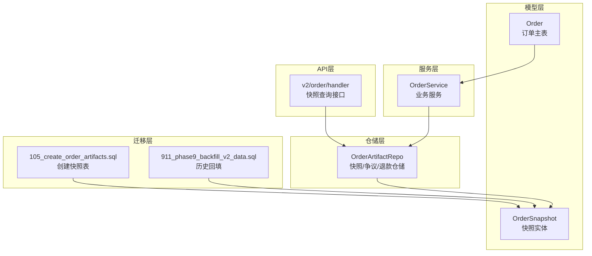
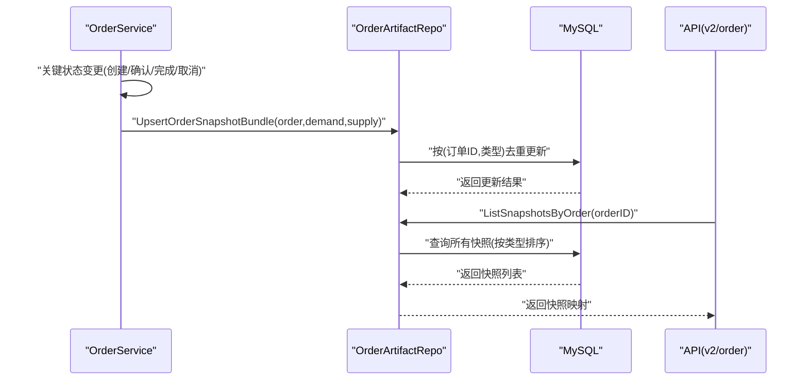
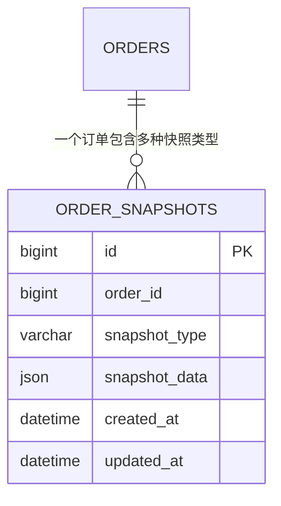
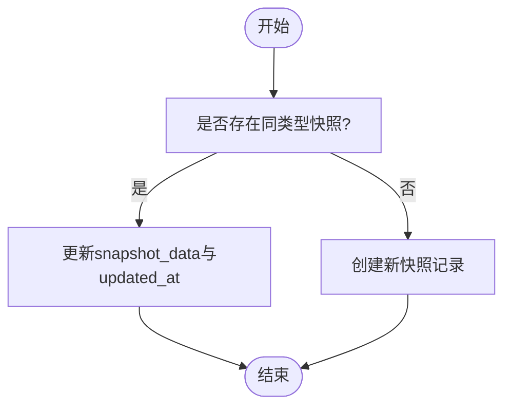
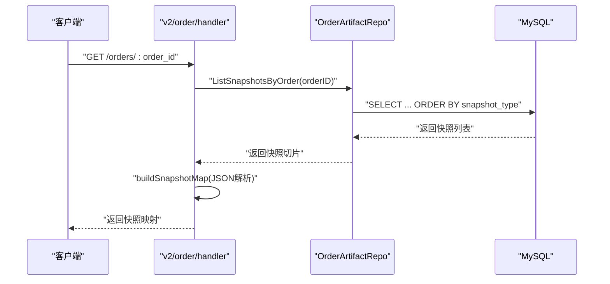
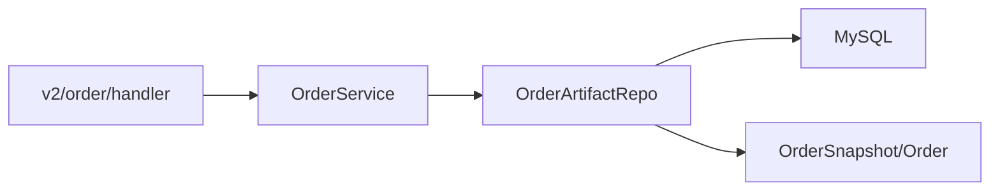

# 订单快照表

<cite>
**本文档引用的文件**
- [models.go](file://backend/internal/model/models.go)
- [order_artifact_repo.go](file://backend/internal/repository/order_artifact_repo.go)
- [105_create_order_artifacts.sql](file://backend/migrations/105_create_order_artifacts.sql)
- [911_phase9_backfill_v2_data.sql](file://backend/migrations/911_phase9_backfill_v2_data.sql)
- [order_service.go](file://backend/internal/service/order_service.go)
- [handler.go](file://backend/internal/api/v2/order/handler.go)
</cite>

## 目录
1. [引言](#引言)
2. [项目结构](#项目结构)
3. [核心组件](#核心组件)
4. [架构总览](#架构总览)
5. [详细组件分析](#详细组件分析)
6. [依赖关系分析](#依赖关系分析)
7. [性能考量](#性能考量)
8. [故障排查指南](#故障排查指南)
9. [结论](#结论)
10. [附录](#附录)

## 引言
本文件面向无人机租赁平台的“订单快照表(OrderSnapshot)”设计，系统化阐述快照机制的设计原理、字段含义、存储策略、版本管理与更新机制，以及在订单生命周期中的应用价值。重点覆盖以下方面：
- 快照类型(SnapshotType)与快照数据(SnapshotData)的设计理念
- 不同类型快照在订单生命周期中的作用与应用场景
- JSON格式存储动态变化的订单信息及版本管理
- 快照查询与恢复能力，支持订单回溯分析与争议处理
- 快照表与订单主表的关联关系，以及在审计与合规中的价值

## 项目结构
围绕订单快照的核心代码分布在以下模块：
- 数据模型层：定义OrderSnapshot实体及其与订单主表的关联
- 仓储层：提供UpsertSnapshot、批量构建与查询快照的能力
- 服务层：在关键业务节点触发快照同步
- 迁移层：创建快照表并回填历史数据
- API层：对外暴露快照查询接口，将快照数据映射为可读结构

图表来源
- [models.go:500-513](file://backend/internal/model/models.go#L500-L513)
- [order_artifact_repo.go:26-117](file://backend/internal/repository/order_artifact_repo.go#L26-L117)
- [105_create_order_artifacts.sql:9-18](file://backend/migrations/105_create_order_artifacts.sql#L9-L18)
- [911_phase9_backfill_v2_data.sql:644-768](file://backend/migrations/911_phase9_backfill_v2_data.sql#L644-L768)
- [handler.go:692-707](file://backend/internal/api/v2/order/handler.go#L692-L707)

章节来源
- [models.go:500-513](file://backend/internal/model/models.go#L500-L513)
- [order_artifact_repo.go:26-117](file://backend/internal/repository/order_artifact_repo.go#L26-L117)
- [105_create_order_artifacts.sql:9-18](file://backend/migrations/105_create_order_artifacts.sql#L9-L18)
- [911_phase9_backfill_v2_data.sql:644-768](file://backend/migrations/911_phase9_backfill_v2_data.sql#L644-L768)
- [handler.go:692-707](file://backend/internal/api/v2/order/handler.go#L692-L707)

## 核心组件
- 快照实体(OrderSnapshot)
  - 字段：id、order_id、snapshot_type、snapshot_data、created_at、updated_at
  - 约束：唯一索引(联合uk_order_snapshot_type)确保每个订单每种快照类型仅保留一条最新记录
- 仓储接口
  - UpsertSnapshot：按订单+类型去重更新，实现快照版本化
  - ListSnapshotsByOrder：按类型排序列出所有快照
  - 批量构建：client/pricing/execution/demand/supply五类快照
- 服务集成
  - 在关键状态变更后调用syncOrderSnapshots，确保快照与订单状态一致
- 迁移与回填
  - 创建表结构与索引
  - 历史数据回填，将旧订单字段映射为快照数据

章节来源
- [models.go:500-513](file://backend/internal/model/models.go#L500-L513)
- [order_artifact_repo.go:26-117](file://backend/internal/repository/order_artifact_repo.go#L26-L117)
- [105_create_order_artifacts.sql:9-18](file://backend/migrations/105_create_order_artifacts.sql#L9-L18)
- [911_phase9_backfill_v2_data.sql:644-768](file://backend/migrations/911_phase9_backfill_v2_data.sql#L644-L768)

## 架构总览
订单快照贯穿订单生命周期，形成“状态即证据”的审计链路。

图表来源
- [order_artifact_repo.go:91-117](file://backend/internal/repository/order_artifact_repo.go#L91-L117)
- [order_service.go:1317-1318](file://backend/internal/service/order_service.go#L1317-L1318)
- [handler.go:692-707](file://backend/internal/api/v2/order/handler.go#L692-L707)

## 详细组件分析

### 快照类型与数据模型
- 快照类型(SnapshotType)
  - 取值集合：client、demand、supply、pricing、execution
  - 含义：分别对应客户侧、需求侧、供给侧、价格侧、执行侧的静态快照
- 快照数据(SnapshotData)
  - 类型：JSON
  - 设计：以键值对形式存储与该类型相关的稳定字段，便于灵活扩展
- 表结构要点
  - 唯一索引：(order_id, snapshot_type)保证幂等更新
  - 索引：order_id用于快速查询某订单的所有快照
  - 时间戳：created_at/updated_at用于审计与排序

图表来源
- [105_create_order_artifacts.sql:9-18](file://backend/migrations/105_create_order_artifacts.sql#L9-L18)
- [models.go:500-513](file://backend/internal/model/models.go#L500-L513)

章节来源
- [105_create_order_artifacts.sql:9-18](file://backend/migrations/105_create_order_artifacts.sql#L9-L18)
- [models.go:500-513](file://backend/internal/model/models.go#L500-L513)

### 快照构建与版本管理
- 构建函数
  - client：客户与委托方信息
  - pricing：价格与分成信息
  - execution：执行状态与关键时间点
  - demand：需求侧静态快照
  - supply：供给侧静态快照
- 版本管理策略
  - UpsertSnapshot：若存在相同(订单ID,类型)记录，则仅更新snapshot_data与updated_at
  - 通过唯一索引避免重复插入，实现“后写覆盖前写”的版本化语义
- 批量构建
  - UpsertOrderSnapshotBundle：在订单创建/变更时，一次性写入全部五类快照

图表来源
- [order_artifact_repo.go:26-50](file://backend/internal/repository/order_artifact_repo.go#L26-L50)
- [order_artifact_repo.go:91-117](file://backend/internal/repository/order_artifact_repo.go#L91-L117)

章节来源
- [order_artifact_repo.go:26-50](file://backend/internal/repository/order_artifact_repo.go#L26-L50)
- [order_artifact_repo.go:91-117](file://backend/internal/repository/order_artifact_repo.go#L91-L117)

### 快照类型详解与应用场景
- 初始报价快照(client/pricing)
  - 场景：订单创建时，记录委托方、客户方、价格构成与平台佣金比例
  - 价值：争议处理时可追溯最初报价条款
- 最终确认快照(execution)
  - 场景：订单完成/取消时，记录最终状态、支付完成时间、完成时间、取消原因等
  - 价值：结算与对账依据，争议归责的关键证据
- 执行过程快照(execution)
  - 场景：状态流转过程中的关键时间点与操作者
  - 价值：审计轨迹与责任认定
- 需求侧快照(demand)
  - 场景：需求详情、地址快照、预算区间等
  - 价值：需求变更与交付验收的对比依据
- 供给侧快照(supply)
  - 场景：供给方信息、无人机信息、服务范围与定价规则
  - 价值：匹配与履约的原始依据

章节来源
- [order_artifact_repo.go:119-205](file://backend/internal/repository/order_artifact_repo.go#L119-L205)
- [911_phase9_backfill_v2_data.sql:644-768](file://backend/migrations/911_phase9_backfill_v2_data.sql#L644-L768)

### 快照数据存储策略与历史回填
- 存储策略
  - JSON字段：支持动态结构，无需频繁变更表结构
  - COALESCE处理：对空对象/数组进行安全回填，保证查询一致性
- 历史回填
  - 将orders表中的关键字段映射到client/pricing/execution三类快照
  - 将demands与owner_supplies中的静态信息映射到demand/supply两类快照
  - 使用ON DUPLICATE KEY UPDATE实现幂等回填

章节来源
- [105_create_order_artifacts.sql:81-205](file://backend/migrations/105_create_order_artifacts.sql#L81-L205)
- [911_phase9_backfill_v2_data.sql:644-768](file://backend/migrations/911_phase9_backfill_v2_data.sql#L644-L768)

### 查询与恢复功能设计
- 查询接口
  - ListSnapshotsByOrder：按类型升序返回所有快照
  - buildSnapshotMap：将快照列表转换为类型->数据的映射，JSON解析失败时回退为字符串
- 恢复能力
  - 通过快照数据重建订单在某时刻的完整视图
  - 支持争议回溯：对比不同阶段的快照，定位差异与责任方
- API集成
  - v2/order接口提供查询入口，返回结构化的快照映射

图表来源
- [handler.go:692-707](file://backend/internal/api/v2/order/handler.go#L692-L707)
- [order_artifact_repo.go:75-78](file://backend/internal/repository/order_artifact_repo.go#L75-L78)

章节来源
- [handler.go:692-707](file://backend/internal/api/v2/order/handler.go#L692-L707)
- [order_artifact_repo.go:75-78](file://backend/internal/repository/order_artifact_repo.go#L75-L78)

### 快照与订单主表的关联关系
- 关联方式
  - 外键：OrderSnapshot.OrderID -> Order.ID
  - 一对多：一个订单拥有多种类型的快照
- 关联价值
  - 快照作为“不可篡改的历史镜像”，与订单主表状态形成互补
  - 支持跨角色审计：客户、机主、飞手均可基于快照核验履约情况

章节来源
- [models.go:508-509](file://backend/internal/model/models.go#L508-L509)

### 审计与合规价值
- 审计线索
  - 唯一索引与时间戳确保快照可追溯、可排序
  - JSON结构便于扩展字段，满足监管与合规要求
- 合规支持
  - 历史回填保障既有数据的合规性
  - 争议与退款记录与快照共同构成完整的证据链

章节来源
- [105_create_order_artifacts.sql:9-18](file://backend/migrations/105_create_order_artifacts.sql#L9-L18)
- [order_artifact_repo.go:81-89](file://backend/internal/repository/order_artifact_repo.go#L81-L89)

## 依赖关系分析
- 组件耦合
  - OrderService依赖OrderArtifactRepo进行快照同步
  - OrderArtifactRepo依赖GORM访问数据库
  - API层依赖OrderService提供的查询能力
- 外部依赖
  - MySQL：支持JSON字段与唯一约束
  - Gin：提供HTTP接口与参数绑定

图表来源
- [order_service.go:1317-1318](file://backend/internal/service/order_service.go#L1317-L1318)
- [order_artifact_repo.go:75-89](file://backend/internal/repository/order_artifact_repo.go#L75-L89)
- [models.go:500-513](file://backend/internal/model/models.go#L500-L513)

章节来源
- [order_service.go:1317-1318](file://backend/internal/service/order_service.go#L1317-L1318)
- [order_artifact_repo.go:75-89](file://backend/internal/repository/order_artifact_repo.go#L75-L89)
- [models.go:500-513](file://backend/internal/model/models.go#L500-L513)

## 性能考量
- 索引优化
  - 唯一索引(订单ID,类型)：保证幂等写入与快速查询
  - 单列索引(order_id)：加速按订单查询快照
- 写入模式
  - Upsert策略：减少重复写入，降低锁竞争
- 查询模式
  - 按类型排序返回，前端可直接消费
  - JSON解析失败回退策略，提升健壮性

## 故障排查指南
- 快照缺失
  - 检查是否在关键状态变更后调用了syncOrderSnapshots
  - 核对唯一索引是否生效，确认UpsertSnapshot是否被正确调用
- 历史数据不完整
  - 确认迁移脚本是否执行成功
  - 检查COALESCE逻辑是否覆盖了空对象/数组
- 查询异常
  - 确认buildSnapshotMap的JSON解析分支是否被触发
  - 核对ListSnapshotsByOrder的排序与过滤条件

章节来源
- [order_artifact_repo.go:26-50](file://backend/internal/repository/order_artifact_repo.go#L26-L50)
- [105_create_order_artifacts.sql:81-205](file://backend/migrations/105_create_order_artifacts.sql#L81-L205)
- [handler.go:692-707](file://backend/internal/api/v2/order/handler.go#L692-L707)

## 结论
订单快照表通过“类型+JSON”的设计，实现了对订单生命周期关键节点的静态化记录。它不仅为争议处理与审计提供了不可篡改的历史证据，也通过版本化更新机制确保了数据一致性与可追溯性。配合完善的查询与回填策略，快照表成为平台在合规、风控与运营分析中的重要基础设施。

## 附录
- 快照类型对照
  - client：客户与委托方信息
  - demand：需求详情与地址快照
  - supply：供给方与无人机信息
  - pricing：价格与分成信息
  - execution：执行状态与关键时间点
- 关键实现路径
  - 快照实体与索引：[105_create_order_artifacts.sql:9-18](file://backend/migrations/105_create_order_artifacts.sql#L9-L18)
  - 快照构建与Upsert：[order_artifact_repo.go:26-117](file://backend/internal/repository/order_artifact_repo.go#L26-L117)
  - 历史回填SQL：[911_phase9_backfill_v2_data.sql:644-768](file://backend/migrations/911_phase9_backfill_v2_data.sql#L644-L768)
  - 查询接口与映射：[handler.go:692-707](file://backend/internal/api/v2/order/handler.go#L692-L707)