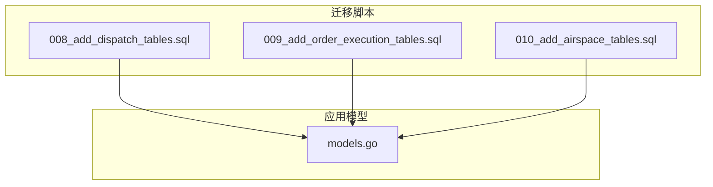
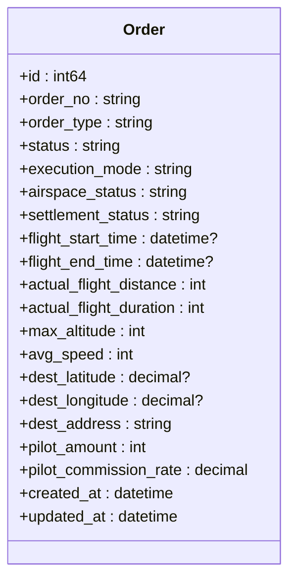
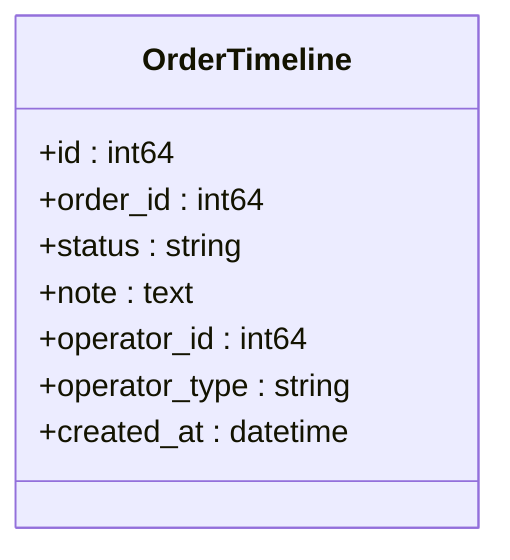
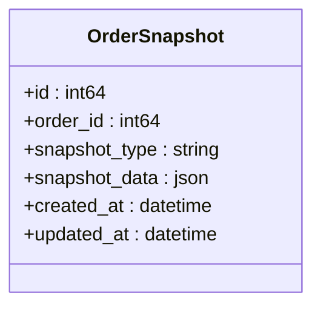
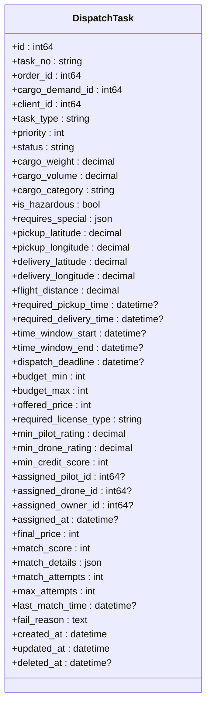
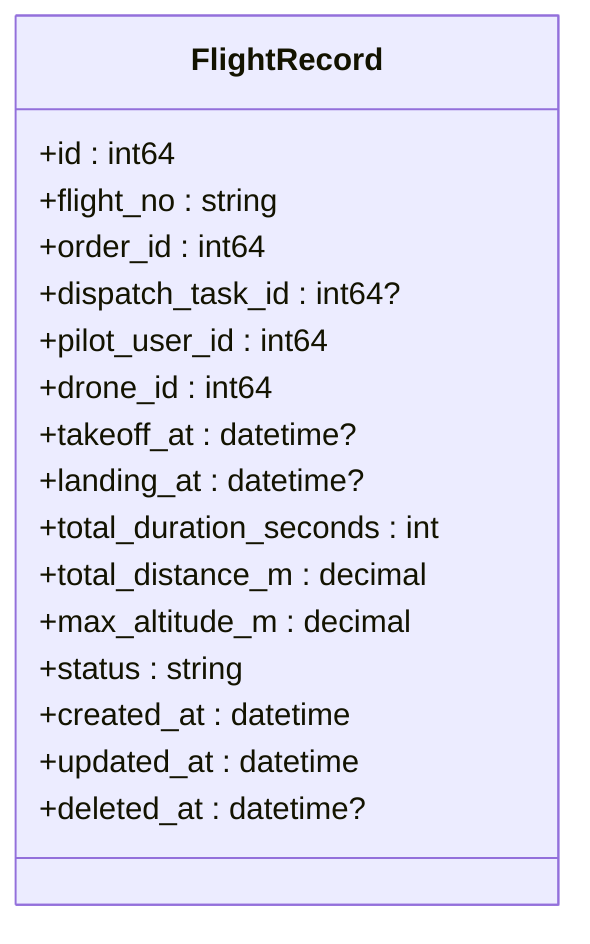
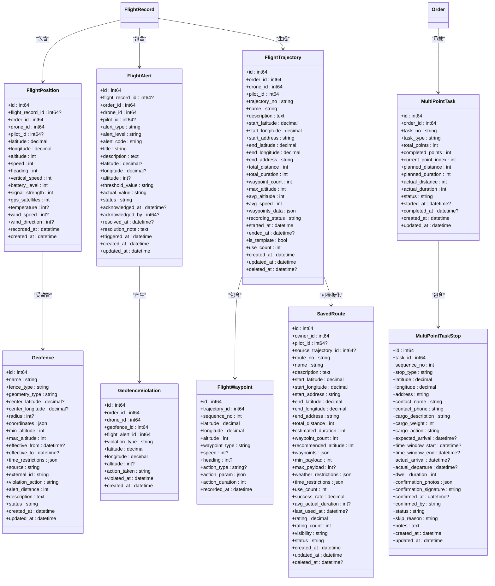
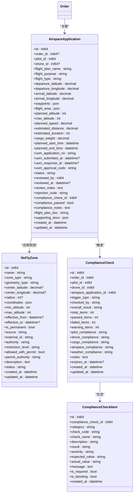
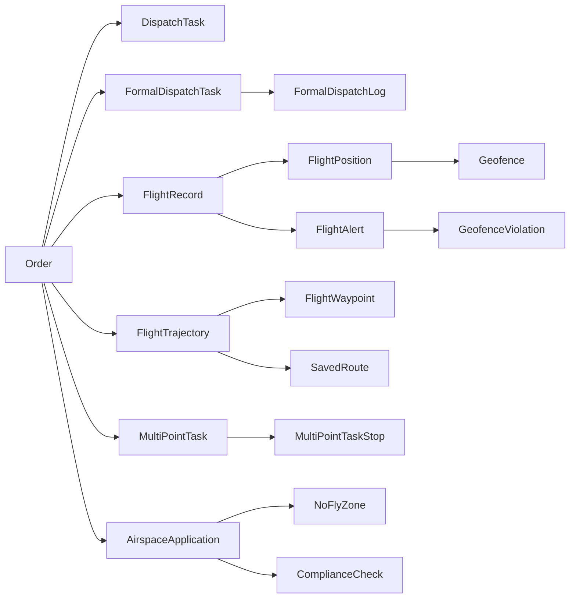

# 订单执行表

<cite>
**本文引用的文件**
- [009_add_order_execution_tables.sql](file://backend/migrations/009_add_order_execution_tables.sql)
- [008_add_dispatch_tables.sql](file://backend/migrations/008_add_dispatch_tables.sql)
- [010_add_airspace_tables.sql](file://backend/migrations/010_add_airspace_tables.sql)
- [models.go](file://backend/internal/model/models.go)
- [order_repo.go](file://backend/internal/repository/order_repo.go)
- [flight_repo.go](file://backend/internal/repository/flight_repo.go)
- [dispatch_repo.go](file://backend/internal/repository/dispatch_repo.go)
- [airspace_repo.go](file://backend/internal/repository/airspace_repo.go)
</cite>

## 目录
1. [简介](#简介)
2. [项目结构](#项目结构)
3. [核心组件](#核心组件)
4. [架构概览](#架构概览)
5. [详细组件分析](#详细组件分析)
6. [依赖分析](#依赖分析)
7. [性能考虑](#性能考虑)
8. [故障排查指南](#故障排查指南)
9. [结论](#结论)
10. [附录](#附录)

## 简介
本文件面向无人机租赁平台的订单执行系统，聚焦于订单生命周期中与执行直接相关的核心数据表：订单表（Order）、订单时间线（OrderTimeline）、订单快照（OrderSnapshot）、派单任务（DispatchTask）、飞行记录（FlightRecord）以及飞行监控相关表（飞行位置、告警、电子围栏、轨迹等）。文档将系统化阐述：
- 订单状态机的表结构实现（状态枚举、状态转换条件、状态变更记录）
- 订单执行过程的关键字段设计（飞行时间记录、实际距离、海拔高度、速度统计等）
- 订单生命周期管理的完整表结构方案（创建、支付、执行、完成、取消等）
- 订单与飞行监控、空域管理等系统的数据交互接口

## 项目结构
围绕订单执行的数据库结构由三类迁移文件构成：
- 订单执行与飞行监控：009_add_order_execution_tables.sql
- 派单系统：008_add_dispatch_tables.sql
- 空域管理与合规：010_add_airspace_tables.sql

上述迁移文件定义了订单、派单、飞行监控、空域管理等核心表及其索引；同时，后端模型文件（models.go）提供了这些表在应用层的结构映射。



图表来源
- [008_add_dispatch_tables.sql:1-185](file://backend/migrations/008_add_dispatch_tables.sql#L1-L185)
- [009_add_order_execution_tables.sql:1-468](file://backend/migrations/009_add_order_execution_tables.sql#L1-L468)
- [010_add_airspace_tables.sql:1-182](file://backend/migrations/010_add_airspace_tables.sql#L1-L182)
- [models.go:413-513](file://backend/internal/model/models.go#L413-L513)

章节来源
- [008_add_dispatch_tables.sql:1-185](file://backend/migrations/008_add_dispatch_tables.sql#L1-L185)
- [009_add_order_execution_tables.sql:1-468](file://backend/migrations/009_add_order_execution_tables.sql#L1-L468)
- [010_add_airspace_tables.sql:1-182](file://backend/migrations/010_add_airspace_tables.sql#L1-L182)
- [models.go:413-513](file://backend/internal/model/models.go#L413-L513)

## 核心组件
本节概述与订单执行直接相关的表及其职责：
- 订单表（Order）：承载订单主体信息、状态、支付与结算状态、目的地与飞行统计字段等
- 订单时间线（OrderTimeline）：记录订单状态变更与关键事件的时间线
- 订单快照（OrderSnapshot）：保存订单在特定时刻的快照数据
- 派单任务（DispatchTask）：承载旧任务池派单任务的结构
- 飞行记录（FlightRecord）：一次订单执行的独立飞行记录
- 飞行监控表族：飞行位置（FlightPosition）、飞行告警（FlightAlert）、电子围栏（Geofence）、围栏违规（GeofenceViolation）、轨迹（FlightTrajectory、FlightWaypoint）、保存路线（SavedRoute）、多点任务（MultiPointTask、MultiPointTaskStop）

章节来源
- [models.go:413-513](file://backend/internal/model/models.go#L413-L513)
- [models.go:1310-1489](file://backend/internal/model/models.go#L1310-L1489)
- [models.go:1493-1723](file://backend/internal/model/models.go#L1493-L1723)

## 架构概览
订单执行系统以“订单为中心”，通过派单任务驱动飞手执行，飞行监控实时采集位置与告警数据，空域管理确保合规与安全，最终形成完整的订单生命周期闭环。

```mermaid
graph TB
ORDER["订单表<br/>Order"]
TIMELINE["订单时间线<br/>OrderTimeline"]
SNAPSHOT["订单快照<br/>OrderSnapshot"]
DISPATCH["派单任务<br/>DispatchTask"]
FDISPATCH["正式派单任务<br/>FormalDispatchTask"]
FLOG["正式派单日志<br/>FormalDispatchLog"]
FLIGHT_RECORD["飞行记录<br/>FlightRecord"]
FLIGHT_POSITION["飞行位置<br/>FlightPosition"]
FLIGHT_ALERT["飞行告警<br/>FlightAlert"]
GEO["电子围栏<br/>Geofence"]
GEO_VIOL["围栏违规<br/>GeofenceViolation"]
TRAJ["飞行轨迹<br/>FlightTrajectory"]
WAYPOINT["航点<br/>FlightWaypoint"]
SAVED_ROUTE["保存路线<br/>SavedRoute"]
MULTI_TASK["多点任务<br/>MultiPointTask"]
MULTI_STOP["多点站点<br/>MultiPointTaskStop"]
AIRSPACE_APP["空域申请<br/>AirspaceApplication"]
NO_FLY["禁飞区<br/>NoFlyZone"]
COMPLIANCE["合规检查<br/>ComplianceCheck"]
ORDER --> TIMELINE
ORDER --> SNAPSHOT
ORDER <- --> DISPATCH
ORDER <- --> FDISPATCH
FDISPATCH --> FLOG
ORDER --> FLIGHT_RECORD
FLIGHT_RECORD --> FLIGHT_POSITION
FLIGHT_RECORD --> FLIGHT_ALERT
FLIGHT_POSITION --> GEO
FLIGHT_ALERT --> GEO_VIOL
FLIGHT_RECORD --> TRAJ
TRAJ --> WAYPOINT
TRAJ --> SAVED_ROUTE
ORDER --> MULTI_TASK
MULTI_TASK --> MULTI_STOP
ORDER --> AIRSPACE_APP
AIRSPACE_APP --> NO_FLY
AIRSPACE_APP --> COMPLIANCE
```

图表来源
- [models.go:413-513](file://backend/internal/model/models.go#L413-L513)
- [models.go:1120-1234](file://backend/internal/model/models.go#L1120-L1234)
- [models.go:1266-1332](file://backend/internal/model/models.go#L1266-L1332)
- [models.go:1310-1489](file://backend/internal/model/models.go#L1310-L1489)
- [models.go:1493-1723](file://backend/internal/model/models.go#L1493-L1723)
- [models.go:1742-1892](file://backend/internal/model/models.go#L1742-L1892)

## 详细组件分析

### 订单表（Order）
- 关键字段
  - 订单基础信息：订单号、类型、来源、需求与供给关联、服务经纬度与地址、服务时间窗口
  - 执行与状态：状态、执行模式、飞手/机主/租户/业主等多方标识、派单任务关联
  - 空域与结算：空域状态、结算状态、结算时间、飞手收益与分成比例
  - 装载/卸载：装载/卸载确认时间与人员、送达照片、收货人签名
  - 目的地：目的地经纬度与地址
  - 飞行统计：起飞/降落时间、实际飞行距离/时长、最大海拔、平均速度、轨迹关联
- 索引与约束
  - 对订单号、状态、派单任务ID、空域状态、结算状态等建立索引，提升查询效率
- 生命周期要点
  - 订单创建后进入待支付/待执行状态，支付完成后进入执行态
  - 执行过程中更新飞行统计字段，完成或取消后更新结算状态与收益



图表来源
- [models.go:413-484](file://backend/internal/model/models.go#L413-L484)
- [009_add_order_execution_tables.sql:7-468](file://backend/migrations/009_add_order_execution_tables.sql#L7-L468)

章节来源
- [models.go:413-484](file://backend/internal/model/models.go#L413-L484)
- [009_add_order_execution_tables.sql:7-468](file://backend/migrations/009_add_order_execution_tables.sql#L7-L468)

### 订单时间线（OrderTimeline）
- 作用：记录订单状态变更、关键事件与操作者信息
- 字段：订单ID、目标状态、备注、操作者ID与类型（机主/租户/系统/管理员）
- 查询：按订单ID升序排列，便于回溯状态变迁



图表来源
- [models.go:486-498](file://backend/internal/model/models.go#L486-L498)

章节来源
- [models.go:486-498](file://backend/internal/model/models.go#L486-L498)
- [order_repo.go:212-229](file://backend/internal/repository/order_repo.go#L212-L229)

### 订单快照（OrderSnapshot）
- 作用：保存订单在特定时刻的快照数据，支持审计与回溯
- 字段：订单ID、快照类型、快照数据（JSON）、创建/更新时间
- 约束：同一订单+快照类型的唯一性



图表来源
- [models.go:500-513](file://backend/internal/model/models.go#L500-L513)

章节来源
- [models.go:500-513](file://backend/internal/model/models.go#L500-L513)

### 派单任务（DispatchTask）
- 作用：承载旧任务池派单任务的结构，包含任务类型、优先级、货物信息、位置信息、时间窗口、预算约束、匹配要求、派单结果与匹配统计
- 状态：pending/matching/dispatching/assigned/cancelled/expired
- 关联：与客户端、飞手、无人机、货运需求等的外键关联



图表来源
- [models.go:1120-1191](file://backend/internal/model/models.go#L1120-L1191)
- [008_add_dispatch_tables.sql:5-79](file://backend/migrations/008_add_dispatch_tables.sql#L5-L79)

章节来源
- [models.go:1120-1191](file://backend/internal/model/models.go#L1120-L1191)
- [008_add_dispatch_tables.sql:5-79](file://backend/migrations/008_add_dispatch_tables.sql#L5-L79)

### 飞行记录（FlightRecord）
- 作用：一次订单执行的独立飞行记录，记录起飞/降落时间、总时长、总距离、最大海拔与状态
- 关联：与订单、正式派单任务、飞手、无人机的关联



图表来源
- [models.go:1310-1336](file://backend/internal/model/models.go#L1310-L1336)

章节来源
- [models.go:1310-1336](file://backend/internal/model/models.go#L1310-L1336)
- [flight_repo.go:38-82](file://backend/internal/repository/flight_repo.go#L38-L82)

### 飞行监控表族
- 飞行位置（FlightPosition）：记录飞行过程中的实时位置、海拔、速度、航向、垂直速度、电池电量、信号强度、GPS卫星数、传感器数据（温度、风速、风向），并标注记录时间
- 飞行告警（FlightAlert）：记录各类告警（低电量、电子围栏、偏航、信号丢失、海拔、速度、天气等），包含告警级别、阈值与实际值、处理状态（激活/确认/解决/忽略）、确认与解决信息
- 电子围栏（Geofence）：定义禁飞/限飞/告警区，支持圆形与多边形区域、高度限制、生效时间、来源与规则（违规动作、预警距离）
- 围栏违规（GeofenceViolation）：记录违规类型（进入/退出/高度）、违规位置、采取动作与违规时间
- 轨迹（FlightTrajectory、FlightWaypoint）：记录完整轨迹与航点，支持模板化与复用
- 保存路线（SavedRoute）：记录可复用的路线模板，包含起终点、推荐高度、适用条件、统计与评价
- 多点任务（MultiPointTask、MultiPointTaskStop）：记录多点装卸任务的总体与站点级信息，包括时间窗口、确认信息与状态



图表来源
- [models.go:1338-1489](file://backend/internal/model/models.go#L1338-L1489)
- [models.go:1493-1723](file://backend/internal/model/models.go#L1493-L1723)

章节来源
- [models.go:1338-1489](file://backend/internal/model/models.go#L1338-L1489)
- [models.go:1493-1723](file://backend/internal/model/models.go#L1493-L1723)
- [flight_repo.go:84-146](file://backend/internal/repository/flight_repo.go#L84-L146)
- [flight_repo.go:156-226](file://backend/internal/repository/flight_repo.go#L156-L226)
- [flight_repo.go:358-422](file://backend/internal/repository/flight_repo.go#L358-L422)
- [flight_repo.go:426-443](file://backend/internal/repository/flight_repo.go#L426-L443)

### 空域管理与合规
- 空域申请（AirspaceApplication）：记录飞行计划、航线、参数、时间窗口、UOM对接状态、合规检查结果与附件
- 禁飞区（NoFlyZone）：定义禁飞/限飞区域、高度限制、生效时间、来源与限制规则
- 合规检查（ComplianceCheck、ComplianceCheckItem）：记录检查触发类型、总体结果、各项摘要与明细项



图表来源
- [models.go:1742-1805](file://backend/internal/model/models.go#L1742-L1805)
- [models.go:1811-1851](file://backend/internal/model/models.go#L1811-L1851)
- [models.go:1853-1921](file://backend/internal/model/models.go#L1853-L1921)

章节来源
- [models.go:1742-1805](file://backend/internal/model/models.go#L1742-L1805)
- [models.go:1811-1851](file://backend/internal/model/models.go#L1811-L1851)
- [models.go:1853-1921](file://backend/internal/model/models.go#L1853-L1921)
- [010_add_airspace_tables.sql:5-182](file://backend/migrations/010_add_airspace_tables.sql#L5-L182)
- [airspace_repo.go:20-97](file://backend/internal/repository/airspace_repo.go#L20-L97)

## 依赖分析
- 订单与派单：订单通过派单任务驱动飞手执行，正式派单任务（FormalDispatchTask）进一步细化执行指令
- 订单与飞行监控：订单与飞行记录强关联，飞行位置与告警作为执行过程的实时数据来源
- 订单与空域管理：订单关联空域申请，空域申请触发合规检查，合规结果影响订单执行
- 飞行监控与地理围栏：飞行位置与电子围栏关联，产生围栏违规记录
- 轨迹与路线：飞行轨迹可模板化为保存路线，支持多点任务的路径规划



图表来源
- [models.go:413-513](file://backend/internal/model/models.go#L413-L513)
- [models.go:1120-1332](file://backend/internal/model/models.go#L1120-L1332)
- [models.go:1338-1723](file://backend/internal/model/models.go#L1338-L1723)
- [models.go:1742-1921](file://backend/internal/model/models.go#L1742-L1921)

章节来源
- [models.go:413-513](file://backend/internal/model/models.go#L413-L513)
- [models.go:1120-1332](file://backend/internal/model/models.go#L1120-L1332)
- [models.go:1338-1723](file://backend/internal/model/models.go#L1338-L1723)
- [models.go:1742-1921](file://backend/internal/model/models.go#L1742-L1921)

## 性能考虑
- 索引策略
  - 订单表新增索引：空域状态、结算状态、派单任务ID，提升查询与筛选效率
  - 飞行监控表：对订单ID、无人机ID、记录时间、告警类型、状态等建立复合与单列索引，支撑高频查询与聚合统计
- 数据分区与归档
  - 飞行位置与轨迹数据体量较大，建议按时间分区或定期归档，控制热数据规模
- 查询优化
  - 订单时间线与快照查询按时间排序，避免全表扫描
  - 飞行统计聚合（总时长、总距离、最大海拔）可通过专用统计表或物化视图缓存

## 故障排查指南
- 订单状态异常
  - 检查订单时间线与快照，定位状态变更节点与操作者
  - 核对支付与结算状态，确认收益计算与分账流程
- 飞行监控异常
  - 核查飞行位置与告警记录，识别低电量、信号丢失、围栏违规等问题
  - 检查电子围栏配置与生效时间，确认违规动作是否正确执行
- 空域合规问题
  - 核对空域申请状态与UOM审批结果，检查合规检查项与有效期
  - 若存在冲突申请，需协调时间窗口或规避禁飞区

章节来源
- [order_repo.go:212-229](file://backend/internal/repository/order_repo.go#L212-L229)
- [flight_repo.go:156-226](file://backend/internal/repository/flight_repo.go#L156-L226)
- [airspace_repo.go:59-97](file://backend/internal/repository/airspace_repo.go#L59-L97)

## 结论
本文基于数据库迁移脚本与应用模型，系统化梳理了无人机租赁平台订单执行系统的表结构设计，覆盖订单生命周期、派单执行、飞行监控与空域合规等关键环节。通过明确的状态机实现、关键字段设计与数据交互接口，为订单执行的稳定性与可追溯性提供了坚实的数据基础。

## 附录
- 订单状态机（示意）
  - 创建：created
  - 待支付：待支付
  - 待执行：待派单/待确认
  - 执行中：执行中/飞行中
  - 已完成：已完成
  - 已取消：已取消
- 关键字段说明（示例）
  - 飞行统计：实际飞行距离（米）、实际飞行时长（秒）、最大海拔（米）、平均速度（米/秒×100）
  - 空域与结算：空域状态（未申请/待审/已批准/已拒绝）、结算状态（待处理/处理中/已结算/失败）
  - 装载/卸载：装载/卸载确认时间与人员、送达照片、收货人签名