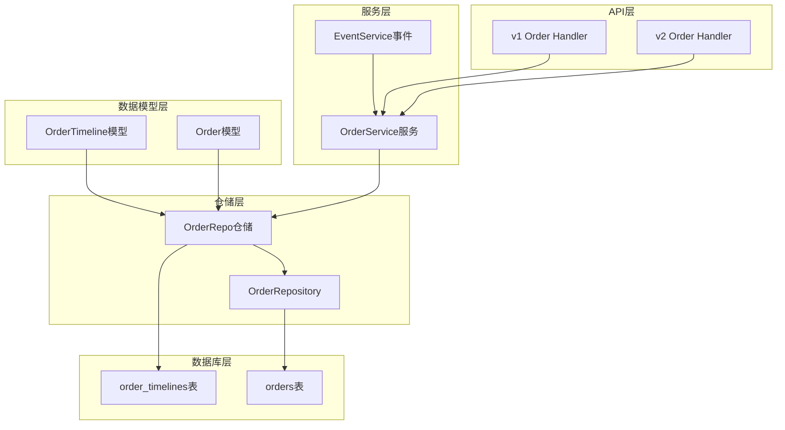
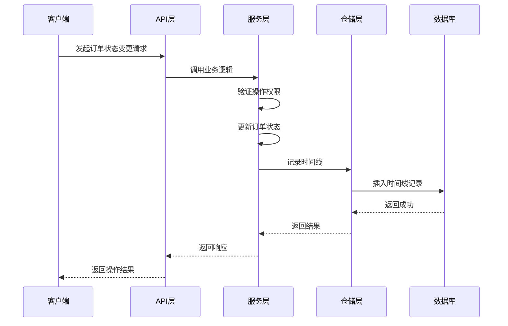
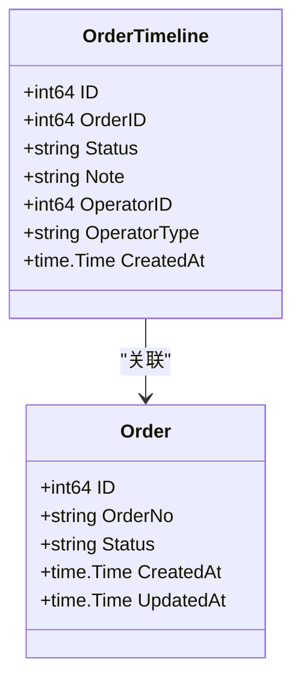
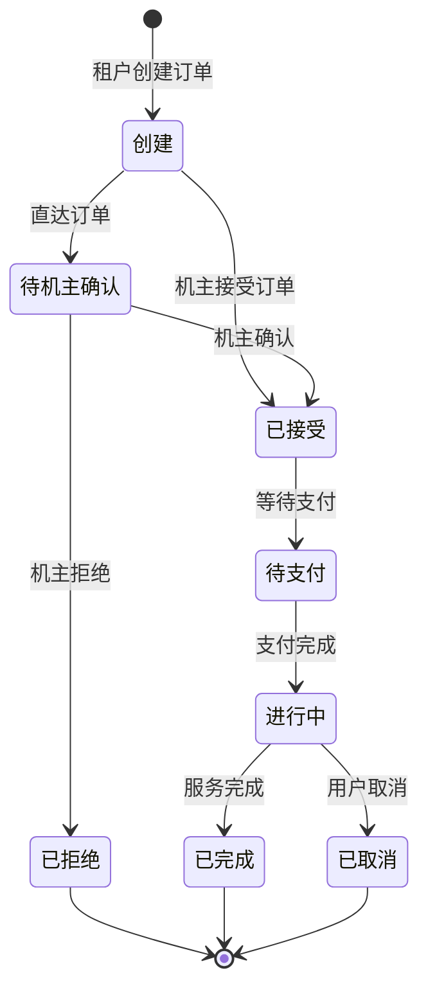
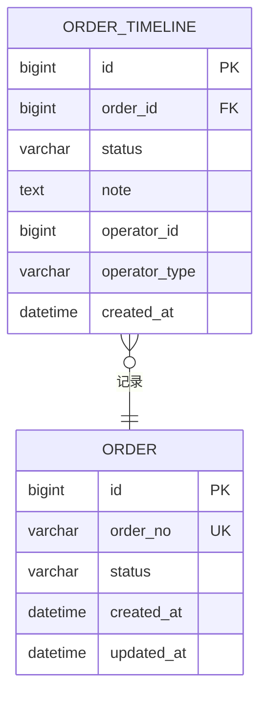
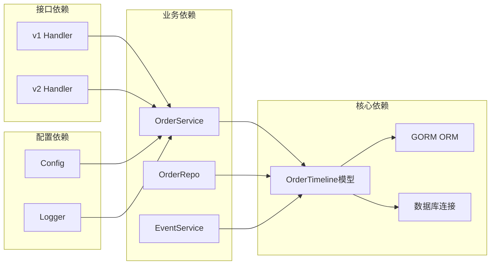

# 订单时间线表

<cite>
**本文档引用的文件**
- [models.go](file://backend/internal/model/models.go)
- [order_repo.go](file://backend/internal/repository/order_repo.go)
- [order_service.go](file://backend/internal/service/order_service.go)
- [handler.go(v1)](file://backend/internal/api/v1/order/handler.go)
- [handler.go(v2)](file://backend/internal/api/v2/order/handler.go)
- [009_add_order_execution_tables.sql](file://backend/migrations/009_add_order_execution_tables.sql)
- [config.go](file://backend/internal/config/config.go)
- [event_service.go](file://backend/internal/service/event_service.go)
</cite>

## 目录
1. [简介](#简介)
2. [项目结构](#项目结构)
3. [核心组件](#核心组件)
4. [架构概览](#架构概览)
5. [详细组件分析](#详细组件分析)
6. [依赖分析](#依赖分析)
7. [性能考虑](#性能考虑)
8. [故障排除指南](#故障排除指南)
9. [结论](#结论)
10. [附录](#附录)

## 简介

订单时间线表(OrderTimeline)是无人机租赁平台的核心审计追踪组件，用于完整记录订单生命周期中的所有状态变更事件。该表设计遵循严格的业务规则，确保每个状态变更都有明确的操作者身份、时间戳和变更原因记录。

本设计文档详细阐述了订单时间线表的表结构设计、业务价值、操作者权限控制机制，以及基于时间线数据的查询分析功能。通过时间线记录，平台能够实现完整的订单状态变更审计、业务流程追溯和性能分析。

## 项目结构

订单时间线表在项目中的组织结构如下：



**图表来源**
- [models.go:486-498](file://backend/internal/model/models.go#L486-L498)
- [order_repo.go:211-229](file://backend/internal/repository/order_repo.go#L211-L229)

**章节来源**
- [models.go:486-498](file://backend/internal/model/models.go#L486-L498)
- [order_repo.go:211-229](file://backend/internal/repository/order_repo.go#L211-L229)

## 核心组件

### 订单时间线表结构设计

订单时间线表采用简洁而强大的设计，包含以下核心字段：

| 字段名 | 类型 | 约束 | 描述 |
|--------|------|------|------|
| id | bigint | 主键, 自增 | 时间线索引标识 |
| order_id | bigint | 非空, 索引 | 关联的订单ID |
| status | varchar(40) | 非空 | 订单变更后的状态值 |
| note | text | | 变更原因和备注信息 |
| operator_id | bigint | 非空 | 操作者用户ID |
| operator_type | varchar(20) | 非空 | 操作者类型(owner, renter, system, admin) |
| created_at | datetime | 非空, 默认当前时间 | 变更时间戳 |

### 操作者类型定义

系统支持四种操作者类型，每种类型具有不同的权限边界：

```mermaid
flowchart TD
A[操作者类型] --> B[机主(owner)]
A --> C[租户(renter)]
A --> D[系统(system)]
A --> E[管理员(admin)]
B --> B1[确认直达订单]
B --> B2[拒绝直达订单]
B --> B3[接受普通订单]
B --> B4[拒绝普通订单]
C --> C1[创建订单]
C --> C2[取消订单]
D --> D1[自动派单]
D --> D2[系统调度]
E --> E1[系统管理]
E --> E2[数据审计]
```

**图表来源**
- [models.go:489](file://backend/internal/model/models.go#L489)

**章节来源**
- [models.go:486-498](file://backend/internal/model/models.go#L486-L498)

## 架构概览

订单时间线表在整个系统架构中扮演着关键的审计和追踪角色：



**图表来源**
- [order_service.go:542-639](file://backend/internal/service/order_service.go#L542-L639)
- [order_repo.go:211-214](file://backend/internal/repository/order_repo.go#L211-L214)

## 详细组件分析

### 数据模型设计

订单时间线模型采用标准的GORM标签定义，确保与数据库的完美映射：



**图表来源**
- [models.go:486-498](file://backend/internal/model/models.go#L486-L498)

### 状态变更流程

系统实现了完整的状态变更流程，确保每个操作都有据可查：



### 权限控制机制

系统通过操作者类型实现细粒度的权限控制：

| 操作类型 | 允许的操作者 | 权限说明 |
|----------|-------------|----------|
| 订单创建 | 租户 | 创建新订单 |
| 订单确认 | 机主 | 确认或拒绝直达订单 |
| 订单接受 | 机主 | 接受普通订单 |
| 订单取消 | 租户/机主 | 取消未执行订单 |
| 系统操作 | 系统 | 自动派单和调度 |

**章节来源**
- [order_service.go:542-719](file://backend/internal/service/order_service.go#L542-L719)

### 审计追踪设计

订单时间线提供了完整的审计追踪能力：



**图表来源**
- [models.go:486-498](file://backend/internal/model/models.go#L486-L498)

## 依赖分析

订单时间线表与其他组件的依赖关系：



**图表来源**
- [order_service.go:18-59](file://backend/internal/service/order_service.go#L18-L59)
- [order_repo.go:10-20](file://backend/internal/repository/order_repo.go#L10-L20)

**章节来源**
- [order_service.go:18-59](file://backend/internal/service/order_service.go#L18-L59)
- [order_repo.go:10-20](file://backend/internal/repository/order_repo.go#L10-L20)

## 性能考虑

### 查询优化策略

1. **索引设计**
   - `order_id` 字段建立索引以支持按订单查询
   - `created_at` 字段支持时间范围查询
   - 复合索引优化常见查询模式

2. **查询模式优化**
   ```sql
   -- 按订单查询时间线
   SELECT * FROM order_timelines 
   WHERE order_id = ? 
   ORDER BY created_at ASC;
   
   -- 获取最新状态
   SELECT * FROM order_timelines 
   WHERE order_id = ? 
   ORDER BY created_at DESC 
   LIMIT 1;
   ```

3. **内存优化**
   - 使用流式查询处理大量时间线数据
   - 合理设置分页参数避免内存溢出

### 存储优化

1. **数据压缩**
   - 对重复的状态值进行压缩存储
   - 合并相似的备注信息

2. **归档策略**
   - 历史时间线定期归档到冷存储
   - 保留期内的频繁访问数据驻留热存储

## 故障排除指南

### 常见问题及解决方案

1. **时间线记录缺失**
   - 检查服务层是否正确调用 `AddTimeline` 方法
   - 验证数据库事务是否正常提交
   - 确认操作者权限验证通过

2. **查询性能问题**
   - 检查 `order_id` 索引是否存在
   - 优化时间范围查询条件
   - 考虑添加复合索引

3. **数据一致性问题**
   - 确保状态变更和时间线记录在同一事务中
   - 检查并发场景下的锁机制
   - 验证幂等性操作

**章节来源**
- [order_repo.go:211-229](file://backend/internal/repository/order_repo.go#L211-L229)

## 结论

订单时间线表(OrderTimeline)作为无人机租赁平台的核心审计组件，通过精心设计的数据结构和完善的权限控制机制，为整个订单生命周期提供了完整的追踪和审计能力。该设计不仅满足了当前业务需求，还为未来的功能扩展和数据分析奠定了坚实基础。

系统通过四种操作者类型的权限分离，确保了业务操作的安全性和可追溯性。同时，基于时间线数据的查询分析功能，为平台运营提供了重要的决策支持。

## 附录

### API接口定义

| 接口 | 方法 | 路径 | 功能 |
|------|------|------|------|
| 获取时间线 | GET | `/api/v1/order/:id/timeline` | 获取指定订单的时间线记录 |
| 获取时间线 | GET | `/api/v2/order/:order_id/timeline` | 获取指定订单的时间线记录 |

### 数据迁移脚本

时间线表的创建和索引优化在数据库迁移脚本中实现，确保了系统的完整性和一致性。

**章节来源**
- [009_add_order_execution_tables.sql:1-468](file://backend/migrations/009_add_order_execution_tables.sql#L1-L468)