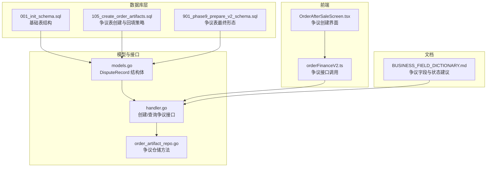
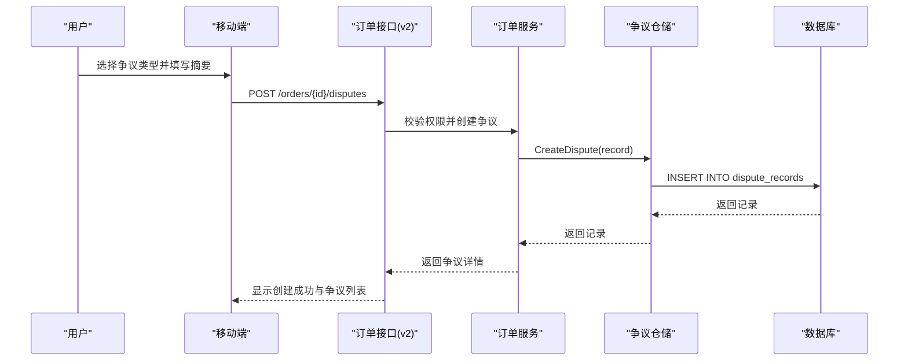
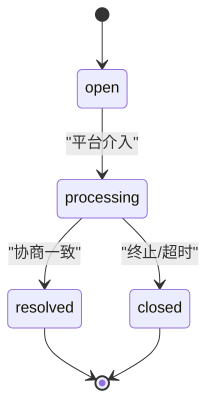
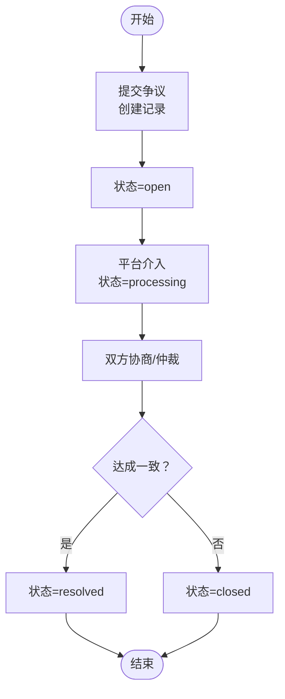
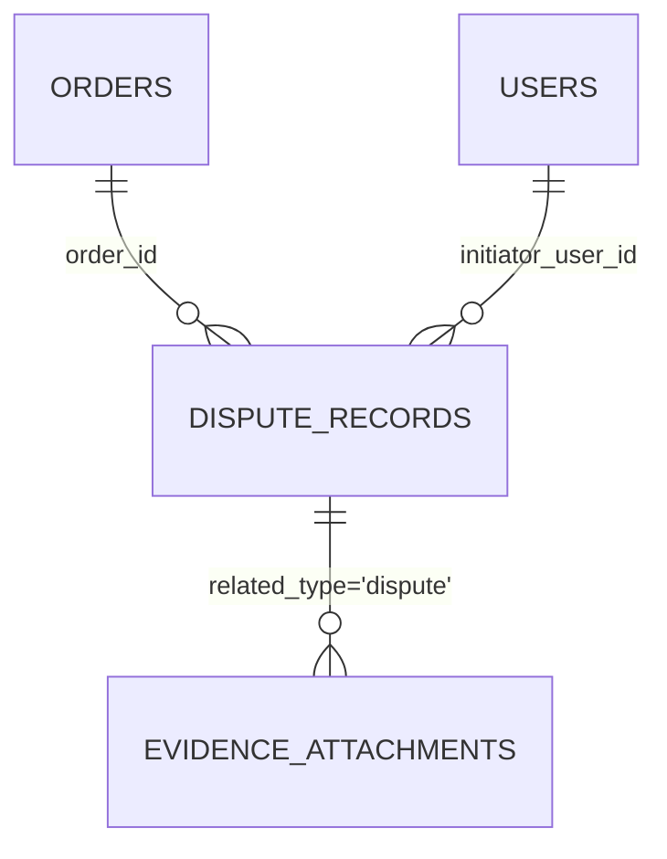

# 争议处理表

<cite>
**本文引用的文件**
- [001_init_schema.sql](file://backend/migrations/001_init_schema.sql)
- [105_create_order_artifacts.sql](file://backend/migrations/105_create_order_artifacts.sql)
- [901_phase9_prepare_v2_schema.sql](file://backend/migrations/901_phase9_prepare_v2_schema.sql)
- [models.go](file://backend/internal/model/models.go)
- [handler.go](file://backend/internal/api/v2/order/handler.go)
- [order_artifact_repo.go](file://backend/internal/repository/order_artifact_repo.go)
- [BUSINESS_FIELD_DICTIONARY.md](file://BUSINESS_FIELD_DICTIONARY.md)
- [OrderAfterSaleScreen.tsx](file://mobile/src/screens/order/OrderAfterSaleScreen.tsx)
- [orderFinanceV2.ts](file://mobile/src/services/orderFinanceV2.ts)
</cite>

## 目录
1. [引言](#引言)
2. [项目结构](#项目结构)
3. [核心组件](#核心组件)
4. [架构总览](#架构总览)
5. [详细组件分析](#详细组件分析)
6. [依赖分析](#依赖分析)
7. [性能考虑](#性能考虑)
8. [故障排查指南](#故障排查指南)
9. [结论](#结论)
10. [附录](#附录)

## 引言
本文件面向无人机租赁平台的争议处理系统，聚焦于争议记录表（dispute_records）的表结构设计与业务支撑。围绕争议流水号、订单关联、申请人关联、争议类型、争议状态、争议摘要等关键字段，结合争议类型分类体系、争议处理流程、证据收集与存储、以及争议时效管理机制，提供从数据库层到应用层的完整表结构设计说明。

## 项目结构
争议处理相关的核心文件分布于以下模块：
- 数据库层：迁移脚本定义争议记录表结构与索引
- 模型层：Go 结构体映射争议记录表
- 接口层：v2 订单接口暴露争议创建与查询能力
- 仓储层：提供争议查询与创建的仓库方法
- 文档层：业务字段字典定义争议类型与状态建议
- 移动端：提供争议创建入口与列表展示

**图表来源**
- [001_init_schema.sql:300-314](file://backend/migrations/001_init_schema.sql#L300-L314)
- [105_create_order_artifacts.sql:36-50](file://backend/migrations/105_create_order_artifacts.sql#L36-L50)
- [901_phase9_prepare_v2_schema.sql:524-538](file://backend/migrations/901_phase9_prepare_v2_schema.sql#L524-L538)
- [models.go:553-570](file://backend/internal/model/models.go#L553-L570)
- [handler.go:206-267](file://backend/internal/api/v2/order/handler.go#L206-L267)
- [order_artifact_repo.go:81-89](file://backend/internal/repository/order_artifact_repo.go#L81-L89)
- [BUSINESS_FIELD_DICTIONARY.md:735-753](file://BUSINESS_FIELD_DICTIONARY.md#L735-L753)
- [OrderAfterSaleScreen.tsx:282-335](file://mobile/src/screens/order/OrderAfterSaleScreen.tsx#L282-L335)
- [orderFinanceV2.ts:44-54](file://mobile/src/services/orderFinanceV2.ts#L44-L54)

**章节来源**
- [001_init_schema.sql:300-314](file://backend/migrations/001_init_schema.sql#L300-L314)
- [105_create_order_artifacts.sql:36-50](file://backend/migrations/105_create_order_artifacts.sql#L36-L50)
- [901_phase9_prepare_v2_schema.sql:524-538](file://backend/migrations/901_phase9_prepare_v2_schema.sql#L524-L538)
- [models.go:553-570](file://backend/internal/model/models.go#L553-L570)
- [handler.go:206-267](file://backend/internal/api/v2/order/handler.go#L206-L267)
- [order_artifact_repo.go:81-89](file://backend/internal/repository/order_artifact_repo.go#L81-L89)
- [BUSINESS_FIELD_DICTIONARY.md:735-753](file://BUSINESS_FIELD_DICTIONARY.md#L735-L753)
- [OrderAfterSaleScreen.tsx:282-335](file://mobile/src/screens/order/OrderAfterSaleScreen.tsx#L282-L335)
- [orderFinanceV2.ts:44-54](file://mobile/src/services/orderFinanceV2.ts#L44-L54)

## 核心组件
争议记录表（dispute_records）是争议处理系统的核心数据载体，其关键字段与约束如下：
- 主键与版本控制：id（自增主键）、deleted_at（软删除）
- 订单关联：order_id（外键，索引），用于将争议与具体订单绑定
- 申请人关联：initiator_user_id（索引），标识争议发起人
- 争议类型：dispute_type（字符串，非空），用于区分争议类别
- 争议状态：status（字符串，默认 open，索引），用于跟踪处理进度
- 争议摘要：summary（文本），用于简述争议背景
- 时间戳：created_at、updated_at（默认 CURRENT_TIMESTAMP）

上述字段在数据库层通过唯一/复合索引与约束保障查询效率与数据一致性；在模型层以结构体形式映射，便于服务层与仓储层使用。

**章节来源**
- [105_create_order_artifacts.sql:36-50](file://backend/migrations/105_create_order_artifacts.sql#L36-L50)
- [901_phase9_prepare_v2_schema.sql:524-538](file://backend/migrations/901_phase9_prepare_v2_schema.sql#L524-L538)
- [models.go:553-570](file://backend/internal/model/models.go#L553-L570)

## 架构总览
争议处理流程贯穿移动端、接口层、仓储层与数据库层，形成“发起—记录—追踪—归档”的闭环：

**图表来源**
- [handler.go:206-242](file://backend/internal/api/v2/order/handler.go#L206-L242)
- [order_artifact_repo.go:87-89](file://backend/internal/repository/order_artifact_repo.go#L87-L89)
- [OrderAfterSaleScreen.tsx:282-335](file://mobile/src/screens/order/OrderAfterSaleScreen.tsx#L282-L335)
- [orderFinanceV2.ts:47-53](file://mobile/src/services/orderFinanceV2.ts#L47-L53)

## 详细组件分析

### 表结构设计与字段说明
- 表名：dispute_records
- 关键字段
  - order_id：关联订单，支持按订单维度聚合争议
  - initiator_user_id：争议发起人，支持按用户维度检索
  - dispute_type：争议类型，支持按类型统计与筛选
  - status：争议状态，支持按状态流转追踪
  - summary：争议摘要，支持快速检索与展示
  - created_at/updated_at：审计与排序依据
- 约束与索引
  - 主键：id
  - 索引：order_id、initiator_user_id、status、deleted_at
  - 软删除：deleted_at 支持逻辑删除

该设计确保争议记录与订单强关联，同时支持多维检索与高效统计。

**章节来源**
- [105_create_order_artifacts.sql:36-50](file://backend/migrations/105_create_order_artifacts.sql#L36-L50)
- [901_phase9_prepare_v2_schema.sql:524-538](file://backend/migrations/901_phase9_prepare_v2_schema.sql#L524-L538)
- [models.go:553-570](file://backend/internal/model/models.go#L553-L570)

### 争议类型分类体系
根据业务字段字典，争议类型（dispute_type）建议采用字符串枚举，常见类型包括但不限于：
- 服务质量争议：涉及飞行质量、交付标准、服务体验等
- 支付争议：涉及支付金额、扣款异常、退款纠纷等
- 履约争议：涉及订单取消、履约延迟、服务变更等
- 无人机损坏争议：涉及设备损伤、保险理赔、责任划分等

类型字段在数据库层以 varchar(30) 存储，在接口层通过请求参数传入，便于前端统一选择与后端校验。

**章节来源**
- [BUSINESS_FIELD_DICTIONARY.md:735-753](file://BUSINESS_FIELD_DICTIONARY.md#L735-L753)
- [handler.go:218-224](file://backend/internal/api/v2/order/handler.go#L218-L224)

### 争议状态管理与流程支撑
争议状态（status）建议采用以下状态序列：
- open：已提交，待平台介入
- processing：平台已介入，正在协调
- resolved：双方达成一致，争议解决
- closed：争议关闭（可能未解决或已归档）

状态字段在数据库层以 varchar(20) 存储，并建立索引以支持按状态查询与报表统计。接口层提供创建与查询能力，前端据此渲染不同状态卡片与操作按钮。

**图表来源**
- [BUSINESS_FIELD_DICTIONARY.md:748-753](file://BUSINESS_FIELD_DICTIONARY.md#L748-L753)
- [handler.go:206-267](file://backend/internal/api/v2/order/handler.go#L206-L267)

**章节来源**
- [BUSINESS_FIELD_DICTIONARY.md:748-753](file://BUSINESS_FIELD_DICTIONARY.md#L748-L753)
- [handler.go:206-267](file://backend/internal/api/v2/order/handler.go#L206-L267)

### 争议处理流程的表结构支撑
争议处理流程的关键环节与表结构支撑：
- 争议提交：接口层接收参数并创建记录，仓储层写入 dispute_records
- 平台介入：通过状态字段标记 processing，支持后续协调与仲裁
- 双方协商：通过订单快照与证据附件关联，支撑协商过程
- 仲裁决定：状态字段更新为 resolved 或 closed
- 执行完成：与结算冻结/解冻联动，状态字段最终稳定

**图表来源**
- [handler.go:206-242](file://backend/internal/api/v2/order/handler.go#L206-L242)
- [order_artifact_repo.go:87-89](file://backend/internal/repository/order_artifact_repo.go#L87-L89)
- [BUSINESS_FIELD_DICTIONARY.md:748-753](file://BUSINESS_FIELD_DICTIONARY.md#L748-L753)

**章节来源**
- [handler.go:206-242](file://backend/internal/api/v2/order/handler.go#L206-L242)
- [order_artifact_repo.go:87-89](file://backend/internal/repository/order_artifact_repo.go#L87-L89)
- [BUSINESS_FIELD_DICTIONARY.md:748-753](file://BUSINESS_FIELD_DICTIONARY.md#L748-L753)

### 争议证据收集与存储
证据附件建议独立建表（evidence_attachments），与争议记录建立一对多关联：
- 关联对象类型：related_type（枚举：dispute、refund、review）
- 关联对象 ID：related_id
- 上传人：uploader_user_id
- 文件类型：file_type（image、video、document）
- 文件地址：file_url
- 描述：description
- 时间戳：created_at

该设计使证据与争议记录解耦，便于证据的统一管理、检索与合规审计。

**章节来源**
- [BUSINESS_FIELD_DICTIONARY.md:777-788](file://BUSINESS_FIELD_DICTIONARY.md#L777-L788)

### 争议时效管理机制
争议时效可通过系统配置与业务规则共同实现：
- 争议申请时限：可在订单状态或业务流程中限制可发起争议的时间窗口
- 处理时限：通过状态流转与超时规则（如 processing 超时自动关闭）实现
- 自动关闭：基于 created_at 与系统配置计算截止时间，到期后自动将状态置为 closed

系统配置示例（来自初始化脚本）：
- payment_timeout：支付超时时间（秒）
- order_accept_timeout：订单接受超时时间（秒）

争议时效可复用类似机制，通过定时任务或业务规则在服务层实现。

**章节来源**
- [001_init_schema.sql:302-308](file://backend/migrations/001_init_schema.sql#L302-L308)
- [handler.go:206-242](file://backend/internal/api/v2/order/handler.go#L206-L242)

## 依赖分析
争议记录表与其他模块的依赖关系如下：
- 订单表（orders）：通过 order_id 关联，支持按订单维度查询争议
- 用户表（users）：通过 initiator_user_id 关联，支持按发起人维度查询争议
- 证据附件表（evidence_attachments）：通过 related_type/related_id 关联，支持证据与争议的多对多挂载

**图表来源**
- [105_create_order_artifacts.sql:36-50](file://backend/migrations/105_create_order_artifacts.sql#L36-L50)
- [BUSINESS_FIELD_DICTIONARY.md:777-788](file://BUSINESS_FIELD_DICTIONARY.md#L777-L788)

**章节来源**
- [105_create_order_artifacts.sql:36-50](file://backend/migrations/105_create_order_artifacts.sql#L36-L50)
- [BUSINESS_FIELD_DICTIONARY.md:777-788](file://BUSINESS_FIELD_DICTIONARY.md#L777-L788)

## 性能考虑
- 索引优化：为 order_id、initiator_user_id、status、deleted_at 建立索引，提升按订单、发起人、状态与软删除的查询性能
- 分页与排序：按 created_at 降序分页查询，避免全表扫描
- 软删除：利用 deleted_at 实现逻辑删除，减少物理删除带来的锁竞争
- 读写分离：争议查询多为读场景，可考虑读库分担压力
- 缓存策略：对热点订单的争议概览进行缓存，降低数据库压力

## 故障排查指南
- 争议创建失败
  - 检查接口参数：dispute_type、summary 是否符合约束
  - 校验权限：调用方是否具备访问订单的权限
  - 查看仓储返回：确认数据库插入是否成功
- 争议查询为空
  - 检查 order_id 是否正确
  - 排查 deleted_at 条件：确认未被软删除
- 状态异常
  - 核对状态枚举值：是否使用了受支持的状态
  - 检查业务规则：是否存在超时或自动关闭逻辑触发

**章节来源**
- [handler.go:206-267](file://backend/internal/api/v2/order/handler.go#L206-L267)
- [order_artifact_repo.go:81-89](file://backend/internal/repository/order_artifact_repo.go#L81-L89)

## 结论
争议记录表（dispute_records）通过清晰的字段设计与完善的索引策略，为争议处理流程提供了坚实的数据基础。结合争议类型分类、状态管理、证据附件与时效规则，系统能够高效支撑争议的提交、介入、协商、仲裁与归档全流程，同时满足审计与合规要求。

## 附录
- 争议类型建议：服务质量争议、支付争议、履约争议、无人机损坏争议
- 争议状态建议：open、processing、resolved、closed
- 证据附件建议：image、video、document 三类文件类型
- 时效机制：基于系统配置与业务规则实现申请时限、处理时限与自动关闭