# 信用控制表

<cite>
**本文引用的文件**
- [012_add_credit_control_tables.sql](file://backend/migrations/012_add_credit_control_tables.sql)
- [models.go](file://backend/internal/model/models.go)
- [credit_repo.go](file://backend/internal/repository/credit_repo.go)
- [credit_service.go](file://backend/internal/service/credit_service.go)
- [CreditScoreScreen.tsx](file://mobile/src/screens/credit/CreditScoreScreen.tsx)
- [credit.ts](file://mobile/src/services/credit.ts)
</cite>

## 目录
1. [简介](#简介)
2. [项目结构](#项目结构)
3. [核心组件](#核心组件)
4. [架构总览](#架构总览)
5. [详细组件分析](#详细组件分析)
6. [依赖关系分析](#依赖关系分析)
7. [性能考量](#性能考量)
8. [故障排查指南](#故障排查指南)
9. [结论](#结论)

## 简介
本文件面向无人机租赁平台的信用控制系统，聚焦于“信用控制表”的结构设计与实现，涵盖以下关键主题：
- 信用评分体系：基础信用分、行为评分、履约评分、风险评分等多维指标的数据存储与计算规则
- 风险控制机制：信用额度上限、冻结阈值、预警阈值、自动冻结触发等风控规则的数据支撑
- 违规记录管理：违规类型分类、严重程度分级、处罚措施、申诉与恢复流程
- 信用修复机制：修复申请、审核流程、观察期管理、信用恢复
- 差异化信用管理：黑名单、灰名单、白名单策略的表结构支撑

## 项目结构
信用控制相关的核心文件分布如下：
- 数据库迁移脚本：定义信用控制相关表结构及初始化配置
- 后端模型与仓储：定义实体模型、仓储层查询方法
- 业务服务：封装信用评分计算、风控检测、违规处理、保证金管理等业务逻辑
- 移动端界面与接口：展示信用分、违规记录、风控记录、黑名单与保证金等

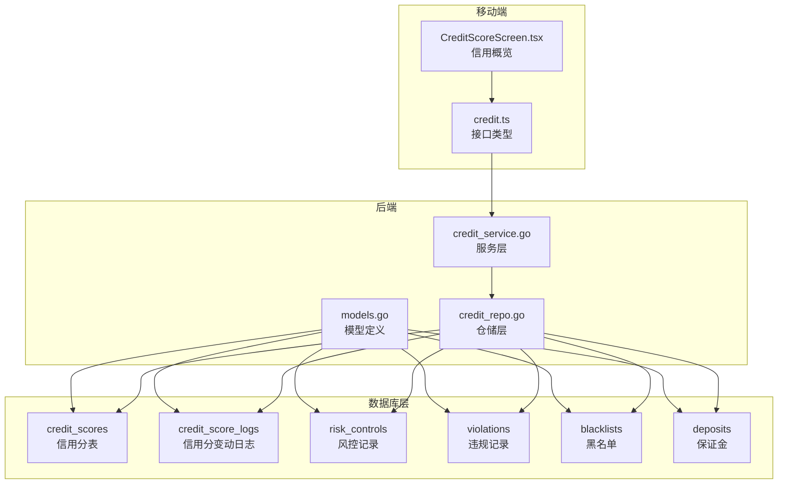

图表来源
- [012_add_credit_control_tables.sql:6-231](file://backend/migrations/012_add_credit_control_tables.sql#L6-L231)
- [models.go:2145-2308](file://backend/internal/model/models.go#L2145-L2308)
- [credit_repo.go:1-523](file://backend/internal/repository/credit_repo.go#L1-L523)
- [credit_service.go:1-645](file://backend/internal/service/credit_service.go#L1-L645)
- [CreditScoreScreen.tsx:1-462](file://mobile/src/screens/credit/CreditScoreScreen.tsx#L1-L462)
- [credit.ts:1-287](file://mobile/src/services/credit.ts#L1-L287)

章节来源
- [012_add_credit_control_tables.sql:1-255](file://backend/migrations/012_add_credit_control_tables.sql#L1-L255)
- [models.go:2145-2308](file://backend/internal/model/models.go#L2145-L2308)

## 核心组件
- 信用分表（credit_scores）：存储用户总信用分、各维度分值、统计指标、状态标记（冻结/黑名单）以及最后计算时间
- 信用分变动日志（credit_score_logs）：记录每次信用分变化的原因、维度、前后分数、操作人等
- 风控记录（risk_controls）：记录风险事件的触发阶段、类型、等级、处置动作与审核流程
- 违规记录（violations）：记录违规类型与等级、处罚措施、申诉状态与处理流程
- 黑名单（blacklists）：记录拉黑类型（永久/临时）、到期时间、添加/移除记录
- 保证金（deposits）：记录用户需缴/已缴/冻结/退还金额与状态

章节来源
- [012_add_credit_control_tables.sql:6-231](file://backend/migrations/012_add_credit_control_tables.sql#L6-L231)
- [models.go:2145-2308](file://backend/internal/model/models.go#L2145-L2308)

## 架构总览
信用控制系统的整体工作流包括：
- 信用初始化：按用户类型（飞手/机主/客户）初始化基础分与维度分
- 订单完成后动态调整：根据评分与履约情况调整维度分与总分，并生成变动日志
- 风控检测：在订单前/中/后阶段进行风控评估，生成风控记录并建议处置
- 违规处理：确认违规后扣分、冻结或拉黑，并记录日志；支持申诉恢复
- 保证金管理：根据风控结果要求用户缴纳保证金，支持退款
- 统计与查询：提供信用分列表、风控记录、违规记录、黑名单与保证金的查询与统计

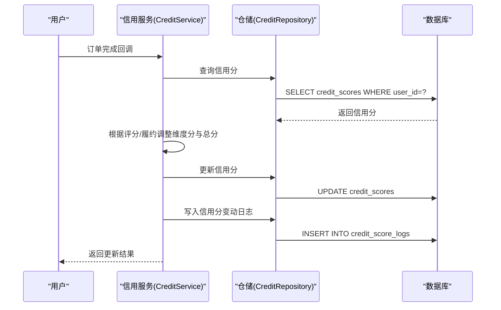

图表来源
- [credit_service.go:133-223](file://backend/internal/service/credit_service.go#L133-L223)
- [credit_repo.go:23-52](file://backend/internal/repository/credit_repo.go#L23-L52)

## 详细组件分析

### 信用评分体系设计
- 总分与等级：总分为0-1000分，等级划分为优秀、良好、正常、较差、极差
- 飞手维度：基础资质、服务质量、安全记录、活跃度（满分分别为200、300、300、200）
- 机主维度：设备合规、服务质量、履约能力、合作态度（满分分别为250、300、250、200）
- 客户维度：身份认证、支付能力、合作态度、订单质量（满分分别为200、300、300、200）
- 统计指标：总订单数、完成数、取消数、纠纷数、平均评分、评价总数、好评/差评数、违规次数、最后违规时间
- 状态标记：是否冻结、冻结原因与时间；是否黑名单、拉黑原因与时间
- 最后计算时间：记录最近一次总分重算时间

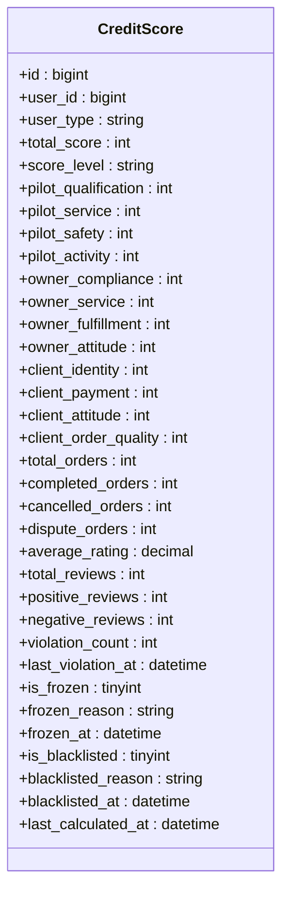

图表来源
- [models.go:2145-2144](file://backend/internal/model/models.go#L2145-L2144)

章节来源
- [012_add_credit_control_tables.sql:6-63](file://backend/migrations/012_add_credit_control_tables.sql#L6-L63)
- [models.go:2145-2144](file://backend/internal/model/models.go#L2145-L2144)

### 信用分变动日志
- 记录每次信用分变化的上下文：变更类型（订单完成、评价、违规、奖励/惩罚、重算）、变更原因、维度、前后分数、分数变化、关联订单/评价、操作人类型（系统/管理员/自动）
- 便于审计与可视化展示

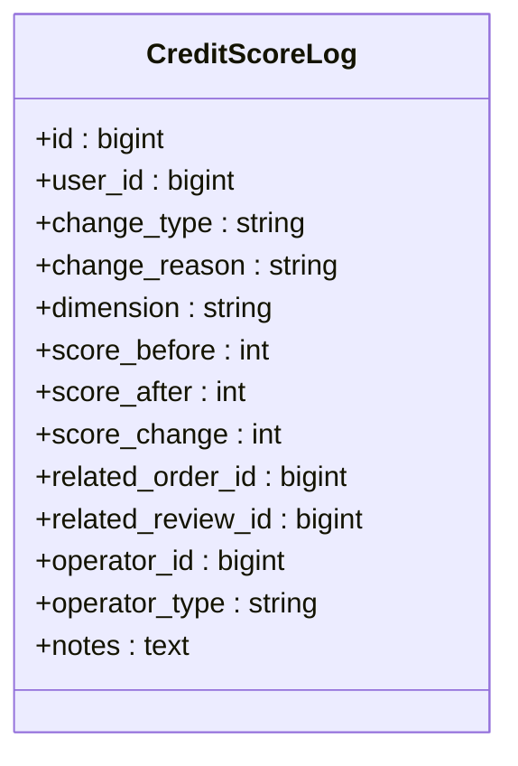

图表来源
- [models.go:2146-2166](file://backend/internal/model/models.go#L2146-L2166)

章节来源
- [012_add_credit_control_tables.sql:65-86](file://backend/migrations/012_add_credit_control_tables.sql#L65-L86)
- [models.go:2146-2166](file://backend/internal/model/models.go#L2146-L2166)

### 风控记录表
- 风控编号唯一标识每条记录
- 风控阶段：事前（pre）、事中（during）、事后（post）
- 风控类型：身份欺诈、支付风险、行为异常、纠纷、违规、黑名单
- 风控等级：低（<=25）、中（<=50）、高（<=75）、极高（<=100）
- 处置动作：无、警告、冻结、拉黑、阻断订单、要求保证金
- 审核流程：待审、审核中、已解决、已驳回；记录审核人、审核时间、处置详情、解决时间

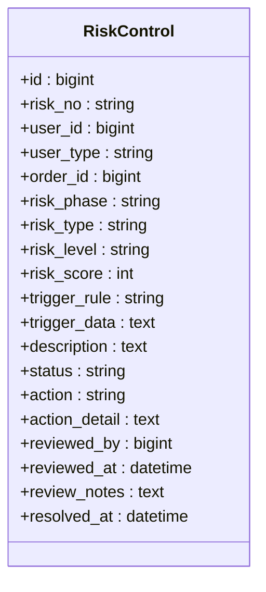

图表来源
- [models.go:2168-2205](file://backend/internal/model/models.go#L2168-L2205)

章节来源
- [012_add_credit_control_tables.sql:88-127](file://backend/migrations/012_add_credit_control_tables.sql#L88-L127)
- [models.go:2168-2205](file://backend/internal/model/models.go#L2168-L2205)

### 违规记录表
- 违规编号唯一标识
- 违规类型：恶意取消、爽约、延误、损坏、欺诈、不安全飞行、违反政策
- 违规等级：轻微、中等、严重、重大
- 处罚：警告、扣分、临时冻结、永久冻结、拉黑；同时记录扣分、冻结天数、罚款金额
- 申诉：申诉状态（无、待审、已批准、已拒绝）、申诉内容、时间、审核人、审核时间、结果
- 状态：待定、已确认、申诉中、已撤销

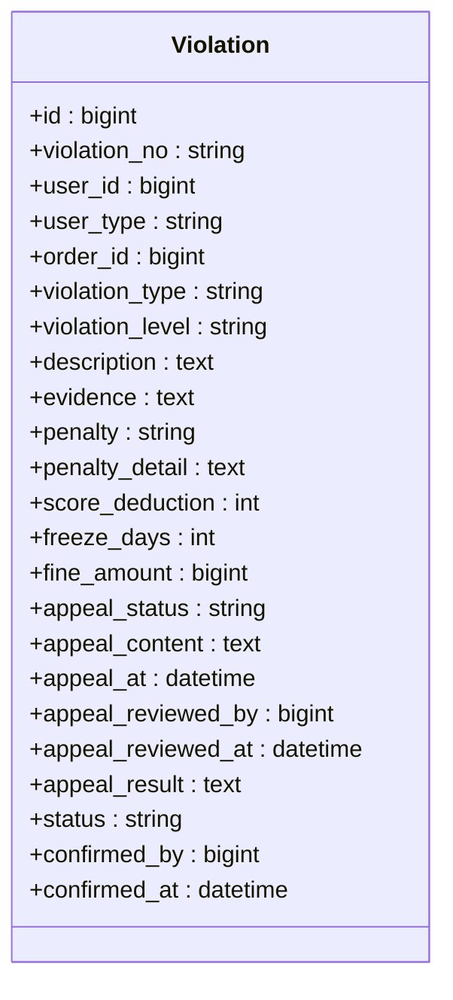

图表来源
- [models.go:2207-2250](file://backend/internal/model/models.go#L2207-L2250)

章节来源
- [012_add_credit_control_tables.sql:129-174](file://backend/migrations/012_add_credit_control_tables.sql#L129-L174)
- [models.go:2207-2250](file://backend/internal/model/models.go#L2207-L2250)

### 黑名单表
- 黑名单类型：永久、临时；临时黑名单带到期时间
- 添加/移除：记录添加人、添加时间、移除人、移除时间、移除原因
- 激活状态：仅对当前生效的黑名单进行统计与查询

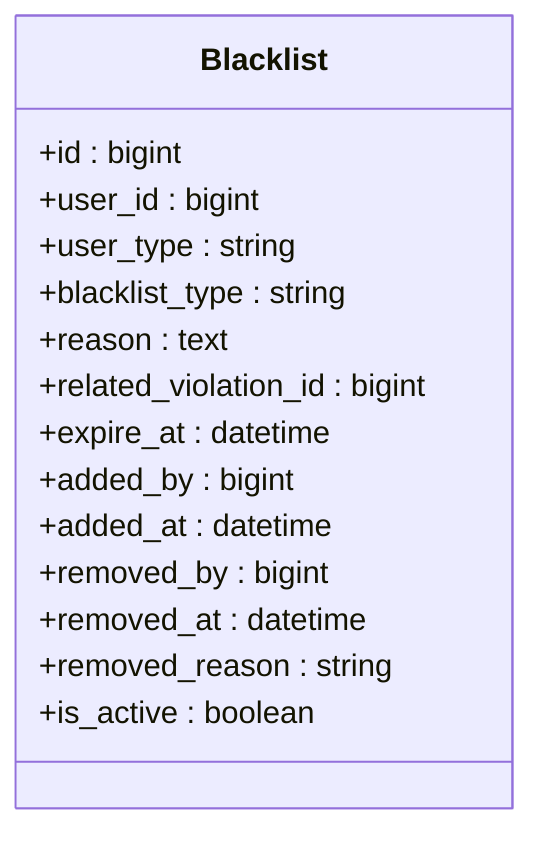

图表来源
- [models.go:2252-2275](file://backend/internal/model/models.go#L2252-L2275)

章节来源
- [012_add_credit_control_tables.sql:176-199](file://backend/migrations/012_add_credit_control_tables.sql#L176-L199)
- [models.go:2252-2275](file://backend/internal/model/models.go#L2252-L2275)

### 保证金表
- 保证金编号唯一标识
- 金额字段：应缴、已缴、冻结（用于赔付）、已退
- 状态：待缴、已缴、部分、冻结、退款中、已退款
- 关联支付记录与原因字段

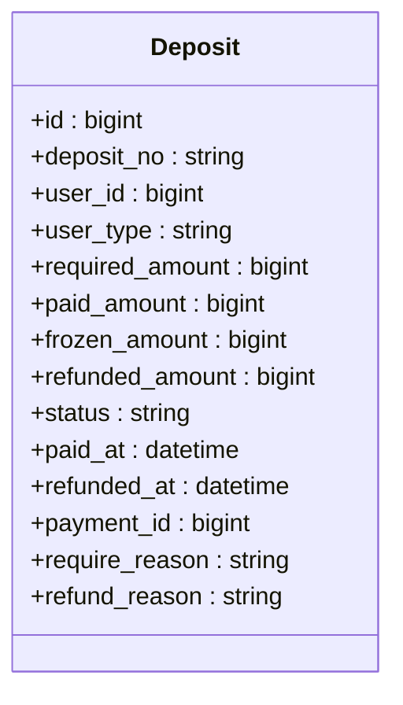

图表来源
- [models.go:2277-2308](file://backend/internal/model/models.go#L2277-L2308)

章节来源
- [012_add_credit_control_tables.sql:201-231](file://backend/migrations/012_add_credit_control_tables.sql#L201-L231)
- [models.go:2277-2308](file://backend/internal/model/models.go#L2277-L2308)

### 信用修复机制
- 申诉流程：提交申诉、审核、批准后恢复信用分与解除冻结/黑名单
- 恢复逻辑：按违规类型恢复对应维度分，减少违规次数，解除冻结/黑名单状态，并写入信用分变动日志

```mermaid
sequenceDiagram
participant U as "用户"
participant S as "信用服务"
participant R as "仓储"
participant DB as "数据库"
U->>S : 提交申诉
S->>R : 更新违规记录状态为申诉中
R->>DB : UPDATE violations SET appeal_status='pending', status='appealing'
U->>S : 审核申诉
S->>R : 审核通过则恢复信用分
R->>DB : UPDATE credit_scores SET ... ; UPDATE violations SET appeal_status='approved', status='revoked'
S->>R : 写入信用分变动日志
R->>DB : INSERT INTO credit_score_logs
```

图表来源
- [credit_service.go:347-447](file://backend/internal/service/credit_service.go#L347-L447)
- [credit_repo.go:253-391](file://backend/internal/repository/credit_repo.go#L253-L391)

章节来源
- [credit_service.go:347-447](file://backend/internal/service/credit_service.go#L347-L447)
- [credit_repo.go:253-391](file://backend/internal/repository/credit_repo.go#L253-L391)

### 风险控制机制
- 事前风控：黑名单、信用分过低、取消率过高、违规次数过多触发不同等级风险
- 处置建议：极高风险阻断订单，高风险要求保证金，中风险警告
- 审核处置：冻结或拉黑用户

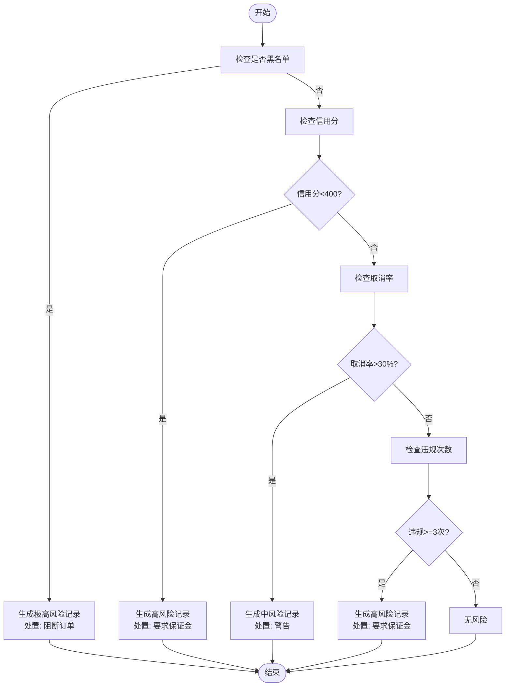

图表来源
- [credit_service.go:453-517](file://backend/internal/service/credit_service.go#L453-L517)

章节来源
- [credit_service.go:453-543](file://backend/internal/service/credit_service.go#L453-L543)

### 信用评分计算与更新
- 初始化：按用户类型设置基础分与维度分
- 订单完成后：根据评分与履约情况调整维度分与总分，更新统计指标与最后计算时间
- 日志记录：记录变更类型、维度、前后分数与操作人

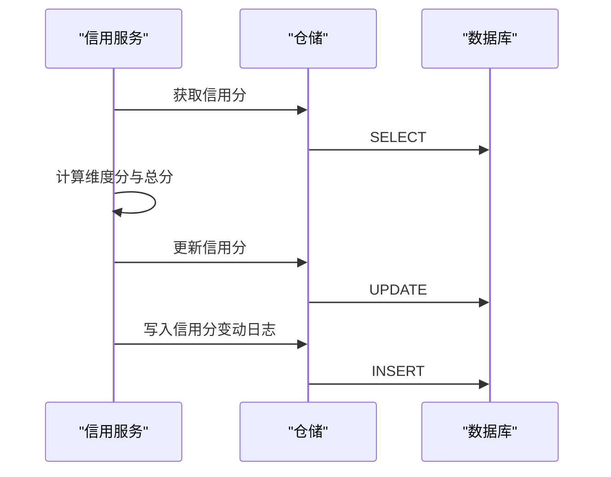

图表来源
- [credit_service.go:36-131](file://backend/internal/service/credit_service.go#L36-L131)
- [credit_repo.go:23-52](file://backend/internal/repository/credit_repo.go#L23-L52)

章节来源
- [credit_service.go:36-236](file://backend/internal/service/credit_service.go#L36-L236)
- [credit_repo.go:23-76](file://backend/internal/repository/credit_repo.go#L23-L76)

### 移动端展示与交互
- 信用概览：总分、等级、分项得分、服务统计、状态提示（冻结/黑名单）
- 变动记录：按时间倒序展示信用分变化明细
- 违规记录：按等级、类型、状态筛选，支持查看详情与申诉

章节来源
- [CreditScoreScreen.tsx:1-462](file://mobile/src/screens/credit/CreditScoreScreen.tsx#L1-L462)
- [credit.ts:1-287](file://mobile/src/services/credit.ts#L1-L287)

## 依赖关系分析
- 模型依赖：各实体模型通过GORM注解映射到数据库表，形成清晰的领域模型
- 仓储依赖：仓储层封装数据库访问，提供信用分、风控、违规、黑名单、保证金的CRUD与统计查询
- 服务依赖：服务层组合仓储层，实现信用评分计算、风控检测、违规处理、保证金管理等业务逻辑
- 前端依赖：移动端通过API类型与服务层对接，展示信用分、风控、违规、黑名单与保证金等信息

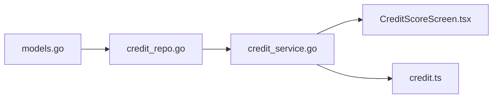

图表来源
- [models.go:2145-2308](file://backend/internal/model/models.go#L2145-L2308)
- [credit_repo.go:1-523](file://backend/internal/repository/credit_repo.go#L1-L523)
- [credit_service.go:1-645](file://backend/internal/service/credit_service.go#L1-L645)
- [CreditScoreScreen.tsx:1-462](file://mobile/src/screens/credit/CreditScoreScreen.tsx#L1-L462)
- [credit.ts:1-287](file://mobile/src/services/credit.ts#L1-L287)

章节来源
- [models.go:2145-2308](file://backend/internal/model/models.go#L2145-L2308)
- [credit_repo.go:1-523](file://backend/internal/repository/credit_repo.go#L1-L523)
- [credit_service.go:1-645](file://backend/internal/service/credit_service.go#L1-L645)
- [CreditScoreScreen.tsx:1-462](file://mobile/src/screens/credit/CreditScoreScreen.tsx#L1-L462)
- [credit.ts:1-287](file://mobile/src/services/credit.ts#L1-L287)

## 性能考量
- 索引优化：信用分表对用户类型、等级、冻结/黑名单状态建立索引；日志表对用户、变更类型、订单ID建立索引；风控与违规表对用户、订单、类型、等级、状态建立索引；黑名单与保证金表对类型、状态、到期时间建立索引
- 分页查询：仓储层提供分页查询与总数统计，避免一次性加载大量数据
- 读写分离：信用分与日志写入频率较高，建议将高频写入与查询分离至不同实例
- 缓存策略：对热点用户信用分与风控记录进行缓存，降低数据库压力

## 故障排查指南
- 信用分未更新：检查订单完成后调用链是否执行、仓储更新是否成功、日志是否写入
- 风控误判：检查风控规则参数（信用分阈值、取消率阈值、违规次数阈值），核对触发规则与等级映射
- 申诉无效：检查申诉状态流转、审核流程与信用分恢复逻辑
- 黑名单异常：核对黑名单类型、到期时间、激活状态与移除记录
- 保证金问题：核对状态流转、冻结与退款逻辑与支付记录关联

章节来源
- [credit_service.go:265-447](file://backend/internal/service/credit_service.go#L265-L447)
- [credit_repo.go:182-407](file://backend/internal/repository/credit_repo.go#L182-L407)

## 结论
该信用控制表结构以“信用分+风控+违规+黑名单+保证金”为核心，覆盖了从信用初始化、动态评分、风险控制、违规处理到信用修复与差异化管理的完整闭环。通过明确的表结构、完善的索引与分页查询、严谨的业务流程与日志记录，平台能够有效支撑信用评分体系与风控策略的落地实施。