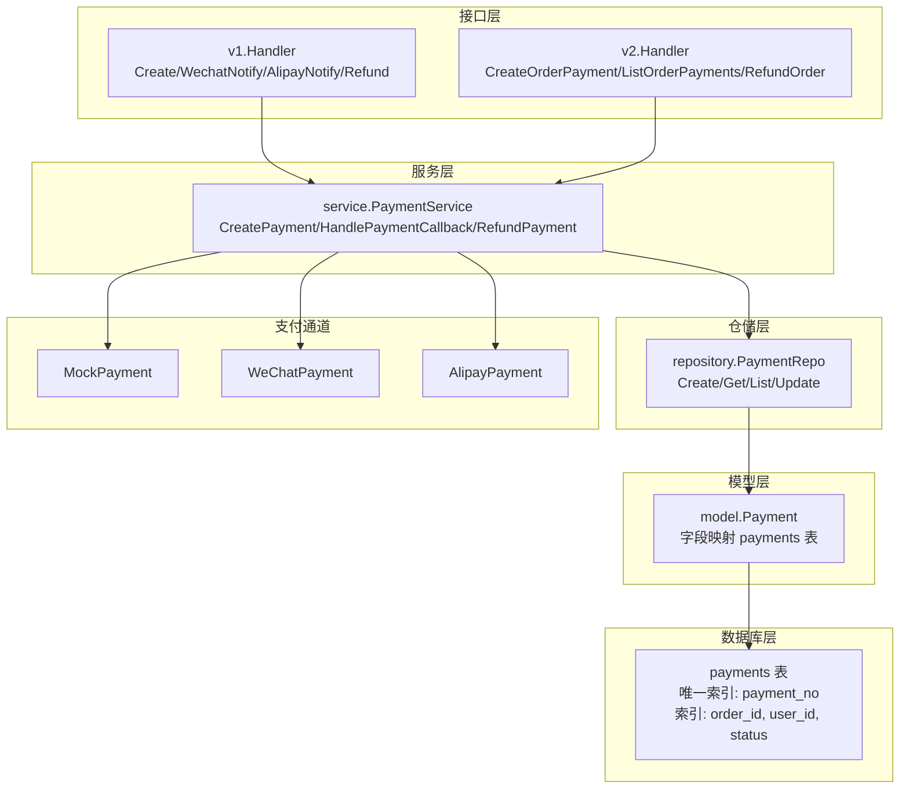
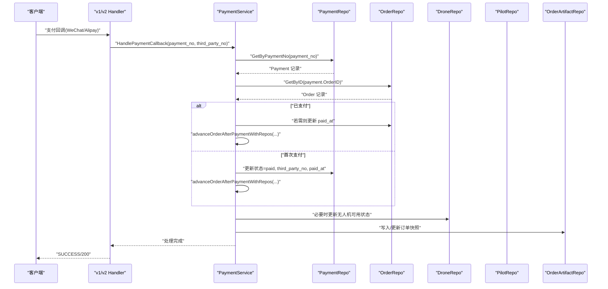
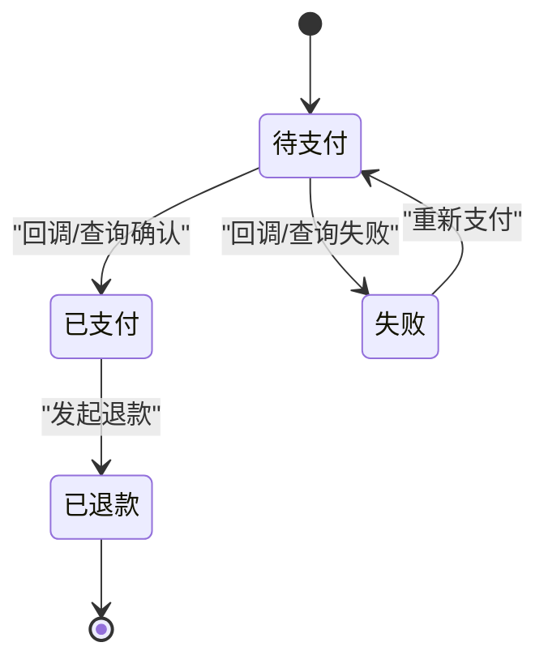
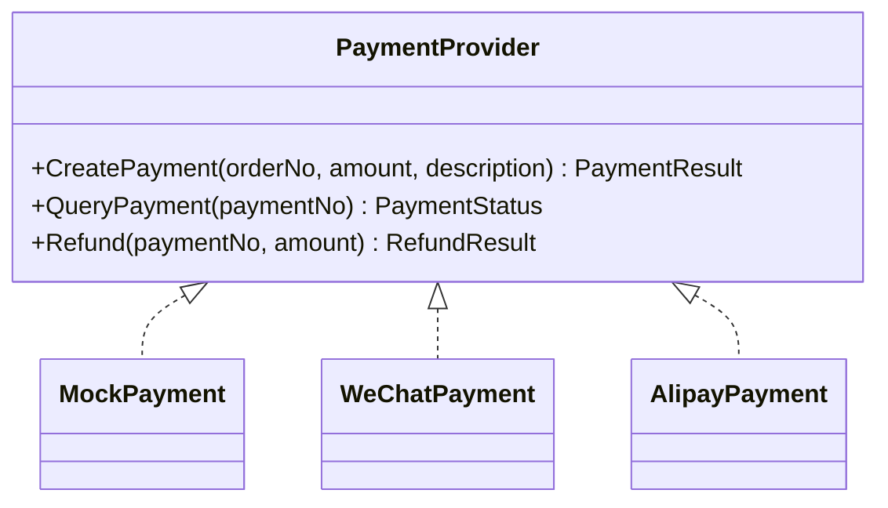
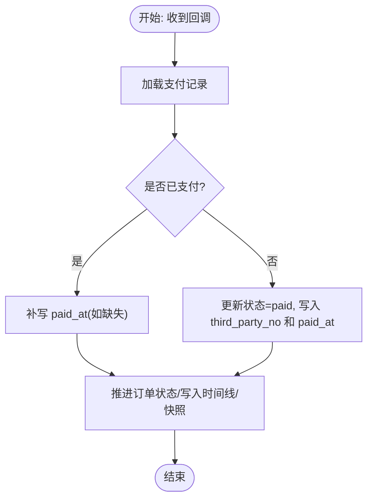
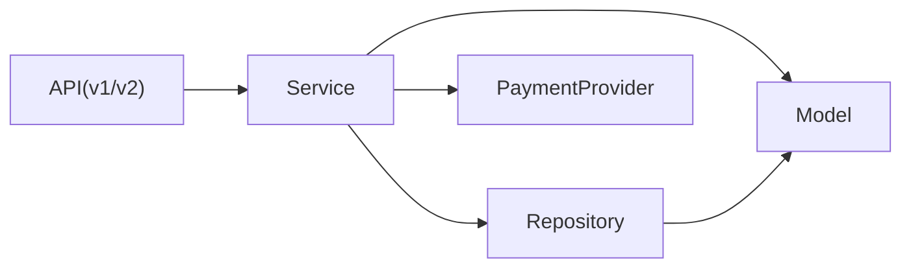

# 支付处理表

<cite>
**本文档引用的文件**
- [001_init_schema.sql](file://backend/migrations/001_init_schema.sql)
- [002_seed_data.sql](file://backend/migrations/002_seed_data.sql)
- [models.go](file://backend/internal/model/models.go)
- [payment_repo.go](file://backend/internal/repository/payment_repo.go)
- [payment_service.go](file://backend/internal/service/payment_service.go)
- [payment.go](file://backend/internal/pkg/payment/payment.go)
- [providers.go](file://backend/internal/pkg/payment/providers.go)
- [handler.go (v1)](file://backend/internal/api/v1/payment/handler.go)
- [handler.go (v2)](file://backend/internal/api/v2/payment/handler.go)
</cite>

## 目录
1. [简介](#简介)
2. [项目结构](#项目结构)
3. [核心组件](#核心组件)
4. [架构总览](#架构总览)
5. [详细组件分析](#详细组件分析)
6. [依赖分析](#依赖分析)
7. [性能考虑](#性能考虑)
8. [故障排查指南](#故障排查指南)
9. [结论](#结论)

## 简介
本文件聚焦于无人机租赁平台的支付处理系统，围绕 Payment 支付表进行深入的表结构设计与业务流程解析。内容涵盖：
- 支付表核心字段的业务含义与约束
- 支付状态流转机制（pending → paid / failed / refunded）
- 第三方支付对接的数据结构与验证要点
- 支付回调处理的数据持久化策略（含 PaidAt 的精确记录与幂等性）
- 异常处理、重复支付防护与支付数据审计等安全机制的表结构支撑

## 项目结构
支付处理涉及后端三层结构与数据库迁移脚本：
- 数据库层：迁移脚本定义 payments 表及索引
- 模型层：Go 结构体映射 payments 表
- 仓储层：对 payments 表的增删改查封装
- 服务层：支付创建、回调处理、退款、状态推进等核心业务
- 接口层：v1/v2 提供支付创建、回调、查询、退款等 API
- 支付通道：Mock/WeChat/Alipay 三种 Provider 实现

图表来源
- [001_init_schema.sql:200-218](file://backend/migrations/001_init_schema.sql#L200-L218)
- [models.go:515-532](file://backend/internal/model/models.go#L515-L532)
- [payment_repo.go:9-59](file://backend/internal/repository/payment_repo.go#L9-L59)
- [payment_service.go:15-45](file://backend/internal/service/payment_service.go#L15-L45)
- [handler.go (v1):13-19](file://backend/internal/api/v1/payment/handler.go#L13-L19)
- [handler.go (v2):15-25](file://backend/internal/api/v2/payment/handler.go#L15-L25)

章节来源
- [001_init_schema.sql:200-218](file://backend/migrations/001_init_schema.sql#L200-L218)
- [models.go:515-532](file://backend/internal/model/models.go#L515-L532)

## 核心组件
- 支付表（payments）：承载支付流水、金额、状态、第三方交易号、支付时间等关键信息
- 支付模型（model.Payment）：与数据库表字段一一对应，便于 ORM 映射
- 支付仓储（repository.PaymentRepo）：提供按支付单号、订单号、用户维度的查询与更新能力
- 支付服务（service.PaymentService）：编排支付创建、回调处理、状态推进、自动派单、退款等流程
- 支付接口（v1/v2 Handler）：对外暴露支付创建、回调、查询、退款等 API
- 支付通道（Mock/WeChat/Alipay）：抽象统一的支付接口，支持多种第三方支付

章节来源
- [models.go:515-532](file://backend/internal/model/models.go#L515-L532)
- [payment_repo.go:9-59](file://backend/internal/repository/payment_repo.go#L9-L59)
- [payment_service.go:15-45](file://backend/internal/service/payment_service.go#L15-L45)
- [payment.go:11-31](file://backend/internal/pkg/payment/payment.go#L11-L31)
- [providers.go:31-145](file://backend/internal/pkg/payment/providers.go#L31-L145)

## 架构总览
支付回调处理的关键路径如下：

图表来源
- [handler.go (v1):59-85](file://backend/internal/api/v1/payment/handler.go#L59-L85)
- [handler.go (v2):27-82](file://backend/internal/api/v2/payment/handler.go#L27-L82)
- [payment_service.go:94-214](file://backend/internal/service/payment_service.go#L94-L214)
- [payment_repo.go:21-39](file://backend/internal/repository/payment_repo.go#L21-L39)

## 详细组件分析

### 支付表（payments）字段设计与约束
- 字段与约束
  - payment_no：唯一索引，作为支付流水号，全局唯一
  - order_id：索引，关联订单
  - user_id：索引，关联用户
  - payment_type：默认“order”，支持“order”、“deposit”、“refund”、“withdrawal”
  - payment_method：默认“mock”，支持“wechat”、“alipay”、“mock”
  - amount：金额（分），默认 0
  - status：默认“pending”，支持“pending”、“paid”、“failed”、“refunded”
  - third_party_no：第三方交易号，默认空字符串
  - paid_at：支付完成时间，允许为空
  - created_at/updated_at：时间戳，带毫秒精度

- 业务含义
  - 支付流水号（PaymentNo）：全局唯一标识一次支付行为，便于对账与追踪
  - 订单关联（OrderID）：明确支付所对应的业务订单
  - 用户关联（UserID）：确保支付权限校验与用户侧账单展示
  - 支付类型（PaymentType）：区分订单支付、押金、退款、提现等场景
  - 支付方式（PaymentMethod）：记录使用的第三方支付渠道
  - 金额（Amount）：以“分”为单位，避免浮点误差
  - 状态（Status）：驱动后续流程（如订单状态推进、自动派单）
  - 第三方交易号（ThirdPartyNo）：存储第三方平台的交易号，用于对账与查询
  - 支付时间（PaidAt）：精确记录支付完成时刻，用于统计与审计

- 约束与索引
  - 唯一索引：payment_no，保证支付单号唯一
  - 索引：order_id、user_id、status，提升查询与统计效率

章节来源
- [001_init_schema.sql:200-218](file://backend/migrations/001_init_schema.sql#L200-L218)
- [models.go:515-532](file://backend/internal/model/models.go#L515-L532)
- [002_seed_data.sql:92-98](file://backend/migrations/002_seed_data.sql#L92-L98)

### 支付状态流转机制
- 初始状态：pending（待支付）
- 成功支付：paid（已支付），记录 third_party_no 与 paid_at
- 失败或异常：failed（失败），可在业务上支持重试或退款
- 退款：refunded（已退款），由退款流程触发并回写状态

图表来源
- [payment_service.go:166-214](file://backend/internal/service/payment_service.go#L166-L214)
- [002_seed_data.sql:92-98](file://backend/migrations/002_seed_data.sql#L92-L98)

### 第三方支付对接的数据结构设计
- 支付创建
  - 生成 PaymentNo（服务端生成，唯一）
  - 调用具体 Provider（WeChat/Alipay/Mock）创建支付，返回 PayParams（客户端 SDK 参数）
  - 在本地创建 Payment 记录，初始状态 pending
- 回调通知
  - WeChat/Alipay 回调携带 payment_no 与 third_party_no
  - 服务端幂等处理：若已为 paid，则直接返回成功
  - 更新 Payment 的状态、third_party_no、paid_at，并推进订单状态
- 查询与退款
  - 提供 QueryPayment 与 Refund 接口，支持对账与异常处理

图表来源
- [payment.go:11-31](file://backend/internal/pkg/payment/payment.go#L11-L31)
- [providers.go:31-145](file://backend/internal/pkg/payment/providers.go#L31-L145)
- [providers.go:160-248](file://backend/internal/pkg/payment/providers.go#L160-L248)

章节来源
- [payment.go:11-31](file://backend/internal/pkg/payment/payment.go#L11-L31)
- [providers.go:31-145](file://backend/internal/pkg/payment/providers.go#L31-L145)
- [providers.go:160-248](file://backend/internal/pkg/payment/providers.go#L160-L248)

### 支付回调处理的数据持久化与幂等性
- 幂等性保障
  - 先查询 Payment 是否已为 paid；若是，直接返回成功，避免重复处理
  - 使用数据库事务包裹回调处理逻辑，确保 Payment 更新与订单推进的一致性
- PaidAt 精确记录
  - 首次支付成功时，写入当前时间作为 paid_at
  - 若 Payment 已 paid 但 paid_at 为空，补写 paid_at 后再推进订单
- 订单状态推进
  - 根据执行模式（自执行/调度池）推进订单至相应状态
  - 写入订单时间线与快照，确保审计与可追溯

图表来源
- [payment_service.go:94-214](file://backend/internal/service/payment_service.go#L94-L214)
- [payment_repo.go:21-39](file://backend/internal/repository/payment_repo.go#L21-L39)

章节来源
- [payment_service.go:94-214](file://backend/internal/service/payment_service.go#L94-L214)
- [payment_repo.go:21-39](file://backend/internal/repository/payment_repo.go#L21-L39)

### 异常处理、重复支付防护与审计
- 重复支付防护
  - 回调入口检查 Payment 状态，若已是 paid，直接返回成功
  - 事务内处理，避免并发导致的状态不一致
- 异常处理
  - 回调失败时，保持 Payment 状态不变，等待重试或人工介入
  - 记录退款失败日志，定位问题并保留退款记录状态
- 审计与统计
  - 支付表与订单时间线共同构成审计基础
  - 索引覆盖 order_id、user_id、status，便于快速统计与报表

章节来源
- [payment_service.go:94-143](file://backend/internal/service/payment_service.go#L94-L143)
- [payment_service.go:216-342](file://backend/internal/service/payment_service.go#L216-L342)
- [001_init_schema.sql:200-218](file://backend/migrations/001_init_schema.sql#L200-L218)

## 依赖分析
- 模块耦合
  - Handler 依赖 Service
  - Service 依赖 Repo、Model、Provider
  - Repo 依赖 Model 与数据库
- 外部依赖
  - WeChat/Alipay Provider 仅在生产环境启用，开发阶段使用 Mock
- 可能的循环依赖
  - 当前结构清晰，未发现循环依赖

图表来源
- [handler.go (v1):13-19](file://backend/internal/api/v1/payment/handler.go#L13-L19)
- [handler.go (v2):15-25](file://backend/internal/api/v2/payment/handler.go#L15-L25)
- [payment_service.go:15-45](file://backend/internal/service/payment_service.go#L15-L45)
- [payment_repo.go:9-19](file://backend/internal/repository/payment_repo.go#L9-L19)
- [models.go:515-532](file://backend/internal/model/models.go#L515-L532)
- [payment.go:11-31](file://backend/internal/pkg/payment/payment.go#L11-L31)

## 性能考虑
- 索引优化
  - 对 payment_no（唯一）、order_id、user_id、status 建立索引，满足高频查询与统计
- 批量与分页
  - 支持按用户分页查询支付历史，避免一次性加载过多数据
- 事务边界
  - 回调处理使用事务，减少中间态，提高一致性与性能

章节来源
- [001_init_schema.sql:200-218](file://backend/migrations/001_init_schema.sql#L200-L218)
- [payment_repo.go:41-59](file://backend/internal/repository/payment_repo.go#L41-L59)

## 故障排查指南
- 回调未生效
  - 检查 payment_no 是否正确传入
  - 确认 Payment 状态是否已为 paid（幂等保护会直接返回成功）
- PaidAt 为空
  - 若 Payment 已 paid 但 paid_at 为空，服务端会在推进订单时补写
- 退款失败
  - 查看退款记录状态与日志，确认第三方通道返回与签名配置
- 订单未推进
  - 检查执行模式与飞手资格，确保满足推进条件

章节来源
- [payment_service.go:94-214](file://backend/internal/service/payment_service.go#L94-L214)
- [payment_service.go:216-342](file://backend/internal/service/payment_service.go#L216-L342)

## 结论
本文档基于现有代码与迁移脚本，系统梳理了支付表的字段设计、状态流转、第三方对接、回调处理与安全机制。通过唯一索引、幂等处理、事务边界与审计索引，支付处理具备良好的一致性与可追溯性。建议在生产环境完善 WeChat/Alipay 的签名验证与回调校验，确保数据安全与对账准确。