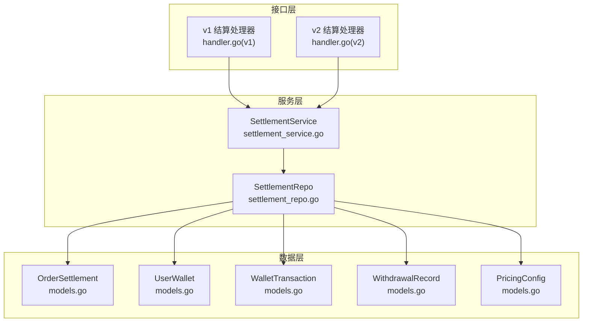
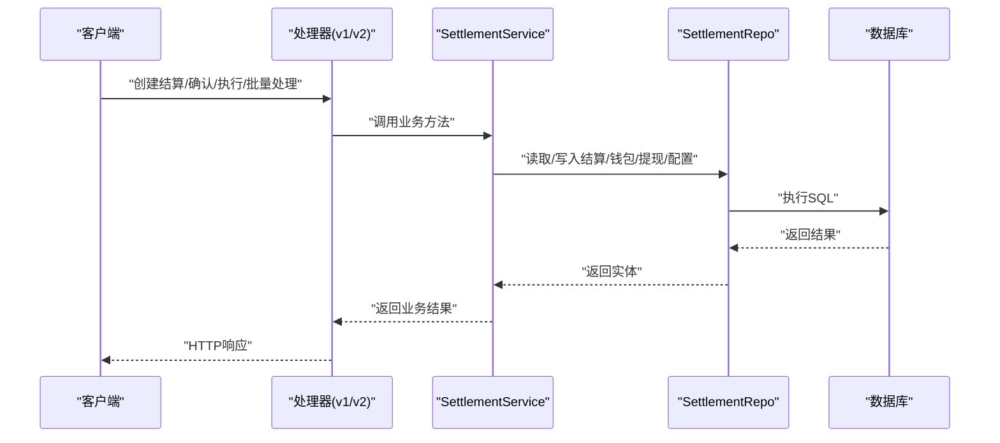
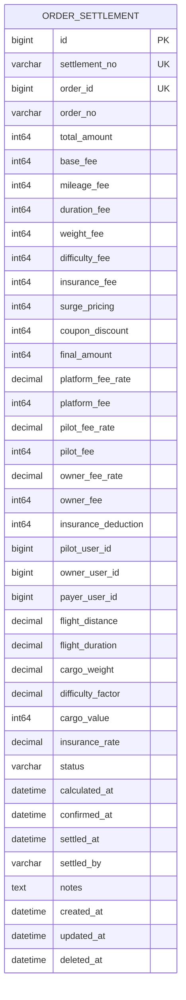
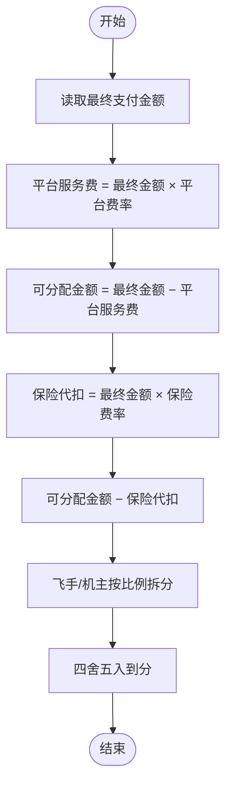
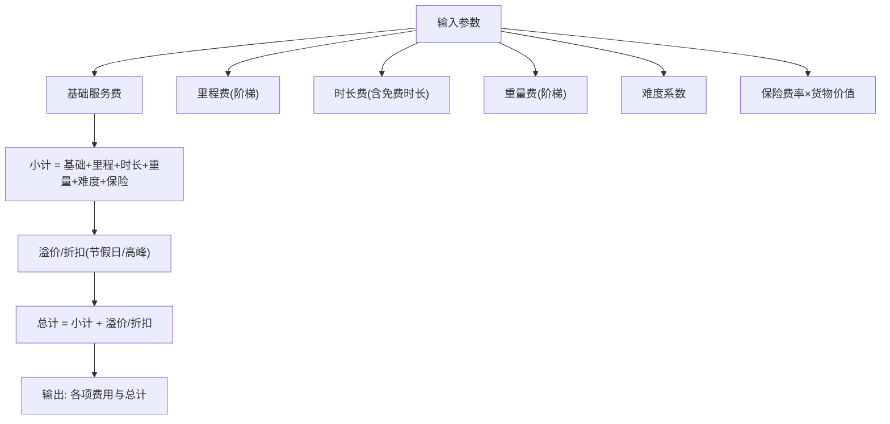
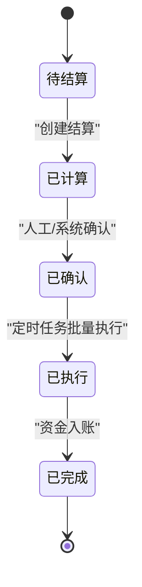
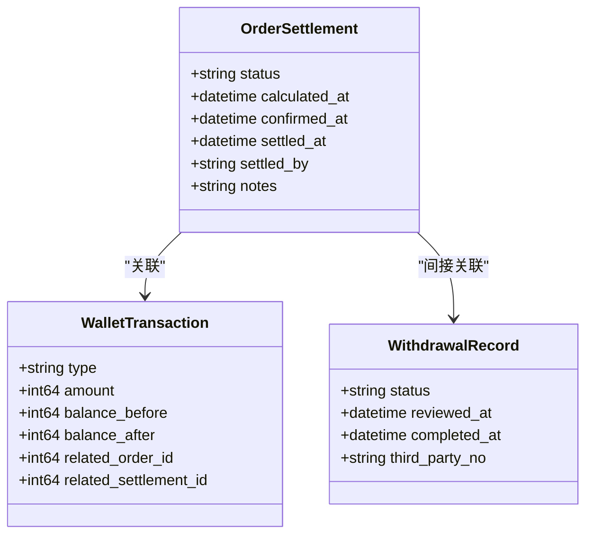
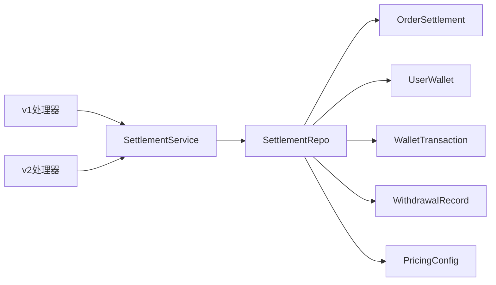

# 结算分账表

<cite>
**本文引用的文件**
- [011_add_settlement_tables.sql](file://backend/migrations/011_add_settlement_tables.sql)
- [models.go](file://backend/internal/model/models.go)
- [settlement_repo.go](file://backend/internal/repository/settlement_repo.go)
- [settlement_service.go](file://backend/internal/service/settlement_service.go)
- [handler.go(v1)](file://backend/internal/api/v1/settlement/handler.go)
- [handler.go(v2)](file://backend/internal/api/v2/settlement/handler.go)
- [REFACTOR_TASK_TRACKER.md](file://REFACTOR_TASK_TRACKER.md)
</cite>

## 目录
1. [引言](#引言)
2. [项目结构](#项目结构)
3. [核心组件](#核心组件)
4. [架构总览](#架构总览)
5. [详细组件分析](#详细组件分析)
6. [依赖关系分析](#依赖关系分析)
7. [性能考量](#性能考量)
8. [故障排查指南](#故障排查指南)
9. [结论](#结论)
10. [附录](#附录)

## 引言
本文件面向无人机租赁平台的结算分账系统，围绕“结算表”展开，系统性梳理以下内容：
- Settlement结算表的结构设计：结算周期管理、平台收益、机主收入、飞手分成、保险代扣等核心业务数据的存储结构
- 结算分账算法实现：平台佣金率、机主分成比例、飞手服务费、手续费与税费的计算公式与数据存储
- 结算周期管理机制：日结、周结、月结等周期的数据结构设计与自动化执行支撑
- 对账与状态管理：结算明细、账务调整、差异处理、最终确认与异常处理（退款冲正、账务更正）

## 项目结构
结算分账系统由三层组成：
- 数据层：订单结算表、钱包表、钱包流水表、提现记录表、定价配置表
- 服务层：定价引擎、结算引擎、钱包操作、提现流程、批量结算
- 接口层：v1/v2 API处理器，提供对外接口与管理员后台能力

**图表来源**
- [handler.go(v1):1-369](file://backend/internal/api/v1/settlement/handler.go#L1-L369)
- [handler.go(v2):1-99](file://backend/internal/api/v2/settlement/handler.go#L1-L99)
- [settlement_service.go:1-538](file://backend/internal/service/settlement_service.go#L1-L538)
- [settlement_repo.go:1-336](file://backend/internal/repository/settlement_repo.go#L1-L336)
- [models.go:1928-2060](file://backend/internal/model/models.go#L1928-L2060)

**章节来源**
- [handler.go(v1):1-369](file://backend/internal/api/v1/settlement/handler.go#L1-L369)
- [handler.go(v2):1-99](file://backend/internal/api/v2/settlement/handler.go#L1-L99)
- [settlement_service.go:1-538](file://backend/internal/service/settlement_service.go#L1-L538)
- [settlement_repo.go:1-336](file://backend/internal/repository/settlement_repo.go#L1-L336)
- [models.go:1928-2060](file://backend/internal/model/models.go#L1928-L2060)

## 核心组件
- 订单结算表（OrderSettlement）：承载一次订单的结算结果，含金额明细、分账明细、参与方、定价参数、状态与时间戳
- 用户钱包表（UserWallet）：记录用户各类钱包余额与累计收支
- 钱包流水表（WalletTransaction）：记录钱包的每笔交易流水
- 提现记录表（WithdrawalRecord）：记录提现申请、审批、执行与失败状态
- 定价配置表（PricingConfig）：集中管理定价参数与分账比例

**章节来源**
- [011_add_settlement_tables.sql:6-62](file://backend/migrations/011_add_settlement_tables.sql#L6-L62)
- [models.go:1928-2060](file://backend/internal/model/models.go#L1928-L2060)

## 架构总览
结算流程分为“定价—分账—确认—执行—入账—提现”的闭环，支持批量处理与管理员干预。

**图表来源**
- [handler.go(v1):73-156](file://backend/internal/api/v1/settlement/handler.go#L73-L156)
- [handler.go(v2):29-60](file://backend/internal/api/v2/settlement/handler.go#L29-L60)
- [settlement_service.go:219-346](file://backend/internal/service/settlement_service.go#L219-L346)
- [settlement_repo.go:22-46](file://backend/internal/repository/settlement_repo.go#L22-L46)

## 详细组件分析

### Settlement结算表结构设计
- 金额明细：订单总额、基础服务费、里程费、时长费、重量费、难度附加费、保险费、溢价/折扣、优惠券折扣、最终支付金额
- 分账明细：平台费率、平台服务费、飞手分成比例、飞手劳务费、机主分成比例、机主设备费、保险费代扣
- 参与方：飞手用户ID、机主用户ID、付款方用户ID
- 定价参数：飞行距离、飞行时长、货物重量、难度系数、货物申报价值、保险费率
- 状态管理：pending/calculated/confirmed/settled/disputed，以及各阶段的时间戳与操作人
- 外键与索引：订单唯一、状态/用户索引，便于查询与审计

**图表来源**
- [011_add_settlement_tables.sql:6-62](file://backend/migrations/011_add_settlement_tables.sql#L6-L62)
- [models.go:1928-1981](file://backend/internal/model/models.go#L1928-L1981)

**章节来源**
- [011_add_settlement_tables.sql:6-62](file://backend/migrations/011_add_settlement_tables.sql#L6-L62)
- [models.go:1928-1981](file://backend/internal/model/models.go#L1928-L1981)

### 分账算法与数据存储
- 平台佣金率（PlatformCommissionRate）与平台服务费：按最终支付金额乘以平台费率计算
- 机主分成比例与飞手分成比例：可配置；分账时先扣除平台费用与保险代扣，剩余按比例拆分
- 保险费代扣：按最终支付金额乘以保险费率计算
- 飞手与机主的分账：在可分配金额内按双方比例计算，保留整数分（四舍五入）

**图表来源**
- [settlement_service.go:233-248](file://backend/internal/service/settlement_service.go#L233-L248)

**章节来源**
- [settlement_service.go:233-248](file://backend/internal/service/settlement_service.go#L233-L248)

### 定价引擎与配置
- 定价输入：飞行距离、飞行时长、货物重量、货物价值、货物类型、任务类型、是否夜间飞行、是否高峰、是否节假日
- 计费项：
  - 基础服务费：默认值来自定价配置
  - 里程费：阶梯计价（0-5/5-15/15-50/50+ km）
  - 时长费：免费时长（默认10分钟），超出部分按单价计费
  - 重量费：按10kg为单位的阶梯计费
  - 难度系数：夜间飞行、紧急任务、巡检等场景叠加
  - 保险费率：普通/易碎/危险品不同等级
  - 高峰/节假日溢价：按子合计计算溢价
- 输出：各项费用、小计、溢价/折扣、总计

**图表来源**
- [settlement_service.go:56-101](file://backend/internal/service/settlement_service.go#L56-L101)
- [settlement_service.go:103-215](file://backend/internal/service/settlement_service.go#L103-L215)

**章节来源**
- [settlement_service.go:27-53](file://backend/internal/service/settlement_service.go#L27-L53)
- [settlement_service.go:56-101](file://backend/internal/service/settlement_service.go#L56-L101)
- [settlement_service.go:103-215](file://backend/internal/service/settlement_service.go#L103-L215)

### 结算周期管理机制
- 日结：按自然日汇总待结算订单，定时任务批量执行
- 周结/月结：可扩展为按周/月聚合，统一走“确认→执行→入账”流程
- 自动化支撑：定时任务扫描“已确认”状态的结算，自动执行入账并推进状态

**图表来源**
- [settlement_service.go:287-301](file://backend/internal/service/settlement_service.go#L287-L301)
- [settlement_service.go:303-346](file://backend/internal/service/settlement_service.go#L303-L346)
- [settlement_service.go:500-519](file://backend/internal/service/settlement_service.go#L500-L519)

**章节来源**
- [settlement_service.go:287-301](file://backend/internal/service/settlement_service.go#L287-L301)
- [settlement_service.go:303-346](file://backend/internal/service/settlement_service.go#L303-L346)
- [settlement_service.go:500-519](file://backend/internal/service/settlement_service.go#L500-L519)

### 对账与状态管理
- 状态链路：pending → calculated → confirmed → settled → disputed（如有争议）
- 时间戳：计算、确认、执行时间，便于对账与审计
- 对账要点：结算明细与钱包流水一致、保险代扣与实际代付一致、提现与冻结/解冻/扣减一致
- 差异处理：支持管理员手动调整与重跑结算

**图表来源**
- [models.go:1928-1981](file://backend/internal/model/models.go#L1928-L1981)
- [models.go:2009-2022](file://backend/internal/model/models.go#L2009-L2022)
- [models.go:2029-2060](file://backend/internal/model/models.go#L2029-L2060)

**章节来源**
- [models.go:1928-1981](file://backend/internal/model/models.go#L1928-L1981)
- [models.go:2009-2022](file://backend/internal/model/models.go#L2009-L2022)
- [models.go:2029-2060](file://backend/internal/model/models.go#L2029-L2060)

### 异常处理与退款冲正
- 退款冲正：若发生退款，需在退款记录与结算状态中体现，避免重复结算或重复入账
- 账务更正：管理员可对异常结算进行调整，重新执行或撤销
- 提现异常：提现失败需解冻余额并记录失败原因

**章节来源**
- [settlement_service.go:411-462](file://backend/internal/service/settlement_service.go#L411-L462)

## 依赖关系分析
- API处理器依赖服务层；服务层依赖仓库层；仓库层直接操作模型与数据库
- 定价配置集中管理，服务层通过仓库读取配置，保证一致性
- 结算状态驱动钱包入账与提现流程

**图表来源**
- [handler.go(v1):1-369](file://backend/internal/api/v1/settlement/handler.go#L1-L369)
- [handler.go(v2):1-99](file://backend/internal/api/v2/settlement/handler.go#L1-L99)
- [settlement_service.go:1-538](file://backend/internal/service/settlement_service.go#L1-L538)
- [settlement_repo.go:1-336](file://backend/internal/repository/settlement_repo.go#L1-L336)
- [models.go:1928-2060](file://backend/internal/model/models.go#L1928-L2060)

**章节来源**
- [handler.go(v1):1-369](file://backend/internal/api/v1/settlement/handler.go#L1-L369)
- [handler.go(v2):1-99](file://backend/internal/api/v2/settlement/handler.go#L1-L99)
- [settlement_service.go:1-538](file://backend/internal/service/settlement_service.go#L1-L538)
- [settlement_repo.go:1-336](file://backend/internal/repository/settlement_repo.go#L1-L336)
- [models.go:1928-2060](file://backend/internal/model/models.go#L1928-L2060)

## 性能考量
- 索引优化：结算表按状态、飞手/机主/付款方用户ID建立索引，提升查询效率
- 批量处理：定时任务批量执行结算，降低峰值压力
- 事务一致性：钱包入账与流水记录在同一事务内完成，确保原子性
- 配置缓存：定价配置读取可做短期缓存，减少数据库访问

## 故障排查指南
- 结算无法创建：检查订单是否存在、最终金额是否为正、分账比例配置是否有效
- 结算无法确认/执行：检查状态是否为“已计算/已确认”，并查看日志
- 钱包入账失败：检查钱包状态、余额与冻结余额，确认事务回滚是否正确
- 提现异常：检查提现状态流转、手续费计算、第三方流水号与解冻/扣减是否匹配

**章节来源**
- [settlement_service.go:287-346](file://backend/internal/service/settlement_service.go#L287-L346)
- [settlement_repo.go:114-146](file://backend/internal/repository/settlement_repo.go#L114-L146)
- [settlement_repo.go:148-242](file://backend/internal/repository/settlement_repo.go#L148-L242)
- [settlement_repo.go:272-284](file://backend/internal/repository/settlement_repo.go#L272-L284)

## 结论
本结算分账系统以“订单结算表”为核心，结合定价引擎与分账算法，实现了平台、飞手、机主的清晰收益分配，并通过钱包与提现模块完成资金闭环。通过状态机与定时任务支撑，系统具备良好的自动化与可运维性。建议后续扩展结算周期（日/周/月）与对账工具，进一步完善对账与差异处理能力。

## 附录
- API端点概览（节选）：
  - v1：创建结算、确认结算、执行结算、批量处理、钱包查询、提现申请/审批等
  - v2：按订单获取结算摘要
- 任务清单参考：结算模块已实现“创建/确认/执行/批量处理”与钱包、提现全流程

**章节来源**
- [REFACTOR_TASK_TRACKER.md:557-589](file://REFACTOR_TASK_TRACKER.md#L557-L589)
- [handler.go(v1):34-369](file://backend/internal/api/v1/settlement/handler.go#L34-L369)
- [handler.go(v2):29-60](file://backend/internal/api/v2/settlement/handler.go#L29-L60)