# 财务结算表

<cite>
**本文档引用的文件**
- [models.go](file://backend/internal/model/models.go)
- [011_add_settlement_tables.sql](file://backend/migrations/011_add_settlement_tables.sql)
- [012_add_credit_control_tables.sql](file://backend/migrations/012_add_credit_control_tables.sql)
- [settlement_service.go](file://backend/internal/service/settlement_service.go)
- [settlement_repo.go](file://backend/internal/repository/settlement_repo.go)
- [credit_service.go](file://backend/internal/service/credit_service.go)
- [credit_repo.go](file://backend/internal/repository/credit_repo.go)
- [payment_service.go](file://backend/internal/service/payment_service.go)
- [payment_repo.go](file://backend/internal/repository/payment_repo.go)
</cite>

## 目录
1. [项目概述](#项目概述)
2. [核心表结构设计](#核心表结构设计)
3. [支付流程表结构实现](#支付流程表结构实现)
4. [退款机制数据支撑](#退款机制数据支撑)
5. [结算分账逻辑表结构](#结算分账逻辑表结构)
6. [信用控制系统表结构](#信用控制系统表结构)
7. [架构关系图](#架构关系图)
8. [性能考虑](#性能考虑)
9. [故障排除指南](#故障排除指南)
10. [结论](#结论)

## 项目概述

本文档详细描述了无人机租赁平台的财务结算系统表结构设计，涵盖支付、退款、争议记录、结算和信用控制等核心财务模块。该系统采用分层架构设计，通过清晰的表结构和严格的业务逻辑确保财务数据的准确性、完整性和可追溯性。

## 核心表结构设计

### 支付相关表结构

#### Payment 支付表
支付表是财务结算系统的核心表，记录所有支付交易的详细信息：

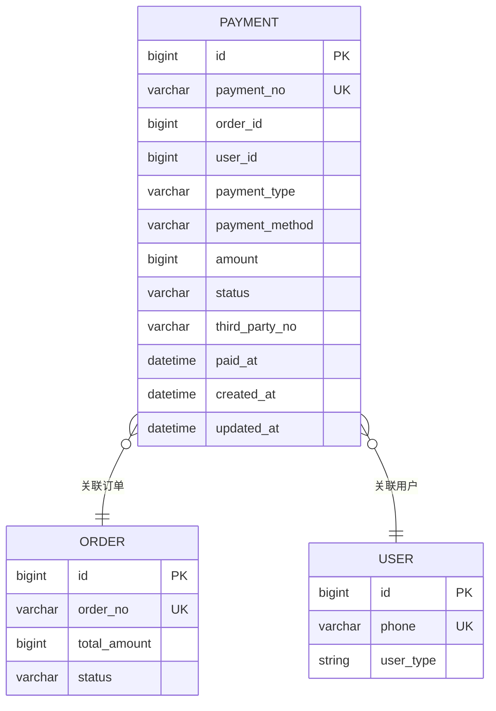

**图表来源**
- [models.go:515-532](file://backend/internal/model/models.go#L515-L532)
- [models.go:413-480](file://backend/internal/model/models.go#L413-L480)

#### Refund 退款表
退款表记录所有退款申请和处理过程：

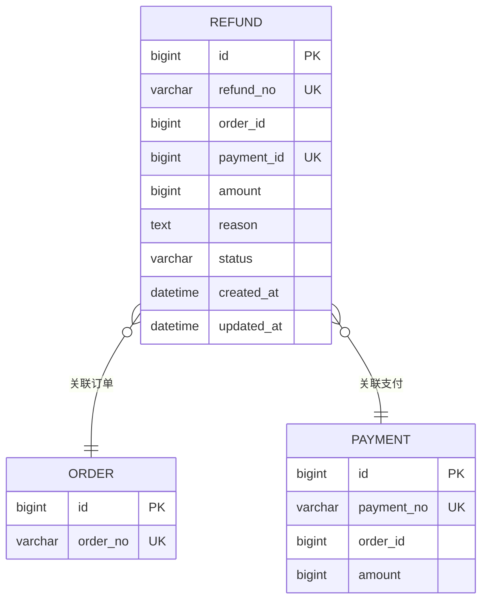

**图表来源**
- [models.go:534-551](file://backend/internal/model/models.go#L534-L551)

#### DisputeRecord 争议记录表
争议记录表用于追踪和管理用户间的争议：

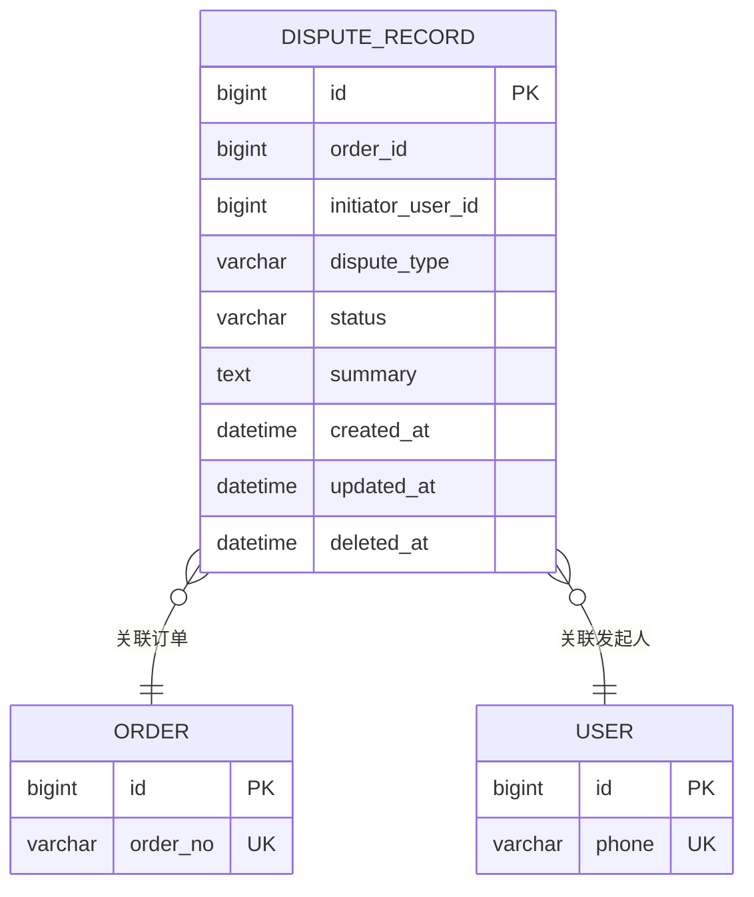

**图表来源**
- [models.go:553-570](file://backend/internal/model/models.go#L553-L570)

### 结算相关表结构

#### OrderSettlement 订单结算表
订单结算表记录每个订单的最终结算结果：

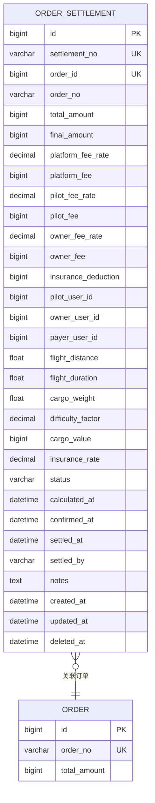

**图表来源**
- [models.go:1927-1981](file://backend/internal/model/models.go#L1927-L1981)

#### UserWallet 用户钱包表
用户钱包表管理用户的资金账户：

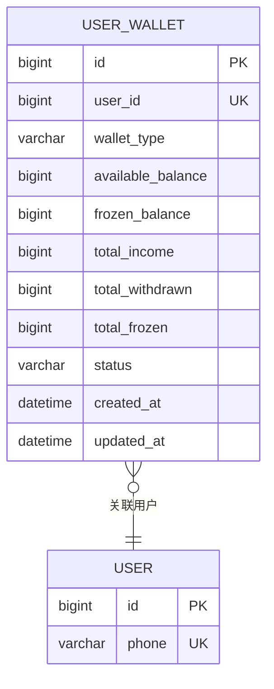

**图表来源**
- [models.go:1987-2002](file://backend/internal/model/models.go#L1987-L2002)

#### WalletTransaction 钱包流水表
钱包流水表记录所有资金流动的详细记录：

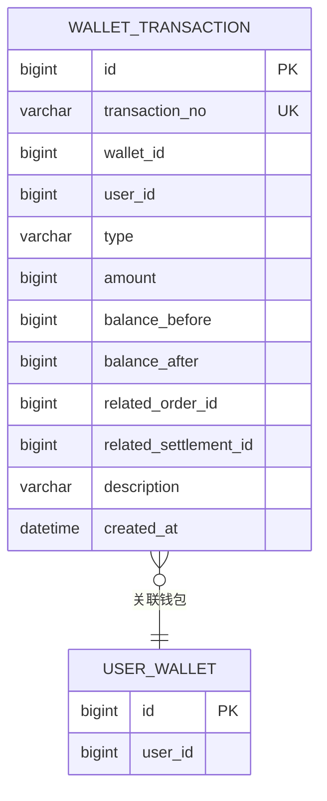

**图表来源**
- [models.go:2008-2026](file://backend/internal/model/models.go#L2008-L2026)

#### WithdrawalRecord 提现记录表
提现记录表管理用户的提现申请和处理：

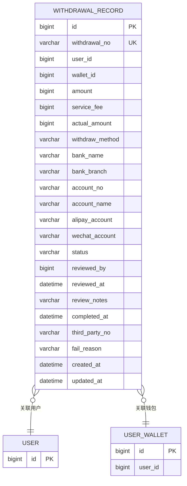

**图表来源**
- [models.go:2028-2064](file://backend/internal/model/models.go#L2028-L2064)

#### PricingConfig 定价配置表
定价配置表存储所有定价参数和规则：

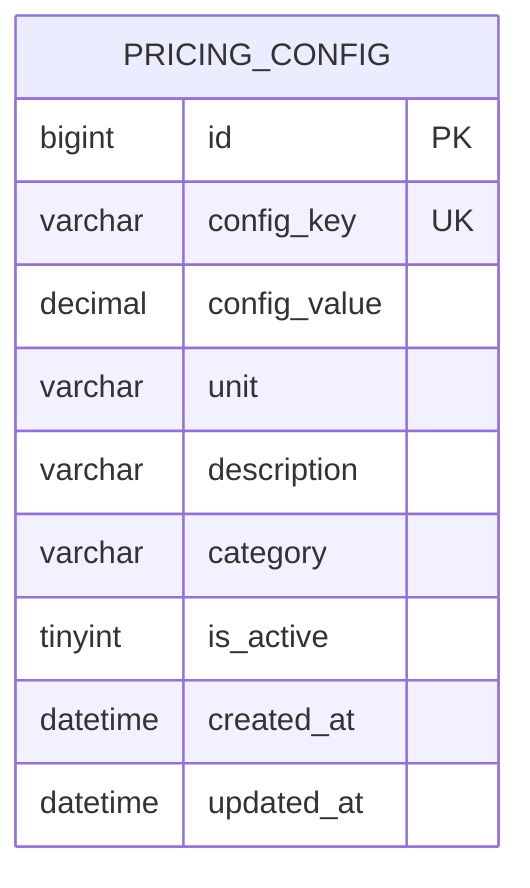

**图表来源**
- [models.go:2066-2081](file://backend/internal/model/models.go#L2066-L2081)

### 信用控制相关表结构

#### CreditScore 信用评分表
信用评分表记录用户的综合信用状况：

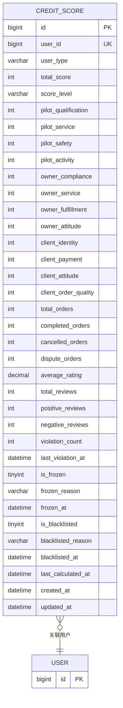

**图表来源**
- [models.go:2087-2144](file://backend/internal/model/models.go#L2087-L2144)

#### CreditScoreLog 信用分变动日志表
信用分变动日志表记录信用分的所有变更历史：

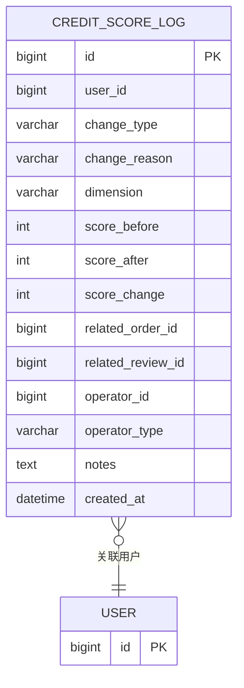

**图表来源**
- [models.go:2146-2166](file://backend/internal/model/models.go#L2146-L2166)

#### RiskControl 风控记录表
风控记录表管理风险控制的全过程：

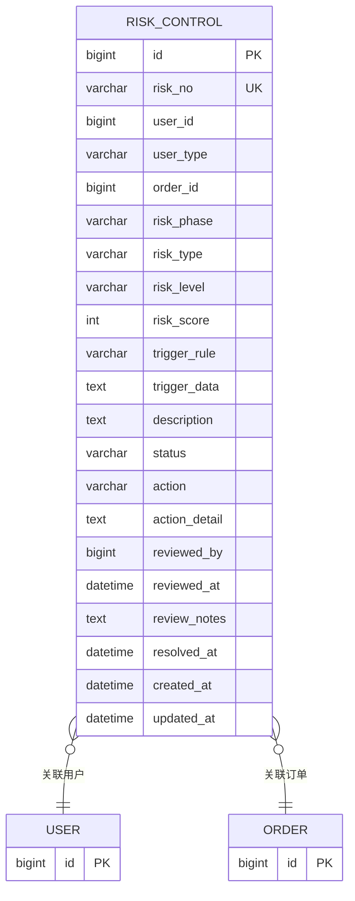

**图表来源**
- [models.go:2168-2201](file://backend/internal/model/models.go#L2168-L2201)

#### Violation 违规记录表
违规记录表管理用户的违规行为和处理：

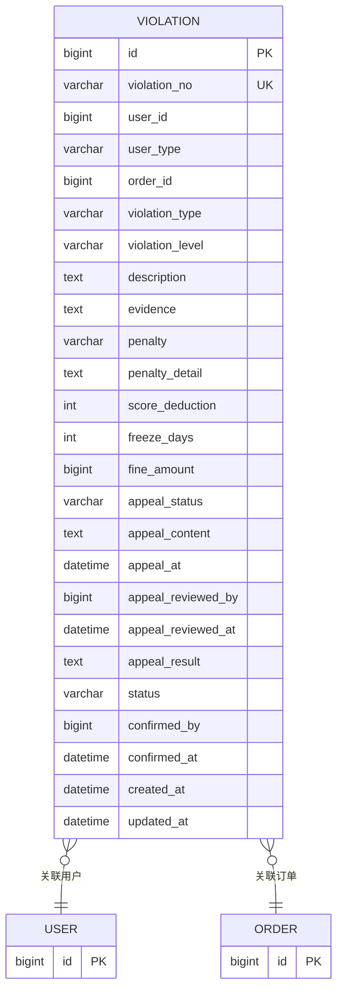

**图表来源**
- [models.go:2207-2250](file://backend/internal/model/models.go#L2207-L2250)

#### Blacklist 黑名单表
黑名单表管理被限制使用的用户：

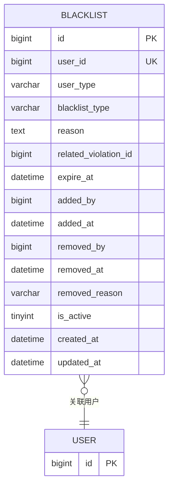

**图表来源**
- [models.go:2252-2275](file://backend/internal/model/models.go#L2252-L2275)

#### Deposit 保证金表
保证金表管理用户需要缴纳的保证金：

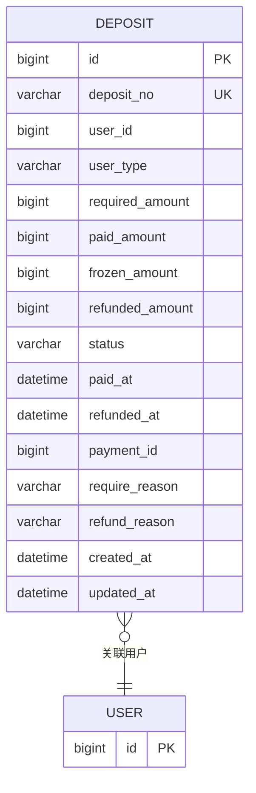

**图表来源**
- [models.go:2277-2304](file://backend/internal/model/models.go#L2277-L2304)

## 支付流程表结构实现

### 支付状态管理

支付流程通过Payment表的状态字段实现完整的生命周期管理：

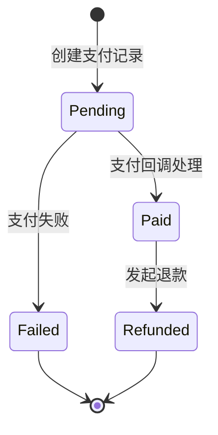

**图表来源**
- [models.go:523-527](file://backend/internal/model/models.go#L523-L527)

### 第三方支付对接

系统支持多种支付方式，通过Payment表的payment_method字段区分：

- WeChat Pay (微信支付)
- Alipay (支付宝)
- Mock (模拟支付)

### 支付回调处理

支付回调处理通过PaymentService的HandlePaymentCallback方法实现，确保支付状态的准确同步：

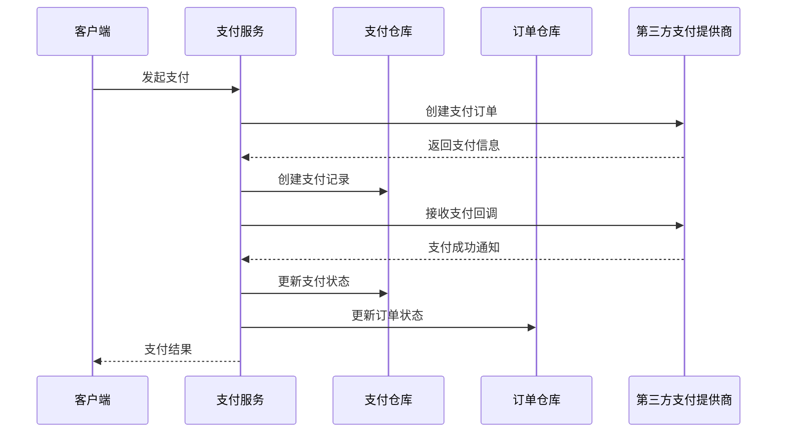

**图表来源**
- [payment_service.go:94-143](file://backend/internal/service/payment_service.go#L94-L143)

**章节来源**
- [payment_service.go:55-92](file://backend/internal/service/payment_service.go#L55-L92)
- [payment_repo.go:21-39](file://backend/internal/repository/payment_repo.go#L21-L39)

## 退款机制数据支撑

### 退款原因分类

退款系统通过Refund表的reason字段支持多种退款原因：

- 订单取消
- 服务不满意
- 产品质量问题
- 运输损坏
- 其他原因

### 退款状态跟踪

退款流程通过状态字段实现完整的跟踪管理：

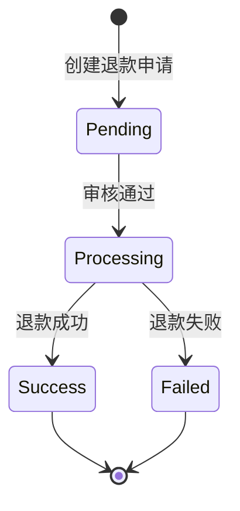

**图表来源**
- [models.go:541-543](file://backend/internal/model/models.go#L541-L543)

### 退款金额计算

退款金额计算遵循以下规则：
- 支付金额按比例退回
- 手续费从退款金额中扣除
- 保险费用按比例退还
- 争议退款需要额外审核流程

**章节来源**
- [payment_service.go:216-342](file://backend/internal/service/payment_service.go#L216-L342)

## 结算分账逻辑表结构

### 平台佣金分配

订单结算时，平台佣金按照预设比例自动计算：

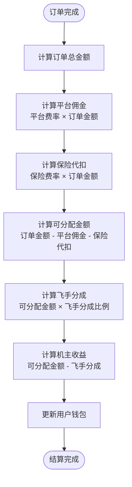

**图表来源**
- [settlement_service.go:219-285](file://backend/internal/service/settlement_service.go#L219-L285)

### 飞手分成规则

飞手分成基于以下因素计算：
- 订单总金额
- 飞手服务质量和信誉
- 飞行难度系数
- 服务时长和距离

### 机主设备费用

机主设备费用计算考虑：
- 无人机使用时长
- 飞行距离
- 无人机价值折旧
- 平台服务费用

**章节来源**
- [settlement_service.go:219-346](file://backend/internal/service/settlement_service.go#L219-L346)
- [settlement_repo.go:114-146](file://backend/internal/repository/settlement_repo.go#L114-L146)

## 信用控制系统表结构

### 信用额度管理

信用控制系统通过CreditScore表实现动态信用额度管理：

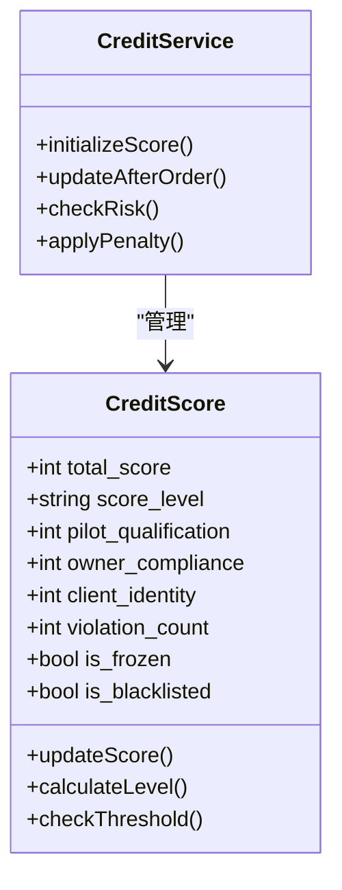

**图表来源**
- [credit_service.go:36-131](file://backend/internal/service/credit_service.go#L36-L131)
- [models.go:2087-2144](file://backend/internal/model/models.go#L2087-L2144)

### 风险控制阈值

系统设置多层风险控制阈值：

| 风险级别 | 信用分范围 | 风险评分 | 处置措施 |
|---------|-----------|----------|----------|
| Excellent | 800-1000 | 0-25 | 无限制 |
| Good | 700-799 | 26-50 | 正常交易 |
| Normal | 600-699 | 51-75 | 限制交易 |
| Poor | 400-599 | 76-90 | 冻结账户 |
| Bad | 0-399 | 91-100 | 永久黑名单 |

### 违规记录管理

违规记录通过Violation表实现分级管理：

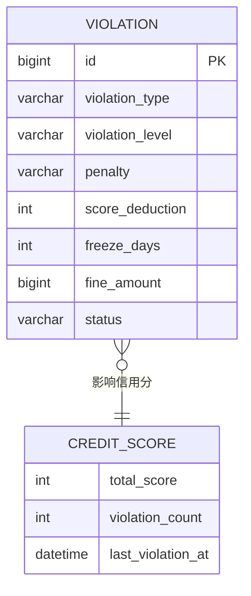

**图表来源**
- [models.go:2207-2250](file://backend/internal/model/models.go#L2207-L2250)

**章节来源**
- [credit_service.go:242-345](file://backend/internal/service/credit_service.go#L242-L345)
- [credit_repo.go:23-52](file://backend/internal/repository/credit_repo.go#L23-L52)

## 架构关系图

### 数据库表关系图

```mermaid
erDiagram
%% 支付相关表
PAYMENT {
bigint id PK
bigint order_id
bigint user_id
varchar status
}
REFUND {
bigint id PK
bigint order_id
bigint payment_id UK
varchar status
}
DISPUTE_RECORD {
bigint id PK
bigint order_id
bigint initiator_user_id
varchar status
}
%% 结算相关表
ORDER_SETTLEMENT {
bigint id PK
bigint order_id UK
varchar status
bigint pilot_user_id
bigint owner_user_id
bigint payer_user_id
}
USER_WALLET {
bigint id PK
bigint user_id UK
varchar status
}
WALLET_TRANSACTION {
bigint id PK
bigint wallet_id
varchar type
}
WITHDRAWAL_RECORD {
bigint id PK
bigint user_id
varchar status
}
%% 信用控制表
CREDIT_SCORE {
bigint id PK
bigint user_id UK
varchar score_level
}
CREDIT_SCORE_LOG {
bigint id PK
bigint user_id
varchar change_type
}
RISK_CONTROL {
bigint id PK
bigint user_id
varchar risk_level
}
VIOLATION {
bigint id PK
bigint user_id
varchar violation_level
}
BLACKLIST {
bigint id PK
bigint user_id UK
varchar blacklist_type
}
DEPOSIT {
bigint id PK
bigint user_id
varchar status
}
%% 关系定义
PAYMENT }o--|| ORDER_SETTLEMENT : "退款关联"
REFUND }o--|| PAYMENT : "退款关联"
DISPUTE_RECORD }o--|| ORDER_SETTLEMENT : "争议关联"
ORDER_SETTLEMENT }o--|| USER_WALLET : "收益分配"
WALLET_TRANSACTION }o--|| USER_WALLET : "流水记录"
WITHDRAWAL_RECORD }o--|| USER_WALLET : "提现关联"
CREDIT_SCORE }o--|| CREDIT_SCORE_LOG : "变更记录"
RISK_CONTROL }o--|| CREDIT_SCORE : "风险评估"
VIOLATION }o--|| CREDIT_SCORE : "违规记录"
BLACKLIST }o--|| CREDIT_SCORE : "黑名单管理"
DEPOSIT }o--|| CREDIT_SCORE : "保证金管理"
```

**图表来源**
- [models.go:515-570](file://backend/internal/model/models.go#L515-L570)
- [models.go:1927-2064](file://backend/internal/model/models.go#L1927-L2064)
- [models.go:2087-2304](file://backend/internal/model/models.go#L2087-L2304)

## 性能考虑

### 索引优化策略

1. **高频查询字段索引**
   - Payment表：order_id, user_id, status
   - OrderSettlement表：order_id, status, pilot_user_id
   - UserWallet表：user_id, status
   - CreditScore表：user_id, score_level, is_frozen

2. **复合索引设计**
   - WalletTransaction表：user_id + type + created_at
   - RiskControl表：user_id + risk_level + status
   - Violation表：user_id + violation_level + status

### 查询性能优化

1. **分页查询**
   - 使用LIMIT和OFFSET实现大数据量分页
   - 通过索引优化排序性能

2. **连接查询优化**
   - 使用JOIN替代子查询
   - 通过适当的索引减少连接成本

3. **缓存策略**
   - 热门查询结果缓存
   - 配置参数缓存
   - 用户信用分缓存

## 故障排除指南

### 常见问题及解决方案

#### 支付回调处理失败

**问题症状**：支付成功但订单状态未更新

**排查步骤**：
1. 检查支付回调接口日志
2. 验证第三方支付平台回调签名
3. 确认数据库事务完整性
4. 检查订单状态转换逻辑

**解决方案**：
- 实现幂等性处理
- 添加重试机制
- 完善错误日志记录

#### 退款处理异常

**问题症状**：退款申请无法处理或处理失败

**排查步骤**：
1. 检查退款申请状态
2. 验证第三方支付平台退款接口
3. 确认订单支付状态
4. 检查退款金额计算逻辑

**解决方案**：
- 实现退款状态机
- 添加退款异常处理
- 完善退款通知机制

#### 结算分账错误

**问题症状**：飞手或机主收入计算错误

**排查步骤**：
1. 检查订单结算记录
2. 验证分账比例配置
3. 确认用户钱包状态
4. 检查结算时间戳

**解决方案**：
- 实现分账计算审计
- 添加分账差异报警
- 完善结算对账机制

**章节来源**
- [payment_service.go:94-143](file://backend/internal/service/payment_service.go#L94-L143)
- [settlement_service.go:304-346](file://backend/internal/service/settlement_service.go#L304-L346)
- [credit_service.go:265-345](file://backend/internal/service/credit_service.go#L265-L345)

## 结论

无人机租赁平台的财务结算系统通过精心设计的表结构和完善的业务逻辑，实现了支付、退款、结算和信用控制的全流程管理。系统采用分层架构设计，确保了数据的一致性和完整性，同时提供了灵活的扩展能力和良好的性能表现。

关键特性包括：
- 完整的支付生命周期管理
- 灵活的退款处理机制
- 精确的结算分账算法
- 动态的信用风险控制
- 可追溯的财务审计功能

该系统为平台的可持续发展奠定了坚实的财务基础，能够有效支持业务的快速增长和复杂场景的处理需求。