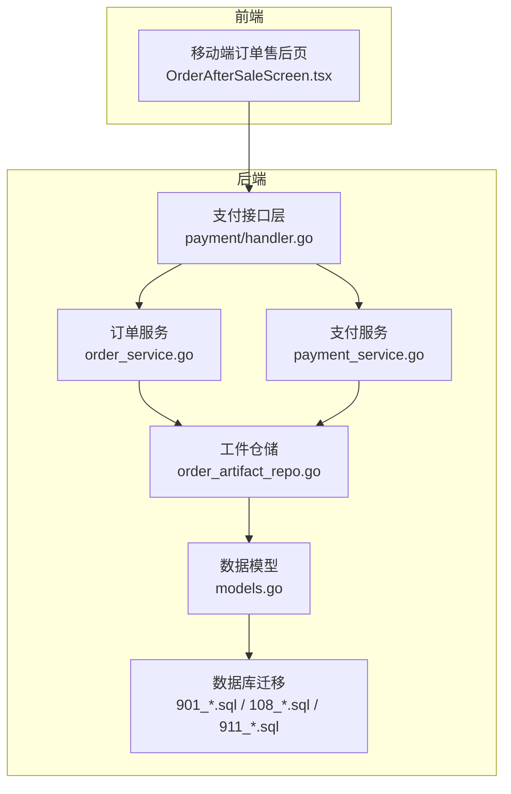
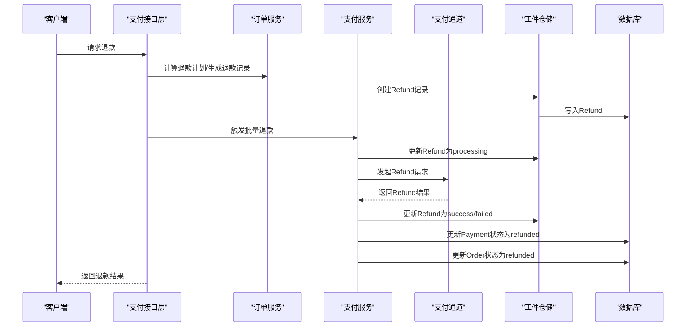
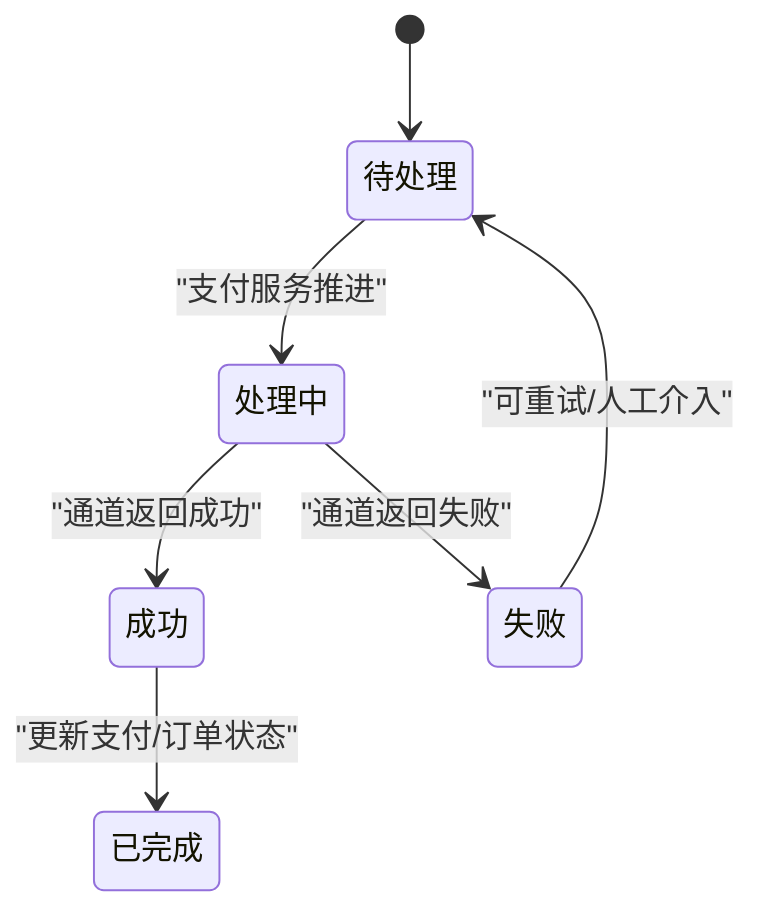
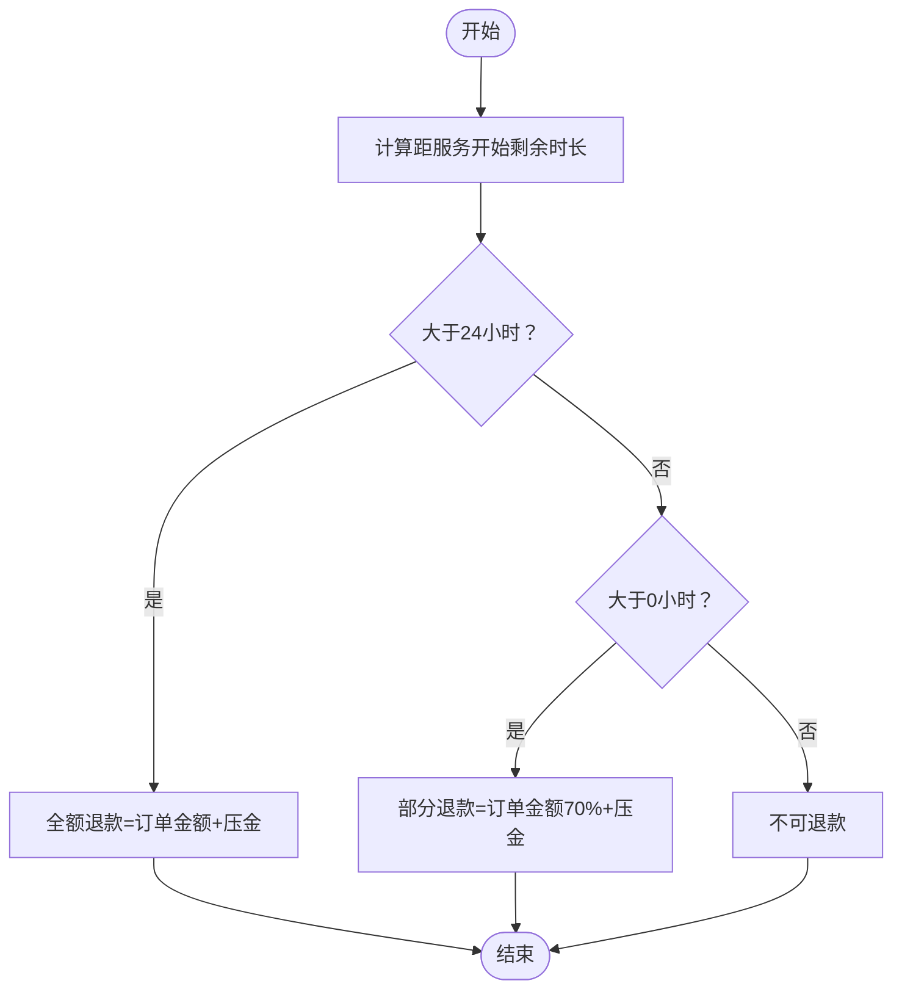
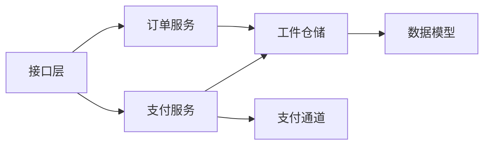

# 退款管理表

<cite>
**本文引用的文件**
- [models.go](file://backend/internal/model/models.go)
- [901_phase9_prepare_v2_schema.sql](file://backend/migrations/901_phase9_prepare_v2_schema.sql)
- [002_seed_data.sql](file://backend/migrations/002_seed_data.sql)
- [order_service.go](file://backend/internal/service/order_service.go)
- [payment_service.go](file://backend/internal/service/payment_service.go)
- [order_artifact_repo.go](file://backend/internal/repository/order_artifact_repo.go)
- [handler.go](file://backend/internal/api/v2/payment/handler.go)
- [108_create_migration_mapping_tables.sql](file://backend/migrations/108_create_migration_mapping_tables.sql)
- [911_phase9_backfill_v2_data.sql](file://backend/migrations/911_phase9_backfill_v2_data.sql)
- [OrderAfterSaleScreen.tsx](file://mobile/src/screens/order/OrderAfterSaleScreen.tsx)
</cite>

## 目录
1. [简介](#简介)
2. [项目结构](#项目结构)
3. [核心组件](#核心组件)
4. [架构总览](#架构总览)
5. [详细组件分析](#详细组件分析)
6. [依赖关系分析](#依赖关系分析)
7. [性能考量](#性能考量)
8. [故障排查指南](#故障排查指南)
9. [结论](#结论)
10. [附录](#附录)

## 简介
本文件面向无人机租赁平台的退款管理系统，围绕 Refund 退款表进行系统化的表结构设计与业务流程说明。重点覆盖以下方面：
- Refund 表字段设计与约束：退款流水号、订单关联、支付关联、退款金额、退款原因、退款状态等
- 退款业务流程的数据支撑：申请、审核、执行、完成等阶段的状态管理与数据记录
- 退款原因分类体系：如取消订单、服务质量问题、重复支付等场景的结构化设计
- 退款金额计算规则：部分退款、全额退款、压金处理等复杂场景的数据存储与实现
- 退款状态跟踪机制：从 pending 到 processing、success 的完整状态链路

## 项目结构
退款相关的核心代码分布在以下模块：
- 数据模型与表结构：backend/internal/model/models.go、backend/migrations/901_phase9_prepare_v2_schema.sql
- 业务服务：backend/internal/service/order_service.go、backend/internal/service/payment_service.go
- 数据访问：backend/internal/repository/order_artifact_repo.go
- 接口层：backend/internal/api/v2/payment/handler.go
- 历史数据校验：backend/migrations/108_create_migration_mapping_tables.sql、backend/migrations/911_phase9_backfill_v2_data.sql
- 移动端展示：mobile/src/screens/order/OrderAfterSaleScreen.tsx



图表来源
- [handler.go:158-172](file://backend/internal/api/v2/payment/handler.go#L158-L172)
- [order_service.go:961-1026](file://backend/internal/service/order_service.go#L961-L1026)
- [payment_service.go:154-342](file://backend/internal/service/payment_service.go#L154-L342)
- [order_artifact_repo.go:52-73](file://backend/internal/repository/order_artifact_repo.go#L52-L73)
- [models.go:534-551](file://backend/internal/model/models.go#L534-L551)
- [901_phase9_prepare_v2_schema.sql:508-522](file://backend/migrations/901_phase9_prepare_v2_schema.sql#L508-L522)
- [108_create_migration_mapping_tables.sql:229-259](file://backend/migrations/108_create_migration_mapping_tables.sql#L229-L259)
- [911_phase9_backfill_v2_data.sql:1268-1298](file://backend/migrations/911_phase9_backfill_v2_data.sql#L1268-L1298)

章节来源
- [models.go:534-551](file://backend/internal/model/models.go#L534-L551)
- [901_phase9_prepare_v2_schema.sql:508-522](file://backend/migrations/901_phase9_prepare_v2_schema.sql#L508-L522)

## 核心组件
- Refund 退款表：包含退款流水号、订单外键、支付外键、退款金额、退款原因、状态、时间戳等字段，具备唯一索引与状态索引，确保幂等与高效查询。
- 订单服务：负责退款计划计算与退款记录生成，支持按时间窗口的差异化退款比例与压金处理。
- 支付服务：负责退款状态推进与第三方支付通道对接，将退款状态持久化并联动支付与订单状态。
- 工件仓储：提供退款记录的创建、更新、按订单/支付查询能力。
- 迁移与校验：通过迁移脚本创建表结构，并在历史数据中识别缺失退款记录的风险。

章节来源
- [models.go:534-551](file://backend/internal/model/models.go#L534-L551)
- [order_service.go:961-1026](file://backend/internal/service/order_service.go#L961-L1026)
- [payment_service.go:154-342](file://backend/internal/service/payment_service.go#L154-L342)
- [order_artifact_repo.go:52-73](file://backend/internal/repository/order_artifact_repo.go#L52-L73)
- [901_phase9_prepare_v2_schema.sql:508-522](file://backend/migrations/901_phase9_prepare_v2_schema.sql#L508-L522)

## 架构总览
退款流程从“取消订单”触发，生成退款计划并落库为 Refund 记录；随后由支付服务驱动第三方通道执行退款，最终回写状态并联动订单状态。



图表来源
- [handler.go:158-172](file://backend/internal/api/v2/payment/handler.go#L158-L172)
- [order_service.go:961-1026](file://backend/internal/service/order_service.go#L961-L1026)
- [payment_service.go:249-342](file://backend/internal/service/payment_service.go#L249-L342)
- [order_artifact_repo.go:52-73](file://backend/internal/repository/order_artifact_repo.go#L52-L73)

## 详细组件分析

### Refund 表结构设计
- 字段说明
  - 退款流水号：唯一标识退款记录，便于对账与追踪
  - 订单关联：指向订单，用于退款归属与统计
  - 支付关联：指向支付记录，保证一对一退款与支付一致性
  - 退款金额：以“分”为单位的整型金额，避免浮点误差
  - 退款原因：文本字段，支持多场景原因拼接
  - 退款状态：枚举值，包含 pending、processing、success、failed
  - 时间戳：创建与更新时间，便于审计与排序
- 约束与索引
  - 唯一索引：退款流水号、支付ID唯一，防止重复退款
  - 状态索引：按状态查询退款列表
  - 订单索引：按订单查询退款明细
- 关系映射
  - Refund 与 Order：一对多（一个订单可有多笔退款）
  - Refund 与 Payment：一对一（一笔支付仅能产生一条退款记录）

```mermaid
erDiagram
ORDERS ||--o{ REFUNDS : "订单包含退款"
PAYMENTS ||--|| REFUNDS : "支付产生退款"
REFUNDS {
bigint id PK
varchar refund_no UK
bigint order_id IDX
bigint payment_id UK
bigint amount
text reason
varchar status IDX
datetime created_at
datetime updated_at
}
```

图表来源
- [models.go:534-551](file://backend/internal/model/models.go#L534-L551)
- [901_phase9_prepare_v2_schema.sql:508-522](file://backend/migrations/901_phase9_prepare_v2_schema.sql#L508-L522)

章节来源
- [models.go:534-551](file://backend/internal/model/models.go#L534-L551)
- [901_phase9_prepare_v2_schema.sql:508-522](file://backend/migrations/901_phase9_prepare_v2_schema.sql#L508-L522)

### 退款业务流程与状态管理
- 申请阶段
  - 订单取消后，服务层根据时间窗口计算应退金额与原因，生成 Refund 记录，默认状态为 pending
- 审核阶段
  - 由业务策略决定是否允许退款（例如服务已开始则不允许），若允许则进入执行阶段
- 执行阶段
  - 支付服务将 Refund 状态置为 processing，调用支付通道发起退款
  - 若通道返回失败，状态置为 failed 并记录错误日志
- 完成阶段
  - 成功后状态置为 success，累计已退金额；当累计金额达到支付总金额时，支付记录状态置为 refunded，订单状态置为 refunded



图表来源
- [payment_service.go:249-342](file://backend/internal/service/payment_service.go#L249-L342)
- [order_artifact_repo.go:52-73](file://backend/internal/repository/order_artifact_repo.go#L52-L73)

章节来源
- [order_service.go:961-1026](file://backend/internal/service/order_service.go#L961-L1026)
- [payment_service.go:249-342](file://backend/internal/service/payment_service.go#L249-L342)

### 退款原因分类体系
- 取消订单：基于时间窗口的差异化退款比例与压金处理
- 服务质量问题：由客服/风控判定，原因字段拼接具体说明
- 重复支付：系统检测到重复扣款，自动触发退款
- 其他场景：如系统异常、第三方通道失败等，均以文本形式记录在原因字段中，便于后续审计与统计

章节来源
- [order_service.go:961-1026](file://backend/internal/service/order_service.go#L961-L1026)
- [002_seed_data.sql:92-98](file://backend/migrations/002_seed_data.sql#L92-L98)

### 退款金额计算规则
- 全额退款：提前24小时以上取消，退还订单金额与压金
- 部分退款：提前0-24小时取消，退还订单金额的70%与压金
- 不可退款：服务已开始或已过开始时间，系统拒绝退款
- 多支付场景：按支付顺序逐笔抵扣，确保累计金额与退款金额一致



图表来源
- [order_service.go:961-978](file://backend/internal/service/order_service.go#L961-L978)

章节来源
- [order_service.go:961-1026](file://backend/internal/service/order_service.go#L961-L1026)

### 退款状态跟踪机制
- 状态流转
  - pending：初始状态，等待处理
  - processing：正在执行退款
  - success：退款成功，累计已退金额
  - failed：退款失败，需人工介入
- 与支付/订单联动
  - 当累计退款金额达到支付总金额时，支付状态置为 refunded
  - 订单状态置为 refunded，并写入时间线与快照

章节来源
- [payment_service.go:249-342](file://backend/internal/service/payment_service.go#L249-L342)
- [order_artifact_repo.go:52-73](file://backend/internal/repository/order_artifact_repo.go#L52-L73)

### 历史数据校验与迁移
- 迁移脚本创建 Refund 表结构，包含唯一索引与状态索引
- 历史数据校验脚本扫描历史支付记录，若状态为 refunded 但未在 Refund 表中生成记录，则生成审计记录提示人工核对

章节来源
- [901_phase9_prepare_v2_schema.sql:508-522](file://backend/migrations/901_phase9_prepare_v2_schema.sql#L508-L522)
- [108_create_migration_mapping_tables.sql:229-259](file://backend/migrations/108_create_migration_mapping_tables.sql#L229-L259)
- [911_phase9_backfill_v2_data.sql:1268-1298](file://backend/migrations/911_phase9_backfill_v2_data.sql#L1268-L1298)

### 移动端展示与交互
- 移动端售后页展示退款记录，包含退款流水号、状态、金额与原因，并提供“继续处理退款”的入口
- 状态展示与后端状态机保持一致，确保用户感知与系统行为一致

章节来源
- [OrderAfterSaleScreen.tsx:252-280](file://mobile/src/screens/order/OrderAfterSaleScreen.tsx#L252-L280)

## 依赖关系分析
- 模块耦合
  - 接口层依赖订单与支付服务，支付服务依赖支付通道与仓储，仓储依赖模型与数据库
- 外部依赖
  - 支付通道：负责实际退款执行与状态回调
- 潜在循环依赖
  - 通过服务层解耦仓储与模型，避免循环导入



图表来源
- [handler.go:158-172](file://backend/internal/api/v2/payment/handler.go#L158-L172)
- [order_service.go:961-1026](file://backend/internal/service/order_service.go#L961-L1026)
- [payment_service.go:154-342](file://backend/internal/service/payment_service.go#L154-L342)
- [order_artifact_repo.go:52-73](file://backend/internal/repository/order_artifact_repo.go#L52-L73)

章节来源
- [handler.go:158-172](file://backend/internal/api/v2/payment/handler.go#L158-L172)
- [order_service.go:961-1026](file://backend/internal/service/order_service.go#L961-L1026)
- [payment_service.go:154-342](file://backend/internal/service/payment_service.go#L154-L342)
- [order_artifact_repo.go:52-73](file://backend/internal/repository/order_artifact_repo.go#L52-L73)

## 性能考量
- 索引优化
  - 对 Refund 的状态、订单ID、支付ID建立索引，提升退款查询与状态统计性能
- 批量处理
  - 支付服务按支付集合顺序处理退款，减少多次往返与事务开销
- 金额精度
  - 使用整型“分”作为金额单位，避免浮点运算误差与索引失效

## 故障排查指南
- 常见问题
  - 退款状态长时间停留在 processing：检查支付通道回调与日志
  - 支付状态未变为 refunded：确认累计退款金额是否等于支付总金额
  - 历史退款记录缺失：使用迁移脚本生成的审计记录定位问题
- 排查步骤
  - 查询 Refund 记录状态与金额
  - 核对 Payment 状态与 ThirdPartyNo
  - 查看订单时间线与快照
  - 检查支付通道返回结果与错误日志

章节来源
- [payment_service.go:249-342](file://backend/internal/service/payment_service.go#L249-L342)
- [108_create_migration_mapping_tables.sql:229-259](file://backend/migrations/108_create_migration_mapping_tables.sql#L229-L259)
- [911_phase9_backfill_v2_data.sql:1268-1298](file://backend/migrations/911_phase9_backfill_v2_data.sql#L1268-L1298)

## 结论
Refund 退款表通过清晰的字段设计与严格的索引约束，配合订单与支付服务的协同，实现了从申请到完成的全链路退款管理。时间窗口驱动的退款计算规则与状态机保障了业务合规性与用户体验，历史数据校验机制则提升了系统的可追溯性与稳定性。

## 附录
- 字段与类型建议
  - 退款流水号：VARCHAR(50)，唯一
  - 订单ID/支付ID：BIGINT，非空，建立索引
  - 金额：BIGINT（分），默认0
  - 原因：TEXT，支持多场景拼接
  - 状态：VARCHAR(20)，默认pending，建立状态索引
- 状态建议
  - pending → processing → success 或 failed → 已完成
- 业务建议
  - 在退款原因中保留原始取消原因与策略原因，便于统计分析
  - 对于失败场景，记录第三方通道错误码与消息，便于快速定位