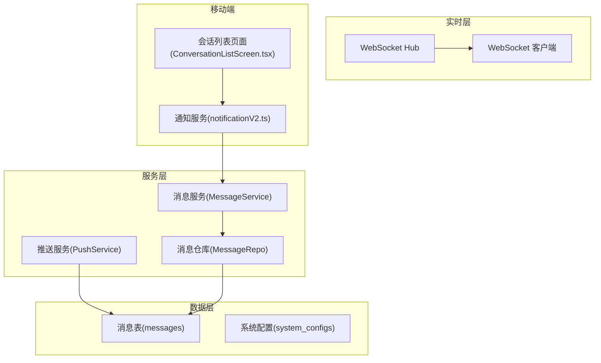
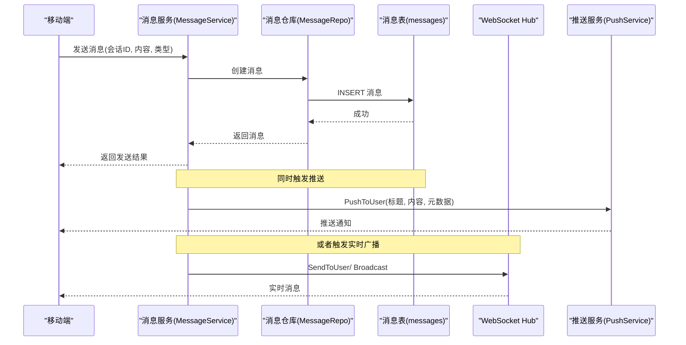
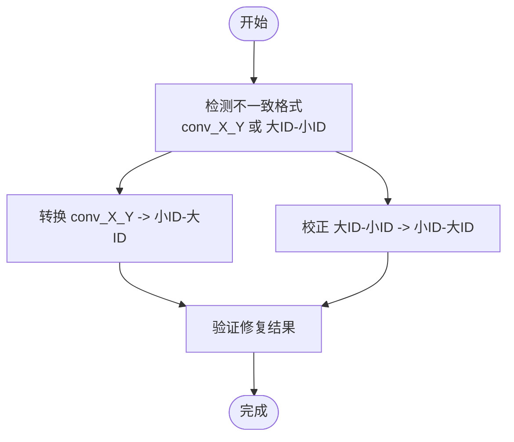
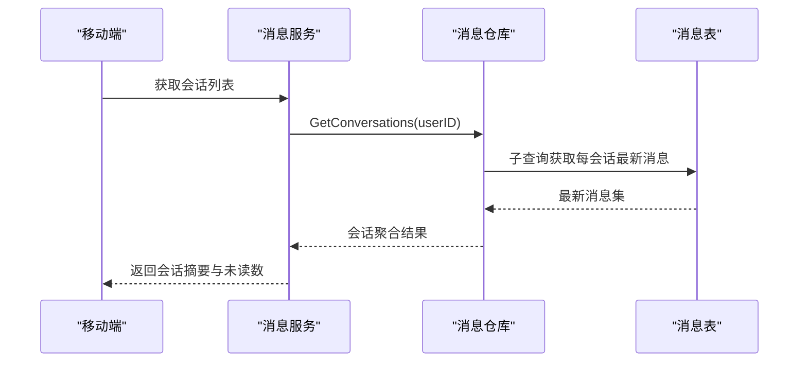
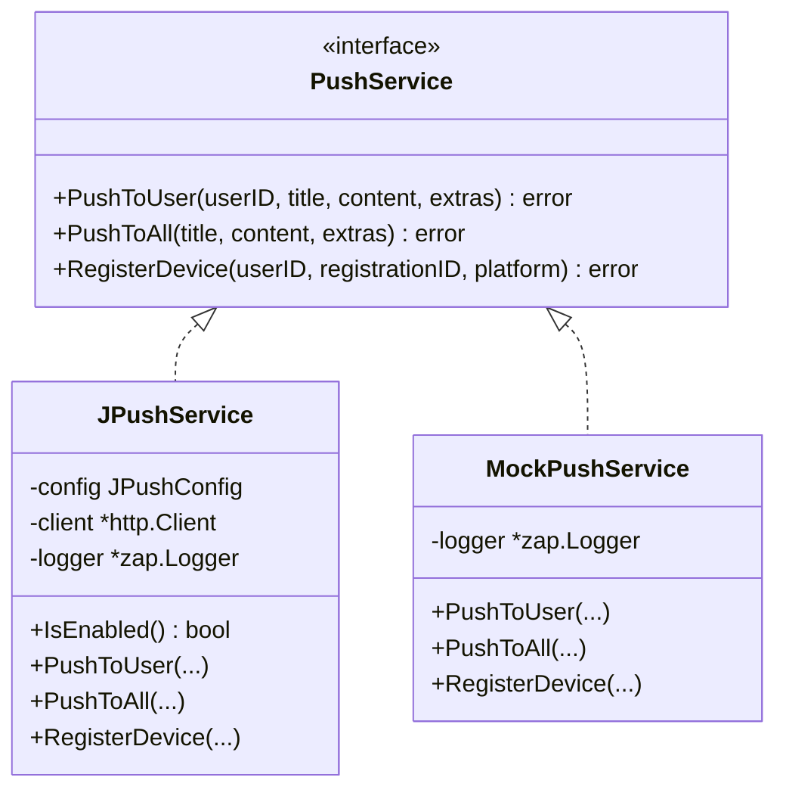
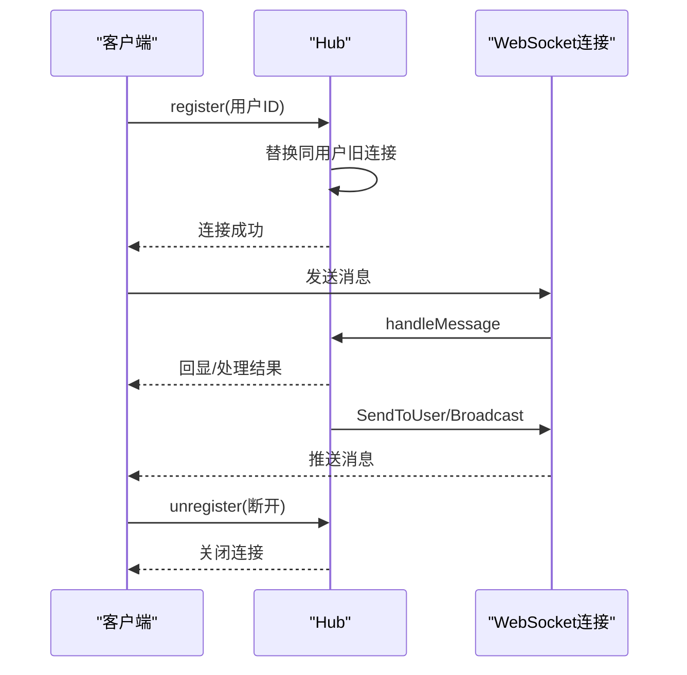
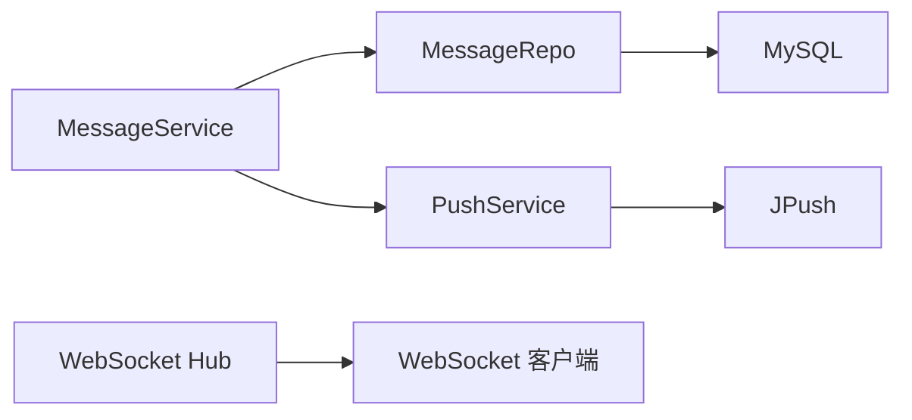

# 通信通知表

<cite>
**本文档引用的文件**
- [001_init_schema.sql](file://backend/migrations/001_init_schema.sql)
- [004_fix_conversation_id.sql](file://backend/migrations/004_fix_conversation_id.sql)
- [models.go](file://backend/internal/model/models.go)
- [message_repo.go](file://backend/internal/repository/message_repo.go)
- [message_service.go](file://backend/internal/service/message_service.go)
- [push.go](file://backend/internal/pkg/push/push.go)
- [hub.go](file://backend/internal/websocket/hub.go)
- [client.go](file://backend/internal/websocket/client.go)
- [handler.go](file://backend/internal/websocket/handler.go)
- [notificationV2.ts](file://mobile/src/services/notificationV2.ts)
- [ConversationListScreen.tsx](file://mobile/src/screens/message/ConversationListScreen.tsx)
</cite>

## 目录
1. [引言](#引言)
2. [项目结构](#项目结构)
3. [核心组件](#核心组件)
4. [架构总览](#架构总览)
5. [详细组件分析](#详细组件分析)
6. [依赖分析](#依赖分析)
7. [性能考虑](#性能考虑)
8. [故障排除指南](#故障排除指南)
9. [结论](#结论)

## 引言
本文件聚焦于无人机租赁平台的通信通知系统，围绕消息表、会话表、通知表以及推送记录等通信相关表的设计与实现展开，系统性阐述消息传递的数据结构、会话ID设计、消息类型分类、消息状态跟踪、实时通信的WebSocket连接与广播机制、消息去重与排序策略，以及通知系统的完整数据存储方案。目标是帮助开发者与产品人员快速理解并扩展该通信体系。

## 项目结构
通信通知系统由三层构成：
- 数据层：基于MySQL的消息与通知表结构，配合索引与约束保障查询与一致性。
- 服务层：消息服务封装消息发送、会话聚合、未读统计与系统通知；推送服务封装极光推送与Mock实现。
- 实时层：WebSocket Hub负责在线用户管理、消息广播与单播。

**图表来源**
- [models.go:572-587](file://backend/internal/model/models.go#L572-L587)
- [message_service.go:21-40](file://backend/internal/service/message_service.go#L21-L40)
- [message_repo.go:17-29](file://backend/internal/repository/message_repo.go#L17-L29)
- [push.go:15-23](file://backend/internal/pkg/push/push.go#L15-L23)
- [hub.go:12-43](file://backend/internal/websocket/hub.go#L12-L43)
- [handler.go:23-63](file://backend/internal/websocket/handler.go#L23-L63)
- [notificationV2.ts:14-25](file://mobile/src/services/notificationV2.ts#L14-L25)
- [ConversationListScreen.tsx:98-132](file://mobile/src/screens/message/ConversationListScreen.tsx#L98-L132)

**章节来源**
- [models.go:572-587](file://backend/internal/model/models.go#L572-L587)
- [message_service.go:21-40](file://backend/internal/service/message_service.go#L21-L40)
- [message_repo.go:17-29](file://backend/internal/repository/message_repo.go#L17-L29)
- [push.go:15-23](file://backend/internal/pkg/push/push.go#L15-L23)
- [hub.go:12-43](file://backend/internal/websocket/hub.go#L12-L43)
- [handler.go:23-63](file://backend/internal/websocket/handler.go#L23-L63)
- [notificationV2.ts:14-25](file://mobile/src/services/notificationV2.ts#L14-L25)
- [ConversationListScreen.tsx:98-132](file://mobile/src/screens/message/ConversationListScreen.tsx#L98-L132)

## 核心组件
- 消息表（messages）：承载用户间消息、系统通知的统一载体，包含会话ID、发送方、接收方、消息类型、内容、额外数据、已读标记与时间戳。
- 会话ID设计：采用“小ID-大ID”格式，确保同一会话的唯一性与一致性，兼容历史数据格式修复。
- 通知系统：通过消息表承载系统通知，使用sender_id=0标识系统消息，并以extra_data存储通知元数据。
- 推送服务：封装极光推送与Mock实现，支持按用户推送与全局广播。
- WebSocket实时通信：Hub管理在线用户，支持单播与广播，配合移动端实时展示。

**章节来源**
- [models.go:572-587](file://backend/internal/model/models.go#L572-L587)
- [message_service.go:123-137](file://backend/internal/service/message_service.go#L123-L137)
- [message_repo.go:31-56](file://backend/internal/repository/message_repo.go#L31-L56)
- [push.go:57-95](file://backend/internal/pkg/push/push.go#L57-L95)
- [hub.go:12-43](file://backend/internal/websocket/hub.go#L12-L43)

## 架构总览
下图展示了从消息发送到实时推送与存储的整体流程：

**图表来源**
- [message_service.go:21-40](file://backend/internal/service/message_service.go#L21-L40)
- [message_repo.go:17-29](file://backend/internal/repository/message_repo.go#L17-L29)
- [push.go:57-95](file://backend/internal/pkg/push/push.go#L57-L95)
- [hub.go:99-116](file://backend/internal/websocket/hub.go#L99-L116)

## 详细组件分析

### 消息表（messages）结构设计
- 主键与索引
  - 主键：自增ID，保证消息唯一性。
  - 索引：conversation_id、sender_id、receiver_id，支撑会话查询、发送方/接收方过滤与未读统计。
- 字段说明
  - conversation_id：会话标识，采用“小ID-大ID”格式，确保双向会话唯一。
  - sender_id/receiver_id：消息发送方与接收方用户ID。
  - message_type：消息类型（text、image、location、order等），默认text。
  - content：消息正文。
  - extra_data：JSON格式的扩展数据，用于承载通知标题、业务参数等。
  - is_read/read_at：已读标记与已读时间，支持未读统计与消息标记。
  - created_at：消息创建时间，用于排序与历史展示。
- 设计要点
  - 使用统一的消息表承载用户消息与系统通知，降低表数量与跨表复杂度。
  - 通过sender_id=0标识系统通知，便于筛选与统计。
  - extra_data承载通知元数据，避免频繁新增字段。

**章节来源**
- [001_init_schema.sql:220-235](file://backend/migrations/001_init_schema.sql#L220-L235)
- [models.go:572-587](file://backend/internal/model/models.go#L572-L587)
- [message_repo.go:87-101](file://backend/internal/repository/message_repo.go#L87-L101)

### 会话ID设计与历史修复
- 设计原则
  - 会话ID采用“小ID-大ID”格式，确保同一会话的唯一性与一致性。
  - 生成规则：makeConversationID(userA, userB)始终输出较小ID在前。
- 历史数据修复
  - 迁移脚本统一历史conversation_id格式，修复“conv_X_Y”与“大ID-小ID”等不一致格式。
  - 修复后确保所有会话ID均为“小ID-大ID”。

**图表来源**
- [004_fix_conversation_id.sql:14-47](file://backend/migrations/004_fix_conversation_id.sql#L14-L47)

**章节来源**
- [message_service.go:123-128](file://backend/internal/service/message_service.go#L123-L128)
- [004_fix_conversation_id.sql:14-47](file://backend/migrations/004_fix_conversation_id.sql#L14-L47)

### 消息类型分类与状态跟踪
- 消息类型
  - text：文本消息。
  - image：图片消息。
  - location：位置消息。
  - order：订单相关消息。
- 状态跟踪
  - is_read：布尔值，表示是否已读。
  - read_at：已读时间，用于统计与排序。
- 用途
  - 文本消息用于聊天对话。
  - 订单消息用于业务交互。
  - 系统通知通过消息表承载，sender_id=0。

**章节来源**
- [models.go:577-582](file://backend/internal/model/models.go#L577-L582)
- [message_repo.go:87-101](file://backend/internal/repository/message_repo.go#L87-L101)

### 会话聚合与未读统计
- 会话聚合
  - GetConversations(userID)：按最近一条消息对每个对话方进行聚合，返回最后一条消息、类型、时间与对方ID，并统计未读数。
- 未读统计
  - GetUnreadCount(userID)：统计某用户未读消息总数。
  - GetUnreadNotificationCount(userID)：统计系统通知未读数（sender_id=0）。
- 查询优化
  - 使用子查询MAX(id)获取每会话最新消息，再进行JOIN与统计，兼容MySQL 5.7。

**图表来源**
- [message_repo.go:31-56](file://backend/internal/repository/message_repo.go#L31-L56)

**章节来源**
- [message_repo.go:31-56](file://backend/internal/repository/message_repo.go#L31-L56)

### 系统通知与业务提醒
- 系统通知
  - SendSystemNotification：向指定用户发送系统通知，conversation_id采用“system-用户ID”格式，sender_id=0。
  - 列表接口：按接收方与sender_id=0筛选，支持分页与倒序。
- 业务提醒
  - 通过extra_data传递业务参数（如订单号、报价号等），移动端据此跳转或展示。
- 移动端集成
  - notificationV2Service.list/markRead：提供通知列表与标记已读接口。
  - ConversationListScreen.tsx：按未读数与时间对通知分组排序，支持标题与副标题解析。

**章节来源**
- [message_service.go:85-121](file://backend/internal/service/message_service.go#L85-L121)
- [message_repo.go:87-117](file://backend/internal/repository/message_repo.go#L87-L117)
- [notificationV2.ts:14-25](file://mobile/src/services/notificationV2.ts#L14-L25)
- [ConversationListScreen.tsx:98-132](file://mobile/src/screens/message/ConversationListScreen.tsx#L98-L132)

### 推送记录与推送服务
- 推送服务接口
  - PushToUser：按用户别名推送。
  - PushToAll：全局广播。
  - RegisterDevice：注册设备别名。
- 极光推送实现
  - JPushService：封装HTTP调用，支持Android/iOS差异化推送与超时控制。
- Mock实现
  - MockPushService：开发环境打印推送日志，便于调试。
- 订单与消息推送
  - NotifyOrderStatusChange：根据订单状态映射推送文案。
  - NotifyNewMessage：新消息推送，截断过长内容。
  - NotifyVerificationResult：实名认证结果推送。

**图表来源**
- [push.go:15-23](file://backend/internal/pkg/push/push.go#L15-L23)
- [push.go:37-50](file://backend/internal/pkg/push/push.go#L37-L50)
- [push.go:228-235](file://backend/internal/pkg/push/push.go#L228-L235)

**章节来源**
- [push.go:15-23](file://backend/internal/pkg/push/push.go#L15-L23)
- [push.go:57-95](file://backend/internal/pkg/push/push.go#L57-L95)
- [push.go:270-323](file://backend/internal/pkg/push/push.go#L270-L323)

### 实时通信：WebSocket Hub与客户端
- Hub管理
  - clients：在线用户映射，同一用户新连接会替换旧连接。
  - broadcast/register/unregister：消息广播与客户端生命周期管理。
  - SendToUser/Broadcast：单播与广播方法。
- 客户端
  - ReadPump/WritePump：读写循环，心跳与超时处理。
  - handleMessage：消息处理入口（当前为回显，生产环境需解析路由）。
- 认证
  - 通过查询参数token与JWT解析获取用户ID，建立连接。

**图表来源**
- [hub.go:45-96](file://backend/internal/websocket/hub.go#L45-L96)
- [client.go:17-69](file://backend/internal/websocket/client.go#L17-L69)
- [handler.go:23-63](file://backend/internal/websocket/handler.go#L23-L63)

**章节来源**
- [hub.go:12-43](file://backend/internal/websocket/hub.go#L12-L43)
- [client.go:17-69](file://backend/internal/websocket/client.go#L17-L69)
- [handler.go:23-63](file://backend/internal/websocket/handler.go#L23-L63)

### 消息去重、排序与历史
- 去重策略
  - 会话ID采用“小ID-大ID”，确保同一会话唯一。
  - 历史数据迁移统一格式，避免重复会话。
- 排序策略
  - 消息按created_at降序排列，保证最新消息在前。
  - 通知列表按created_at与id双重降序，确保时间与插入顺序一致。
- 历史展示
  - 分页查询：offset与limit控制页大小。
  - 会话聚合：每会话仅取最新消息作为摘要。

**章节来源**
- [message_repo.go:21-29](file://backend/internal/repository/message_repo.go#L21-L29)
- [message_repo.go:96-101](file://backend/internal/repository/message_repo.go#L96-L101)
- [message_repo.go:46-54](file://backend/internal/repository/message_repo.go#L46-L54)

## 依赖分析
- 组件耦合
  - MessageService依赖MessageRepo与PushService，形成清晰的服务边界。
  - WebSocket Hub独立于业务逻辑，仅负责消息转发。
- 外部依赖
  - 极光推送服务（JPush）提供推送能力。
  - JWT用于WebSocket鉴权。
- 可能的循环依赖
  - 当前结构无循环依赖，服务层与Hub解耦良好。

**图表来源**
- [message_service.go:13-19](file://backend/internal/service/message_service.go#L13-L19)
- [message_repo.go:9-15](file://backend/internal/repository/message_repo.go#L9-L15)
- [push.go:37-50](file://backend/internal/pkg/push/push.go#L37-L50)
- [hub.go:12-43](file://backend/internal/websocket/hub.go#L12-L43)

**章节来源**
- [message_service.go:13-19](file://backend/internal/service/message_service.go#L13-L19)
- [message_repo.go:9-15](file://backend/internal/repository/message_repo.go#L9-L15)
- [push.go:37-50](file://backend/internal/pkg/push/push.go#L37-L50)
- [hub.go:12-43](file://backend/internal/websocket/hub.go#L12-L43)

## 性能考虑
- 查询性能
  - 为conversation_id、sender_id、receiver_id建立索引，提升会话查询与未读统计性能。
  - 会话聚合使用子查询+JOIN，避免全表扫描。
- 存储与扩展
  - 使用JSON字段存储extra_data，便于扩展通知元数据而无需频繁DDL。
- 实时通信
  - Hub使用通道与并发模型，广播与单播均具备缓冲队列，避免阻塞。
- 推送性能
  - 极光推送设置超时与TTL，减少无效推送成本。

[本节为通用指导，无需特定文件引用]

## 故障排除指南
- 会话ID不一致
  - 现象：同一会话出现多条消息或无法聚合。
  - 处理：执行迁移脚本统一格式，确保conversation_id为“小ID-大ID”。
- 未读统计异常
  - 现象：未读数不准确。
  - 处理：检查is_read与read_at字段更新逻辑，确认MarkAsRead与MarkNotificationRead调用。
- 推送失败
  - 现象：推送接口报错或无效果。
  - 处理：检查JPush配置与鉴权头，确认isEnabled状态；开发环境可切换Mock实现。
- WebSocket断连
  - 现象：心跳超时或消息丢失。
  - 处理：检查ReadPump/WritePump中的超时与ping周期，确认客户端网络与服务器日志。

**章节来源**
- [004_fix_conversation_id.sql:45-55](file://backend/migrations/004_fix_conversation_id.sql#L45-L55)
- [message_repo.go:67-71](file://backend/internal/repository/message_repo.go#L67-L71)
- [push.go:52-55](file://backend/internal/pkg/push/push.go#L52-L55)
- [client.go:10-15](file://backend/internal/websocket/client.go#L10-L15)

## 结论
本文档系统梳理了无人机租赁平台通信通知系统的表结构与实现，明确了消息表、会话ID设计、通知系统、推送服务与WebSocket实时通信的关键点。通过统一的消息表承载用户消息与系统通知、严格的会话ID规范、完善的未读统计与排序机制，以及可扩展的推送与实时通信能力，平台实现了高效、可维护的通信基础设施。后续可在通知元数据扩展、推送模板化与实时消息路由等方面持续优化。