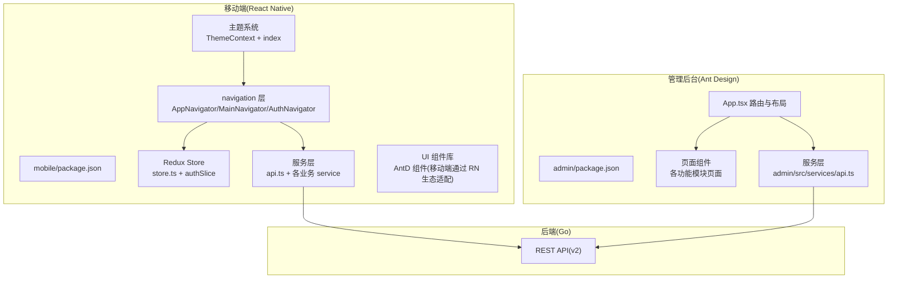
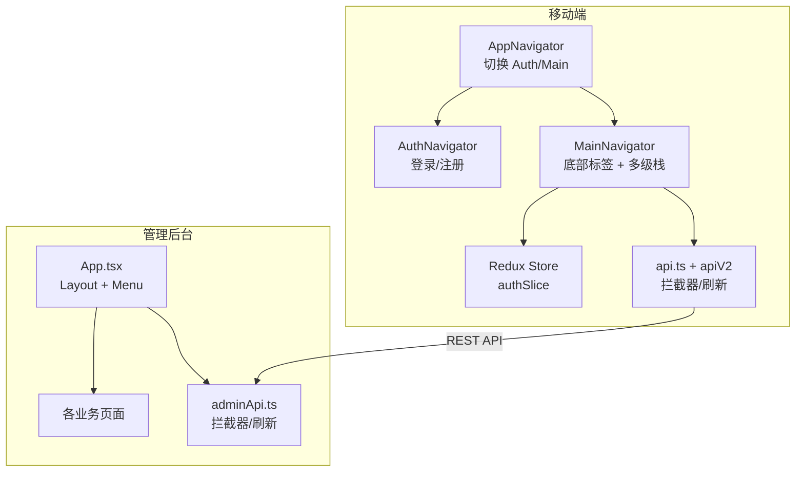
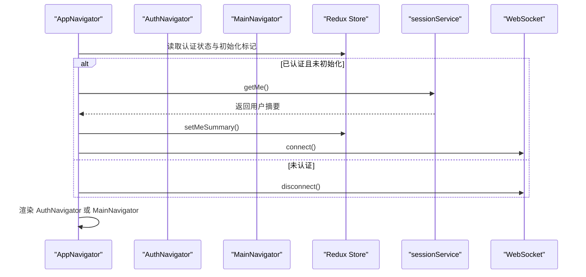
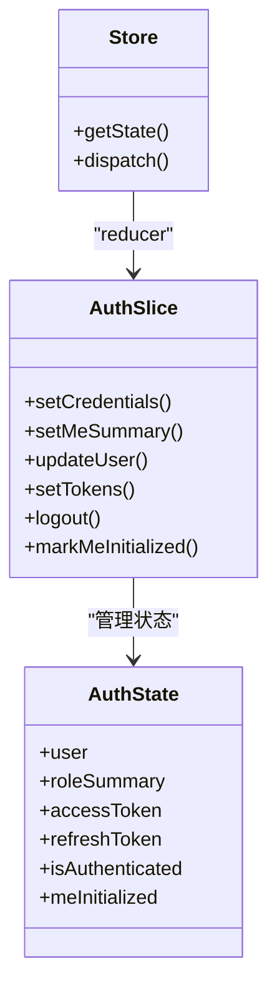
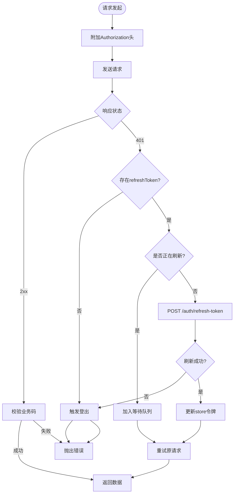
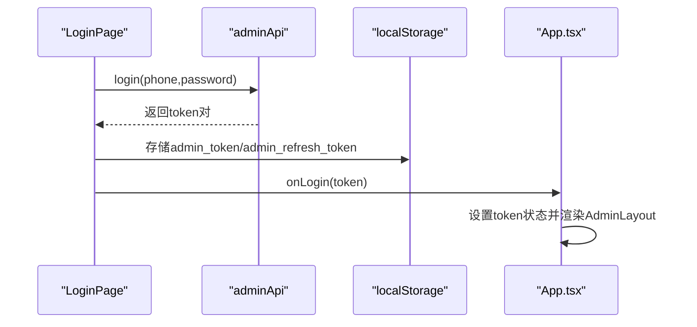
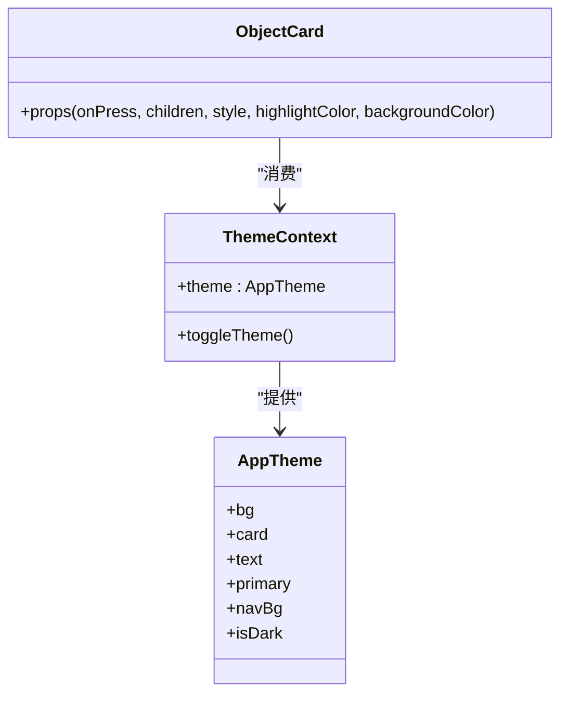
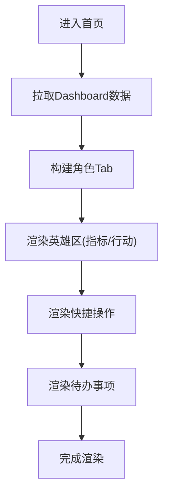
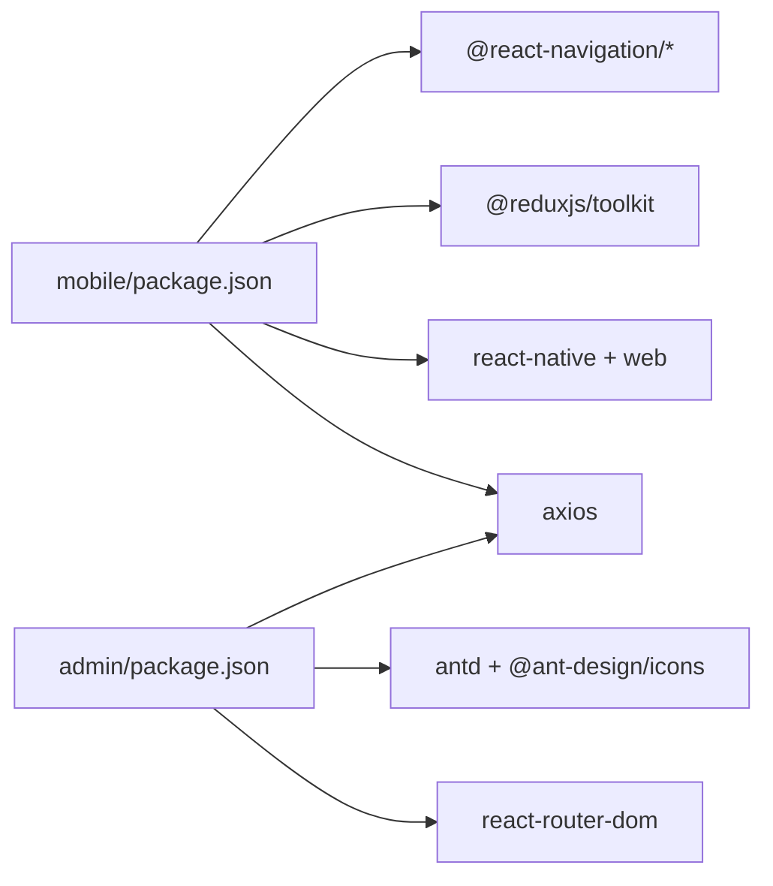

# 前端应用架构

<cite>
**本文引用的文件**
- [mobile/package.json](file://mobile/package.json)
- [admin/package.json](file://admin/package.json)
- [mobile/src/store/store.ts](file://mobile/src/store/store.ts)
- [mobile/src/store/slices/authSlice.ts](file://mobile/src/store/slices/authSlice.ts)
- [mobile/src/navigation/AppNavigator.tsx](file://mobile/src/navigation/AppNavigator.tsx)
- [mobile/src/navigation/MainNavigator.tsx](file://mobile/src/navigation/MainNavigator.tsx)
- [mobile/src/navigation/AuthNavigator.tsx](file://mobile/src/navigation/AuthNavigator.tsx)
- [mobile/src/services/api.ts](file://mobile/src/services/api.ts)
- [admin/src/App.tsx](file://admin/src/App.tsx)
- [admin/src/pages/LoginPage.tsx](file://admin/src/pages/LoginPage.tsx)
- [admin/src/services/api.ts](file://admin/src/services/api.ts)
- [mobile/src/theme/ThemeContext.tsx](file://mobile/src/theme/ThemeContext.tsx)
- [mobile/src/theme/index.ts](file://mobile/src/theme/index.ts)
- [mobile/src/components/business/ObjectCard.tsx](file://mobile/src/components/business/ObjectCard.tsx)
- [mobile/src/screens/home/HomeScreen.tsx](file://mobile/src/screens/home/HomeScreen.tsx)
</cite>

## 目录
1. [引言](#引言)
2. [项目结构](#项目结构)
3. [核心组件](#核心组件)
4. [架构总览](#架构总览)
5. [详细组件分析](#详细组件分析)
6. [依赖关系分析](#依赖关系分析)
7. [性能考量](#性能考量)
8. [故障排查指南](#故障排查指南)
9. [结论](#结论)
10. [附录](#附录)

## 引言
本文件面向无人机租赁平台的前端应用，系统化梳理移动端（React Native）与管理后台（Ant Design + Vite）的架构设计与实现要点。重点覆盖：
- 移动端组件化架构与导航体系
- Redux Toolkit 状态管理策略、store 结构与 action/reducer 模式
- 管理后台 Ant Design 集成、页面组件设计与权限控制机制
- 移动端与 Web 端差异化设计策略、响应式布局与跨平台兼容
- 组件复用策略、样式系统与主题切换机制
- 技术栈选型理由、性能优化策略与开发工具链配置

## 项目结构
项目采用“多包”组织方式，分别在 mobile 与 admin 目录下构建移动端与管理后台应用；backend 为后端 Go 服务，提供 REST API；docker 提供数据库与运行环境编排。

图表来源
- [mobile/package.json:1-63](file://mobile/package.json#L1-L63)
- [admin/package.json:1-33](file://admin/package.json#L1-L33)
- [mobile/src/navigation/AppNavigator.tsx:1-88](file://mobile/src/navigation/AppNavigator.tsx#L1-L88)
- [admin/src/App.tsx:1-130](file://admin/src/App.tsx#L1-L130)

章节来源
- [mobile/package.json:1-63](file://mobile/package.json#L1-L63)
- [admin/package.json:1-33](file://admin/package.json#L1-L33)

## 核心组件
- 移动端导航与启动流程：AppNavigator 根据认证状态切换 AuthNavigator 或 MainNavigator，并在认证状态下拉取用户摘要、建立 WebSocket 连接。
- Redux Toolkit 状态管理：集中于 store.ts 与 authSlice.ts，管理用户凭证、角色摘要与认证状态。
- 服务层：移动端通过 api.ts 与 apiV2 构建客户端，注入请求头与响应拦截器，支持并发刷新与统一错误处理。
- 管理后台路由与布局：App.tsx 使用 Ant Design Layout 与 Menu 构建侧边栏导航，BrowserRouter 管理页面路由。
- 主题系统：ThemeContext 提供暗/亮主题切换，ThemeContext 注入到导航与 UI 组件以实现一致风格。

章节来源
- [mobile/src/navigation/AppNavigator.tsx:1-88](file://mobile/src/navigation/AppNavigator.tsx#L1-L88)
- [mobile/src/store/store.ts:1-12](file://mobile/src/store/store.ts#L1-L12)
- [mobile/src/store/slices/authSlice.ts:1-65](file://mobile/src/store/slices/authSlice.ts#L1-L65)
- [mobile/src/services/api.ts:1-155](file://mobile/src/services/api.ts#L1-L155)
- [admin/src/App.tsx:1-130](file://admin/src/App.tsx#L1-L130)
- [mobile/src/theme/ThemeContext.tsx:1-31](file://mobile/src/theme/ThemeContext.tsx#L1-L31)

## 架构总览
移动端与管理后台共享后端 API，但前端实现差异显著：
- 移动端强调“底部标签 + 原生导航栈”的移动体验，Redux 管理认证与用户摘要，Axios 搭配拦截器实现自动鉴权与刷新。
- 管理后台强调“桌面端布局 + 表单驱动”的管理效率，Ant Design 提供丰富的业务组件与布局能力，路由与权限通过菜单与页面控制。

图表来源
- [mobile/src/navigation/AppNavigator.tsx:1-88](file://mobile/src/navigation/AppNavigator.tsx#L1-L88)
- [mobile/src/navigation/AuthNavigator.tsx:1-16](file://mobile/src/navigation/AuthNavigator.tsx#L1-L16)
- [mobile/src/navigation/MainNavigator.tsx:1-195](file://mobile/src/navigation/MainNavigator.tsx#L1-L195)
- [mobile/src/store/slices/authSlice.ts:1-65](file://mobile/src/store/slices/authSlice.ts#L1-L65)
- [mobile/src/services/api.ts:1-155](file://mobile/src/services/api.ts#L1-L155)
- [admin/src/App.tsx:1-130](file://admin/src/App.tsx#L1-L130)
- [admin/src/services/api.ts:1-402](file://admin/src/services/api.ts#L1-L402)

## 详细组件分析

### 移动端导航系统
- AppNavigator：根据认证状态与初始化状态渲染 AuthNavigator 或 MainNavigator；在认证时连接 WebSocket 并拉取用户摘要；提供全局加载态提示。
- AuthNavigator：无头部的登录/注册栈，用于首次认证。
- MainNavigator：底部标签 + 多级原生栈，承载首页、市场、履约、消息、我的五大 Tab 以及大量业务页面。

图表来源
- [mobile/src/navigation/AppNavigator.tsx:1-88](file://mobile/src/navigation/AppNavigator.tsx#L1-L88)
- [mobile/src/navigation/AuthNavigator.tsx:1-16](file://mobile/src/navigation/AuthNavigator.tsx#L1-L16)
- [mobile/src/navigation/MainNavigator.tsx:1-195](file://mobile/src/navigation/MainNavigator.tsx#L1-L195)

章节来源
- [mobile/src/navigation/AppNavigator.tsx:1-88](file://mobile/src/navigation/AppNavigator.tsx#L1-L88)
- [mobile/src/navigation/AuthNavigator.tsx:1-16](file://mobile/src/navigation/AuthNavigator.tsx#L1-L16)
- [mobile/src/navigation/MainNavigator.tsx:1-195](file://mobile/src/navigation/MainNavigator.tsx#L1-L195)

### Redux Toolkit 状态管理
- store.ts：集中配置 Redux Store，导出 RootState 与 AppDispatch 类型。
- authSlice.ts：定义认证状态字段（用户、角色摘要、访问/刷新令牌、认证状态、初始化标记），提供 setCredentials、setMeSummary、logout 等 action 与 reducer。

图表来源
- [mobile/src/store/store.ts:1-12](file://mobile/src/store/store.ts#L1-L12)
- [mobile/src/store/slices/authSlice.ts:1-65](file://mobile/src/store/slices/authSlice.ts#L1-L65)

章节来源
- [mobile/src/store/store.ts:1-12](file://mobile/src/store/store.ts#L1-L12)
- [mobile/src/store/slices/authSlice.ts:1-65](file://mobile/src/store/slices/authSlice.ts#L1-L65)

### 服务层与拦截器（移动端）
- api.ts：构建 axios 实例，注入 Authorization 请求头；对 v1/v2 业务响应码进行校验；处理 401 与并发刷新，维护 pendingRequests 队列；统一错误消息。
- 并发刷新策略：isRefreshing 标志位与 pendingRequests 队列避免重复刷新与丢失请求，刷新成功后批量重试等待中的请求。

图表来源
- [mobile/src/services/api.ts:1-155](file://mobile/src/services/api.ts#L1-L155)

章节来源
- [mobile/src/services/api.ts:1-155](file://mobile/src/services/api.ts#L1-L155)

### 管理后台路由与布局（Ant Design）
- App.tsx：使用 Ant Design Layout 与 Menu 构建侧边栏，BrowserRouter 管理路由；未登录时仅展示 LoginPage；登录后渲染 AdminLayout。
- LoginPage.tsx：表单收集手机号与密码，调用 adminApi.login 获取 token 并写入 localStorage，随后通知父组件切换路由。

图表来源
- [admin/src/pages/LoginPage.tsx:1-53](file://admin/src/pages/LoginPage.tsx#L1-L53)
- [admin/src/services/api.ts:1-402](file://admin/src/services/api.ts#L1-L402)
- [admin/src/App.tsx:1-130](file://admin/src/App.tsx#L1-L130)

章节来源
- [admin/src/App.tsx:1-130](file://admin/src/App.tsx#L1-L130)
- [admin/src/pages/LoginPage.tsx:1-53](file://admin/src/pages/LoginPage.tsx#L1-L53)
- [admin/src/services/api.ts:1-402](file://admin/src/services/api.ts#L1-L402)

### 主题系统与组件复用
- ThemeContext：提供主题切换与上下文注入，暴露 theme 与 toggleTheme。
- Theme 定义：darkTheme/lightTheme 提供完整的视觉变量，覆盖背景、卡片、文字、输入、按钮、状态色、导航等。
- 组件复用：ObjectCard 作为通用卡片容器，支持高亮边框与点击事件，统一消费 theme 变量。

图表来源
- [mobile/src/theme/ThemeContext.tsx:1-31](file://mobile/src/theme/ThemeContext.tsx#L1-L31)
- [mobile/src/theme/index.ts:1-202](file://mobile/src/theme/index.ts#L1-L202)
- [mobile/src/components/business/ObjectCard.tsx:1-53](file://mobile/src/components/business/ObjectCard.tsx#L1-L53)

章节来源
- [mobile/src/theme/ThemeContext.tsx:1-31](file://mobile/src/theme/ThemeContext.tsx#L1-L31)
- [mobile/src/theme/index.ts:1-202](file://mobile/src/theme/index.ts#L1-L202)
- [mobile/src/components/business/ObjectCard.tsx:1-53](file://mobile/src/components/business/ObjectCard.tsx#L1-L53)

### 首页驾驶舱（移动端）
- HomeScreen：按角色聚合数据，动态生成指标卡、快捷操作与待办事项；支持横竖屏自适应与底部 Tab 高度感知；使用 ObjectCard、StatusBadge、SourceTag 等业务组件。

图表来源
- [mobile/src/screens/home/HomeScreen.tsx:1-800](file://mobile/src/screens/home/HomeScreen.tsx#L1-L800)

章节来源
- [mobile/src/screens/home/HomeScreen.tsx:1-800](file://mobile/src/screens/home/HomeScreen.tsx#L1-L800)

## 依赖关系分析
- 移动端依赖：@react-navigation/*、@reduxjs/toolkit、react-native-*、axios、react-redux、react-native-web 等，支持跨平台（RN + Web）。
- 管理后台依赖：antd、@ant-design/icons、react-router-dom、axios、dayjs 等，基于 Vite 构建。

图表来源
- [mobile/package.json:1-63](file://mobile/package.json#L1-L63)
- [admin/package.json:1-33](file://admin/package.json#L1-L33)

章节来源
- [mobile/package.json:1-63](file://mobile/package.json#L1-L63)
- [admin/package.json:1-33](file://admin/package.json#L1-L33)

## 性能考量
- 导航与渲染
  - AppNavigator 在认证状态下仅在必要时拉取用户摘要，避免重复请求。
  - MainNavigator 使用原生栈，减少跨页面重渲染成本。
- 状态管理
  - Redux Toolkit 采用不可变更新与 Immer，降低手动深拷贝开销。
  - 通过 markMeInitialized 避免重复初始化。
- 网络层
  - 并发刷新队列避免重复请求与丢失；统一超时与错误提示。
  - v1/v2 业务码校验减少无效渲染。
- 主题与样式
  - ThemeContext 将主题注入到导航与组件，减少重复计算。
  - ObjectCard 等通用组件统一样式变量，便于缓存与复用。

## 故障排查指南
- 登录/鉴权问题
  - 管理后台：检查 adminApi 的请求拦截器与响应拦截器，确认 401 时是否正确触发刷新与跳转登录。
  - 移动端：确认 api.ts 与 apiV2 的拦截器是否生效，Authorization 头是否正确附加。
- 刷新令牌冲突
  - 观察 isRefreshing 标志与 pendingRequests 队列，确保并发请求被正确排队与重试。
- 导航异常
  - AppNavigator 中认证状态变化时，确认 WebSocket 连接/断开逻辑与用户摘要初始化流程。
- 主题不生效
  - 确认 ThemeProvider 已包裹根组件，ObjectCard 等组件是否正确消费 theme。

章节来源
- [admin/src/services/api.ts:1-402](file://admin/src/services/api.ts#L1-L402)
- [mobile/src/services/api.ts:1-155](file://mobile/src/services/api.ts#L1-L155)
- [mobile/src/navigation/AppNavigator.tsx:1-88](file://mobile/src/navigation/AppNavigator.tsx#L1-L88)
- [mobile/src/theme/ThemeContext.tsx:1-31](file://mobile/src/theme/ThemeContext.tsx#L1-L31)

## 结论
该前端架构在移动端与管理后台两端实现了清晰的职责分离：移动端以导航与状态为核心，结合 Redux 与拦截器保障用户体验与稳定性；管理后台以 Ant Design 为基础，强调布局与交互效率。通过统一的主题系统与组件复用策略，提升了跨端一致性与可维护性。建议后续持续完善权限细化、埋点与可观测性，以及针对不同平台的性能优化与测试覆盖。

## 附录
- 技术栈选型理由
  - 移动端：React Native 跨平台、React Navigation 导航成熟生态、Redux Toolkit 简化状态管理、Axios 统一网络层。
  - 管理后台：Ant Design 组件丰富、路由与布局成熟、Vite 构建快速。
- 开发工具链
  - ESLint、Prettier、Jest（移动端）、Vite + TypeScript（管理后台）。
- 跨平台兼容
  - 移动端通过 react-native-web 与 react-native-config 实现 Web 与原生共用代码；注意平台特定 API（如地图、定位）需条件引入。