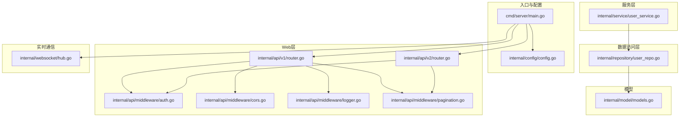
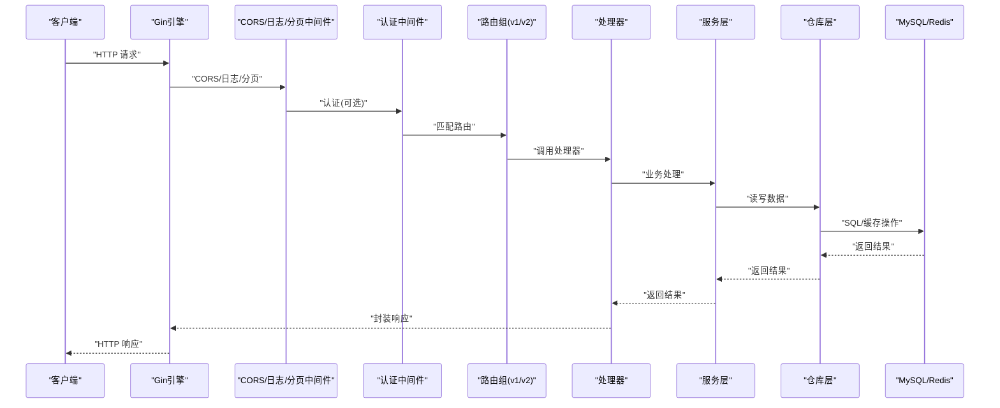
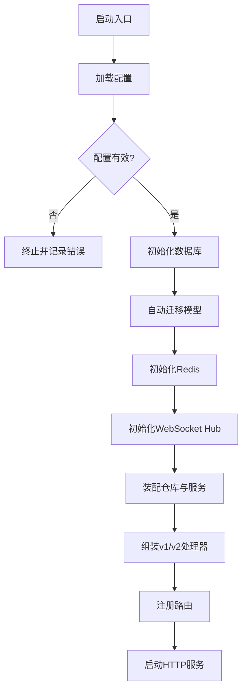
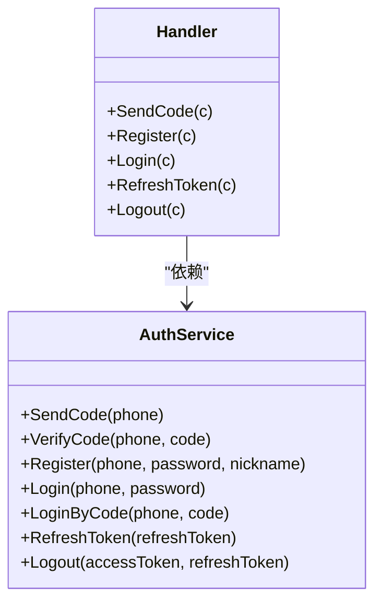
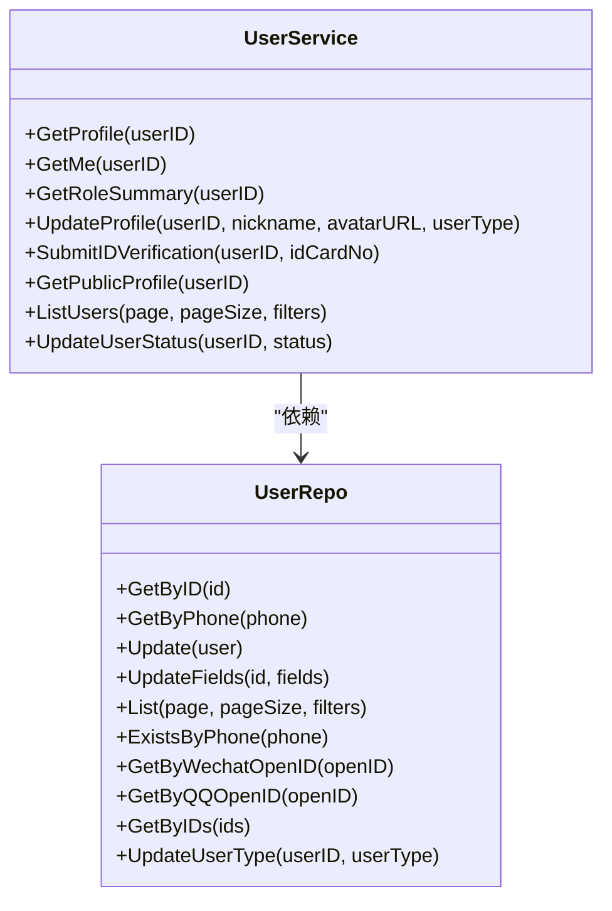
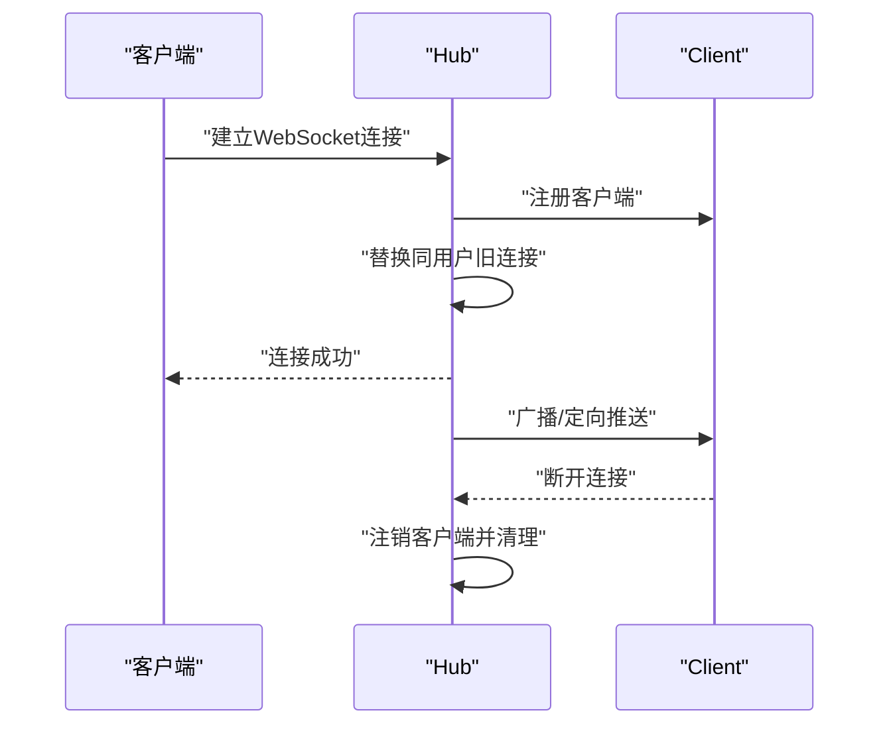
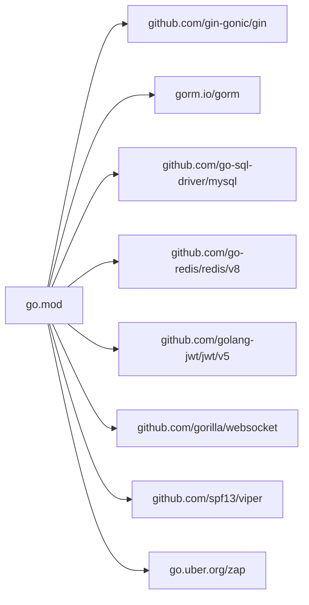

# 后端服务架构

<cite>
**本文引用的文件**
- [backend/cmd/server/main.go](file://backend/cmd/server/main.go)
- [backend/internal/config/config.go](file://backend/internal/config/config.go)
- [backend/internal/api/v1/router.go](file://backend/internal/api/v1/router.go)
- [backend/internal/api/v2/router.go](file://backend/internal/api/v2/router.go)
- [backend/internal/api/middleware/auth.go](file://backend/internal/api/middleware/auth.go)
- [backend/internal/api/middleware/cors.go](file://backend/internal/api/middleware/cors.go)
- [backend/internal/api/middleware/logger.go](file://backend/internal/api/middleware/logger.go)
- [backend/internal/api/middleware/pagination.go](file://backend/internal/api/middleware/pagination.go)
- [backend/internal/service/user_service.go](file://backend/internal/service/user_service.go)
- [backend/internal/repository/user_repo.go](file://backend/internal/repository/user_repo.go)
- [backend/internal/model/models.go](file://backend/internal/model/models.go)
- [backend/internal/websocket/hub.go](file://backend/internal/websocket/hub.go)
- [backend/internal/pkg/response/response.go](file://backend/internal/pkg/response/response.go)
- [backend/config.example.yaml](file://backend/config.example.yaml)
- [backend/go.mod](file://backend/go.mod)
</cite>

## 目录
1. [简介](#简介)
2. [项目结构](#项目结构)
3. [核心组件](#核心组件)
4. [架构总览](#架构总览)
5. [详细组件分析](#详细组件分析)
6. [依赖关系分析](#依赖关系分析)
7. [性能考量](#性能考量)
8. [故障排查指南](#故障排查指南)
9. [结论](#结论)
10. [附录](#附录)

## 简介
本文件面向无人机租赁平台后端服务，系统性梳理基于 Go 的分层架构设计与实现要点，涵盖 MVC 模式在 Gin 中的落地、服务层与数据访问层的职责分离、中间件体系（认证、CORS、日志、分页等）、v1 与 v2 API 版本管理策略、路由注册机制与请求处理流程、依赖注入与服务初始化顺序、配置管理策略、数据库连接池与 Redis 缓存集成、以及 WebSocket 实时通信架构。文档同时提供可视化图示，帮助读者快速把握组件间依赖与数据流向。

## 项目结构
后端采用模块化分层组织：
- cmd：应用入口与生命周期管理（含数据库初始化、Redis 初始化、WebSocket Hub 启动、中间件与路由注册、服务初始化与启动）
- internal/config：集中式配置加载与校验（YAML/Viper），支持环境变量覆盖
- internal/api：Web 层（Gin），包含 v1/v2 路由与处理器、中间件
- internal/service：业务服务层，封装领域逻辑与跨仓库协调
- internal/repository：数据访问层，封装 GORM 查询与更新
- internal/model：数据模型定义与表映射
- internal/websocket：WebSocket 实时通信 Hub
- internal/pkg：通用能力封装（JWT、短信、支付、推送、上传等）

图表来源
- [backend/cmd/server/main.go:52-266](file://backend/cmd/server/main.go#L52-L266)
- [backend/internal/config/config.go:16-521](file://backend/internal/config/config.go#L16-L521)
- [backend/internal/api/v1/router.go:58-634](file://backend/internal/api/v1/router.go#L58-L634)
- [backend/internal/api/v2/router.go:72-283](file://backend/internal/api/v2/router.go#L72-L283)
- [backend/internal/api/middleware/auth.go:22-106](file://backend/internal/api/middleware/auth.go#L22-L106)
- [backend/internal/api/middleware/cors.go:10-20](file://backend/internal/api/middleware/cors.go#L10-L20)
- [backend/internal/api/middleware/logger.go:10-32](file://backend/internal/api/middleware/logger.go#L10-L32)
- [backend/internal/api/middleware/pagination.go:14-71](file://backend/internal/api/middleware/pagination.go#L14-L71)
- [backend/internal/service/user_service.go:33-200](file://backend/internal/service/user_service.go#L33-L200)
- [backend/internal/repository/user_repo.go:9-97](file://backend/internal/repository/user_repo.go#L9-L97)
- [backend/internal/model/models.go:9-200](file://backend/internal/model/models.go#L9-L200)
- [backend/internal/websocket/hub.go:35-132](file://backend/internal/websocket/hub.go#L35-L132)

章节来源
- [backend/cmd/server/main.go:52-266](file://backend/cmd/server/main.go#L52-L266)
- [backend/internal/config/config.go:16-521](file://backend/internal/config/config.go#L16-L521)
- [backend/internal/api/v1/router.go:58-634](file://backend/internal/api/v1/router.go#L58-L634)
- [backend/internal/api/v2/router.go:72-283](file://backend/internal/api/v2/router.go#L72-L283)

## 核心组件
- 应用入口与初始化
  - 加载配置、校验、打印配置状态
  - 初始化数据库连接池（连接数、字符集）
  - 自动迁移模型表
  - 初始化 Redis 客户端并注入到中间件
  - 初始化 WebSocket Hub 并后台运行
  - 初始化各类服务与仓库（用户、无人机、订单、派单、飞行、支付、结算、消息、风控、保险、分析等）
  - 组装 v1/v2 处理器并注册路由
  - 启动 Gin 服务
- 配置管理
  - YAML 配置文件 + 环境变量覆盖
  - 严格的配置校验（含生产环境校验）
  - 支持上传目录创建、日志输出、CORS、OAuth、推送、支付等子配置
- 中间件体系
  - CORS、日志、认证（JWT + Redis 黑名单）、分页、TraceID（v2）
- 服务层与数据访问层
  - 服务层聚合业务逻辑，协调多个仓库
  - 仓库层封装 GORM 操作，提供统一查询/更新接口
- 实时通信
  - WebSocket Hub 管理连接、广播与定向推送

章节来源
- [backend/cmd/server/main.go:52-266](file://backend/cmd/server/main.go#L52-L266)
- [backend/internal/config/config.go:415-521](file://backend/internal/config/config.go#L415-L521)
- [backend/internal/api/middleware/auth.go:22-106](file://backend/internal/api/middleware/auth.go#L22-L106)
- [backend/internal/api/middleware/cors.go:10-20](file://backend/internal/api/middleware/cors.go#L10-L20)
- [backend/internal/api/middleware/logger.go:10-32](file://backend/internal/api/middleware/logger.go#L10-L32)
- [backend/internal/api/middleware/pagination.go:14-71](file://backend/internal/api/middleware/pagination.go#L14-L71)
- [backend/internal/service/user_service.go:33-200](file://backend/internal/service/user_service.go#L33-L200)
- [backend/internal/repository/user_repo.go:9-97](file://backend/internal/repository/user_repo.go#L9-L97)
- [backend/internal/websocket/hub.go:35-132](file://backend/internal/websocket/hub.go#L35-L132)

## 架构总览
整体采用“入口初始化 → Web 层（Gin）→ 中间件 → 处理器 → 服务层 → 仓库层 → 数据库/缓存”的请求链路；v1 与 v2 并行提供 API，共享部分服务与仓库，v2 引入 TraceID 与统一分页中间件。

图表来源
- [backend/cmd/server/main.go:249-266](file://backend/cmd/server/main.go#L249-L266)
- [backend/internal/api/v1/router.go:58-634](file://backend/internal/api/v1/router.go#L58-L634)
- [backend/internal/api/v2/router.go:72-283](file://backend/internal/api/v2/router.go#L72-L283)
- [backend/internal/api/middleware/auth.go:22-106](file://backend/internal/api/middleware/auth.go#L22-L106)
- [backend/internal/api/middleware/logger.go:10-32](file://backend/internal/api/middleware/logger.go#L10-L32)
- [backend/internal/api/middleware/pagination.go:14-71](file://backend/internal/api/middleware/pagination.go#L14-L71)

## 详细组件分析

### 入口与初始化流程
- 配置加载与校验：支持环境变量覆盖，提供生产环境严格校验
- 数据库初始化：设置连接池参数与字符集，执行模型自动迁移
- Redis 初始化：注入到认证中间件用于 Token 黑名单检查
- WebSocket Hub：初始化并后台运行，处理全局广播与定向推送
- 服务与仓库装配：按需注入用户、无人机、订单、派单、飞行、支付、结算、消息、风控、保险、分析等服务
- 路由注册：v1 与 v2 分别注册，v1 包含公开与鉴权路由、v2 引入 TraceID 与分页中间件
- 服务启动：设置运行模式并监听端口

图表来源
- [backend/cmd/server/main.go:52-266](file://backend/cmd/server/main.go#L52-L266)
- [backend/internal/config/config.go:415-464](file://backend/internal/config/config.go#L415-L464)

章节来源
- [backend/cmd/server/main.go:52-266](file://backend/cmd/server/main.go#L52-L266)
- [backend/internal/config/config.go:415-464](file://backend/internal/config/config.go#L415-L464)

### 配置管理策略
- 配置结构：服务器、数据库、Redis、JWT、上传、短信、支付、高德地图、WebSocket、日志、CORS、推送、OAuth 等
- 加载与覆盖：YAML 文件 + 环境变量（点号替换为下划线），支持生产环境严格校验
- 上传目录：启动时确保上传目录存在
- 配置打印：启动时输出关键配置项便于排障

章节来源
- [backend/internal/config/config.go:16-521](file://backend/internal/config/config.go#L16-L521)
- [backend/config.example.yaml:1-338](file://backend/config.example.yaml#L1-L338)

### 中间件体系
- CORS 中间件：允许跨域、方法与头部配置
- 日志中间件：记录状态码、方法、路径、查询、IP、耗时、响应体大小
- 认证中间件：解析 Authorization Bearer，校验 Token 黑名单与有效性，并注入用户上下文
- 分页中间件：解析 page/page_size，限制最大页大小，注入上下文供服务层使用
- TraceID 中间件（v2）：为请求生成唯一标识，便于链路追踪

章节来源
- [backend/internal/api/middleware/cors.go:10-20](file://backend/internal/api/middleware/cors.go#L10-L20)
- [backend/internal/api/middleware/logger.go:10-32](file://backend/internal/api/middleware/logger.go#L10-L32)
- [backend/internal/api/middleware/auth.go:22-106](file://backend/internal/api/middleware/auth.go#L22-L106)
- [backend/internal/api/middleware/pagination.go:14-71](file://backend/internal/api/middleware/pagination.go#L14-L71)
- [backend/internal/api/v2/router.go:74-75](file://backend/internal/api/v2/router.go#L74-L75)

### API 路由与版本管理
- v1 路由
  - 公开接口：验证码发送、注册、登录、刷新 Token、第三方登录
  - 支付回调：微信/支付宝/模拟回调
  - 鉴权接口：用户资料、无人机、需求/供给、订单、支付、消息、评价、地址、飞手、客户、派单、飞行、空域、结算、信用风控、保险、分析、管理员接口
  - 冻结写入保护：对部分旧版写入接口启用冻结中间件
- v2 路由
  - 引入 TraceID 与分页中间件
  - 提供精简的用户、客户、供给、需求、机主、飞手、订单、派单、飞行记录、通知、会话、分析、管理员等接口
  - 与 v1 共享部分服务与仓库，v2 作为演进目标

章节来源
- [backend/internal/api/v1/router.go:58-634](file://backend/internal/api/v1/router.go#L58-L634)
- [backend/internal/api/v2/router.go:72-283](file://backend/internal/api/v2/router.go#L72-L283)

### 处理器与服务层
- 处理器职责：参数校验、调用服务层、封装响应
- 服务层职责：业务编排、跨仓库协调、与外部服务交互（短信、支付、推送、OAuth 等）
- 示例：用户服务根据用户 ID 获取档案与角色汇总，整合用户、客户、机主、飞手等角色信息

图表来源
- [backend/internal/api/v1/auth/handler.go:11-215](file://backend/internal/api/v1/auth/handler.go#L11-L215)
- [backend/internal/service/auth_service.go:21-358](file://backend/internal/service/auth_service.go#L21-L358)

章节来源
- [backend/internal/api/v1/auth/handler.go:11-215](file://backend/internal/api/v1/auth/handler.go#L11-L215)
- [backend/internal/service/auth_service.go:21-358](file://backend/internal/service/auth_service.go#L21-L358)

### 服务层与数据访问层
- 服务层：以领域对象为中心，封装业务规则与流程，协调多个仓库
- 仓库层：封装 GORM 查询与更新，提供统一接口（如按 ID 获取、批量获取、分页列表、字段更新等）
- 模型层：定义实体与表映射，包含用户、客户、机主、飞手、无人机、订单、支付、结算、风控、保险、分析等大量表结构

图表来源
- [backend/internal/service/user_service.go:33-200](file://backend/internal/service/user_service.go#L33-L200)
- [backend/internal/repository/user_repo.go:9-97](file://backend/internal/repository/user_repo.go#L9-L97)

章节来源
- [backend/internal/service/user_service.go:33-200](file://backend/internal/service/user_service.go#L33-L200)
- [backend/internal/repository/user_repo.go:9-97](file://backend/internal/repository/user_repo.go#L9-L97)
- [backend/internal/model/models.go:9-200](file://backend/internal/model/models.go#L9-L200)

### 实时通信架构（WebSocket）
- Hub 管理客户端连接，支持广播与定向推送
- 消息结构包含类型、数据、时间戳与目标用户 ID
- 连接建立时互斥替换同一用户的旧连接，断开清理
- 提供在线状态查询与在线人数统计

图表来源
- [backend/internal/websocket/hub.go:35-132](file://backend/internal/websocket/hub.go#L35-L132)

章节来源
- [backend/internal/websocket/hub.go:35-132](file://backend/internal/websocket/hub.go#L35-L132)

### 响应与错误码
- 统一响应结构：包含 code、message、data、timestamp
- 分页响应结构：list、total、page、page_size
- 常见错误码：参数错误、未授权、禁止访问、未找到、服务器错误、数据库错误、Redis 错误、短信错误、支付错误、上传错误、验证码错误、订单错误等

章节来源
- [backend/internal/pkg/response/response.go:10-104](file://backend/internal/pkg/response/response.go#L10-L104)

## 依赖关系分析
- 模块依赖：Go 模块定义了 Gin、GORM、MySQL 驱动、Redis、JWT、WebSocket、Viper、Zap 等核心依赖
- 组件耦合：入口负责装配与编排，Web 层仅依赖处理器，处理器依赖服务层，服务层依赖仓库层，仓库层依赖模型层
- 外部集成：短信（阿里云/腾讯云/模拟）、支付（微信/支付宝）、推送（极光/模拟）、OAuth（微信/QQ）、高德地图

图表来源
- [backend/go.mod:5-21](file://backend/go.mod#L5-L21)

章节来源
- [backend/go.mod:5-21](file://backend/go.mod#L5-L21)

## 性能考量
- 数据库连接池：合理设置最大空闲与最大打开连接数，避免连接争用
- 字符集与排序规则：显式设置 utf8mb4 与排序规则，保证多语言与排序一致性
- 分页中间件：限制最大页大小，防止大页请求导致资源消耗
- Redis 缓存：验证码与会话缓存，注意 TTL 与键空间设计
- 日志与追踪：生产模式下减少冗余日志，v2 引入 TraceID 提升可观测性
- WebSocket：合理设置消息大小、写入超时与心跳周期，避免内存泄漏

## 故障排查指南
- 配置校验失败：检查 config.yaml 与环境变量覆盖，确认必填项与取值范围
- 数据库连接失败：核对 DSN、字符集、连接池参数与 MySQL 服务状态
- Redis 连接异常：核对地址、密码、DB 编号与网络连通性
- 认证失败：检查 JWT 密钥、过期时间、Token 黑名单键空间与中间件注入
- 路由不生效：确认路由注册顺序、中间件挂载位置与分组层级
- WebSocket 断连：检查 ping/pong 周期、写入超时与客户端重连策略

章节来源
- [backend/internal/config/config.go:437-464](file://backend/internal/config/config.go#L437-L464)
- [backend/cmd/server/main.go:268-292](file://backend/cmd/server/main.go#L268-L292)
- [backend/internal/api/middleware/auth.go:14-61](file://backend/internal/api/middleware/auth.go#L14-L61)
- [backend/internal/websocket/hub.go:45-97](file://backend/internal/websocket/hub.go#L45-L97)

## 结论
该后端服务采用清晰的分层架构与模块化设计，结合 Gin 的中间件体系与统一响应规范，实现了 v1/v2 并行演进与稳定的请求处理流程。通过集中式配置管理、完善的依赖注入与初始化顺序、数据库连接池与 Redis 缓存集成，以及 WebSocket 实时通信能力，满足了无人机租赁平台的业务复杂度与可运维性要求。建议在生产环境中严格执行配置校验、强化安全策略与监控告警，并持续优化分页与缓存策略以提升性能与稳定性。

## 附录
- 配置文件模板：提供完整字段说明与生产环境注意事项
- 依赖清单：Go 模块声明的核心依赖版本与用途

章节来源
- [backend/config.example.yaml:1-338](file://backend/config.example.yaml#L1-L338)
- [backend/go.mod:5-21](file://backend/go.mod#L5-L21)