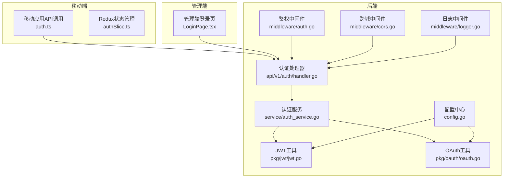
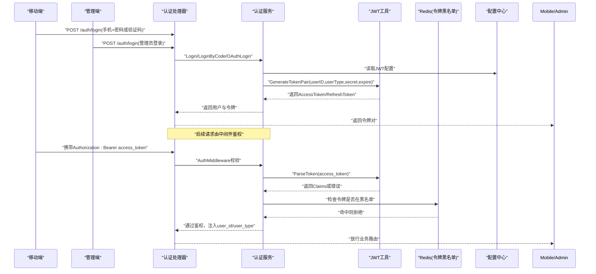
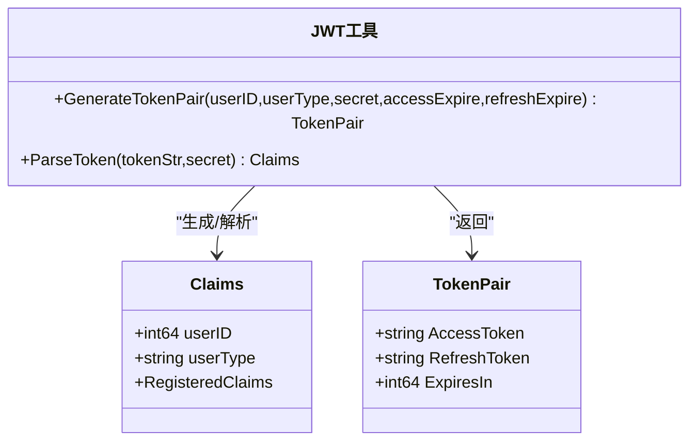
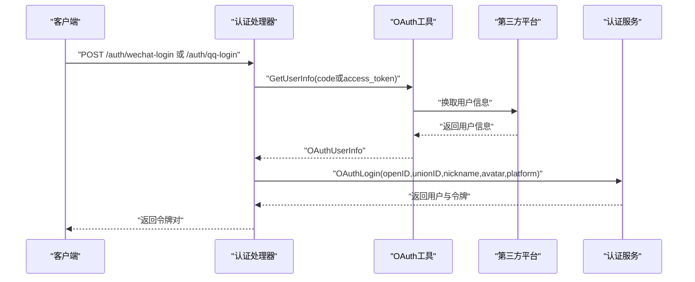
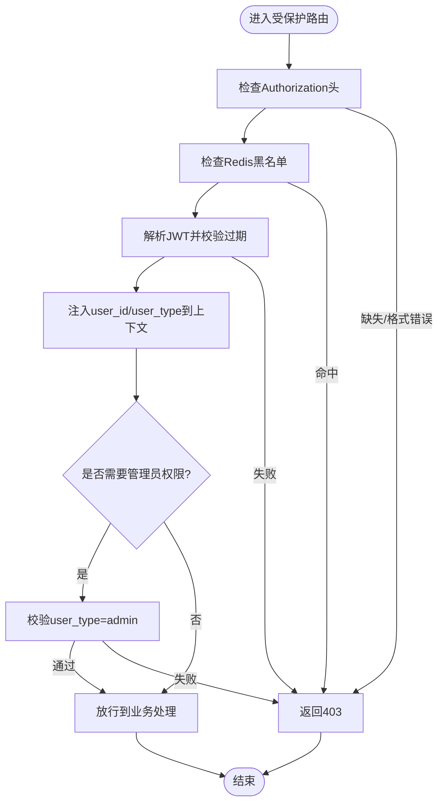
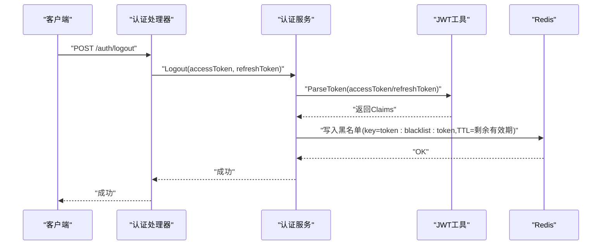
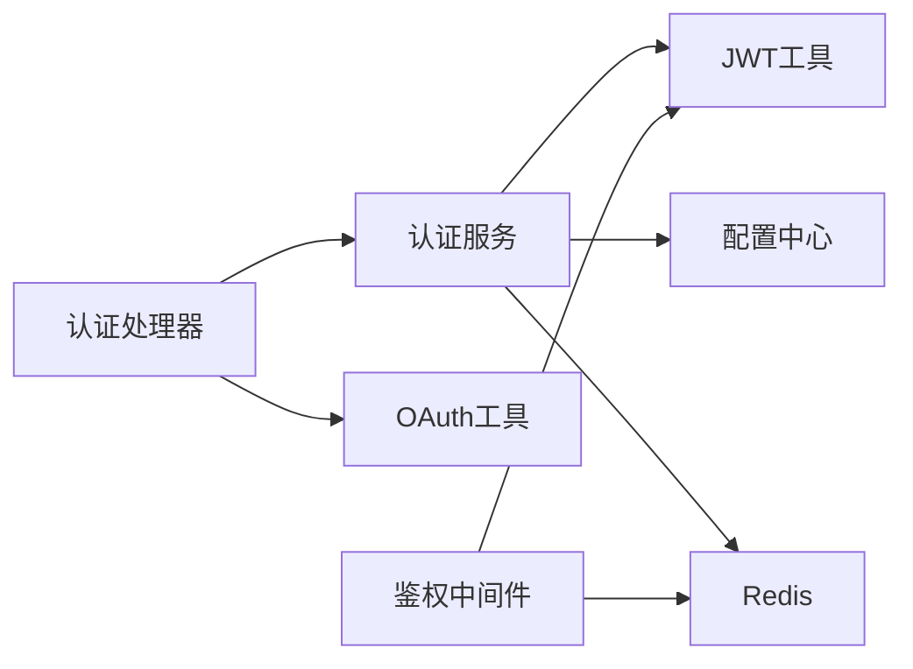

# 安全架构设计

<cite>
**本文引用的文件**
- [backend/internal/pkg/jwt/jwt.go](file://backend/internal/pkg/jwt/jwt.go)
- [backend/internal/pkg/oauth/oauth.go](file://backend/internal/pkg/oauth/oauth.go)
- [backend/internal/api/middleware/auth.go](file://backend/internal/api/middleware/auth.go)
- [backend/internal/api/middleware/cors.go](file://backend/internal/api/middleware/cors.go)
- [backend/internal/api/middleware/logger.go](file://backend/internal/api/middleware/logger.go)
- [backend/internal/config/config.go](file://backend/internal/config/config.go)
- [backend/internal/service/auth_service.go](file://backend/internal/service/auth_service.go)
- [backend/internal/api/v1/auth/handler.go](file://backend/internal/api/v1/auth/handler.go)
- [mobile/src/services/auth.ts](file://mobile/src/services/auth.ts)
- [mobile/src/store/slices/authSlice.ts](file://mobile/src/store/slices/authSlice.ts)
- [admin/src/pages/LoginPage.tsx](file://admin/src/pages/LoginPage.tsx)
</cite>

## 目录
1. [引言](#引言)
2. [项目结构](#项目结构)
3. [核心组件](#核心组件)
4. [架构总览](#架构总览)
5. [详细组件分析](#详细组件分析)
6. [依赖分析](#依赖分析)
7. [性能考虑](#性能考虑)
8. [故障排查指南](#故障排查指南)
9. [结论](#结论)
10. [附录](#附录)

## 引言
本文件面向无人机租赁平台的安全架构设计，系统化阐述认证授权、第三方登录、权限控制、中间件防护、请求验证、数据加密、会话与令牌管理、API防护、审计与合规等关键主题。文档以代码为依据，结合架构图与流程图，帮助技术与非技术读者理解平台如何在工程层面落实安全策略。

## 项目结构
后端采用 Go Gin 框架，按领域分层组织，安全相关能力集中在以下模块：
- 认证与授权：JWT 工具、OAuth 第三方登录、鉴权中间件、服务层逻辑
- 中间件：CORS、日志、鉴权
- 配置：集中式配置与校验，含 JWT、OAuth、CORS 等
- 前端与移动端：移动端与管理端分别调用后端认证接口，维护本地令牌

**图表来源**
- [backend/internal/api/v1/auth/handler.go:1-215](file://backend/internal/api/v1/auth/handler.go#L1-L215)
- [backend/internal/service/auth_service.go:1-358](file://backend/internal/service/auth_service.go#L1-L358)
- [backend/internal/pkg/jwt/jwt.go:1-87](file://backend/internal/pkg/jwt/jwt.go#L1-L87)
- [backend/internal/pkg/oauth/oauth.go:1-262](file://backend/internal/pkg/oauth/oauth.go#L1-L262)
- [backend/internal/api/middleware/auth.go:1-106](file://backend/internal/api/middleware/auth.go#L1-L106)
- [backend/internal/api/middleware/cors.go:1-20](file://backend/internal/api/middleware/cors.go#L1-L20)
- [backend/internal/api/middleware/logger.go:1-32](file://backend/internal/api/middleware/logger.go#L1-L32)
- [backend/internal/config/config.go:1-521](file://backend/internal/config/config.go#L1-L521)
- [mobile/src/services/auth.ts:1-45](file://mobile/src/services/auth.ts#L1-L45)
- [mobile/src/store/slices/authSlice.ts:1-65](file://mobile/src/store/slices/authSlice.ts#L1-L65)
- [admin/src/pages/LoginPage.tsx:1-53](file://admin/src/pages/LoginPage.tsx#L1-L53)

**章节来源**
- [backend/internal/api/v1/auth/handler.go:1-215](file://backend/internal/api/v1/auth/handler.go#L1-L215)
- [backend/internal/service/auth_service.go:1-358](file://backend/internal/service/auth_service.go#L1-L358)
- [backend/internal/pkg/jwt/jwt.go:1-87](file://backend/internal/pkg/jwt/jwt.go#L1-L87)
- [backend/internal/pkg/oauth/oauth.go:1-262](file://backend/internal/pkg/oauth/oauth.go#L1-L262)
- [backend/internal/api/middleware/auth.go:1-106](file://backend/internal/api/middleware/auth.go#L1-L106)
- [backend/internal/api/middleware/cors.go:1-20](file://backend/internal/api/middleware/cors.go#L1-L20)
- [backend/internal/api/middleware/logger.go:1-32](file://backend/internal/api/middleware/logger.go#L1-L32)
- [backend/internal/config/config.go:1-521](file://backend/internal/config/config.go#L1-L521)
- [mobile/src/services/auth.ts:1-45](file://mobile/src/services/auth.ts#L1-L45)
- [mobile/src/store/slices/authSlice.ts:1-65](file://mobile/src/store/slices/authSlice.ts#L1-L65)
- [admin/src/pages/LoginPage.tsx:1-53](file://admin/src/pages/LoginPage.tsx#L1-L53)

## 核心组件
- JWT 工具：定义声明结构、生成访问/刷新令牌、解析与校验令牌
- OAuth 工具：封装微信/QQ登录流程，获取第三方用户信息
- 鉴权中间件：统一校验 Authorization 头、黑名单检查、注入用户上下文
- 认证服务：密码哈希、验证码发送与校验、注册/登录/刷新/登出、第三方登录
- 配置中心：集中加载与校验 JWT/OAuth/CORS 等配置
- 前端/移动端：调用认证接口并持久化令牌

**章节来源**
- [backend/internal/pkg/jwt/jwt.go:10-87](file://backend/internal/pkg/jwt/jwt.go#L10-L87)
- [backend/internal/pkg/oauth/oauth.go:14-262](file://backend/internal/pkg/oauth/oauth.go#L14-L262)
- [backend/internal/api/middleware/auth.go:22-106](file://backend/internal/api/middleware/auth.go#L22-L106)
- [backend/internal/service/auth_service.go:21-358](file://backend/internal/service/auth_service.go#L21-L358)
- [backend/internal/config/config.go:132-406](file://backend/internal/config/config.go#L132-L406)
- [mobile/src/services/auth.ts:10-45](file://mobile/src/services/auth.ts#L10-L45)
- [mobile/src/store/slices/authSlice.ts:22-65](file://mobile/src/store/slices/authSlice.ts#L22-L65)
- [admin/src/pages/LoginPage.tsx:10-53](file://admin/src/pages/LoginPage.tsx#L10-L53)

## 架构总览
下图展示认证与授权的整体交互：移动端/管理端发起登录请求，后端通过服务层完成校验与令牌签发，中间件负责拦截与鉴权，JWT 工具与配置中心提供支撑。

**图表来源**
- [backend/internal/api/v1/auth/handler.go:76-107](file://backend/internal/api/v1/auth/handler.go#L76-L107)
- [backend/internal/service/auth_service.go:159-182](file://backend/internal/service/auth_service.go#L159-L182)
- [backend/internal/pkg/jwt/jwt.go:27-67](file://backend/internal/pkg/jwt/jwt.go#L27-L67)
- [backend/internal/api/middleware/auth.go:22-61](file://backend/internal/api/middleware/auth.go#L22-L61)
- [backend/internal/config/config.go:132-162](file://backend/internal/config/config.go#L132-L162)

## 详细组件分析

### JWT 认证授权机制
- 声明结构：包含用户标识、用户类型、标准声明（签发时间、过期时间、发行方）
- 令牌生成：同时生成访问令牌与刷新令牌，分别设置过期时间
- 令牌解析：校验签名与过期时间，区分“过期”与“无效”
- 令牌对：接口返回 access_token 与 refresh_token，并包含过期秒数

**图表来源**
- [backend/internal/pkg/jwt/jwt.go:10-25](file://backend/internal/pkg/jwt/jwt.go#L10-L25)
- [backend/internal/pkg/jwt/jwt.go:27-67](file://backend/internal/pkg/jwt/jwt.go#L27-L67)
- [backend/internal/pkg/jwt/jwt.go:69-87](file://backend/internal/pkg/jwt/jwt.go#L69-L87)

**章节来源**
- [backend/internal/pkg/jwt/jwt.go:10-87](file://backend/internal/pkg/jwt/jwt.go#L10-L87)
- [backend/internal/config/config.go:132-162](file://backend/internal/config/config.go#L132-L162)

### OAuth 第三方登录集成
- 支持平台：微信、QQ
- 流程要点：
  - 微信：code 换取 access_token/openid，再换取用户信息
  - QQ：通过 access_token 获取 openid，再换取用户信息
- 返回统一结构：包含 open_id、union_id、昵称、头像、性别、平台标识

**图表来源**
- [backend/internal/api/v1/auth/handler.go:146-214](file://backend/internal/api/v1/auth/handler.go#L146-L214)
- [backend/internal/pkg/oauth/oauth.go:61-144](file://backend/internal/pkg/oauth/oauth.go#L61-L144)
- [backend/internal/pkg/oauth/oauth.go:177-261](file://backend/internal/pkg/oauth/oauth.go#L177-L261)
- [backend/internal/service/auth_service.go:272-325](file://backend/internal/service/auth_service.go#L272-L325)

**章节来源**
- [backend/internal/pkg/oauth/oauth.go:14-262](file://backend/internal/pkg/oauth/oauth.go#L14-L262)
- [backend/internal/api/v1/auth/handler.go:146-214](file://backend/internal/api/v1/auth/handler.go#L146-L214)
- [backend/internal/service/auth_service.go:272-325](file://backend/internal/service/auth_service.go#L272-L325)

### 权限控制策略
- 基于角色的访问控制：中间件注入 user_type，管理员路由使用专用中间件校验 admin 角色
- 路由级保护：业务路由挂载 AuthMiddleware；管理端路由可叠加 AdminMiddleware
- 统一响应：v1/v2 路由根据前缀选择不同响应格式

**图表来源**
- [backend/internal/api/middleware/auth.go:22-106](file://backend/internal/api/middleware/auth.go#L22-L106)

**章节来源**
- [backend/internal/api/middleware/auth.go:22-106](file://backend/internal/api/middleware/auth.go#L22-L106)

### 中间件安全防护体系
- 鉴权中间件：统一校验 Bearer 令牌、黑名单检查、注入用户上下文
- CORS 中间件：允许指定方法与头部，支持凭证与缓存预检
- 日志中间件：记录请求状态、耗时、IP、请求体大小等，便于审计

**章节来源**
- [backend/internal/api/middleware/auth.go:14-106](file://backend/internal/api/middleware/auth.go#L14-L106)
- [backend/internal/api/middleware/cors.go:10-20](file://backend/internal/api/middleware/cors.go#L10-L20)
- [backend/internal/api/middleware/logger.go:10-32](file://backend/internal/api/middleware/logger.go#L10-L32)

### 请求验证机制
- 参数绑定与校验：处理器对请求体进行结构化绑定与必填/长度约束
- 业务前置校验：验证码发送频率限制、验证码有效期与一致性校验
- 错误码与提示：针对短信、参数、未授权等场景返回明确错误码

**章节来源**
- [backend/internal/api/v1/auth/handler.go:21-68](file://backend/internal/api/v1/auth/handler.go#L21-L68)
- [backend/internal/service/auth_service.go:89-124](file://backend/internal/service/auth_service.go#L89-L124)

### 数据加密策略
- 密码安全：bcrypt 哈希存储，比较时使用安全算法
- 传输安全：建议生产环境启用 HTTPS（配置中未显式强制，需在网关/反向代理层保障）
- 敏感字段：前端仅保存令牌，后端不落盘明文密码

**章节来源**
- [backend/internal/service/auth_service.go:135-138](file://backend/internal/service/auth_service.go#L135-L138)
- [backend/internal/config/config.go:466-489](file://backend/internal/config/config.go#L466-L489)

### 会话管理与令牌生命周期
- 令牌类型：访问令牌（短期）、刷新令牌（长期）
- 刷新流程：使用刷新令牌换取新的令牌对
- 注销与黑名单：登出时将当前访问/刷新令牌写入 Redis 黑名单，TTL 与原令牌剩余有效期一致
- 自动注册：第三方登录若用户不存在则自动创建并补齐默认档案

**图表来源**
- [backend/internal/api/v1/auth/handler.go:128-144](file://backend/internal/api/v1/auth/handler.go#L128-L144)
- [backend/internal/service/auth_service.go:233-270](file://backend/internal/service/auth_service.go#L233-L270)
- [backend/internal/pkg/jwt/jwt.go:69-87](file://backend/internal/pkg/jwt/jwt.go#L69-L87)

**章节来源**
- [backend/internal/service/auth_service.go:159-231](file://backend/internal/service/auth_service.go#L159-L231)
- [backend/internal/service/auth_service.go:233-270](file://backend/internal/service/auth_service.go#L233-L270)

### API 安全防护
- 身份鉴别：统一 Bearer 令牌，中间件拦截未携带或非法令牌请求
- 速率限制：验证码发送频率限制（Redis TTL 控制）
- 路由保护：业务路由均需通过鉴权中间件
- 响应一致性：v1/v2 路由返回格式差异，便于前端适配

**章节来源**
- [backend/internal/api/middleware/auth.go:22-61](file://backend/internal/api/middleware/auth.go#L22-L61)
- [backend/internal/service/auth_service.go:89-124](file://backend/internal/service/auth_service.go#L89-L124)
- [backend/internal/api/v1/auth/handler.go:76-107](file://backend/internal/api/v1/auth/handler.go#L76-L107)

### CSRF/XSS 防护
- CSRF：后端未实现传统 Cookie + CSRF Token 机制；建议在前端/网关层引入 SameSite Cookie、CSP、Referer 校验等
- XSS：后端未发现直接输出不可信输入的逻辑；建议前端渲染时进行内容转义，后端响应头增加 CSP

[本节为通用安全建议，不直接分析具体文件，故无“章节来源”]

### 敏感数据保护与审计日志
- 敏感数据：手机号、头像URL、第三方 OpenID/UnionID 等
- 脱敏策略：日志中避免打印完整敏感字段；必要时仅打印脱敏片段
- 审计日志：日志中间件记录请求路径、方法、状态码、耗时、IP、请求体大小，可用于安全审计

**章节来源**
- [backend/internal/api/middleware/logger.go:10-32](file://backend/internal/api/middleware/logger.go#L10-L32)

### 合规性与隐私保护
- 配置校验：生产模式必须为 release，短信不得使用 mock，至少配置一种支付方式
- 隐私：第三方登录返回信息按最小化原则使用，避免留存无关数据

**章节来源**
- [backend/internal/config/config.go:466-489](file://backend/internal/config/config.go#L466-L489)

## 依赖分析
- 组件耦合：
  - 认证处理器依赖认证服务与 OAuth 工具
  - 认证服务依赖 JWT 工具、配置中心、Redis、短信服务
  - 鉴权中间件依赖 JWT 工具与 Redis
- 外部依赖：
  - Gin 路由框架、Redis 客户端、Zap 日志、Viper 配置、bcrypt、GORM、gRPC/HTTP 客户端

**图表来源**
- [backend/internal/api/v1/auth/handler.go:11-19](file://backend/internal/api/v1/auth/handler.go#L11-L19)
- [backend/internal/service/auth_service.go:21-41](file://backend/internal/service/auth_service.go#L21-L41)
- [backend/internal/api/middleware/auth.go:14-20](file://backend/internal/api/middleware/auth.go#L14-L20)

**章节来源**
- [backend/internal/api/v1/auth/handler.go:11-19](file://backend/internal/api/v1/auth/handler.go#L11-L19)
- [backend/internal/service/auth_service.go:21-41](file://backend/internal/service/auth_service.go#L21-L41)
- [backend/internal/api/middleware/auth.go:14-20](file://backend/internal/api/middleware/auth.go#L14-L20)

## 性能考虑
- 令牌解析：JWT 解析为 O(1)，Redis 黑名单查询为 O(1)
- 缓存利用：验证码与黑名单使用 Redis，降低数据库压力
- 日志开销：建议生产环境按采样率输出，避免过多 IO

[本节为通用指导，不直接分析具体文件，故无“章节来源”]

## 故障排查指南
- 令牌过期/无效：检查 JWT 配置与签名密钥，确认客户端是否及时刷新
- 黑名单导致被拒：确认登出流程是否正确写入黑名单，TTL 是否合理
- 第三方登录失败：检查 OAuth 配置与网络连通性，查看日志错误码
- CORS 问题：核对 AllowOrigins/AllowHeaders/AllowCredentials 配置

**章节来源**
- [backend/internal/api/middleware/auth.go:40-48](file://backend/internal/api/middleware/auth.go#L40-L48)
- [backend/internal/pkg/jwt/jwt.go:22-25](file://backend/internal/pkg/jwt/jwt.go#L22-L25)
- [backend/internal/config/config.go:398-406](file://backend/internal/config/config.go#L398-L406)

## 结论
平台通过 JWT 实现轻量态的认证授权，配合 Redis 黑名单实现令牌撤销与快速生效；OAuth 工具抽象微信/QQ登录流程；中间件统一拦截与鉴权，辅以 CORS 与日志中间件形成基础安全防线。建议在现有基础上补充 CSRF/XSS 防护、HTTPS 强制、CSP 策略与更严格的速率限制，以满足生产环境的安全与合规要求。

## 附录
- 前端令牌持久化：
  - 移动端：Redux 状态管理保存 access_token/refresh_token
  - 管理端：登录成功后将令牌写入本地存储并在后续请求中携带
- 配置要点：
  - JWT 密钥长度与占位符检测
  - OAuth 平台 AppID/AppSecret 配置
  - CORS 允许范围与凭证开关

**章节来源**
- [mobile/src/store/slices/authSlice.ts:26-33](file://mobile/src/store/slices/authSlice.ts#L26-L33)
- [admin/src/pages/LoginPage.tsx:16-23](file://admin/src/pages/LoginPage.tsx#L16-L23)
- [backend/internal/config/config.go:139-162](file://backend/internal/config/config.go#L139-L162)
- [backend/internal/config/config.go:398-406](file://backend/internal/config/config.go#L398-L406)