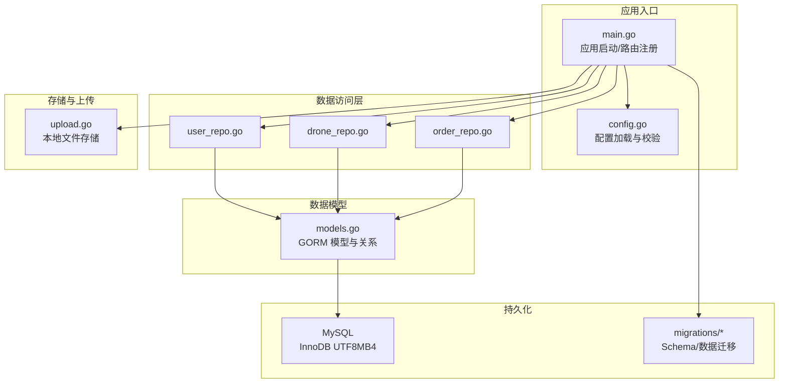
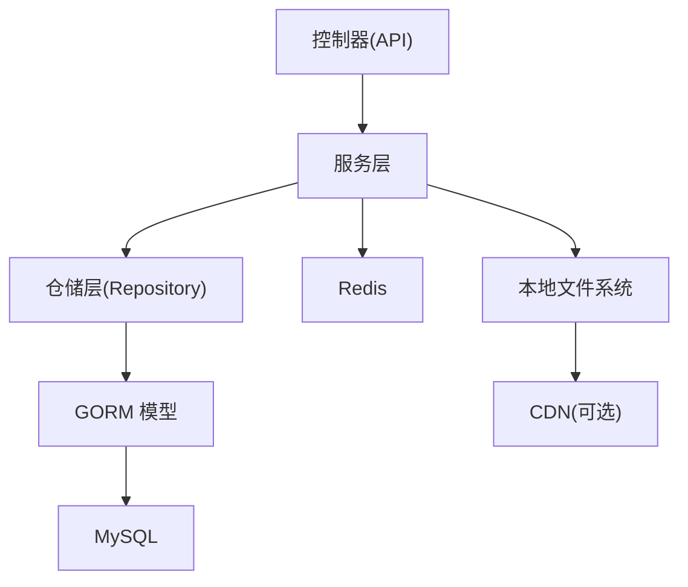
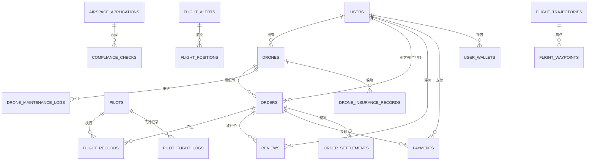
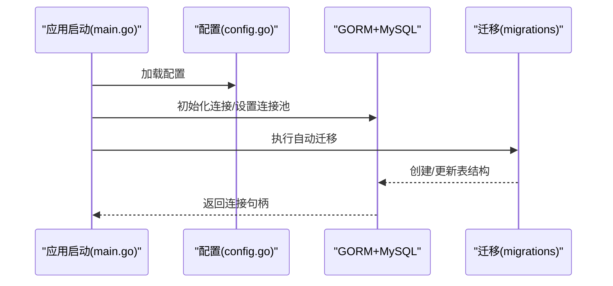
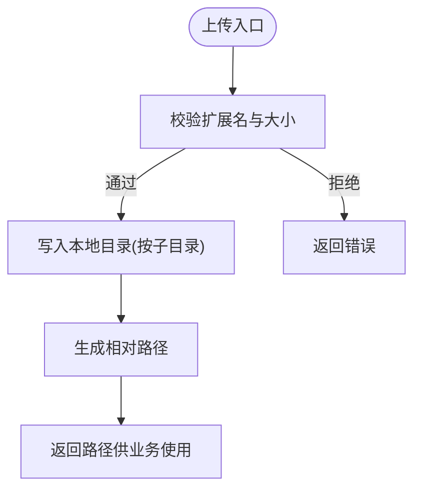
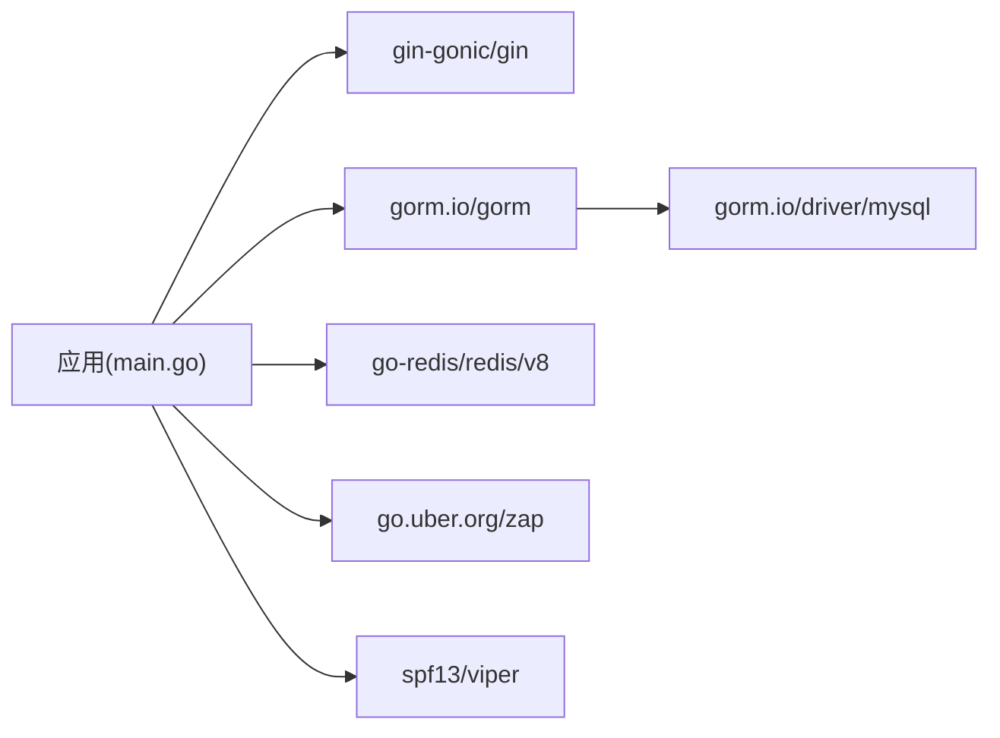

# 数据架构设计

<cite>
**本文引用的文件**
- [models.go](file://backend/internal/model/models.go)
- [config.go](file://backend/internal/config/config.go)
- [order_repo.go](file://backend/internal/repository/order_repo.go)
- [drone_repo.go](file://backend/internal/repository/drone_repo.go)
- [user_repo.go](file://backend/internal/repository/user_repo.go)
- [001_init_schema.sql](file://backend/migrations/001_init_schema.sql)
- [upload.go](file://backend/internal/pkg/upload/upload.go)
- [main.go](file://backend/cmd/server/main.go)
- [go.mod](file://backend/go.mod)
</cite>

## 目录
1. [简介](#简介)
2. [项目结构](#项目结构)
3. [核心组件](#核心组件)
4. [架构总览](#架构总览)
5. [详细组件分析](#详细组件分析)
6. [依赖分析](#依赖分析)
7. [性能考虑](#性能考虑)
8. [故障排查指南](#故障排查指南)
9. [结论](#结论)
10. [附录](#附录)

## 简介
本文件面向无人机租赁平台的数据架构设计，围绕基于 GORM 的数据模型、实体关系映射、分层数据访问模式、Repository 模式实现、持久化策略、MySQL 索引与查询优化、事务管理、文件上传与存储、CDN 集成、数据迁移与版本管理、备份恢复、缓存策略（Redis）、数据一致性与读写分离等方面进行全面阐述，并提供 ER 图与数据流图帮助理解。

## 项目结构
后端采用清晰的分层架构：
- 应用入口与配置：cmd/server/main.go、internal/config/config.go
- 数据模型：internal/model/models.go
- 数据访问层：internal/repository/*
- 业务服务层：internal/service/*
- API 层：internal/api/v1、internal/api/v2
- 存储与上传：internal/pkg/upload/upload.go
- 数据迁移：backend/migrations/*



**图表来源**
- [main.go:52-266](file://backend/cmd/server/main.go#L52-L266)
- [config.go:16-95](file://backend/internal/config/config.go#L16-L95)
- [models.go:9-2701](file://backend/internal/model/models.go#L9-L2701)
- [order_repo.go:10-252](file://backend/internal/repository/order_repo.go#L10-L252)
- [drone_repo.go:9-201](file://backend/internal/repository/drone_repo.go#L9-L201)
- [user_repo.go:9-97](file://backend/internal/repository/user_repo.go#L9-L97)
- [upload.go:15-75](file://backend/internal/pkg/upload/upload.go#L15-L75)

**章节来源**
- [main.go:52-266](file://backend/cmd/server/main.go#L52-L266)
- [config.go:16-95](file://backend/internal/config/config.go#L16-L95)

## 核心组件
- 数据模型与实体关系：以 GORM 结构体定义为核心，通过标签声明表名、索引、字段类型与约束；通过关联字段建立一对一/一对多关系。
- Repository 模式：每个实体对应一个仓库（Repo），封装 CRUD 与复杂查询，隔离底层 ORM 细节。
- 配置与连接：统一从配置加载数据库 DSN、连接池参数，自动迁移模型。
- 文件上传：本地文件系统存储，支持扩展 CDN。
- 缓存：Redis 用于会话、鉴权黑名单等。

**章节来源**
- [models.go:9-2701](file://backend/internal/model/models.go#L9-L2701)
- [order_repo.go:10-252](file://backend/internal/repository/order_repo.go#L10-L252)
- [drone_repo.go:9-201](file://backend/internal/repository/drone_repo.go#L9-L201)
- [user_repo.go:9-97](file://backend/internal/repository/user_repo.go#L9-L97)
- [config.go:74-95](file://backend/internal/config/config.go#L74-L95)
- [upload.go:15-75](file://backend/internal/pkg/upload/upload.go#L15-L75)

## 架构总览
整体采用“控制器-服务-仓储-模型”的分层，数据持久化通过 GORM + MySQL 实现，Redis 提供缓存与鉴权支持，文件上传采用本地存储并预留 CDN 扩展点。



**图表来源**
- [main.go:109-133](file://backend/cmd/server/main.go#L109-L133)
- [main.go:182-204](file://backend/cmd/server/main.go#L182-L204)
- [upload.go:29-65](file://backend/internal/pkg/upload/upload.go#L29-L65)

## 详细组件分析

### 数据模型与实体关系映射
- 用户(User)：手机号唯一、状态、类型、实名状态等，支撑多角色（租客、机主、飞手、管理员）。
- 无人机(Drone)：归属机主、品牌型号、载重/续航/距离、图片与特性、适航/保险/维护状态、城市索引、可用状态等。
- 订单(Order)：关联需求、无人机、机主、飞手、租客，含状态、金额、飞行指标、调度字段等。
- 评价(Review)、消息(Message)、支付(Payment)、退款(Refund)、争议(DisputeRecord)等支撑交易闭环。
- 飞手(Pilot)、绑定关系、飞行日志、证书等完善飞手生态。
- 空域管理(airspace)、合规检查(compliance)、飞行监控(flight monitor)、轨迹与航点等保障安全运行。
- 支付结算(OrderSettlement)、钱包(UserWallet)、流水(WalletTransaction)、提现(WithdrawalRecord)、定价配置(PricingConfig)完善财务体系。
- 信用风控(CreditScore/RiskControl/Violation/Blacklist/Deposit)、保险(InsurancePolicy/Claim)完善风控与保障。



**图表来源**
- [models.go:9-2701](file://backend/internal/model/models.go#L9-L2701)

**章节来源**
- [models.go:9-2701](file://backend/internal/model/models.go#L9-L2701)

### 分层数据访问模式与 Repository 模式
- 仓储接口职责：封装具体实体的增删改查、复杂查询、统计与聚合。
- 示例：
  - 用户仓储：按 ID/手机号查询、更新、批量查询、去重判断等。
  - 无人机仓储：按机主分页、附近筛选、评级更新、维护与保险记录查询等。
  - 订单仓储：按飞手/用户过滤、状态统计、时间线查询、飞行同步场景查询等。

```mermaid
classDiagram
class UserRepo {
+DB() *gorm.DB
+Create(*User) error
+GetByID(int64) (*User, error)
+GetByPhone(string) (*User, error)
+Update(*User) error
+UpdateFields(int64, map[string]interface{}) error
+List(int,int,map[string]interface{}) ([]User,int64,error)
+ExistsByPhone(string) (bool,error)
+GetByWechatOpenID(string) (*User,error)
+GetByQQOpenID(string) (*User,error)
+GetByIDs([]int64) (map[int64]*User,error)
+UpdateUserType(int64,string) error
}
class DroneRepo {
+DB() *gorm.DB
+Create(*Drone) error
+GetByID(int64) (*Drone,error)
+Update(*Drone) error
+UpdateFields(int64,map[string]interface{}) error
+Delete(int64) error
+ListByOwner(int64,int,int) ([]Drone,int64,error)
+CountByOwner(int64) (int64,error)
+CountMarketplaceEligibleByOwner(int64) (int64,error)
+List(int,int,map[string]interface{}) ([]Drone,int64,error)
+FindNearby(float64,float64,float64,int,int) ([]Drone,int64,error)
+UpdateRating(int64) error
+CreateMaintenanceLog(*DroneMaintenanceLog) error
+GetMaintenanceLogs(int64,int,int) ([]DroneMaintenanceLog,int64,error)
+CreateInsuranceRecord(*DroneInsuranceRecord) error
+GetInsuranceRecords(int64) ([]DroneInsuranceRecord,error)
+GetActiveInsurance(int64,string) (*DroneInsuranceRecord,error)
+FindFullyCertifiedDrones(float64,float64,float64,int,int) ([]Drone,int64,error)
}
class OrderRepo {
+DB() *gorm.DB
+Create(*Order) error
+GetByID(int64) (*Order,error)
+GetByOrderNo(string) (*Order,error)
+Update(*Order) error
+UpdateFields(int64,map[string]interface{}) error
+UpdateStatus(int64,string) error
+UpdateStatusWithFields(int64,int64,string,map[string]interface{}) error
+ListByPilot(int64,string,int,int) ([]Order,int64,error)
+ListByUser(int64,string,string,int,int) ([]Order,int64,error)
+List(int,int,map[string]interface{}) ([]Order,int64,error)
+ListOrdersForFlightSyncByPilotUser(int64) ([]Order,error)
+AddTimeline(*OrderTimeline) error
+GetTimeline(int64) ([]OrderTimeline,error)
+GetLatestTimeline(int64) (*OrderTimeline,error)
+CountByStatus(string) (int64,error)
+GetStatistics() (map[string]int64,error)
}
```

**图表来源**
- [user_repo.go:9-97](file://backend/internal/repository/user_repo.go#L9-L97)
- [drone_repo.go:9-201](file://backend/internal/repository/drone_repo.go#L9-L201)
- [order_repo.go:10-252](file://backend/internal/repository/order_repo.go#L10-L252)

**章节来源**
- [user_repo.go:9-97](file://backend/internal/repository/user_repo.go#L9-L97)
- [drone_repo.go:9-201](file://backend/internal/repository/drone_repo.go#L9-L201)
- [order_repo.go:10-252](file://backend/internal/repository/order_repo.go#L10-L252)

### 数据持久化策略与事务管理
- 连接与迁移：应用启动时加载配置，初始化数据库连接并设置连接池参数，随后执行自动迁移。
- 事务：在需要强一致性的场景（如订单状态变更与资金结算联动）应显式开启事务，确保原子性。
- 读写分离：当前未见读写分离实现，建议在高并发场景下引入只读副本与主从复制策略。



**图表来源**
- [main.go:268-292](file://backend/cmd/server/main.go#L268-L292)
- [main.go:294-389](file://backend/cmd/server/main.go#L294-L389)
- [config.go:74-95](file://backend/internal/config/config.go#L74-L95)

**章节来源**
- [main.go:268-292](file://backend/cmd/server/main.go#L268-L292)
- [main.go:294-389](file://backend/cmd/server/main.go#L294-L389)

### MySQL 索引设计与查询优化
- 唯一索引：用户手机号、无人机序列号、订单号、支付单号等。
- 普通索引：用户类型/状态、无人机归属/城市/可用状态、订单状态/类型/用户字段、消息会话/收发方等。
- 查询优化建议：
  - 使用预加载(Preload)避免 N+1 查询，但需控制关联深度。
  - 对高频过滤字段建立复合索引（如订单状态+创建时间）。
  - 分页查询使用覆盖索引，避免回表。
  - 距离查询采用地理函数时，建议配合空间索引或预计算距离字段。

**章节来源**
- [models.go:9-2701](file://backend/internal/model/models.go#L9-L2701)
- [001_init_schema.sql:7-314](file://backend/migrations/001_init_schema.sql#L7-L314)

### 文件上传架构、存储策略与 CDN 集成
- 当前实现：本地文件系统存储，按子目录组织，返回相对路径，便于静态资源服务。
- CDN 集成：可在现有上传服务基础上扩展，将文件写入对象存储（如 OSS/COS），并返回 CDN URL；同时在业务侧记录原始文件名与 CDN 地址映射。



**图表来源**
- [upload.go:29-65](file://backend/internal/pkg/upload/upload.go#L29-L65)

**章节来源**
- [upload.go:15-75](file://backend/internal/pkg/upload/upload.go#L15-L75)

### 数据迁移策略、版本管理与备份恢复
- 迁移策略：通过 migrations 目录下的 SQL 脚本进行版本化演进，先初始化再增量扩展。
- 版本管理：脚本命名采用递增序号，包含初始化与各阶段增量。
- 备份恢复：生产环境建议结合数据库备份工具与逻辑导出，配合迁移脚本进行灰度发布与回滚。

**章节来源**
- [001_init_schema.sql:1-314](file://backend/migrations/001_init_schema.sql#L1-L314)

### 缓存策略（Redis）、数据一致性与读写分离
- 缓存用途：会话、鉴权黑名单、热点数据缓存（建议按业务模块细化键空间）。
- 一致性：缓存更新采用“先更新数据库，再删除缓存”策略，避免脏读；读多写少场景可采用“读缓存命中，未命中再回源数据库”。
- 读写分离：建议主库写、从库读，热点表可做分片或分区。

**章节来源**
- [main.go:95-108](file://backend/cmd/server/main.go#L95-L108)
- [config.go:101-126](file://backend/internal/config/config.go#L101-L126)

## 依赖分析
- ORM 与驱动：gorm.io/gorm、gorm.io/driver/mysql
- Web 框架：gin-gonic/gin
- 缓存：go-redis/redis/v8
- 日志：uber.org/zap
- 加解密：golang.org/x/crypto
- YAML 解析：spf13/viper



**图表来源**
- [go.mod:5-21](file://backend/go.mod#L5-L21)
- [main.go:3-50](file://backend/cmd/server/main.go#L3-L50)

**章节来源**
- [go.mod:5-21](file://backend/go.mod#L5-L21)

## 性能考虑
- 连接池：合理设置最大空闲/活跃连接数，避免连接争用。
- 查询：避免 SELECT *，使用投影查询；对大结果集分页并限制返回字段。
- 索引：为高频过滤与排序字段建立索引，注意写入成本。
- 缓存：热点数据缓存，注意失效策略与并发更新。
- IO：文件上传建议异步处理与 CDN 加速。

## 故障排查指南
- 配置校验失败：检查 config.yaml 中数据库、Redis、JWT、上传等字段是否符合要求。
- 数据库连接异常：确认 DSN 参数、主机/端口/字符集设置。
- 自动迁移失败：检查权限与表结构兼容性，必要时手动执行迁移脚本。
- 上传失败：确认上传目录权限、扩展名白名单与大小限制。

**章节来源**
- [config.go:438-464](file://backend/internal/config/config.go#L438-L464)
- [config.go:74-95](file://backend/internal/config/config.go#L74-L95)
- [main.go:268-292](file://backend/cmd/server/main.go#L268-L292)

## 结论
本数据架构以 GORM 为核心，结合 Repository 模式实现了清晰的分层与可维护性；通过合理的索引与查询优化满足业务性能需求；Redis 提供缓存与鉴权支持；文件上传采用本地存储并具备 CDN 扩展能力；迁移脚本保障版本演进可控。建议在高并发场景下引入读写分离与缓存策略优化，并完善监控与告警体系。

## 附录
- 数据模型清单：用户、无人机、订单、支付、评价、消息、飞手、空域、合规、飞行监控、结算、风控、保险等。
- 仓储接口清单：用户、无人机、订单等核心实体的仓储接口。
- 配置项清单：服务器、数据库、Redis、JWT、上传、短信、支付、地图、WebSocket、日志、CORS、推送、OAuth 等。