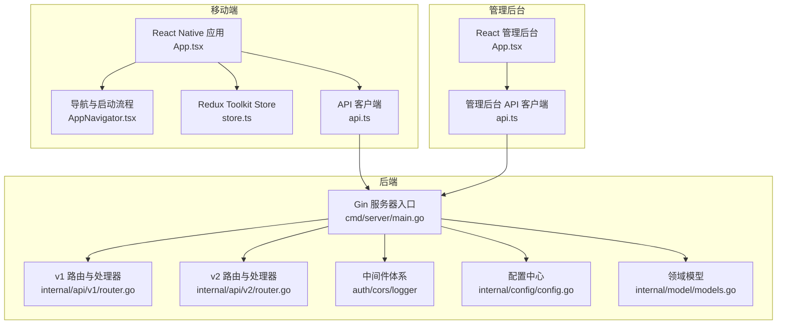
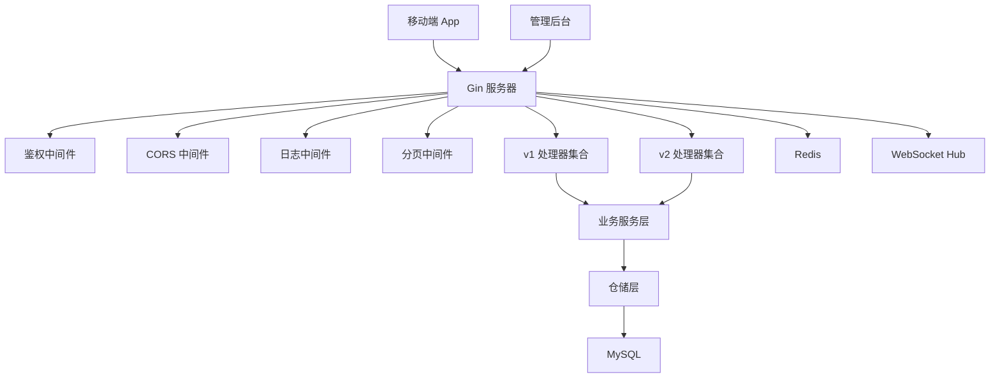
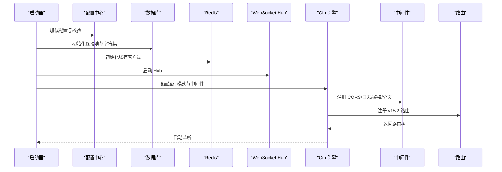
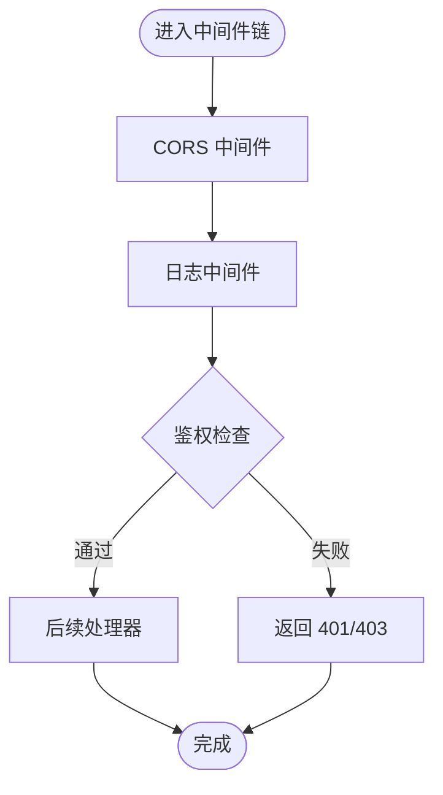
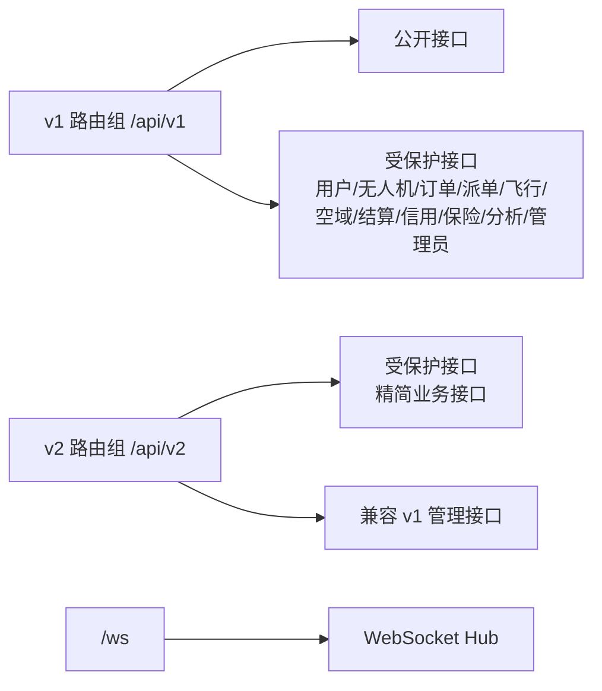
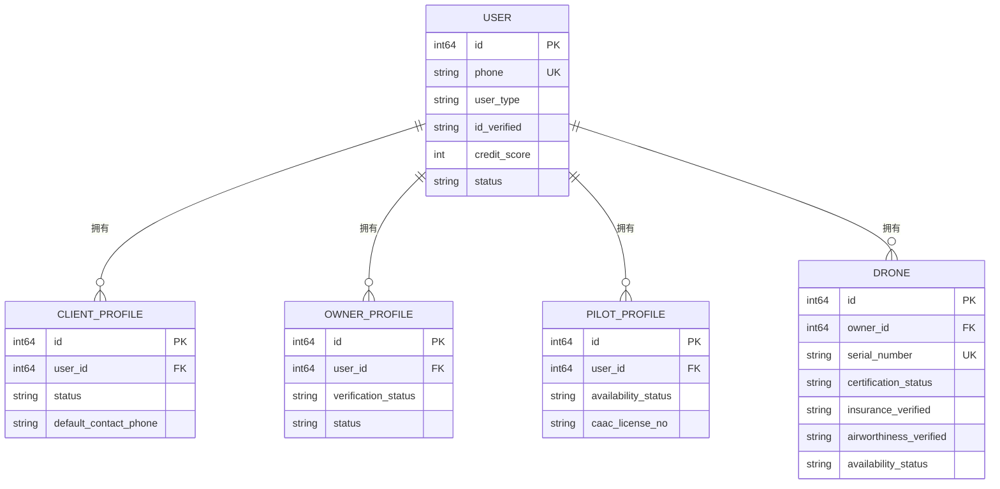
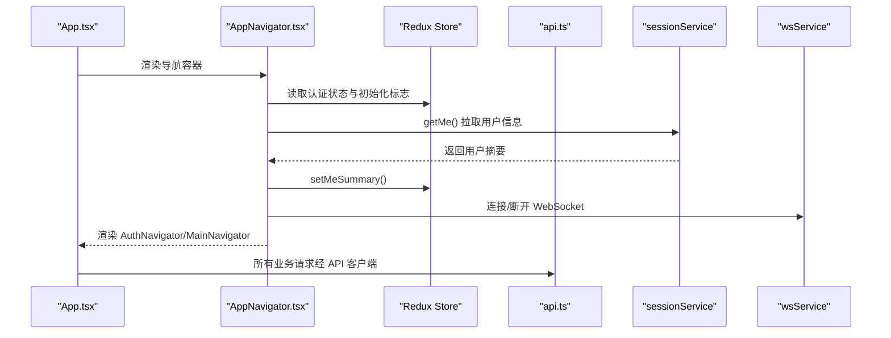
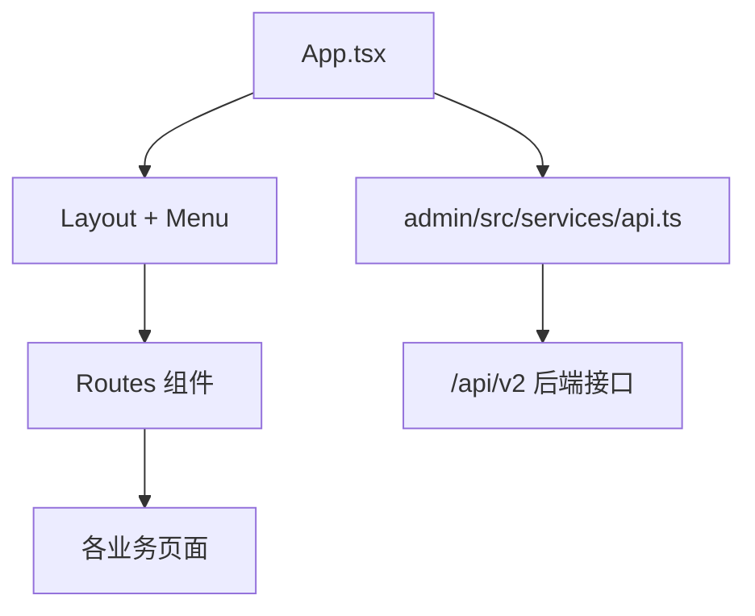
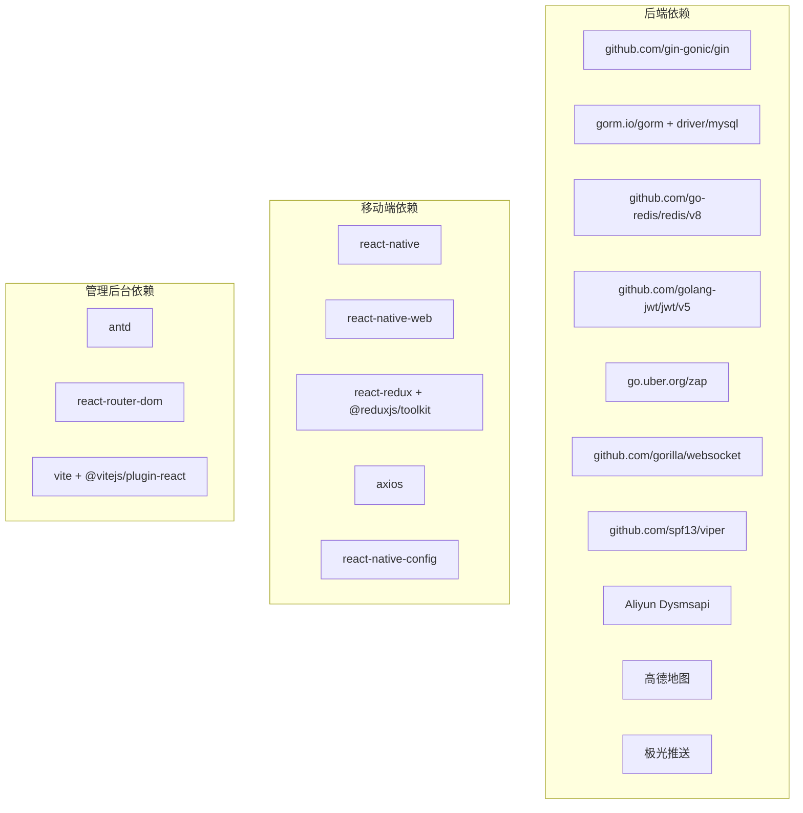

# 架构设计

<cite>
**本文引用的文件**   
- [README.md](file://README.md)
- [backend/go.mod](file://backend/go.mod)
- [backend/cmd/server/main.go](file://backend/cmd/server/main.go)
- [backend/internal/api/v1/router.go](file://backend/internal/api/v1/router.go)
- [backend/internal/api/v2/router.go](file://backend/internal/api/v2/router.go)
- [backend/internal/api/middleware/auth.go](file://backend/internal/api/middleware/auth.go)
- [backend/internal/api/middleware/cors.go](file://backend/internal/api/middleware/cors.go)
- [backend/internal/api/middleware/logger.go](file://backend/internal/api/middleware/logger.go)
- [backend/internal/config/config.go](file://backend/internal/config/config.go)
- [backend/internal/model/models.go](file://backend/internal/model/models.go)
- [mobile/package.json](file://mobile/package.json)
- [mobile/App.tsx](file://mobile/App.tsx)
- [mobile/src/store/store.ts](file://mobile/src/store/store.ts)
- [mobile/src/navigation/AppNavigator.tsx](file://mobile/src/navigation/AppNavigator.tsx)
- [mobile/src/services/api.ts](file://mobile/src/services/api.ts)
- [mobile/src/constants/index.ts](file://mobile/src/constants/index.ts)
- [admin/package.json](file://admin/package.json)
- [admin/src/App.tsx](file://admin/src/App.tsx)
- [admin/src/services/api.ts](file://admin/src/services/api.ts)
</cite>

## 目录
1. [引言](#引言)
2. [项目结构](#项目结构)
3. [核心组件](#核心组件)
4. [架构总览](#架构总览)
5. [详细组件分析](#详细组件分析)
6. [依赖关系分析](#依赖关系分析)
7. [性能考虑](#性能考虑)
8. [故障排查指南](#故障排查指南)
9. [结论](#结论)
10. [附录](#附录)

## 引言
本架构设计文档面向“无人机租赁平台”，目标是帮助开发者与运维人员快速理解系统的整体设计思路与实现要点。系统采用前后端分离架构，后端以 Go 语言实现，遵循 MVC 思想与中间件体系；前端包含 React Native 移动端与 React 管理后台两套应用，分别采用组件化与状态管理模式。系统同时引入微服务思想的分层与模块化设计，配合清晰的数据流与 API 设计规范，构建安全、可扩展、可演进的平台能力。

## 项目结构
项目由三部分组成：
- 后端（Go）：基于 Gin 框架，按 v1/v2 两条 API 线路组织，采用中间件统一处理跨域、鉴权、日志等横切关注点。
- 移动端（React Native）：以导航与状态管理为核心，提供用户、飞手、机主等角色的业务页面。
- 管理后台（React）：基于 Ant Design 的管理端，提供运营与审计功能。

**图表来源**
- [backend/cmd/server/main.go:52-266](file://backend/cmd/server/main.go#L52-L266)
- [backend/internal/api/v1/router.go:58-634](file://backend/internal/api/v1/router.go#L58-L634)
- [backend/internal/api/v2/router.go:72-283](file://backend/internal/api/v2/router.go#L72-L283)
- [mobile/App.tsx:22-33](file://mobile/App.tsx#L22-L33)
- [mobile/src/navigation/AppNavigator.tsx:13-77](file://mobile/src/navigation/AppNavigator.tsx#L13-L77)
- [mobile/src/store/store.ts:1-12](file://mobile/src/store/store.ts#L1-L12)
- [mobile/src/services/api.ts:6-155](file://mobile/src/services/api.ts#L6-L155)
- [admin/src/App.tsx:109-130](file://admin/src/App.tsx#L109-L130)
- [admin/src/services/api.ts:15-139](file://admin/src/services/api.ts#L15-L139)
- [backend/internal/config/config.go:16-31](file://backend/internal/config/config.go#L16-L31)
- [backend/internal/model/models.go:9-200](file://backend/internal/model/models.go#L9-L200)

**章节来源**
- [README.md:1-29](file://README.md#L1-L29)
- [backend/go.mod:1-80](file://backend/go.mod#L1-L80)
- [mobile/package.json:1-63](file://mobile/package.json#L1-L63)
- [admin/package.json:1-33](file://admin/package.json#L1-L33)

## 核心组件
- 后端入口与生命周期
  - 服务器启动、配置加载、数据库与 Redis 初始化、WebSocket Hub 启动、中间件注册、路由注册与启动监听。
- 中间件体系
  - CORS、日志、鉴权、分页、TraceID、写冻结保护等，统一处理安全与可观测性。
- 路由与控制器
  - v1/v2 两条 API 线路，按领域拆分处理器，支持公开与鉴权两类路由组。
- 配置中心
  - 统一加载 YAML 配置，支持环境变量覆盖，提供运行模式、数据库、Redis、JWT、上传、短信、支付、地图、推送、OAuth 等配置项校验。
- 数据模型
  - 用户、客户、机主、飞手、无人机、订单、派单、飞行记录、空域、结算、信用风控、保险等核心实体与关系。
- 移动端
  - Redux Toolkit 状态管理、导航容器、API 客户端、WebSocket 连接与启动引导。
- 管理后台
  - 基于 Ant Design 的后台布局与路由，API 客户端负责与 v2 接口交互。

**章节来源**
- [backend/cmd/server/main.go:52-266](file://backend/cmd/server/main.go#L52-L266)
- [backend/internal/api/middleware/auth.go:22-106](file://backend/internal/api/middleware/auth.go#L22-L106)
- [backend/internal/api/middleware/cors.go:10-20](file://backend/internal/api/middleware/cors.go#L10-L20)
- [backend/internal/api/middleware/logger.go:10-32](file://backend/internal/api/middleware/logger.go#L10-L32)
- [backend/internal/api/v1/router.go:58-634](file://backend/internal/api/v1/router.go#L58-L634)
- [backend/internal/api/v2/router.go:72-283](file://backend/internal/api/v2/router.go#L72-L283)
- [backend/internal/config/config.go:438-489](file://backend/internal/config/config.go#L438-L489)
- [backend/internal/model/models.go:9-200](file://backend/internal/model/models.go#L9-L200)
- [mobile/App.tsx:22-33](file://mobile/App.tsx#L22-L33)
- [mobile/src/store/store.ts:1-12](file://mobile/src/store/store.ts#L1-L12)
- [mobile/src/navigation/AppNavigator.tsx:13-77](file://mobile/src/navigation/AppNavigator.tsx#L13-L77)
- [mobile/src/services/api.ts:6-155](file://mobile/src/services/api.ts#L6-L155)
- [admin/src/App.tsx:109-130](file://admin/src/App.tsx#L109-L130)
- [admin/src/services/api.ts:15-139](file://admin/src/services/api.ts#L15-L139)

## 架构总览
系统采用“前后端分离 + 微服务思想的模块化”设计：
- 前端：移动端与管理后台分别独立构建，共享 API 规范与认证协议。
- 后端：以 Gin 为核心，按版本线（v1/v2）划分路由，按领域拆分处理器，中间件统一治理。
- 数据：MySQL 作为主存储，Redis 用于缓存与会话、黑名单、限流等；WebSocket 支持实时通知。
- 安全：JWT 令牌、Token 黑名单、CORS、鉴权与管理员权限控制。
- 可观测性：统一日志、TraceID、分页中间件、错误响应格式标准化。

**图表来源**
- [backend/cmd/server/main.go:250-266](file://backend/cmd/server/main.go#L250-L266)
- [backend/internal/api/middleware/auth.go:22-106](file://backend/internal/api/middleware/auth.go#L22-L106)
- [backend/internal/api/middleware/cors.go:10-20](file://backend/internal/api/middleware/cors.go#L10-L20)
- [backend/internal/api/middleware/logger.go:10-32](file://backend/internal/api/middleware/logger.go#L10-L32)
- [backend/internal/api/v1/router.go:58-634](file://backend/internal/api/v1/router.go#L58-L634)
- [backend/internal/api/v2/router.go:72-283](file://backend/internal/api/v2/router.go#L72-L283)

## 详细组件分析

### 后端入口与生命周期（Go）
- 配置加载与校验：支持环境变量覆盖，打印配置状态，确保上传目录存在。
- 数据库初始化：设置连接池、字符集，自动迁移模型。
- 缓存与服务：Redis、短信、上传、支付、推送、OAuth、AMap 服务初始化。
- 业务服务装配：围绕用户、无人机、订单、派单、飞行、结算、信用、保险、分析等业务域构建服务，并注入事件与通知能力。
- WebSocket Hub：独立 Hub 管理连接，配合路由暴露 WS 接口。
- 中间件注册：恢复、CORS、日志、v1/v2 鉴权与分页。
- 路由注册：v1 与 v2 路由组，公开与受保护接口分离。

**图表来源**
- [backend/cmd/server/main.go:52-266](file://backend/cmd/server/main.go#L52-L266)
- [backend/internal/config/config.go:415-435](file://backend/internal/config/config.go#L415-L435)

**章节来源**
- [backend/cmd/server/main.go:52-266](file://backend/cmd/server/main.go#L52-L266)
- [backend/internal/config/config.go:415-435](file://backend/internal/config/config.go#L415-L435)

### 中间件体系（Go）
- 鉴权中间件：解析 Authorization 头，校验 Bearer Token，支持 Token 黑名单检查，注入用户标识。
- 管理员中间件：限制特定接口仅管理员可访问。
- CORS 中间件：允许跨域、方法与头部白名单、凭证与缓存。
- 日志中间件：记录状态码、方法、路径、查询、IP、耗时、响应体大小。
- 分页中间件：v2 默认分页策略，限制每页最大值。
- TraceID 中间件：为请求链路生成追踪 ID（v2）。

**图表来源**
- [backend/internal/api/middleware/auth.go:22-106](file://backend/internal/api/middleware/auth.go#L22-L106)
- [backend/internal/api/middleware/cors.go:10-20](file://backend/internal/api/middleware/cors.go#L10-L20)
- [backend/internal/api/middleware/logger.go:10-32](file://backend/internal/api/middleware/logger.go#L10-L32)
- [backend/internal/api/v2/router.go:74-75](file://backend/internal/api/v2/router.go#L74-L75)

**章节来源**
- [backend/internal/api/middleware/auth.go:22-106](file://backend/internal/api/middleware/auth.go#L22-L106)
- [backend/internal/api/middleware/cors.go:10-20](file://backend/internal/api/middleware/cors.go#L10-L20)
- [backend/internal/api/middleware/logger.go:10-32](file://backend/internal/api/middleware/logger.go#L10-L32)
- [backend/internal/api/v2/router.go:74-75](file://backend/internal/api/v2/router.go#L74-L75)

### 路由设计（Go）
- v1 路由：公开接口（验证码、登录、OAuth）、支付回调、以及大量受保护接口，按领域分组（用户、无人机、订单、派单、飞行、空域、结算、信用、保险、分析、管理员）。
- v2 路由：以“/api/v2”为前缀，统一鉴权与分页，提供精简的业务接口集合，兼容部分 v1 管理接口。
- WebSocket：/ws 通道，配合 Hub 管理连接。

**图表来源**
- [backend/internal/api/v1/router.go:58-634](file://backend/internal/api/v1/router.go#L58-L634)
- [backend/internal/api/v2/router.go:72-283](file://backend/internal/api/v2/router.go#L72-L283)
- [backend/cmd/server/main.go:62-63](file://backend/cmd/server/main.go#L62-L63)

**章节来源**
- [backend/internal/api/v1/router.go:58-634](file://backend/internal/api/v1/router.go#L58-L634)
- [backend/internal/api/v2/router.go:72-283](file://backend/internal/api/v2/router.go#L72-L283)
- [backend/cmd/server/main.go:62-63](file://backend/cmd/server/main.go#L62-L63)

### 数据模型（Go）
- 用户与角色：用户、客户、机主、飞手档案，支持多种认证状态与风控标记。
- 无人机与资产：品牌、型号、载重、价格、认证与保险状态、维护记录。
- 订单与派单：需求、报价、订单、正式派单、执行状态、结算与争议。
- 飞行与监控：位置上报、轨迹、电子围栏、告警、多点任务。
- 空域与合规：空域申请、禁飞区、合规检查。
- 结算与风控：钱包、交易、提现、定价配置、信用评分与违规。
- 保险与理赔：保单、报案、证据、责任认定、赔付。

**图表来源**
- [backend/internal/model/models.go:9-200](file://backend/internal/model/models.go#L9-L200)

**章节来源**
- [backend/internal/model/models.go:9-200](file://backend/internal/model/models.go#L9-L200)

### 移动端（React Native）
- 应用根组件：Provider + ThemeProvider + SafeAreaProvider + NavigationContainer。
- 导航容器：根据登录态切换 AuthNavigator/MainNavigator，启动时拉取用户信息并建立 WebSocket 连接。
- 状态管理：Redux Toolkit Store，集中管理认证状态与用户摘要。
- API 客户端：Axios 实例，统一请求拦截器（注入 Bearer Token），响应拦截器（业务成功码判断、401 刷新 Token、错误提示）。
- 配置常量：API 基础地址、v1/v2 切换、WebSocket 地址、超时、地图与推送配置等。

**图表来源**
- [mobile/App.tsx:22-33](file://mobile/App.tsx#L22-L33)
- [mobile/src/navigation/AppNavigator.tsx:13-77](file://mobile/src/navigation/AppNavigator.tsx#L13-L77)
- [mobile/src/store/store.ts:1-12](file://mobile/src/store/store.ts#L1-L12)
- [mobile/src/services/api.ts:6-155](file://mobile/src/services/api.ts#L6-L155)
- [mobile/src/constants/index.ts:115-131](file://mobile/src/constants/index.ts#L115-L131)

**章节来源**
- [mobile/App.tsx:22-33](file://mobile/App.tsx#L22-L33)
- [mobile/src/navigation/AppNavigator.tsx:13-77](file://mobile/src/navigation/AppNavigator.tsx#L13-L77)
- [mobile/src/store/store.ts:1-12](file://mobile/src/store/store.ts#L1-L12)
- [mobile/src/services/api.ts:6-155](file://mobile/src/services/api.ts#L6-L155)
- [mobile/src/constants/index.ts:115-131](file://mobile/src/constants/index.ts#L115-L131)

### 管理后台（React）
- 布局与导航：左侧菜单 + 内容区，支持折叠与路由跳转；登录态缺失时跳转登录页。
- API 客户端：Axios 实例，请求头注入 Bearer Token；响应拦截器处理业务错误与 401 刷新 Token；提供丰富的管理接口封装。
- 配置：基于 Vite 环境变量，支持代理与直连两种模式，便于开发与生产部署。

**图表来源**
- [admin/src/App.tsx:109-130](file://admin/src/App.tsx#L109-L130)
- [admin/src/services/api.ts:15-139](file://admin/src/services/api.ts#L15-L139)

**章节来源**
- [admin/src/App.tsx:109-130](file://admin/src/App.tsx#L109-L130)
- [admin/src/services/api.ts:15-139](file://admin/src/services/api.ts#L15-L139)

## 依赖关系分析
- 后端依赖
  - Gin、GORM、MySQL 驱动、Redis 客户端、JWT、Zap 日志、WebSocket、Viper 配置、阿里云短信、高德地图、极光推送等。
- 前端依赖
  - React、React Native、React Navigation、Redux Toolkit、Axios、Ant Design、Vite、RN Config 等。

**图表来源**
- [backend/go.mod:5-21](file://backend/go.mod#L5-L21)
- [mobile/package.json:14-34](file://mobile/package.json#L14-L34)
- [admin/package.json:14-24](file://admin/package.json#L14-L24)

**章节来源**
- [backend/go.mod:5-21](file://backend/go.mod#L5-L21)
- [mobile/package.json:14-34](file://mobile/package.json#L14-L34)
- [admin/package.json:14-24](file://admin/package.json#L14-L24)

## 性能考虑
- 连接池与字符集：数据库连接池参数与 UTF-8MB4 字符集设置，避免乱码与连接瓶颈。
- 中间件顺序：CORS 与 Recovery 放在前，减少无效处理；日志中间件记录关键指标，便于定位慢请求。
- 分页与上限：v2 分页中间件限制每页最大值，避免大分页导致的内存与 CPU 压力。
- 缓存策略：Redis 用于 Token 黑名单、会话与热点数据缓存，结合自动迁移与配置校验保障一致性。
- WebSocket：合理设置消息大小、写入与心跳周期，避免内存泄漏与连接抖动。
- 前端优化：移动端 API 客户端统一超时与并发刷新控制，避免重复请求与竞态。

[本节为通用指导，不直接分析具体文件]

## 故障排查指南
- 配置校验失败：检查 server.mode、database、redis、jwt、upload、sms、payment、websocket 等配置项，生产环境需满足更严格规则。
- 鉴权失败：确认 Authorization 头格式为 Bearer Token，检查 Token 是否在黑名单，核对 JWT 密钥与过期时间。
- CORS 问题：确认 AllowOrigins、AllowMethods、AllowHeaders 设置，浏览器控制台查看预检请求结果。
- 日志定位：通过日志中间件输出的状态码、路径、耗时、IP 等信息快速定位异常请求。
- 前端 401 自动刷新：若刷新失败或 pending 请求堆积，检查刷新 Token 流程与本地存储状态。

**章节来源**
- [backend/internal/config/config.go:438-489](file://backend/internal/config/config.go#L438-L489)
- [backend/internal/api/middleware/auth.go:22-106](file://backend/internal/api/middleware/auth.go#L22-L106)
- [backend/internal/api/middleware/cors.go:10-20](file://backend/internal/api/middleware/cors.go#L10-L20)
- [backend/internal/api/middleware/logger.go:10-32](file://backend/internal/api/middleware/logger.go#L10-L32)
- [mobile/src/services/api.ts:66-147](file://mobile/src/services/api.ts#L66-L147)
- [admin/src/services/api.ts:65-137](file://admin/src/services/api.ts#L65-L137)

## 结论
该系统通过前后端分离与微服务思想的模块化设计，实现了清晰的职责边界与可演进的 API 线路。后端以 Gin 为核心，配合完善的中间件体系与配置中心，保障了安全性与可观测性；前端以组件化与状态管理提升开发效率与用户体验。通过统一的数据模型与 API 规范，平台具备良好的扩展性与可维护性，适合在复杂业务场景下持续迭代。

[本节为总结性内容，不直接分析具体文件]

## 附录
- API 文档与契约：参考后端 OpenAPI 与业务契约文档。
- 业务角色与页面：参考业务角色重构与页面信息架构文档。
- 迁移与验收：参考数据库迁移方案与移动端验收标准。

**章节来源**
- [README.md:9-29](file://README.md#L9-L29)