# 系统集成架构

<cite>
**本文引用的文件**
- [backend/cmd/server/main.go](file://backend/cmd/server/main.go)
- [backend/internal/config/config.go](file://backend/internal/config/config.go)
- [backend/docs/openapi-v2.yaml](file://backend/docs/openapi-v2.yaml)
- [backend/docs/阿里云短信配置说明.md](file://backend/docs/阿里云短信配置说明.md)
- [backend/config.example.yaml](file://backend/config.example.yaml)
- [backend/internal/pkg/amap/amap.go](file://backend/internal/pkg/amap/amap.go)
- [backend/internal/pkg/sms/sms.go](file://backend/internal/pkg/sms/sms.go)
- [backend/internal/pkg/payment/payment.go](file://backend/internal/pkg/payment/payment.go)
- [backend/internal/pkg/push/push.go](file://backend/internal/pkg/push/push.go)
- [backend/internal/api/v1/router.go](file://backend/internal/api/v1/router.go)
- [backend/internal/service/event_service.go](file://backend/internal/service/event_service.go)
- [backend/internal/api/middleware/auth.go](file://backend/internal/api/middleware/auth.go)
- [backend/internal/websocket/hub.go](file://backend/internal/websocket/hub.go)
- [backend/internal/pkg/oauth/oauth.go](file://backend/internal/pkg/oauth/oauth.go)
</cite>

## 目录
1. [引言](#引言)
2. [项目结构](#项目结构)
3. [核心组件](#核心组件)
4. [架构总览](#架构总览)
5. [详细组件分析](#详细组件分析)
6. [依赖分析](#依赖分析)
7. [性能考虑](#性能考虑)
8. [故障排查指南](#故障排查指南)
9. [结论](#结论)
10. [附录](#附录)

## 引言
本文件面向无人机租赁平台的系统集成架构，聚焦第三方服务集成策略、API网关设计、服务间通信机制，以及事件驱动与微服务通信模式。文档围绕高德地图API、短信服务、支付平台、推送服务、OAuth登录等外部集成点进行深入剖析，并结合路由注册、中间件、事件服务、WebSocket等内部组件，形成完整的集成视图。

## 项目结构
后端采用 Go + Gin 框架，入口程序负责初始化配置、数据库、Redis、WebSocket Hub、各业务服务与处理器，并注册 v1/v2 路由组。配置模块集中管理服务器、数据库、Redis、JWT、上传、短信、支付、高德地图、WebSocket、日志、CORS、推送、OAuth 等配置项。

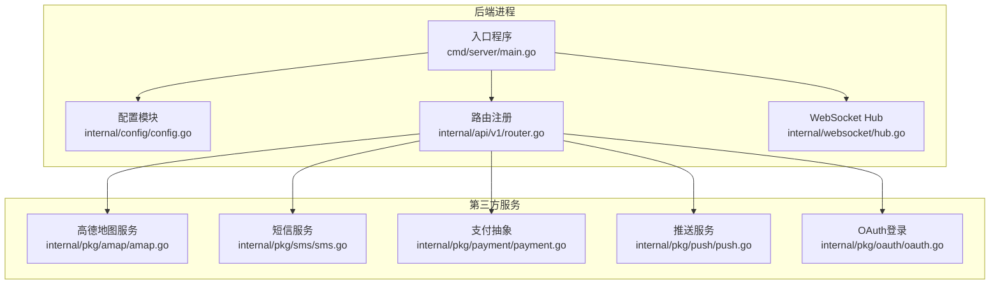

**图表来源**
- [backend/cmd/server/main.go:52-266](file://backend/cmd/server/main.go#L52-L266)
- [backend/internal/config/config.go:16-31](file://backend/internal/config/config.go#L16-L31)
- [backend/internal/api/v1/router.go:58-634](file://backend/internal/api/v1/router.go#L58-L634)
- [backend/internal/websocket/hub.go:35-132](file://backend/internal/websocket/hub.go#L35-L132)
- [backend/internal/pkg/amap/amap.go:42-63](file://backend/internal/pkg/amap/amap.go#L42-L63)
- [backend/internal/pkg/sms/sms.go:25-30](file://backend/internal/pkg/sms/sms.go#L25-L30)
- [backend/internal/pkg/payment/payment.go:34-40](file://backend/internal/pkg/payment/payment.go#L34-L40)
- [backend/internal/pkg/push/push.go:44-50](file://backend/internal/pkg/push/push.go#L44-L50)
- [backend/internal/pkg/oauth/oauth.go:48-54](file://backend/internal/pkg/oauth/oauth.go#L48-L54)

**章节来源**
- [backend/cmd/server/main.go:52-266](file://backend/cmd/server/main.go#L52-L266)
- [backend/internal/config/config.go:16-31](file://backend/internal/config/config.go#L16-L31)
- [backend/internal/api/v1/router.go:58-634](file://backend/internal/api/v1/router.go#L58-L634)
- [backend/internal/websocket/hub.go:35-132](file://backend/internal/websocket/hub.go#L35-L132)

## 核心组件
- 配置中心：集中管理运行参数，支持环境变量覆盖与严格校验（生产模式、短信提供商、支付配置等）。
- API 网关：基于 Gin 的路由分组与中间件，统一鉴权、CORS、日志、分页、TraceID 等。
- 事件服务：统一事件通知入口，支持站内消息与推送双通道，屏蔽下游差异。
- WebSocket Hub：用户在线状态管理与消息广播，支持单播与广播。
- 第三方集成：高德地图、短信、支付、推送、OAuth 登录，均以接口抽象封装，便于替换与测试。

**章节来源**
- [backend/internal/config/config.go:437-489](file://backend/internal/config/config.go#L437-L489)
- [backend/internal/api/middleware/auth.go:22-61](file://backend/internal/api/middleware/auth.go#L22-L61)
- [backend/internal/service/event_service.go:12-24](file://backend/internal/service/event_service.go#L12-L24)
- [backend/internal/websocket/hub.go:12-43](file://backend/internal/websocket/hub.go#L12-L43)

## 架构总览
系统采用“入口程序装配 + 路由层 + 业务服务层 + 第三方集成”的分层架构。入口程序负责初始化与装配，路由层负责协议转换与鉴权，业务服务层负责领域逻辑与事件编排，第三方集成通过独立包解耦。

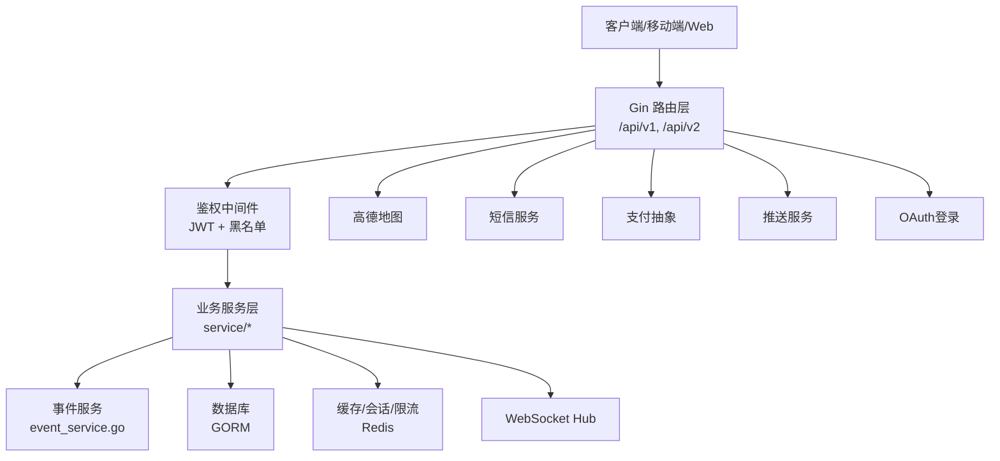

**图表来源**
- [backend/cmd/server/main.go:106-247](file://backend/cmd/server/main.go#L106-L247)
- [backend/internal/api/v1/router.go:58-634](file://backend/internal/api/v1/router.go#L58-L634)
- [backend/internal/service/event_service.go:12-24](file://backend/internal/service/event_service.go#L12-L24)
- [backend/internal/websocket/hub.go:35-132](file://backend/internal/websocket/hub.go#L35-L132)
- [backend/internal/pkg/amap/amap.go:42-63](file://backend/internal/pkg/amap/amap.go#L42-L63)
- [backend/internal/pkg/sms/sms.go:25-30](file://backend/internal/pkg/sms/sms.go#L25-L30)
- [backend/internal/pkg/payment/payment.go:34-40](file://backend/internal/pkg/payment/payment.go#L34-L40)
- [backend/internal/pkg/push/push.go:44-50](file://backend/internal/pkg/push/push.go#L44-L50)
- [backend/internal/pkg/oauth/oauth.go:48-54](file://backend/internal/pkg/oauth/oauth.go#L48-L54)

## 详细组件分析

### 高德地图API集成
- 服务封装：提供地理编码、逆地理编码、POI 搜索、周边搜索、距离计算等能力，内置 TLS 客户端与超时控制。
- 配置启用：通过配置模块判断是否启用，未配置时相关接口返回错误。
- 使用场景：地址解析、路径规划前置、周边检索、距离计算等。

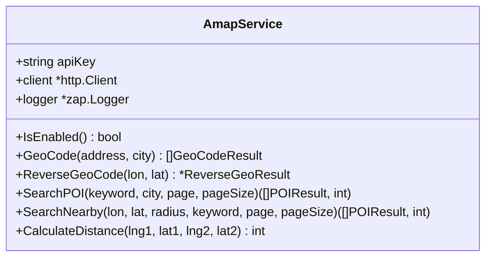

**图表来源**
- [backend/internal/pkg/amap/amap.go:35-63](file://backend/internal/pkg/amap/amap.go#L35-L63)
- [backend/internal/pkg/amap/amap.go:84-145](file://backend/internal/pkg/amap/amap.go#L84-L145)
- [backend/internal/pkg/amap/amap.go:162-229](file://backend/internal/pkg/amap/amap.go#L162-L229)
- [backend/internal/pkg/amap/amap.go:248-321](file://backend/internal/pkg/amap/amap.go#L248-L321)
- [backend/internal/pkg/amap/amap.go:323-398](file://backend/internal/pkg/amap/amap.go#L323-L398)
- [backend/internal/pkg/amap/amap.go:404-454](file://backend/internal/pkg/amap/amap.go#L404-L454)

**章节来源**
- [backend/internal/pkg/amap/amap.go:65-68](file://backend/internal/pkg/amap/amap.go#L65-L68)
- [backend/internal/pkg/amap/amap.go:84-145](file://backend/internal/pkg/amap/amap.go#L84-L145)
- [backend/internal/pkg/amap/amap.go:162-229](file://backend/internal/pkg/amap/amap.go#L162-L229)
- [backend/internal/pkg/amap/amap.go:248-321](file://backend/internal/pkg/amap/amap.go#L248-L321)
- [backend/internal/pkg/amap/amap.go:323-398](file://backend/internal/pkg/amap/amap.go#L323-L398)
- [backend/internal/pkg/amap/amap.go:404-454](file://backend/internal/pkg/amap/amap.go#L404-L454)

### 短信服务集成
- 服务封装：支持阿里云短信与 Mock 模式，提供发送验证码与校验验证码能力。
- 配置启用：通过配置模块选择提供商，阿里云模式需配置 AK/SK、签名与模板。
- 使用场景：登录验证码、风控校验等。

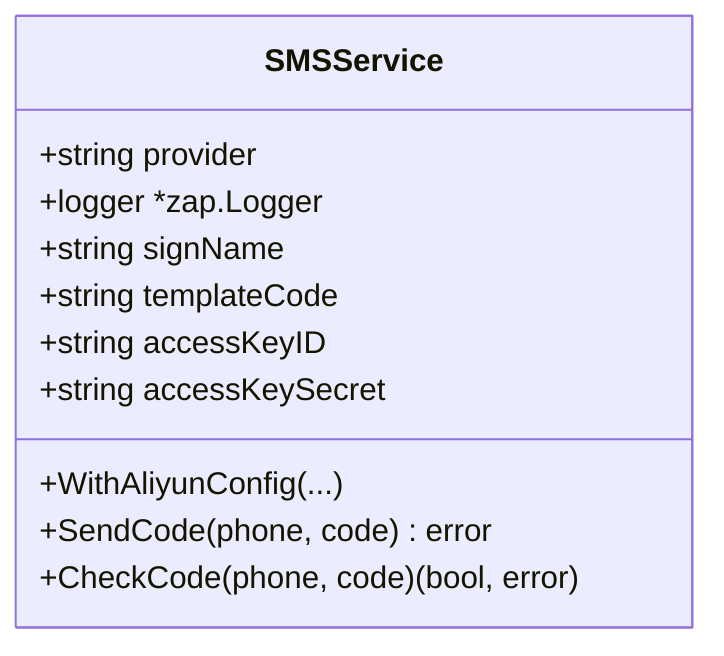

**图表来源**
- [backend/internal/pkg/sms/sms.go:16-30](file://backend/internal/pkg/sms/sms.go#L16-L30)
- [backend/internal/pkg/sms/sms.go:32-39](file://backend/internal/pkg/sms/sms.go#L32-L39)
- [backend/internal/pkg/sms/sms.go:45-52](file://backend/internal/pkg/sms/sms.go#L45-L52)
- [backend/internal/pkg/sms/sms.go:54-74](file://backend/internal/pkg/sms/sms.go#L54-L74)
- [backend/internal/pkg/sms/sms.go:92-120](file://backend/internal/pkg/sms/sms.go#L92-L120)
- [backend/internal/pkg/sms/sms.go:122-143](file://backend/internal/pkg/sms/sms.go#L122-L143)
- [backend/internal/pkg/sms/sms.go:145-149](file://backend/internal/pkg/sms/sms.go#L145-L149)

**章节来源**
- [backend/docs/阿里云短信配置说明.md:1-126](file://backend/docs/阿里云短信配置说明.md#L1-L126)
- [backend/internal/pkg/sms/sms.go:45-52](file://backend/internal/pkg/sms/sms.go#L45-L52)
- [backend/internal/pkg/sms/sms.go:92-120](file://backend/internal/pkg/sms/sms.go#L92-L120)
- [backend/internal/pkg/sms/sms.go:122-143](file://backend/internal/pkg/sms/sms.go#L122-L143)

### 支付平台对接
- 抽象接口：统一创建支付、查询状态、发起退款的接口，便于替换不同支付渠道。
- Mock 实现：开发环境使用，便于联调与测试。
- 使用场景：订单支付、退款处理。

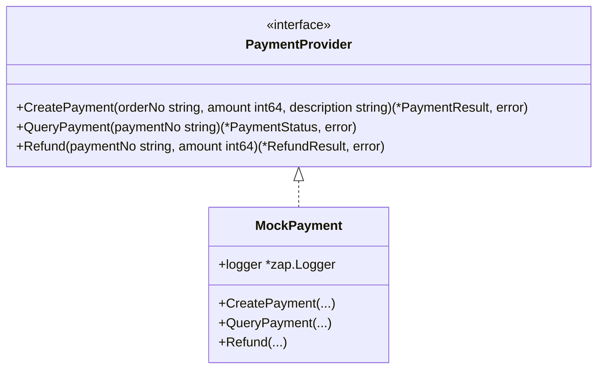

**图表来源**
- [backend/internal/pkg/payment/payment.go:11-16](file://backend/internal/pkg/payment/payment.go#L11-L16)
- [backend/internal/pkg/payment/payment.go:33-40](file://backend/internal/pkg/payment/payment.go#L33-L40)
- [backend/internal/pkg/payment/payment.go:42-73](file://backend/internal/pkg/payment/payment.go#L42-L73)

**章节来源**
- [backend/internal/pkg/payment/payment.go:11-16](file://backend/internal/pkg/payment/payment.go#L11-L16)
- [backend/internal/pkg/payment/payment.go:33-40](file://backend/internal/pkg/payment/payment.go#L33-L40)
- [backend/internal/pkg/payment/payment.go:42-73](file://backend/internal/pkg/payment/payment.go#L42-L73)

### 推送服务集成
- 接口抽象：统一用户推送、广播、设备注册接口。
- 极光推送实现：支持别名推送、广播、设备别名绑定。
- Mock 实现：开发环境输出日志与控制台信息。
- 使用场景：订单状态变更、新消息提醒、实名认证结果等。

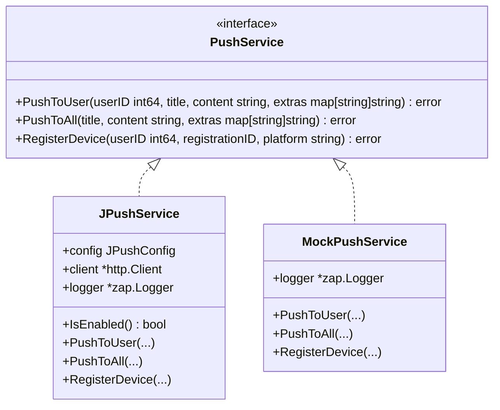

**图表来源**
- [backend/internal/pkg/push/push.go:15-24](file://backend/internal/pkg/push/push.go#L15-L24)
- [backend/internal/pkg/push/push.go:29-50](file://backend/internal/pkg/push/push.go#L29-L50)
- [backend/internal/pkg/push/push.go:57-95](file://backend/internal/pkg/push/push.go#L57-L95)
- [backend/internal/pkg/push/push.go:97-128](file://backend/internal/pkg/push/push.go#L97-L128)
- [backend/internal/pkg/push/push.go:130-179](file://backend/internal/pkg/push/push.go#L130-L179)
- [backend/internal/pkg/push/push.go:227-235](file://backend/internal/pkg/push/push.go#L227-L235)
- [backend/internal/pkg/push/push.go:237-264](file://backend/internal/pkg/push/push.go#L237-L264)

**章节来源**
- [backend/internal/pkg/push/push.go:57-95](file://backend/internal/pkg/push/push.go#L57-L95)
- [backend/internal/pkg/push/push.go:97-128](file://backend/internal/pkg/push/push.go#L97-L128)
- [backend/internal/pkg/push/push.go:130-179](file://backend/internal/pkg/push/push.go#L130-L179)
- [backend/internal/pkg/push/push.go:237-264](file://backend/internal/pkg/push/push.go#L237-L264)

### OAuth 登录集成
- 微信登录：通过 AppID/AppSecret 获取 access_token 与 openid，再获取用户信息。
- QQ 登录：通过 access_token 获取 openid，再获取用户信息。
- 配置启用：通过配置模块判断是否启用，未启用则不提供对应登录入口。

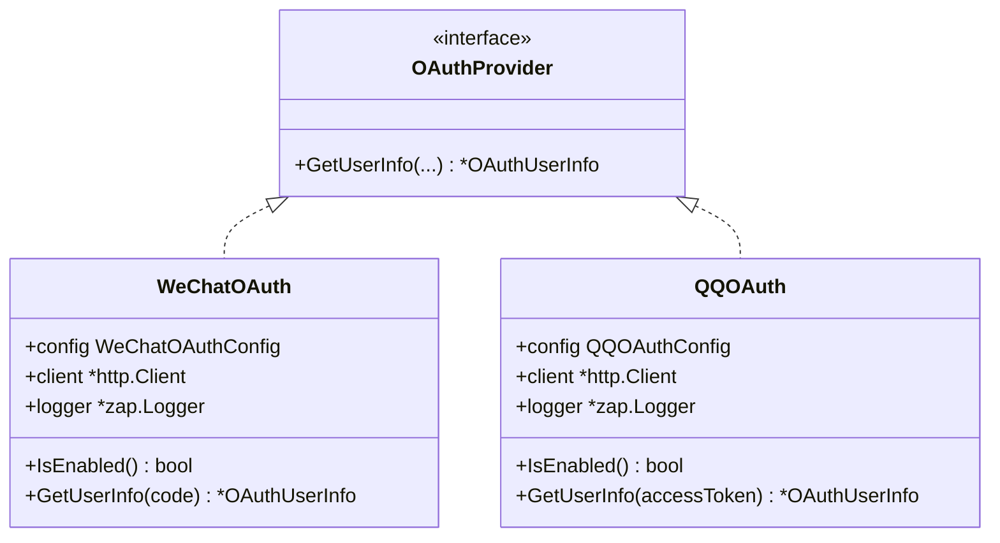

**图表来源**
- [backend/internal/pkg/oauth/oauth.go:24-28](file://backend/internal/pkg/oauth/oauth.go#L24-L28)
- [backend/internal/pkg/oauth/oauth.go:34-54](file://backend/internal/pkg/oauth/oauth.go#L34-L54)
- [backend/internal/pkg/oauth/oauth.go:61-144](file://backend/internal/pkg/oauth/oauth.go#L61-L144)
- [backend/internal/pkg/oauth/oauth.go:150-170](file://backend/internal/pkg/oauth/oauth.go#L150-L170)
- [backend/internal/pkg/oauth/oauth.go:177-261](file://backend/internal/pkg/oauth/oauth.go#L177-L261)

**章节来源**
- [backend/internal/pkg/oauth/oauth.go:56-59](file://backend/internal/pkg/oauth/oauth.go#L56-L59)
- [backend/internal/pkg/oauth/oauth.go:172-175](file://backend/internal/pkg/oauth/oauth.go#L172-L175)
- [backend/internal/pkg/oauth/oauth.go:61-144](file://backend/internal/pkg/oauth/oauth.go#L61-L144)
- [backend/internal/pkg/oauth/oauth.go:177-261](file://backend/internal/pkg/oauth/oauth.go#L177-L261)

### API 网关与路由设计
- 路由分组：/api/v1 与 /api/v2，v2 路由在入口处注册。
- 鉴权中间件：Bearer Token 校验，支持黑名单撤销。
- 公共路由：验证码发送、登录、第三方登录等。
- 业务路由：用户、无人机、订单、派单、飞行、空域、结算、信用风控、保险、分析等。
- 回调路由：支付回调（无需鉴权）。

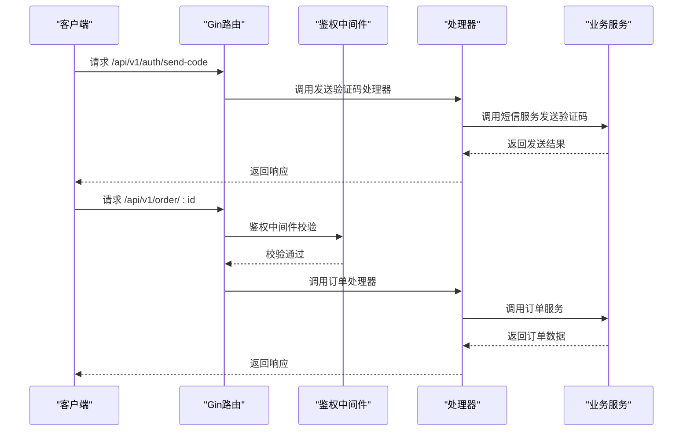

**图表来源**
- [backend/internal/api/v1/router.go:68-76](file://backend/internal/api/v1/router.go#L68-L76)
- [backend/internal/api/v1/router.go:162-177](file://backend/internal/api/v1/router.go#L162-L177)
- [backend/internal/api/middleware/auth.go:22-61](file://backend/internal/api/middleware/auth.go#L22-L61)

**章节来源**
- [backend/internal/api/v1/router.go:58-634](file://backend/internal/api/v1/router.go#L58-L634)
- [backend/internal/api/middleware/auth.go:22-61](file://backend/internal/api/middleware/auth.go#L22-L61)

### 事件驱动与微服务通信
- 事件服务：统一事件通知入口，支持站内消息与推送双通道，屏蔽下游差异。
- 事件类型：需求报价、需求取消/过期、订单状态变更、派单创建/接受/重派、绑定关系状态变更、资质审核结果、无人机资质等。
- 通信模式：事件服务作为“事件总线”，业务服务在关键节点触发事件，事件服务负责广播与推送。

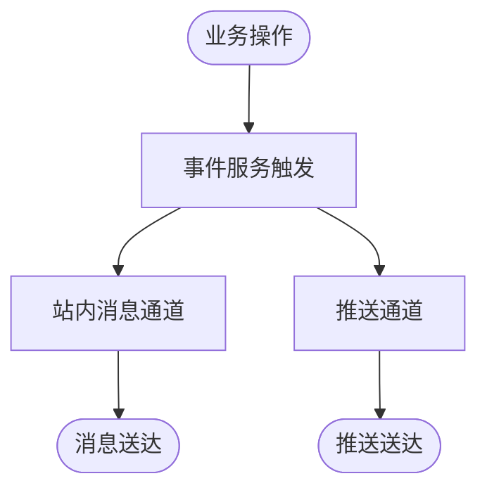

**图表来源**
- [backend/internal/service/event_service.go:26-45](file://backend/internal/service/event_service.go#L26-L45)
- [backend/internal/service/event_service.go:165-180](file://backend/internal/service/event_service.go#L165-L180)
- [backend/internal/service/event_service.go:359-382](file://backend/internal/service/event_service.go#L359-L382)

**章节来源**
- [backend/internal/service/event_service.go:12-24](file://backend/internal/service/event_service.go#L12-L24)
- [backend/internal/service/event_service.go:26-45](file://backend/internal/service/event_service.go#L26-L45)
- [backend/internal/service/event_service.go:165-180](file://backend/internal/service/event_service.go#L165-L180)
- [backend/internal/service/event_service.go:359-382](file://backend/internal/service/event_service.go#L359-L382)

### WebSocket 实时通信
- Hub 管理：维护用户连接映射，支持单播与广播。
- 在线状态：提供在线查询与在线人数统计。
- 使用场景：订单状态实时推送、聊天消息、系统通知等。

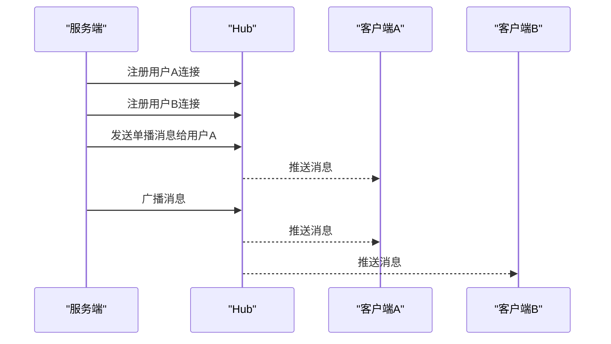

**图表来源**
- [backend/internal/websocket/hub.go:45-97](file://backend/internal/websocket/hub.go#L45-L97)
- [backend/internal/websocket/hub.go:99-116](file://backend/internal/websocket/hub.go#L99-L116)
- [backend/internal/websocket/hub.go:118-131](file://backend/internal/websocket/hub.go#L118-L131)

**章节来源**
- [backend/internal/websocket/hub.go:12-43](file://backend/internal/websocket/hub.go#L12-L43)
- [backend/internal/websocket/hub.go:45-97](file://backend/internal/websocket/hub.go#L45-L97)
- [backend/internal/websocket/hub.go:99-116](file://backend/internal/websocket/hub.go#L99-L116)
- [backend/internal/websocket/hub.go:118-131](file://backend/internal/websocket/hub.go#L118-L131)

## 依赖分析
- 入口程序装配：初始化配置、数据库、Redis、WebSocket Hub、各业务服务与处理器，并注册路由。
- 路由依赖：路由层依赖各 Handler，Handler 依赖业务服务；业务服务依赖事件服务、第三方服务与仓储。
- 第三方服务：高德地图、短信、支付、推送、OAuth 登录均通过接口抽象，便于替换与测试。
- 中间件：鉴权中间件依赖 JWT 与 Redis 黑名单。

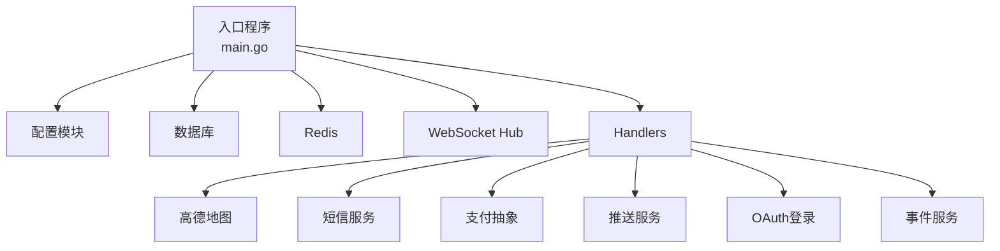

**图表来源**
- [backend/cmd/server/main.go:106-247](file://backend/cmd/server/main.go#L106-L247)
- [backend/internal/api/v1/router.go:34-56](file://backend/internal/api/v1/router.go#L34-L56)
- [backend/internal/service/event_service.go:12-24](file://backend/internal/service/event_service.go#L12-L24)

**章节来源**
- [backend/cmd/server/main.go:106-247](file://backend/cmd/server/main.go#L106-L247)
- [backend/internal/api/v1/router.go:34-56](file://backend/internal/api/v1/router.go#L34-L56)

## 性能考虑
- 连接池与字符集：数据库连接池参数与字符集设置，确保高并发下的稳定性。
- HTTP 客户端：高德地图与短信服务使用带超时与连接复用的 HTTP 客户端。
- 缓存：Redis 用于验证码、会话、限流等，降低数据库压力。
- 日志：生产模式下使用生产日志，减少开销。
- WebSocket：使用缓冲通道与读写分离，避免阻塞。

**章节来源**
- [backend/cmd/server/main.go:268-292](file://backend/cmd/server/main.go#L268-L292)
- [backend/internal/pkg/amap/amap.go:44-62](file://backend/internal/pkg/amap/amap.go#L44-L62)
- [backend/internal/pkg/sms/sms.go:92-120](file://backend/internal/pkg/sms/sms.go#L92-L120)
- [backend/internal/config/config.go:491-508](file://backend/internal/config/config.go#L491-L508)
- [backend/internal/websocket/hub.go:35-43](file://backend/internal/websocket/hub.go#L35-L43)

## 故障排查指南
- 配置校验：生产模式必须使用 release，短信不可为 mock，至少配置一种支付方式。
- 鉴权失败：检查 Authorization 头格式、Token 是否在黑名单、JWT 密钥是否正确。
- 短信发送失败：检查阿里云 AK/SK、签名、模板、频率限制与网络连通性。
- 支付回调：确认回调地址配置与签名验证流程。
- 推送失败：检查极光 AppKey/MasterSecret、设备别名绑定与网络连通性。
- 高德地图：检查 API Key 配置与网络访问权限。
- WebSocket：检查连接建立、心跳与广播通道。

**章节来源**
- [backend/internal/config/config.go:466-489](file://backend/internal/config/config.go#L466-L489)
- [backend/internal/api/middleware/auth.go:22-61](file://backend/internal/api/middleware/auth.go#L22-L61)
- [backend/docs/阿里云短信配置说明.md:92-126](file://backend/docs/阿里云短信配置说明.md#L92-L126)
- [backend/internal/pkg/push/push.go:181-215](file://backend/internal/pkg/push/push.go#L181-L215)
- [backend/internal/pkg/amap/amap.go:65-68](file://backend/internal/pkg/amap/amap.go#L65-L68)
- [backend/internal/websocket/hub.go:45-97](file://backend/internal/websocket/hub.go#L45-L97)

## 结论
本系统通过清晰的分层与接口抽象，实现了对高德地图、短信、支付、推送、OAuth 等第三方服务的稳定集成；借助事件服务与 WebSocket，构建了事件驱动与实时通信能力；配合严格的配置校验与中间件，保障了生产环境的安全与稳定。后续可在监控告警、日志聚合、性能追踪等方面进一步完善。

## 附录
- API 文档：v2 OpenAPI 描述文件覆盖已实现路由与联调文档。
- 配置模板：提供完整配置项模板与说明，便于快速部署。

**章节来源**
- [backend/docs/openapi-v2.yaml:1-800](file://backend/docs/openapi-v2.yaml#L1-L800)
- [backend/config.example.yaml:1-338](file://backend/config.example.yaml#L1-L338)