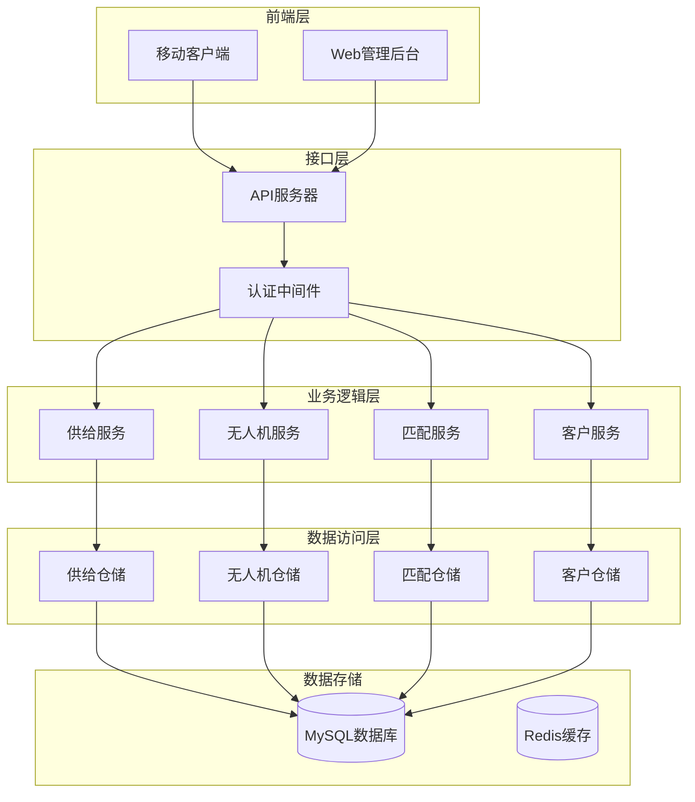
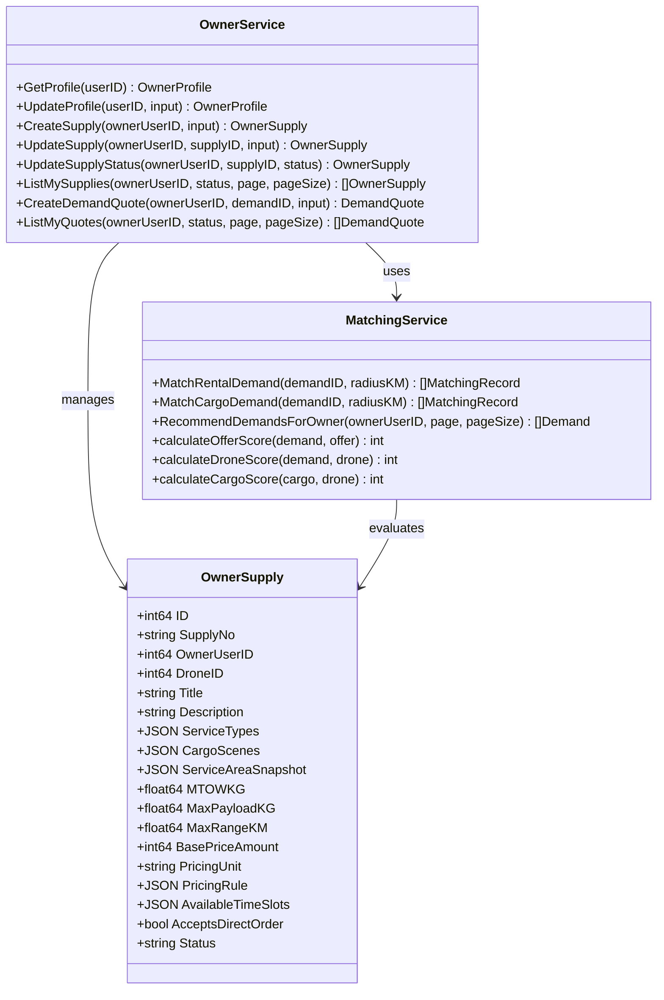
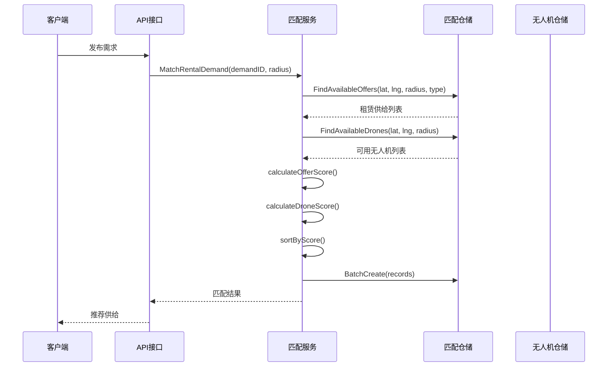
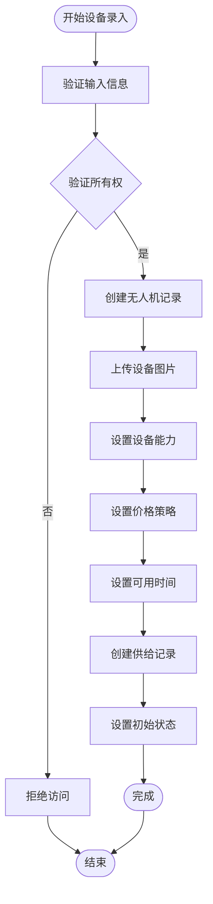
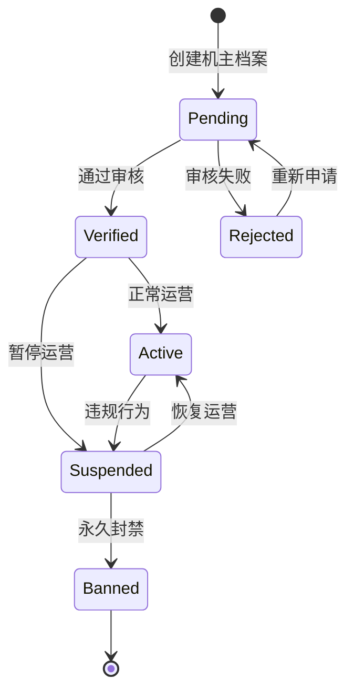
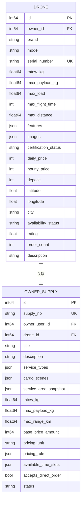
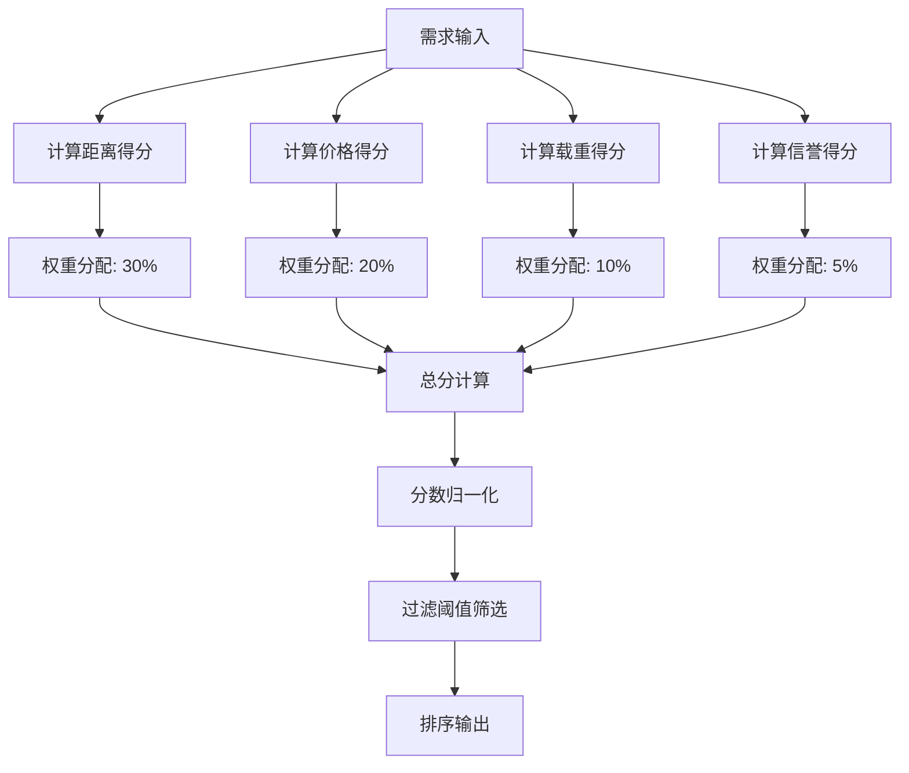
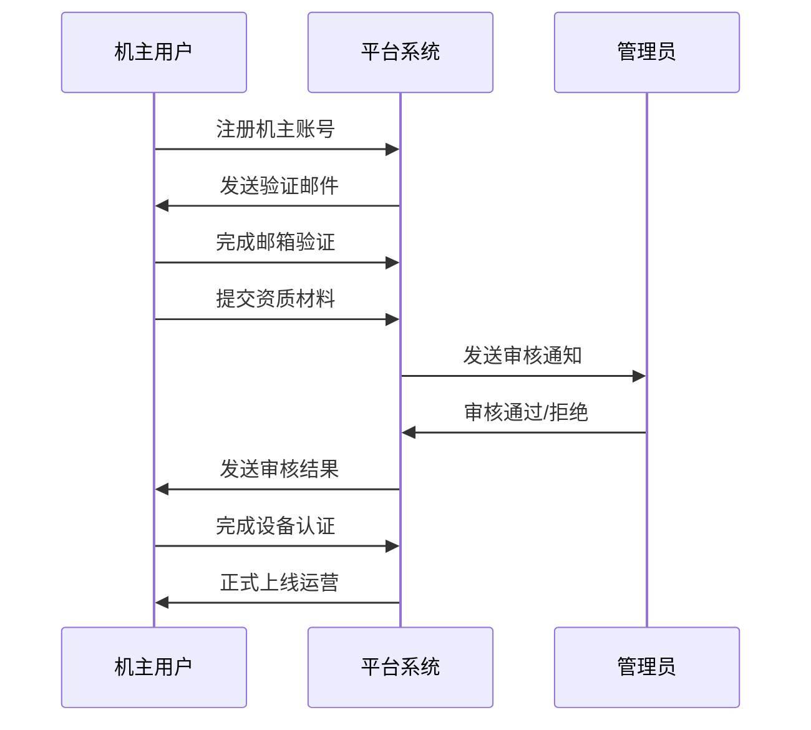

# 供给管理模块

<cite>
**本文档引用的文件**
- [matching_service.go](file://backend/internal/service/matching_service.go)
- [models.go](file://backend/internal/model/models.go)
- [matching_repo.go](file://backend/internal/repository/matching_repo.go)
- [owner_service.go](file://backend/internal/service/owner_service.go)
- [owner_domain_repo.go](file://backend/internal/repository/owner_domain_repo.go)
- [drone_service.go](file://backend/internal/service/drone_service.go)
- [supply.ts](file://mobile/src/services/supply.ts)
- [SupplyDirectOrderConfirmScreen.tsx](file://mobile/src/screens/supply/SupplyDirectOrderConfirmScreen.tsx)
- [client_service.go](file://backend/internal/service/client_service.go)
- [AddDroneScreen.tsx](file://mobile/src/screens/drone/AddDroneScreen.tsx)
</cite>

## 目录
1. [项目概述](#项目概述)
2. [系统架构](#系统架构)
3. [核心组件](#核心组件)
4. [供给发布流程](#供给发布流程)
5. [机主能力管理](#机主能力管理)
6. [无人机资产管理](#无人机资产管理)
7. [供给匹配策略](#供给匹配策略)
8. [定价机制](#定价机制)
9. [运营指导](#运营指导)
10. [故障排除指南](#故障排除指南)
11. [结论](#结论)

## 项目概述

供给管理模块是无人机租赁平台的核心业务模块之一，负责管理机主提供的无人机供给信息，实现供需匹配、价格策略制定和订单执行等功能。该模块采用微服务架构，前后端分离设计，支持移动端和Web端的双重交互。

## 系统架构

**图表来源**
- [matching_service.go:15-43](file://backend/internal/service/matching_service.go#L15-L43)
- [owner_service.go:16-25](file://backend/internal/service/owner_service.go#L16-L25)
- [drone_service.go:13-18](file://backend/internal/service/drone_service.go#L13-L18)

## 核心组件

### 供给服务 (SupplyService)

供给服务是机主管理无人机供给的核心组件，负责处理供给的创建、更新、状态管理和报价管理等功能。

**图表来源**
- [owner_service.go:16-80](file://backend/internal/service/owner_service.go#L16-L80)
- [matching_service.go:15-43](file://backend/internal/service/matching_service.go#L15-L43)
- [models.go:230-255](file://backend/internal/model/models.go#L230-L255)

**章节来源**
- [owner_service.go:16-80](file://backend/internal/service/owner_service.go#L16-L80)
- [models.go:230-255](file://backend/internal/model/models.go#L230-L255)

### 匹配服务 (MatchingService)

匹配服务负责根据供需双方的需求和条件进行智能匹配，计算匹配分数和推荐结果。

**图表来源**
- [matching_service.go:55-127](file://backend/internal/service/matching_service.go#L55-L127)
- [matching_repo.go:48-68](file://backend/internal/repository/matching_repo.go#L48-L68)

**章节来源**
- [matching_service.go:55-127](file://backend/internal/service/matching_service.go#L55-L127)
- [matching_repo.go:48-68](file://backend/internal/repository/matching_repo.go#L48-L68)

## 供给发布流程

### 设备信息录入

设备信息录入是供给发布的第一步，机主需要提供无人机的基本信息和配置参数。

**图表来源**
- [drone_service.go:36-69](file://backend/internal/service/drone_service.go#L36-L69)
- [AddDroneScreen.tsx:80-108](file://mobile/src/screens/drone/AddDroneScreen.tsx#L80-L108)

### 技术参数配置

技术参数配置包括无人机的载重能力、飞行性能、续航时间和安全配置等关键参数。

**章节来源**
- [drone_service.go:36-69](file://backend/internal/service/drone_service.go#L36-L69)
- [AddDroneScreen.tsx:22-32](file://mobile/src/screens/drone/AddDroneScreen.tsx#L22-L32)

### 可用时间设置

可用时间设置允许机主指定无人机的可租用时间段，支持灵活的时间安排和预订管理。

**章节来源**
- [owner_service.go:699-710](file://backend/internal/service/owner_service.go#L699-L710)

### 价格策略制定

价格策略制定涉及基础价格设定、计费单位选择和动态定价规则配置。

**章节来源**
- [owner_service.go:699-710](file://backend/internal/service/owner_service.go#L699-L710)
- [models.go:243-246](file://backend/internal/model/models.go#L243-L246)

## 机主能力管理

### 资质认证

机主能力管理包括多种资质认证，确保机主具备合法的运营能力和专业技能。

**图表来源**
- [models.go:51-68](file://backend/internal/model/models.go#L51-L68)
- [owner_service.go:614-650](file://backend/internal/service/owner_service.go#L614-L650)

### 信用评级

信用评级系统基于机主的历史表现、交易记录和合规情况建立综合信用评分。

**章节来源**
- [client_service.go:724-740](file://backend/internal/service/client_service.go#L724-L740)

### 服务能力评估

服务能力评估通过多维度指标评估机主的服务质量，包括设备状况、响应速度和服务评价等。

**章节来源**
- [models.go:51-68](file://backend/internal/model/models.go#L51-L68)

## 无人机资产管理

### 设备详情管理

设备详情管理涵盖无人机的基本信息、技术参数、状态变更和生命周期管理。

**图表来源**
- [models.go:91-148](file://backend/internal/model/models.go#L91-L148)
- [models.go:230-255](file://backend/internal/model/models.go#L230-L255)

### 维护保养记录

维护保养记录系统化管理无人机的维护历史，包括定期检查、维修保养和升级改造等。

**章节来源**
- [drone_service.go:393-429](file://backend/internal/service/drone_service.go#L393-L429)

### 保险状态跟踪

保险状态跟踪确保无人机具备有效的第三方责任险，保障飞行安全和法律责任。

**章节来源**
- [drone_service.go:247-284](file://backend/internal/service/drone_service.go#L247-L284)

## 供给匹配策略

### 匹配算法实现

供给匹配策略基于多因素评分算法，综合考虑距离、价格、载重能力和信誉等级等因素。

**图表来源**
- [matching_service.go:378-436](file://backend/internal/service/matching_service.go#L378-L436)

### 动态定价算法

动态定价算法根据市场供需关系、时间因素和竞争情况实时调整价格策略。

**章节来源**
- [matching_service.go:378-436](file://backend/internal/service/matching_service.go#L378-L436)

### 时段差异化策略

时段差异化策略针对不同时段设置不同的价格系数，高峰时段适当提高价格以平衡供需。

**章节来源**
- [models.go:243-246](file://backend/internal/model/models.go#L243-L246)

### 距离加价机制

距离加价机制根据供需双方的距离远近实施额外收费，鼓励就近匹配和降低物流成本。

**章节来源**
- [matching_service.go:465-474](file://backend/internal/service/matching_service.go#L465-L474)

## 定价机制

### 基础定价模型

基础定价模型采用多层次定价策略，支持按次、按小时和按天等多种计费方式。

**章节来源**
- [models.go:243-246](file://backend/internal/model/models.go#L243-L246)

### 动态价格调整

动态价格调整机制根据市场变化和供需关系自动调整价格，保持市场的竞争力和稳定性。

**章节来源**
- [owner_service.go:699-710](file://backend/internal/service/owner_service.go#L699-L710)

### 价格策略优化

价格策略优化通过数据分析和机器学习算法持续改进定价效果，提升平台的整体收益。

## 运营指导

### 机主入驻流程

机主入驻流程包括身份验证、资质审核、设备认证和正式上线等环节。

**图表来源**
- [owner_service.go:614-650](file://backend/internal/service/owner_service.go#L614-L650)

### 设备审核标准

设备审核标准涵盖技术参数、安全配置、适航证书和保险状态等多个方面的要求。

**章节来源**
- [drone_service.go:168-192](file://backend/internal/service/drone_service.go#L168-L192)

### 服务质量保障

服务质量保障体系通过多维度监控和评价机制确保供给质量和服务水平。

**章节来源**
- [client_service.go:724-740](file://backend/internal/service/client_service.go#L724-L740)

## 故障排除指南

### 常见问题诊断

常见问题包括供给发布失败、匹配结果异常、价格计算错误等，需要按照特定的排查步骤进行诊断和解决。

### 性能优化建议

性能优化建议包括数据库索引优化、缓存策略调整和并发处理改进等方面，以提升系统的响应速度和处理能力。

## 结论

供给管理模块通过完善的业务流程、智能的匹配算法和严格的质量控制，为无人机租赁平台提供了强大的供给管理能力。该模块不仅支持机主便捷地发布和管理无人机供给，还能为客户提供优质的匹配体验和可靠的服务保障。随着技术的不断发展和业务需求的变化，供给管理模块将持续优化和完善，为平台的发展提供强有力的支持。