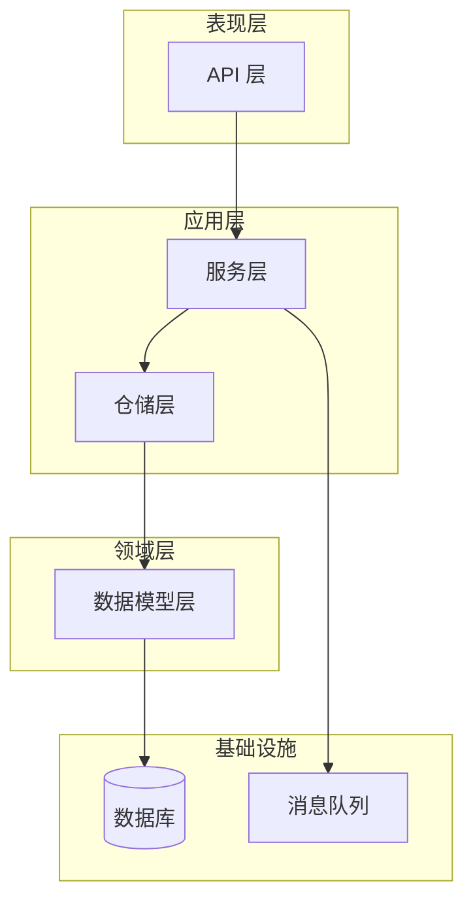
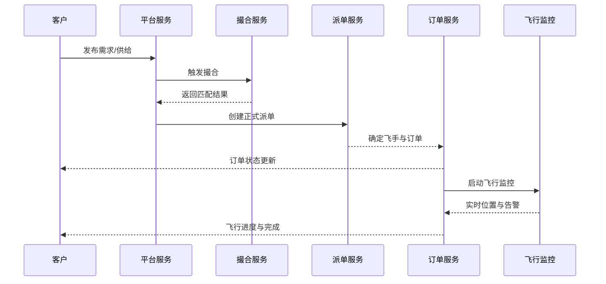
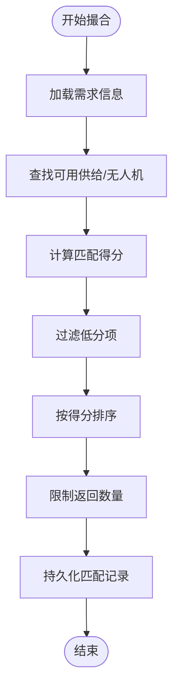
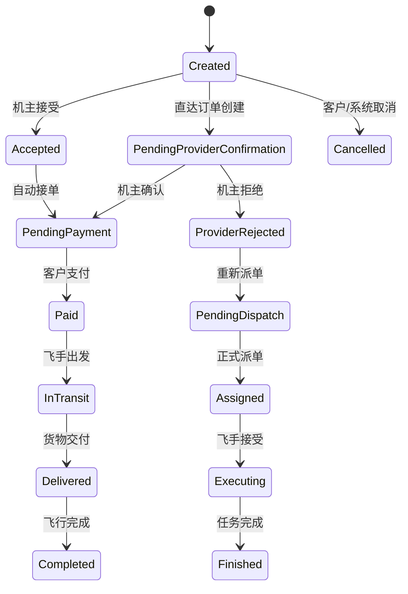
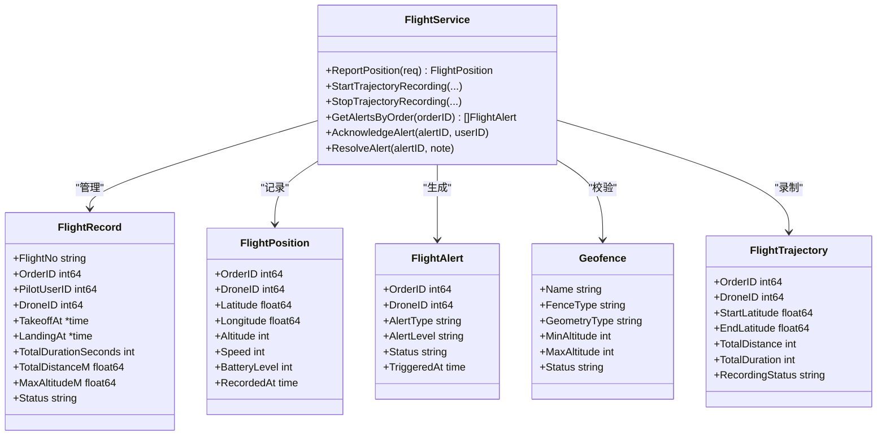
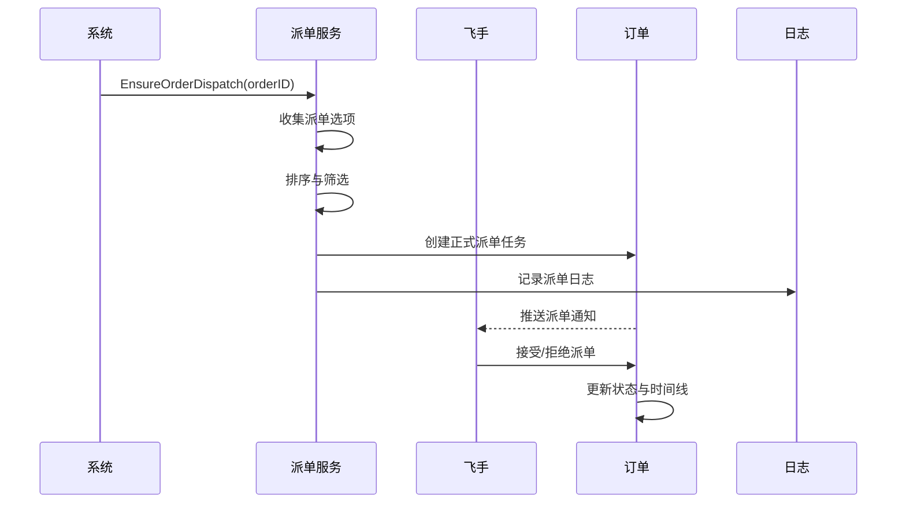
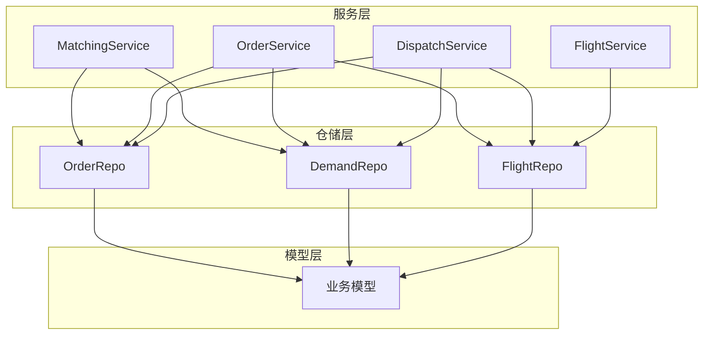

# 核心业务模块

<cite>
**本文档引用的文件**
- [models.go](file://backend/internal/model/models.go)
- [matching_service.go](file://backend/internal/service/matching_service.go)
- [order_service.go](file://backend/internal/service/order_service.go)
- [flight_service.go](file://backend/internal/service/flight_service.go)
- [dispatch_service.go](file://backend/internal/service/dispatch_service.go)
- [order_repo.go](file://backend/internal/repository/order_repo.go)
- [demand_repo.go](file://backend/internal/repository/demand_repo.go)
- [flight_repo.go](file://backend/internal/repository/flight_repo.go)
</cite>

## 目录
1. [引言](#引言)
2. [项目结构](#项目结构)
3. [核心组件](#核心组件)
4. [架构概览](#架构概览)
5. [详细组件分析](#详细组件分析)
6. [依赖分析](#依赖分析)
7. [性能考虑](#性能考虑)
8. [故障排除指南](#故障排除指南)
9. [结论](#结论)

## 引言

本文件为无人机租赁平台核心业务模块的综合技术文档，面向开发者和业务分析师，旨在深入解析平台的五大核心对象（需求、供给、订单、正式派单、飞行记录）的业务逻辑与实现细节，阐述四类角色（客户、机主、飞手、复合身份）的权限模型与业务流程，并详细解释撮合算法、订单状态机、飞行监控机制等关键技术实现。

## 项目结构

后端采用分层架构设计，主要分为以下层次：
- 数据模型层：定义业务实体及字段约束
- 仓储层：封装数据库访问逻辑
- 服务层：实现业务规则与流程编排
- API 层：对外暴露 REST 接口（位于 api/v1 和 api/v2）

**图表来源**
- [models.go:1-2701](file://backend/internal/model/models.go#L1-L2701)
- [order_repo.go:1-252](file://backend/internal/repository/order_repo.go#L1-L252)
- [order_service.go:1-1755](file://backend/internal/service/order_service.go#L1-L1755)

**章节来源**
- [models.go:1-2701](file://backend/internal/model/models.go#L1-L2701)
- [order_repo.go:1-252](file://backend/internal/repository/order_repo.go#L1-L252)

## 核心组件

### 五大核心对象

1. **需求对象**
   - 租赁需求：RentalDemand
   - 货运需求：CargoDemand  
   - 平台需求：Demand + DemandQuote + DemandCandidatePilot

2. **供给对象**
   - 出租供给：RentalOffer
   - 机主供给：OwnerSupply

3. **订单对象**
   - 订单：Order + OrderTimeline + OrderSnapshot
   - 支付：Payment + Refund
   - 评价：Review
   - 纠纷：DisputeRecord

4. **正式派单对象**
   - 正式派单任务：FormalDispatchTask + FormalDispatchLog
   - 旧任务池：DispatchTask + DispatchCandidate

5. **飞行记录对象**
   - 飞行记录：FlightRecord + FlightPosition + FlightAlert
   - 轨迹：FlightTrajectory + FlightWaypoint
   - 围栏：Geofence + GeofenceViolation

**章节来源**
- [models.go:261-570](file://backend/internal/model/models.go#L261-L570)
- [models.go:1118-1599](file://backend/internal/model/models.go#L1118-L1599)

### 四类角色与权限模型

- 客户（Client）：发布需求、支付、评价、申诉
- 机主（Owner）：发布供给、确认订单、绑定飞手
- 飞手（Pilot）：接受派单、执行飞行、上报位置
- 复合身份：用户可同时具备多种角色属性

权限控制贯穿各对象的状态流转与操作边界，确保业务合规与安全。

**章节来源**
- [models.go:9-1012](file://backend/internal/model/models.go#L9-L1012)

## 架构概览

系统采用事件驱动与状态机相结合的设计模式：

**图表来源**
- [matching_service.go:54-178](file://backend/internal/service/matching_service.go#L54-L178)
- [dispatch_service.go:632-779](file://backend/internal/service/dispatch_service.go#L632-L779)
- [order_service.go:65-243](file://backend/internal/service/order_service.go#L65-L243)
- [flight_service.go:113-158](file://backend/internal/service/flight_service.go#L113-L158)

## 详细组件分析

### 撮合算法组件

撮合算法负责为需求寻找最匹配的供给或飞手-无人机组合，支持多场景匹配：

- 租赁需求撮合：基于距离、预算、载荷、评分等维度计算得分
- 货运需求撮合：综合载重、航程、评分等因素
- 机主需求推荐：根据机主供给与客户风险等级进行推荐

**图表来源**
- [matching_service.go:54-127](file://backend/internal/service/matching_service.go#L54-L127)
- [matching_service.go:129-178](file://backend/internal/service/matching_service.go#L129-L178)

**章节来源**
- [matching_service.go:1-736](file://backend/internal/service/matching_service.go#L1-L736)

### 订单状态机组件

订单状态机覆盖从创建到完成的全生命周期，关键状态包括：
- created/pending_provider_confirmation → accepted → pending_payment → paid → in_transit → delivered → completed
- 支持取消、拒绝、异常等分支状态

**图表来源**
- [order_service.go:542-792](file://backend/internal/service/order_service.go#L542-L792)
- [order_repo.go:119-158](file://backend/internal/repository/order_repo.go#L119-L158)

**章节来源**
- [order_service.go:1-1755](file://backend/internal/service/order_service.go#L1-L1755)
- [order_repo.go:1-252](file://backend/internal/repository/order_repo.go#L1-L252)

### 飞行监控组件

飞行监控提供实时位置上报、轨迹录制、围栏管理与告警处理能力：

- 位置上报：接收无人机实时位置与状态数据
- 飞行记录：按订单生成飞行记录，汇总飞行统计
- 轨迹录制：生成航点序列与统计指标
- 围栏管理：电子围栏定义与违规检测
- 告警处理：低电量、偏航、超速、信号丢失等告警

**图表来源**
- [flight_service.go:17-82](file://backend/internal/service/flight_service.go#L17-L82)
- [models.go:1310-1599](file://backend/internal/model/models.go#L1310-L1599)

**章节来源**
- [flight_service.go:1-1346](file://backend/internal/service/flight_service.go#L1-L1346)
- [flight_repo.go:1-911](file://backend/internal/repository/flight_repo.go#L1-L911)

### 正式派单组件

正式派单组件负责将订单与飞手建立正式的执行关系，支持自动派单与手动重派：

- 自动派单：基于机主绑定、需求候选池、普通飞手池的优先级策略
- 手动重派：机主或系统在异常情况下重新指派飞手
- 状态流转：pending_response → accepted/executing/finished/exception/expired

**图表来源**
- [dispatch_service.go:632-779](file://backend/internal/service/dispatch_service.go#L632-L779)
- [dispatch_service.go:1325-1424](file://backend/internal/service/dispatch_service.go#L1325-L1424)

**章节来源**
- [dispatch_service.go:1-1847](file://backend/internal/service/dispatch_service.go#L1-L1847)

## 依赖分析

服务层组件之间的依赖关系如下：

**图表来源**
- [matching_service.go:15-43](file://backend/internal/service/matching_service.go#L15-L43)
- [order_service.go:18-63](file://backend/internal/service/order_service.go#L18-L63)
- [dispatch_service.go:17-92](file://backend/internal/service/dispatch_service.go#L17-L92)
- [flight_service.go:17-69](file://backend/internal/service/flight_service.go#L17-L69)

**章节来源**
- [matching_service.go:1-736](file://backend/internal/service/matching_service.go#L1-L736)
- [order_service.go:1-1755](file://backend/internal/service/order_service.go#L1-L1755)
- [dispatch_service.go:1-1847](file://backend/internal/service/dispatch_service.go#L1-L1847)
- [flight_service.go:1-1346](file://backend/internal/service/flight_service.go#L1-L1346)

## 性能考虑

- 撮合算法优化
  - 使用索引与预过滤减少候选集规模
  - 分层匹配策略（默认半径→扩展半径→最大半径），避免全量扫描
  - 得分计算采用向量化与缓存热点数据

- 订单状态机
  - 状态变更通过事务保证一致性
  - 时间线与快照异步写入，降低主流程阻塞

- 飞行监控
  - 位置上报采用批量写入与压缩
  - 轨迹简化算法降低存储与传输成本
  - 围栏检测在业务层进行，避免复杂地理计算

- 数据库访问
  - 仓储层统一处理预加载与分页
  - 对高频查询建立复合索引与物化视图

## 故障排除指南

- 订单状态异常
  - 检查状态机转换条件与前置状态
  - 核对时间线记录与异常日志
  - 必要时通过仓储层直接更新状态

- 撮合无结果
  - 检查需求参数与供给准入条件
  - 验证匹配半径与权重配置
  - 查看匹配日志与风险评估

- 飞行监控告警
  - 核对阈值配置与设备上报频率
  - 检查围栏定义与生效时间
  - 确认告警处理流程（确认→解决）

- 派单失败
  - 检查飞手绑定状态与资质
  - 验证任务池与正式派单配置
  - 查看重派日志与异常原因

**章节来源**
- [order_repo.go:77-88](file://backend/internal/repository/order_repo.go#L77-L88)
- [flight_repo.go:199-217](file://backend/internal/repository/flight_repo.go#L199-L217)
- [dispatch_service.go:1208-1282](file://backend/internal/service/dispatch_service.go#L1208-L1282)

## 结论

本文档系统梳理了无人机租赁平台的核心业务模块，从数据模型、服务编排到关键技术实现进行了深入分析。通过清晰的状态机设计、高效的撮合算法与完善的飞行监控体系，平台实现了从需求发布、撮合匹配、订单执行到飞行监管的全链路闭环。建议在后续迭代中持续优化算法性能、增强异常处理能力，并完善监控与审计机制，以支撑业务的规模化发展。