# 派单与飞行监控模块

<cite>
**本文档引用的文件**
- [backend/internal/api/v1/dispatch/handler.go](file://backend/internal/api/v1/dispatch/handler.go)
- [backend/internal/api/v1/flight/handler.go](file://backend/internal/api/v1/flight/handler.go)
- [backend/internal/service/dispatch_service.go](file://backend/internal/service/dispatch_service.go)
- [backend/internal/service/flight_service.go](file://backend/internal/service/flight_service.go)
- [backend/internal/repository/dispatch_repo.go](file://backend/internal/repository/dispatch_repo.go)
- [backend/internal/repository/flight_repo.go](file://backend/internal/repository/flight_repo.go)
- [mobile/src/screens/dispatch/CreateDispatchTaskScreen.tsx](file://mobile/src/screens/dispatch/CreateDispatchTaskScreen.tsx)
- [mobile/src/screens/flight/FlightMonitoringScreen.tsx](file://mobile/src/screens/flight/FlightMonitoringScreen.tsx)
- [mobile/src/services/dispatch.ts](file://mobile/src/services/dispatch.ts)
- [mobile/src/services/flight.ts](file://mobile/src/services/flight.ts)
</cite>

## 目录
1. [项目概述](#项目概述)
2. [系统架构](#系统架构)
3. [核心组件](#核心组件)
4. [派单任务管理](#派单任务管理)
5. [飞行监控系统](#飞行监控系统)
6. [匹配算法与优化](#匹配算法与优化)
7. [数据存储与查询](#数据存储与查询)
8. [安全监控与应急处置](#安全监控与应急处置)
9. [移动端集成](#移动端集成)
10. [性能优化建议](#性能优化建议)
11. [故障排查指南](#故障排查指南)
12. [总结](#总结)

## 项目概述

派单与飞行监控模块是无人机租赁平台的核心功能模块，负责实现智能派单管理和实时飞行监控两大核心业务场景。该模块通过先进的算法匹配技术和实时数据采集能力，为用户提供高效、安全、可靠的无人机配送服务。

### 主要功能特性

- **智能派单管理**：支持多种派单模式，包括绑定飞手、候选飞手池和普通飞手池
- **实时飞行监控**：提供GPS定位数据采集、轨迹绘制、电子围栏管理
- **异常预警机制**：基于阈值的自动化告警系统
- **飞行记录存储**：完整的飞行数据持久化和历史查询
- **作业效率分析**：提供详细的飞行统计和分析报告

## 系统架构

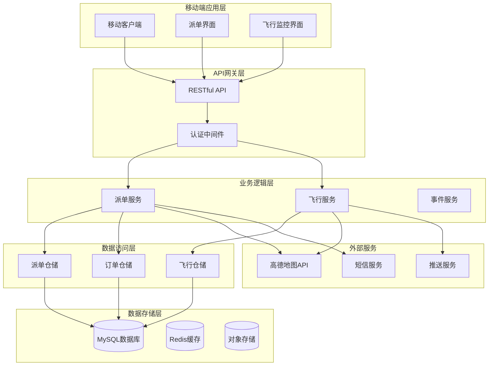

**图表来源**
- [backend/internal/api/v1/dispatch/handler.go:18-46](file://backend/internal/api/v1/dispatch/handler.go#L18-L46)
- [backend/internal/api/v1/flight/handler.go:16-27](file://backend/internal/api/v1/flight/handler.go#L16-L27)

## 核心组件

### 派单服务组件

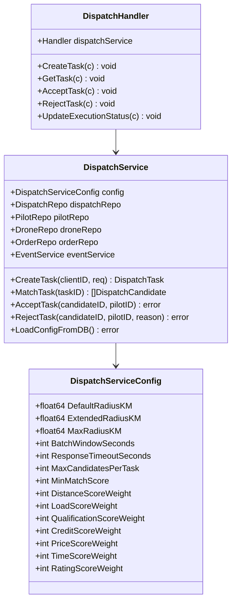

**图表来源**
- [backend/internal/service/dispatch_service.go:17-92](file://backend/internal/service/dispatch_service.go#L17-L92)
- [backend/internal/api/v1/dispatch/handler.go:18-46](file://backend/internal/api/v1/dispatch/handler.go#L18-L46)

### 飞行监控组件

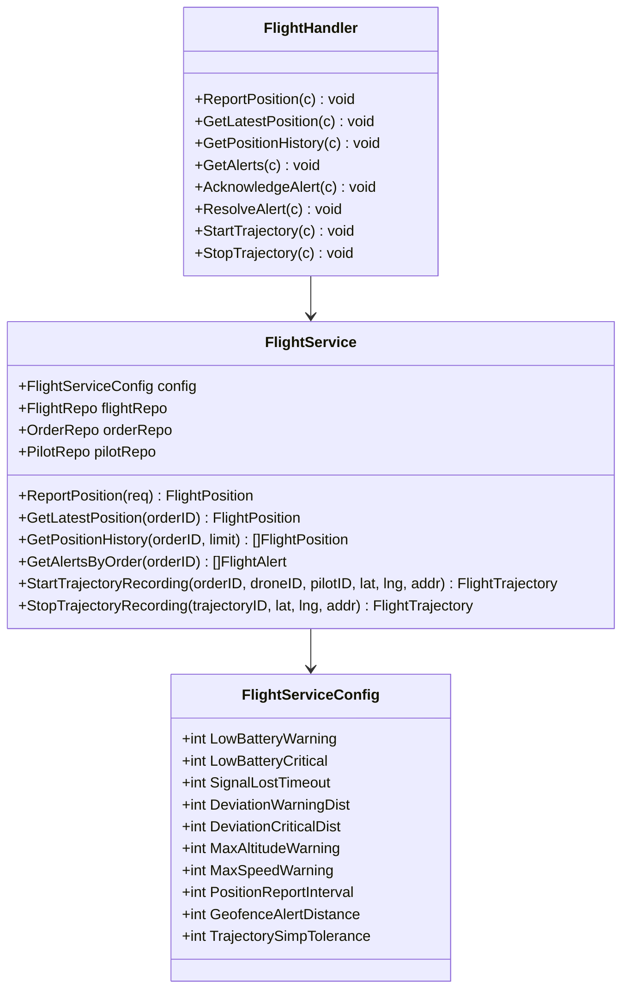

**图表来源**
- [backend/internal/service/flight_service.go:17-69](file://backend/internal/service/flight_service.go#L17-L69)
- [backend/internal/api/v1/flight/handler.go:16-27](file://backend/internal/api/v1/flight/handler.go#L16-L27)

## 派单任务管理

### 任务创建流程

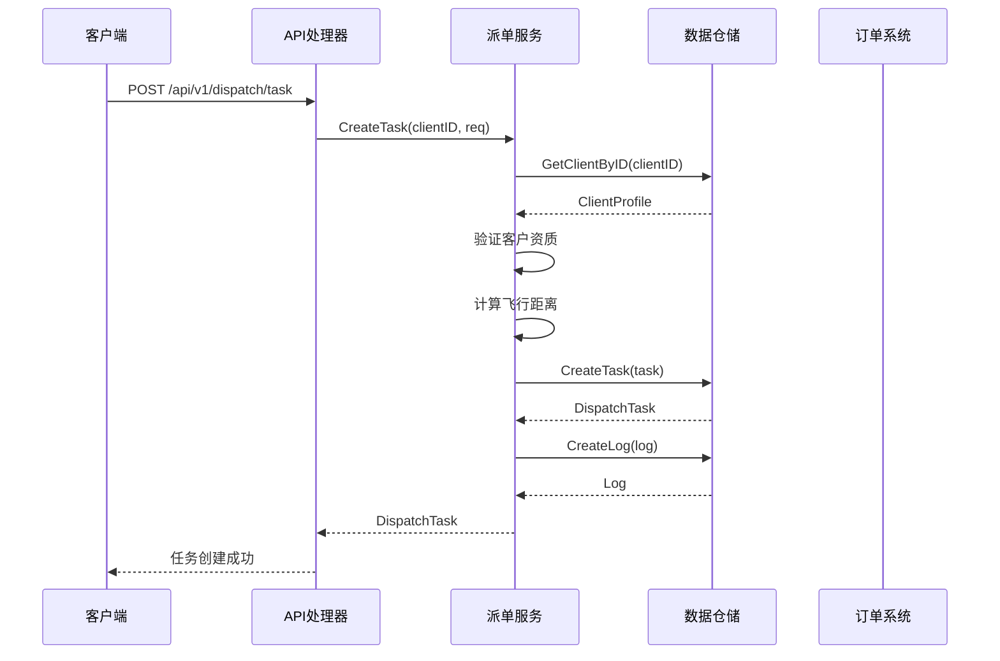

**图表来源**
- [backend/internal/api/v1/dispatch/handler.go:50-147](file://backend/internal/api/v1/dispatch/handler.go#L50-L147)
- [backend/internal/service/dispatch_service.go:189-260](file://backend/internal/service/dispatch_service.go#L189-L260)

### 匹配算法实现

派单系统采用多维度评分算法，综合考虑以下因素：

1. **距离因素**：5公里内满分，15公里外按比例递减
2. **载荷匹配**：根据无人机最大载重与任务重量比计算
3. **资质匹配**：基于飞手执照类型、飞行时长、飞行距离能力
4. **信用评分**：基于飞手信用分数
5. **价格匹配**：估算价格与客户预算的匹配度
6. **时间匹配**：预计完成时间与客户需求时间的匹配
7. **服务评分**：飞手和无人机的综合评分

**章节来源**
- [backend/internal/service/dispatch_service.go:289-497](file://backend/internal/service/dispatch_service.go#L289-L497)

### 飞手执行流程

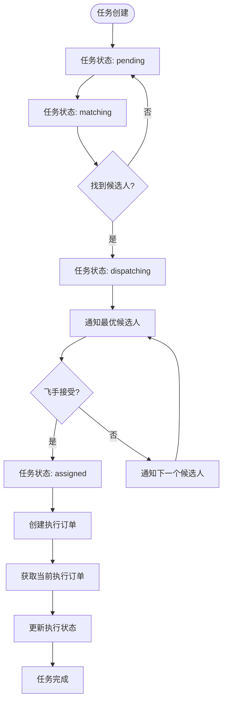

**图表来源**
- [backend/internal/api/v1/dispatch/handler.go:518-629](file://backend/internal/api/v1/dispatch/handler.go#L518-L629)
- [backend/internal/service/dispatch_service.go:538-601](file://backend/internal/service/dispatch_service.go#L538-L601)

**章节来源**
- [backend/internal/api/v1/dispatch/handler.go:282-728](file://backend/internal/api/v1/dispatch/handler.go#L282-L728)

## 飞行监控系统

### 实时位置监控

飞行监控系统提供全方位的实时数据采集和分析能力：

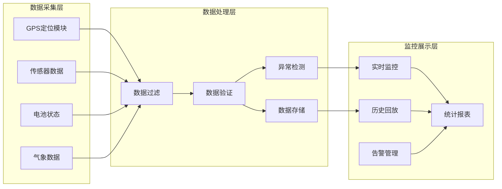

**图表来源**
- [backend/internal/service/flight_service.go:112-158](file://backend/internal/service/flight_service.go#L112-L158)

### 告警管理系统

系统内置多层次的告警机制：

| 告警类型 | 阈值 | 等级 | 触发条件 |
|---------|------|------|----------|
| 低电量 | 30% | 警告 | 电量 ≤ 30% |
| 低电量 | 15% | 严重 | 电量 ≤ 15% |
| 飞行高度 | 120米 | 警告 | 高度 > 120米 |
| 飞行速度 | 15 m/s | 警告 | 速度 > 15 m/s |
| 信号强度 | 30% | 警告 | 信号 < 30% |
| 电子围栏 | 100米 | 警告 | 接近围栏边界 |

**章节来源**
- [backend/internal/service/flight_service.go:471-533](file://backend/internal/service/flight_service.go#L471-L533)

### 轨迹记录与分析

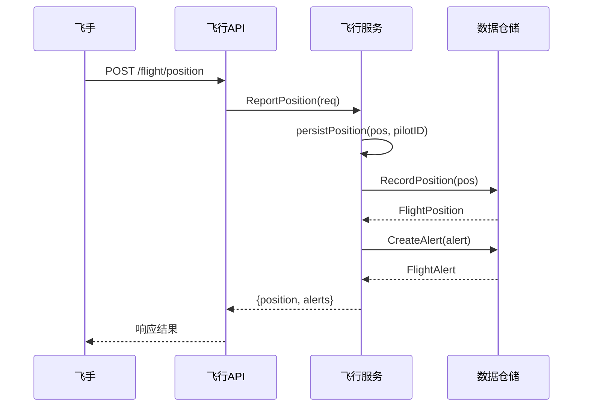

**图表来源**
- [backend/internal/api/v1/flight/handler.go:31-65](file://backend/internal/api/v1/flight/handler.go#L31-L65)
- [backend/internal/service/flight_service.go:112-158](file://backend/internal/service/flight_service.go#L112-L158)

**章节来源**
- [backend/internal/api/v1/flight/handler.go:29-114](file://backend/internal/api/v1/flight/handler.go#L29-L114)

## 匹配算法与优化

### 多层次匹配策略

系统采用分层匹配算法，逐步扩大搜索范围：

1. **第一层匹配**：默认半径5公里内搜索
2. **第二层匹配**：扩展半径15公里内搜索  
3. **第三层匹配**：最大半径50公里内搜索

每层匹配都会：
- 过滤可用的飞手-无人机组合
- 计算匹配分数
- 去重防止同一飞手多次出现
- 保留最高分数的候选人

### 匹配分数计算

| 评分维度 | 权重 | 计算方式 | 分数范围 |
|---------|------|----------|----------|
| 距离评分 | 25% | 5公里内满分，15公里外递减 | 0-25分 |
| 载荷评分 | 15% | 基于载重比计算 | 0-15分 |
| 资质评分 | 20% | 执照类型+飞行时长+距离能力 | 0-20分 |
| 信用评分 | 15% | 基于信用分数 | 0-15分 |
| 价格评分 | 10% | 估算价格与预算匹配度 | 0-10分 |
| 时间评分 | 10% | 预计完成时间匹配度 | 0-10分 |
| 服务评分 | 5% | 飞手+无人机综合评分 | 0-5分 |

**章节来源**
- [backend/internal/service/dispatch_service.go:383-497](file://backend/internal/service/dispatch_service.go#L383-L497)

### 性能优化策略

1. **索引优化**：为常用查询字段建立合适索引
2. **批量处理**：支持批量候选人创建和更新
3. **缓存策略**：使用Redis缓存热点数据
4. **异步处理**：告警通知采用异步队列处理
5. **分页查询**：大数据量场景使用分页查询

## 数据存储与查询

### 数据模型设计

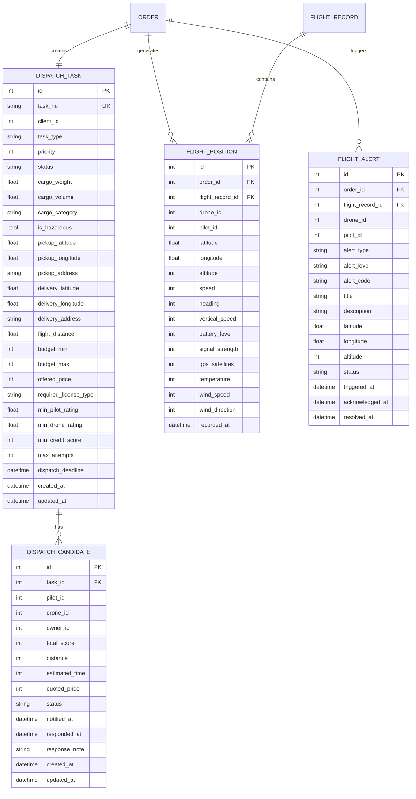

**图表来源**
- [backend/internal/repository/dispatch_repo.go:26-58](file://backend/internal/repository/dispatch_repo.go#L26-L58)
- [backend/internal/repository/flight_repo.go:38-152](file://backend/internal/repository/flight_repo.go#L38-L152)

### 查询优化策略

1. **索引设计**：
   - 任务状态和创建时间索引
   - 飞手ID和无人机ID索引
   - 订单ID和时间戳索引

2. **查询优化**：
   - 使用预加载避免N+1查询
   - 实施分页查询处理大数据集
   - 缓存常用查询结果

3. **数据归档**：
   - 自动清理历史数据
   - 分表策略处理海量位置数据

**章节来源**
- [backend/internal/repository/dispatch_repo.go:62-126](file://backend/internal/repository/dispatch_repo.go#L62-L126)
- [backend/internal/repository/flight_repo.go:107-146](file://backend/internal/repository/flight_repo.go#L107-L146)

## 安全监控与应急处置

### 安全监控机制

系统实施多层次的安全监控：

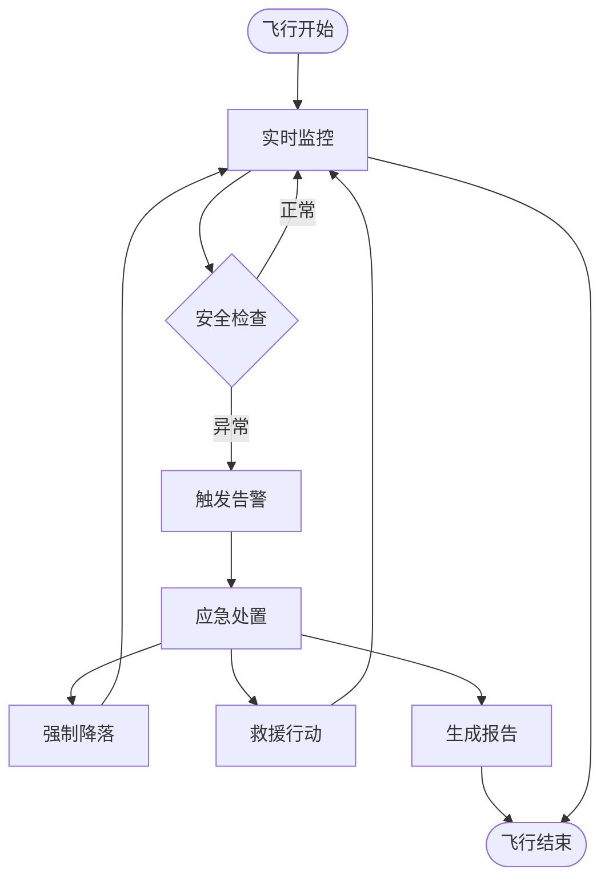

### 应急处置流程

1. **告警确认**：人工确认告警真实性
2. **风险评估**：评估飞行风险等级
3. **处置决策**：制定应急处置方案
4. **执行处置**：执行相应的应急措施
5. **记录归档**：完整记录处置过程

### 数据备份策略

1. **实时备份**：关键数据实时备份
2. **增量备份**：定期增量备份
3. **全量备份**：每周全量备份
4. **异地备份**：重要数据异地存储
5. **恢复测试**：定期进行数据恢复测试

## 移动端集成

### 派单管理界面

移动端提供直观的派单管理界面：

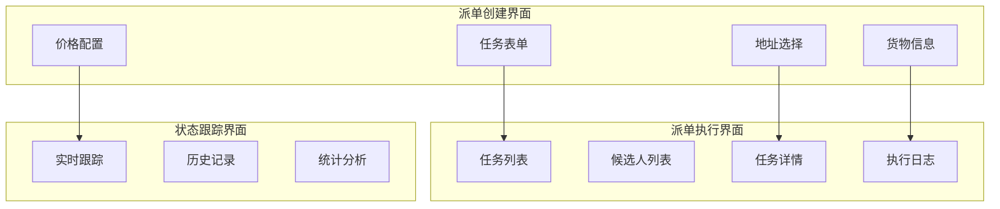

**图表来源**
- [mobile/src/screens/dispatch/CreateDispatchTaskScreen.tsx:77-338](file://mobile/src/screens/dispatch/CreateDispatchTaskScreen.tsx#L77-L338)

### 飞行监控界面

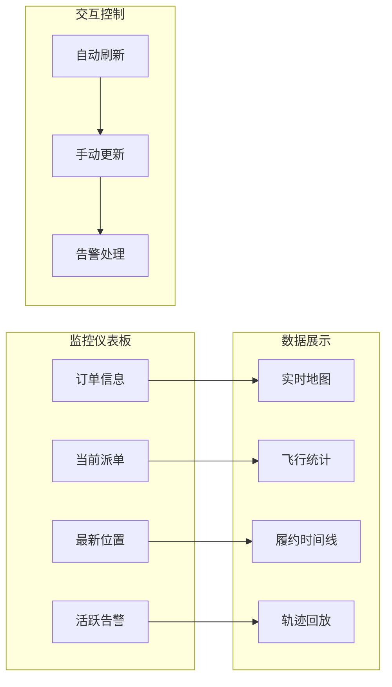

**图表来源**
- [mobile/src/screens/flight/FlightMonitoringScreen.tsx:236-430](file://mobile/src/screens/flight/FlightMonitoringScreen.tsx#L236-L430)

**章节来源**
- [mobile/src/screens/dispatch/CreateDispatchTaskScreen.tsx:1-573](file://mobile/src/screens/dispatch/CreateDispatchTaskScreen.tsx#L1-L573)
- [mobile/src/screens/flight/FlightMonitoringScreen.tsx:1-708](file://mobile/src/screens/flight/FlightMonitoringScreen.tsx#L1-L708)

## 性能优化建议

### 后端性能优化

1. **数据库优化**
   - 为高频查询字段建立复合索引
   - 实施查询缓存策略
   - 使用连接池管理数据库连接

2. **内存优化**
   - 合理使用内存缓存
   - 实施对象池减少GC压力
   - 优化数据结构减少内存占用

3. **并发优化**
   - 使用goroutine池控制并发数量
   - 实施限流保护系统
   - 使用channel进行协程间通信

### 移动端性能优化

1. **网络优化**
   - 实施HTTP连接复用
   - 使用压缩传输减少带宽
   - 实施离线数据缓存

2. **UI渲染优化**
   - 使用FlatList优化列表渲染
   - 实施图片懒加载
   - 减少不必要的重绘

3. **内存管理**
   - 及时释放不再使用的资源
   - 使用WeakReference避免内存泄漏
   - 实施数据分页加载

## 故障排查指南

### 常见问题诊断

| 问题类型 | 症状描述 | 排查步骤 | 解决方案 |
|---------|----------|----------|----------|
| 派单不匹配 | 无法找到合适的飞手 | 检查飞手在线状态、无人机可用性、匹配半径设置 | 调整匹配参数、检查飞手资质 |
| 位置数据异常 | GPS定位不准确 | 检查GPS模块、网络信号、设备权限 | 重启GPS模块、检查网络连接 |
| 告警误报 | 频繁触发告警 | 检查阈值设置、传感器校准 | 调整告警阈值、重新校准传感器 |
| 数据延迟 | 实时数据更新缓慢 | 检查网络延迟、服务器负载 | 优化网络配置、增加服务器资源 |

### 日志分析方法

1. **错误日志**：分析错误类型和发生频率
2. **性能日志**：监控响应时间和资源使用情况
3. **业务日志**：跟踪关键业务流程的执行情况
4. **安全日志**：监控异常访问和安全事件

### 监控指标

- **系统可用性**：99.9%以上
- **响应时间**：95%请求 < 2秒
- **数据一致性**：实时同步延迟 < 1秒
- **告警准确率**：> 95%
- **故障恢复时间**：< 5分钟

## 总结

派单与飞行监控模块通过先进的算法技术和完善的监控体系，为无人机租赁平台提供了高效、安全、可靠的服务保障。模块具有以下特点：

1. **智能化程度高**：采用多维度匹配算法，实现精准的飞手-无人机匹配
2. **实时性强**：提供毫秒级的数据采集和处理能力
3. **安全性好**：多层次的安全监控和应急处置机制
4. **扩展性强**：模块化设计支持功能扩展和性能优化
5. **用户体验佳**：简洁直观的移动端界面和丰富的数据展示

通过持续的技术创新和优化改进，该模块将继续为无人机配送行业提供强有力的技术支撑，推动行业的数字化转型和智能化升级。