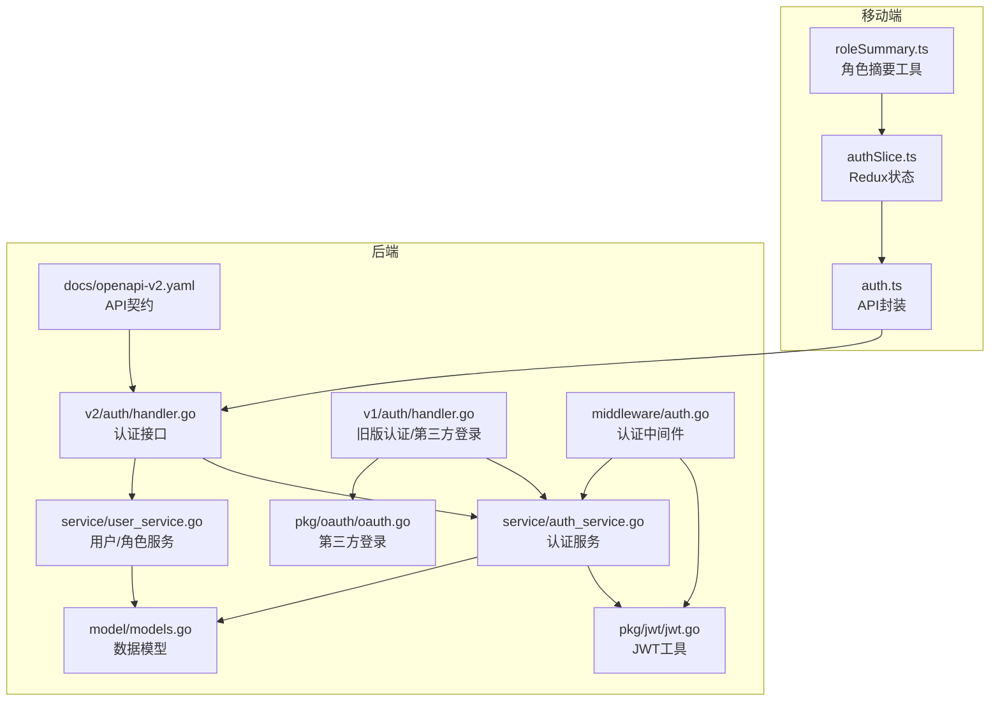
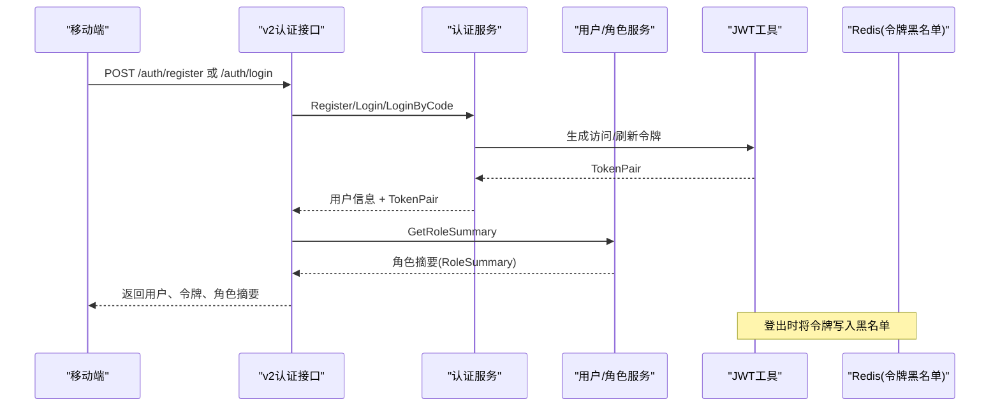
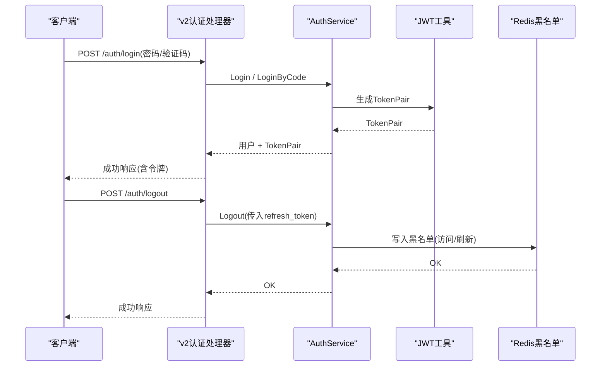
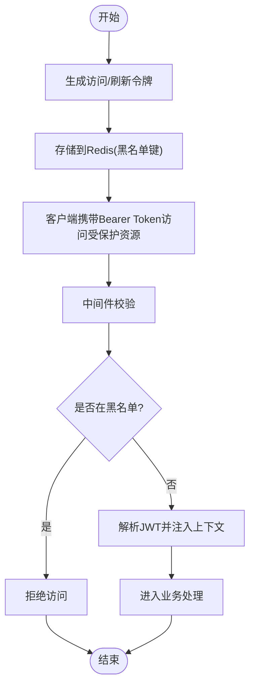
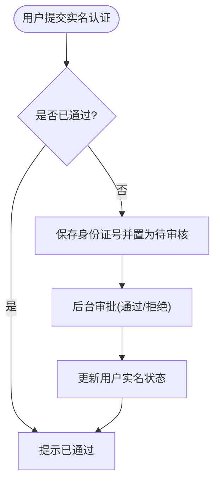
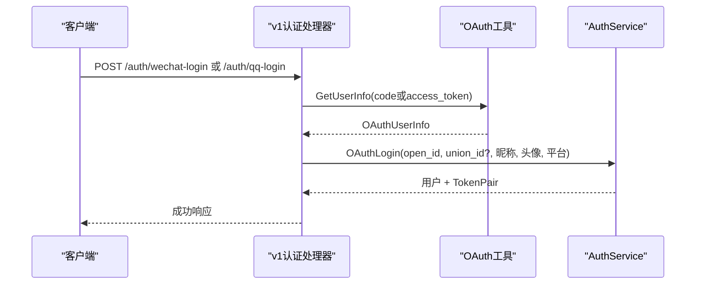
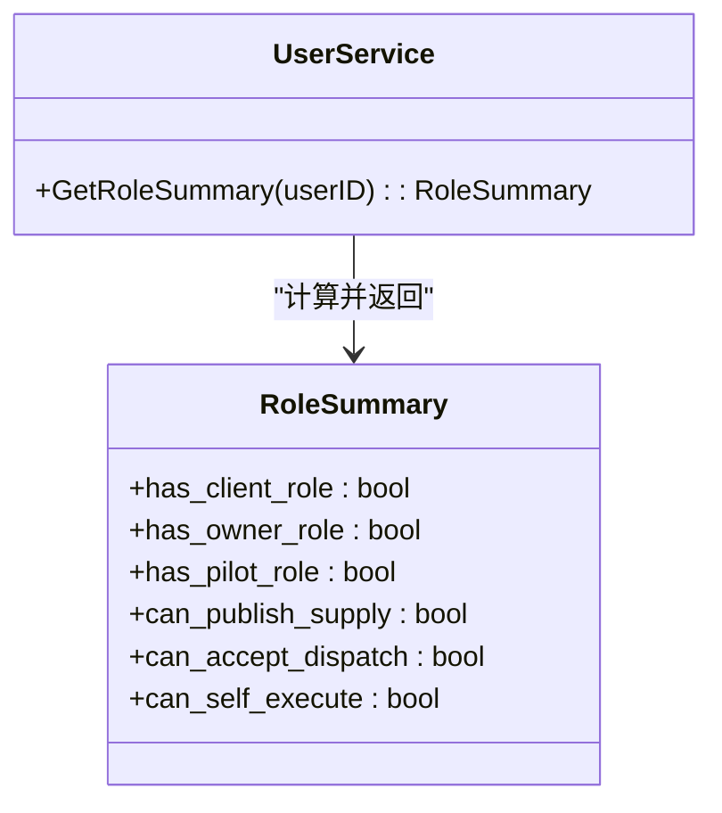
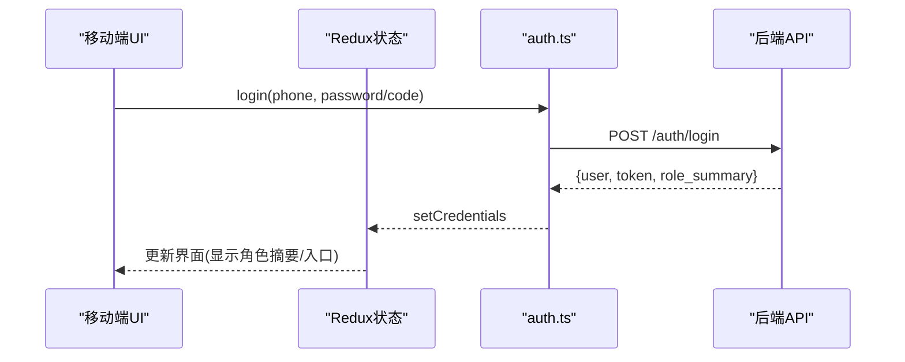
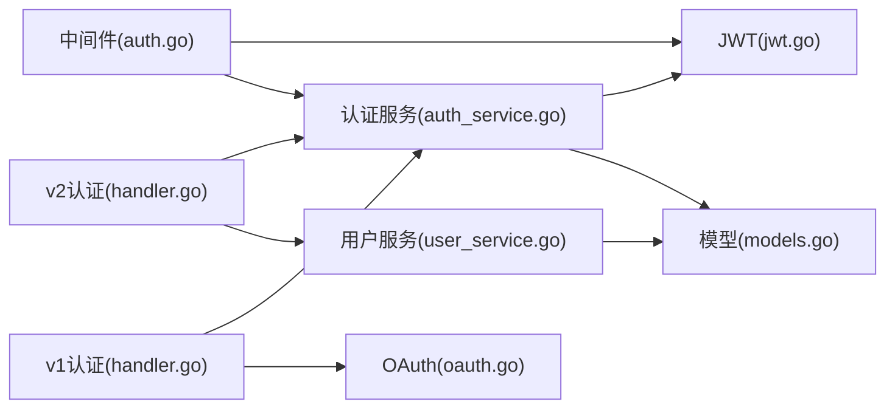

# 用户身份与权限系统

<cite>
**本文档引用的文件**
- [backend/internal/api/middleware/auth.go](file://backend/internal/api/middleware/auth.go)
- [backend/internal/pkg/jwt/jwt.go](file://backend/internal/pkg/jwt/jwt.go)
- [backend/internal/service/auth_service.go](file://backend/internal/service/auth_service.go)
- [backend/internal/service/user_service.go](file://backend/internal/service/user_service.go)
- [backend/internal/api/v2/auth/handler.go](file://backend/internal/api/v2/auth/handler.go)
- [backend/internal/api/v1/auth/handler.go](file://backend/internal/api/v1/auth/handler.go)
- [backend/internal/pkg/oauth/oauth.go](file://backend/internal/pkg/oauth/oauth.go)
- [backend/internal/model/models.go](file://backend/internal/model/models.go)
- [backend/docs/openapi-v2.yaml](file://backend/docs/openapi-v2.yaml)
- [mobile/src/services/auth.ts](file://mobile/src/services/auth.ts)
- [mobile/src/store/slices/authSlice.ts](file://mobile/src/store/slices/authSlice.ts)
- [mobile/src/utils/roleSummary.ts](file://mobile/src/utils/roleSummary.ts)
</cite>

## 目录
1. [简介](#简介)
2. [项目结构](#项目结构)
3. [核心组件](#核心组件)
4. [架构总览](#架构总览)
5. [详细组件分析](#详细组件分析)
6. [依赖分析](#依赖分析)
7. [性能考虑](#性能考虑)
8. [故障排查指南](#故障排查指南)
9. [结论](#结论)
10. [附录](#附录)

## 简介
本系统围绕“账号+能力档案+业务关系”的新型权限模型重构了传统按人分角色的模式，实现更灵活、可组合、可演进的角色能力边界。系统提供完整的用户身份与权限体系，包括：
- 用户注册与登录（密码/验证码/第三方）
- 实名认证与能力档案（客户、机主、飞手）
- JWT认证与会话管理（含黑名单）
- 权限验证中间件与API路由安全
- 角色切换与能力验证（基于能力档案与业务关系）

## 项目结构
后端采用分层架构：API层（v1/v2）、服务层、仓储层、模型层、工具包（JWT/OAuth/SMS等）。移动端通过API v2完成认证与角色摘要获取。

图表来源
- [backend/internal/api/v2/auth/handler.go:1-149](file://backend/internal/api/v2/auth/handler.go#L1-L149)
- [backend/internal/api/v1/auth/handler.go:1-215](file://backend/internal/api/v1/auth/handler.go#L1-L215)
- [backend/internal/api/middleware/auth.go:1-106](file://backend/internal/api/middleware/auth.go#L1-L106)
- [backend/internal/service/auth_service.go:1-358](file://backend/internal/service/auth_service.go#L1-L358)
- [backend/internal/service/user_service.go:1-213](file://backend/internal/service/user_service.go#L1-L213)
- [backend/internal/pkg/jwt/jwt.go:1-87](file://backend/internal/pkg/jwt/jwt.go#L1-L87)
- [backend/internal/pkg/oauth/oauth.go:1-262](file://backend/internal/pkg/oauth/oauth.go#L1-L262)
- [backend/internal/model/models.go:1-800](file://backend/internal/model/models.go#L1-L800)
- [backend/docs/openapi-v2.yaml:1-800](file://backend/docs/openapi-v2.yaml#L1-L800)

章节来源
- [backend/internal/api/v2/auth/handler.go:1-149](file://backend/internal/api/v2/auth/handler.go#L1-L149)
- [backend/internal/api/v1/auth/handler.go:1-215](file://backend/internal/api/v1/auth/handler.go#L1-L215)
- [backend/internal/api/middleware/auth.go:1-106](file://backend/internal/api/middleware/auth.go#L1-L106)
- [backend/internal/service/auth_service.go:1-358](file://backend/internal/service/auth_service.go#L1-L358)
- [backend/internal/service/user_service.go:1-213](file://backend/internal/service/user_service.go#L1-L213)
- [backend/internal/pkg/jwt/jwt.go:1-87](file://backend/internal/pkg/jwt/jwt.go#L1-L87)
- [backend/internal/pkg/oauth/oauth.go:1-262](file://backend/internal/pkg/oauth/oauth.go#L1-L262)
- [backend/internal/model/models.go:1-800](file://backend/internal/model/models.go#L1-L800)
- [backend/docs/openapi-v2.yaml:1-800](file://backend/docs/openapi-v2.yaml#L1-L800)

## 核心组件
- 认证服务（AuthService）：负责注册、登录、验证码、刷新令牌、登出、第三方登录、默认档案补齐。
- 用户/角色服务（UserService）：负责用户资料、角色摘要（能力集合）、实名认证状态更新。
- JWT工具（jwt.go）：生成访问/刷新令牌、解析令牌、错误处理。
- 认证中间件（middleware/auth.go）：校验Authorization头、黑名单检查、注入用户上下文。
- 第三方登录（pkg/oauth/oauth.go）：微信/QQ登录流程封装。
- 数据模型（model/models.go）：用户、客户档案、机主档案、飞手档案、无人机等。
- API契约（openapi-v2.yaml）：v2认证与角色相关接口定义。

章节来源
- [backend/internal/service/auth_service.go:1-358](file://backend/internal/service/auth_service.go#L1-L358)
- [backend/internal/service/user_service.go:1-213](file://backend/internal/service/user_service.go#L1-L213)
- [backend/internal/pkg/jwt/jwt.go:1-87](file://backend/internal/pkg/jwt/jwt.go#L1-L87)
- [backend/internal/api/middleware/auth.go:1-106](file://backend/internal/api/middleware/auth.go#L1-L106)
- [backend/internal/pkg/oauth/oauth.go:1-262](file://backend/internal/pkg/oauth/oauth.go#L1-L262)
- [backend/internal/model/models.go:1-800](file://backend/internal/model/models.go#L1-L800)
- [backend/docs/openapi-v2.yaml:1-800](file://backend/docs/openapi-v2.yaml#L1-L800)

## 架构总览
系统采用“API层-服务层-仓储层-模型层”的分层设计，认证与权限控制集中在API中间件与服务层，移动端通过API v2获取认证结果与角色摘要。

图表来源
- [backend/internal/api/v2/auth/handler.go:1-149](file://backend/internal/api/v2/auth/handler.go#L1-L149)
- [backend/internal/service/auth_service.go:1-358](file://backend/internal/service/auth_service.go#L1-L358)
- [backend/internal/service/user_service.go:1-213](file://backend/internal/service/user_service.go#L1-L213)
- [backend/internal/pkg/jwt/jwt.go:1-87](file://backend/internal/pkg/jwt/jwt.go#L1-L87)

## 详细组件分析

### 认证与会话管理
- 支持三种登录方式：密码登录、验证码登录、第三方登录（微信/QQ）。
- 生成访问/刷新令牌对，访问令牌过期后使用刷新令牌换取新的令牌对。
- 登出时将访问/刷新令牌加入黑名单，过期时间与原令牌一致，确保立即失效。
- 中间件校验Authorization头格式、解析JWT、检查黑名单、注入用户上下文。

图表来源
- [backend/internal/api/v2/auth/handler.go:1-149](file://backend/internal/api/v2/auth/handler.go#L1-L149)
- [backend/internal/service/auth_service.go:1-358](file://backend/internal/service/auth_service.go#L1-L358)
- [backend/internal/pkg/jwt/jwt.go:1-87](file://backend/internal/pkg/jwt/jwt.go#L1-L87)
- [backend/internal/api/middleware/auth.go:1-106](file://backend/internal/api/middleware/auth.go#L1-L106)

章节来源
- [backend/internal/api/v2/auth/handler.go:1-149](file://backend/internal/api/v2/auth/handler.go#L1-L149)
- [backend/internal/service/auth_service.go:1-358](file://backend/internal/service/auth_service.go#L1-L358)
- [backend/internal/pkg/jwt/jwt.go:1-87](file://backend/internal/pkg/jwt/jwt.go#L1-L87)
- [backend/internal/api/middleware/auth.go:1-106](file://backend/internal/api/middleware/auth.go#L1-L106)

### JWT认证流程与令牌管理
- Claims包含用户ID、用户类型、标准声明（签发时间、过期时间、签发者）。
- 生成访问令牌与刷新令牌，分别设置不同的过期时间。
- 刷新令牌同样参与黑名单校验，防止被重复使用。
- 中间件解析JWT并注入user_id与user_type到上下文，供后续业务逻辑使用。

图表来源
- [backend/internal/pkg/jwt/jwt.go:1-87](file://backend/internal/pkg/jwt/jwt.go#L1-L87)
- [backend/internal/api/middleware/auth.go:1-106](file://backend/internal/api/middleware/auth.go#L1-L106)
- [backend/internal/service/auth_service.go:1-358](file://backend/internal/service/auth_service.go#L1-L358)

章节来源
- [backend/internal/pkg/jwt/jwt.go:1-87](file://backend/internal/pkg/jwt/jwt.go#L1-L87)
- [backend/internal/api/middleware/auth.go:1-106](file://backend/internal/api/middleware/auth.go#L1-L106)
- [backend/internal/service/auth_service.go:1-358](file://backend/internal/service/auth_service.go#L1-L358)

### 实名认证与能力档案
- 用户首次登录或注册后，系统自动补齐默认客户档案（个人客户类型、默认联系人等）。
- 实名认证提交身份证号后，状态置为“待审核”，管理员可审批通过或拒绝。
- 移动端展示角色摘要（是否具备客户/机主/飞手角色，是否可发布供给、可接单、可自执行等）。

图表来源
- [backend/internal/service/user_service.go:1-213](file://backend/internal/service/user_service.go#L1-L213)
- [backend/internal/model/models.go:1-800](file://backend/internal/model/models.go#L1-L800)

章节来源
- [backend/internal/service/user_service.go:1-213](file://backend/internal/service/user_service.go#L1-L213)
- [backend/internal/model/models.go:1-800](file://backend/internal/model/models.go#L1-L800)

### OAuth第三方登录集成
- 微信登录：通过code换取access_token与openid，再获取用户信息，支持union_id关联。
- QQ登录：通过access_token获取openid与用户信息。
- 登录成功后，若用户不存在则自动注册，否则直接登录并返回令牌。

图表来源
- [backend/internal/api/v1/auth/handler.go:1-215](file://backend/internal/api/v1/auth/handler.go#L1-L215)
- [backend/internal/pkg/oauth/oauth.go:1-262](file://backend/internal/pkg/oauth/oauth.go#L1-L262)
- [backend/internal/service/auth_service.go:1-358](file://backend/internal/service/auth_service.go#L1-L358)

章节来源
- [backend/internal/api/v1/auth/handler.go:1-215](file://backend/internal/api/v1/auth/handler.go#L1-L215)
- [backend/internal/pkg/oauth/oauth.go:1-262](file://backend/internal/pkg/oauth/oauth.go#L1-L262)
- [backend/internal/service/auth_service.go:1-358](file://backend/internal/service/auth_service.go#L1-L358)

### 四种角色与权限边界
- 客户（Client）：拥有需求发布、报价跟踪、订单管理等能力；默认存在个人客户档案。
- 机主（Owner）：拥有无人机管理、供给发布、报价管理等能力；当拥有可上架无人机时具备“可发布供给”能力。
- 飞手（Pilot）：拥有接单、飞行执行、调度接受等能力；需通过实名与资质审核且在线才具备“可接单”能力。
- 复合身份：同时具备客户、机主、飞手能力时，系统判定为“可自执行”，即既能作为供给方也能作为需求方参与闭环。

图表来源
- [backend/internal/service/user_service.go:1-213](file://backend/internal/service/user_service.go#L1-L213)

章节来源
- [backend/internal/service/user_service.go:1-213](file://backend/internal/service/user_service.go#L1-L213)

### 移动端集成与最佳实践
- 移动端通过auth.ts封装API调用，登录成功后将用户、令牌、角色摘要存入Redux状态。
- 使用roleSummary.ts根据角色摘要渲染界面入口与能力开关。
- 登录态管理建议：
  - 请求拦截器统一添加Authorization头。
  - 刷新令牌失败时引导重新登录。
  - 登出时清空本地状态并调用后端登出接口。

图表来源
- [mobile/src/services/auth.ts:1-45](file://mobile/src/services/auth.ts#L1-L45)
- [mobile/src/store/slices/authSlice.ts:1-65](file://mobile/src/store/slices/authSlice.ts#L1-L65)
- [mobile/src/utils/roleSummary.ts:1-39](file://mobile/src/utils/roleSummary.ts#L1-L39)

章节来源
- [mobile/src/services/auth.ts:1-45](file://mobile/src/services/auth.ts#L1-L45)
- [mobile/src/store/slices/authSlice.ts:1-65](file://mobile/src/store/slices/authSlice.ts#L1-L65)
- [mobile/src/utils/roleSummary.ts:1-39](file://mobile/src/utils/roleSummary.ts#L1-L39)

## 依赖分析
- 认证中间件依赖JWT工具解析令牌并检查Redis黑名单。
- 认证服务依赖JWT工具生成令牌对、依赖Redis黑名单、依赖仓储完成默认档案补齐。
- 用户/角色服务依赖仓储查询用户、客户、机主、飞手档案与无人机数量。
- v2认证接口依赖认证服务与用户/角色服务。
- v1认证接口依赖OAuth工具与认证服务。

图表来源
- [backend/internal/api/middleware/auth.go:1-106](file://backend/internal/api/middleware/auth.go#L1-L106)
- [backend/internal/pkg/jwt/jwt.go:1-87](file://backend/internal/pkg/jwt/jwt.go#L1-L87)
- [backend/internal/service/auth_service.go:1-358](file://backend/internal/service/auth_service.go#L1-L358)
- [backend/internal/service/user_service.go:1-213](file://backend/internal/service/user_service.go#L1-L213)
- [backend/internal/api/v2/auth/handler.go:1-149](file://backend/internal/api/v2/auth/handler.go#L1-L149)
- [backend/internal/api/v1/auth/handler.go:1-215](file://backend/internal/api/v1/auth/handler.go#L1-L215)
- [backend/internal/pkg/oauth/oauth.go:1-262](file://backend/internal/pkg/oauth/oauth.go#L1-L262)
- [backend/internal/model/models.go:1-800](file://backend/internal/model/models.go#L1-L800)

章节来源
- [backend/internal/api/middleware/auth.go:1-106](file://backend/internal/api/middleware/auth.go#L1-L106)
- [backend/internal/pkg/jwt/jwt.go:1-87](file://backend/internal/pkg/jwt/jwt.go#L1-L87)
- [backend/internal/service/auth_service.go:1-358](file://backend/internal/service/auth_service.go#L1-L358)
- [backend/internal/service/user_service.go:1-213](file://backend/internal/service/user_service.go#L1-L213)
- [backend/internal/api/v2/auth/handler.go:1-149](file://backend/internal/api/v2/auth/handler.go#L1-L149)
- [backend/internal/api/v1/auth/handler.go:1-215](file://backend/internal/api/v1/auth/handler.go#L1-L215)
- [backend/internal/pkg/oauth/oauth.go:1-262](file://backend/internal/pkg/oauth/oauth.go#L1-L262)
- [backend/internal/model/models.go:1-800](file://backend/internal/model/models.go#L1-L800)

## 性能考虑
- 令牌黑名单使用Redis短生命周期键，避免持久化压力；登出时按原令牌过期时间设置TTL。
- 用户角色摘要计算聚合多个仓储查询，建议在高并发场景下引入缓存策略（如Redis缓存RoleSummary）。
- JWT签名算法为HS256，密钥长度足够；建议定期轮换密钥并配合HTTPS传输。
- 第三方登录调用外部HTTP接口，建议设置合理超时与重试策略。

## 故障排查指南
- 401未授权：检查Authorization头格式是否为Bearer Token；确认令牌未过期且未在黑名单中。
- 403禁止访问：检查用户类型是否满足特定路由的admin权限要求。
- 登录失败：确认密码/验证码正确；第三方登录需检查平台配置与回调参数。
- 刷新令牌失败：确认refresh_token有效且未被加入黑名单。
- 实名认证异常：确认身份证号格式正确，状态为“待审核”后等待管理员审批。

章节来源
- [backend/internal/api/middleware/auth.go:1-106](file://backend/internal/api/middleware/auth.go#L1-L106)
- [backend/internal/service/auth_service.go:1-358](file://backend/internal/service/auth_service.go#L1-L358)
- [backend/internal/service/user_service.go:1-213](file://backend/internal/service/user_service.go#L1-L213)

## 结论
本系统通过“账号+能力档案+业务关系”的权限模型，实现了灵活的角色能力组合与动态权限判断。结合JWT认证、令牌黑名单、中间件拦截与移动端状态管理，提供了完整的身份与权限解决方案。建议在生产环境中进一步完善令牌缓存、审计日志与权限细化，持续优化用户体验与安全性。

## 附录
- API契约参考：[openapi-v2.yaml:1-800](file://backend/docs/openapi-v2.yaml#L1-L800)
- v2认证接口路径：/auth/register、/auth/login、/auth/refresh-token、/auth/logout
- v1第三方登录接口路径：/auth/wechat-login、/auth/qq-login