# 订单执行模块

<cite>
**本文档引用的文件**
- [backend/internal/api/v1/order/handler.go](file://backend/internal/api/v1/order/handler.go)
- [backend/internal/service/order_service.go](file://backend/internal/service/order_service.go)
- [backend/internal/repository/order_repo.go](file://backend/internal/repository/order_repo.go)
- [backend/internal/model/models.go](file://backend/internal/model/models.go)
- [backend/migrations/009_add_order_execution_tables.sql](file://backend/migrations/009_add_order_execution_tables.sql)
- [BUSINESS_ROLE_REDESIGN.md](file://BUSINESS_ROLE_REDESIGN.md)
- [BUSINESS_FIELD_DICTIONARY.md](file://BUSINESS_FIELD_DICTIONARY.md)
- [mobile/src/services/order.ts](file://mobile/src/services/order.ts)
- [mobile/src/screens/order/CreateOrderScreen.tsx](file://mobile/src/screens/order/CreateOrderScreen.tsx)
- [mobile/src/screens/order/OrderDetailScreen.tsx](file://mobile/src/screens/order/OrderDetailScreen.tsx)
- [admin/src/pages/Operations/MigrationAuditBoard.tsx](file://admin/src/pages/Operations/MigrationAuditBoard.tsx)
</cite>

## 目录
1. [项目概述](#项目概述)
2. [系统架构](#系统架构)
3. [核心组件](#核心组件)
4. [订单状态机设计](#订单状态机设计)
5. [订单生成流程](#订单生成流程)
6. [订单履约执行](#订单履约执行)
7. [数据结构与关联表设计](#数据结构与关联表设计)
8. [事务处理机制](#事务处理机制)
9. [异常处理与退款流程](#异常处理与退款流程)
10. [争议解决机制](#争议解决机制)
11. [性能考虑](#性能考虑)
12. [故障排除指南](#故障排除指南)
13. [结论](#结论)

## 项目概述

订单执行模块是无人机租赁平台的核心业务模块，负责管理从需求确认到任务完成的完整订单生命周期。该模块实现了复杂的订单状态管理、履约执行跟踪、飞行监控以及多方协作机制。

## 系统架构

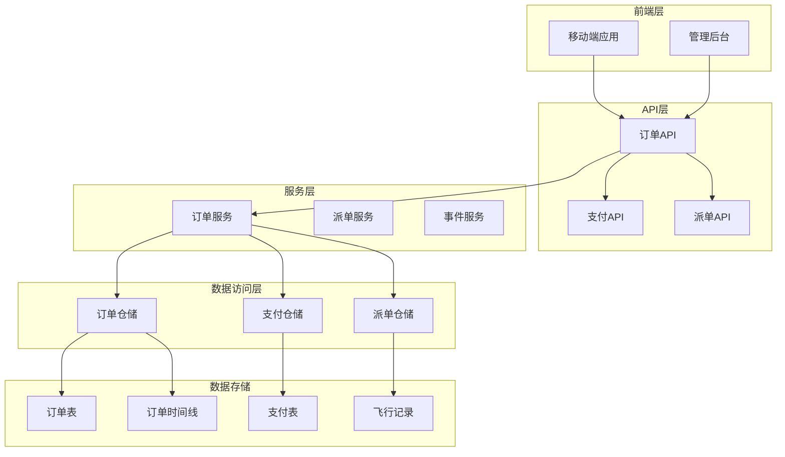
```mermaid
graph TB
subgraph "前端层"
Mobile[移动端应用]
Admin[管理后台]
end
subgraph "API层"
OrderAPI[订单API]
PaymentAPI[支付API]
DispatchAPI[派单API]
end
subgraph "服务层"
OrderService[订单服务]
DispatchService[派单服务]
EventService[事件服务]
end
subgraph "数据访问层"
OrderRepo[订单仓储]
PaymentRepo[支付仓储]
DispatchRepo[派单仓储]
end
subgraph "数据存储"
Orders[订单表]
OrderTimeline[订单时间线]
Payments[支付表]
FlightRecords[飞行记录]
end
Mobile --> OrderAPI
Admin --> OrderAPI
OrderAPI --> OrderService
OrderAPI --> PaymentAPI
OrderAPI --> DispatchAPI
OrderService --> OrderRepo
OrderService --> PaymentRepo
OrderService --> DispatchRepo
OrderRepo --> Orders
OrderRepo --> OrderTimeline
PaymentRepo --> Payments
DispatchRepo --> FlightRecords
```

**图表来源**
- [backend/internal/api/v1/order/handler.go:13-19](file://backend/internal/api/v1/order/handler.go#L13-L19)
- [backend/internal/service/order_service.go:18-31](file://backend/internal/service/order_service.go#L18-L31)

## 核心组件

### 订单处理器 (Order Handler)
订单处理器负责接收和处理来自客户端的所有订单相关请求，包括创建、查询、状态更新等操作。

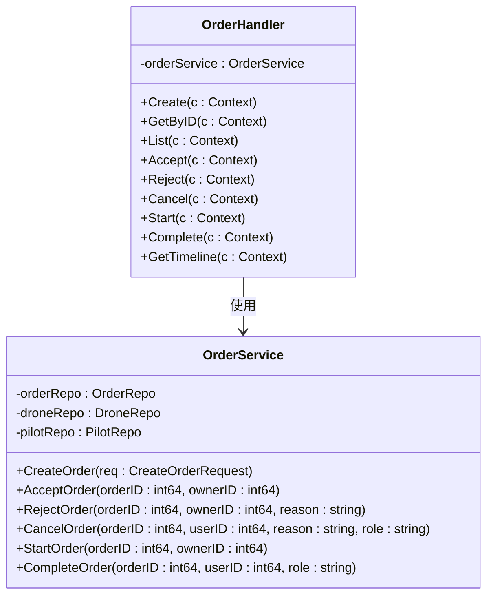
```mermaid
classDiagram
class OrderHandler {
-orderService : OrderService
+Create(c : Context)
+GetByID(c : Context)
+List(c : Context)
+Accept(c : Context)
+Reject(c : Context)
+Cancel(c : Context)
+Start(c : Context)
+Complete(c : Context)
+GetTimeline(c : Context)
}
class OrderService {
-orderRepo : OrderRepo
-droneRepo : DroneRepo
-pilotRepo : PilotRepo
+CreateOrder(req : CreateOrderRequest)
+AcceptOrder(orderID : int64, ownerID : int64)
+RejectOrder(orderID : int64, ownerID : int64, reason : string)
+CancelOrder(orderID : int64, userID : int64, reason : string, role : string)
+StartOrder(orderID : int64, ownerID : int64)
+CompleteOrder(orderID : int64, userID : int64, role : string)
}
OrderHandler --> OrderService : 使用
```

**图表来源**
- [backend/internal/api/v1/order/handler.go:13-19](file://backend/internal/api/v1/order/handler.go#L13-L19)
- [backend/internal/service/order_service.go:18-31](file://backend/internal/service/order_service.go#L18-L31)

### 数据模型架构
系统采用清晰的数据模型分层，每个核心实体都有对应的模型定义：

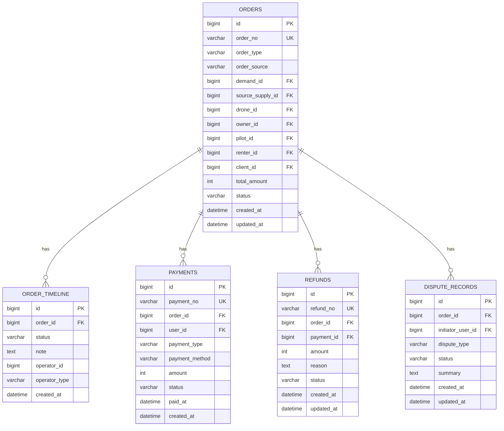
```mermaid
erDiagram
ORDERS {
bigint id PK
varchar order_no UK
varchar order_type
varchar order_source
bigint demand_id FK
bigint source_supply_id FK
bigint drone_id FK
bigint owner_id FK
bigint pilot_id FK
bigint renter_id FK
bigint client_id FK
int total_amount
varchar status
datetime created_at
datetime updated_at
}
ORDER_TIMELINE {
bigint id PK
bigint order_id FK
varchar status
text note
bigint operator_id
varchar operator_type
datetime created_at
}
PAYMENTS {
bigint id PK
varchar payment_no UK
bigint order_id FK
bigint user_id FK
varchar payment_type
varchar payment_method
int amount
varchar status
datetime paid_at
datetime created_at
}
REFUNDS {
bigint id PK
varchar refund_no UK
bigint order_id FK
bigint payment_id FK
int amount
text reason
varchar status
datetime created_at
datetime updated_at
}
DISPUTE_RECORDS {
bigint id PK
bigint order_id FK
bigint initiator_user_id FK
varchar dispute_type
varchar status
text summary
datetime created_at
datetime updated_at
}
ORDERS ||--o{ ORDER_TIMELINE : has
ORDERS ||--o{ PAYMENTS : has
ORDERS ||--o{ REFUNDS : has
ORDERS ||--o{ DISPUTE_RECORDS : has
```

**图表来源**
- [backend/internal/model/models.go:413-480](file://backend/internal/model/models.go#L413-L480)
- [backend/internal/model/models.go:486-498](file://backend/internal/model/models.go#L486-L498)
- [backend/internal/model/models.go:515-532](file://backend/internal/model/models.go#L515-L532)
- [backend/internal/model/models.go:534-551](file://backend/internal/model/models.go#L534-L551)
- [backend/internal/model/models.go:553-570](file://backend/internal/model/models.go#L553-L570)

**章节来源**
- [backend/internal/api/v1/order/handler.go:1-155](file://backend/internal/api/v1/order/handler.go#L1-L155)
- [backend/internal/service/order_service.go:1-1755](file://backend/internal/service/order_service.go#L1-L1755)
- [backend/internal/repository/order_repo.go:1-252](file://backend/internal/repository/order_repo.go#L1-L252)
- [backend/internal/model/models.go:413-570](file://backend/internal/model/models.go#L413-L570)

## 订单状态机设计

### 核心状态流转图

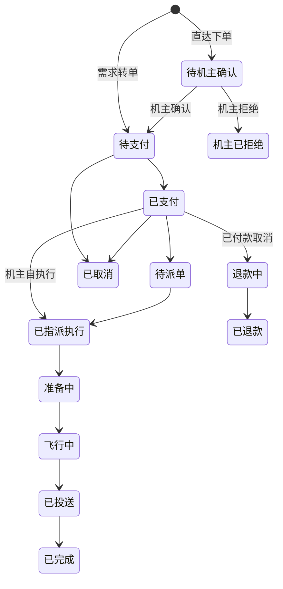
```mermaid
stateDiagram-v2
[*] --> 待机主确认 : 直达下单
[*] --> 待支付 : 需求转单
待机主确认 --> 待支付 : 机主确认
待机主确认 --> 机主已拒绝 : 机主拒绝
待支付 --> 已支付
已支付 --> 待派单
已支付 --> 已指派执行 : 机主自执行
待派单 --> 已指派执行
已指派执行 --> 准备中
准备中 --> 飞行中
飞行中 --> 已投送
已投送 --> 已完成
待支付 --> 已取消
已支付 --> 已取消
已支付 --> 退款中 : 已付款取消
退款中 --> 已退款
```

**图表来源**
- [BUSINESS_ROLE_REDESIGN.md:729-746](file://BUSINESS_ROLE_REDESIGN.md#L729-L746)

### 执行阶段状态推进规则

| 状态变更 | 触发方 | 触发方式 |
|----------|--------|----------|
| `已指派执行 → 准备中` | 执行飞手 | 飞手在派单任务中点击"开始准备" |
| `准备中 → 飞行中` | 系统 | 飞手上报起飞或系统检测到首个飞行位置点 |
| `飞行中 → 已投送` | 执行飞手 | 飞手到达目的地后点击"确认投送" |
| `已投送 → 已完成` | 客户/系统 | 客户确认签收；或投送后24小时无操作，系统自动确认 |

### 状态字段映射

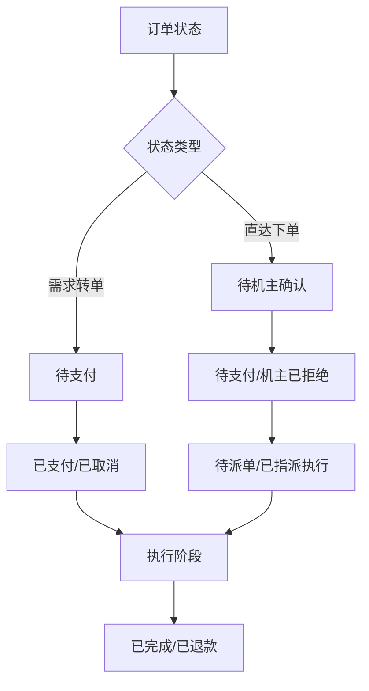
```mermaid
flowchart TD
A[订单状态] --> B{状态类型}
B --> |直达下单| C[待机主确认]
B --> |需求转单| D[待支付]
C --> E[待支付/机主已拒绝]
D --> F[已支付/已取消]
E --> G[待派单/已指派执行]
F --> H[执行阶段]
G --> H
H --> I[已完成/已退款]
```

**图表来源**
- [BUSINESS_FIELD_DICTIONARY.md:485-500](file://BUSINESS_FIELD_DICTIONARY.md#L485-L500)

**章节来源**
- [BUSINESS_ROLE_REDESIGN.md:726-785](file://BUSINESS_ROLE_REDESIGN.md#L726-L785)
- [BUSINESS_FIELD_DICTIONARY.md:485-524](file://BUSINESS_FIELD_DICTIONARY.md#L485-L524)

## 订单生成流程

### 订单创建流程

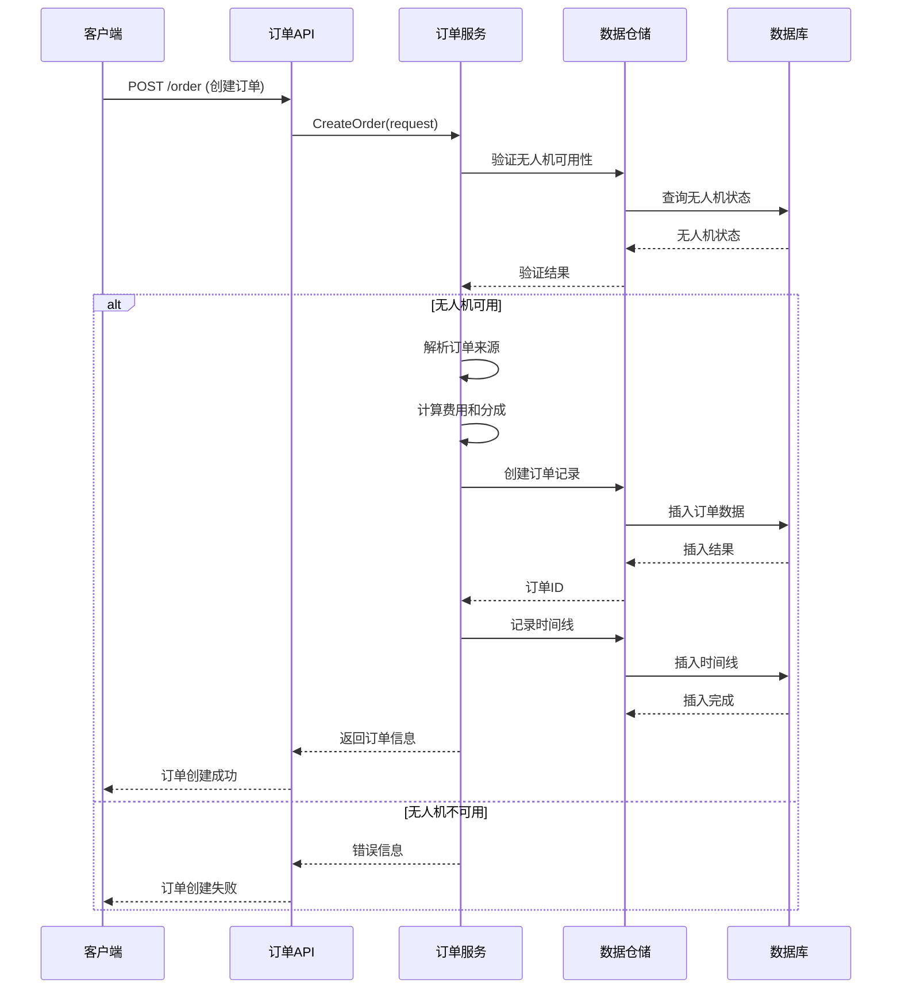
```mermaid
sequenceDiagram
participant Client as 客户端
participant API as 订单API
participant Service as 订单服务
participant Repo as 数据仓储
participant DB as 数据库
Client->>API : POST /order (创建订单)
API->>Service : CreateOrder(request)
Service->>Repo : 验证无人机可用性
Repo->>DB : 查询无人机状态
DB-->>Repo : 无人机状态
Repo-->>Service : 验证结果
alt 无人机可用
Service->>Service : 解析订单来源
Service->>Service : 计算费用和分成
Service->>Repo : 创建订单记录
Repo->>DB : 插入订单数据
DB-->>Repo : 插入结果
Repo-->>Service : 订单ID
Service->>Repo : 记录时间线
Repo->>DB : 插入时间线
DB-->>Repo : 插入完成
Service-->>API : 返回订单信息
API-->>Client : 订单创建成功
else 无人机不可用
Service-->>API : 错误信息
API-->>Client : 订单创建失败
end
```

**图表来源**
- [backend/internal/api/v1/order/handler.go:21-35](file://backend/internal/api/v1/order/handler.go#L21-L35)
- [backend/internal/service/order_service.go:65-90](file://backend/internal/service/order_service.go#L65-L90)

### 订单来源解析逻辑

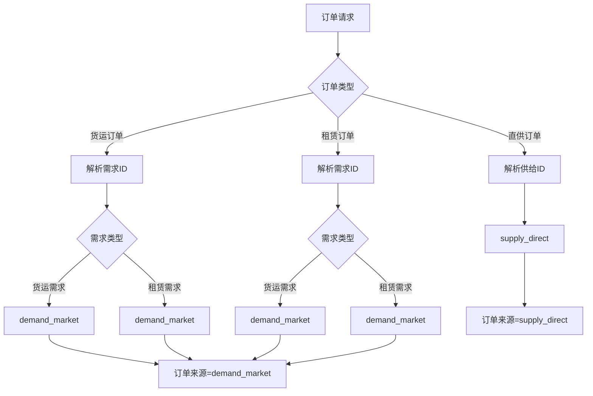
```mermaid
flowchart TD
A[订单请求] --> B{订单类型}
B --> |货运订单| C[解析需求ID]
B --> |租赁订单| D[解析需求ID]
B --> |直供订单| E[解析供给ID]
C --> F{需求类型}
F --> |货运需求| G[demand_market]
F --> |租赁需求| H[demand_market]
D --> I{需求类型}
I --> |货运需求| J[demand_market]
I --> |租赁需求| K[demand_market]
E --> L[supply_direct]
G --> M[订单来源=demand_market]
H --> M
J --> M
K --> M
L --> N[订单来源=supply_direct]
```

**图表来源**
- [backend/internal/service/order_service.go:868-898](file://backend/internal/service/order_service.go#L868-L898)

### 订单费用计算

订单费用计算采用平台佣金 + 机主分成的模式：

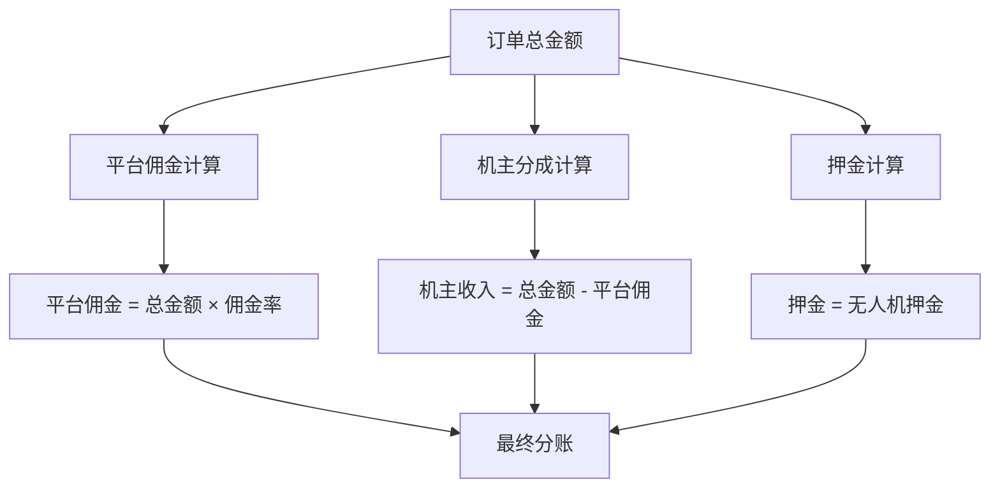
```mermaid
flowchart TD
A[订单总金额] --> B[平台佣金计算]
A --> C[机主分成计算]
A --> D[押金计算]
B --> E[平台佣金 = 总金额 × 佣金率]
C --> F[机主收入 = 总金额 - 平台佣金]
D --> G[押金 = 无人机押金]
E --> H[最终分账]
F --> H
G --> H
```

**图表来源**
- [backend/internal/service/order_service.go:142-145](file://backend/internal/service/order_service.go#L142-L145)

**章节来源**
- [backend/internal/api/v1/order/handler.go:21-35](file://backend/internal/api/v1/order/handler.go#L21-L35)
- [backend/internal/service/order_service.go:65-243](file://backend/internal/service/order_service.go#L65-L243)
- [backend/internal/service/order_service.go:868-898](file://backend/internal/service/order_service.go#L868-L898)

## 订单履约执行

### 履约执行流程

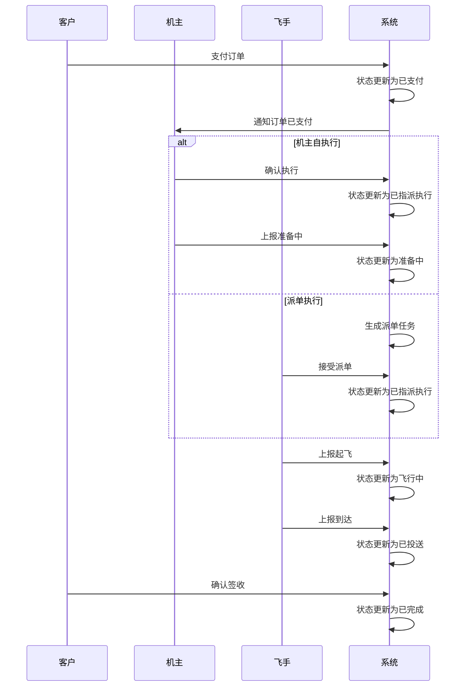
```mermaid
sequenceDiagram
participant Client as 客户
participant Provider as 机主
participant Pilot as 飞手
participant System as 系统
Client->>System : 支付订单
System->>System : 状态更新为已支付
System->>Provider : 通知订单已支付
alt 机主自执行
Provider->>System : 确认执行
System->>System : 状态更新为已指派执行
Provider->>System : 上报准备中
System->>System : 状态更新为准备中
else 派单执行
System->>System : 生成派单任务
Pilot->>System : 接受派单
System->>System : 状态更新为已指派执行
end
Pilot->>System : 上报起飞
System->>System : 状态更新为飞行中
Pilot->>System : 上报到达
System->>System : 状态更新为已投送
Client->>System : 确认签收
System->>System : 状态更新为已完成
```

**图表来源**
- [BUSINESS_ROLE_REDESIGN.md:748-761](file://BUSINESS_ROLE_REDESIGN.md#L748-L761)

### 飞行监控与数据采集

系统提供了完整的飞行监控能力，包括实时位置跟踪、告警监控和轨迹记录：

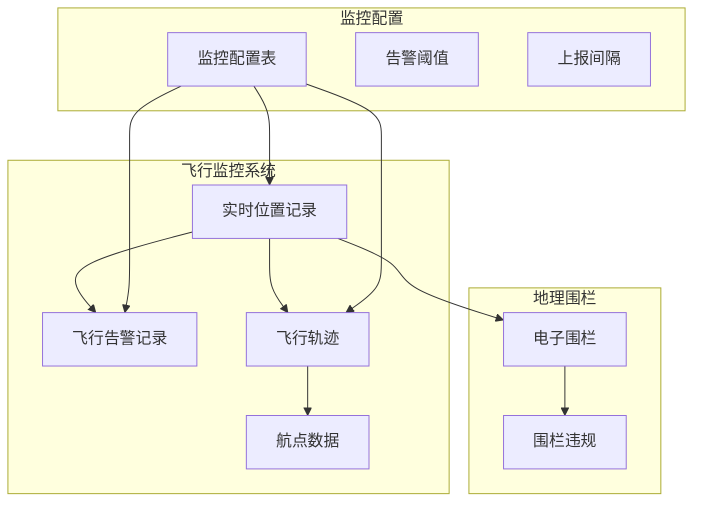
```mermaid
graph TB
subgraph "飞行监控系统"
Position[实时位置记录]
Alerts[飞行告警记录]
Trajectory[飞行轨迹]
Waypoints[航点数据]
end
subgraph "监控配置"
Config[监控配置表]
Threshold[告警阈值]
Interval[上报间隔]
end
subgraph "地理围栏"
Geofence[电子围栏]
Violations[围栏违规]
end
Position --> Alerts
Position --> Trajectory
Trajectory --> Waypoints
Config --> Position
Config --> Alerts
Config --> Trajectory
Geofence --> Violations
Position --> Geofence
```

**图表来源**
- [backend/migrations/009_add_order_execution_tables.sql:47-81](file://backend/migrations/009_add_order_execution_tables.sql#L47-L81)
- [backend/migrations/009_add_order_execution_tables.sql:84-124](file://backend/migrations/009_add_order_execution_tables.sql#L84-L124)
- [backend/migrations/009_add_order_execution_tables.sql:197-277](file://backend/migrations/009_add_order_execution_tables.sql#L197-L277)

**章节来源**
- [BUSINESS_ROLE_REDESIGN.md:771-837](file://BUSINESS_ROLE_REDESIGN.md#L771-L837)
- [backend/migrations/009_add_order_execution_tables.sql:1-468](file://backend/migrations/009_add_order_execution_tables.sql#L1-L468)

## 数据结构与关联表设计

### 核心数据表结构

#### 订单表 (orders)
订单表是整个系统的中心表，存储所有订单的核心信息：

| 字段名 | 类型 | 约束 | 描述 |
|--------|------|------|------|
| id | bigint | PK | 主键 |
| order_no | varchar(30) | UK, NOT NULL | 订单编号 |
| order_type | varchar(20) | NOT NULL | 订单类型 (cargo, rental) |
| order_source | varchar(30) | DEFAULT 'demand_market' | 订单来源 (demand_market, supply_direct) |
| status | varchar(40) | DEFAULT 'created' | 订单状态 |
| drone_id | bigint | FK, INDEX | 无人机ID |
| owner_id | bigint | FK, INDEX | 机主ID |
| pilot_id | bigint | FK, INDEX | 飞手ID |
| total_amount | int64 | NOT NULL | 订单总金额 (分) |
| platform_commission | int64 | NOT NULL | 平台佣金 (分) |
| owner_amount | int64 | NOT NULL | 机主收入 (分) |
| deposit_amount | int64 | NOT NULL | 押金 (分) |
| created_at | datetime | NOT NULL | 创建时间 |
| updated_at | datetime | NOT NULL | 更新时间 |

#### 订单时间线表 (order_timelines)
记录订单状态变更的历史：

| 字段名 | 类型 | 约束 | 描述 |
|--------|------|------|------|
| id | bigint | PK | 主键 |
| order_id | bigint | FK, NOT NULL | 订单ID |
| status | varchar(40) | | 状态值 |
| note | text | | 说明文字 |
| operator_id | bigint | | 操作者ID |
| operator_type | varchar(20) | | 操作者类型 (owner, renter, system, admin) |
| created_at | datetime | NOT NULL | 创建时间 |

#### 支付表 (payments)
存储订单相关的支付记录：

| 字段名 | 类型 | 约束 | 描述 |
|--------|------|------|------|
| id | bigint | PK | 主键 |
| payment_no | varchar(50) | UK, NOT NULL | 支付编号 |
| order_id | bigint | FK, NOT NULL | 订单ID |
| user_id | bigint | FK, NOT NULL | 用户ID |
| payment_type | varchar(20) | | 支付类型 (order, deposit, refund, withdrawal) |
| payment_method | varchar(20) | | 支付方式 (wechat, alipay, mock) |
| amount | int64 | NOT NULL | 金额 (分) |
| status | varchar(20) | DEFAULT 'pending' | 状态 (pending, paid, failed, refunded) |
| paid_at | datetime | | 支付时间 |
| created_at | datetime | NOT NULL | 创建时间 |

### 外部依赖关系

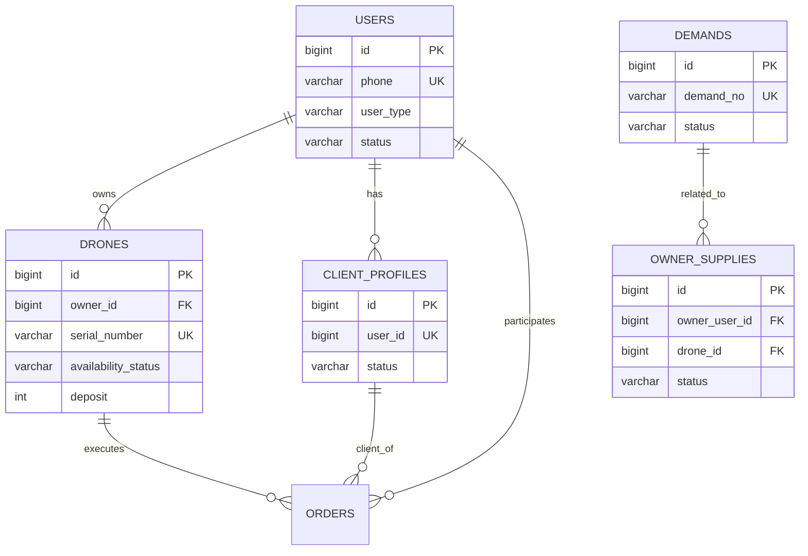
```mermaid
erDiagram
USERS {
bigint id PK
varchar phone UK
varchar user_type
varchar status
}
DRONES {
bigint id PK
bigint owner_id FK
varchar serial_number UK
varchar availability_status
int deposit
}
CLIENT_PROFILES {
bigint id PK
bigint user_id UK
varchar status
}
DEMANDS {
bigint id PK
varchar demand_no UK
varchar status
}
OWNER_SUPPLIES {
bigint id PK
bigint owner_user_id FK
bigint drone_id FK
varchar status
}
USERS ||--o{ DRONES : owns
USERS ||--o{ CLIENT_PROFILES : has
DEMANDS ||--o{ OWNER_SUPPLIES : related_to
DRONES ||--o{ ORDERS : executes
USERS ||--o{ ORDERS : participates
CLIENT_PROFILES ||--o{ ORDERS : client_of
```

**图表来源**
- [backend/internal/model/models.go:9-26](file://backend/internal/model/models.go#L9-L26)
- [backend/internal/model/models.go:91-148](file://backend/internal/model/models.go#L91-L148)
- [backend/internal/model/models.go:323-353](file://backend/internal/model/models.go#L323-L353)
- [backend/internal/model/models.go:230-259](file://backend/internal/model/models.go#L230-L259)

**章节来源**
- [backend/internal/model/models.go:413-480](file://backend/internal/model/models.go#L413-L480)
- [backend/internal/model/models.go:486-498](file://backend/internal/model/models.go#L486-L498)
- [backend/internal/model/models.go:515-532](file://backend/internal/model/models.go#L515-L532)

## 事务处理机制

### 事务边界设计

订单系统采用严格的事务边界设计，确保数据一致性：

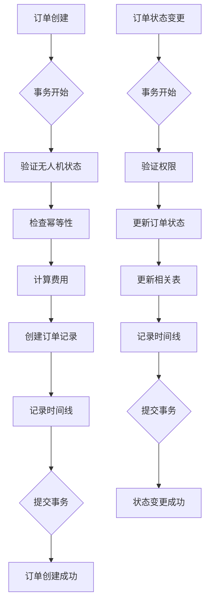
```mermaid
flowchart TD
A[订单创建] --> B{事务开始}
B --> C[验证无人机状态]
C --> D[检查幂等性]
D --> E[计算费用]
E --> F[创建订单记录]
F --> G[记录时间线]
G --> H{提交事务}
H --> I[订单创建成功]
J[订单状态变更] --> K{事务开始}
K --> L[验证权限]
L --> M[更新订单状态]
M --> N[更新相关表]
N --> O[记录时间线]
O --> P{提交事务}
P --> Q[状态变更成功]
```

**图表来源**
- [backend/internal/service/order_service.go:72-89](file://backend/internal/service/order_service.go#L72-L89)
- [backend/internal/service/order_service.go:1037-1084](file://backend/internal/service/order_service.go#L1037-L1084)

### 事务隔离级别

系统采用以下事务隔离策略：

1. **订单创建事务**：包含无人机验证、幂等性检查、费用计算、订单创建等所有操作
2. **状态变更事务**：包含权限验证、状态更新、相关表更新、时间线记录
3. **退款事务**：包含退款记录创建、支付状态更新、余额调整

### 错误处理机制

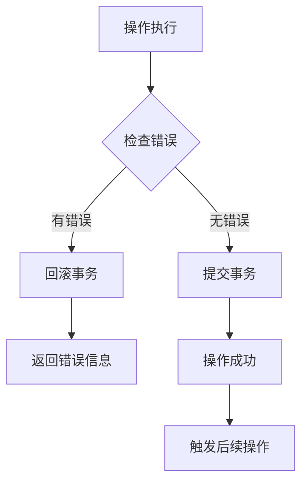
```mermaid
flowchart TD
A[操作执行] --> B{检查错误}
B --> |无错误| C[提交事务]
B --> |有错误| D[回滚事务]
D --> E[返回错误信息]
C --> F[操作成功]
F --> G[触发后续操作]
```

**图表来源**
- [backend/internal/service/order_service.go:1037-1084](file://backend/internal/service/order_service.go#L1037-L1084)

**章节来源**
- [backend/internal/service/order_service.go:72-89](file://backend/internal/service/order_service.go#L72-L89)
- [backend/internal/service/order_service.go:1037-1165](file://backend/internal/service/order_service.go#L1037-L1165)

## 异常处理与退款流程

### 退款规则设计

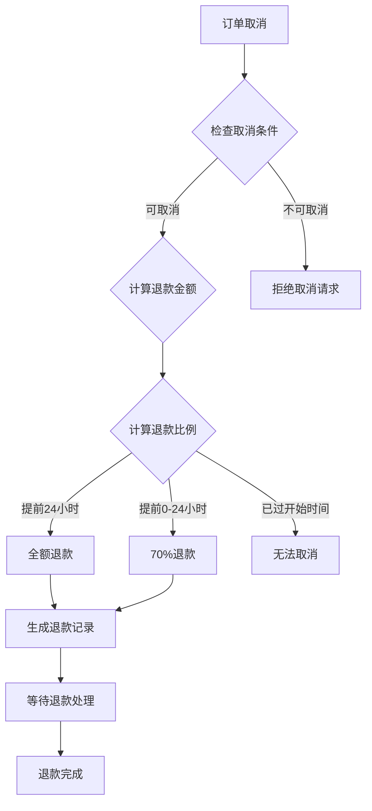
```mermaid
flowchart TD
A[订单取消] --> B{检查取消条件}
B --> |可取消| C{计算退款金额}
B --> |不可取消| D[拒绝取消请求]
C --> E{计算退款比例}
E --> |提前24小时| F[全额退款]
E --> |提前0-24小时| G[70%退款]
E --> |已过开始时间| H[无法取消]
F --> I[生成退款记录]
G --> I
I --> J[等待退款处理]
J --> K[退款完成]
```

**图表来源**
- [backend/internal/service/order_service.go:961-978](file://backend/internal/service/order_service.go#L961-L978)

### 退款计算逻辑

退款金额基于以下规则计算：

| 取消时间 | 退款比例 | 说明 |
|----------|----------|------|
| 提前24小时以上 | 100% | 全额退款，包括订单金额和押金 |
| 0-24小时前 | 70% | 退款70%订单金额 + 全额押金 |
| 已过开始时间 | 0% | 无法取消，无退款 |

### 退款处理流程

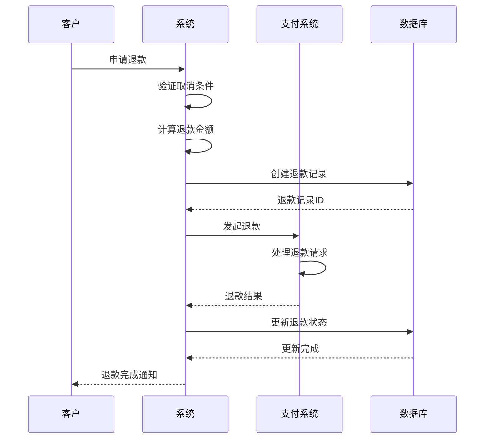
```mermaid
sequenceDiagram
participant Client as 客户
participant System as 系统
participant Payment as 支付系统
participant DB as 数据库
Client->>System : 申请退款
System->>System : 验证取消条件
System->>System : 计算退款金额
System->>DB : 创建退款记录
DB-->>System : 退款记录ID
System->>Payment : 发起退款
Payment->>Payment : 处理退款请求
Payment-->>System : 退款结果
System->>DB : 更新退款状态
DB-->>System : 更新完成
System-->>Client : 退款完成通知
```

**图表来源**
- [backend/internal/service/order_service.go:980-1026](file://backend/internal/service/order_service.go#L980-L1026)

**章节来源**
- [backend/internal/service/order_service.go:961-1026](file://backend/internal/service/order_service.go#L961-L1026)

## 争议解决机制

### 争议类型分类

系统支持多种争议类型：

| 争议类型 | 适用场景 | 处理流程 |
|----------|----------|----------|
| 货物损坏 | 货物在运输过程中损坏 | 客户发起 → 平台介入 → 责任认定 → 退款/赔偿 |
| 飞行事故 | 无人机在执行过程中发生事故 | 飞手报告 → 平台调查 → 责任划分 → 保险理赔 |
| 服务质量 | 服务未达到约定标准 | 客户投诉 → 平台调查 → 责任认定 → 补偿措施 |
| 支付纠纷 | 支付相关争议 | 用户申诉 → 平台核实 → 责任判定 → 处理决定 |

### 争议处理流程

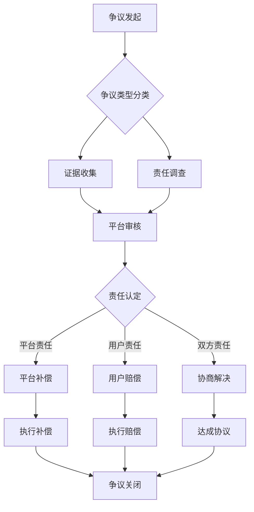
```mermaid
flowchart TD
A[争议发起] --> B{争议类型分类}
B --> C[证据收集]
B --> D[责任调查]
C --> E[平台审核]
D --> E
E --> F{责任认定}
F --> |平台责任| G[平台补偿]
F --> |用户责任| H[用户赔偿]
F --> |双方责任| I[协商解决]
G --> J[执行补偿]
H --> K[执行赔偿]
I --> L[达成协议]
J --> M[争议关闭]
K --> M
L --> M
```

**图表来源**
- [BUSINESS_ROLE_REDESIGN.md:888-901](file://BUSINESS_ROLE_REDESIGN.md#L888-L901)

### 责任归属原则

系统采用"谁承诺、谁担责"的原则：

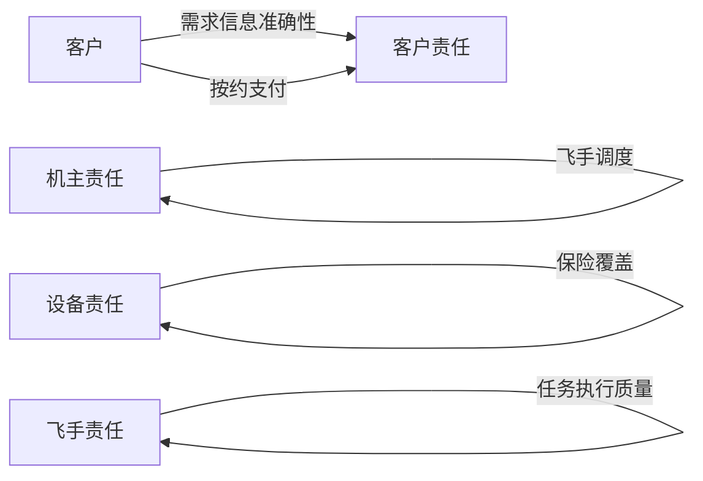
```mermaid
flowchart LR
A[客户] --> |需求信息准确性| B[客户责任]
A --> |按约支付| B
C[机主] --> |服务方案可行性| C[机主责任]
C --> |设备可用性| C
C --> |飞手调度| C
D[无人机所有人] --> |设备安全性| D[设备责任]
D --> |适航合规| D
D --> |保险覆盖| D
E[执行飞手] --> |飞行操作规范性| E[飞手责任]
E --> |任务执行质量| E
```

**图表来源**
- [BUSINESS_ROLE_REDESIGN.md:888-901](file://BUSINESS_ROLE_REDESIGN.md#L888-L901)

**章节来源**
- [backend/internal/service/order_service.go:1405-1431](file://backend/internal/service/order_service.go#L1405-L1431)
- [BUSINESS_ROLE_REDESIGN.md:874-919](file://BUSINESS_ROLE_REDESIGN.md#L874-L919)

## 性能考虑

### 查询优化策略

1. **索引优化**
   - 订单状态索引：支持按状态快速查询
   - 用户角色索引：支持多角色权限查询
   - 时间字段索引：支持时间范围查询

2. **缓存策略**
   - 订单详情缓存：热点订单数据缓存
   - 用户信息缓存：用户基本信息缓存
   - 飞行数据缓存：实时飞行数据缓存

3. **批量操作**
   - 批量状态更新：支持批量订单状态变更
   - 批量通知发送：支持批量消息推送

### 性能监控指标

- 订单创建响应时间：< 2 秒
- 订单查询响应时间：< 1 秒  
- 支付处理延迟：< 5 秒
- 飞行数据更新延迟：< 1 秒

## 故障排除指南

### 常见问题诊断

#### 订单状态异常
**症状**：订单状态显示异常或无法更新
**排查步骤**：
1. 检查订单状态变更日志
2. 验证权限验证逻辑
3. 确认事务提交状态
4. 检查并发控制机制

#### 支付处理失败
**症状**：支付状态与预期不符
**排查步骤**：
1. 检查支付回调处理
2. 验证第三方支付接口
3. 确认退款流程执行
4. 检查支付状态同步

#### 飞行数据缺失
**症状**：飞行监控数据不完整
**排查步骤**：
1. 检查飞行数据上报频率
2. 验证地理位置服务
3. 确认网络连接状态
4. 检查数据存储配置

### 运维监控

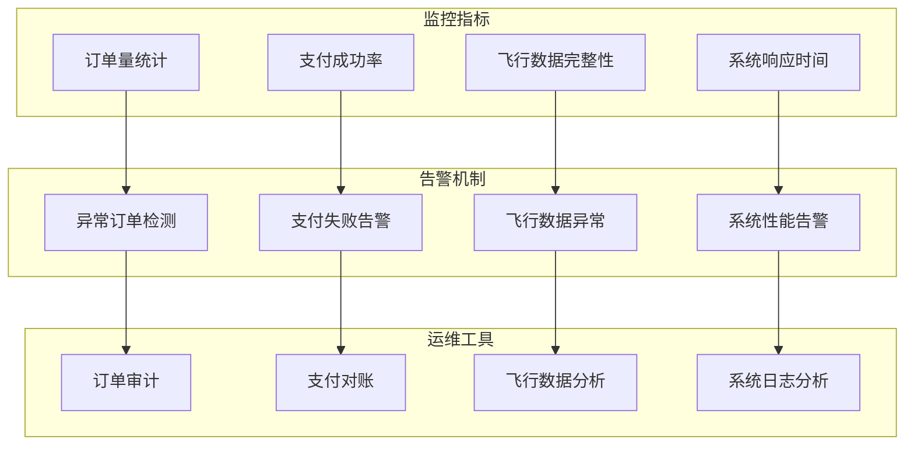
```mermaid
graph TB
subgraph "监控指标"
A[订单量统计]
B[支付成功率]
C[飞行数据完整性]
D[系统响应时间]
end
subgraph "告警机制"
E[异常订单检测]
F[支付失败告警]
G[飞行数据异常]
H[系统性能告警]
end
subgraph "运维工具"
I[订单审计]
J[支付对账]
K[飞行数据分析]
L[系统日志分析]
end
A --> E
B --> F
C --> G
D --> H
E --> I
F --> J
G --> K
H --> L
```

**图表来源**
- [admin/src/pages/Operations/MigrationAuditBoard.tsx:47-96](file://admin/src/pages/Operations/MigrationAuditBoard.tsx#L47-L96)

**章节来源**
- [admin/src/pages/Operations/MigrationAuditBoard.tsx:47-96](file://admin/src/pages/Operations/MigrationAuditBoard.tsx#L47-L96)

## 结论

订单执行模块通过精心设计的状态机、完善的事务处理机制和全面的异常处理体系，为无人机租赁平台提供了可靠的订单管理能力。模块具有以下特点：

1. **完整的生命周期管理**：从需求确认到任务完成的全流程覆盖
2. **灵活的执行模式**：支持机主自执行和派单执行两种模式
3. **强大的监控能力**：提供实时飞行监控和数据追踪
4. **完善的风控体系**：包含退款、争议等多种风险控制机制
5. **良好的扩展性**：模块化设计便于功能扩展和维护

该模块为平台的稳定运行和用户体验提供了坚实的技术基础。