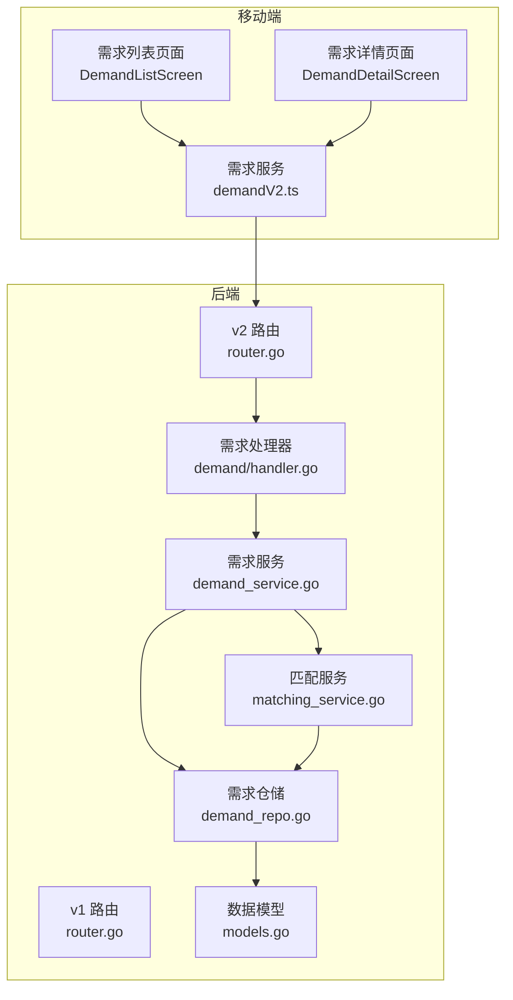
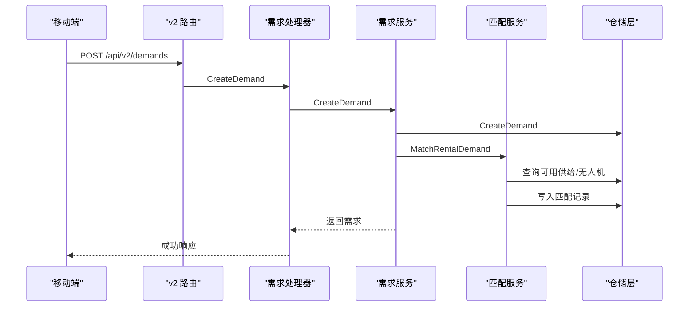
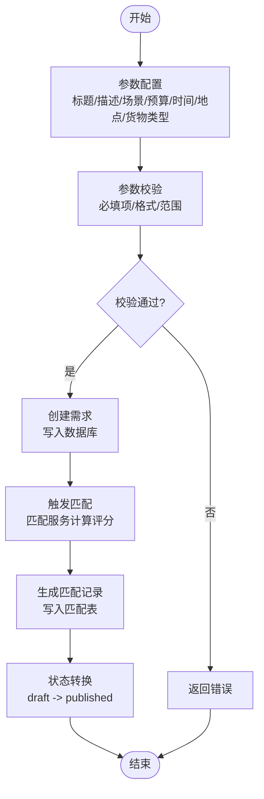
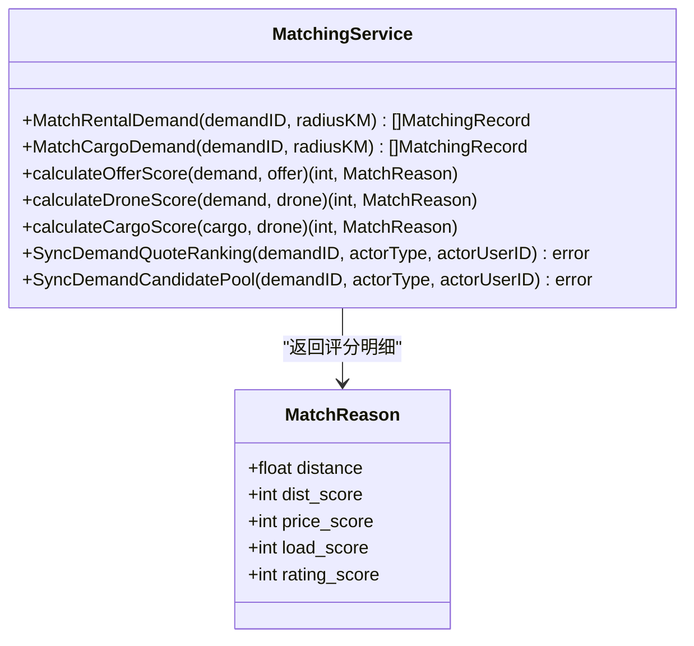
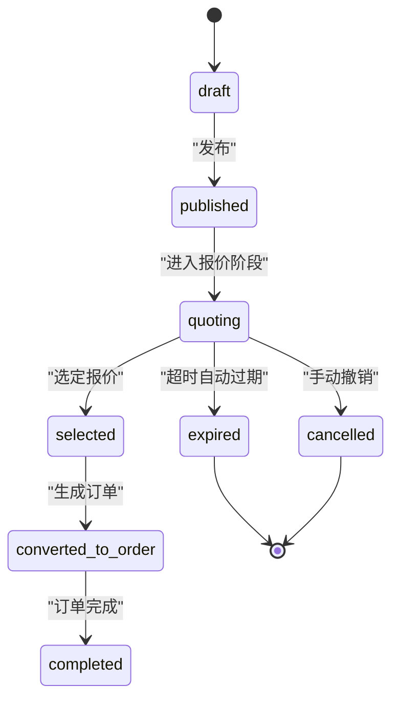
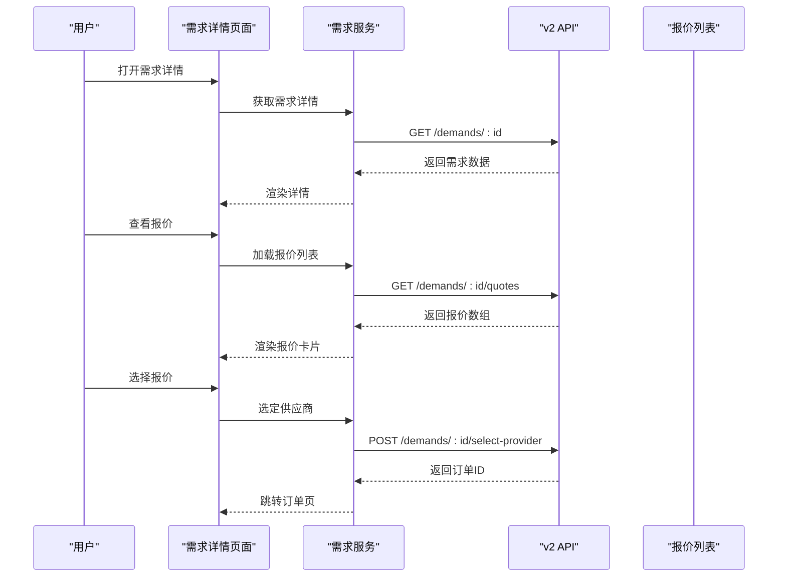
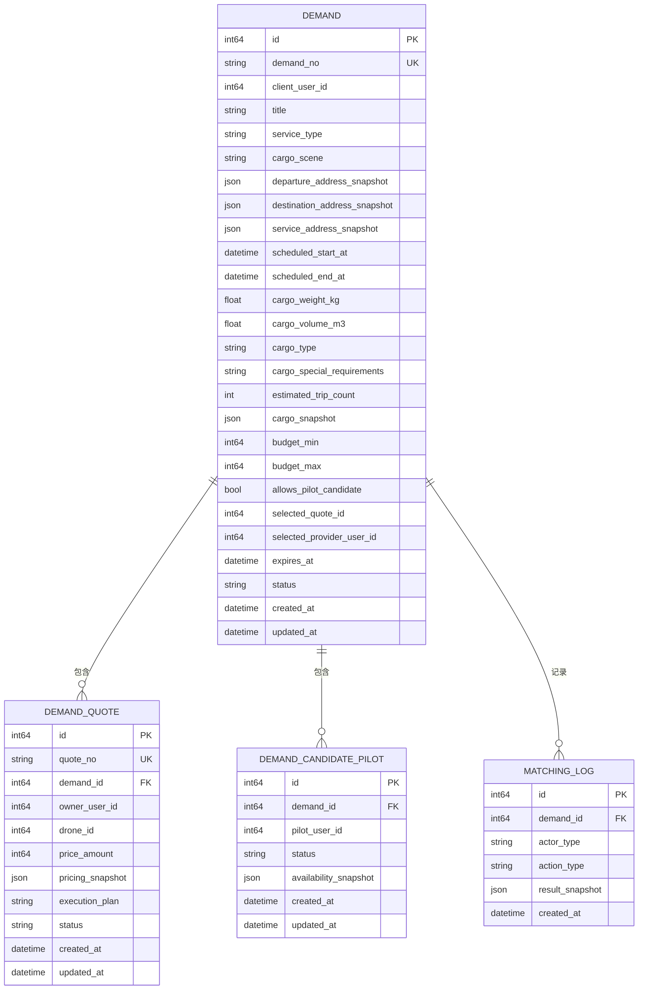
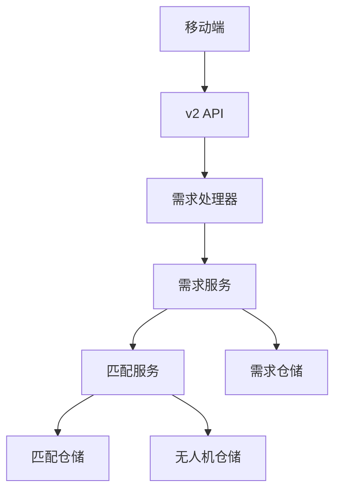

# 需求管理模块

<cite>
**本文档引用的文件**
- [backend/internal/api/v1/demand/handler.go](file://backend/internal/api/v1/demand/handler.go)
- [backend/internal/service/demand_service.go](file://backend/internal/service/demand_service.go)
- [backend/internal/repository/demand_repo.go](file://backend/internal/repository/demand_repo.go)
- [backend/internal/service/matching_service.go](file://backend/internal/service/matching_service.go)
- [backend/internal/model/models.go](file://backend/internal/model/models.go)
- [mobile/src/screens/demand/DemandListScreen.tsx](file://mobile/src/screens/demand/DemandListScreen.tsx)
- [mobile/src/screens/demand/DemandDetailScreen.tsx](file://mobile/src/screens/demand/DemandDetailScreen.tsx)
- [mobile/src/services/demandV2.ts](file://mobile/src/services/demandV2.ts)
- [mobile/src/utils/demandMeta.ts](file://mobile/src/utils/demandMeta.ts)
- [backend/internal/api/v2/router.go](file://backend/internal/api/v2/router.go)
- [backend/internal/api/v1/router.go](file://backend/internal/api/v1/router.go)
- [backend/migrations/103_create_demand_v2_tables.sql](file://backend/migrations/103_create_demand_v2_tables.sql)
- [backend/migrations/911_phase9_backfill_v2_data.sql](file://backend/migrations/911_phase9_backfill_v2_data.sql)
</cite>

## 目录
1. [项目概述](#项目概述)
2. [项目结构](#项目结构)
3. [核心组件](#核心组件)
4. [架构总览](#架构总览)
5. [详细组件分析](#详细组件分析)
6. [依赖关系分析](#依赖关系分析)
7. [性能考虑](#性能考虑)
8. [故障排除指南](#故障排除指南)
9. [结论](#结论)

## 项目概述
本需求管理模块负责无人机租赁与货运需求的全生命周期管理，涵盖需求创建、参数配置、时间地点设置、货物类型定义、报价匹配、状态管理与转换、详情展示与报价列表管理等功能。系统采用前后端分离架构，移动端通过 v2 API 与后端交互，后端提供 v1/v2 双版本接口以支持新旧业务迁移。

## 项目结构
需求管理模块由三层组成：
- 移动端界面层：负责用户交互与数据展示
- API 层：提供 v1/v2 REST 接口，处理请求与响应
- 服务与仓储层：封装业务逻辑与数据持久化

**图表来源**
- [backend/internal/api/v2/router.go:107-120](file://backend/internal/api/v2/router.go#L107-L120)
- [backend/internal/api/v1/router.go:136-160](file://backend/internal/api/v1/router.go#L136-L160)
- [backend/internal/api/v1/demand/handler.go:137-155](file://backend/internal/api/v1/demand/handler.go#L137-L155)
- [backend/internal/service/demand_service.go:118-140](file://backend/internal/service/demand_service.go#L118-L140)
- [backend/internal/service/matching_service.go:54-127](file://backend/internal/service/matching_service.go#L54-L127)
- [backend/internal/repository/demand_repo.go:132-148](file://backend/internal/repository/demand_repo.go#L132-L148)
- [backend/internal/model/models.go:323-379](file://backend/internal/model/models.go#L323-L379)

**章节来源**
- [backend/internal/api/v2/router.go:107-120](file://backend/internal/api/v2/router.go#L107-L120)
- [backend/internal/api/v1/router.go:136-160](file://backend/internal/api/v1/router.go#L136-L160)

## 核心组件
- 需求处理器：负责接收前端请求，调用服务层完成业务处理，并返回标准化响应。
- 需求服务：封装需求创建、更新、删除、查询等核心业务逻辑，包含参数校验与状态同步。
- 匹配服务：实现供需匹配算法，计算评分并生成匹配记录，支持报价排序与风险评估。
- 仓储层：提供数据库访问能力，支持分页查询、过滤与关联数据加载。
- 数据模型：定义需求、报价、候选飞手、匹配记录等核心实体及其字段约束。

**章节来源**
- [backend/internal/api/v1/demand/handler.go:14-21](file://backend/internal/api/v1/demand/handler.go#L14-L21)
- [backend/internal/service/demand_service.go:13-23](file://backend/internal/service/demand_service.go#L13-L23)
- [backend/internal/service/matching_service.go:15-43](file://backend/internal/service/matching_service.go#L15-L43)
- [backend/internal/repository/demand_repo.go:9-19](file://backend/internal/repository/demand_repo.go#L9-L19)
- [backend/internal/model/models.go:323-379](file://backend/internal/model/models.go#L323-L379)

## 架构总览
需求管理模块采用分层架构，移动端通过 v2 API 与后端交互，后端在 v1/v2 路由中暴露接口。v2 版本提供更清晰的领域模型与状态管理，v1 版本保留兼容性。

**图表来源**
- [backend/internal/api/v2/router.go:107-114](file://backend/internal/api/v2/router.go#L107-L114)
- [backend/internal/api/v1/demand/handler.go:137-155](file://backend/internal/api/v1/demand/handler.go#L137-L155)
- [backend/internal/service/demand_service.go:118-140](file://backend/internal/service/demand_service.go#L118-L140)
- [backend/internal/service/matching_service.go:54-127](file://backend/internal/service/matching_service.go#L54-L127)
- [backend/internal/repository/demand_repo.go:132-134](file://backend/internal/repository/demand_repo.go#L132-L134)

## 详细组件分析

### 需求发布流程
需求发布流程包括参数配置、时间地点设置、货物类型定义与状态转换。移动端通过 demandV2 服务提交需求，后端进行参数校验与默认值设置，随后触发匹配服务生成匹配记录。

**图表来源**
- [mobile/src/services/demandV2.ts:21-40](file://mobile/src/services/demandV2.ts#L21-L40)
- [backend/internal/api/v1/demand/handler.go:137-155](file://backend/internal/api/v1/demand/handler.go#L137-L155)
- [backend/internal/service/demand_service.go:118-140](file://backend/internal/service/demand_service.go#L118-L140)
- [backend/internal/service/matching_service.go:54-127](file://backend/internal/service/matching_service.go#L54-L127)

**章节来源**
- [mobile/src/services/demandV2.ts:66-73](file://mobile/src/services/demandV2.ts#L66-L73)
- [backend/internal/api/v1/demand/handler.go:137-155](file://backend/internal/api/v1/demand/handler.go#L137-L155)
- [backend/internal/service/demand_service.go:118-140](file://backend/internal/service/demand_service.go#L118-L140)

### 报价匹配算法实现
匹配服务根据距离、价格、负载、评分等因素计算供需匹配得分，并按得分排序返回推荐结果。算法支持多种需求类型（租赁需求、货运需求），并提供评分明细与风险评估。

**图表来源**
- [backend/internal/service/matching_service.go:54-178](file://backend/internal/service/matching_service.go#L54-L178)
- [backend/internal/service/matching_service.go:370-463](file://backend/internal/service/matching_service.go#L370-L463)

**章节来源**
- [backend/internal/service/matching_service.go:378-463](file://backend/internal/service/matching_service.go#L378-L463)

### 需求状态管理与转换
需求状态从 draft 到 published，再到 quoting、selected、converted_to_order、expired、cancelled 等。状态转换由服务层与迁移脚本共同维护，确保历史数据与新状态模型一致。

**图表来源**
- [backend/migrations/103_create_demand_v2_tables.sql:157-164](file://backend/migrations/103_create_demand_v2_tables.sql#L157-L164)
- [backend/migrations/911_phase9_backfill_v2_data.sql:324-330](file://backend/migrations/911_phase9_backfill_v2_data.sql#L324-L330)

**章节来源**
- [backend/migrations/103_create_demand_v2_tables.sql:157-164](file://backend/migrations/103_create_demand_v2_tables.sql#L157-L164)
- [backend/migrations/911_phase9_backfill_v2_data.sql:324-330](file://backend/migrations/911_phase9_backfill_v2_data.sql#L324-L330)

### 需求详情展示与报价列表管理
移动端通过 DemandDetailScreen 展示需求详情，支持查看报价方案、选择供应商、撤销需求等操作。报价列表按状态优先级与价格排序，支持一键选择生成订单。

**图表来源**
- [mobile/src/screens/demand/DemandDetailScreen.tsx:61-136](file://mobile/src/screens/demand/DemandDetailScreen.tsx#L61-L136)
- [mobile/src/services/demandV2.ts:52-64](file://mobile/src/services/demandV2.ts#L52-L64)
- [mobile/src/utils/demandMeta.ts:1-63](file://mobile/src/utils/demandMeta.ts#L1-L63)

**章节来源**
- [mobile/src/screens/demand/DemandDetailScreen.tsx:61-136](file://mobile/src/screens/demand/DemandDetailScreen.tsx#L61-L136)
- [mobile/src/services/demandV2.ts:52-64](file://mobile/src/services/demandV2.ts#L52-L64)

### 数据模型与字段定义
需求管理涉及多个核心实体，包括需求、报价、候选飞手、匹配记录等。这些实体定义了字段约束、索引与关联关系，支撑完整的业务流程。

**图表来源**
- [backend/internal/model/models.go:323-379](file://backend/internal/model/models.go#L323-L379)
- [backend/internal/model/models.go:398-411](file://backend/internal/model/models.go#L398-L411)

**章节来源**
- [backend/internal/model/models.go:323-379](file://backend/internal/model/models.go#L323-L379)
- [backend/internal/model/models.go:398-411](file://backend/internal/model/models.go#L398-L411)

## 依赖关系分析
需求管理模块的依赖关系清晰，各层职责明确：
- 控制器层依赖服务层，负责请求参数解析与响应封装
- 服务层依赖仓储层，负责业务逻辑与数据持久化
- 匹配服务依赖需求与无人机仓储，负责评分计算与匹配记录生成
- 移动端通过 v2 API 与后端交互，支持需求创建、报价管理、状态变更等操作

**图表来源**
- [backend/internal/api/v1/demand/handler.go:14-21](file://backend/internal/api/v1/demand/handler.go#L14-L21)
- [backend/internal/service/demand_service.go:13-23](file://backend/internal/service/demand_service.go#L13-L23)
- [backend/internal/service/matching_service.go:15-43](file://backend/internal/service/matching_service.go#L15-L43)

**章节来源**
- [backend/internal/api/v1/demand/handler.go:14-21](file://backend/internal/api/v1/demand/handler.go#L14-L21)
- [backend/internal/service/demand_service.go:13-23](file://backend/internal/service/demand_service.go#L13-L23)
- [backend/internal/service/matching_service.go:15-43](file://backend/internal/service/matching_service.go#L15-L43)

## 性能考虑
- 分页查询：列表接口支持分页参数，避免一次性加载大量数据
- 关联数据预加载：仓储层对关联用户信息进行批量查询，减少 N+1 查询
- 匹配评分优化：评分计算采用向量化与阈值过滤，减少无效计算
- 缓存与日志：匹配日志与风险评估结果可用于后续优化与审计

## 故障排除指南
- 参数错误：前端提交参数不符合规范时，后端返回参数错误提示
- 权限不足：非需求/报价所有者尝试修改或删除时，返回权限错误
- 数据不存在：查询需求/报价时若不存在，返回不存在错误
- 匹配失败：匹配服务在查询可用供给/无人机时发生异常，需检查数据库连接与索引

**章节来源**
- [backend/internal/api/v1/demand/handler.go:25-48](file://backend/internal/api/v1/demand/handler.go#L25-L48)
- [backend/internal/api/v1/demand/handler.go:167-196](file://backend/internal/api/v1/demand/handler.go#L167-L196)
- [backend/internal/api/v1/demand/handler.go:291-321](file://backend/internal/api/v1/demand/handler.go#L291-L321)

## 结论
需求管理模块通过清晰的分层架构与完善的业务流程，实现了从需求创建到撮合完成的全链路管理。匹配算法结合距离、价格、负载与评分等多维因素，提升了撮合效率与质量。移动端界面友好，支持报价排序与风险评估，为用户提供了便捷的操作体验。建议持续优化匹配算法与前端交互，提升撮合成功率与用户体验。