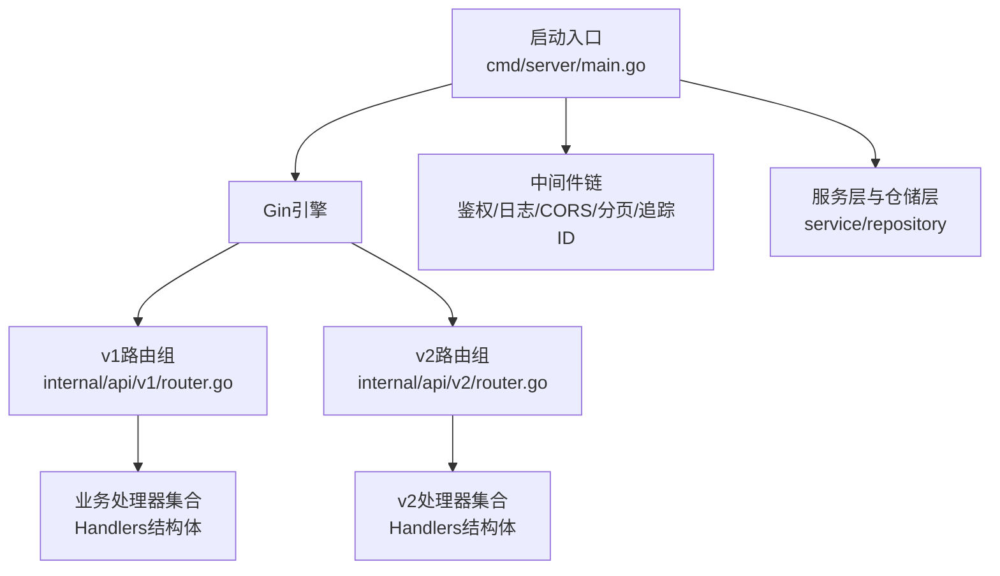
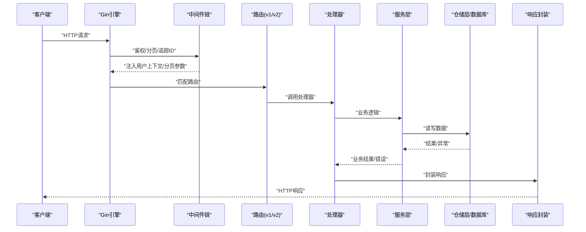
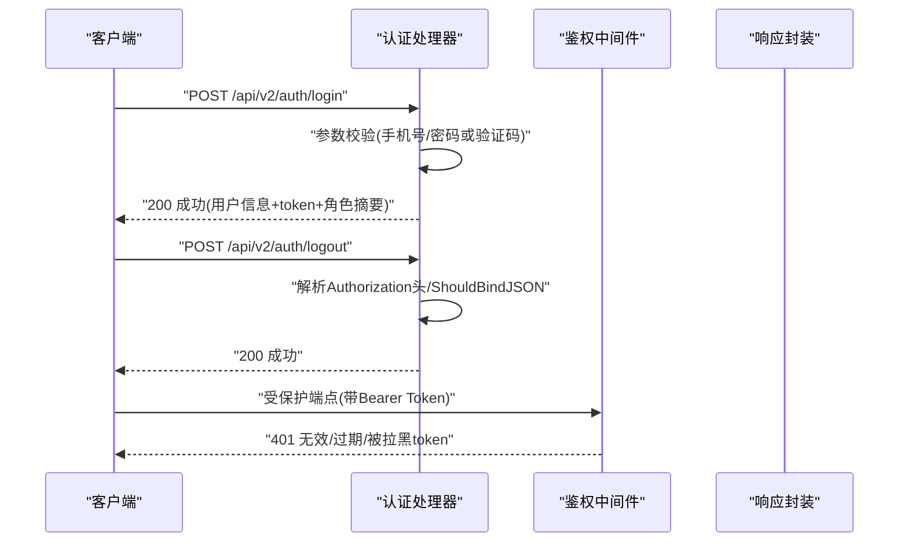
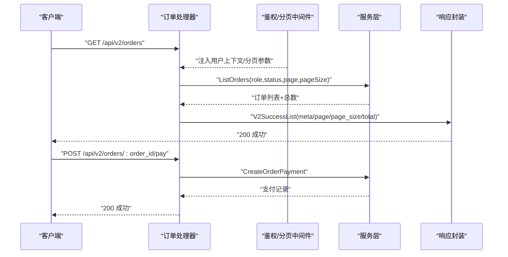
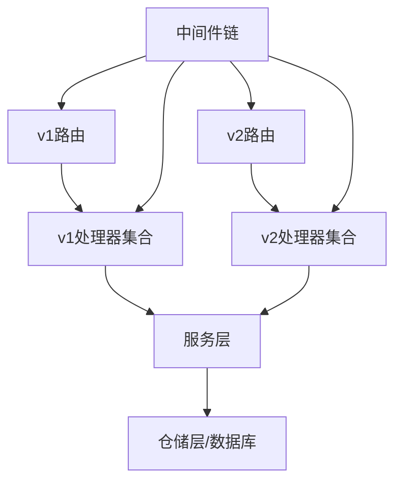

# API测试方法

<cite>
**本文引用的文件**
- [backend/docs/openapi-v2.yaml](file://backend/docs/openapi-v2.yaml)
- [backend/cmd/server/main.go](file://backend/cmd/server/main.go)
- [backend/internal/api/v1/router.go](file://backend/internal/api/v1/router.go)
- [backend/internal/api/v2/router.go](file://backend/internal/api/v2/router.go)
- [backend/internal/api/v2/auth/handler.go](file://backend/internal/api/v2/auth/handler.go)
- [backend/internal/api/v2/order/handler.go](file://backend/internal/api/v2/order/handler.go)
- [backend/internal/api/middleware/auth.go](file://backend/internal/api/middleware/auth.go)
- [backend/internal/api/middleware/legacy_write_freeze_test.go](file://backend/internal/api/middleware/legacy_write_freeze_test.go)
- [backend/internal/api/middleware/pagination_test.go](file://backend/internal/api/middleware/pagination_test.go)
- [backend/internal/pkg/response/response.go](file://backend/internal/pkg/response/response.go)
- [backend/internal/pkg/response/v2_test.go](file://backend/internal/pkg/response/v2_test.go)
- [backend/internal/service/order_service_test.go](file://backend/internal/service/order_service_test.go)
- [backend/internal/service/home_service_test.go](file://backend/internal/service/home_service_test.go)
- [backend/internal/model/models.go](file://backend/internal/model/models.go)
</cite>

## 目录
1. [引言](#引言)
2. [项目结构](#项目结构)
3. [核心组件](#核心组件)
4. [架构总览](#架构总览)
5. [详细组件分析](#详细组件分析)
6. [依赖分析](#依赖分析)
7. [性能考虑](#性能考虑)
8. [故障排查指南](#故障排查指南)
9. [结论](#结论)
10. [附录](#附录)

## 引言
本文件面向后端与全栈工程师，系统化阐述本无人机租赁平台的API测试方法论与实践路径。内容覆盖RESTful API测试策略、HTTP请求与响应验证、错误处理测试、OpenAPI规范使用与API文档测试、端点与参数校验、状态码测试、典型业务场景（用户认证、无人机管理、订单处理、支付结算）的测试示例、测试工具与环境、测试数据准备、批量测试执行与性能测试方法，并提供可直接落地的测试清单与流程图。

## 项目结构
后端采用Gin框架，按版本划分API路由：
- v1路由：传统业务接口，包含用户、无人机、需求/供给、订单、支付、派单、飞行监控、空域合规、结算、信用风控、保险、数据分析等模块。
- v2路由：统一的REST API v2，覆盖认证、个人中心、客户端视角、供给/需求、机主/飞手视角、订单、派单、通知、评价、分析与管理后台等。

启动入口负责初始化配置、数据库、Redis、WebSocket、中间件与业务处理器，并注册v1与v2路由组。

图表来源
- [backend/cmd/server/main.go:52-266](file://backend/cmd/server/main.go#L52-L266)
- [backend/internal/api/v1/router.go:58-634](file://backend/internal/api/v1/router.go#L58-L634)
- [backend/internal/api/v2/router.go:72-283](file://backend/internal/api/v2/router.go#L72-L283)

章节来源
- [backend/cmd/server/main.go:52-266](file://backend/cmd/server/main.go#L52-L266)
- [backend/internal/api/v1/router.go:58-634](file://backend/internal/api/v1/router.go#L58-L634)
- [backend/internal/api/v2/router.go:72-283](file://backend/internal/api/v2/router.go#L72-L283)

## 核心组件
- 路由与控制器
  - v1路由：集中注册各业务模块路由，如用户、无人机、订单、支付、派单、飞行监控、空域、结算、信用风控、保险、数据分析等。
  - v2路由：统一的REST API v2，按角色与功能域组织端点，如认证、个人中心、客户端/机主/飞手视图、订单、派单、通知、评价、分析与管理后台。
- 中间件
  - 鉴权中间件：解析Authorization头，校验JWT，支持黑名单检查，注入用户上下文。
  - 分页中间件：默认与上限控制，统一返回分页元数据。
  - CORS/日志/追踪ID等。
- 响应封装
  - v1响应：统一Response结构，含code/message/data/timestamp。
  - v2响应：统一V2Envelope结构，支持trace_id、meta分页信息、标准code体系。
- 业务模型
  - 用户、客户端、机主、飞手、无人机、需求/供给、订单、支付、退款、争议、消息、评价、派单任务、飞行记录、空域合规、结算、信用风控、保险等。

章节来源
- [backend/internal/api/v1/router.go:58-634](file://backend/internal/api/v1/router.go#L58-L634)
- [backend/internal/api/v2/router.go:72-283](file://backend/internal/api/v2/router.go#L72-L283)
- [backend/internal/api/middleware/auth.go:22-106](file://backend/internal/api/middleware/auth.go#L22-L106)
- [backend/internal/pkg/response/response.go:10-104](file://backend/internal/pkg/response/response.go#L10-L104)

## 架构总览
下图展示API测试的关键交互路径：客户端发起HTTP请求，经中间件链（鉴权、分页、追踪ID），到达v1或v2路由，进入对应处理器，调用服务层与仓储层，最终返回统一响应格式。

图表来源
- [backend/cmd/server/main.go:249-266](file://backend/cmd/server/main.go#L249-L266)
- [backend/internal/api/v1/router.go:58-634](file://backend/internal/api/v1/router.go#L58-L634)
- [backend/internal/api/v2/router.go:72-283](file://backend/internal/api/v2/router.go#L72-L283)
- [backend/internal/api/middleware/auth.go:22-106](file://backend/internal/api/middleware/auth.go#L22-L106)
- [backend/internal/pkg/response/response.go:24-85](file://backend/internal/pkg/response/response.go#L24-L85)

## 详细组件分析

### OpenAPI规范与API文档测试
- 规范来源
  - OpenAPI v2规范文件定义了端点、参数、请求体、响应体与状态码约定，覆盖v2路由。
- 测试要点
  - 端点验证：确保路由与OpenAPI定义一致，包括路径、HTTP方法、安全要求。
  - 参数校验：路径参数、查询参数、请求体字段均需符合schema定义。
  - 响应验证：成功/失败响应结构、分页元数据、错误码与消息格式。
  - 状态码测试：覆盖2xx/4xx/5xx典型场景，结合业务规则验证。
- 工具建议
  - 使用Swagger/OpenAPI工具链进行契约驱动测试，或基于YAML生成测试用例。

章节来源
- [backend/docs/openapi-v2.yaml:1-1058](file://backend/docs/openapi-v2.yaml#L1-L1058)

### 认证与授权测试（用户认证）
- 端点与流程
  - v2认证端点：注册、登录、刷新令牌、登出。
  - 登录支持密码或验证码两种方式；登出需要传入refresh_token。
  - 鉴权中间件要求Authorization头为Bearer Token，支持黑名单检查。
- 测试策略
  - 正向流程：正确手机号+密码/验证码注册与登录，返回用户信息、token与角色摘要。
  - 错误流程：缺失/非法Authorization头、无效/过期token、被拉黑token、参数缺失/非法、重复注册等。
  - 权限流程：非管理员访问管理员端点，应返回403/401。
- 示例场景
  - 注册：提交手机号、密码、昵称，校验响应结构与状态码。
  - 登录：提交手机号+密码或验证码，校验返回的用户信息、token与角色摘要。
  - 登出：携带access token与refresh token，校验成功响应。
  - 鉴权失败：未带Authorization或token无效，校验401响应。

图表来源
- [backend/internal/api/v2/auth/handler.go:46-149](file://backend/internal/api/v2/auth/handler.go#L46-L149)
- [backend/internal/api/middleware/auth.go:22-106](file://backend/internal/api/middleware/auth.go#L22-L106)
- [backend/internal/pkg/response/response.go:55-85](file://backend/internal/pkg/response/response.go#L55-L85)

章节来源
- [backend/internal/api/v2/auth/handler.go:46-149](file://backend/internal/api/v2/auth/handler.go#L46-L149)
- [backend/internal/api/middleware/auth.go:22-106](file://backend/internal/api/middleware/auth.go#L22-L106)

### 无人机管理测试（机主视角）
- 端点与流程
  - 列表/创建/详情/证书材料提交/状态更新等。
- 测试策略
  - 正向流程：机主身份登录后，创建无人机、提交证书材料、更新状态。
  - 错误流程：未登录访问、越权操作、参数缺失/非法、资源不存在等。
- 示例场景
  - 机主创建无人机：提交必要字段，校验响应与数据库状态。
  - 提交证书材料：上传文件/材料快照，校验状态变更。
  - 查询无人机列表：分页参数生效，返回列表与总数。

章节来源
- [backend/internal/api/v2/router.go:122-142](file://backend/internal/api/v2/router.go#L122-L142)

### 订单处理测试（客户端/机主/飞手）
- 端点与流程
  - 列表/详情/确认/拒绝/支付/派单/监控/争议/评价/退款等。
- 测试策略
  - 正向流程：客户端发布需求/选择报价/下单；机主确认/拒绝；支付/退款；飞手接单/执行；监控与争议处理。
  - 错误流程：权限不足、状态流转非法、参数缺失/非法、资源不存在等。
- 示例场景
  - 客户端下单：提交订单创建请求，校验返回的订单状态与金额。
  - 机主确认/拒绝：提交确认/拒绝请求，校验状态变更与原因字段。
  - 支付/退款：创建支付/发起退款，校验支付/退款列表与状态。
  - 监控：获取订单监控数据，校验飞行记录、位置、告警等。
  - 争议：创建争议，校验争议状态与时间线。

图表来源
- [backend/internal/api/v2/order/handler.go:32-54](file://backend/internal/api/v2/order/handler.go#L32-L54)
- [backend/internal/api/v2/order/handler.go:160-178](file://backend/internal/api/v2/order/handler.go#L160-L178)
- [backend/internal/api/middleware/auth.go:22-106](file://backend/internal/api/middleware/auth.go#L22-L106)
- [backend/internal/pkg/response/response.go:24-85](file://backend/internal/pkg/response/response.go#L24-L85)

章节来源
- [backend/internal/api/v2/order/handler.go:32-54](file://backend/internal/api/v2/order/handler.go#L32-L54)
- [backend/internal/api/v2/order/handler.go:160-178](file://backend/internal/api/v2/order/handler.go#L160-L178)

### 支付结算测试
- 端点与流程
  - 订单支付、支付列表、退款、退款列表、结算查询等。
- 测试策略
  - 正向流程：创建支付、查询支付与退款列表、发起退款。
  - 错误流程：支付金额/类型不合法、重复支付、退款状态异常等。
- 示例场景
  - 创建订单支付：提交支付请求，校验支付单号、金额、状态。
  - 查询支付列表：分页参数生效，返回支付明细。
  - 发起退款：提交退款请求，校验退款状态与关联支付。

章节来源
- [backend/internal/api/v2/order/handler.go:174-178](file://backend/internal/api/v2/order/handler.go#L174-L178)

### 错误处理与状态码测试
- v1与v2响应差异
  - v1：统一Response结构，包含code/message/timestamp/data。
  - v2：统一V2Envelope结构，包含code/message/trace_id/meta等。
- 中间件错误处理
  - 鉴权失败：401 Unauthorized；权限不足：403 Forbidden。
  - 参数校验失败：400 Bad Request；内部错误：500 Internal Server Error。
- 测试策略
  - 缺失/非法Authorization头：401。
  - 无效/过期/被拉黑token：401。
  - 非管理员访问管理员端点：403。
  - 参数缺失/非法：400。
  - 业务异常：根据服务层错误映射到相应状态码与消息。

章节来源
- [backend/internal/pkg/response/response.go:10-104](file://backend/internal/pkg/response/response.go#L10-L104)
- [backend/internal/api/middleware/auth.go:75-89](file://backend/internal/api/middleware/auth.go#L75-L89)

### 分页与参数校验测试
- 分页中间件
  - 默认页码与页大小、上限控制，统一返回page/page_size/total。
- 参数校验
  - 路由参数（如order_id）解析与校验；请求体字段绑定与校验。
- 测试策略
  - 传入负数页码/超大页大小：验证被修正为默认值/上限值。
  - 传入非法order_id：验证参数校验错误。
  - 传入缺失必填字段：验证参数校验错误。

章节来源
- [backend/internal/api/middleware/pagination_test.go:11-42](file://backend/internal/api/middleware/pagination_test.go#L11-L42)
- [backend/internal/api/v2/order/handler.go:384-391](file://backend/internal/api/v2/order/handler.go#L384-L391)

### 兼容性与冻结写入中间件测试
- 冻结写入中间件
  - 对特定v1路由组启用写入冻结，阻止POST/PUT/DELETE等变更类请求，仅允许GET等只读请求。
  - 支持白名单前缀绕过。
- 测试策略
  - 对冻结路由组发起POST请求：验证403 Forbidden。
  - 对只读GET请求：验证200 OK。
  - 对白名单前缀请求：验证绕过成功。

章节来源
- [backend/internal/api/middleware/legacy_write_freeze_test.go:12-82](file://backend/internal/api/middleware/legacy_write_freeze_test.go#L12-L82)

### 业务逻辑单元测试参考
- 订单计算与辅助函数
  - 直接订单金额计算（按次/按公斤/按小时/按公里）。
  - 地址与时间窗口辅助函数。
- 主页汇总统计
  - 订单今日数量/收入/预警计数等。
- 测试策略
  - 覆盖不同计费单位与输入组合，验证金额计算正确性。
  - 验证地址优先级与时间窗口归一化逻辑。

章节来源
- [backend/internal/service/order_service_test.go:11-105](file://backend/internal/service/order_service_test.go#L11-L105)
- [backend/internal/service/home_service_test.go:10-62](file://backend/internal/service/home_service_test.go#L10-L62)

## 依赖分析
- 组件耦合
  - 路由层依赖处理器层；处理器层依赖服务层；服务层依赖仓储层；中间件贯穿请求链路。
- 外部依赖
  - JWT解析与校验、Redis黑名单、数据库ORM、第三方支付回调等。
- 依赖可视化

图表来源
- [backend/internal/api/v1/router.go:58-634](file://backend/internal/api/v1/router.go#L58-L634)
- [backend/internal/api/v2/router.go:72-283](file://backend/internal/api/v2/router.go#L72-L283)
- [backend/cmd/server/main.go:224-247](file://backend/cmd/server/main.go#L224-L247)

章节来源
- [backend/internal/api/v1/router.go:58-634](file://backend/internal/api/v1/router.go#L58-L634)
- [backend/internal/api/v2/router.go:72-283](file://backend/internal/api/v2/router.go#L72-L283)
- [backend/cmd/server/main.go:224-247](file://backend/cmd/server/main.go#L224-L247)

## 性能考虑
- 并发与吞吐
  - 使用并发测试工具对高频端点（如订单列表、支付回调）进行压力测试，观察响应时间与错误率。
- 数据库与缓存
  - 关注分页参数上限、索引命中情况；对热点查询引入缓存（如Redis）。
- 日志与追踪
  - 通过追踪ID串联请求链路，定位慢查询与瓶颈。
- 资源隔离
  - 对外部依赖（支付、短信、地图）设置超时与熔断策略。

## 故障排查指南
- 常见问题
  - 401 Unauthorized：检查Authorization头格式与token有效性、是否被拉黑。
  - 403 Forbidden：检查用户角色与访问权限。
  - 400 Bad Request：检查请求体字段与参数类型。
  - 500 Internal Server Error：查看服务日志与数据库异常。
- 排查步骤
  - 核对OpenAPI定义与实际实现一致性。
  - 使用中间件日志与追踪ID定位请求链路。
  - 单元测试与集成测试覆盖关键分支与边界条件。

章节来源
- [backend/internal/api/middleware/auth.go:75-89](file://backend/internal/api/middleware/auth.go#L75-L89)
- [backend/internal/pkg/response/response.go:55-85](file://backend/internal/pkg/response/response.go#L55-L85)

## 结论
通过契约驱动（OpenAPI）、中间件保障（鉴权/分页/追踪）、统一响应封装与完善的单元/集成测试，可以系统化地保证API质量与稳定性。建议在CI中集成OpenAPI校验、参数与状态码测试、关键业务流程回归测试与性能压测，持续提升交付质量。

## 附录

### API测试清单（示例）
- 认证
  - 注册：手机号/密码/昵称，校验响应结构与状态码。
  - 登录：密码/验证码，校验token与角色摘要。
  - 登出：access token+refresh token，校验成功。
  - 鉴权失败：401（缺失/非法/过期/被拉黑）。
- 无人机管理（机主）
  - 创建/查询/证书材料提交/状态更新，校验状态与字段。
- 订单处理
  - 客户端：发布需求/选择报价/下单。
  - 机主：确认/拒绝。
  - 支付/退款：创建支付/查询列表/发起退款。
  - 监控：获取飞行记录/位置/告警。
  - 争议：创建/查询。
- 支付结算
  - 订单支付、支付列表、退款、退款列表、结算查询。
- 错误与状态码
  - 400参数校验失败、401鉴权失败、403权限不足、500服务器错误。
- OpenAPI一致性
  - 端点、参数、请求体、响应体、状态码与规范一致。
- 分页与参数
  - 负数页码/超大页大小：修正为默认值/上限。
  - 非法order_id：参数校验错误。
- 兼容性
  - 写入冻结中间件：变更类请求403，白名单前缀绕过成功。

### 测试工具与环境
- 工具
  - Postman/Insomnia：手动与批量测试。
  - Newman/JMeter：批量与性能测试。
  - Swagger/OpenAPI：契约驱动测试与文档校验。
  - Go test：单元测试与集成测试。
- 环境
  - 本地开发：通过配置文件加载，支持调试模式与日志级别。
  - CI：自动化测试流水线，包含静态检查、单元测试、集成测试与API回归测试。

### 测试数据准备
- 用户与角色
  - 准备客户端、机主、飞手账号，确保角色与权限满足测试场景。
- 业务数据
  - 无人机、供给、需求、订单、支付、派单任务等基础数据。
- 外部依赖
  - 支付回调、短信、地图服务等，可通过Mock或沙箱环境替代。

### 批量测试执行
- 分层执行
  - 单元测试：快速反馈，覆盖核心算法与边界。
  - 集成测试：跨模块协作，覆盖关键流程。
  - API回归测试：基于OpenAPI与契约，持续验证端点一致性。
- CI集成
  - 在流水线中串行运行：单元测试 → 集成测试 → API回归测试 → 性能压测。