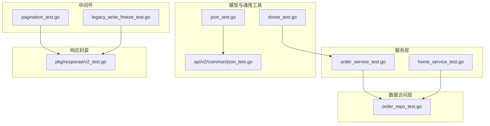
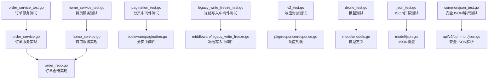
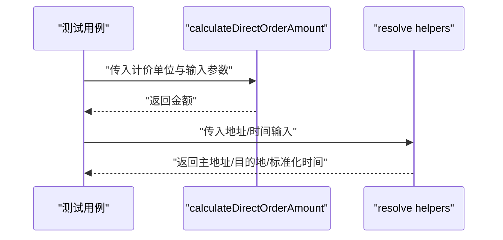
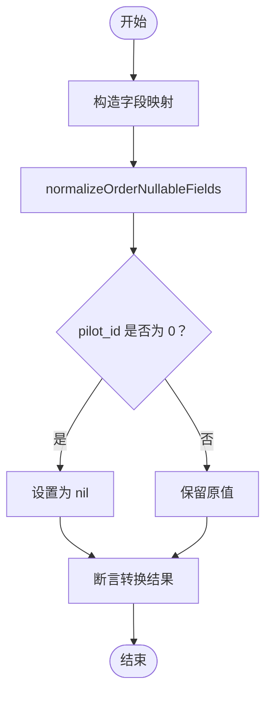
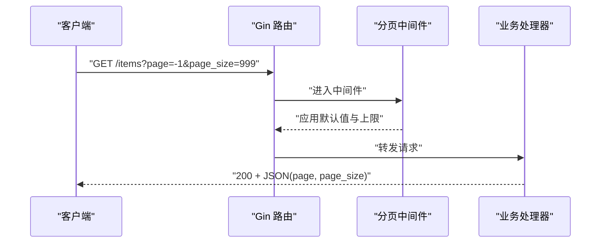
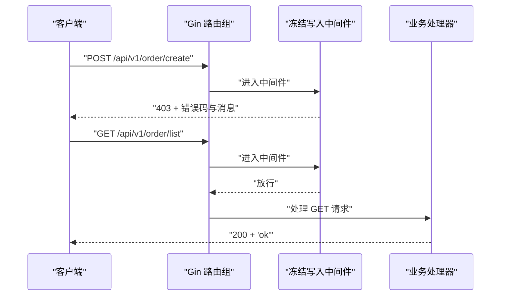
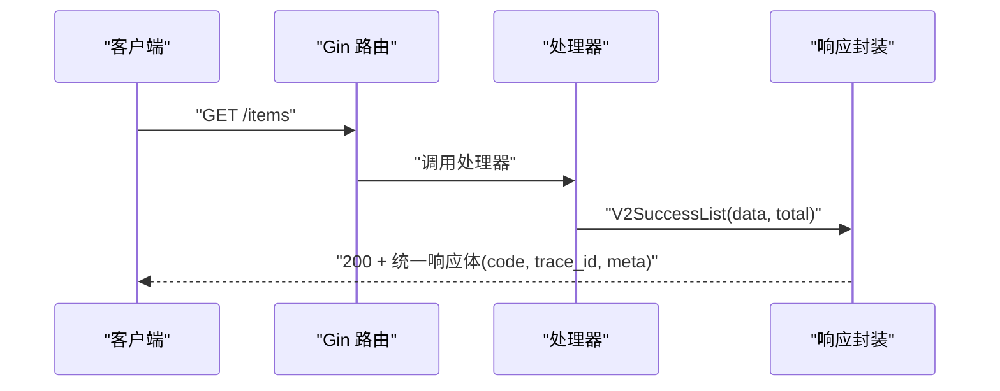

# 单元测试指南

<cite>
**本文引用的文件**
- [backend/internal/service/order_service_test.go](file://backend/internal/service/order_service_test.go)
- [backend/internal/service/home_service_test.go](file://backend/internal/service/home_service_test.go)
- [backend/internal/repository/order_repo_test.go](file://backend/internal/repository/order_repo_test.go)
- [backend/internal/api/middleware/pagination_test.go](file://backend/internal/api/middleware/pagination_test.go)
- [backend/internal/api/middleware/legacy_write_freeze_test.go](file://backend/internal/api/middleware/legacy_write_freeze_test.go)
- [backend/internal/model/drone_test.go](file://backend/internal/model/drone_test.go)
- [backend/internal/model/json_test.go](file://backend/internal/model/json_test.go)
- [backend/internal/api/v2/common/json_test.go](file://backend/internal/api/v2/common/json_test.go)
- [backend/internal/pkg/response/v2_test.go](file://backend/internal/pkg/response/v2_test.go)
- [backend/go.mod](file://backend/go.mod)
</cite>

## 目录
1. [引言](#引言)
2. [项目结构](#项目结构)
3. [核心组件](#核心组件)
4. [架构总览](#架构总览)
5. [详细组件分析](#详细组件分析)
6. [依赖分析](#依赖分析)
7. [性能考虑](#性能考虑)
8. [故障排查指南](#故障排查指南)
9. [结论](#结论)
10. [附录](#附录)

## 引言
本指南面向后端开发者，系统讲解在该无人机租赁平台项目中如何编写高质量的 Go 单元测试。内容覆盖测试文件与函数命名规范、测试函数结构、断言使用方法；业务服务层与数据访问层的单元测试策略（含 mock 对象、依赖注入测试、边界条件测试）；并结合仓库中的实际测试用例，给出可直接参考的测试设计模式与执行调试方法。

## 项目结构
后端采用按层次与领域混合的组织方式：service 层封装业务逻辑，repository 层负责数据存取，model 层承载数据模型与校验逻辑，api/middleware 提供中间件能力，pkg/response 提供统一响应封装。测试文件遵循“被测代码所在包”的原则，在同包内以 *_test.go 命名，便于就近维护与复用。



图表来源
- [backend/internal/service/order_service_test.go:1-105](file://backend/internal/service/order_service_test.go#L1-L105)
- [backend/internal/service/home_service_test.go:1-62](file://backend/internal/service/home_service_test.go#L1-L62)
- [backend/internal/repository/order_repo_test.go:1-25](file://backend/internal/repository/order_repo_test.go#L1-L25)
- [backend/internal/api/middleware/pagination_test.go:1-42](file://backend/internal/api/middleware/pagination_test.go#L1-L42)
- [backend/internal/api/middleware/legacy_write_freeze_test.go:1-82](file://backend/internal/api/middleware/legacy_write_freeze_test.go#L1-L82)
- [backend/internal/model/drone_test.go:1-39](file://backend/internal/model/drone_test.go#L1-L39)
- [backend/internal/model/json_test.go:1-19](file://backend/internal/model/json_test.go#L1-L19)
- [backend/internal/api/v2/common/json_test.go:1-30](file://backend/internal/api/v2/common/json_test.go#L1-L30)
- [backend/internal/pkg/response/v2_test.go:1-80](file://backend/internal/pkg/response/v2_test.go#L1-L80)

章节来源
- [backend/internal/service/order_service_test.go:1-105](file://backend/internal/service/order_service_test.go#L1-L105)
- [backend/internal/service/home_service_test.go:1-62](file://backend/internal/service/home_service_test.go#L1-L62)
- [backend/internal/repository/order_repo_test.go:1-25](file://backend/internal/repository/order_repo_test.go#L1-L25)
- [backend/internal/api/middleware/pagination_test.go:1-42](file://backend/internal/api/middleware/pagination_test.go#L1-L42)
- [backend/internal/api/middleware/legacy_write_freeze_test.go:1-82](file://backend/internal/api/middleware/legacy_write_freeze_test.go#L1-L82)
- [backend/internal/model/drone_test.go:1-39](file://backend/internal/model/drone_test.go#L1-L39)
- [backend/internal/model/json_test.go:1-19](file://backend/internal/model/json_test.go#L1-L19)
- [backend/internal/api/v2/common/json_test.go:1-30](file://backend/internal/api/v2/common/json_test.go#L1-L30)
- [backend/internal/pkg/response/v2_test.go:1-80](file://backend/internal/pkg/response/v2_test.go#L1-L80)

## 核心组件
- 测试文件命名规范
  - 同包内以 *_test.go 命名，如 order_service_test.go、pagination_test.go 等。
  - 便于与被测代码保持同源，减少跨包依赖，提升可维护性。
- 测试函数结构
  - 使用 testing.T 作为参数，通过 t.Fatalf/t.Log 等进行断言与失败报告。
  - 典型流程：构造输入/桩数据 → 调用被测函数 → 断言结果 → 失败时输出明确信息。
- 断言使用方法
  - 使用 t.Fatalf 输出错误并终止当前子测试，确保失败显式可见。
  - 使用 t.Fatalf 比 t.Error 更适合关键断言，避免继续执行导致的误判。
  - 对于复杂场景，建议分步断言并输出期望值与实际值，便于定位问题。

章节来源
- [backend/internal/service/order_service_test.go:11-35](file://backend/internal/service/order_service_test.go#L11-L35)
- [backend/internal/service/order_service_test.go:37-68](file://backend/internal/service/order_service_test.go#L37-L68)
- [backend/internal/service/order_service_test.go:70-104](file://backend/internal/service/order_service_test.go#L70-L104)
- [backend/internal/repository/order_repo_test.go:5-14](file://backend/internal/repository/order_repo_test.go#L5-L14)
- [backend/internal/repository/order_repo_test.go:16-24](file://backend/internal/repository/order_repo_test.go#L16-L24)

## 架构总览
下图展示测试用例与被测模块之间的交互关系，体现从服务层到数据访问层、再到中间件与响应封装的调用链路。



图表来源
- [backend/internal/service/order_service_test.go:1-105](file://backend/internal/service/order_service_test.go#L1-L105)
- [backend/internal/service/home_service_test.go:1-62](file://backend/internal/service/home_service_test.go#L1-L62)
- [backend/internal/repository/order_repo_test.go:1-25](file://backend/internal/repository/order_repo_test.go#L1-L25)
- [backend/internal/api/middleware/pagination_test.go:1-42](file://backend/internal/api/middleware/pagination_test.go#L1-L42)
- [backend/internal/api/middleware/legacy_write_freeze_test.go:1-82](file://backend/internal/api/middleware/legacy_write_freeze_test.go#L1-L82)
- [backend/internal/pkg/response/v2_test.go:1-80](file://backend/internal/pkg/response/v2_test.go#L1-L80)
- [backend/internal/model/drone_test.go:1-39](file://backend/internal/model/drone_test.go#L1-L39)
- [backend/internal/model/json_test.go:1-19](file://backend/internal/model/json_test.go#L1-L19)
- [backend/internal/api/v2/common/json_test.go:1-30](file://backend/internal/api/v2/common/json_test.go#L1-L30)

## 详细组件分析

### 订单服务单元测试策略
- 目标与范围
  - 验证直连订单金额计算（按次、按公斤、按小时、按公里）。
  - 验证地址优先级解析、时间窗口归一化等辅助逻辑。
- 关键测试点
  - 计算逻辑：构造不同计价单位与输入参数，断言金额正确性。
  - 辅助函数：验证主地址选择、目的地解析、时间窗口规范化。
- 边界条件
  - 时间相等时的归一化处理、距离计算的四舍五入策略。
- 可扩展性
  - 将金额计算拆分为独立函数，便于单元测试；对地理距离计算可引入常量或辅助函数以支持测试。



图表来源
- [backend/internal/service/order_service_test.go:11-35](file://backend/internal/service/order_service_test.go#L11-L35)
- [backend/internal/service/order_service_test.go:37-68](file://backend/internal/service/order_service_test.go#L37-L68)
- [backend/internal/service/order_service_test.go:70-104](file://backend/internal/service/order_service_test.go#L70-L104)

章节来源
- [backend/internal/service/order_service_test.go:11-104](file://backend/internal/service/order_service_test.go#L11-L104)

### 数据访问层单元测试策略
- 目标与范围
  - 验证订单字段空值转换逻辑（如 pilot_id=0 转 nil），确保入库前数据一致性。
- 关键测试点
  - 字段映射：构造包含可空字段的 map，断言转换后行为符合预期。
- 边界条件
  - 正数 ID 保持不变，零值转为空指针，避免误写入数据库默认值。



图表来源
- [backend/internal/repository/order_repo_test.go:5-14](file://backend/internal/repository/order_repo_test.go#L5-L14)
- [backend/internal/repository/order_repo_test.go:16-24](file://backend/internal/repository/order_repo_test.go#L16-L24)

章节来源
- [backend/internal/repository/order_repo_test.go:1-25](file://backend/internal/repository/order_repo_test.go#L1-L25)

### 中间件单元测试策略
- 分页中间件
  - 目标：默认值、上限控制、非法输入的容错。
  - 方法：构造 Gin 路由与上下文，使用 httptest 发送请求，断言响应状态与 JSON 内容。
- 冻结写入中间件
  - 目标：仅阻断写操作，允许读操作；支持白名单前缀放行。
  - 方法：构造路由组与中间件，分别测试 POST/GET 与带前缀的放行路径。



图表来源
- [backend/internal/api/middleware/pagination_test.go:11-34](file://backend/internal/api/middleware/pagination_test.go#L11-L34)



图表来源
- [backend/internal/api/middleware/legacy_write_freeze_test.go:12-43](file://backend/internal/api/middleware/legacy_write_freeze_test.go#L12-L43)
- [backend/internal/api/middleware/legacy_write_freeze_test.go:45-62](file://backend/internal/api/middleware/legacy_write_freeze_test.go#L45-L62)
- [backend/internal/api/middleware/legacy_write_freeze_test.go:64-81](file://backend/internal/api/middleware/legacy_write_freeze_test.go#L64-L81)

章节来源
- [backend/internal/api/middleware/pagination_test.go:1-42](file://backend/internal/api/middleware/pagination_test.go#L1-L42)
- [backend/internal/api/middleware/legacy_write_freeze_test.go:1-82](file://backend/internal/api/middleware/legacy_write_freeze_test.go#L1-L82)

### 模型与通用工具单元测试策略
- 飞机模型
  - 重载阈值判断与市场准入校验，覆盖达标与不达标场景。
- JSON 类型
  - Scan 行为稳定性：驱动返回字节被修改后，内部存储不应受影响。
- 安全 JSON 解析
  - 结构化解析与无效 JSON 的回退策略。

```mermaid
classDiagram
class Drone {
+MeetsHeavyLiftThreshold() bool
+EligibleForMarketplace() bool
}
class JSON {
+Scan(src) error
}
class SafeJSONValue {
+SafeJSONValue(json) interface{}
}
Drone <.. SafeJSONValue : "用于文本/地址解析"
JSON <.. SafeJSONValue : "输入类型"
```

图表来源
- [backend/internal/model/drone_test.go:5-18](file://backend/internal/model/drone_test.go#L5-L18)
- [backend/internal/model/drone_test.go:20-38](file://backend/internal/model/drone_test.go#L20-L38)
- [backend/internal/model/json_test.go:5-18](file://backend/internal/model/json_test.go#L5-L18)
- [backend/internal/api/v2/common/json_test.go:9-29](file://backend/internal/api/v2/common/json_test.go#L9-L29)

章节来源
- [backend/internal/model/drone_test.go:1-39](file://backend/internal/model/drone_test.go#L1-L39)
- [backend/internal/model/json_test.go:1-19](file://backend/internal/model/json_test.go#L1-L19)
- [backend/internal/api/v2/common/json_test.go:1-30](file://backend/internal/api/v2/common/json_test.go#L1-L30)

### 响应封装单元测试策略
- 目标与范围
  - 列表成功响应：断言统一编码、TraceID 透传、分页元数据。
  - 授权失败响应：断言状态码与响应体结构。
- 关键测试点
  - 在处理器中设置 trace_id、page、page_size，验证响应包裹结构与字段一致性。



图表来源
- [backend/internal/pkg/response/v2_test.go:12-50](file://backend/internal/pkg/response/v2_test.go#L12-L50)
- [backend/internal/pkg/response/v2_test.go:52-79](file://backend/internal/pkg/response/v2_test.go#L52-L79)

章节来源
- [backend/internal/pkg/response/v2_test.go:1-80](file://backend/internal/pkg/response/v2_test.go#L1-L80)

## 依赖分析
- 测试框架与工具
  - 使用标准库 testing 与 httptest 进行单元测试与 HTTP 场景模拟。
  - Gin 测试模式与路由注册用于中间件测试。
- 外部依赖
  - go.uber.org/mock 在 go.mod 中声明为间接依赖，可用于生成或集成 mock 对象（若后续引入）。
- 耦合与内聚
  - 测试文件与被测代码同包，降低耦合；通过构造输入与断言输出保证内聚。

章节来源
- [backend/go.mod:1-80](file://backend/go.mod#L1-L80)

## 性能考虑
- 测试执行速度
  - 避免在测试中进行真实网络或数据库调用；必要时使用内存态或本地最小化依赖。
- 断言粒度
  - 将复杂断言拆分为多个小断言，便于快速定位问题并减少重复执行。
- 并发测试
  - 如需并发场景，确保共享资源的互斥与隔离，避免竞态条件影响测试稳定性。

## 故障排查指南
- 常见问题
  - 断言失败：优先检查期望值与实际值，确认输入构造是否完整。
  - 中间件测试失败：确认 Gin 路由与中间件注册顺序，以及请求路径匹配。
  - 响应封装异常：核对 trace_id、meta 字段是否正确设置与透传。
- 调试技巧
  - 使用 t.Logf 输出关键变量，缩小问题范围。
  - 对复杂输入构造结构化数据，逐步剔除字段以定位触发条件。
  - 对外部依赖（如数据库、缓存）使用内存态替代，确保测试可重复。

## 结论
本指南基于现有测试实践总结了 Go 单元测试的编写方法与最佳实践，覆盖服务层、数据访问层、中间件与通用工具的测试策略，并提供了可直接参考的测试用例路径。建议在新增功能时遵循同包 *_test.go 命名、清晰断言与边界覆盖的原则，持续提升代码质量与可维护性。

## 附录
- 测试文件清单与用途概览
  - order_service_test.go：订单服务金额计算与辅助逻辑测试
  - home_service_test.go：首页汇总统计与文本解析测试
  - order_repo_test.go：订单字段空值转换测试
  - pagination_test.go：分页中间件默认值与上限测试
  - legacy_write_freeze_test.go：写入冻结中间件读写控制与放行测试
  - drone_test.go：无人机模型判定测试
  - json_test.go：JSON 扫描稳定性测试
  - api/v2/common/json_test.go：安全 JSON 解析测试
  - pkg/response/v2_test.go：统一响应封装测试