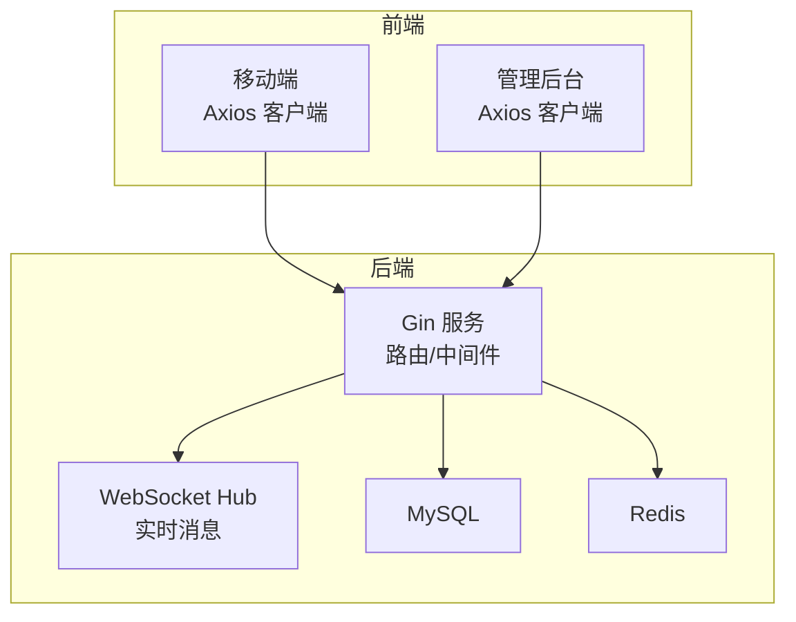
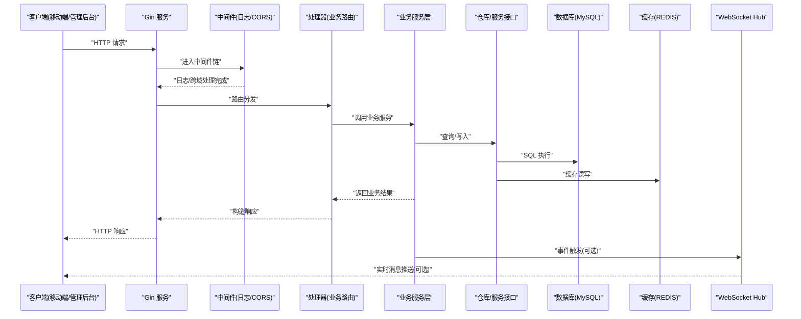
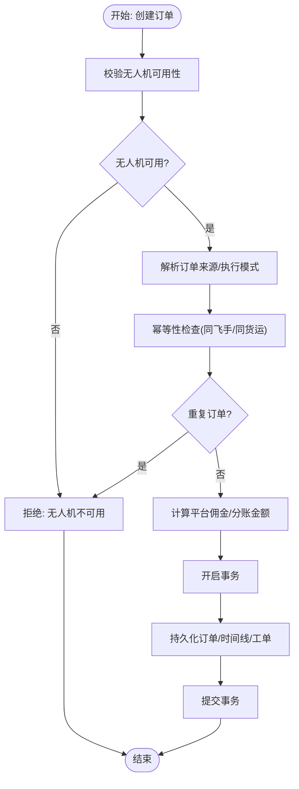
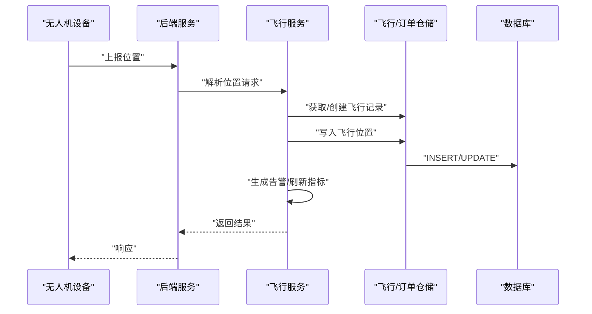
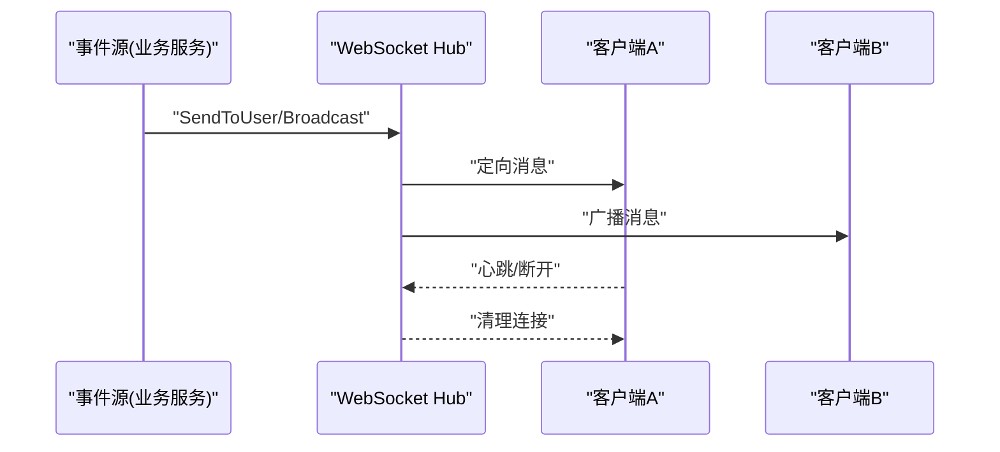
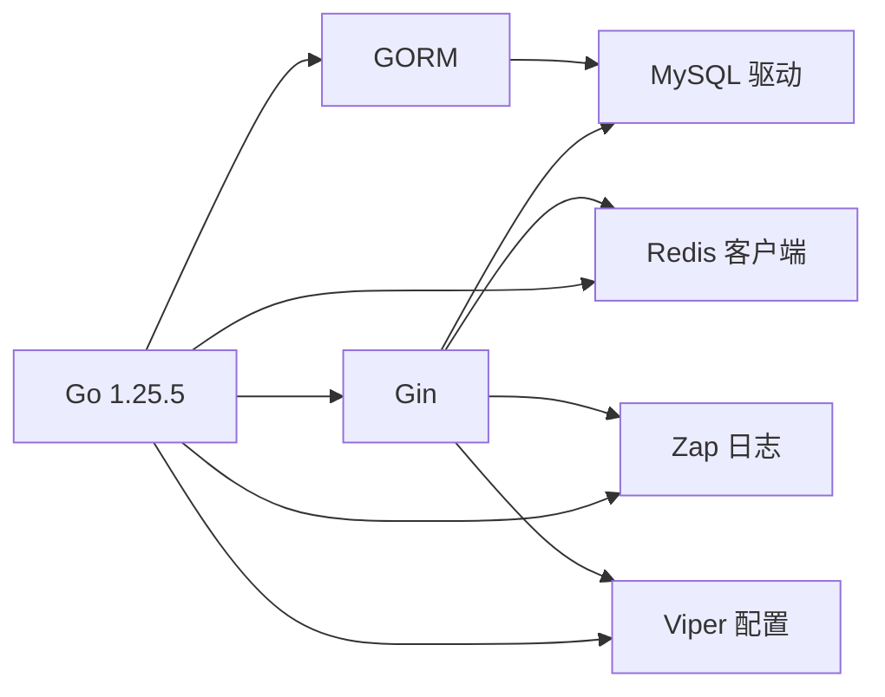

# 性能测试

<cite>
**本文引用的文件**
- [backend/cmd/server/main.go](file://backend/cmd/server/main.go)
- [backend/internal/config/config.go](file://backend/internal/config/config.go)
- [backend/go.mod](file://backend/go.mod)
- [mobile/src/services/api.ts](file://mobile/src/services/api.ts)
- [admin/src/services/api.ts](file://admin/src/services/api.ts)
- [backend/internal/websocket/hub.go](file://backend/internal/websocket/hub.go)
- [backend/internal/api/middleware/logger.go](file://backend/internal/api/middleware/logger.go)
- [backend/internal/api/middleware/cors.go](file://backend/internal/api/middleware/cors.go)
- [docker/docker-compose.yml](file://docker/docker-compose.yml)
- [backend/config.example.yaml](file://backend/config.example.yaml)
- [backend/internal/service/order_service.go](file://backend/internal/service/order_service.go)
- [backend/internal/service/flight_service.go](file://backend/internal/service/flight_service.go)
- [backend/internal/service/message_service.go](file://backend/internal/service/message_service.go)
</cite>

## 目录
1. [引言](#引言)
2. [项目结构](#项目结构)
3. [核心组件](#核心组件)
4. [架构总览](#架构总览)
5. [详细组件分析](#详细组件分析)
6. [依赖分析](#依赖分析)
7. [性能考量](#性能考量)
8. [故障排查指南](#故障排查指南)
9. [结论](#结论)
10. [附录](#附录)

## 引言
本文件面向无人机租赁平台的性能测试工作，提供系统化的测试方法论与实操指南。内容覆盖负载测试、压力测试、并发测试的设计与执行；关键业务场景的性能基准（订单处理、飞行监控、实时通信）；测试工具使用、脚本编写、测试数据生成与性能监控方法；以及性能瓶颈识别、优化建议与调优策略。目标是帮助测试团队与研发团队建立可复现、可度量、可改进的性能保障体系。

## 项目结构
系统由三部分组成：
- 后端服务：基于 Go + Gin 的 REST API 服务，负责业务逻辑、数据持久化、缓存与消息推送。
- 移动端与管理后台：基于 React/React Native 的前端应用，通过 Axios 发起 HTTP 请求并与后端交互。
- 基础设施：MySQL、Redis 通过 Docker Compose 提供本地开发与测试支撑。

图表来源
- [backend/cmd/server/main.go:52-266](file://backend/cmd/server/main.go#L52-L266)
- [backend/internal/websocket/hub.go:35-132](file://backend/internal/websocket/hub.go#L35-L132)
- [docker/docker-compose.yml:1-27](file://docker/docker-compose.yml#L1-L27)

章节来源
- [backend/cmd/server/main.go:52-266](file://backend/cmd/server/main.go#L52-L266)
- [docker/docker-compose.yml:1-27](file://docker/docker-compose.yml#L1-L27)

## 核心组件
- 服务入口与配置
  - 服务启动流程、数据库连接池、Redis 初始化、WebSocket Hub 启动、中间件注册与路由注册均在服务入口集中完成。
  - 配置文件支持 YAML，涵盖服务器、数据库、Redis、JWT、上传、短信、支付、高德地图、WebSocket、日志、CORS、推送、OAuth 等模块。
- 中间件
  - 日志中间件：统一记录请求路径、方法、耗时、状态码、客户端 IP、Body 大小等。
  - CORS 中间件：允许跨域访问，便于前端联调。
- WebSocket
  - Hub 提供广播与定向消息能力，支持在线用户数统计与连接管理。
- 前端客户端
  - 移动端与管理后台均采用 Axios 构建客户端，统一注入 Authorization 头与响应拦截处理，具备 Token 刷新与错误处理机制。

章节来源
- [backend/cmd/server/main.go:52-266](file://backend/cmd/server/main.go#L52-L266)
- [backend/internal/config/config.go:16-521](file://backend/internal/config/config.go#L16-L521)
- [backend/internal/api/middleware/logger.go:10-31](file://backend/internal/api/middleware/logger.go#L10-L31)
- [backend/internal/api/middleware/cors.go:10-19](file://backend/internal/api/middleware/cors.go#L10-L19)
- [backend/internal/websocket/hub.go:35-132](file://backend/internal/websocket/hub.go#L35-L132)
- [mobile/src/services/api.ts:18-155](file://mobile/src/services/api.ts#L18-L155)
- [admin/src/services/api.ts:51-137](file://admin/src/services/api.ts#L51-L137)

## 架构总览
下图展示了服务启动、请求处理、数据持久化与实时通信的关键路径，有助于定位性能瓶颈与制定测试策略。

图表来源
- [backend/cmd/server/main.go:250-259](file://backend/cmd/server/main.go#L250-L259)
- [backend/internal/api/middleware/logger.go:10-31](file://backend/internal/api/middleware/logger.go#L10-L31)
- [backend/internal/api/middleware/cors.go:10-19](file://backend/internal/api/middleware/cors.go#L10-L19)
- [backend/internal/websocket/hub.go:45-97](file://backend/internal/websocket/hub.go#L45-L97)

## 详细组件分析

### 订单处理性能基准
- 关键路径
  - 订单创建涉及无人机可用性校验、幂等性检查、佣金计算、订单来源解析、执行模式判定、初始状态与时间线记录等步骤。
  - 事务一致性通过数据库事务保证，避免脏写。
- 性能关注点
  - 事务锁竞争：订单创建可能对无人机、需求、工单等多表写入，需关注锁等待与死锁风险。
  - 读写分离与索引：查询与写入路径的索引设计直接影响吞吐。
  - 缓存热点：订单号生成、佣金配置、来源解析等可考虑缓存。
  - 幂等性：重复提交的防护与去重逻辑。
- 测试场景建议
  - 单用户高 QPS 下的订单创建峰值。
  - 多用户并发下单，观察事务冲突率与平均延迟。
  - 无人机不可用/重复接单等边界条件下的错误路径吞吐。

图表来源
- [backend/internal/service/order_service.go:65-200](file://backend/internal/service/order_service.go#L65-L200)

章节来源
- [backend/internal/service/order_service.go:65-200](file://backend/internal/service/order_service.go#L65-L200)

### 飞行监控性能基准
- 关键路径
  - 位置上报：解析请求、落库飞行位置、生成告警、刷新飞行记录指标。
  - 飞行记录同步：按订单或飞手维度批量同步飞行记录。
- 性能关注点
  - 高频上报：位置上报间隔短、并发高，需评估数据库写入压力与索引效率。
  - 告警计算：阈值判断与规则匹配的复杂度。
  - 指标刷新：聚合与更新的开销。
- 测试场景建议
  - 单订单多设备并发上报的峰值与延迟。
  - 多订单并发上报下的系统整体吞吐与 P99 延迟。
  - 不同阈值配置下的告警生成速率与数据库写放大。

图表来源
- [backend/internal/service/flight_service.go:112-158](file://backend/internal/service/flight_service.go#L112-L158)

章节来源
- [backend/internal/service/flight_service.go:112-158](file://backend/internal/service/flight_service.go#L112-L158)

### 实时通信性能基准
- 关键路径
  - WebSocket Hub 维护用户连接映射，支持定向与广播消息。
  - 事件服务通过 Hub 推送消息，前端订阅并渲染。
- 性能关注点
  - 连接数与消息队列容量：广播风暴与定向消息的发送通道。
  - 连接复用与心跳：Ping/Pong 间隔与超时配置影响长连接稳定性。
  - 并发发送：select 默认分支与阻塞发送的风险。
- 测试场景建议
  - 在线用户规模与消息吞吐量的关系曲线。
  - 广播消息与定向消息的延迟差异。
  - 连接断开与重连的抖动对用户体验的影响。

图表来源
- [backend/internal/websocket/hub.go:45-116](file://backend/internal/websocket/hub.go#L45-L116)

章节来源
- [backend/internal/websocket/hub.go:45-116](file://backend/internal/websocket/hub.go#L45-L116)

### 前端性能基线
- 移动端与管理后台均通过 Axios 客户端发起请求，具备统一的认证头注入与响应拦截、Token 刷新与错误处理。
- 前端侧关注点
  - 请求超时与重试策略。
  - Token 刷新期间的并发请求排队与重试。
  - 响应数据结构与渲染开销。

章节来源
- [mobile/src/services/api.ts:18-155](file://mobile/src/services/api.ts#L18-L155)
- [admin/src/services/api.ts:51-137](file://admin/src/services/api.ts#L51-L137)

## 依赖分析
- 语言与框架
  - 后端：Go 1.25.5，Gin、GORM、MySQL 驱动、Redis 客户端、Zap 日志、Viper 配置。
- 基础设施
  - Docker Compose 提供 MySQL 与 Redis 的本地容器化环境。
- 配置与运行模式
  - 通过 config.yaml 控制运行模式（debug/release/test），数据库连接池参数、Redis 地址、JWT 密钥、WebSocket 参数等均可配置。

图表来源
- [backend/go.mod:5-21](file://backend/go.mod#L5-L21)

章节来源
- [backend/go.mod:5-21](file://backend/go.mod#L5-L21)
- [docker/docker-compose.yml:1-27](file://docker/docker-compose.yml#L1-L27)
- [backend/internal/config/config.go:16-521](file://backend/internal/config/config.go#L16-L521)

## 性能考量
- 数据库连接池
  - 启动时设置最大空闲连接与最大打开连接数，需结合并发与查询特征进行调优。
- 日志与中间件
  - 日志中间件记录请求耗时、状态码、IP、Body 大小，可用于性能观测与异常定位。
  - CORS 中间件允许跨域，便于前端联调但需注意生产环境的安全配置。
- 缓存与热点
  - Redis 用于验证码、会话、限流等，需评估键空间与过期策略。
- WebSocket
  - 广播通道缓冲区大小、Ping/Pong 间隔与超时、在线用户数统计，直接影响实时通信的吞吐与稳定性。
- 前端请求
  - Axios 超时、Token 刷新并发控制、错误处理与重试策略，影响端到端体验。

章节来源
- [backend/cmd/server/main.go:281-292](file://backend/cmd/server/main.go#L281-L292)
- [backend/internal/api/middleware/logger.go:10-31](file://backend/internal/api/middleware/logger.go#L10-L31)
- [backend/internal/api/middleware/cors.go:10-19](file://backend/internal/api/middleware/cors.go#L10-L19)
- [backend/internal/websocket/hub.go:35-43](file://backend/internal/websocket/hub.go#L35-L43)
- [mobile/src/services/api.ts:9-13](file://mobile/src/services/api.ts#L9-L13)
- [admin/src/services/api.ts:16-22](file://admin/src/services/api.ts#L16-L22)

## 故障排查指南
- 常见问题定位
  - 请求耗时异常：通过日志中间件查看路径、方法、状态码与耗时，定位慢请求。
  - 数据库连接不足：检查最大打开连接数与空闲连接数配置，观察连接池饱和与等待。
  - WebSocket 断线：检查 Ping/Pong 间隔与超时配置，确认广播通道是否存在阻塞。
  - 前端 Token 刷新失败：检查刷新接口返回码与响应体，确认刷新并发队列处理。
- 建议手段
  - 增加关键路径的埋点与采样，结合日志与指标进行关联分析。
  - 对热点接口与资源进行压测，记录 P50/P90/P99 延迟与错误率。
  - 对数据库执行计划与索引使用情况进行分析，必要时引入只读副本或缓存。

章节来源
- [backend/internal/api/middleware/logger.go:10-31](file://backend/internal/api/middleware/logger.go#L10-L31)
- [backend/internal/websocket/hub.go:45-97](file://backend/internal/websocket/hub.go#L45-L97)
- [mobile/src/services/api.ts:79-146](file://mobile/src/services/api.ts#L79-L146)
- [admin/src/services/api.ts:77-137](file://admin/src/services/api.ts#L77-L137)

## 结论
本性能测试文档提供了从架构到关键业务场景的测试方法与优化方向。通过合理的测试设计、完善的监控与可观测性、以及针对性的调优策略，可显著提升系统在高并发与复杂业务场景下的稳定性与吞吐能力。建议在持续集成中引入自动化性能回归，并将性能指标纳入发布门禁。

## 附录

### 性能测试方法与工具使用指南
- 负载测试
  - 设计阶梯式负载曲线，逐步增加并发用户数与请求速率，观察系统在不同阶段的延迟、错误率与资源占用。
  - 关注关键接口：订单创建、飞行位置上报、消息收发、飞行记录查询等。
- 压力测试
  - 在极限条件下持续施压，直至系统出现错误、延迟突增或资源耗尽，记录拐点与恢复时间。
- 并发测试
  - 模拟真实用户行为，关注 Token 刷新并发、WebSocket 连接稳定性与消息投递一致性。
- 测试脚本编写
  - 使用 HTTP 客户端或专用压测工具（如 wrk、JMeter、k6、Locust）编写脚本，覆盖登录、下单、上报位置、消息收发等场景。
- 测试数据生成
  - 使用脚本批量生成用户、无人机、订单、飞行记录等数据，确保测试数据与线上分布一致。
- 性能监控
  - 结合后端日志中间件、数据库慢查询日志、Redis 命中率、系统 CPU/内存/IO、网络带宽与连接数等指标进行综合分析。

### 关键业务场景性能指标
- 订单处理
  - 吞吐：订单创建 QPS、事务提交成功率。
  - 延迟：P50/P90/P99 订单创建耗时。
  - 错误：重复下单、库存不足、事务冲突等错误率。
- 飞行监控
  - 吞吐：位置上报 QPS、告警生成速率。
  - 延迟：上报到可见的平均耗时。
  - 错误：无效坐标、越权上报、数据库写入失败等。
- 实时通信
  - 吞吐：消息发送/接收 QPS、广播消息速率。
  - 延迟：消息端到端时延、心跳往返时间。
  - 可用性：在线用户数、连接断线率、重连次数。

### 性能瓶颈识别与优化建议
- 数据库
  - 优化热点表的索引与分区，减少锁竞争；对高频查询引入缓存；拆分读写库或引入只读副本。
- 缓存
  - 合理设置键空间与过期策略，避免缓存穿透与雪崩；对热点数据做预热。
- 服务
  - 优化序列化与反序列化开销；合并小请求；异步化非关键路径；引入限流与熔断。
- WebSocket
  - 调整广播通道缓冲区大小与 Ping/Pong 间隔；限制单用户消息速率；优化消息压缩。
- 前端
  - 减少不必要的渲染与重绘；合理使用缓存与懒加载；优化网络请求与重试策略。

### 配置参考
- 运行模式与端口：在配置文件中设置 server.port 与 server.mode。
- 数据库连接池：通过 database.max_idle_conns 与 database.max_open_conns 调整。
- Redis：配置 redis.host、redis.port、redis.password、redis.db。
- WebSocket：配置 websocket.max_message_size、websocket.write_wait、websocket.pong_wait、websocket.ping_period。
- 日志：配置 log.level、log.output、log.file_path 等。

章节来源
- [backend/config.example.yaml:14-247](file://backend/config.example.yaml#L14-L247)
- [backend/internal/config/config.go:438-489](file://backend/internal/config/config.go#L438-L489)