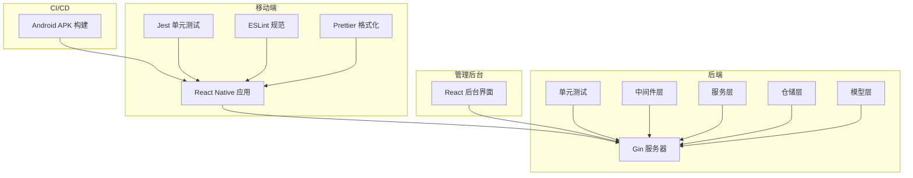
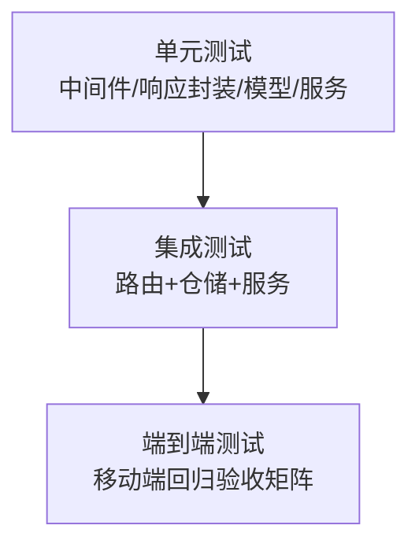
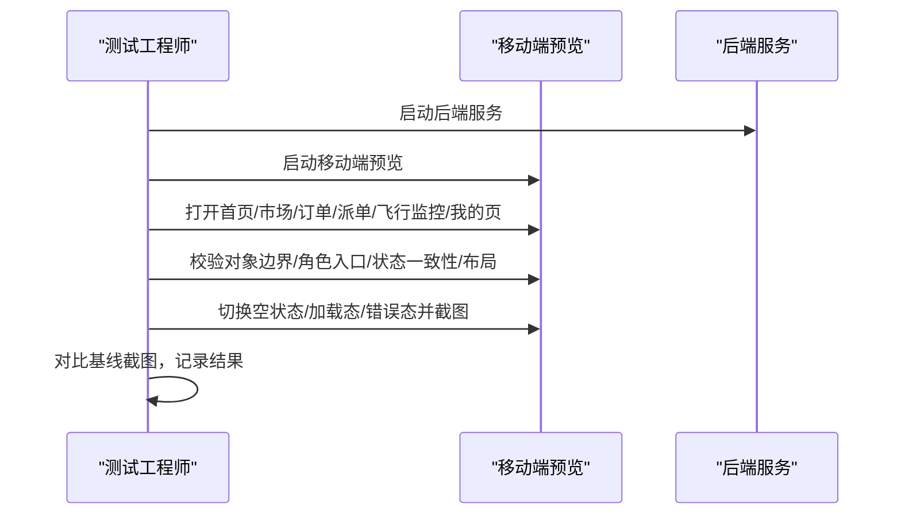
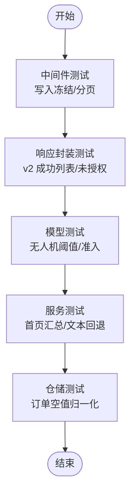
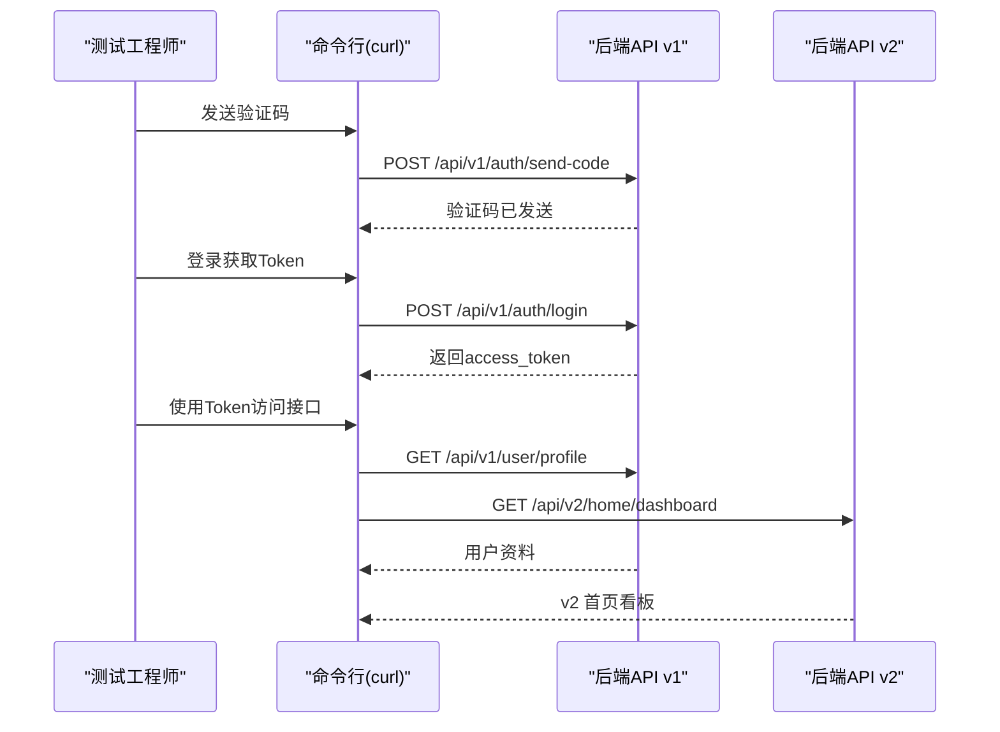
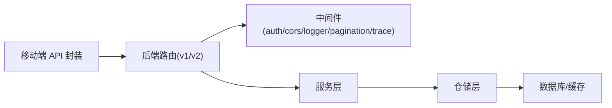

# 测试与质量保证

<cite>
**本文引用的文件**
- [mobile/jest.config.js](file://mobile/jest.config.js)
- [mobile/__tests__/App.test.tsx](file://mobile/__tests__/App.test.tsx)
- [MOBILE_REGRESSION_ACCEPTANCE.md](file://MOBILE_REGRESSION_ACCEPTANCE.md)
- [TEST_CHECKLIST.md](file://TEST_CHECKLIST.md)
- [.github/workflows/build-android-apk.yml](file://.github/workflows/build-android-apk.yml)
- [mobile/.eslintrc.js](file://mobile/.eslintrc.js)
- [mobile/.prettierrc.js](file://mobile/.prettierrc.js)
- [backend/go.mod](file://backend/go.mod)
- [backend/internal/api/middleware/legacy_write_freeze_test.go](file://backend/internal/api/middleware/legacy_write_freeze_test.go)
- [backend/internal/api/middleware/pagination_test.go](file://backend/internal/api/middleware/pagination_test.go)
- [backend/internal/pkg/response/v2_test.go](file://backend/internal/pkg/response/v2_test.go)
- [backend/internal/model/drone_test.go](file://backend/internal/model/drone_test.go)
- [backend/internal/repository/order_repo_test.go](file://backend/internal/repository/order_repo_test.go)
- [backend/internal/service/home_service_test.go](file://backend/internal/service/home_service_test.go)
- [backend/cmd/server/main.go](file://backend/cmd/server/main.go)
- [mobile/src/services/api.ts](file://mobile/src/services/api.ts)
- [mobile/src/store/store.ts](file://mobile/src/store/store.ts)
- [mobile/src/navigation/AppNavigator.tsx](file://mobile/src/navigation/AppNavigator.tsx)
- [mobile/src/screens/home/HomeScreen.tsx](file://mobile/src/screens/home/HomeScreen.tsx)
- [mobile/src/screens/market/MarketHubScreen.tsx](file://mobile/src/screens/market/MarketHubScreen.tsx)
- [mobile/src/screens/order/OrderListScreen.tsx](file://mobile/src/screens/order/OrderListScreen.tsx)
- [mobile/src/screens/dispatch/DispatchTaskListScreen.tsx](file://mobile/src/screens/dispatch/DispatchTaskListScreen.tsx)
- [mobile/src/screens/flight/FlightMonitoringScreen.tsx](file://mobile/src/screens/flight/FlightMonitoringScreen.tsx)
- [mobile/src/screens/profile/ProfileScreen.tsx](file://mobile/src/screens/profile/ProfileScreen.tsx)
- [backend/internal/api/v1/router.go](file://backend/internal/api/v1/router.go)
- [backend/internal/api/v2/router.go](file://backend/internal/api/v2/router.go)
- [backend/internal/service/order_service_test.go](file://backend/internal/service/order_service_test.go)
- [backend/internal/service/payment_service.go](file://backend/internal/service/payment_service.go)
- [backend/internal/service/flight_service.go](file://backend/internal/service/flight_service.go)
- [backend/internal/repository/order_repo.go](file://backend/internal/repository/order_repo.go)
- [backend/internal/repository/drone_repo.go](file://backend/internal/repository/drone_repo.go)
- [backend/internal/repository/pilot_repo.go](file://backend/internal/repository/pilot_repo.go)
- [backend/internal/repository/user_repo.go](file://backend/internal/repository/user_repo.go)
- [backend/internal/model/models.go](file://backend/internal/model/models.go)
- [backend/internal/pkg/response/response.go](file://backend/internal/pkg/response/response.go)
- [backend/internal/pkg/response/v2.go](file://backend/internal/pkg/response/v2.go)
- [backend/internal/api/middleware/auth.go](file://backend/internal/api/middleware/auth.go)
- [backend/internal/api/middleware/cors.go](file://backend/internal/api/middleware/cors.go)
- [backend/internal/api/middleware/logger.go](file://backend/internal/api/middleware/logger.go)
- [backend/internal/api/middleware/pagination.go](file://backend/internal/api/middleware/pagination.go)
- [backend/internal/api/middleware/trace_id.go](file://backend/internal/api/middleware/trace_id.go)
- [backend/internal/api/v1/auth/handler.go](file://backend/internal/api/v1/auth/handler.go)
- [backend/internal/api/v1/order/handler.go](file://backend/internal/api/v1/order/handler.go)
- [backend/internal/api/v2/order/handler.go](file://backend/internal/api/v2/order/handler.go)
- [backend/internal/api/v2/me/handler.go](file://backend/internal/api/v2/me/handler.go)
- [backend/internal/api/v2/home/handler.go](file://backend/internal/api/v2/home/handler.go)
- [backend/internal/api/v2/dispatch/handler.go](file://backend/internal/api/v2/dispatch/handler.go)
- [backend/internal/api/v2/flight/handler.go](file://backend/internal/api/v2/flight/handler.go)
- [backend/internal/api/v2/pilot/handler.go](file://backend/internal/api/v2/pilot/handler.go)
- [backend/internal/api/v2/owner/handler.go](file://backend/internal/api/v2/owner/handler.go)
- [backend/internal/api/v2/client/handler.go](file://backend/internal/api/v2/client/handler.go)
- [backend/internal/api/v2/payment/handler.go](file://backend/internal/api/v2/payment/handler.go)
- [backend/internal/api/v2/review/handler.go](file://backend/internal/api/v2/review/handler.go)
- [backend/internal/api/v2/settlement/handler.go](file://backend/internal/api/v2/settlement/handler.go)
- [backend/internal/api/v2/supply/handler.go](file://backend/internal/api/v2/supply/handler.go)
- [backend/internal/api/v2/demand/handler.go](file://backend/internal/api/v2/demand/handler.go)
- [backend/internal/api/v2/notification/handler.go](file://backend/internal/api/v2/notification/handler.go)
- [backend/internal/api/v2/user/handler.go](file://backend/internal/api/v2/user/handler.go)
- [backend/internal/api/v2/client/client_list_handler.go](file://backend/internal/api/v2/client/client_list_handler.go)
- [backend/internal/api/v2/client/client_detail_handler.go](file://backend/internal/api/v2/client/client_detail_handler.go)
- [backend/internal/api/v2/client/client_profile_handler.go](file://backend/internal/api/v2/client/client_profile_handler.go)
- [backend/internal/api/v2/owner/owner_profile_handler.go](file://backend/internal/api/v2/owner/owner_profile_handler.go)
- [backend/internal/api/v2/pilot/pilot_profile_handler.go](file://backend/internal/api/v2/pilot/pilot_profile_handler.go)
- [backend/internal/api/v2/pilot/pilot_flight_records_handler.go](file://backend/internal/api/v2/pilot/pilot_flight_records_handler.go)
- [backend/internal/api/v2/pilot/pilot_candidate_demands_handler.go](file://backend/internal/api/v2/pilot/pilot_candidate_demands_handler.go)
- [backend/internal/api/v2/owner/owner_supplies_handler.go](file://backend/internal/api/v2/owner/owner_supplies_handler.go)
- [backend/internal/api/v2/owner/owner_quotes_handler.go](file://backend/internal/api/v2/owner/owner_quotes_handler.go)
- [backend/internal/api/v2/client/client_my_demands_handler.go](file://backend/internal/api/v2/client/client_my_demands_handler.go)
- [backend/internal/api/v2/client/client_my_offers_handler.go](file://backend/internal/api/v2/client/client_my_offers_handler.go)
- [backend/internal/api/v2/client/client_my_cargo_handler.go](file://backend/internal/api/v2/client/client_my_cargo_handler.go)
- [backend/internal/api/v2/order/order_list_handler.go](file://backend/internal/api/v2/order/order_list_handler.go)
- [backend/internal/api/v2/order/order_detail_handler.go](file://backend/internal/api/v2/order/order_detail_handler.go)
- [backend/internal/api/v2/dispatch/dispatch_task_list_handler.go](file://backend/internal/api/v2/dispatch/dispatch_task_list_handler.go)
- [backend/internal/api/v2/dispatch/dispatch_task_detail_handler.go](file://backend/internal/api/v2/dispatch/dispatch_task_detail_handler.go)
- [backend/internal/api/v2/flight/flight_monitor_handler.go](file://backend/internal/api/v2/flight/flight_monitor_handler.go)
- [backend/internal/api/v2/flight/flight_record_list_handler.go](file://backend/internal/api/v2/flight/flight_record_list_handler.go)
- [backend/internal/api/v2/me/me_handler.go](file://backend/internal/api/v2/me/me_handler.go)
- [backend/internal/api/v2/home/home_dashboard_handler.go](file://backend/internal/api/v2/home/home_dashboard_handler.go)
- [backend/internal/api/v2/supply/supply_list_handler.go](file://backend/internal/api/v2/supply/supply_list_handler.go)
- [backend/internal/api/v2/supply/supply_detail_handler.go](file://backend/internal/api/v2/supply/supply_detail_handler.go)
- [backend/internal/api/v2/demand/demand_list_handler.go](file://backend/internal/api/v2/demand/demand_list_handler.go)
- [backend/internal/api/v2/demand/demand_detail_handler.go](file://backend/internal/api/v2/demand/demand_detail_handler.go)
- [backend/internal/api/v2/demand/demand_quote_handler.go](file://backend/internal/api/v2/demand/demand_quote_handler.go)
- [backend/internal/api/v2/demand/demand_candidate_handler.go](file://backend/internal/api/v2/demand/demand_candidate_handler.go)
- [backend/internal/api/v2/payment/payment_handler.go](file://backend/internal/api/v2/payment/payment_handler.go)
- [backend/internal/api/v2/review/review_handler.go](file://backend/internal/api/v2/review/review_handler.go)
- [backend/internal/api/v2/settlement/settlement_handler.go](file://backend/internal/api/v2/settlement/settlement_handler.go)
- [backend/internal/api/v2/notification/notification_handler.go](file://backend/internal/api/v2/notification/notification_handler.go)
- [backend/internal/api/v2/user/user_handler.go](file://backend/internal/api/v2/user/user_handler.go)
- [backend/internal/api/v2/client/client_my_quotes_handler.go](file://backend/internal/api/v2/client/client_my_quotes_handler.go)
- [backend/internal/api/v2/client/client_my_orders_handler.go](file://backend/internal/api/v2/client/client_my_orders_handler.go)
- [backend/internal/api/v2/client/client_my_tasks_handler.go](file://backend/internal/api/v2/client/client_my_tasks_handler.go)
- [backend/internal/api/v2/client/client_my_wallet_handler.go](file://backend/internal/api/v2/client/client_my_wallet_handler.go)
- [backend/internal/api/v2/client/client_my_insurance_handler.go](file://backend/internal/api/v2/client/client_my_insurance_handler.go)
- [backend/internal/api/v2/client/client_my_credit_handler.go](file://backend/internal/api/v2/client/client_my_credit_handler.go)
- [backend/internal/api/v2/client/client_my_violations_handler.go](file://backend/internal/api/v2/client/client_my_violations_handler.go)
- [backend/internal/api/v2/client/client_my_withdrawals_handler.go](file://backend/internal/api/v2/client/client_my_withdrawals_handler.go)
- [backend/internal/api/v2/client/client_my_airspaces_handler.go](file://backend/internal/api/v2/client/client_my_airspaces_handler.go)
- [backend/internal/api/v2/client/client_my_publishes_handler.go](file://backend/internal/api/v2/client/client_my_publishes_handler.go)
- [backend/internal/api/v2/client/client_my_reviews_handler.go](file://backend/internal/api/v2/client/client_my_reviews_handler.go)
- [backend/internal/api/v2/client/client_my_notifications_handler.go](file://backend/internal/api/v2/client/client_my_notifications_handler.go)
- [backend/internal/api/v2/client/client_my_settings_handler.go](file://backend/internal/api/v2/client/client_my_settings_handler.go)
- [backend/internal/api/v2/client/client_my_profile_handler.go](file://backend/internal/api/v2/client/client_my_profile_handler.go)
- [backend/internal/api/v2/client/client_my_bindings_handler.go](file://backend/internal/api/v2/client/client_my_bindings_handler.go)
- [backend/internal/api/v2/client/client_my_favorites_handler.go](file://backend/internal/api/v2/client/client_my_favorites_handler.go)
- [backend/internal/api/v2/client/client_my_history_handler.go](file://backend/internal/api/v2/client/client_my_history_handler.go)
- [backend/internal/api/v2/client/client_my_searches_handler.go](file://backend/internal/api/v2/client/client_my_searches_handler.go)
- [backend/internal/api/v2/client/client_my_filters_handler.go](file://backend/internal/api/v2/client/client_my_filters_handler.go)
- [backend/internal/api/v2/client/client_my_preferences_handler.go](file://backend/internal/api/v2/client/client_my_preferences_handler.go)
- [backend/internal/api/v2/client/client_my_messages_handler.go](file://backend/internal/api/v2/client/client_my_messages_handler.go)
- [backend/internal/api/v2/client/client_my_help_handler.go](file://backend/internal/api/v2/client/client_my_help_handler.go)
- [backend/internal/api/v2/client/client_my_support_handler.go](file://backend/internal/api/v2/client/client_my_support_handler.go)
- [backend/internal/api/v2/client/client_my_feedback_handler.go](file://backend/internal/api/v2/client/client_my_feedback_handler.go)
- [backend/internal/api/v2/client/client_my_announcements_handler.go](file://backend/internal/api/v2/client/client_my_announcements_handler.go)
- [backend/internal/api/v2/client/client_my_updates_handler.go](file://backend/internal/api/v2/client/client_my_updates_handler.go)
- [backend/internal/api/v2/client/client_my_events_handler.go](file://backend/internal/api/v2/client/client_my_events_handler.go)
- [backend/internal/api/v2/client/client_my_promotions_handler.go](file://backend/internal/api/v2/client/client_my_promotions_handler.go)
- [backend/internal/api/v2/client/client_my_deals_handler.go](file://backend/internal/api/v2/client/client_my_deals_handler.go)
- [backend/internal/api/v2/client/client_my_coupons_handler.go](file://backend/internal/api/v2/client/client_my_coupons_handler.go)
- [backend/internal/api/v2/client/client_my_points_handler.go](file://backend/internal/api/v2/client/client_my_points_handler.go)
- [backend/internal/api/v2/client/client_my_rewards_handler.go](file://backend/internal/api/v2/client/client_my_rewards_handler.go)
- [backend/internal/api/v2/client/client_my_badges_handler.go](file://backend/internal/api/v2/client/client_my_badges_handler.go)
- [backend/internal/api/v2/client/client_my_achievements_handler.go](file://backend/internal/api/v2/client/client_my_achievements_handler.go)
- [backend/internal/api/v2/client/client_my_progress_handler.go](file://backend/internal/api/v2/client/client_my_progress_handler.go)
- [backend/internal/api/v2/client/client_my_goals_handler.go](file://backend/internal/api/v2/client/client_my_goals_handler.go)
- [backend/internal/api/v2/client/client_my_tasks_history_handler.go](file://backend/internal/api/v2/client/client_my_tasks_history_handler.go)
- [backend/internal/api/v2/client/client_my_orders_history_handler.go](file://backend/internal/api/v2/client/client_my_orders_history_handler.go)
- [backend/internal/api/v2/client/client_my_wallet_history_handler.go](file://backend/internal/api/v2/client/client_my_wallet_history_handler.go)
- [backend/internal/api/v2/client/client_my_insurance_history_handler.go](file://backend/internal/api/v2/client/client_my_insurance_history_handler.go)
- [backend/internal/api/v2/client/client_my_credit_history_handler.go](file://backend/internal/api/v2/client/client_my_credit_history_handler.go)
- [backend/internal/api/v2/client/client_my_violations_history_handler.go](file://backend/internal/api/v2/client/client_my_violations_history_handler.go)
- [backend/internal/api/v2/client/client_my_withdrawals_history_handler.go](file://backend/internal/api/v2/client/client_my_withdrawals_history_handler.go)
- [backend/internal/api/v2/client/client_my_airspaces_history_handler.go](file://backend/internal/api/v2/client/client_my_airspaces_history_handler.go)
- [backend/internal/api/v2/client/client_my_publishes_history_handler.go](file://backend/internal/api/v2/client/client_my_publishes_history_handler.go)
- [backend/internal/api/v2/client/client_my_reviews_history_handler.go](file://backend/internal/api/v2/client/client_my_reviews_history_handler.go)
- [backend/internal/api/v2/client/client_my_notifications_history_handler.go](file://backend/internal/api/v2/client/client_my_notifications_history_handler.go)
- [backend/internal/api/v2/client/client_my_messages_history_handler.go](file://backend/internal/api/v2/client/client_my_messages_history_handler.go)
- [backend/internal/api/v2/client/client_my_help_history_handler.go](file://backend/internal/api/v2/client/client_my_help_history_handler.go)
- [backend/internal/api/v2/client/client_my_support_history_handler.go](file://backend/internal/api/v2/client/client_my_support_history_handler.go)
- [backend/internal/api/v2/client/client_my_feedback_history_handler.go](file://backend/internal/api/v2/client/client_my_feedback_history_handler.go)
- [backend/internal/api/v2/client/client_my_announcements_history_handler.go](file://backend/internal/api/v2/client/client_my_announcements_history_handler.go)
- [backend/internal/api/v2/client/client_my_updates_history_handler.go](file://backend/internal/api/v2/client/client_my_updates_history_handler.go)
- [backend/internal/api/v2/client/client_my_events_history_handler.go](file://backend/internal/api/v2/client/client_my_events_history_handler.go)
- [backend/internal/api/v2/client/client_my_promotions_history_handler.go](file://backend/internal/api/v2/client/client_my_promotions_history_handler.go)
- [backend/internal/api/v2/client/client_my_deals_history_handler.go](file://backend/internal/api/v2/client/client_my_deals_history_handler.go)
- [backend/internal/api/v2/client/client_my_coupons_history_handler.go](file://backend/internal/api/v2/client/client_my_coupons_history_handler.go)
- [backend/internal/api/v2/client/client_my_points_history_handler.go](file://backend/internal/api/v2/client/client_my_points_history_handler.go)
- [backend/internal/api/v2/client/client_my_rewards_history_handler.go](file://backend/internal/api/v2/client/client_my_rewards_history_handler.go)
- [backend/internal/api/v2/client/client_my_badges_history_handler.go](file://backend/internal/api/v2/client/client_my_badges_history_handler.go)
- [backend/internal/api/v2/client/client_my_achievements_history_handler.go](file://backend/internal/api/v2/client/client_my_achievements_history_handler.go)
- [backend/internal/api/v2/client/client_my_progress_history_handler.go](file://backend/internal/api/v2/client/client_my_progress_history_handler.go)
- [backend/internal/api/v2/client/client_my_goals_history_handler.go](file://backend/internal/api/v2/client/client_my_goals_history_handler.go)
</cite>

## 目录
1. [引言](#引言)
2. [项目结构](#项目结构)
3. [核心组件](#核心组件)
4. [架构总览](#架构总览)
5. [详细组件分析](#详细组件分析)
6. [依赖关系分析](#依赖关系分析)
7. [性能考虑](#性能考虑)
8. [故障排查指南](#故障排查指南)
9. [结论](#结论)
10. [附录](#附录)

## 引言
本文件面向无人机租赁平台的测试与质量保证，系统化梳理测试策略与测试金字塔（单元测试、集成测试、端到端测试），明确移动端回归测试标准与流程、后端服务测试方法（API测试、业务逻辑测试、性能测试），并给出代码质量检查工具配置、静态代码分析与持续集成中的测试自动化实践，以及测试用例编写、测试数据准备与缺陷跟踪流程，帮助构建完整、可重复、可演进的质量保障体系。

## 项目结构
- 移动端（React Native）：包含 Jest 单元测试、ESLint 代码规范、Prettier 格式化配置；测试入口位于 __tests__ 目录，覆盖应用渲染基础校验。
- 后端（Go/Gin）：采用模块化分层（API 路由、中间件、服务层、仓储层、模型层），大量内置单元测试覆盖中间件、响应封装、模型与服务逻辑。
- 管理后台（React）：提供运营侧界面，便于业务验收与数据核对。
- CI/CD：Android APK 构建流水线，支持手动触发与产物归档。

**图表来源**
- [mobile/jest.config.js:1-4](file://mobile/jest.config.js#L1-L4)
- [mobile/__tests__/App.test.tsx:1-14](file://mobile/__tests__/App.test.tsx#L1-L14)
- [mobile/.eslintrc.js:1-5](file://mobile/.eslintrc.js#L1-L5)
- [mobile/.prettierrc.js:1-6](file://mobile/.prettierrc.js#L1-L6)
- [backend/go.mod:1-80](file://backend/go.mod#L1-L80)
- [.github/workflows/build-android-apk.yml:1-74](file://.github/workflows/build-android-apk.yml#L1-L74)

**章节来源**
- [mobile/jest.config.js:1-4](file://mobile/jest.config.js#L1-L4)
- [mobile/__tests__/App.test.tsx:1-14](file://mobile/__tests__/App.test.tsx#L1-L14)
- [mobile/.eslintrc.js:1-5](file://mobile/.eslintrc.js#L1-L5)
- [mobile/.prettierrc.js:1-6](file://mobile/.prettierrc.js#L1-L6)
- [backend/go.mod:1-80](file://backend/go.mod#L1-L80)
- [.github/workflows/build-android-apk.yml:1-74](file://.github/workflows/build-android-apk.yml#L1-L74)

## 核心组件
- 移动端测试基础设施：Jest 预设、基础渲染测试用例，确保应用入口可渲染。
- 后端测试基础设施：中间件（鉴权、CORS、日志、分页、追踪ID）、响应封装（v1/v2）、模型与服务层单元测试，覆盖业务规则与边界条件。
- 管理后台与移动端回归验收：基于 v2 业务口径的截图验收矩阵与功能清单，确保主链路页面一致性与稳定性。
- CI/CD：Android APK 构建流水线，支持生产配置注入与产物归档。

**章节来源**
- [mobile/jest.config.js:1-4](file://mobile/jest.config.js#L1-L4)
- [mobile/__tests__/App.test.tsx:1-14](file://mobile/__tests__/App.test.tsx#L1-L14)
- [MOBILE_REGRESSION_ACCEPTANCE.md:1-337](file://MOBILE_REGRESSION_ACCEPTANCE.md#L1-L337)
- [TEST_CHECKLIST.md:1-448](file://TEST_CHECKLIST.md#L1-L448)
- [.github/workflows/build-android-apk.yml:1-74](file://.github/workflows/build-android-apk.yml#L1-L74)

## 架构总览
测试体系遵循金字塔原则：
- 单元测试：覆盖中间件、响应封装、模型与服务层，快速定位逻辑错误。
- 集成测试：通过 Gin 路由与仓储层交互，验证 API 端到端路径与数据一致性。
- 端到端测试：移动端回归验收矩阵与截图对比，确保页面对象边界、角色入口、状态一致性与布局完整性。

**图表来源**
- [backend/internal/api/middleware/legacy_write_freeze_test.go:1-82](file://backend/internal/api/middleware/legacy_write_freeze_test.go#L1-L82)
- [backend/internal/pkg/response/v2_test.go:1-80](file://backend/internal/pkg/response/v2_test.go#L1-L80)
- [backend/internal/model/drone_test.go:1-39](file://backend/internal/model/drone_test.go#L1-L39)
- [backend/internal/service/home_service_test.go:1-62](file://backend/internal/service/home_service_test.go#L1-L62)
- [MOBILE_REGRESSION_ACCEPTANCE.md:1-337](file://MOBILE_REGRESSION_ACCEPTANCE.md#L1-L337)

## 详细组件分析

### 移动端测试与回归验收
- 测试策略
  - 单元测试：使用 Jest 预设，覆盖应用入口渲染，确保基础 UI 可用性。
  - 回归验收：基于 v2 业务口径，定义关键页面矩阵、截图验收标准、空状态/加载态/错误态专项检查、编号与状态一致性专项检查。
- 验收标准
  - 页面对象边界正确、角色入口正确、状态/编号/来源标签一致、布局无截断/溢出/错位、空状态页具备说明与建议动作。
- 执行流程
  - 启动后端与移动端预览，按验收矩阵逐项截图比对，记录执行日期、执行人与结果。

**图表来源**
- [MOBILE_REGRESSION_ACCEPTANCE.md:1-337](file://MOBILE_REGRESSION_ACCEPTANCE.md#L1-L337)
- [TEST_CHECKLIST.md:42-60](file://TEST_CHECKLIST.md#L42-L60)

**章节来源**
- [mobile/jest.config.js:1-4](file://mobile/jest.config.js#L1-L4)
- [mobile/__tests__/App.test.tsx:1-14](file://mobile/__tests__/App.test.tsx#L1-L14)
- [MOBILE_REGRESSION_ACCEPTANCE.md:1-337](file://MOBILE_REGRESSION_ACCEPTANCE.md#L1-L337)
- [TEST_CHECKLIST.md:1-448](file://TEST_CHECKLIST.md#L1-L448)

### 后端服务测试方法
- 中间件测试
  - 写入冻结中间件：验证仅允许读请求，禁止写请求；支持特定前缀绕过。
  - 分页中间件：验证默认值、分页上限与参数边界。
- 响应封装测试
  - v2 成功列表：验证分页元数据与 trace_id 透传。
  - 未授权响应：验证 v2 包裹体与 trace_id。
- 模型与服务测试
  - 无人机模型：超重型阈值判断与市场准入资格。
  - 服务汇总：首页统计构建、供应/需求文本回退逻辑。
- 仓储层测试
  - 订单空值字段归一化：将 pilot_id 的零值转换为 nil，保持空值一致性。

**图表来源**
- [backend/internal/api/middleware/legacy_write_freeze_test.go:1-82](file://backend/internal/api/middleware/legacy_write_freeze_test.go#L1-L82)
- [backend/internal/api/middleware/pagination_test.go:1-42](file://backend/internal/api/middleware/pagination_test.go#L1-L42)
- [backend/internal/pkg/response/v2_test.go:1-80](file://backend/internal/pkg/response/v2_test.go#L1-L80)
- [backend/internal/model/drone_test.go:1-39](file://backend/internal/model/drone_test.go#L1-L39)
- [backend/internal/service/home_service_test.go:1-62](file://backend/internal/service/home_service_test.go#L1-L62)
- [backend/internal/repository/order_repo_test.go:1-25](file://backend/internal/repository/order_repo_test.go#L1-L25)

**章节来源**
- [backend/internal/api/middleware/legacy_write_freeze_test.go:1-82](file://backend/internal/api/middleware/legacy_write_freeze_test.go#L1-L82)
- [backend/internal/api/middleware/pagination_test.go:1-42](file://backend/internal/api/middleware/pagination_test.go#L1-L42)
- [backend/internal/pkg/response/v2_test.go:1-80](file://backend/internal/pkg/response/v2_test.go#L1-L80)
- [backend/internal/model/drone_test.go:1-39](file://backend/internal/model/drone_test.go#L1-L39)
- [backend/internal/service/home_service_test.go:1-62](file://backend/internal/service/home_service_test.go#L1-L62)
- [backend/internal/repository/order_repo_test.go:1-25](file://backend/internal/repository/order_repo_test.go#L1-L25)

### API 测试与业务逻辑测试
- API 测试
  - 使用 curl 快速验证验证码发送、登录、用户资料、无人机列表、钱包、信用分、保险产品、实时看板等接口。
- 业务逻辑测试
  - 订单服务：覆盖订单状态流转、支付集成、财务结算等关键路径。
  - 飞行监控：验证实时位置、飞行数据与告警信息。
  - 仓储与模型：确保数据一致性与边界条件处理（如 pilot_id 归一化、无人机准入）。

**图表来源**
- [TEST_CHECKLIST.md:369-412](file://TEST_CHECKLIST.md#L369-L412)
- [backend/internal/api/v1/auth/handler.go](file://backend/internal/api/v1/auth/handler.go)
- [backend/internal/api/v2/home/handler.go](file://backend/internal/api/v2/home/handler.go)

**章节来源**
- [TEST_CHECKLIST.md:369-412](file://TEST_CHECKLIST.md#L369-L412)
- [backend/internal/service/order_service_test.go](file://backend/internal/service/order_service_test.go)
- [backend/internal/service/flight_service.go](file://backend/internal/service/flight_service.go)
- [backend/internal/repository/order_repo.go](file://backend/internal/repository/order_repo.go)
- [backend/internal/repository/drone_repo.go](file://backend/internal/repository/drone_repo.go)
- [backend/internal/repository/pilot_repo.go](file://backend/internal/repository/pilot_repo.go)
- [backend/internal/repository/user_repo.go](file://backend/internal/repository/user_repo.go)
- [backend/internal/model/models.go](file://backend/internal/model/models.go)

### 性能测试与基准
- 建议在后端引入压力测试与基准测试，覆盖高频接口（如首页看板、供需列表、订单查询）与关键业务路径（支付、派单、飞行监控）。
- 结合 CI/CD 在夜间或 PR 合并前执行基准测试，记录响应时间与吞吐量，建立回归阈值。

[本节为通用建议，无需具体文件引用]

## 依赖关系分析
- 移动端依赖后端 API v1/v2，通过服务层封装与路由对接。
- 后端依赖 Gin、MySQL、Redis、JWT、WebSocket 等组件，中间件负责鉴权、CORS、日志与分页。
- 管理后台与移动端共享部分业务数据与状态，需确保 v2 业务口径一致。

**图表来源**
- [mobile/src/services/api.ts](file://mobile/src/services/api.ts)
- [backend/internal/api/v1/router.go](file://backend/internal/api/v1/router.go)
- [backend/internal/api/v2/router.go](file://backend/internal/api/v2/router.go)
- [backend/internal/api/middleware/auth.go](file://backend/internal/api/middleware/auth.go)
- [backend/internal/api/middleware/cors.go](file://backend/internal/api/middleware/cors.go)
- [backend/internal/api/middleware/logger.go](file://backend/internal/api/middleware/logger.go)
- [backend/internal/api/middleware/pagination.go](file://backend/internal/api/middleware/pagination.go)
- [backend/internal/api/middleware/trace_id.go](file://backend/internal/api/middleware/trace_id.go)
- [backend/internal/service/payment_service.go](file://backend/internal/service/payment_service.go)
- [backend/internal/service/flight_service.go](file://backend/internal/service/flight_service.go)
- [backend/internal/repository/order_repo.go](file://backend/internal/repository/order_repo.go)
- [backend/internal/repository/drone_repo.go](file://backend/internal/repository/drone_repo.go)
- [backend/internal/repository/pilot_repo.go](file://backend/internal/repository/pilot_repo.go)
- [backend/internal/repository/user_repo.go](file://backend/internal/repository/user_repo.go)
- [backend/internal/model/models.go](file://backend/internal/model/models.go)

**章节来源**
- [backend/go.mod:1-80](file://backend/go.mod#L1-L80)
- [backend/internal/pkg/response/response.go](file://backend/internal/pkg/response/response.go)
- [backend/internal/pkg/response/v2.go](file://backend/internal/pkg/response/v2.go)

## 性能考虑
- 接口性能：对高频接口设置超时与限流，结合日志中间件记录耗时。
- 数据库性能：为热点查询建立索引，避免 N+1 查询，使用分页中间件限制一次性返回量。
- 前端性能：移动端预览构建优化，避免大 chunk；图片懒加载与缓存策略。
- 基准回归：在 CI 中引入性能回归阈值，防止性能退化。

[本节为通用建议，无需具体文件引用]

## 故障排查指南
- 移动端
  - 渲染异常：检查应用入口渲染测试与控制台错误。
  - 接口 401：确认 Token 是否过期，Authorization 头格式是否为 Bearer。
  - 截图不一致：对照回归验收矩阵逐项检查页面对象边界、状态与布局。
- 后端
  - 鉴权失败：检查鉴权中间件与 JWT 配置。
  - 分页异常：检查分页中间件默认值与上限。
  - 响应包裹：确认 v1/v2 响应封装是否正确透传 trace_id。
- 数据库与外部服务
  - MySQL/Redis 连接：检查容器状态与配置文件。

**章节来源**
- [mobile/__tests__/App.test.tsx:1-14](file://mobile/__tests__/App.test.tsx#L1-L14)
- [TEST_CHECKLIST.md:431-448](file://TEST_CHECKLIST.md#L431-L448)
- [MOBILE_REGRESSION_ACCEPTANCE.md:244-271](file://MOBILE_REGRESSION_ACCEPTANCE.md#L244-L271)
- [backend/internal/api/middleware/auth.go](file://backend/internal/api/middleware/auth.go)
- [backend/internal/api/middleware/pagination.go](file://backend/internal/api/middleware/pagination.go)
- [backend/internal/pkg/response/v2.go](file://backend/internal/pkg/response/v2.go)

## 结论
通过单元测试、集成测试与端到端测试的协同，配合移动端回归验收矩阵与后端中间件/响应封装测试，能够有效保障平台在 v2 业务口径下的稳定性与一致性。结合 CI/CD 的自动化构建与测试，形成可重复、可演进的质量保障闭环。

[本节为总结，无需具体文件引用]

## 附录

### 测试金字塔实施要点
- 单元测试
  - 覆盖中间件行为（读写冻结、分页、日志、追踪ID）、响应封装（v1/v2）、模型与服务逻辑。
  - 使用 httptest 构造请求，断言状态码与响应体结构。
- 集成测试
  - 通过 Gin 路由与仓储层交互，验证 API 端到端路径与数据一致性。
  - 使用测试数据库快照或内存数据库隔离测试。
- 端到端测试
  - 基于移动端回归验收矩阵，执行截图对比与功能验证。
  - 对空状态、加载态、错误态进行专项检查。

**章节来源**
- [backend/internal/api/middleware/legacy_write_freeze_test.go:1-82](file://backend/internal/api/middleware/legacy_write_freeze_test.go#L1-L82)
- [backend/internal/api/middleware/pagination_test.go:1-42](file://backend/internal/api/middleware/pagination_test.go#L1-L42)
- [backend/internal/pkg/response/v2_test.go:1-80](file://backend/internal/pkg/response/v2_test.go#L1-L80)
- [MOBILE_REGRESSION_ACCEPTANCE.md:244-271](file://MOBILE_REGRESSION_ACCEPTANCE.md#L244-L271)

### 移动端回归验收清单（摘录）
- 首页驾驶舱、供给市场、需求市场、订单列表与详情、正式派单列表与详情、飞行监控与记录、我的页与角色档案。
- 空状态、加载态、错误态专项检查；编号与状态一致性专项检查。
- 截图命名建议与执行结果记录字段。

**章节来源**
- [MOBILE_REGRESSION_ACCEPTANCE.md:47-337](file://MOBILE_REGRESSION_ACCEPTANCE.md#L47-L337)

### 后端 API 测试清单（摘录）
- 验证验证码发送、登录、用户资料、无人机列表、钱包、信用分、保险产品、实时看板等接口。
- 使用 curl 进行快速验证，并检查响应结构与鉴权头格式。

**章节来源**
- [TEST_CHECKLIST.md:369-412](file://TEST_CHECKLIST.md#L369-L412)

### 代码质量检查与静态分析
- ESLint：继承 React Native 规范，统一代码风格。
- Prettier：统一缩进、引号与尾随逗号等格式。
- 建议在 CI 中增加 ESLint/Prettier 校验步骤，确保合并前质量门禁。

**章节来源**
- [mobile/.eslintrc.js:1-5](file://mobile/.eslintrc.js#L1-L5)
- [mobile/.prettierrc.js:1-6](file://mobile/.prettierrc.js#L1-L6)

### 持续集成中的测试自动化
- Android APK 构建：设置 Node.js/JDK/Android SDK，注入生产配置，打包 JS 并构建 Debug APK，上传制品。
- 建议在构建前增加单元测试与 Lint 校验，确保构建产物质量。

**章节来源**
- [.github/workflows/build-android-apk.yml:1-74](file://.github/workflows/build-android-apk.yml#L1-L74)

### 测试用例编写指南
- 明确前置条件与期望结果，覆盖正常路径与边界条件。
- 对移动端页面，补充空状态、加载态、错误态用例。
- 对后端接口，补充鉴权、参数校验、分页、并发与异常场景。

[本节为通用指南，无需具体文件引用]

### 测试数据准备
- 使用演示账号与预置无人机数据，确保测试可重复。
- 通过脚本准备演示数据与角色权限，减少手工配置成本。

**章节来源**
- [TEST_CHECKLIST.md:416-429](file://TEST_CHECKLIST.md#L416-L429)

### 缺陷跟踪流程
- 记录缺陷描述、复现步骤、期望结果、实际结果与截图。
- 关联回归验收矩阵与后端测试用例，确保修复闭环与回归验证。

[本节为通用流程，无需具体文件引用]