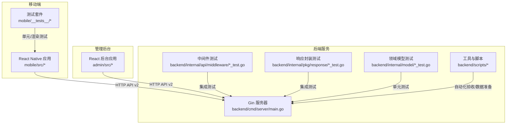
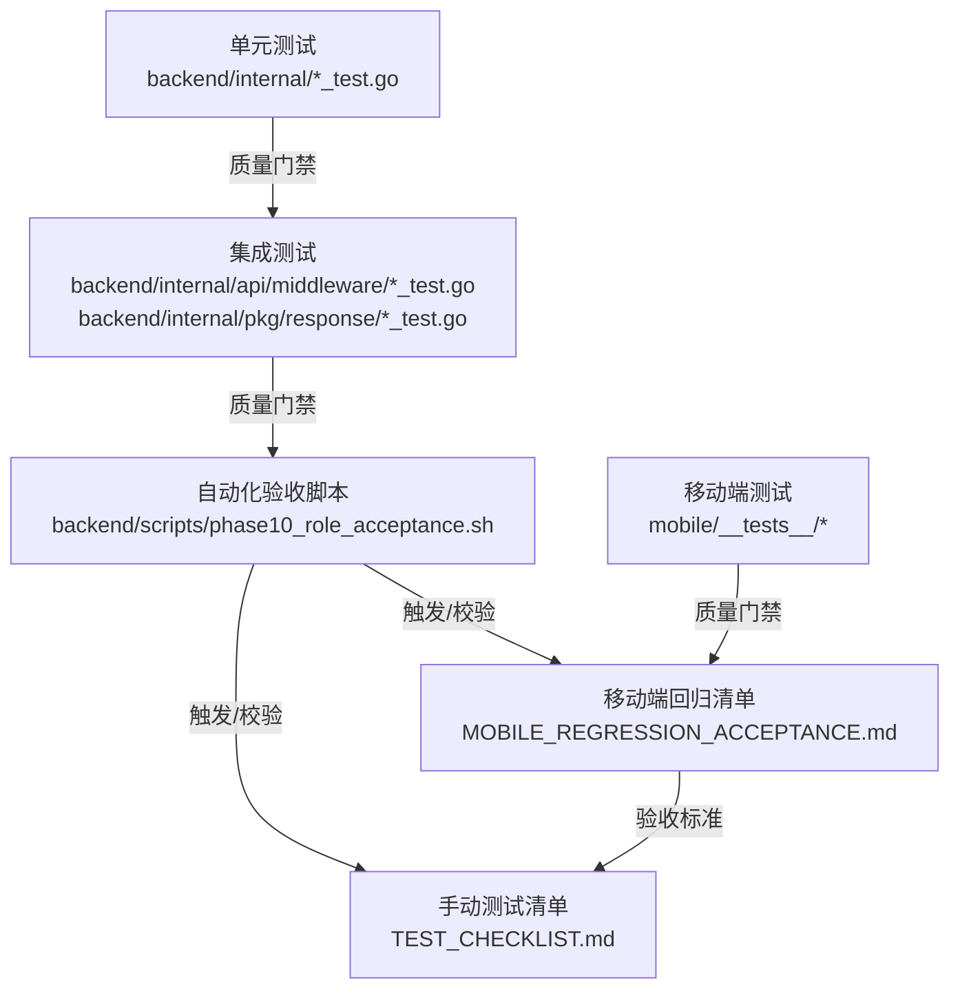
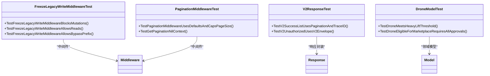
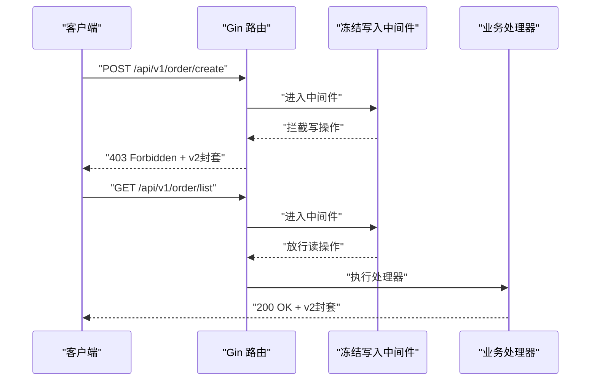
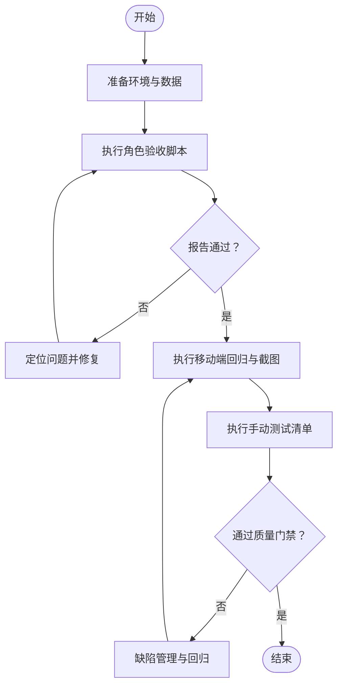
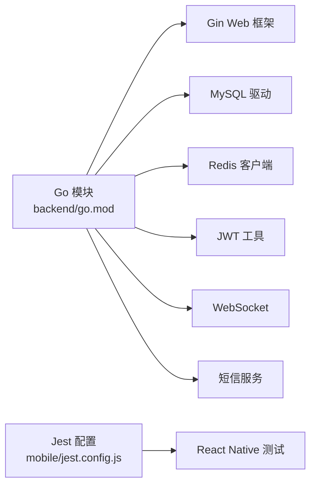

# 测试策略概述

<cite>
**本文引用的文件**
- [README.md](file://README.md)
- [TEST_CHECKLIST.md](file://TEST_CHECKLIST.md)
- [MOBILE_REGRESSION_ACCEPTANCE.md](file://MOBILE_REGRESSION_ACCEPTANCE.md)
- [ROLE_ACCEPTANCE_WALKTHROUGH.md](file://ROLE_ACCEPTANCE_WALKTHROUGH.md)
- [mobile/__tests__/App.test.tsx](file://mobile/__tests__/App.test.tsx)
- [mobile/jest.config.js](file://mobile/jest.config.js)
- [backend/internal/api/middleware/legacy_write_freeze_test.go](file://backend/internal/api/middleware/legacy_write_freeze_test.go)
- [backend/internal/api/middleware/pagination_test.go](file://backend/internal/api/middleware/pagination_test.go)
- [backend/internal/pkg/response/v2_test.go](file://backend/internal/pkg/response/v2_test.go)
- [backend/internal/model/drone_test.go](file://backend/internal/model/drone_test.go)
- [backend/go.mod](file://backend/go.mod)
- [backend/cmd/server/main.go](file://backend/cmd/server/main.go)
- [backend/cmd/seed_data/main.go](file://backend/cmd/seed_data/main.go)
- [backend/scripts/phase10_role_acceptance.sh](file://backend/scripts/phase10_role_acceptance.sh)
- [.github/workflows/build-android-apk.yml](file://.github/workflows/build-android-apk.yml)
</cite>

## 目录
1. [引言](#引言)
2. [项目结构](#项目结构)
3. [核心组件](#核心组件)
4. [架构总览](#架构总览)
5. [详细组件分析](#详细组件分析)
6. [依赖分析](#依赖分析)
7. [性能考虑](#性能考虑)
8. [故障排查指南](#故障排查指南)
9. [结论](#结论)
10. [附录](#附录)

## 引言
本文件面向无人机租赁平台测试团队，提供v2业务模型下的测试策略概述与实施指引。内容涵盖测试金字塔结构（单元测试、集成测试、端到端测试）、v2业务验收标准与自动化流程、手动测试与自动化测试协同方式、测试环境准备与数据管理、测试执行流程、覆盖率与质量门禁、缺陷管理流程，以及统一的测试方法论与最佳实践。

## 项目结构
平台由三部分组成：移动端（React Native）、管理后台（React）与后端（Go）。测试策略围绕三层应用与API进行设计，并辅以自动化脚本与验收文档支撑。

图表来源
- [backend/cmd/server/main.go:1-200](file://backend/cmd/server/main.go#L1-L200)
- [mobile/__tests__/App.test.tsx:1-14](file://mobile/__tests__/App.test.tsx#L1-L14)
- [backend/internal/api/middleware/legacy_write_freeze_test.go:1-82](file://backend/internal/api/middleware/legacy_write_freeze_test.go#L1-L82)
- [backend/internal/pkg/response/v2_test.go:1-80](file://backend/internal/pkg/response/v2_test.go#L1-L80)
- [backend/internal/model/drone_test.go:1-39](file://backend/internal/model/drone_test.go#L1-L39)
- [backend/scripts/phase10_role_acceptance.sh:1-200](file://backend/scripts/phase10_role_acceptance.sh#L1-L200)

章节来源
- [README.md:1-29](file://README.md#L1-L29)

## 核心组件
- 测试金字塔
  - 单元测试：覆盖后端中间件、响应封装、领域模型等基础构件，确保核心逻辑正确性与边界条件处理。
  - 集成测试：验证中间件与路由组合、API响应封装、分页与冻结写入策略等跨层行为。
  - 端到端测试：通过角色验收脚本与移动端回归清单，覆盖v2主业务链路与关键页面验收标准。
- v2业务验收
  - 自动化角色验收脚本驱动主链路验证，输出JSON报告；移动端回归清单定义关键页面验收标准与截图规范。
- 手动测试与自动化协同
  - 自动化负责稳定性与回归；手动测试负责体验与边界场景，二者共同保障质量门禁。

章节来源
- [TEST_CHECKLIST.md:1-448](file://TEST_CHECKLIST.md#L1-L448)
- [MOBILE_REGRESSION_ACCEPTANCE.md:1-337](file://MOBILE_REGRESSION_ACCEPTANCE.md#L1-L337)
- [ROLE_ACCEPTANCE_WALKTHROUGH.md:1-217](file://ROLE_ACCEPTANCE_WALKTHROUGH.md#L1-L217)

## 架构总览
v2测试体系以“自动化为主、手动为辅、以验收为准绳”的思路组织，贯穿前端、后端与API层。

图表来源
- [backend/scripts/phase10_role_acceptance.sh:1-200](file://backend/scripts/phase10_role_acceptance.sh#L1-L200)
- [MOBILE_REGRESSION_ACCEPTANCE.md:1-337](file://MOBILE_REGRESSION_ACCEPTANCE.md#L1-L337)
- [TEST_CHECKLIST.md:1-448](file://TEST_CHECKLIST.md#L1-L448)
- [backend/internal/api/middleware/legacy_write_freeze_test.go:1-82](file://backend/internal/api/middleware/legacy_write_freeze_test.go#L1-L82)
- [backend/internal/pkg/response/v2_test.go:1-80](file://backend/internal/pkg/response/v2_test.go#L1-L80)
- [mobile/__tests__/App.test.tsx:1-14](file://mobile/__tests__/App.test.tsx#L1-L14)

## 详细组件分析

### 单元测试层
- 中间件测试
  - 冻结旧版写入中间件：验证对写操作的拦截与读操作放行，支持可选绕过前缀。
  - 分页中间件：验证默认值、分页上限与参数边界处理。
- 响应封装测试
  - v2响应封装：验证成功列表响应携带分页元数据与trace_id透传，鉴权失败响应符合v2封套。
- 领域模型测试
  - 无人机模型：验证重型吊装阈值与市场准入条件（含可用性、证书与保险等状态）。

图表来源
- [backend/internal/api/middleware/legacy_write_freeze_test.go:1-82](file://backend/internal/api/middleware/legacy_write_freeze_test.go#L1-L82)
- [backend/internal/api/middleware/pagination_test.go:1-42](file://backend/internal/api/middleware/pagination_test.go#L1-L42)
- [backend/internal/pkg/response/v2_test.go:1-80](file://backend/internal/pkg/response/v2_test.go#L1-L80)
- [backend/internal/model/drone_test.go:1-39](file://backend/internal/model/drone_test.go#L1-L39)

章节来源
- [backend/internal/api/middleware/legacy_write_freeze_test.go:1-82](file://backend/internal/api/middleware/legacy_write_freeze_test.go#L1-L82)
- [backend/internal/api/middleware/pagination_test.go:1-42](file://backend/internal/api/middleware/pagination_test.go#L1-L42)
- [backend/internal/pkg/response/v2_test.go:1-80](file://backend/internal/pkg/response/v2_test.go#L1-L80)
- [backend/internal/model/drone_test.go:1-39](file://backend/internal/model/drone_test.go#L1-L39)

### 集成测试层
- 路由与中间件组合：验证分页与冻结写入在路由组中的生效与绕过策略。
- 响应封套：验证v2统一响应结构在不同状态码下的表现，确保trace_id与元数据一致性。
- 示例调用序列（以冻结写入为例）：

图表来源
- [backend/internal/api/middleware/legacy_write_freeze_test.go:12-43](file://backend/internal/api/middleware/legacy_write_freeze_test.go#L12-L43)

章节来源
- [backend/internal/api/middleware/legacy_write_freeze_test.go:1-82](file://backend/internal/api/middleware/legacy_write_freeze_test.go#L1-L82)
- [backend/internal/pkg/response/v2_test.go:1-80](file://backend/internal/pkg/response/v2_test.go#L1-L80)

### 端到端测试层
- 角色视角业务验收
  - 自动化脚本驱动客户、机主、飞手与复合身份四类角色主链路，输出JSON报告，包含状态机、编号一致性与入口可用性等验收要点。
- 移动端关键页面回归
  - 基于v2 API的主链路页面验收矩阵，明确页面对象边界、角色入口、状态与编号一致性、布局完整性等截图验收标准。
- 手动测试清单
  - 覆盖认证、无人机管理、飞手/业主模块、智能派单、订单执行、支付结算、信用评价、保险理赔、数据分析与空域管理等模块的手工验证步骤与预期结果。

图表来源
- [ROLE_ACCEPTANCE_WALKTHROUGH.md:110-127](file://ROLE_ACCEPTANCE_WALKTHROUGH.md#L110-L127)
- [MOBILE_REGRESSION_ACCEPTANCE.md:47-337](file://MOBILE_REGRESSION_ACCEPTANCE.md#L47-L337)
- [TEST_CHECKLIST.md:42-448](file://TEST_CHECKLIST.md#L42-L448)

章节来源
- [ROLE_ACCEPTANCE_WALKTHROUGH.md:1-217](file://ROLE_ACCEPTANCE_WALKTHROUGH.md#L1-L217)
- [MOBILE_REGRESSION_ACCEPTANCE.md:1-337](file://MOBILE_REGRESSION_ACCEPTANCE.md#L1-L337)
- [TEST_CHECKLIST.md:1-448](file://TEST_CHECKLIST.md#L1-L448)

### 测试环境准备与数据管理
- 环境启动
  - 后端服务：通过服务器命令启动。
  - 移动端预览与管理后台：通过前端工程启动。
- 数据准备
  - 自动化脚本可准备演示数据并执行角色验收。
  - 种子数据脚本用于初始化数据库。
- 访问地址
  - 移动端预览、管理后台与后端API的本地访问地址。

章节来源
- [TEST_CHECKLIST.md:42-61](file://TEST_CHECKLIST.md#L42-L61)
- [backend/cmd/server/main.go:1-200](file://backend/cmd/server/main.go#L1-L200)
- [backend/cmd/seed_data/main.go:1-200](file://backend/cmd/seed_data/main.go#L1-L200)
- [backend/scripts/phase10_role_acceptance.sh:1-200](file://backend/scripts/phase10_role_acceptance.sh#L1-L200)

### 测试执行流程
- 单元/集成测试
  - 通过Go测试框架与Jest（移动端）执行，确保核心逻辑与API封套正确。
- 自动化验收
  - 执行角色验收脚本，产出JSON报告；根据报告结果决定是否进入移动端回归与手动测试。
- 移动端回归
  - 按页面矩阵执行截图验收，关注对象边界、角色入口、状态与编号一致性、布局完整性。
- 手动测试
  - 按模块清单执行，覆盖认证、业务流程与异常场景。

章节来源
- [mobile/__tests__/App.test.tsx:1-14](file://mobile/__tests__/App.test.tsx#L1-L14)
- [mobile/jest.config.js:1-4](file://mobile/jest.config.js#L1-L4)
- [ROLE_ACCEPTANCE_WALKTHROUGH.md:110-127](file://ROLE_ACCEPTANCE_WALKTHROUGH.md#L110-L127)
- [MOBILE_REGRESSION_ACCEPTANCE.md:47-337](file://MOBILE_REGRESSION_ACCEPTANCE.md#L47-L337)
- [TEST_CHECKLIST.md:369-412](file://TEST_CHECKLIST.md#L369-L412)

## 依赖分析
- 后端依赖
  - Gin、MySQL、Redis、JWT、WebSocket、短信等外部库，构成API网关、持久化、缓存与消息通道的基础。
- 测试依赖
  - Go测试框架与Jest用于单元/集成测试；移动端测试配置采用React Native预设。

图表来源
- [backend/go.mod:1-80](file://backend/go.mod#L1-L80)
- [mobile/jest.config.js:1-4](file://mobile/jest.config.js#L1-L4)

章节来源
- [backend/go.mod:1-80](file://backend/go.mod#L1-L80)
- [mobile/jest.config.js:1-4](file://mobile/jest.config.js#L1-L4)

## 性能考虑
- 单元/集成测试应尽量避免外部依赖，必要时使用Mock或内存数据库，确保测试执行效率与可重复性。
- 移动端测试建议在设备模式下进行，减少真机成本并提升稳定性。
- 自动化验收脚本应具备幂等性与可重试机制，降低环境抖动影响。

## 故障排查指南
- 常见问题
  - 无法发送验证码：检查后端服务与Redis状态。
  - 登录后页面空白：检查浏览器控制台与API地址配置。
  - 接口返回401：检查Token有效性与Authorization头格式。
  - 数据库连接失败：检查MySQL容器与配置文件。
- 建议
  - 将问题分类记录至缺陷管理系统，追踪修复与回归验证。

章节来源
- [TEST_CHECKLIST.md:431-448](file://TEST_CHECKLIST.md#L431-L448)

## 结论
本测试策略以v2业务模型为核心，构建了“单元/集成测试+自动化验收+移动端回归+手动测试”的金字塔体系。通过角色验收脚本与移动端回归清单，确保主链路稳定与页面验收标准落地；通过单元/集成测试保障基础构件质量；通过缺陷管理闭环持续改进。建议在CI中集成单元/集成测试与自动化验收，移动端回归与手动测试作为质量门禁的补充手段。

## 附录
- 质量门禁建议
  - 单元/集成测试通过率不低于95%，分支覆盖率不低于80%。
  - 自动化验收脚本通过，移动端关键页面回归通过，手动测试无阻断缺陷。
- 缺陷管理流程
  - 提交缺陷 -> 分级评估 -> 修复排期 -> 回归验证 -> 关闭闭环。
- 最佳实践
  - 以验收为准绳编写测试，优先覆盖v2主链路与关键页面。
  - 保持测试数据最小化与可重复性，避免环境耦合。
  - 在CI中执行自动化验收与移动端回归，减少人工干预。