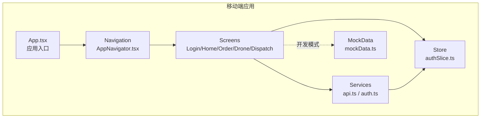
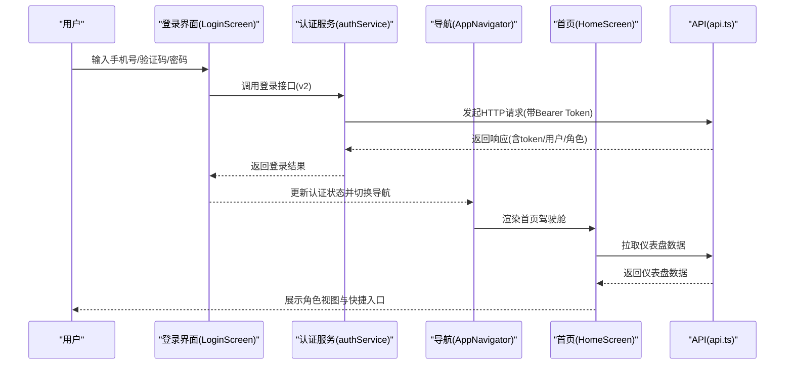
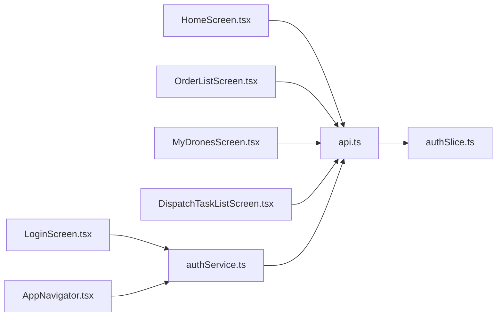

# 移动端测试标准

<cite>
**本文引用的文件**
- [MOBILE_REGRESSION_ACCEPTANCE.md](file://MOBILE_REGRESSION_ACCEPTANCE.md)
- [TEST_CHECKLIST.md](file://TEST_CHECKLIST.md)
- [mobile/__tests__/App.test.tsx](file://mobile/__tests__/App.test.tsx)
- [mobile/jest.config.js](file://mobile/jest.config.js)
- [mobile/package.json](file://mobile/package.json)
- [mobile/src/screens/auth/LoginScreen.tsx](file://mobile/src/screens/auth/LoginScreen.tsx)
- [mobile/src/services/auth.ts](file://mobile/src/services/auth.ts)
- [mobile/src/navigation/AppNavigator.tsx](file://mobile/src/navigation/AppNavigator.tsx)
- [mobile/src/store/slices/authSlice.ts](file://mobile/src/store/slices/authSlice.ts)
- [mobile/src/config/mockData.ts](file://mobile/src/config/mockData.ts)
- [mobile/src/screens/home/HomeScreen.tsx](file://mobile/src/screens/home/HomeScreen.tsx)
- [mobile/src/screens/order/OrderListScreen.tsx](file://mobile/src/screens/order/OrderListScreen.tsx)
- [mobile/src/screens/drone/MyDronesScreen.tsx](file://mobile/src/screens/drone/MyDronesScreen.tsx)
- [mobile/src/screens/dispatch/DispatchTaskListScreen.tsx](file://mobile/src/screens/dispatch/DispatchTaskListScreen.tsx)
- [mobile/src/services/api.ts](file://mobile/src/services/api.ts)
</cite>

## 目录
1. [引言](#引言)
2. [项目结构](#项目结构)
3. [核心组件](#核心组件)
4. [架构总览](#架构总览)
5. [详细组件分析](#详细组件分析)
6. [依赖分析](#依赖分析)
7. [性能考虑](#性能考虑)
8. [故障排查指南](#故障排查指南)
9. [结论](#结论)
10. [附录](#附录)

## 引言
本文件面向移动端测试工程师与质量保障团队，提供一套完整的移动端测试标准与验收流程，覆盖页面功能测试、交互流程测试、UI一致性测试，并给出移动端回归测试的执行标准、测试用例设计、截图对比与功能验证清单。文档结合项目现有测试基线与测试清单，围绕用户登录、无人机管理、订单执行、支付结算等核心功能，制定可落地的测试策略与操作指南。

## 项目结构
移动端工程位于 mobile 目录，采用 React Native + React Navigation + Redux Toolkit 架构，配合 v1/v2 双版本 API 客户端与主题化样式体系。测试相关目录与文件如下：
- 测试框架与配置：Jest + React Test Renderer
- 屏幕与导航：多模块页面（登录、首页、订单、无人机、派单等）
- 服务层：封装 axios 客户端与拦截器，支持 v1/v2 版本与鉴权刷新
- 状态管理：Redux Slice 管理认证状态与用户信息
- 配置与模拟数据：开发模式下的模拟数据与位置坐标

图表来源
- [mobile/src/navigation/AppNavigator.tsx:13-77](file://mobile/src/navigation/AppNavigator.tsx#L13-L77)
- [mobile/src/screens/auth/LoginScreen.tsx:45-160](file://mobile/src/screens/auth/LoginScreen.tsx#L45-L160)
- [mobile/src/screens/home/HomeScreen.tsx:264-380](file://mobile/src/screens/home/HomeScreen.tsx#L264-L380)
- [mobile/src/screens/order/OrderListScreen.tsx:151-240](file://mobile/src/screens/order/OrderListScreen.tsx#L151-L240)
- [mobile/src/screens/drone/MyDronesScreen.tsx:78-160](file://mobile/src/screens/drone/MyDronesScreen.tsx#L78-L160)
- [mobile/src/screens/dispatch/DispatchTaskListScreen.tsx:73-100](file://mobile/src/screens/dispatch/DispatchTaskListScreen.tsx#L73-L100)
- [mobile/src/services/api.ts:6-30](file://mobile/src/services/api.ts#L6-L30)
- [mobile/src/store/slices/authSlice.ts:22-61](file://mobile/src/store/slices/authSlice.ts#L22-L61)
- [mobile/src/config/mockData.ts:1-204](file://mobile/src/config/mockData.ts#L1-L204)

章节来源
- [mobile/package.json:1-63](file://mobile/package.json#L1-L63)
- [mobile/jest.config.js:1-4](file://mobile/jest.config.js#L1-L4)

## 核心组件
- 登录与认证
  - 登录界面支持验证码登录与密码登录，内置开发模式快速登录与账号选择弹窗。
  - 认证服务封装 v1/v2 登录、注册、刷新与退出接口。
  - 导航器根据认证状态切换认证/主流程。
- 首页驾驶舱
  - 根据角色（客户/机主/飞手/综合）渲染不同的仪表盘内容与快捷入口。
- 订单与派单
  - 订单列表按角色与状态聚合展示，派单任务列表仅展示正式派单对象。
- 无人机管理
  - 机主可查看与管理无人机，包含状态变更与资质状态展示。
- API 与拦截器
  - 统一注入 Authorization 头，处理 v1/v2 成功码校验与 401 刷新令牌。
- 测试框架
  - Jest + React Test Renderer，基础渲染测试覆盖。

章节来源
- [mobile/src/screens/auth/LoginScreen.tsx:45-160](file://mobile/src/screens/auth/LoginScreen.tsx#L45-L160)
- [mobile/src/services/auth.ts:10-44](file://mobile/src/services/auth.ts#L10-L44)
- [mobile/src/navigation/AppNavigator.tsx:13-77](file://mobile/src/navigation/AppNavigator.tsx#L13-L77)
- [mobile/src/screens/home/HomeScreen.tsx:264-380](file://mobile/src/screens/home/HomeScreen.tsx#L264-L380)
- [mobile/src/screens/order/OrderListScreen.tsx:151-240](file://mobile/src/screens/order/OrderListScreen.tsx#L151-L240)
- [mobile/src/screens/drone/MyDronesScreen.tsx:78-160](file://mobile/src/screens/drone/MyDronesScreen.tsx#L78-L160)
- [mobile/src/screens/dispatch/DispatchTaskListScreen.tsx:73-100](file://mobile/src/screens/dispatch/DispatchTaskListScreen.tsx#L73-L100)
- [mobile/src/services/api.ts:66-147](file://mobile/src/services/api.ts#L66-L147)
- [mobile/__tests__/App.test.tsx:9-13](file://mobile/__tests__/App.test.tsx#L9-L13)

## 架构总览
移动端测试关注的端到端路径包括：用户登录 → 导航切换 → 页面渲染 → API 请求 → 状态更新 → UI 呈现。认证状态贯穿整个流程，API 层负责版本兼容与鉴权刷新，服务层封装业务接口，屏幕组件负责数据展示与交互。

图表来源
- [mobile/src/screens/auth/LoginScreen.tsx:111-134](file://mobile/src/screens/auth/LoginScreen.tsx#L111-L134)
- [mobile/src/services/auth.ts:21-26](file://mobile/src/services/auth.ts#L21-L26)
- [mobile/src/navigation/AppNavigator.tsx:13-77](file://mobile/src/navigation/AppNavigator.tsx#L13-L77)
- [mobile/src/screens/home/HomeScreen.tsx:347-366](file://mobile/src/screens/home/HomeScreen.tsx#L347-L366)
- [mobile/src/services/api.ts:18-30](file://mobile/src/services/api.ts#L18-L30)

## 详细组件分析

### 登录与认证测试要点
- 功能测试
  - 验证手机号格式校验、验证码发送倒计时、登录按钮禁用状态。
  - 验证验证码登录与密码登录两种模式。
  - 验证开发模式快速登录与账号选择弹窗。
- 交互测试
  - 登录成功后跳转首页，认证状态持久化。
  - 401 时触发令牌刷新或登出。
- UI 一致性
  - 输入框占位符颜色、按钮禁用态、错误提示样式一致。
- 截图验收
  - 登录页、验证码倒计时、快速登录弹窗、错误提示等关键状态截图。

章节来源
- [mobile/src/screens/auth/LoginScreen.tsx:91-134](file://mobile/src/screens/auth/LoginScreen.tsx#L91-L134)
- [mobile/src/services/auth.ts:21-26](file://mobile/src/services/auth.ts#L21-L26)
- [mobile/src/services/api.ts:82-140](file://mobile/src/services/api.ts#L82-L140)

### 首页驾驶舱测试要点
- 功能测试
  - 角色切换（综合/客户/机主/飞手）后，仪表盘内容与快捷入口正确。
  - 指标卡片、待办任务、市场动态随视图切换。
- 交互测试
  - 快捷入口跳转至对应页面（发布需求、浏览供给、查看订单等）。
- UI 一致性
  - 指标值、状态标签、图标色调一致。
- 截图验收
  - 综合视图、机主视图、飞手视图各一张。

章节来源
- [mobile/src/screens/home/HomeScreen.tsx:264-380](file://mobile/src/screens/home/HomeScreen.tsx#L264-L380)

### 订单列表测试要点
- 功能测试
  - 按角色（全部/客户/机主/飞手）与状态（全部/待处理/进行中/已完成）筛选。
  - 合并多角色返回的相同订单，按更新时间排序。
- 交互测试
  - 点击订单卡片跳转详情，详情页展示来源、承接方、执行方、财务摘要等。
- UI 一致性
  - 订单编号、状态、金额、时间线一致。
- 截图验收
  - 列表页、详情页各一张。

章节来源
- [mobile/src/screens/order/OrderListScreen.tsx:151-240](file://mobile/src/screens/order/OrderListScreen.tsx#L151-L240)

### 无人机管理测试要点
- 功能测试
  - 机主查看无人机列表，状态分组（全部/可用/忙碌/维护中/不可用）。
  - 更改无人机可用状态、查看执行中订单、进入设备详情/编辑/资质管理。
- 交互测试
  - 状态变更弹窗、Alert 提示、导航跳转。
- UI 一致性
  - 资质状态徽章颜色与文案一致。
- 截图验收
  - 列表页、设备详情、资质管理页各一张。

章节来源
- [mobile/src/screens/drone/MyDronesScreen.tsx:78-160](file://mobile/src/screens/drone/MyDronesScreen.tsx#L78-L160)

### 正式派单列表测试要点
- 功能测试
  - 按状态（全部/待响应/已接单/执行中/已结束）筛选。
  - 派单来源、目标飞手、订单状态、重派次数、金额与时间展示。
- 交互测试
  - 点击派单卡片跳转详情。
- UI 一致性
  - 派单编号、状态、路由信息一致。
- 截图验收
  - 列表页、详情页各一张。

章节来源
- [mobile/src/screens/dispatch/DispatchTaskListScreen.tsx:73-100](file://mobile/src/screens/dispatch/DispatchTaskListScreen.tsx#L73-L100)

### API 与拦截器测试要点
- 功能测试
  - v1/v2 成功码校验、401 自动刷新令牌、并发请求排队。
  - 请求头注入 Authorization: Bearer token。
- 性能与稳定性
  - 超时控制、重试策略（由调用方控制）、错误消息透传。
- 截图验收
  - 无 UI，侧重接口行为与日志。

章节来源
- [mobile/src/services/api.ts:66-147](file://mobile/src/services/api.ts#L66-L147)

### 测试框架与自动化
- 测试框架
  - Jest + React Test Renderer，基础渲染测试覆盖应用根组件。
- 测试配置
  - 预设 react-native，便于移动端组件测试。
- 建议
  - 逐步扩展到屏幕级快照测试与交互测试（需补充测试用例与模拟数据）。

章节来源
- [mobile/__tests__/App.test.tsx:9-13](file://mobile/__tests__/App.test.tsx#L9-L13)
- [mobile/jest.config.js:1-4](file://mobile/jest.config.js#L1-L4)
- [mobile/package.json:12-12](file://mobile/package.json#L12-L12)

## 依赖分析
移动端测试涉及的关键依赖关系如下：

图表来源
- [mobile/src/screens/auth/LoginScreen.tsx:18-22](file://mobile/src/screens/auth/LoginScreen.tsx#L18-L22)
- [mobile/src/services/auth.ts:1-8](file://mobile/src/services/auth.ts#L1-L8)
- [mobile/src/navigation/AppNavigator.tsx:6-9](file://mobile/src/navigation/AppNavigator.tsx#L6-L9)
- [mobile/src/screens/home/HomeScreen.tsx:34-36](file://mobile/src/screens/home/HomeScreen.tsx#L34-L36)
- [mobile/src/screens/order/OrderListScreen.tsx:20-22](file://mobile/src/screens/order/OrderListScreen.tsx#L20-L22)
- [mobile/src/screens/drone/MyDronesScreen.tsx:16-18](file://mobile/src/screens/drone/MyDronesScreen.tsx#L16-L18)
- [mobile/src/screens/dispatch/DispatchTaskListScreen.tsx:19-21](file://mobile/src/screens/dispatch/DispatchTaskListScreen.tsx#L19-L21)
- [mobile/src/services/api.ts:1-5](file://mobile/src/services/api.ts#L1-L5)
- [mobile/src/store/slices/authSlice.ts:22-61](file://mobile/src/store/slices/authSlice.ts#L22-L61)

章节来源
- [mobile/src/services/api.ts:1-155](file://mobile/src/services/api.ts#L1-L155)

## 性能考虑
- 首屏加载
  - 首页驾驶舱与订单列表使用分页与合并策略，避免重复请求与数据冗余。
- 网络请求
  - 统一超时与错误处理，401 自动刷新令牌，减少用户感知的失败。
- UI 渲染
  - 列表使用 FlatList，卡片组件复用，减少不必要的重绘。
- 开发体验
  - 开发模式模拟数据与默认位置，提升本地调试效率。

## 故障排查指南
- 登录失败
  - 检查手机号格式、验证码发送与接收、后端服务连通性。
- 401 未授权
  - 检查刷新令牌流程、Authorization 头是否正确注入。
- 页面空白或渲染异常
  - 检查 Redux 状态初始化、导航切换逻辑。
- 截图验收不通过
  - 对照验收标准逐项检查：标题可见性、底部操作区、卡片完整性、状态文案一致性。

章节来源
- [TEST_CHECKLIST.md:431-448](file://TEST_CHECKLIST.md#L431-L448)
- [mobile/src/services/api.ts:82-140](file://mobile/src/services/api.ts#L82-L140)

## 结论
本文档基于现有测试基线与清单，建立了移动端测试的标准流程与验收规范，覆盖登录、无人机管理、订单执行、派单等核心功能。建议在持续集成中引入自动化测试与截图对比，结合回归矩阵与验收标准，确保迭代质量与用户体验的一致性。

## 附录

### 移动端回归与截图验收标准（节选）
- 验收重点
  - 页面对象边界正确、角色入口正确、状态/编号/来源标签一致、布局无截断/溢出/错位。
- 截图统一标准
  - 顶部标题完整可见、底部主操作区完整可见、卡片圆角/阴影/边距一致、编号/状态/来源标签/主金额/主动作可见。
- 关键页面回归矩阵
  - 首页驾驶舱、供给市场、需求市场、订单列表/详情、正式派单列表/详情、飞行监控、飞行记录、我的页等。
- 截图命名建议
  - home-composite-YYYYMMDD.png、market-supplies-YYYYMMDD.png、order-detail-YYYYMMDD.png 等。

章节来源
- [MOBILE_REGRESSION_ACCEPTANCE.md:7-46](file://MOBILE_REGRESSION_ACCEPTANCE.md#L7-L46)
- [MOBILE_REGRESSION_ACCEPTANCE.md:49-337](file://MOBILE_REGRESSION_ACCEPTANCE.md#L49-L337)

### 测试环境与数据准备
- 启动服务
  - 后端服务、移动端预览、管理后台。
- 访问地址
  - 移动端预览、管理后台、后端 API。
- 测试数据
  - 预置账号、无人机数据，开发模式模拟数据与默认位置。

章节来源
- [TEST_CHECKLIST.md:42-60](file://TEST_CHECKLIST.md#L42-L60)
- [TEST_CHECKLIST.md:416-429](file://TEST_CHECKLIST.md#L416-L429)
- [mobile/src/config/mockData.ts:1-204](file://mobile/src/config/mockData.ts#L1-L204)

### 测试场景与验收标准（示例）
- 用户登录
  - 验证手机号登录、验证码登录、快速登录、错误提示。
- 无人机管理
  - 验证列表分组、状态变更、资质徽章、详情/编辑/认证入口。
- 订单执行
  - 验证订单列表筛选、状态分组、详情页信息、来源标签一致性。
- 支付结算
  - 验证订单支付流程、钱包与提现入口（参考清单）。

章节来源
- [TEST_CHECKLIST.md:63-111](file://TEST_CHECKLIST.md#L63-L111)
- [TEST_CHECKLIST.md:83-111](file://TEST_CHECKLIST.md#L83-L111)
- [TEST_CHECKLIST.md:198-218](file://TEST_CHECKLIST.md#L198-L218)
- [TEST_CHECKLIST.md:221-246](file://TEST_CHECKLIST.md#L221-L246)