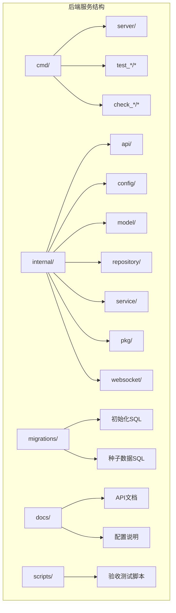
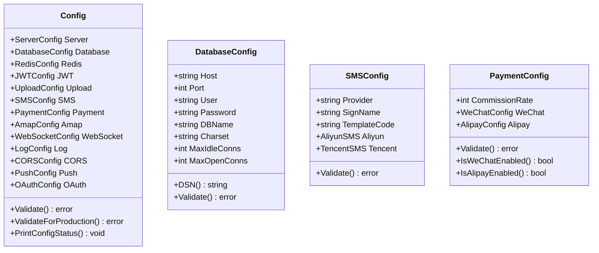
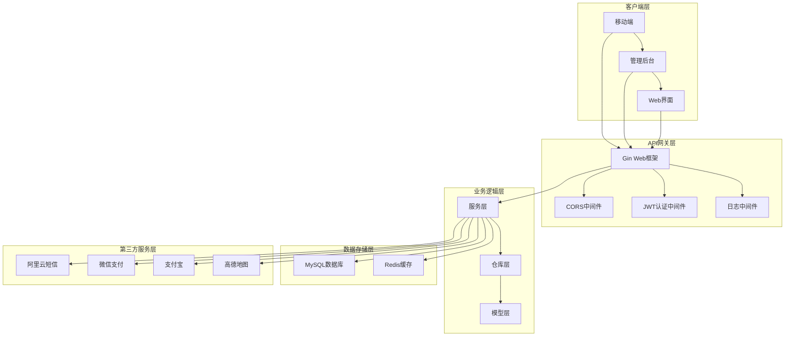
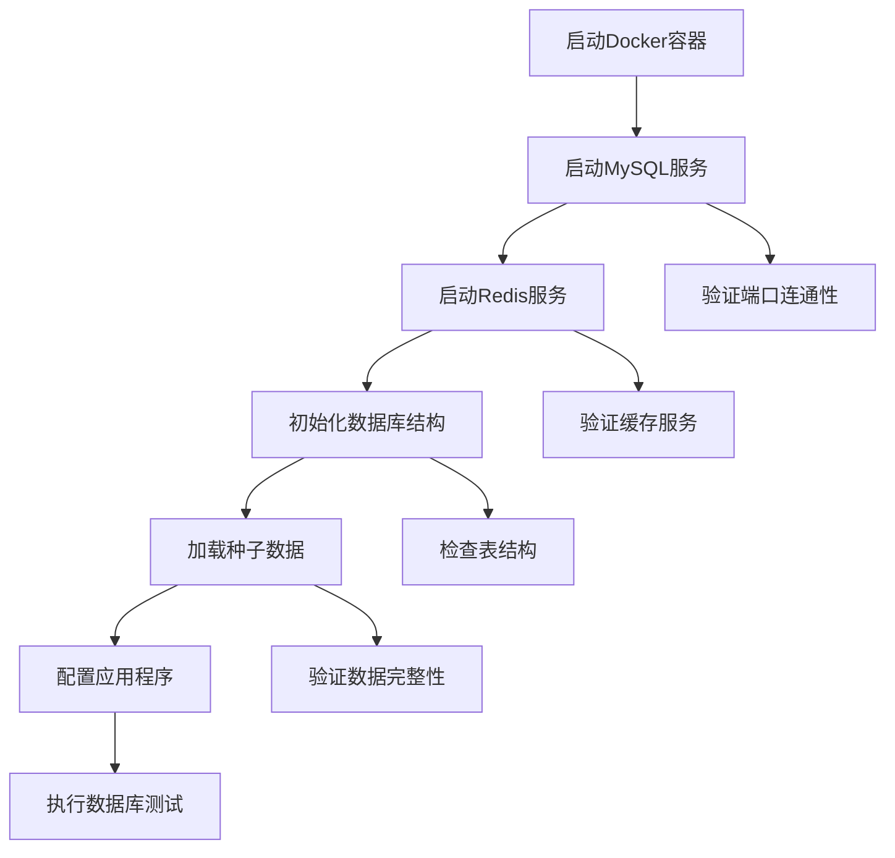
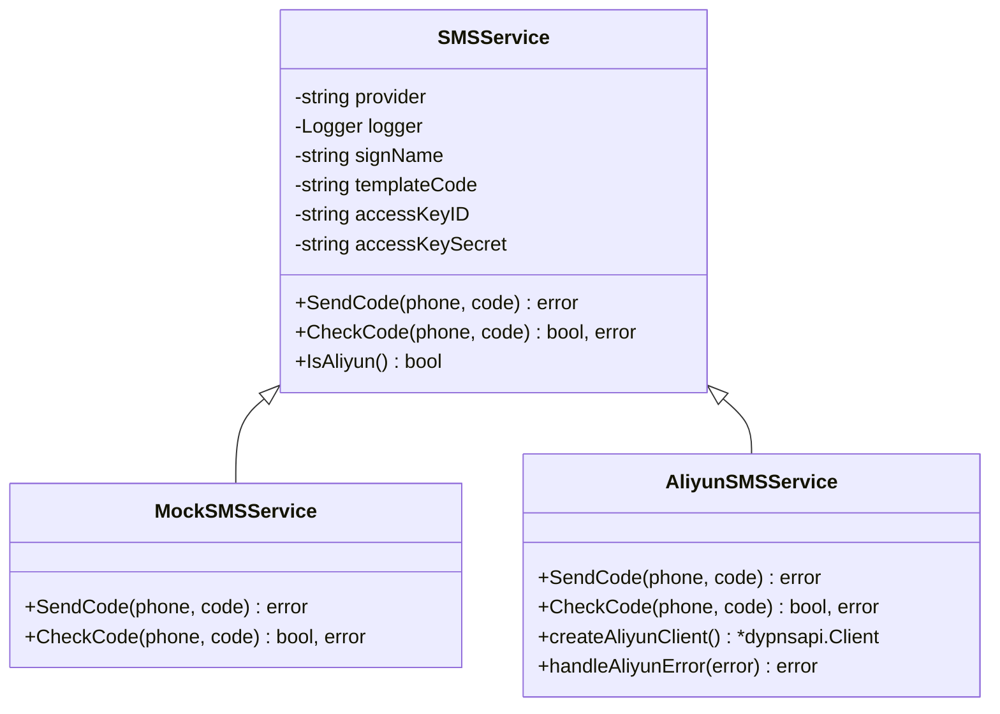
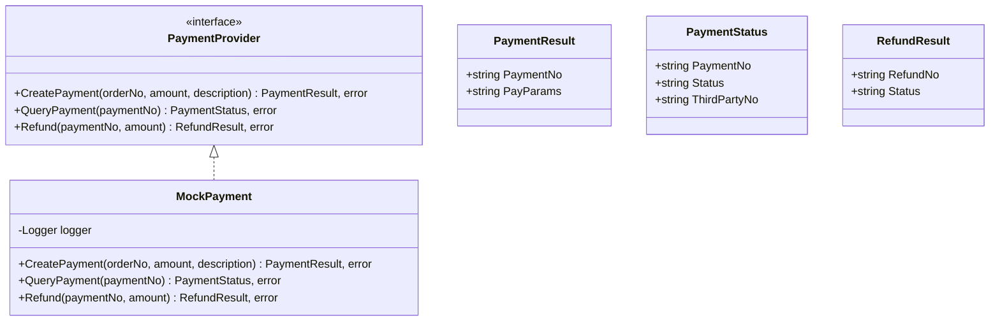
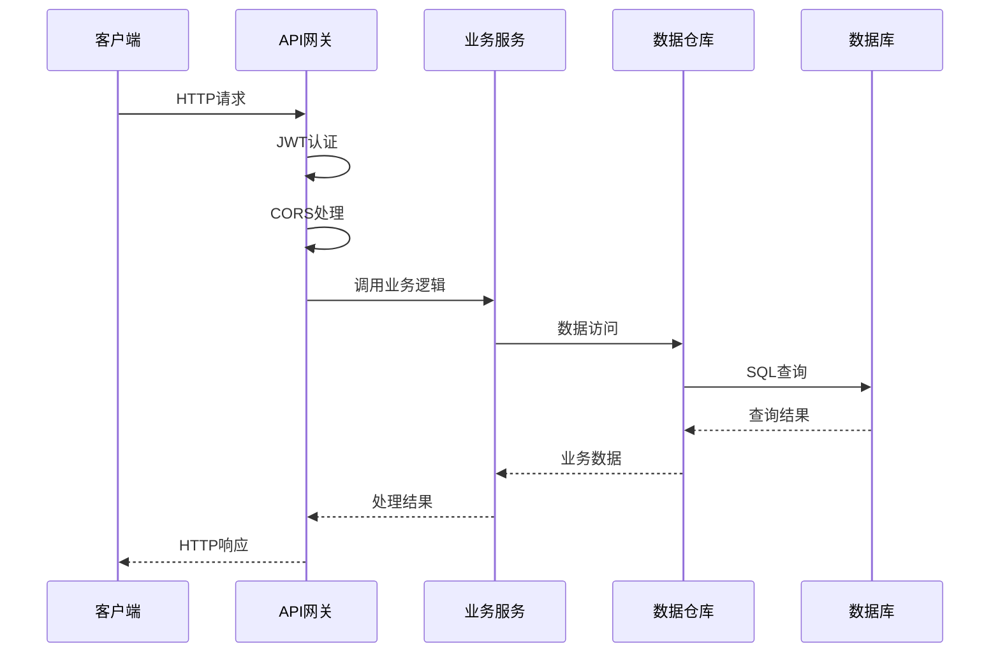
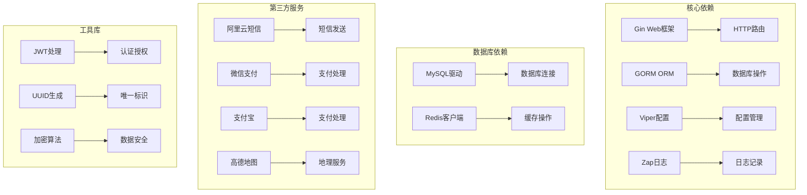

# 集成测试方案

<cite>
**本文档引用的文件**
- [go.mod](file://backend/go.mod)
- [config.example.yaml](file://backend/config.example.yaml)
- [config.go](file://backend/internal/config/config.go)
- [models.go](file://backend/internal/model/models.go)
- [address_repo.go](file://backend/internal/repository/address_repo.go)
- [address_service.go](file://backend/internal/service/address_service.go)
- [order_repo_test.go](file://backend/internal/repository/order_repo_test.go)
- [order_service_test.go](file://backend/internal/service/order_service_test.go)
- [legacy_write_freeze_test.go](file://backend/internal/api/middleware/legacy_write_freeze_test.go)
- [sms.go](file://backend/internal/pkg/sms/sms.go)
- [payment.go](file://backend/internal/pkg/payment/payment.go)
- [testmessage/main.go](file://backend/cmd/testmessage/main.go)
- [check/main.go](file://backend/cmd/check/main.go)
- [check_consistency/main.go](file://backend/cmd/check_consistency/main.go)
- [seed/main.go](file://backend/cmd/seed/main.go)
- [phase10_role_acceptance.sh](file://backend/scripts/phase10_role_acceptance.sh)
- [docker-compose.yml](file://docker/docker-compose.yml)
- [阿里云短信配置说明.md](file://backend/docs/阿里云短信配置说明.md)
</cite>

## 目录
1. [简介](#简介)
2. [项目结构](#项目结构)
3. [核心组件](#核心组件)
4. [架构概览](#架构概览)
5. [详细组件分析](#详细组件分析)
6. [依赖关系分析](#依赖关系分析)
7. [性能考虑](#性能考虑)
8. [故障排除指南](#故障排除指南)
9. [结论](#结论)
10. [附录](#附录)

## 简介

本集成测试方案旨在为无人机租赁平台后端服务提供完整的测试实施指南。该方案涵盖了数据库连接测试、第三方服务集成测试、API接口连通性测试等关键测试场景，为测试团队提供了从环境搭建到测试执行的全流程指导。

本项目采用Go语言开发，基于Gin框架构建RESTful API服务，集成了MySQL数据库、Redis缓存、短信服务、支付接口等多个外部服务。测试方案重点关注服务间的集成测试，确保各组件协同工作的可靠性。

## 项目结构

后端项目采用模块化架构设计，主要包含以下核心目录：



**图表来源**
- [go.mod:1-80](file://backend/go.mod#L1-L80)
- [config.example.yaml:1-338](file://backend/config.example.yaml#L1-L338)

项目采用分层架构模式：
- **cmd层**：命令行工具和入口程序
- **internal层**：核心业务逻辑，包含API、配置、模型、仓库、服务、包和WebSocket模块
- **migrations层**：数据库迁移脚本
- **docs层**：项目文档
- **scripts层**：自动化脚本

**章节来源**
- [go.mod:1-80](file://backend/go.mod#L1-L80)
- [config.example.yaml:1-338](file://backend/config.example.yaml#L1-L338)

## 核心组件

### 配置管理系统

配置系统采用Viper库实现，支持YAML配置文件和环境变量覆盖。主要配置类别包括：



**图表来源**
- [config.go:16-31](file://backend/internal/config/config.go#L16-L31)
- [config.go:61-95](file://backend/internal/config/config.go#L61-L95)
- [config.go:193-242](file://backend/internal/config/config.go#L193-L242)
- [config.go:248-290](file://backend/internal/config/config.go#L248-L290)

### 数据模型层

系统采用GORM ORM框架，定义了完整的业务模型：

```mermaid
erDiagram
USERS {
int64 id PK
string phone UK
string password_hash
string nickname
string avatar_url
string user_type
string id_verified
int credit_score
string status
string wechat_open_id
string wechat_union_id
string qq_open_id
datetime created_at
datetime updated_at
datetime deleted_at
}
DRONES {
int64 id PK
int64 owner_id FK
string brand
string model
string serial_number UK
decimal mtow_kg
decimal max_payload_kg
decimal max_load
int max_flight_time
decimal max_distance
json features
json images
string certification_status
string insurance_policy_no
string insurance_company
int64 insurance_coverage
datetime insurance_expire_date
string insurance_doc
string insurance_verified
string airworthiness_cert_no
datetime airworthiness_cert_expire
string airworthiness_cert_doc
string airworthiness_verified
datetime last_maintenance_date
datetime next_maintenance_date
json maintenance_records
datetime created_at
datetime updated_at
datetime deleted_at
}
ORDERS {
int64 id PK
string order_no UK
string order_type
int64 related_id
string order_source
int64 demand_id FK
int64 source_supply_id
int64 drone_id FK
int64 owner_id FK
int64 pilot_id FK
int64 renter_id FK
int64 client_id FK
int64 client_user_id FK
int64 provider_user_id FK
int64 drone_owner_user_id FK
int64 executor_pilot_user_id FK
int64 dispatch_task_id
bool needs_dispatch
string execution_mode
string title
string service_type
datetime start_time
datetime end_time
decimal service_latitude
decimal service_longitude
string service_address
decimal dest_latitude
decimal dest_longitude
string dest_address
int64 total_amount
decimal platform_commission_rate
int64 platform_commission
int64 owner_amount
int64 deposit_amount
string status
datetime flight_start_time
datetime flight_end_time
string airspace_status
datetime loading_confirmed_at
int64 loading_confirmed_by
datetime unloading_confirmed_at
int64 unloading_confirmed_by
int actual_flight_distance
int actual_flight_duration
int max_altitude
int avg_speed
int64 trajectory_id
datetime provider_confirmed_at
datetime provider_rejected_at
string provider_reject_reason
datetime paid_at
datetime completed_at
string cancel_reason
string cancel_by
datetime created_at
datetime updated_at
datetime deleted_at
}
PAYMENTS {
int64 id PK
string payment_no UK
int64 order_id FK
int64 user_id FK
string payment_type
string payment_method
int64 amount
string status
string third_party_no
datetime paid_at
datetime created_at
datetime updated_at
}
USERS ||--o{ DRONES : owns
DRONES ||--o{ ORDERS : operates
ORDERS ||--o{ PAYMENTS : generates
```



**图表来源**
- [models.go:9-26](file://backend/internal/model/models.go#L9-L26)
- [models.go:91-148](file://backend/internal/model/models.go#L91-L148)
- [models.go:413-484](file://backend/internal/model/models.go#L413-L484)
- [models.go:515-532](file://backend/internal/model/models.go#L515-L532)

**章节来源**
- [config.go:1-521](file://backend/internal/config/config.go#L1-L521)
- [models.go:1-800](file://backend/internal/model/models.go#L1-L800)

## 架构概览

系统采用微服务架构，主要组件包括：



**图表来源**
- [config.go:17-31](file://backend/internal/config/config.go#L17-L31)
- [go.mod:5-21](file://backend/go.mod#L5-L21)

系统架构特点：
- **分层清晰**：API层、服务层、仓库层职责明确
- **配置驱动**：通过配置文件管理各种服务配置
- **插件化设计**：短信、支付等第三方服务可插拔
- **中间件模式**：统一处理跨域、认证、日志等功能

## 详细组件分析

### 数据库连接测试

数据库连接测试是集成测试的基础，主要验证MySQL连接的稳定性和数据完整性。

#### 测试环境搭建



**图表来源**
- [docker-compose.yml:1-27](file://docker/docker-compose.yml#L1-L27)
- [check/main.go:19-51](file://backend/cmd/check/main.go#L19-L51)

#### 数据库连接测试场景

1. **基本连接测试**
   - 验证DSN配置正确性
   - 测试连接超时设置
   - 检查字符集配置

2. **数据完整性测试**
   - 验证表结构完整性
   - 检查索引和约束
   - 测试数据一致性

3. **并发连接测试**
   - 多线程连接测试
   - 连接池管理测试
   - 资源清理测试

**章节来源**
- [check/main.go:1-51](file://backend/cmd/check/main.go#L1-L51)
- [check_consistency/main.go:1-55](file://backend/cmd/check_consistency/main.go#L1-L55)
- [seed/main.go:1-59](file://backend/cmd/seed/main.go#L1-L59)

### 短信服务集成测试

短信服务支持多种提供商，包括阿里云、腾讯云和Mock模式。

#### 短信服务架构



**图表来源**
- [sms.go:16-30](file://backend/internal/pkg/sms/sms.go#L16-L30)
- [sms.go:45-74](file://backend/internal/pkg/sms/sms.go#L45-L74)

#### 短信服务测试场景

1. **Mock模式测试**
   - 验证日志输出
   - 检查验证码生成
   - 测试错误处理

2. **阿里云模式测试**
   - 验证API密钥配置
   - 测试短信发送
   - 检查验证码校验
   - 处理API错误

3. **配置验证测试**
   - 验证配置文件加载
   - 检查必填字段
   - 测试配置热更新

**章节来源**
- [sms.go:1-154](file://backend/internal/pkg/sms/sms.go#L1-L154)
- [阿里云短信配置说明.md:1-126](file://backend/docs/阿里云短信配置说明.md#L1-L126)

### 支付接口集成测试

支付系统支持多种支付方式，包括微信支付、支付宝和Mock支付。

#### 支付服务架构



**图表来源**
- [payment.go:11-15](file://backend/internal/pkg/payment/payment.go#L11-L15)
- [payment.go:17-31](file://backend/internal/pkg/payment/payment.go#L17-L31)

#### 支付测试场景

1. **Mock支付测试**
   - 验证支付单号生成
   - 测试支付状态查询
   - 检查退款处理

2. **支付流程测试**
   - 创建支付订单
   - 处理支付回调
   - 验证支付状态
   - 处理退款流程

3. **错误处理测试**
   - 网络异常处理
   - 支付失败重试
   - 数据库事务回滚

**章节来源**
- [payment.go:1-78](file://backend/internal/pkg/payment/payment.go#L1-L78)

### API接口连通性测试

API测试涵盖所有主要业务接口，包括用户管理、订单处理、支付结算等。

#### API测试策略



**图表来源**
- [config.go:17-31](file://backend/internal/config/config.go#L17-L31)

#### API测试场景

1. **用户认证测试**
   - 登录接口测试
   - JWT令牌验证
   - 权限控制测试

2. **订单管理测试**
   - 订单创建流程
   - 订单状态变更
   - 订单查询接口

3. **地址管理测试**
   - 地址增删改查
   - 默认地址设置
   - 地址数量限制

**章节来源**
- [address_repo.go:1-60](file://backend/internal/repository/address_repo.go#L1-L60)
- [address_service.go:1-63](file://backend/internal/service/address_service.go#L1-L63)

## 依赖关系分析

系统依赖关系复杂，涉及多个外部服务和内部模块。



**图表来源**
- [go.mod:5-21](file://backend/go.mod#L5-L21)

### 外部依赖分析

系统主要依赖包括：

1. **Web框架依赖**
   - Gin: HTTP框架，提供路由和中间件支持
   - Gin-CORS: 跨域处理中间件

2. **数据库依赖**
   - GORM: ORM框架，提供数据库抽象层
   - MySQL驱动: 数据库连接驱动

3. **缓存依赖**
   - Redis客户端: 提供缓存和会话存储

4. **第三方服务依赖**
   - 阿里云短信: 短信发送服务
   - 微信支付: 支付处理
   - 支付宝: 支付处理

**章节来源**
- [go.mod:1-80](file://backend/go.mod#L1-L80)

## 性能考虑

集成测试需要考虑系统的性能表现，特别是在高并发场景下的稳定性。

### 性能测试指标

1. **响应时间**
   - API平均响应时间
   - 数据库查询延迟
   - 缓存命中率

2. **吞吐量**
   - QPS（每秒查询数）
   - 并发连接数
   - 内存使用情况

3. **资源利用率**
   - CPU使用率
   - 内存占用
   - 磁盘I/O

### 性能优化建议

1. **数据库优化**
   - 合理使用索引
   - 优化SQL查询
   - 连接池配置

2. **缓存策略**
   - Redis缓存热点数据
   - 合理设置过期时间
   - 缓存失效策略

3. **API优化**
   - 请求限流
   - 响应压缩
   - 异步处理

## 故障排除指南

### 常见问题及解决方案

#### 数据库连接问题

1. **连接超时**
   - 检查网络连通性
   - 验证防火墙设置
   - 调整连接超时参数

2. **认证失败**
   - 验证用户名密码
   - 检查用户权限
   - 确认字符集配置

3. **连接池耗尽**
   - 增加最大连接数
   - 优化查询性能
   - 及时释放连接

#### 短信服务问题

1. **短信发送失败**
   - 检查API密钥配置
   - 验证签名和模板
   - 查看错误日志

2. **验证码校验失败**
   - 确认验证码时效性
   - 检查存储介质
   - 验证校验逻辑

#### 支付接口问题

1. **支付回调异常**
   - 验证回调地址配置
   - 检查签名验证
   - 确认异步处理

2. **退款处理失败**
   - 验证退款参数
   - 检查账户余额
   - 查看第三方返回

**章节来源**
- [config.go:466-489](file://backend/internal/config/config.go#L466-L489)
- [sms.go:122-143](file://backend/internal/pkg/sms/sms.go#L122-L143)

## 结论

本集成测试方案为无人机租赁平台提供了全面的服务间集成测试指导。通过数据库连接测试、第三方服务集成测试、API接口连通性测试等多维度的测试策略，确保了系统的稳定性和可靠性。

关键要点包括：
- **配置驱动**：通过配置文件管理各种服务配置，便于测试环境切换
- **模块化设计**：清晰的分层架构便于单元测试和集成测试
- **插件化服务**：第三方服务可插拔，便于模拟和替换
- **自动化脚本**：提供完整的自动化测试脚本和工具

建议测试团队按照本方案逐步实施，重点关注服务间的依赖关系和数据一致性，确保系统在各种场景下的稳定运行。

## 附录

### 测试环境配置

#### Docker环境配置

```yaml
version: '3.8'
services:
  mysql:
    image: mysql:8.0
    container_name: wurenji-mysql
    environment:
      MYSQL_ROOT_PASSWORD: root
      MYSQL_DATABASE: wurenji
    ports:
      - "3306:3306"
    volumes:
      - mysql_data:/var/lib/mysql
      - ../backend/migrations/001_init_schema.sql:/docker-entrypoint-initdb.d/init.sql
    command: --default-authentication-plugin=mysql_native_password --character-set-server=utf8mb4 --collation-server=utf8mb4_unicode_ci

  redis:
    image: redis:7-alpine
    container_name: wurenji-redis
    ports:
      - "6379:6379"
    volumes:
      - redis_data:/data

volumes:
  mysql_data:
  redis_data:
```

#### 配置文件示例

```yaml
# 服务器配置
server:
  port: 8080
  mode: debug

# 数据库配置
database:
  host: 127.0.0.1
  port: 3306
  user: root
  password: root
  dbname: wurenji
  max_idle_conns: 10
  max_open_conns: 100

# Redis配置
redis:
  host: 127.0.0.1
  port: 6379
  password: ""
  db: 0

# 短信配置
sms:
  provider: mock
  sign_name: "无人机平台"
  template_code: "SMS_000000"
```

**章节来源**
- [docker-compose.yml:1-27](file://docker/docker-compose.yml#L1-L27)
- [config.example.yaml:1-338](file://backend/config.example.yaml#L1-L338)