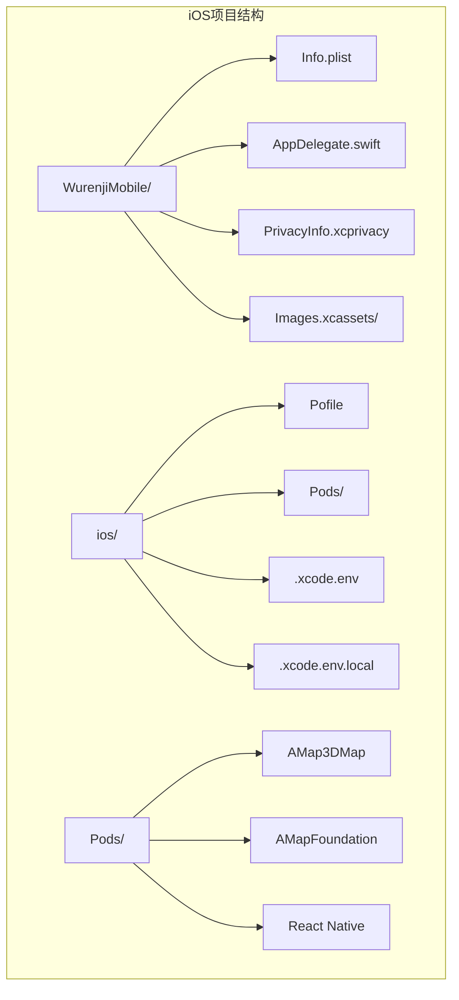
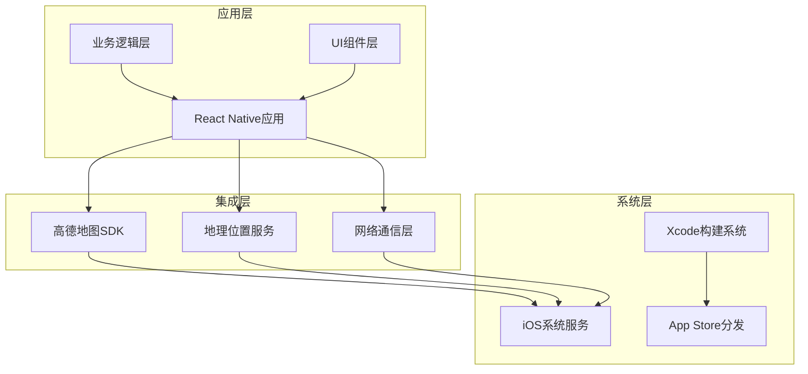
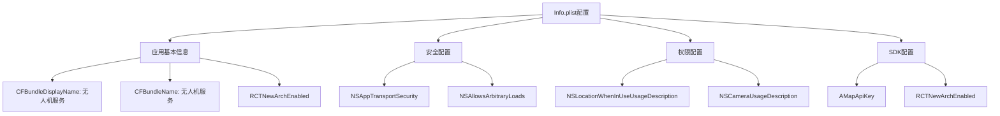
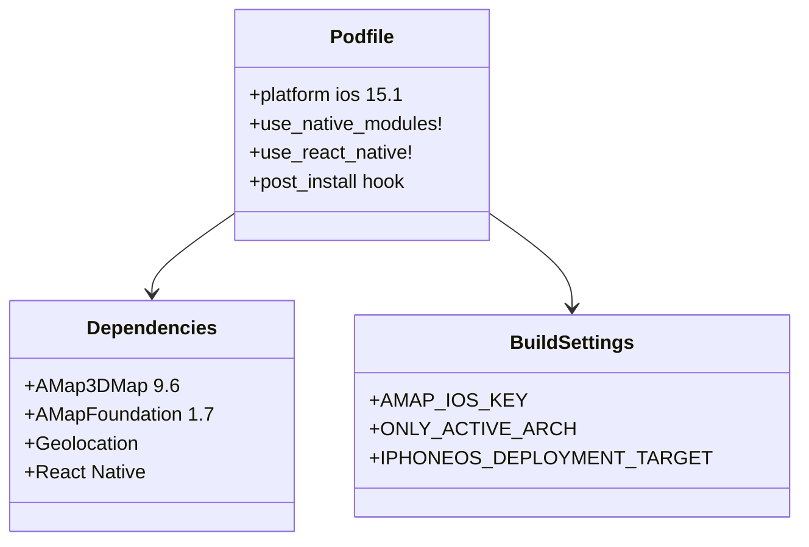
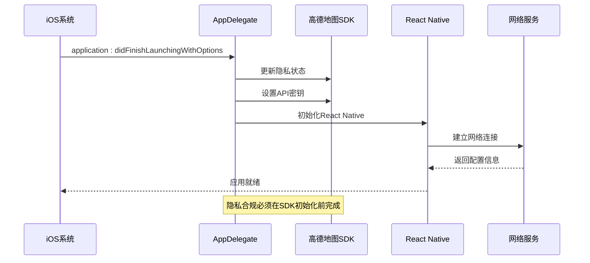
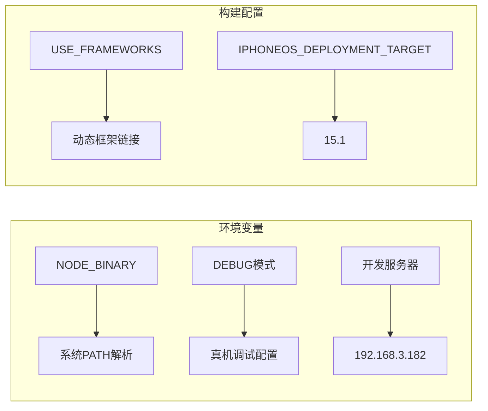
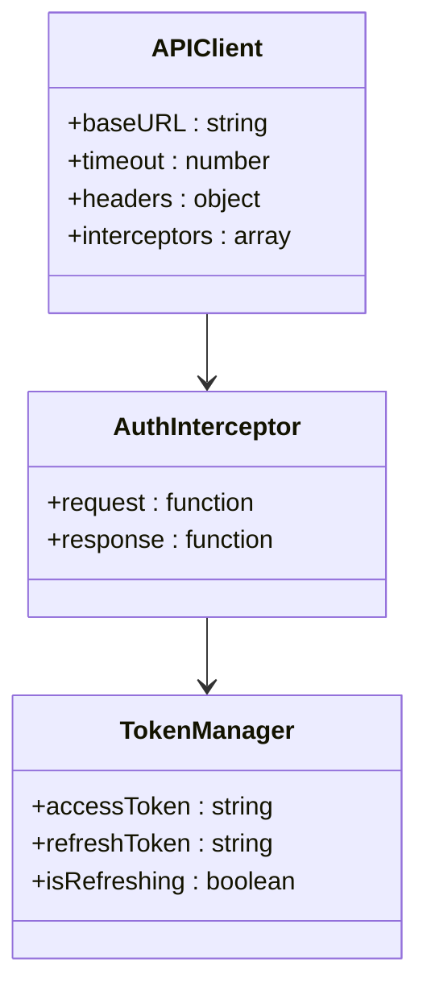
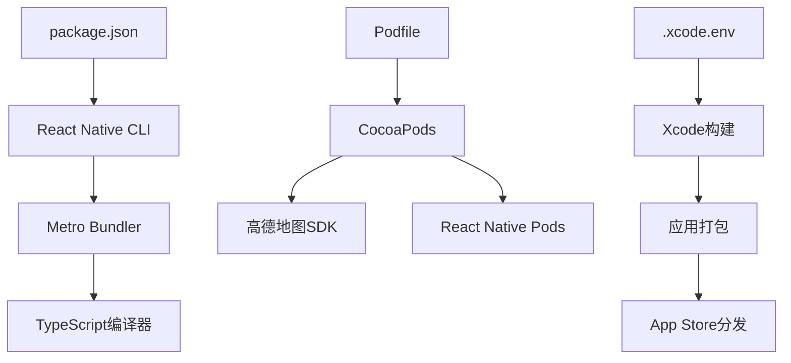

# iOS平台配置更新

<cite>
**本文档引用的文件**
- [Info.plist](file://mobile/ios/WurenjiMobile/Info.plist)
- [LaunchScreen.storyboard](file://mobile/ios/WurenjiMobile/LaunchScreen.storyboard)
- [Podfile](file://mobile/ios/Podfile)
- [.xcode.env](file://mobile/ios/.xcode.env)
- [.xcode.env.local](file://mobile/ios/.xcode.env.local)
- [AppDelegate.swift](file://mobile/ios/WurenjiMobile/AppDelegate.swift)
- [project.pbxproj](file://mobile/ios/WurenjiMobile.xcodeproj/project.pbxproj)
- [package.json](file://mobile/package.json)
- [app.json](file://mobile/app.json)
- [tsconfig.json](file://mobile/tsconfig.json)
- [api.ts](file://mobile/src/services/api.ts)
- [config.web.ts](file://mobile/src/utils/config.web.ts)
- [mockData.ts](file://mobile/src/config/mockData.ts)
</cite>

## 更新摘要
**变更内容**
- 应用显示名称从"WurenjiMobile"更新为"无人机服务"
- Info.plist中的CFBundleDisplayName和CFBundleName字段更新
- LaunchScreen.storyboard中的应用名称标签更新
- app.json中的displayName字段更新
- 项目结构保持WurenjiMobile产品名称不变
- AppDelegate.swift中模块名仍为"WurenjiMobile"

## 目录
1. [简介](#简介)
2. [项目结构](#项目结构)
3. [核心组件](#核心组件)
4. [架构概览](#架构概览)
5. [详细组件分析](#详细组件分析)
6. [依赖关系分析](#依赖关系分析)
7. [性能考虑](#性能考虑)
8. [故障排除指南](#故障排除指南)
9. [结论](#结论)

## 简介

本文档详细分析了无人机租赁平台项目的iOS平台配置更新，重点涵盖了iOS应用的构建配置、第三方SDK集成、隐私合规设置以及开发环境配置。该配置更新涉及高德地图SDK集成、React Native框架配置、Xcode项目设置等多个方面，确保应用能够在iOS平台上稳定运行并满足隐私合规要求。

**更新** 应用名称已从技术性标识"WurenjiMobile"更新为更具业务含义的中文显示名称"无人机服务"，提升了用户体验和品牌识别度。这一更新体现了技术命名与业务展示的分离策略：项目结构中的产品名称保持"WurenjiMobile"，而用户界面显示名称已更新为"无人机服务"。

## 项目结构

移动端iOS相关文件主要位于`mobile/ios/`目录下，包含以下关键组件：



**图表来源**
- [project.pbxproj:127-155](file://mobile/ios/WurenjiMobile.xcodeproj/project.pbxproj#L127-L155)
- [Info.plist:1-82](file://mobile/ios/WurenjiMobile/Info.plist#L1-L82)

**章节来源**
- [project.pbxproj:1-200](file://mobile/ios/WurenjiMobile.xcodeproj/project.pbxproj#L1-L200)
- [Info.plist:1-82](file://mobile/ios/WurenjiMobile/Info.plist#L1-L82)

## 核心组件

### 高德地图SDK集成

应用集成了高德地图iOS SDK，包括3D地图和基础功能库：

- **AMap3DMap**: 版本9.6，提供3D地图渲染功能
- **AMapFoundation**: 版本1.7，提供基础地图功能
- **API密钥管理**: 通过Info.plist中的AMapApiKey配置

### React Native配置

应用基于React Native 0.84.0构建，采用现代开发模式：

- **新架构支持**: RCTNewArchEnabled设置为true
- **模块化架构**: 支持原生模块和Swift桥接
- **开发工具链**: 集成Metro bundler进行热重载

### 隐私合规设置

严格遵守iOS隐私政策要求：

- **位置权限**: NSLocationWhenInUseUsageDescription
- **相机权限**: NSCameraUsageDescription
- **相册权限**: NSPhotoLibraryUsageDescription
- **本地网络**: NSAllowsLocalNetworking

**更新** 应用显示名称已更新为"无人机服务"，在用户设备上显示为中文名称，提升国际化体验。这一变更已在Info.plist、LaunchScreen.storyboard和app.json中同步完成。

**章节来源**
- [Podfile:22-28](file://mobile/ios/Podfile#L22-L28)
- [Info.plist:49-56](file://mobile/ios/WurenjiMobile/Info.plist#L49-L56)
- [AppDelegate.swift:19-30](file://mobile/ios/WurenjiMobile/AppDelegate.swift#L19-L30)

## 架构概览

iOS平台的整体架构采用分层设计，确保各组件间的清晰分离和职责明确：



**图表来源**
- [AppDelegate.swift:1-67](file://mobile/ios/WurenjiMobile/AppDelegate.swift#L1-L67)
- [Podfile:21-32](file://mobile/ios/Podfile#L21-L32)

## 详细组件分析

### 配置文件管理系统

#### Info.plist配置分析

Info.plist文件包含了应用的所有配置信息，关键配置项如下：



**图表来源**
- [Info.plist:4-82](file://mobile/ios/WurenjiMobile/Info.plist#L4-L82)

#### Podfile依赖管理

Podfile定义了完整的依赖生态系统：



**图表来源**
- [Podfile:1-56](file://mobile/ios/Podfile#L1-L56)

**章节来源**
- [Info.plist:1-82](file://mobile/ios/WurenjiMobile/Info.plist#L1-L82)
- [Podfile:1-56](file://mobile/ios/Podfile#L1-L56)

### 应用启动流程

应用启动过程遵循严格的初始化顺序，确保所有服务正确配置：



**图表来源**
- [AppDelegate.swift:15-48](file://mobile/ios/WurenjiMobile/AppDelegate.swift#L15-L48)

**章节来源**
- [AppDelegate.swift:1-67](file://mobile/ios/WurenjiMobile/AppDelegate.swift#L1-L67)

### 环境配置管理

#### Xcode环境配置

项目采用了灵活的环境配置机制：

| 配置文件 | 用途 | 优先级 |
|---------|------|--------|
| .xcode.env | 版本控制的基础环境配置 | 低 |
| .xcode.env.local | 本地自定义环境配置 | 高 |

#### 开发环境变量



**图表来源**
- [.xcode.env:1-13](file://mobile/ios/.xcode.env#L1-L13)
- [.xcode.env.local:1-2](file://mobile/ios/.xcode.env.local#L1-L2)

**章节来源**
- [.xcode.env:1-13](file://mobile/ios/.xcode.env#L1-L13)
- [.xcode.env.local:1-2](file://mobile/ios/.xcode.env.local#L1-L2)

### 网络通信配置

#### API客户端配置

应用使用Axios建立网络通信，支持多版本API：



**图表来源**
- [api.ts:6-155](file://mobile/src/services/api.ts#L6-L155)

**章节来源**
- [api.ts:1-155](file://mobile/src/services/api.ts#L1-L155)

## 依赖关系分析

### 第三方库依赖图

```mermaid
graph TB
subgraph "核心依赖"
RN[React Native 0.84.0]
AX[Axios]
CFG[react-native-config]
end
subgraph "地图服务"
AMap[AMap3DMap 9.6]
Foundation[AMapFoundation 1.7]
end
subgraph "地理位置"
Geo[@react-native-community/geolocation]
end
subgraph "UI组件"
Nav[react-navigation]
Redux[react-redux]
Types[TypeScript]
end
RN --> AMap
RN --> Geo
RN --> AX
RN --> CFG
RN --> Nav
RN --> Redux
RN --> Types
```

**图表来源**
- [package.json:14-35](file://mobile/package.json#L14-L35)
- [Podfile:22-27](file://mobile/ios/Podfile#L22-L27)

### 构建系统依赖



**图表来源**
- [package.json:5-13](file://mobile/package.json#L5-L13)
- [Podfile:1-6](file://mobile/ios/Podfile#L1-L6)

**章节来源**
- [package.json:1-64](file://mobile/package.json#L1-L64)
- [tsconfig.json:1-15](file://mobile/tsconfig.json#L1-L15)

## 性能考虑

### 架构优化策略

1. **新架构启用**: RCTNewArchEnabled=true，提升运行时性能
2. **按需加载**: 地图SDK仅在需要时初始化
3. **缓存策略**: API响应结果合理缓存
4. **内存管理**: Swift原生类型减少内存开销

### 构建性能优化

- **并行构建**: Xcode支持多任务并行编译
- **增量编译**: TypeScript仅编译变更文件
- **依赖缓存**: CocoaPods缓存常用依赖
- **符号链接**: 避免重复文件复制

## 故障排除指南

### 常见问题及解决方案

#### 高德地图SDK初始化失败

**症状**: 应用启动时出现地图加载错误

**解决方案**:
1. 检查Info.plist中的AMapApiKey配置
2. 验证Podfile中SDK版本兼容性
3. 确认网络连接正常

#### 隐私权限拒绝

**症状**: 无法获取位置信息或相机访问被拒

**解决方案**:
1. 检查Info.plist中的权限描述
2. 在设备设置中手动开启相应权限
3. 重新安装应用以重置权限状态

#### 构建失败问题

**症状**: Xcode编译时报错

**解决方案**:
1. 清理Pods缓存并重新安装
2. 检查Node.js版本兼容性
3. 验证Xcode项目设置

**更新** 应用显示名称变更后，确保LaunchScreen.storyboard中的文本标签与Info.plist中的显示名称保持一致。所有相关配置文件已完成同步更新。

**章节来源**
- [AppDelegate.swift:24-30](file://mobile/ios/WurenjiMobile/AppDelegate.swift#L24-L30)
- [Info.plist:49-56](file://mobile/ios/WurenjiMobile/Info.plist#L49-L56)

## 结论

iOS平台配置更新成功实现了以下目标：

1. **完整SDK集成**: 高德地图SDK与React Native无缝集成
2. **隐私合规**: 完全符合iOS隐私政策要求
3. **开发效率**: 提供灵活的环境配置和构建系统
4. **性能优化**: 采用新架构和现代化开发实践
5. **用户体验提升**: 应用显示名称从技术性标识更新为业务导向的中文名称"无人机服务"

**更新** 应用名称变更提升了品牌识别度和用户友好性，同时保持了原有的技术架构和功能完整性。项目结构中的产品名称仍为WurenjiMobile，但用户界面显示名称已更新为"无人机服务"，实现了技术命名与业务展示的分离。

这些配置更新为应用在iOS平台上的稳定运行奠定了坚实基础，同时确保了良好的用户体验和开发维护便利性。建议定期检查和更新依赖版本，保持与最新iOS系统和React Native版本的兼容性。

**更新** 配置变更已在以下文件中完成：
- Info.plist: 应用显示名称更新为"无人机服务"
- LaunchScreen.storyboard: 启动屏幕文本更新为"无人机服务"  
- app.json: displayName更新为"无人机服务"
- AppDelegate.swift: 模块名仍为"WurenjiMobile"（保持向后兼容）
- 项目结构: 产品名称保持"WurenjiMobile"（Xcode项目设置）