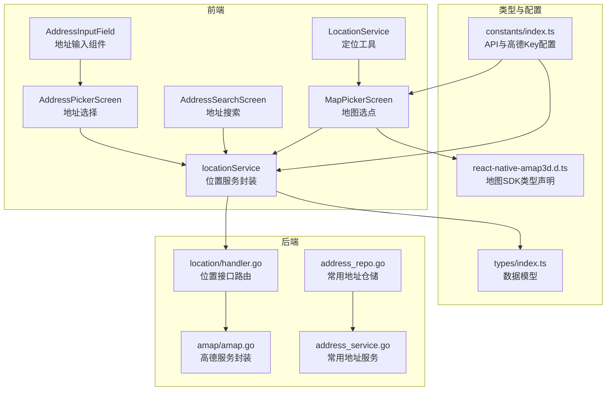
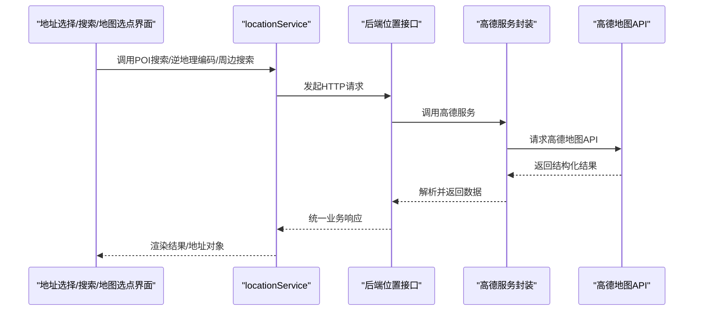
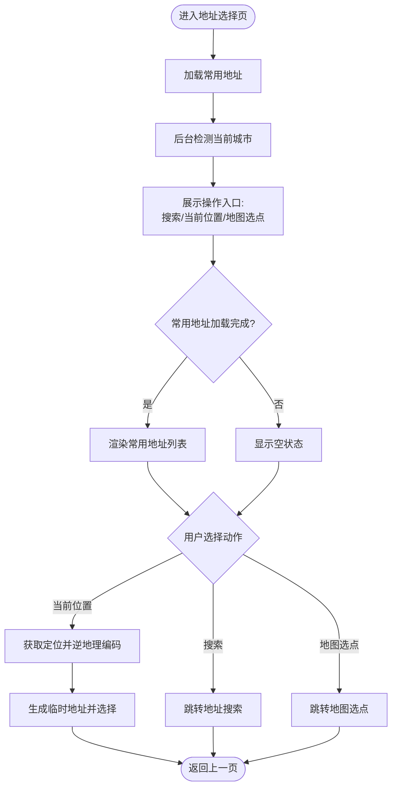
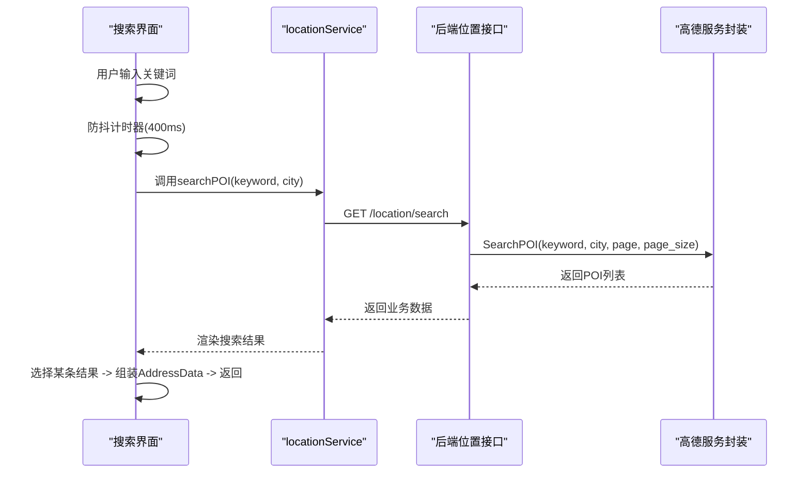
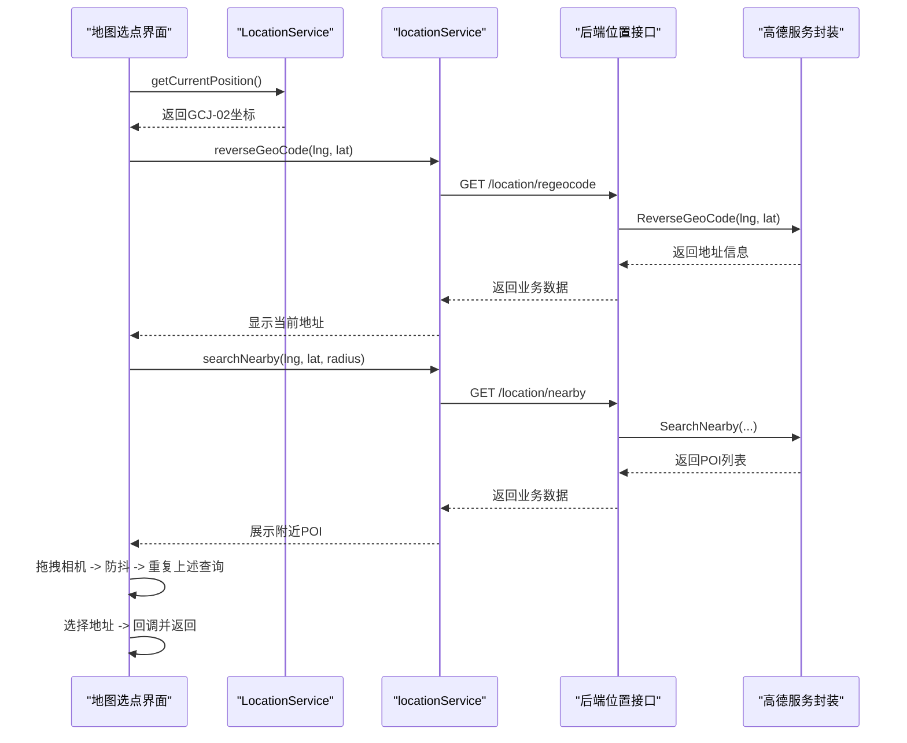
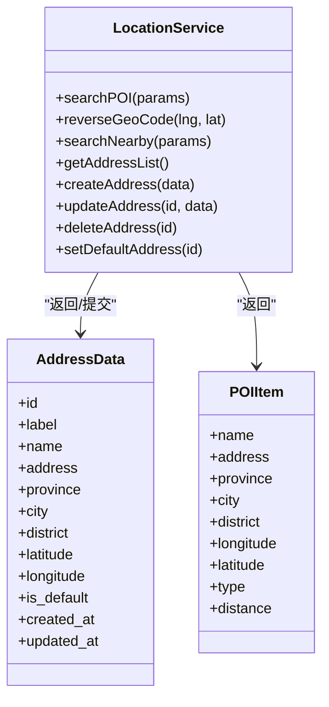
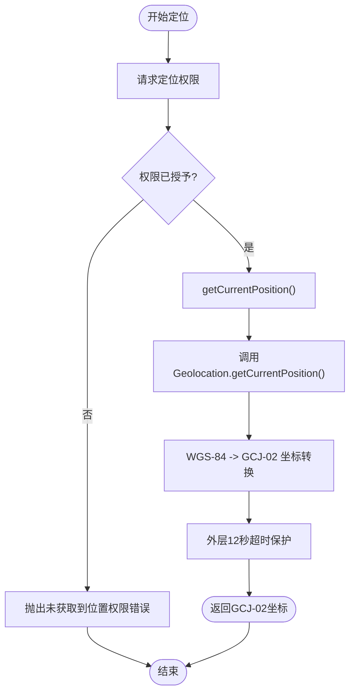
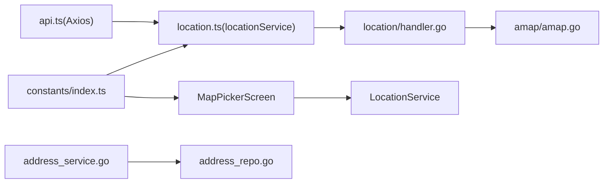

# 位置服务模块

<cite>
**本文档引用的文件**
- [mobile/src/services/location.ts](file://mobile/src/services/location.ts)
- [mobile/src/utils/LocationService.ts](file://mobile/src/utils/LocationService.ts)
- [mobile/src/screens/location/AddressPickerScreen.tsx](file://mobile/src/screens/location/AddressPickerScreen.tsx)
- [mobile/src/screens/location/AddressSearchScreen.tsx](file://mobile/src/screens/location/AddressSearchScreen.tsx)
- [mobile/src/screens/location/MapPickerScreen.tsx](file://mobile/src/screens/location/MapPickerScreen.tsx)
- [mobile/src/components/AddressInputField.tsx](file://mobile/src/components/AddressInputField.tsx)
- [mobile/src/types/index.ts](file://mobile/src/types/index.ts)
- [mobile/src/types/react-native-amap3d.d.ts](file://mobile/src/types/react-native-amap3d.d.ts)
- [mobile/src/services/api.ts](file://mobile/src/services/api.ts)
- [mobile/src/constants/index.ts](file://mobile/src/constants/index.ts)
- [backend/internal/api/v1/location/handler.go](file://backend/internal/api/v1/location/handler.go)
- [backend/internal/pkg/amap/amap.go](file://backend/internal/pkg/amap/amap.go)
- [backend/internal/repository/address_repo.go](file://backend/internal/repository/address_repo.go)
- [backend/internal/service/address_service.go](file://backend/internal/service/address_service.go)
</cite>

## 目录
1. [简介](#简介)
2. [项目结构](#项目结构)
3. [核心组件](#核心组件)
4. [架构总览](#架构总览)
5. [详细组件分析](#详细组件分析)
6. [依赖关系分析](#依赖关系分析)
7. [性能考虑](#性能考虑)
8. [故障排除指南](#故障排除指南)
9. [结论](#结论)

## 简介
本技术文档面向移动端位置服务模块，系统性阐述地址选择、地址搜索、地图选点、常用地址管理、定位权限处理、高德地图SDK集成、坐标转换与纠偏、以及周边POI检索等功能。文档同时覆盖前后端交互协议、错误处理策略、性能优化建议与隐私保护方案，帮助开发者快速理解并扩展位置服务能力。

## 项目结构
位置服务模块由前端屏幕组件、服务封装、工具函数、类型定义与后端接口组成，采用分层设计：
- 屏幕层：地址选择、地址搜索、地图选点
- 服务层：位置服务封装（POI搜索、逆地理编码、周边搜索、常用地址）
- 工具层：定位权限申请、坐标转换（WGS-84/GCJ-02）、带超时的定位调用
- 类型层：统一的数据模型与第三方SDK类型声明
- 后端层：高德地图服务封装、位置接口路由、常用地址仓储与服务

**图表来源**
- [mobile/src/screens/location/AddressPickerScreen.tsx:12-196](file://mobile/src/screens/location/AddressPickerScreen.tsx#L12-L196)
- [mobile/src/screens/location/AddressSearchScreen.tsx:11-119](file://mobile/src/screens/location/AddressSearchScreen.tsx#L11-L119)
- [mobile/src/screens/location/MapPickerScreen.tsx:15-260](file://mobile/src/screens/location/MapPickerScreen.tsx#L15-L260)
- [mobile/src/components/AddressInputField.tsx:17-50](file://mobile/src/components/AddressInputField.tsx#L17-L50)
- [mobile/src/services/location.ts:4-50](file://mobile/src/services/location.ts#L4-L50)
- [mobile/src/utils/LocationService.ts:111-144](file://mobile/src/utils/LocationService.ts#L111-L144)
- [mobile/src/types/index.ts:320-333](file://mobile/src/types/index.ts#L320-L333)
- [mobile/src/types/react-native-amap3d.d.ts:7-86](file://mobile/src/types/react-native-amap3d.d.ts#L7-L86)
- [mobile/src/constants/index.ts:136-141](file://mobile/src/constants/index.ts#L136-L141)
- [backend/internal/api/v1/location/handler.go:20-96](file://backend/internal/api/v1/location/handler.go#L20-L96)
- [backend/internal/pkg/amap/amap.go:248-321](file://backend/internal/pkg/amap/amap.go#L248-L321)
- [backend/internal/repository/address_repo.go:17-59](file://backend/internal/repository/address_repo.go#L17-L59)
- [backend/internal/service/address_service.go:20-62](file://backend/internal/service/address_service.go#L20-L62)

**章节来源**
- [mobile/src/screens/location/AddressPickerScreen.tsx:12-196](file://mobile/src/screens/location/AddressPickerScreen.tsx#L12-L196)
- [mobile/src/screens/location/AddressSearchScreen.tsx:11-119](file://mobile/src/screens/location/AddressSearchScreen.tsx#L11-L119)
- [mobile/src/screens/location/MapPickerScreen.tsx:15-260](file://mobile/src/screens/location/MapPickerScreen.tsx#L15-L260)
- [mobile/src/services/location.ts:4-50](file://mobile/src/services/location.ts#L4-L50)
- [mobile/src/utils/LocationService.ts:111-144](file://mobile/src/utils/LocationService.ts#L111-L144)
- [mobile/src/types/index.ts:320-333](file://mobile/src/types/index.ts#L320-L333)
- [mobile/src/types/react-native-amap3d.d.ts:7-86](file://mobile/src/types/react-native-amap3d.d.ts#L7-L86)
- [mobile/src/constants/index.ts:136-141](file://mobile/src/constants/index.ts#L136-L141)
- [backend/internal/api/v1/location/handler.go:20-96](file://backend/internal/api/v1/location/handler.go#L20-L96)
- [backend/internal/pkg/amap/amap.go:248-321](file://backend/internal/pkg/amap/amap.go#L248-L321)
- [backend/internal/repository/address_repo.go:17-59](file://backend/internal/repository/address_repo.go#L17-L59)
- [backend/internal/service/address_service.go:20-62](file://backend/internal/service/address_service.go#L20-L62)

## 核心组件
- 位置服务封装（locationService）：提供POI搜索、逆地理编码、周边搜索、常用地址的增删改查等API调用。
- 定位工具（LocationService）：统一封装定位权限申请、坐标转换（WGS-84 -> GCJ-02）、带超时保护的定位获取。
- 地图选点（MapPickerScreen）：集成高德地图SDK，支持拖拽定位、周边POI展示、回到当前位置、坐标拾取。
- 地址选择（AddressPickerScreen）：常用地址列表、当前定位、地图选点入口、删除常用地址。
- 地址搜索（AddressSearchScreen）：关键词搜索POI、结果展示、延迟防抖。
- 数据模型（types/index.ts）：AddressData、POIItem、ApiResponse等统一数据结构。
- 高德SDK类型声明（react-native-amap3d.d.ts）：解决React 19 + TS 5.x 类型冲突，提供MapView、CameraEvent等类型。
- API配置（constants/index.ts）：高德Key、API基础地址、版本切换、远程测试地址等。
- 后端位置接口（location/handler.go）：POI搜索、逆地理编码、周边搜索路由。
- 高德服务封装（amap/amap.go）：地理编码、逆地理编码、POI搜索、周边搜索、距离计算。
- 常用地址仓储与服务（address_repo.go、address_service.go）：常用地址的CRUD与默认地址逻辑。

**章节来源**
- [mobile/src/services/location.ts:4-50](file://mobile/src/services/location.ts#L4-L50)
- [mobile/src/utils/LocationService.ts:65-144](file://mobile/src/utils/LocationService.ts#L65-L144)
- [mobile/src/screens/location/MapPickerScreen.tsx:15-260](file://mobile/src/screens/location/MapPickerScreen.tsx#L15-L260)
- [mobile/src/screens/location/AddressPickerScreen.tsx:12-196](file://mobile/src/screens/location/AddressPickerScreen.tsx#L12-L196)
- [mobile/src/screens/location/AddressSearchScreen.tsx:11-119](file://mobile/src/screens/location/AddressSearchScreen.tsx#L11-L119)
- [mobile/src/types/index.ts:320-333](file://mobile/src/types/index.ts#L320-L333)
- [mobile/src/types/react-native-amap3d.d.ts:7-86](file://mobile/src/types/react-native-amap3d.d.ts#L7-L86)
- [mobile/src/constants/index.ts:136-141](file://mobile/src/constants/index.ts#L136-L141)
- [backend/internal/api/v1/location/handler.go:20-96](file://backend/internal/api/v1/location/handler.go#L20-L96)
- [backend/internal/pkg/amap/amap.go:248-321](file://backend/internal/pkg/amap/amap.go#L248-L321)
- [backend/internal/repository/address_repo.go:17-59](file://backend/internal/repository/address_repo.go#L17-L59)
- [backend/internal/service/address_service.go:20-62](file://backend/internal/service/address_service.go#L20-L62)

## 架构总览
移动端通过locationService调用后端位置接口，后端通过amap服务封装调用高德地图API；定位能力由LocationService统一处理，坐标转换遵循中国地图标准（GCJ-02）。地图选点界面集成react-native-amap3d，支持拖拽、周边POI查询与地址反编译。

**图表来源**
- [mobile/src/services/location.ts:7-17](file://mobile/src/services/location.ts#L7-L17)
- [backend/internal/api/v1/location/handler.go:20-96](file://backend/internal/api/v1/location/handler.go#L20-L96)
- [backend/internal/pkg/amap/amap.go:248-321](file://backend/internal/pkg/amap/amap.go#L248-L321)

**章节来源**
- [mobile/src/services/location.ts:7-17](file://mobile/src/services/location.ts#L7-L17)
- [backend/internal/api/v1/location/handler.go:20-96](file://backend/internal/api/v1/location/handler.go#L20-L96)
- [backend/internal/pkg/amap/amap.go:248-321](file://backend/internal/pkg/amap/amap.go#L248-L321)

## 详细组件分析

### 地址选择功能（AddressPickerScreen）
- 功能要点
  - 加载常用地址列表，支持删除常用地址
  - 使用当前位置进行逆地理编码，生成临时地址供选择
  - 跳转至地图选点界面进行精确坐标拾取
  - 跳转至地址搜索界面进行关键词检索
- 关键流程
  - 初始化时后台检测当前城市，用于搜索限定范围
  - 选择常用地址或地图选点结果，回调上层页面

**图表来源**
- [mobile/src/screens/location/AddressPickerScreen.tsx:22-93](file://mobile/src/screens/location/AddressPickerScreen.tsx#L22-L93)

**章节来源**
- [mobile/src/screens/location/AddressPickerScreen.tsx:12-196](file://mobile/src/screens/location/AddressPickerScreen.tsx#L12-L196)

### 地址搜索功能（AddressSearchScreen）
- 功能要点
  - 输入关键词，400ms防抖触发搜索
  - 限定当前城市范围，提升搜索准确性
  - 结果列表展示名称与地址摘要，支持键盘隐藏
- 关键流程
  - 文本变化 -> 清除定时器 -> 设置新定时器 -> 触发搜索
  - 选择结果 -> 组装AddressData -> 回调并返回

**图表来源**
- [mobile/src/screens/location/AddressSearchScreen.tsx:23-64](file://mobile/src/screens/location/AddressSearchScreen.tsx#L23-L64)
- [mobile/src/services/location.ts:7-9](file://mobile/src/services/location.ts#L7-L9)
- [backend/internal/api/v1/location/handler.go:20-37](file://backend/internal/api/v1/location/handler.go#L20-L37)
- [backend/internal/pkg/amap/amap.go:248-321](file://backend/internal/pkg/amap/amap.go#L248-L321)

**章节来源**
- [mobile/src/screens/location/AddressSearchScreen.tsx:11-119](file://mobile/src/screens/location/AddressSearchScreen.tsx#L11-L119)
- [mobile/src/services/location.ts:7-9](file://mobile/src/services/location.ts#L7-L9)
- [backend/internal/api/v1/location/handler.go:20-37](file://backend/internal/api/v1/location/handler.go#L20-L37)
- [backend/internal/pkg/amap/amap.go:248-321](file://backend/internal/pkg/amap/amap.go#L248-L321)

### 地图选点功能（MapPickerScreen）
- 功能要点
  - 集成高德地图SDK，支持myLocationEnabled、缩放控制、相机事件
  - 拖拽结束触发防抖查询新坐标对应的地址与周边POI
  - 支持回到当前位置，使用地图SDK上报的实时位置
  - 选择当前位置或附近POI作为最终地址
- 关键流程
  - 初始化定位或使用初始坐标 -> 反编译地址 -> 并行查询周边POI
  - 拖拽相机 -> 防抖 -> 查询新地址与POI
  - 选择地址 -> 回调并返回

**图表来源**
- [mobile/src/screens/location/MapPickerScreen.tsx:41-89](file://mobile/src/screens/location/MapPickerScreen.tsx#L41-L89)
- [mobile/src/utils/LocationService.ts:111-144](file://mobile/src/utils/LocationService.ts#L111-L144)
- [mobile/src/services/location.ts:11-17](file://mobile/src/services/location.ts#L11-L17)
- [backend/internal/api/v1/location/handler.go:39-96](file://backend/internal/api/v1/location/handler.go#L39-L96)
- [backend/internal/pkg/amap/amap.go:162-229](file://backend/internal/pkg/amap/amap.go#L162-L229)

**章节来源**
- [mobile/src/screens/location/MapPickerScreen.tsx:15-260](file://mobile/src/screens/location/MapPickerScreen.tsx#L15-L260)
- [mobile/src/utils/LocationService.ts:111-144](file://mobile/src/utils/LocationService.ts#L111-L144)
- [mobile/src/services/location.ts:11-17](file://mobile/src/services/location.ts#L11-L17)
- [backend/internal/api/v1/location/handler.go:39-96](file://backend/internal/api/v1/location/handler.go#L39-L96)
- [backend/internal/pkg/amap/amap.go:162-229](file://backend/internal/pkg/amap/amap.go#L162-L229)

### 位置服务封装（locationService）
- 提供的接口
  - searchPOI：关键词POI搜索
  - reverseGeoCode：坐标逆地理编码
  - searchNearby：周边POI搜索
  - 常用地址管理：列表、新增、更新、删除、设为默认
- 数据模型
  - AddressData：常用地址结构
  - POIItem：POI结果项
  - ApiResponse：统一响应包装

**图表来源**
- [mobile/src/services/location.ts:4-50](file://mobile/src/services/location.ts#L4-L50)
- [mobile/src/types/index.ts:320-333](file://mobile/src/types/index.ts#L320-L333)

**章节来源**
- [mobile/src/services/location.ts:4-50](file://mobile/src/services/location.ts#L4-L50)
- [mobile/src/types/index.ts:320-333](file://mobile/src/types/index.ts#L320-L333)

### 定位权限与坐标转换（LocationService）
- 权限申请
  - Android：通过PermissionsAndroid请求ACCESS_FINE_LOCATION
  - iOS：通过Geolocation.requestAuthorization触发系统授权，带3秒超时兜底
- 坐标转换
  - WGS-84 -> GCJ-02（中国国测局坐标系，高德地图使用）
  - 超时保护：定位Promise外层再包裹12秒超时，避免Geolocation模块无响应
- 错误处理
  - 不同错误码映射为用户可读提示
  - 未授权、无法获取、超时分别提示

**图表来源**
- [mobile/src/utils/LocationService.ts:65-144](file://mobile/src/utils/LocationService.ts#L65-L144)

**章节来源**
- [mobile/src/utils/LocationService.ts:65-144](file://mobile/src/utils/LocationService.ts#L65-L144)

### 高德地图SDK集成与类型声明
- 集成方式
  - 通过react-native-amap3d引入MapView、CameraEvent等
  - 使用constants中的AMAP_CONFIG传入Android/iOS Key
- 类型声明
  - 解决React 19 + TS 5.x 类型冲突，提供MapViewProps、CameraEvent等干净类型
- 地图行为
  - myLocationEnabled启用定位图层
  - onCameraIdle监听拖拽结束事件，触发地址与POI查询
  - onLocation监听SDK实时位置，用于“回到当前位置”

**章节来源**
- [mobile/src/screens/location/MapPickerScreen.tsx:15-260](file://mobile/src/screens/location/MapPickerScreen.tsx#L15-L260)
- [mobile/src/types/react-native-amap3d.d.ts:7-86](file://mobile/src/types/react-native-amap3d.d.ts#L7-L86)
- [mobile/src/constants/index.ts:136-141](file://mobile/src/constants/index.ts#L136-L141)

### 常用地址管理（后端）
- 仓储层
  - 按用户查询常用地址，按默认优先、时间倒序排序
  - 新增/更新/删除/清空默认/设为默认
- 服务层
  - 新增时限制用户常用地址数量上限
  - 设为默认时先清理其他默认项
- 前端调用
  - locationService封装常用地址的CRUD与设默认接口

**章节来源**
- [backend/internal/repository/address_repo.go:17-59](file://backend/internal/repository/address_repo.go#L17-L59)
- [backend/internal/service/address_service.go:20-62](file://backend/internal/service/address_service.go#L20-L62)
- [mobile/src/services/location.ts:21-49](file://mobile/src/services/location.ts#L21-L49)

## 依赖关系分析
- 前端依赖
  - locationService依赖api.ts提供的Axios实例与拦截器
  - MapPickerScreen依赖react-native-amap3d与LocationService
  - AddressInputField依赖导航跳转至AddressPickerScreen
- 后端依赖
  - location/handler.go依赖amap服务封装
  - amap服务封装依赖高德地图API与TLS配置
- 配置依赖
  - constants/index.ts提供API基础地址、高德Key、远程测试地址

**图表来源**
- [mobile/src/services/api.ts:15-154](file://mobile/src/services/api.ts#L15-L154)
- [mobile/src/services/location.ts:4-50](file://mobile/src/services/location.ts#L4-L50)
- [mobile/src/constants/index.ts:115-141](file://mobile/src/constants/index.ts#L115-L141)
- [mobile/src/screens/location/MapPickerScreen.tsx:15-260](file://mobile/src/screens/location/MapPickerScreen.tsx#L15-L260)
- [mobile/src/utils/LocationService.ts:111-144](file://mobile/src/utils/LocationService.ts#L111-L144)
- [backend/internal/api/v1/location/handler.go:20-96](file://backend/internal/api/v1/location/handler.go#L20-L96)
- [backend/internal/pkg/amap/amap.go:42-63](file://backend/internal/pkg/amap/amap.go#L42-L63)
- [backend/internal/service/address_service.go:12-18](file://backend/internal/service/address_service.go#L12-L18)
- [backend/internal/repository/address_repo.go:9-15](file://backend/internal/repository/address_repo.go#L9-L15)

**章节来源**
- [mobile/src/services/api.ts:15-154](file://mobile/src/services/api.ts#L15-L154)
- [mobile/src/services/location.ts:4-50](file://mobile/src/services/location.ts#L4-L50)
- [mobile/src/constants/index.ts:115-141](file://mobile/src/constants/index.ts#L115-L141)
- [mobile/src/screens/location/MapPickerScreen.tsx:15-260](file://mobile/src/screens/location/MapPickerScreen.tsx#L15-L260)
- [mobile/src/utils/LocationService.ts:111-144](file://mobile/src/utils/LocationService.ts#L111-L144)
- [backend/internal/api/v1/location/handler.go:20-96](file://backend/internal/api/v1/location/handler.go#L20-L96)
- [backend/internal/pkg/amap/amap.go:42-63](file://backend/internal/pkg/amap/amap.go#L42-L63)
- [backend/internal/service/address_service.go:12-18](file://backend/internal/service/address_service.go#L12-L18)
- [backend/internal/repository/address_repo.go:9-15](file://backend/internal/repository/address_repo.go#L9-L15)

## 性能考虑
- 搜索防抖
  - 地址搜索采用400ms防抖，减少高频请求
  - 地图拖拽采用500ms防抖，平衡流畅性与实时性
- 并行请求
  - 地图选点同时发起逆地理编码与周边POI查询，缩短等待时间
- 超时保护
  - 定位外层12秒超时，避免Geolocation模块卡死
  - Axios默认15秒超时，统一网络异常处理
- 坐标转换
  - 仅在定位成功后进行WGS-84 -> GCJ-02转换，避免无效计算
- 常用地址上限
  - 后端限制每个用户常用地址数量上限，降低数据库压力

[本节为通用性能建议，不直接分析具体文件]

## 故障排除指南
- 定位失败
  - 检查定位权限是否授予，iOS需确认requestAuthorization回调
  - 定位超时（12秒）或网络超时（15秒），确认设备网络与定位服务
- 高德API错误
  - 检查AMAP_CONFIG中的Key是否正确配置
  - 关注高德返回的状态码与错误信息，必要时重试或降级
- 地图不显示或无定位
  - 确认react-native-amap3d初始化与Key配置
  - 检查onCameraIdle与onLocation事件绑定
- 常用地址异常
  - 新增超过上限会返回业务错误，需提示用户清理
  - 设默认前会清理其他默认项，确保唯一性

**章节来源**
- [mobile/src/utils/LocationService.ts:65-144](file://mobile/src/utils/LocationService.ts#L65-L144)
- [mobile/src/constants/index.ts:136-141](file://mobile/src/constants/index.ts#L136-L141)
- [backend/internal/pkg/amap/amap.go:162-229](file://backend/internal/pkg/amap/amap.go#L162-L229)
- [backend/internal/service/address_service.go:24-31](file://backend/internal/service/address_service.go#L24-L31)

## 结论
位置服务模块通过清晰的分层设计实现了从地址选择、搜索、地图选点到常用地址管理的完整闭环。前端统一通过locationService与后端交互，后端基于amap服务封装高德地图能力，并结合权限处理、坐标转换与超时保护，确保在复杂场景下的稳定性与用户体验。建议在后续迭代中进一步完善离线缓存策略、隐私合规与埋点统计，持续优化性能与可维护性。