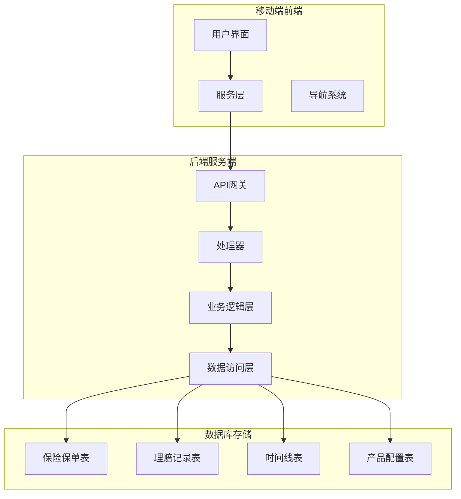
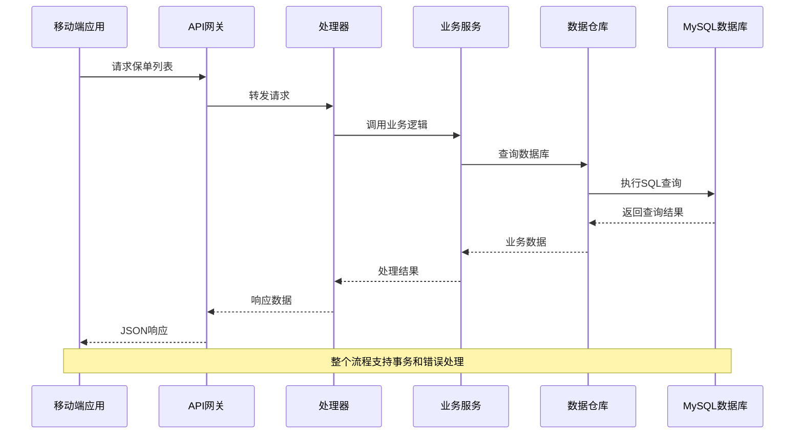
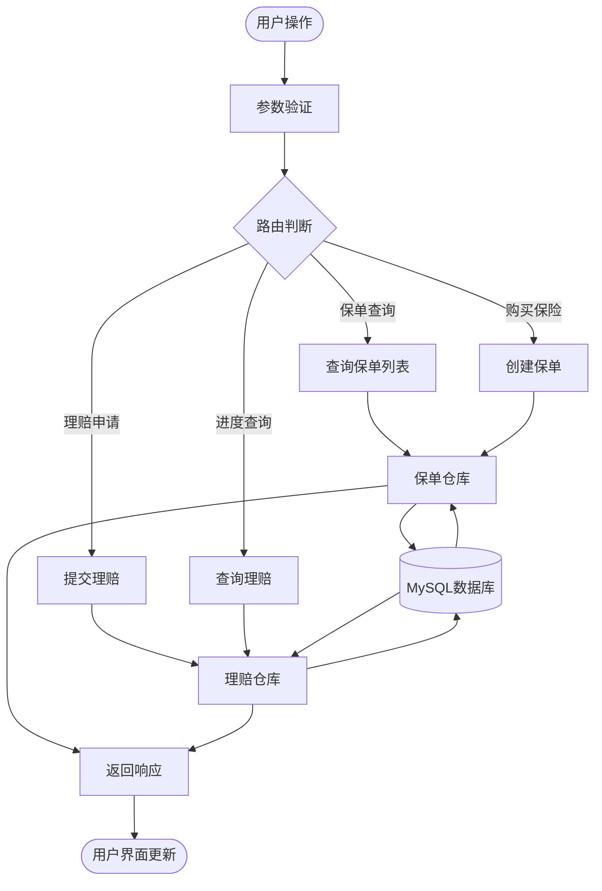
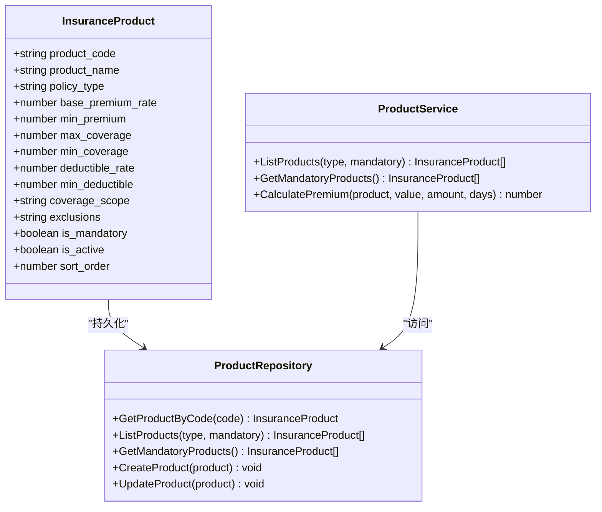
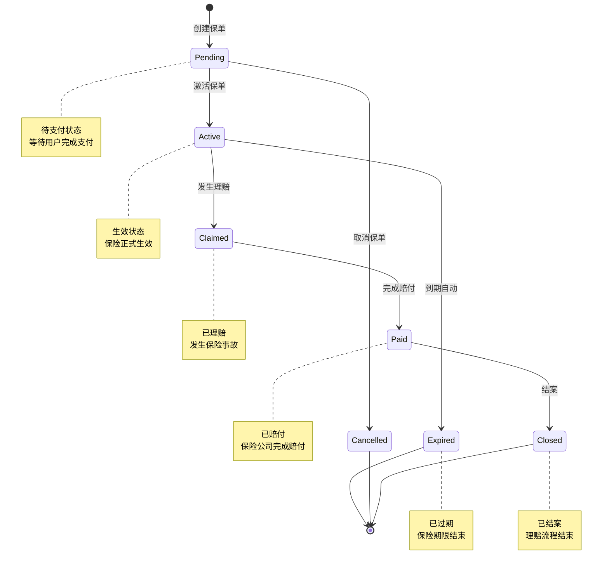
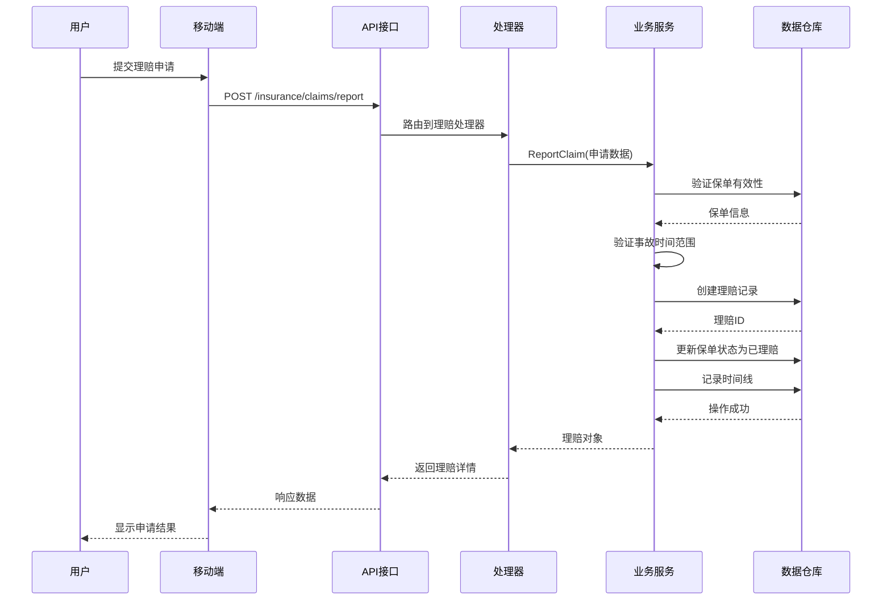
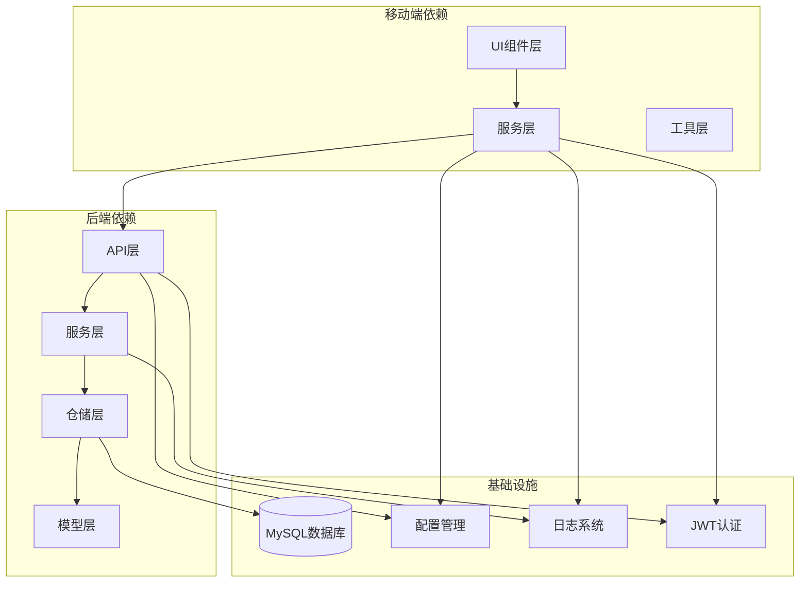

# 保险与理赔模块

<cite>
**本文档引用的文件**
- [mobile/src/services/insurance.ts](file://mobile/src/services/insurance.ts)
- [backend/internal/api/v1/insurance/handler.go](file://backend/internal/api/v1/insurance/handler.go)
- [backend/internal/service/insurance_service.go](file://backend/internal/service/insurance_service.go)
- [backend/internal/repository/insurance_repo.go](file://backend/internal/repository/insurance_repo.go)
- [backend/migrations/013_add_insurance_tables.sql](file://backend/migrations/013_add_insurance_tables.sql)
- [mobile/src/screens/insurance/InsurancePolicyListScreen.tsx](file://mobile/src/screens/insurance/InsurancePolicyListScreen.tsx)
- [mobile/src/screens/insurance/ClaimListScreen.tsx](file://mobile/src/screens/insurance/ClaimListScreen.tsx)
- [mobile/src/services/api.ts](file://mobile/src/services/api.ts)
- [mobile/src/constants/index.ts](file://mobile/src/constants/index.ts)
- [backend/internal/model/models.go](file://backend/internal/model/models.go)
</cite>

## 目录
1. [简介](#简介)
2. [项目结构](#项目结构)
3. [核心组件](#核心组件)
4. [架构概览](#架构概览)
5. [详细组件分析](#详细组件分析)
6. [依赖关系分析](#依赖关系分析)
7. [性能考虑](#性能考虑)
8. [故障排除指南](#故障排除指南)
9. [结论](#结论)
10. [附录](#附录)

## 简介

保险与理赔模块是无人机租赁平台的重要组成部分，为用户提供完整的保险保障和理赔服务。该模块涵盖了保险政策管理、理赔申请流程、保险状态管理以及保险数据的展示和管理等功能。

模块支持四种主要的保险类型：
- **第三者责任险**：强制性保险，保障第三方人身伤亡和财产损失
- **货物险**：保障运输过程中的货物损失或损坏
- **机身险**：保障无人机本身的物理损坏
- **飞手意外险**：保障飞手的人身安全

## 项目结构

保险与理赔模块采用前后端分离的架构设计，分为移动端前端、后端服务端和数据库存储三个层次。

**图表来源**
- [mobile/src/services/insurance.ts:1-265](file://mobile/src/services/insurance.ts#L1-L265)
- [backend/internal/api/v1/insurance/handler.go:1-559](file://backend/internal/api/v1/insurance/handler.go#L1-L559)
- [backend/internal/service/insurance_service.go:1-565](file://backend/internal/service/insurance_service.go#L1-L565)

**章节来源**
- [mobile/src/services/insurance.ts:1-265](file://mobile/src/services/insurance.ts#L1-L265)
- [backend/internal/api/v1/insurance/handler.go:1-559](file://backend/internal/api/v1/insurance/handler.go#L1-L559)

## 核心组件

### 移动端组件

移动端提供了完整的保险管理界面，包括保单列表、理赔记录、报案申请等功能。

**保单管理功能**：
- 保单列表展示和详情查看
- 强制险检查和提醒
- 保单状态跟踪
- 理赔报案入口

**理赔管理功能**：
- 理赔申请提交
- 材料上传和证据管理
- 理赔进度查询
- 时间线追踪

### 后端服务组件

后端采用三层架构设计，确保业务逻辑的清晰分离和可维护性。

**处理器层**：负责HTTP请求处理和参数验证
**业务逻辑层**：实现核心保险业务规则和流程控制
**数据访问层**：封装数据库操作和事务管理

### 数据库组件

数据库设计遵循高扩展性和高性能原则，支持复杂的保险业务场景。

**核心表结构**：
- 保险保单表：存储保单基本信息和状态
- 理赔记录表：记录完整的理赔流程
- 时间线表：追踪每个理赔的关键节点
- 产品配置表：管理保险产品的参数配置

**章节来源**
- [mobile/src/screens/insurance/InsurancePolicyListScreen.tsx:1-287](file://mobile/src/screens/insurance/InsurancePolicyListScreen.tsx#L1-L287)
- [mobile/src/screens/insurance/ClaimListScreen.tsx:1-600](file://mobile/src/screens/insurance/ClaimListScreen.tsx#L1-L600)
- [backend/migrations/013_add_insurance_tables.sql:1-241](file://backend/migrations/013_add_insurance_tables.sql#L1-L241)

## 架构概览

保险与理赔模块采用微服务架构，实现了前后端的完全解耦。

**图表来源**
- [backend/internal/api/v1/insurance/handler.go:116-135](file://backend/internal/api/v1/insurance/handler.go#L116-L135)
- [backend/internal/service/insurance_service.go:169-172](file://backend/internal/service/insurance_service.go#L169-L172)
- [backend/internal/repository/insurance_repo.go:77-79](file://backend/internal/repository/insurance_repo.go#L77-L79)

### 数据流架构

**图表来源**
- [backend/internal/service/insurance_service.go:46-117](file://backend/internal/service/insurance_service.go#L46-L117)
- [backend/internal/service/insurance_service.go:222-276](file://backend/internal/service/insurance_service.go#L222-L276)

## 详细组件分析

### 保险产品管理系统

保险产品管理系统负责管理所有可用的保险产品配置，支持动态的产品参数调整。

**图表来源**
- [mobile/src/services/insurance.ts:7-25](file://mobile/src/services/insurance.ts#L7-L25)
- [backend/internal/repository/insurance_repo.go:224-257](file://backend/internal/repository/insurance_repo.go#L224-L257)
- [backend/internal/service/insurance_service.go:119-130](file://backend/internal/service/insurance_service.go#L119-L130)

#### 产品配置特性

系统支持灵活的产品配置，包括：
- **费率计算**：基于保额、货值和保险天数的动态计算
- **保额范围**：每种产品都有最小和最大保额限制
- **免赔机制**：支持固定免赔额和免赔率两种模式
- **强制性标识**：区分强制性和可选性保险产品

**章节来源**
- [backend/internal/service/insurance_service.go:119-130](file://backend/internal/service/insurance_service.go#L119-L130)
- [backend/migrations/013_add_insurance_tables.sql:170-203](file://backend/migrations/013_add_insurance_tables.sql#L170-L203)

### 保单生命周期管理

保单生命周期管理涵盖了从创建到终止的完整流程，确保每个环节都有明确的状态控制。

**图表来源**
- [backend/internal/service/insurance_service.go:132-150](file://backend/internal/service/insurance_service.go#L132-L150)
- [backend/internal/service/insurance_service.go:152-167](file://backend/internal/service/insurance_service.go#L152-L167)

#### 状态转换规则

系统严格控制保单状态的转换，确保业务逻辑的正确性：

**激活流程**：只有待支付状态的保单可以激活，激活后进入生效状态并更新支付信息。

**取消流程**：仅限于待支付和生效状态的保单可以取消，取消后记录取消原因。

**到期处理**：系统会定期检查过期的生效保单，自动更新为已过期状态。

**章节来源**
- [backend/internal/service/insurance_service.go:132-167](file://backend/internal/service/insurance_service.go#L132-L167)
- [backend/internal/repository/insurance_repo.go:104-109](file://backend/internal/repository/insurance_repo.go#L104-L109)

### 理赔申请处理流程

理赔申请处理流程是整个保险模块的核心，需要处理复杂的业务逻辑和状态管理。

**图表来源**
- [backend/internal/api/v1/insurance/handler.go:208-252](file://backend/internal/api/v1/insurance/handler.go#L208-L252)
- [backend/internal/service/insurance_service.go:222-276](file://backend/internal/service/insurance_service.go#L222-L276)

#### 理赔状态管理

系统实现了完整的理赔状态管理，支持从报案到结案的全流程跟踪。

**状态流转**：
1. **已报案** (reported)：用户提交理赔申请
2. **调查中** (investigating)：保险公司开始调查
3. **责任认定** (liability_determined)：确定事故责任和比例
4. **核赔通过** (approved)：审核通过，准备赔付
5. **已拒赔** (rejected)：审核不通过
6. **已赔付** (paid)：完成实际赔付
7. **已结案** (closed)：理赔流程结束
8. **争议中** (disputed)：用户提出争议申诉

**章节来源**
- [backend/internal/service/insurance_service.go:311-485](file://backend/internal/service/insurance_service.go#L311-L485)
- [backend/migrations/013_add_insurance_tables.sql:116-127](file://backend/migrations/013_add_insurance_tables.sql#L116-L127)

### 数据模型设计

系统采用标准化的数据模型设计，确保数据的一致性和完整性。

```mermaid
erDiagram
INSURANCE_POLICIES {
bigint id PK
varchar policy_no UK
varchar policy_type
varchar policy_category
bigint holder_id
varchar holder_type
varchar holder_name
varchar holder_id_card
varchar holder_phone
varchar insured_type
bigint insured_id
varchar insured_name
bigint insured_value
bigint coverage_amount
bigint deductible_amount
decimal premium_rate
bigint premium
varchar insurer_code
varchar insurer_name
varchar insurance_product
datetime effective_from
datetime effective_to
int insurance_days
varchar status
varchar payment_status
bigint payment_id
datetime paid_at
text coverage_scope
text exclusions
text special_terms
datetime created_at
datetime updated_at
datetime deleted_at
}
INSURANCE_CLAIMS {
bigint id PK
varchar claim_no UK
bigint policy_id FK
varchar policy_no
bigint order_id
bigint claimant_id
varchar claimant_name
varchar claimant_phone
varchar incident_type
datetime incident_time
varchar incident_location
decimal incident_lat
decimal incident_lng
text incident_description
varchar loss_type
bigint estimated_loss
bigint actual_loss
bigint claim_amount
bigint approved_amount
bigint deducted_amount
bigint paid_amount
text evidence_files
varchar police_report
varchar medical_report
varchar repair_quote
text other_documents
decimal liability_ratio
varchar liability_party
text liability_reason
varchar status
varchar current_step
datetime reported_at
datetime investigated_at
datetime determined_at
datetime approved_at
datetime paid_at
datetime closed_at
bigint investigator_id
bigint adjuster_id
bigint approver_id
text investigation_notes
text adjustment_notes
text reject_reason
datetime created_at
datetime updated_at
datetime deleted_at
}
CLAIM_TIMELINES {
bigint id PK
bigint claim_id FK
varchar action
varchar description
bigint operator_id
varchar operator_type
varchar operator_name
text attachments
text remark
datetime created_at
}
INSURANCE_PRODUCTS {
bigint id PK
varchar product_code UK
varchar product_name
varchar policy_type
varchar insurer_code
varchar insurer_name
decimal base_premium_rate
bigint min_premium
bigint max_coverage
bigint min_coverage
decimal deductible_rate
bigint min_deductible
text coverage_scope
text exclusions
tinyint is_mandatory
tinyint is_active
int sort_order
datetime created_at
datetime updated_at
}
INSURANCE_POLICIES ||--o{ INSURANCE_CLAIMS : "包含"
INSURANCE_CLAIMS ||--o{ CLAIM_TIMELINES : "产生"
```

**图表来源**
- [backend/migrations/013_add_insurance_tables.sql:6-68](file://backend/migrations/013_add_insurance_tables.sql#L6-L68)
- [backend/migrations/013_add_insurance_tables.sql:70-150](file://backend/migrations/013_add_insurance_tables.sql#L70-L150)
- [backend/migrations/013_add_insurance_tables.sql:152-168](file://backend/migrations/013_add_insurance_tables.sql#L152-L168)
- [backend/migrations/013_add_insurance_tables.sql:170-203](file://backend/migrations/013_add_insurance_tables.sql#L170-L203)

**章节来源**
- [backend/internal/model/models.go:91-152](file://backend/internal/model/models.go#L91-L152)
- [backend/internal/repository/insurance_repo.go:23-48](file://backend/internal/repository/insurance_repo.go#L23-L48)

## 依赖关系分析

保险与理赔模块的依赖关系清晰明确，遵循了单一职责原则和依赖倒置原则。

**图表来源**
- [mobile/src/services/insurance.ts:1-265](file://mobile/src/services/insurance.ts#L1-L265)
- [backend/internal/api/v1/insurance/handler.go:1-20](file://backend/internal/api/v1/insurance/handler.go#L1-L20)
- [backend/internal/service/insurance_service.go:1-22](file://backend/internal/service/insurance_service.go#L1-L22)

### 核心依赖关系

**移动端到后端的依赖**：
- 服务层依赖API层提供的HTTP客户端
- UI组件依赖服务层提供的业务数据
- 导航系统依赖各业务模块的屏幕组件

**后端内部的依赖**：
- 处理器层依赖业务服务层
- 业务服务层依赖数据仓库层
- 数据仓库层依赖数据库模型层

**外部依赖管理**：
- 使用Axios作为HTTP客户端
- 使用Zap作为日志记录器
- 使用GORM作为ORM框架
- 使用JWT进行身份认证

**章节来源**
- [mobile/src/services/api.ts:1-155](file://mobile/src/services/api.ts#L1-L155)
- [backend/internal/service/insurance_service.go:1-15](file://backend/internal/service/insurance_service.go#L1-L15)

## 性能考虑

保险与理赔模块在设计时充分考虑了性能优化，采用了多种技术和策略来确保系统的高效运行。

### 数据库性能优化

**索引策略**：
- 在保单表上建立多列复合索引，支持常用查询条件
- 为状态字段建立独立索引，加速状态查询
- 为时间字段建立索引，优化时间范围查询

**查询优化**：
- 使用分页查询避免大量数据一次性加载
- 实现延迟加载，只加载必要的关联数据
- 缓存热点数据，减少重复查询

**分区策略**：
- 按时间分区存储历史数据
- 按状态分区组织不同生命周期的数据

### 缓存策略

**多级缓存架构**：
- Redis缓存热点保单和产品信息
- 本地内存缓存最近访问的理赔数据
- HTTP缓存静态资源和配置信息

**缓存失效策略**：
- 基于TTL的时间失效
- 基于业务事件的主动失效
- 渐进式缓存更新机制

### 并发处理

**乐观锁机制**：
- 使用版本号控制并发更新
- 实现冲突检测和重试机制
- 支持批量操作的原子性

**异步处理**：
- 理赔审核采用异步队列处理
- 大数据量导出采用后台任务
- 通知推送采用消息队列

## 故障排除指南

### 常见问题诊断

**网络连接问题**：
- 检查API基础URL配置是否正确
- 验证网络连接状态和防火墙设置
- 确认SSL证书的有效性

**认证授权问题**：
- 检查JWT令牌的生成和刷新机制
- 验证权限验证中间件的配置
- 确认用户会话状态的管理

**数据库连接问题**：
- 检查数据库连接池配置
- 验证SQL语句的正确性
- 监控数据库性能指标

### 错误处理机制

**统一错误响应**：
- 标准化的错误码和错误消息
- 详细的错误上下文信息
- 用户友好的错误提示

**异常恢复策略**：
- 自动重试机制
- 降级处理策略
- 故障隔离和熔断

**章节来源**
- [mobile/src/services/api.ts:79-146](file://mobile/src/services/api.ts#L79-L146)
- [backend/internal/api/v1/insurance/handler.go:42-44](file://backend/internal/api/v1/insurance/handler.go#L42-L44)

### 调试和监控

**日志记录**：
- 结构化日志格式
- 关键业务事件的日志追踪
- 性能指标的实时监控

**监控告警**：
- 系统健康状态监控
- 性能瓶颈识别
- 异常情况自动告警

## 结论

保险与理赔模块通过精心设计的架构和完善的业务逻辑，为无人机租赁平台提供了可靠的保险保障服务。模块具有以下特点：

**技术优势**：
- 清晰的分层架构，便于维护和扩展
- 完善的错误处理和异常恢复机制
- 高性能的数据库设计和缓存策略
- 安全的认证授权和数据保护

**业务价值**：
- 支持多种保险类型的灵活配置
- 完整的理赔流程自动化
- 实时的状态跟踪和进度查询
- 用户友好的界面设计

**未来发展方向**：
- 集成更多保险产品类型
- 增强智能风控和风险评估能力
- 优化移动端用户体验
- 扩展理赔处理的自动化程度

该模块为平台的稳定运营和用户信任建立了坚实的基础，是平台业务发展的重要支撑。

## 附录

### API接口规范

**保险产品接口**：
- GET /insurance/products - 获取保险产品列表
- GET /insurance/products/mandatory - 获取强制险产品

**保单管理接口**：
- POST /insurance/purchase - 购买保险
- GET /insurance/my-policies - 获取我的保单
- GET /insurance/policies/{id} - 获取保单详情
- POST /insurance/policies/{id}/activate - 激活保单
- GET /insurance/check-mandatory - 检查强制险

**理赔管理接口**：
- POST /insurance/claims/report - 报案
- GET /insurance/my-claims - 获取我的理赔
- GET /insurance/claims/{id} - 获取理赔详情
- GET /insurance/claims/{id}/timelines - 获取理赔时间线
- POST /insurance/claims/{id}/evidence - 上传证据
- POST /insurance/claims/{id}/dispute - 争议申诉

### 数据字典

**保单状态枚举**：
- pending: 待支付
- active: 生效中
- expired: 已过期
- cancelled: 已取消
- claimed: 已理赔

**理赔状态枚举**：
- reported: 已报案
- investigating: 调查中
- liability_determined: 责任认定
- approved: 核赔通过
- rejected: 已拒赔
- paid: 已赔付
- closed: 已结案
- disputed: 争议中

**章节来源**
- [mobile/src/services/insurance.ts:145-185](file://mobile/src/services/insurance.ts#L145-L185)
- [backend/internal/api/v1/insurance/handler.go:25-60](file://backend/internal/api/v1/insurance/handler.go#L25-L60)