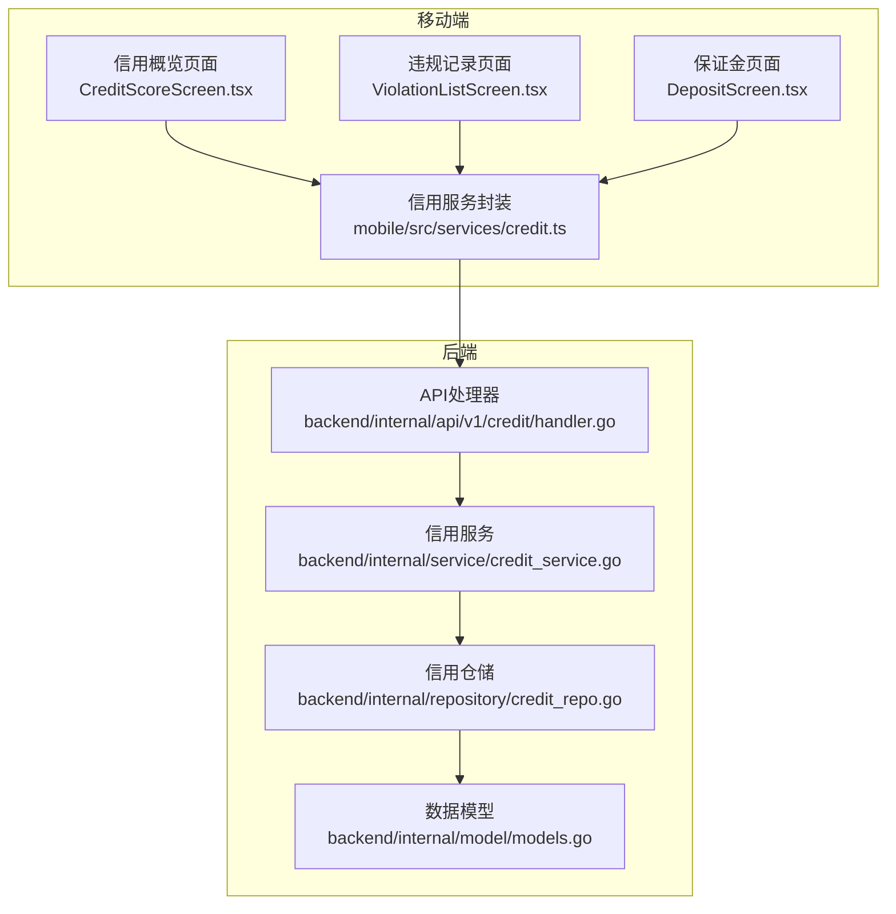
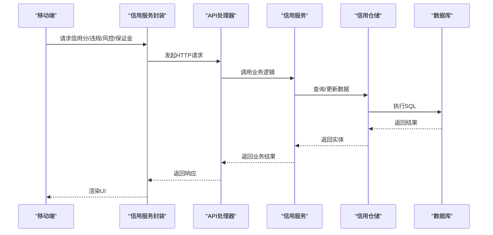
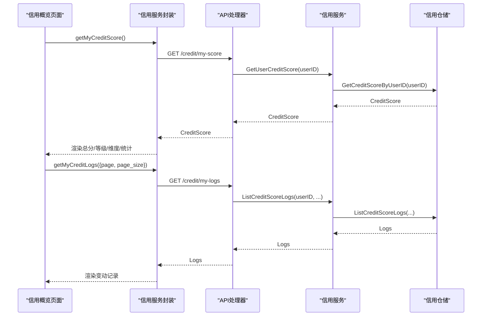
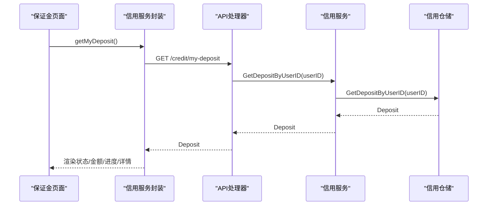
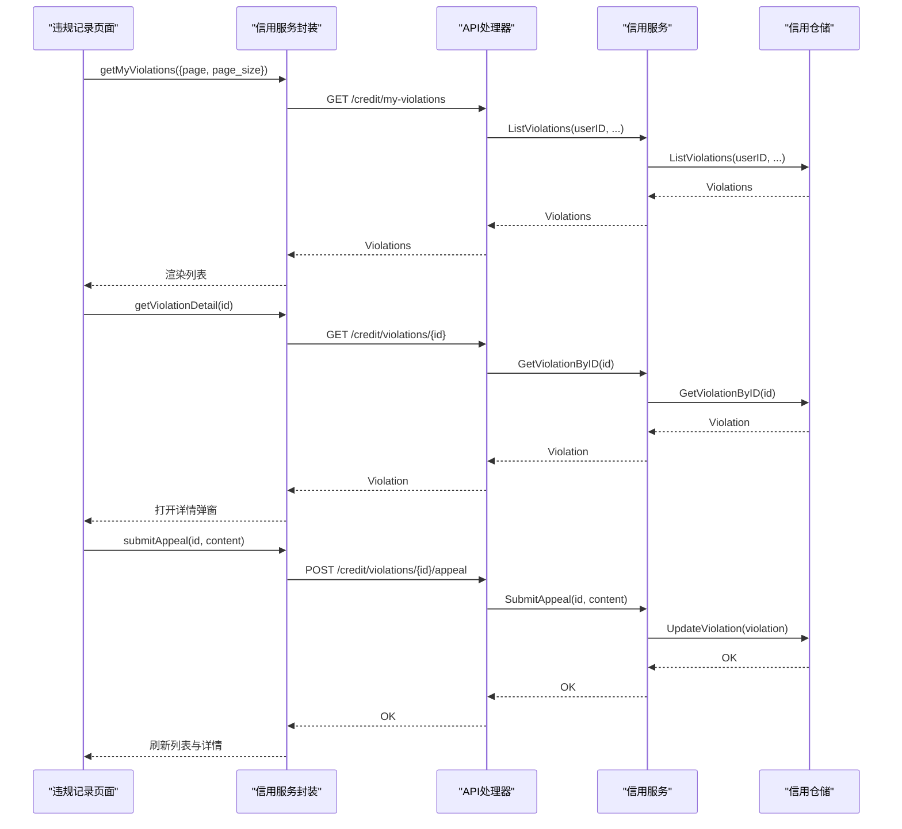
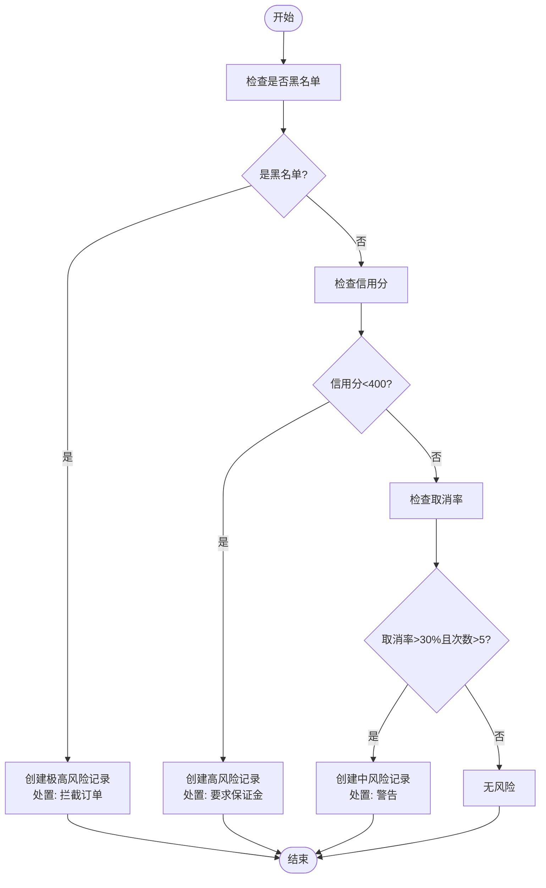
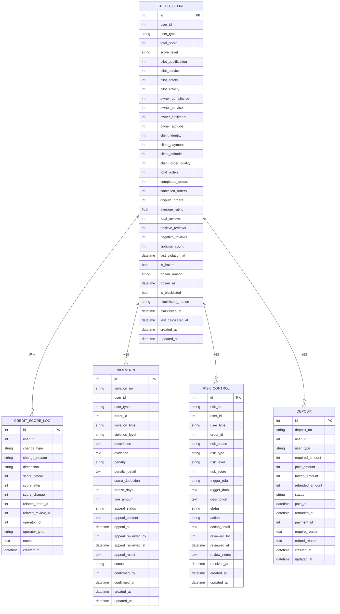
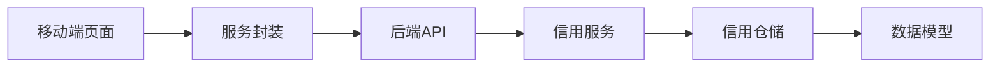

# 信用与风控模块

<cite>
**本文档引用的文件**
- [mobile/src/screens/credit/CreditScoreScreen.tsx](file://mobile/src/screens/credit/CreditScoreScreen.tsx)
- [mobile/src/screens/credit/DepositScreen.tsx](file://mobile/src/screens/credit/DepositScreen.tsx)
- [mobile/src/screens/credit/ViolationListScreen.tsx](file://mobile/src/screens/credit/ViolationListScreen.tsx)
- [mobile/src/services/credit.ts](file://mobile/src/services/credit.ts)
- [backend/internal/service/credit_service.go](file://backend/internal/service/credit_service.go)
- [backend/internal/repository/credit_repo.go](file://backend/internal/repository/credit_repo.go)
- [backend/internal/api/v1/credit/handler.go](file://backend/internal/api/v1/credit/handler.go)
- [backend/internal/model/models.go](file://backend/internal/model/models.go)
- [mobile/src/navigation/MainNavigator.tsx](file://mobile/src/navigation/MainNavigator.tsx)
- [mobile/src/navigation/AppNavigator.tsx](file://mobile/src/navigation/AppNavigator.tsx)
</cite>

## 目录
1. [简介](#简介)
2. [项目结构](#项目结构)
3. [核心组件](#核心组件)
4. [架构总览](#架构总览)
5. [详细组件分析](#详细组件分析)
6. [依赖关系分析](#依赖关系分析)
7. [性能考虑](#性能考虑)
8. [故障排除指南](#故障排除指南)
9. [结论](#结论)
10. [附录](#附录)

## 简介
本技术文档面向移动端信用与风控模块，覆盖信用评分计算、等级展示与趋势分析、押金管理（缴纳、退还、冻结）、违规记录管理（类型、处罚、申诉修复机制）、风控规则移动端实现（风险评估、限额控制、黑名单管理），以及信用历史查询、风险预警、合规检查等能力。同时，文档阐述了信用数据的安全存储、实时更新与异常检测的技术实现方案。

## 项目结构
移动端信用与风控模块主要由以下层次构成：
- 移动端界面层：信用概览、违规记录、保证金管理等页面组件
- 服务层：封装信用相关 API 的 TypeScript 接口定义与调用方法
- 后端服务层：信用评分计算、违规处理、风控检测、保证金管理等业务逻辑
- 数据访问层：基于 GORM 的信用、风控、违规、保证金等模型持久化
- 数据模型层：信用评分、风控记录、违规记录、保证金等实体定义

**图表来源**
- [mobile/src/screens/credit/CreditScoreScreen.tsx:1-462](file://mobile/src/screens/credit/CreditScoreScreen.tsx#L1-L462)
- [mobile/src/screens/credit/ViolationListScreen.tsx:1-519](file://mobile/src/screens/credit/ViolationListScreen.tsx#L1-L519)
- [mobile/src/screens/credit/DepositScreen.tsx:1-416](file://mobile/src/screens/credit/DepositScreen.tsx#L1-L416)
- [mobile/src/services/credit.ts:1-287](file://mobile/src/services/credit.ts#L1-L287)
- [backend/internal/api/v1/credit/handler.go:1-516](file://backend/internal/api/v1/credit/handler.go#L1-L516)
- [backend/internal/service/credit_service.go:1-645](file://backend/internal/service/credit_service.go#L1-L645)
- [backend/internal/repository/credit_repo.go:1-523](file://backend/internal/repository/credit_repo.go#L1-L523)
- [backend/internal/model/models.go:2087-2200](file://backend/internal/model/models.go#L2087-L2200)

**章节来源**
- [mobile/src/screens/credit/CreditScoreScreen.tsx:1-462](file://mobile/src/screens/credit/CreditScoreScreen.tsx#L1-L462)
- [mobile/src/screens/credit/ViolationListScreen.tsx:1-519](file://mobile/src/screens/credit/ViolationListScreen.tsx#L1-L519)
- [mobile/src/screens/credit/DepositScreen.tsx:1-416](file://mobile/src/screens/credit/DepositScreen.tsx#L1-L416)
- [mobile/src/services/credit.ts:1-287](file://mobile/src/services/credit.ts#L1-L287)
- [backend/internal/api/v1/credit/handler.go:1-516](file://backend/internal/api/v1/credit/handler.go#L1-L516)
- [backend/internal/service/credit_service.go:1-645](file://backend/internal/service/credit_service.go#L1-L645)
- [backend/internal/repository/credit_repo.go:1-523](file://backend/internal/repository/credit_repo.go#L1-L523)
- [backend/internal/model/models.go:2087-2200](file://backend/internal/model/models.go#L2087-L2200)

## 核心组件
- 信用评分模块：支持按用户类型（飞手、机主、客户）的分项维度评分、总分与等级计算、统计指标展示、冻结与黑名单状态提示、信用历史记录查询与趋势分析
- 押金管理模块：支持保证金状态查询、应缴/已缴/冻结/已退金额展示、缴纳进度、详细信息与说明
- 违规记录模块：支持违规类型与等级展示、处罚措施（警告、扣分、临时/永久冻结、拉黑）、申诉流程与状态管理
- 风控规则模块：支持订单前风控检查、风险等级与处置建议、风控记录列表与详情、黑名单管理
- 数据模型：信用评分、风控记录、违规记录、保证金、统计信息等

**章节来源**
- [mobile/src/services/credit.ts:7-164](file://mobile/src/services/credit.ts#L7-L164)
- [backend/internal/model/models.go:2087-2200](file://backend/internal/model/models.go#L2087-L2200)
- [backend/internal/service/credit_service.go:22-645](file://backend/internal/service/credit_service.go#L22-L645)

## 架构总览
移动端通过服务封装调用后端信用与风控相关接口；后端处理器接收请求，委派给信用服务层进行业务处理，仓储层负责与数据库交互，模型层定义数据结构与约束。

**图表来源**
- [mobile/src/services/credit.ts:176-221](file://mobile/src/services/credit.ts#L176-L221)
- [backend/internal/api/v1/credit/handler.go:25-101](file://backend/internal/api/v1/credit/handler.go#L25-L101)
- [backend/internal/service/credit_service.go:36-44](file://backend/internal/service/credit_service.go#L36-L44)
- [backend/internal/repository/credit_repo.go:23-52](file://backend/internal/repository/credit_repo.go#L23-L52)

**章节来源**
- [mobile/src/services/credit.ts:1-287](file://mobile/src/services/credit.ts#L1-L287)
- [backend/internal/api/v1/credit/handler.go:1-516](file://backend/internal/api/v1/credit/handler.go#L1-L516)
- [backend/internal/service/credit_service.go:1-645](file://backend/internal/service/credit_service.go#L1-L645)
- [backend/internal/repository/credit_repo.go:1-523](file://backend/internal/repository/credit_repo.go#L1-L523)

## 详细组件分析

### 信用评分组件分析
- 功能要点
  - 分项维度：飞手（基础资质、服务质量、安全记录、活跃度）、机主（设备合规、服务质量、履约能力、合作态度）、客户（身份认证、支付能力、合作态度、订单质量）
  - 等级计算：根据总分区间映射等级（优秀、良好、正常、较差、极差）
  - 统计指标：总订单、已完成、平均评分、违规次数等
  - 状态提示：账号冻结与黑名单状态展示
  - 历史记录：信用分变动日志，支持按类型筛选与分页
- 数据流
  - 页面加载时并行获取信用分与最近变动日志
  - 根据用户类型渲染不同维度的得分与进度条
  - 使用颜色映射展示等级与状态
- 异常处理
  - 加载失败时捕获错误并提示
  - 下拉刷新保证数据新鲜度

**图表来源**
- [mobile/src/screens/credit/CreditScoreScreen.tsx:31-49](file://mobile/src/screens/credit/CreditScoreScreen.tsx#L31-L49)
- [mobile/src/services/credit.ts:176-186](file://mobile/src/services/credit.ts#L176-L186)
- [backend/internal/api/v1/credit/handler.go:25-101](file://backend/internal/api/v1/credit/handler.go#L25-L101)
- [backend/internal/service/credit_service.go:41-44](file://backend/internal/service/credit_service.go#L41-L44)
- [backend/internal/repository/credit_repo.go:23-30](file://backend/internal/repository/credit_repo.go#L23-L30)

**章节来源**
- [mobile/src/screens/credit/CreditScoreScreen.tsx:22-251](file://mobile/src/screens/credit/CreditScoreScreen.tsx#L22-L251)
- [mobile/src/services/credit.ts:7-66](file://mobile/src/services/credit.ts#L7-L66)
- [backend/internal/service/credit_service.go:22-236](file://backend/internal/service/credit_service.go#L22-L236)
- [backend/internal/repository/credit_repo.go:54-76](file://backend/internal/repository/credit_repo.go#L54-L76)

### 押金管理组件分析
- 功能要点
  - 状态卡片：显示保证金编号、状态徽章、应缴/已缴/冻结/已退金额
  - 进度条：缴纳进度百分比与颜色区分
  - 详细信息：要求原因、缴纳/退还时间、创建时间
  - 说明信息：保证金用途、扣款与退还规则
- 流程
  - 获取当前用户保证金记录
  - 根据状态映射文本与颜色
  - 金额以“元”格式化显示（分到元转换）

**图表来源**
- [mobile/src/screens/credit/DepositScreen.tsx:22-47](file://mobile/src/screens/credit/DepositScreen.tsx#L22-L47)
- [mobile/src/services/credit.ts:214-214](file://mobile/src/services/credit.ts#L214-L214)
- [backend/internal/api/v1/credit/handler.go:430-443](file://backend/internal/api/v1/credit/handler.go#L430-L443)
- [backend/internal/service/credit_service.go:638-640](file://backend/internal/service/credit_service.go#L638-L640)
- [backend/internal/repository/credit_repo.go:418-425](file://backend/internal/repository/credit_repo.go#L418-L425)

**章节来源**
- [mobile/src/screens/credit/DepositScreen.tsx:14-232](file://mobile/src/screens/credit/DepositScreen.tsx#L14-L232)
- [mobile/src/services/credit.ts:138-155](file://mobile/src/services/credit.ts#L138-L155)
- [backend/internal/service/credit_service.go:549-600](file://backend/internal/service/credit_service.go#L549-L600)
- [backend/internal/repository/credit_repo.go:413-438](file://backend/internal/repository/credit_repo.go#L413-L438)

### 违规记录管理组件分析
- 功能要点
  - 列表展示：违规类型与等级徽标、描述、创建时间、状态、处罚信息
  - 详情弹窗：违规编号、类型、等级、状态、描述、处罚措施、扣分/冻结天数、申诉状态与结果、创建时间
  - 申诉流程：提交申诉（内容限制与校验）、提交后刷新列表与详情
- 流程
  - 获取我的违规记录列表
  - 查看详情并根据状态判断是否允许提交申诉
  - 提交申诉后刷新数据

**图表来源**
- [mobile/src/screens/credit/ViolationListScreen.tsx:37-87](file://mobile/src/screens/credit/ViolationListScreen.tsx#L37-L87)
- [mobile/src/services/credit.ts:189-198](file://mobile/src/services/credit.ts#L189-L198)
- [backend/internal/api/v1/credit/handler.go:107-128](file://backend/internal/api/v1/credit/handler.go#L107-L128)
- [backend/internal/api/v1/credit/handler.go:158-172](file://backend/internal/api/v1/credit/handler.go#L158-L172)
- [backend/internal/api/v1/credit/handler.go:237-258](file://backend/internal/api/v1/credit/handler.go#L237-L258)
- [backend/internal/service/credit_service.go:630-632](file://backend/internal/service/credit_service.go#L630-L632)
- [backend/internal/service/credit_service.go:347-365](file://backend/internal/service/credit_service.go#L347-L365)

**章节来源**
- [mobile/src/screens/credit/ViolationListScreen.tsx:25-291](file://mobile/src/screens/credit/ViolationListScreen.tsx#L25-L291)
- [mobile/src/services/credit.ts:68-94](file://mobile/src/services/credit.ts#L68-L94)
- [backend/internal/api/v1/credit/handler.go:107-128](file://backend/internal/api/v1/credit/handler.go#L107-L128)
- [backend/internal/api/v1/credit/handler.go:158-172](file://backend/internal/api/v1/credit/handler.go#L158-L172)
- [backend/internal/api/v1/credit/handler.go:237-258](file://backend/internal/api/v1/credit/handler.go#L237-L258)
- [backend/internal/service/credit_service.go:242-365](file://backend/internal/service/credit_service.go#L242-L365)

### 风控规则移动端实现
- 功能要点
  - 订单前风控检查：根据用户是否黑名单、信用分、取消率、违规次数等触发风险
  - 风控记录列表与详情：支持按阶段、类型、状态筛选
  - 处置建议：根据风险等级建议处置（警告、要求保证金、冻结、拉黑、拦截订单）
- 数据模型
  - 风控记录包含风险阶段、类型、等级、分数、触发规则与数据、处置动作与备注等

**图表来源**
- [backend/internal/service/credit_service.go:453-486](file://backend/internal/service/credit_service.go#L453-L486)
- [backend/internal/service/credit_service.go:488-517](file://backend/internal/service/credit_service.go#L488-L517)
- [backend/internal/model/models.go:2168-2200](file://backend/internal/model/models.go#L2168-L2200)

**章节来源**
- [mobile/src/services/credit.ts:166-207](file://mobile/src/services/credit.ts#L166-L207)
- [backend/internal/api/v1/credit/handler.go:294-361](file://backend/internal/api/v1/credit/handler.go#L294-L361)
- [backend/internal/service/credit_service.go:453-543](file://backend/internal/service/credit_service.go#L453-L543)
- [backend/internal/model/models.go:2168-2200](file://backend/internal/model/models.go#L2168-L2200)

### 数据模型与关系

**图表来源**
- [backend/internal/model/models.go:2087-2200](file://backend/internal/model/models.go#L2087-L2200)

**章节来源**
- [backend/internal/model/models.go:2087-2200](file://backend/internal/model/models.go#L2087-L2200)

## 依赖关系分析
- 组件耦合
  - 移动端页面依赖服务封装，服务封装依赖后端 API
  - 后端处理器依赖信用服务层，服务层依赖仓储层，仓储层依赖数据模型
- 关键依赖链
  - 信用评分：页面 -> 服务封装 -> API -> 服务 -> 仓储 -> 模型
  - 违规处理：页面 -> 服务封装 -> API -> 服务 -> 仓储 -> 模型
  - 风控检查：页面 -> 服务封装 -> API -> 服务 -> 仓储 -> 模型
- 外部依赖
  - HTTP 客户端用于移动端与后端通信
  - GORM 用于后端数据持久化

**图表来源**
- [mobile/src/services/credit.ts:1-287](file://mobile/src/services/credit.ts#L1-L287)
- [backend/internal/api/v1/credit/handler.go:1-516](file://backend/internal/api/v1/credit/handler.go#L1-L516)
- [backend/internal/service/credit_service.go:1-645](file://backend/internal/service/credit_service.go#L1-L645)
- [backend/internal/repository/credit_repo.go:1-523](file://backend/internal/repository/credit_repo.go#L1-L523)
- [backend/internal/model/models.go:2087-2200](file://backend/internal/model/models.go#L2087-L2200)

**章节来源**
- [mobile/src/services/credit.ts:1-287](file://mobile/src/services/credit.ts#L1-L287)
- [backend/internal/api/v1/credit/handler.go:1-516](file://backend/internal/api/v1/credit/handler.go#L1-L516)
- [backend/internal/service/credit_service.go:1-645](file://backend/internal/service/credit_service.go#L1-L645)
- [backend/internal/repository/credit_repo.go:1-523](file://backend/internal/repository/credit_repo.go#L1-L523)

## 性能考虑
- 并发加载：信用概览页面使用并行请求同时获取信用分与日志，缩短首屏等待时间
- 列表分页：违规与风控列表支持分页参数，避免一次性加载大量数据
- 进度条与颜色：前端对状态与等级进行本地映射，减少重复计算
- 数据缓存：建议在移动端引入轻量缓存策略，结合下拉刷新保证数据新鲜度
- 数据库索引：仓储层查询使用索引字段（如 user_id、status、created_at），提升查询效率

[本节为通用性能指导，无需特定文件引用]

## 故障排除指南
- 信用分加载失败
  - 检查网络请求与错误日志
  - 确认用户是否已初始化信用分
- 保证金查询异常
  - 404 表示当前无保证金记录，属于正常情况
  - 其他错误需提示用户重试
- 违规申诉失败
  - 校验申诉内容长度与必填
  - 确认违规状态允许申诉
- 风控检查无结果
  - 新用户可能无信用分记录，不会触发风控
  - 检查黑名单状态与信用分阈值

**章节来源**
- [mobile/src/screens/credit/CreditScoreScreen.tsx:39-44](file://mobile/src/screens/credit/CreditScoreScreen.tsx#L39-L44)
- [mobile/src/screens/credit/DepositScreen.tsx:27-37](file://mobile/src/screens/credit/DepositScreen.tsx#L27-L37)
- [mobile/src/screens/credit/ViolationListScreen.tsx:68-87](file://mobile/src/screens/credit/ViolationListScreen.tsx#L68-L87)
- [backend/internal/service/credit_service.go:453-486](file://backend/internal/service/credit_service.go#L453-L486)

## 结论
移动端信用与风控模块通过清晰的分层设计实现了信用评分、违规管理、保证金与风控规则的完整闭环。前端采用并行加载与本地状态管理优化用户体验，后端以服务与仓储分离确保业务逻辑与数据访问的可维护性。建议持续完善异常处理与性能优化，并在移动端引入更细粒度的数据缓存与增量更新策略，以进一步提升稳定性与响应速度。

[本节为总结性内容，无需特定文件引用]

## 附录
- 导航集成
  - 主导航中包含信用与风控相关页面入口，便于用户快速访问
  - 应用启动时根据认证状态连接 WebSocket，支持实时推送

**章节来源**
- [mobile/src/navigation/MainNavigator.tsx:111-129](file://mobile/src/navigation/MainNavigator.tsx#L111-L129)
- [mobile/src/navigation/AppNavigator.tsx:21-30](file://mobile/src/navigation/AppNavigator.tsx#L21-L30)