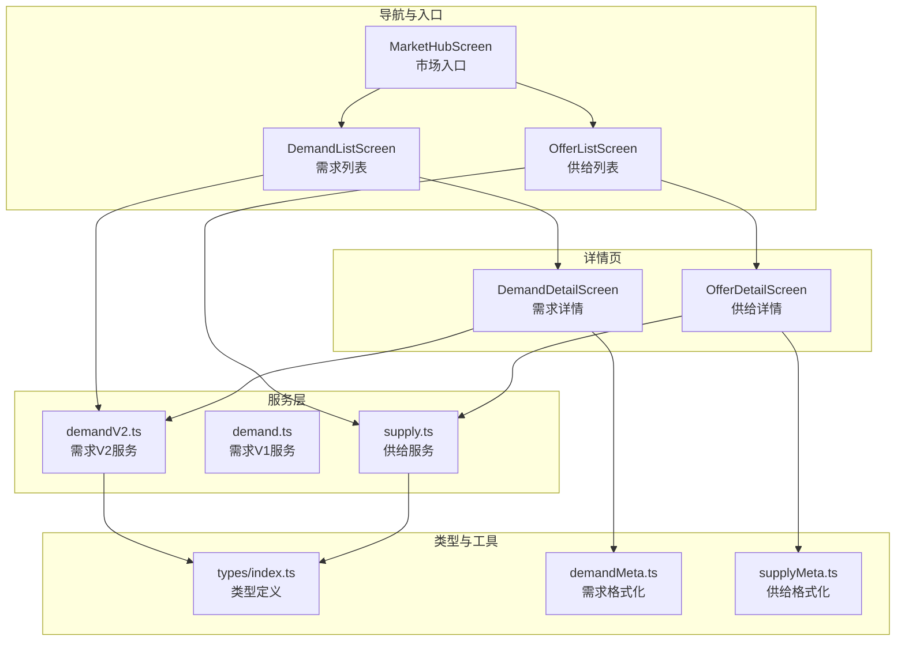
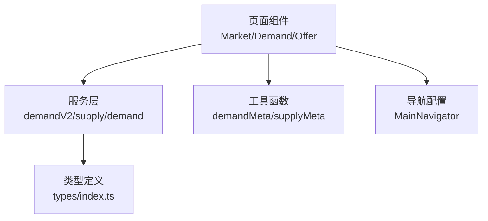
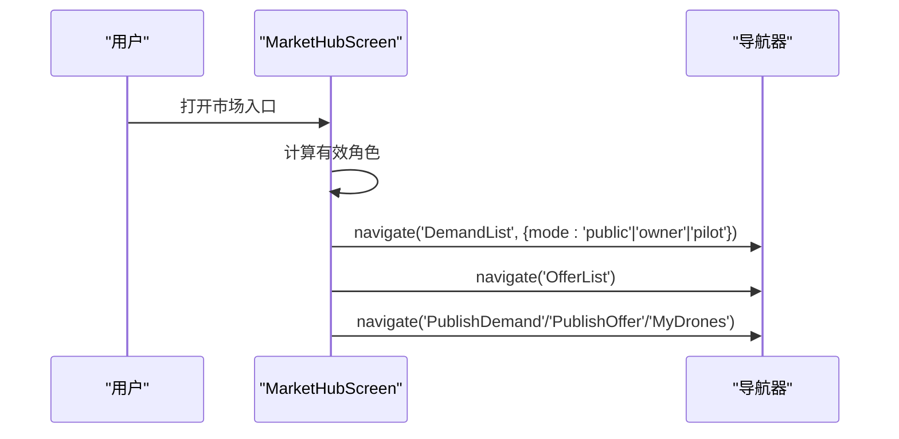
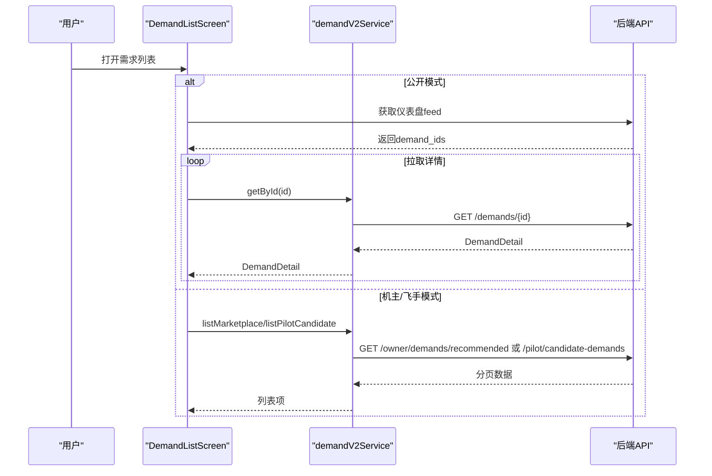
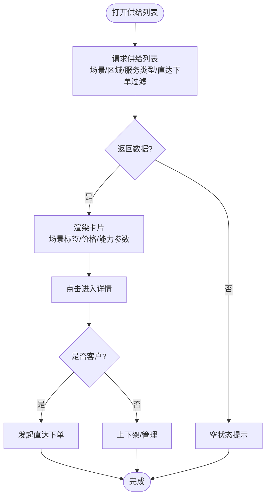
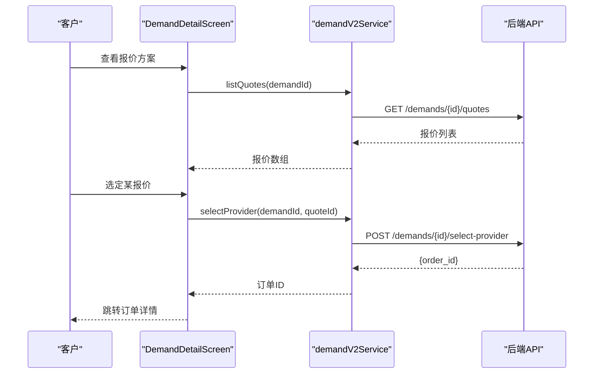
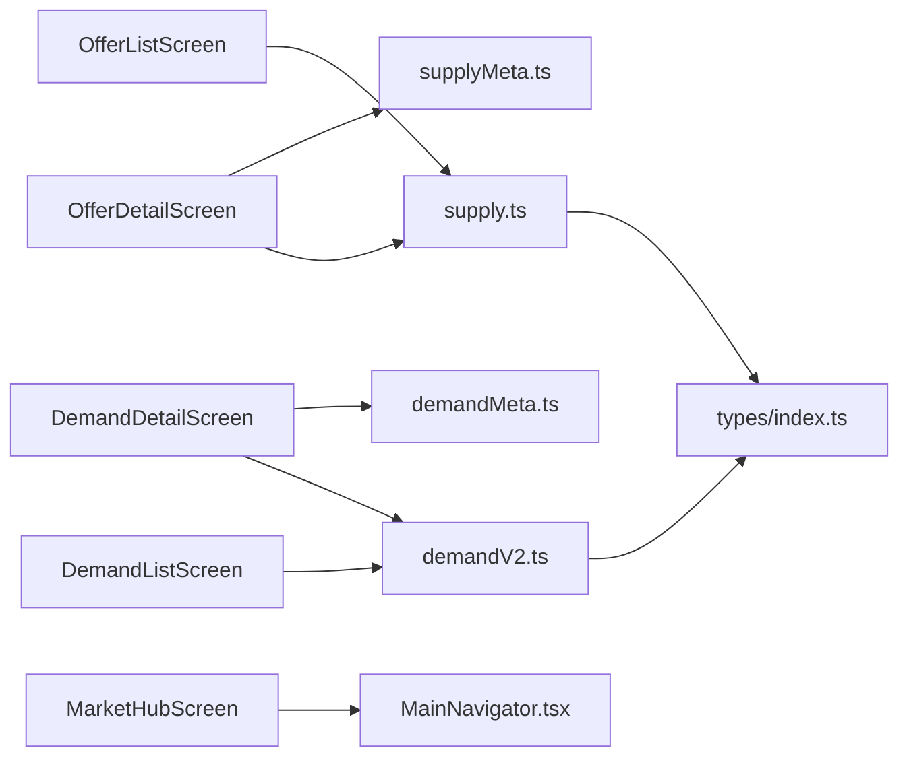

# 市场与撮合模块

<cite>
**本文引用的文件**
- [MarketHubScreen.tsx](file://mobile/src/screens/market/MarketHubScreen.tsx)
- [DemandListScreen.tsx](file://mobile/src/screens/demand/DemandListScreen.tsx)
- [OfferListScreen.tsx](file://mobile/src/screens/demand/OfferListScreen.tsx)
- [DemandDetailScreen.tsx](file://mobile/src/screens/demand/DemandDetailScreen.tsx)
- [OfferDetailScreen.tsx](file://mobile/src/screens/demand/OfferDetailScreen.tsx)
- [demand.ts](file://mobile/src/services/demand.ts)
- [supply.ts](file://mobile/src/services/supply.ts)
- [demandV2.ts](file://mobile/src/services/demandV2.ts)
- [index.ts](file://mobile/src/types/index.ts)
- [demandMeta.ts](file://mobile/src/utils/demandMeta.ts)
- [supplyMeta.ts](file://mobile/src/utils/supplyMeta.ts)
- [MainNavigator.tsx](file://mobile/src/navigation/MainNavigator.tsx)
</cite>

## 目录
1. [简介](#简介)
2. [项目结构](#项目结构)
3. [核心组件](#核心组件)
4. [架构总览](#架构总览)
5. [详细组件分析](#详细组件分析)
6. [依赖关系分析](#依赖关系分析)
7. [性能考量](#性能考量)
8. [故障排查指南](#故障排查指南)
9. [结论](#结论)
10. [附录](#附录)

## 简介
本技术文档聚焦移动端“市场与撮合模块”，系统性阐述市场中心的功能实现与移动端交互设计，涵盖需求浏览、供给发现、报价组合、价格比较、供需匹配流程、实时更新与推送、用户反馈、数据可视化、搜索优化与个性化推荐等。文档以代码级分析为基础，配合可视化图示，帮助开发者与产品人员快速理解与迭代。

## 项目结构
移动端市场与撮合模块位于 mobile 目录，采用按功能分层的组织方式：
- screens：页面组件（市场入口、需求列表/详情、供给列表/详情）
- services：业务服务封装（需求/供给/订单 API 封装）
- utils：格式化与元数据工具（场景标签、金额格式、时间格式等）
- types：TS 类型定义（需求、供给、报价、订单、分页、通知等）
- navigation：导航配置（底部 Tab + 堆栈导航）

图表来源
- [MarketHubScreen.tsx:42-168](file://mobile/src/screens/market/MarketHubScreen.tsx#L42-L168)
- [DemandListScreen.tsx:51-274](file://mobile/src/screens/demand/DemandListScreen.tsx#L51-L274)
- [OfferListScreen.tsx:46-249](file://mobile/src/screens/demand/OfferListScreen.tsx#L46-L249)
- [DemandDetailScreen.tsx:32-359](file://mobile/src/screens/demand/DemandDetailScreen.tsx#L32-L359)
- [OfferDetailScreen.tsx:42-292](file://mobile/src/screens/demand/OfferDetailScreen.tsx#L42-L292)
- [demandV2.ts:42-83](file://mobile/src/services/demandV2.ts#L42-L83)
- [demand.ts:4-67](file://mobile/src/services/demand.ts#L4-L67)
- [supply.ts:22-34](file://mobile/src/services/supply.ts#L22-L34)
- [index.ts:13-90](file://mobile/src/types/index.ts#L13-L90)
- [demandMeta.ts:1-63](file://mobile/src/utils/demandMeta.ts#L1-L63)
- [supplyMeta.ts:1-86](file://mobile/src/utils/supplyMeta.ts#L1-L86)

章节来源
- [MarketHubScreen.tsx:42-168](file://mobile/src/screens/market/MarketHubScreen.tsx#L42-L168)
- [MainNavigator.tsx:131-194](file://mobile/src/navigation/MainNavigator.tsx#L131-L194)

## 核心组件
- 市场入口页（MarketHubScreen）：根据用户角色动态呈现“需求市场/供给市场/发布需求/我的需求/发布供给/我的供给/我的无人机/候选需求”等入口，统一跳转至对应列表或发布页。
- 需求列表页（DemandListScreen）：支持公开、机主推荐、飞手候选三种模式；通过仪表盘 feed 拉取公开需求，或调用 V2 接口拉取推荐/候选需求；支持刷新与分页加载。
- 供给列表页（OfferListScreen）：筛选场景与区域，仅展示支持“直达下单”的供给；支持分页与搜索。
- 需求详情页（DemandDetailScreen）：展示需求详情、报价方案、飞手候选、报价选择与撤销需求等；支持机主/飞手/客户等不同角色的操作。
- 供给详情页（OfferDetailScreen）：展示供给能力、覆盖范围、价格与规则、机主信息；支持客户直达下单或机主上下架操作。

章节来源
- [MarketHubScreen.tsx:49-131](file://mobile/src/screens/market/MarketHubScreen.tsx#L49-L131)
- [DemandListScreen.tsx:51-162](file://mobile/src/screens/demand/DemandListScreen.tsx#L51-L162)
- [OfferListScreen.tsx:46-121](file://mobile/src/screens/demand/OfferListScreen.tsx#L46-L121)
- [DemandDetailScreen.tsx:32-156](file://mobile/src/screens/demand/DemandDetailScreen.tsx#L32-L156)
- [OfferDetailScreen.tsx:42-131](file://mobile/src/screens/demand/OfferDetailScreen.tsx#L42-L131)

## 架构总览
移动端市场与撮合模块遵循“页面组件 → 服务层 → 类型与工具 → 后端 API”的分层架构。页面组件负责用户交互与状态管理，服务层封装 API 请求，类型与工具提供数据结构与格式化方法，导航层统一路由。

图表来源
- [MainNavigator.tsx:131-194](file://mobile/src/navigation/MainNavigator.tsx#L131-L194)
- [demandV2.ts:42-83](file://mobile/src/services/demandV2.ts#L42-L83)
- [supply.ts:22-34](file://mobile/src/services/supply.ts#L22-L34)
- [demand.ts:4-67](file://mobile/src/services/demand.ts#L4-L67)
- [index.ts:13-90](file://mobile/src/types/index.ts#L13-L90)
- [demandMeta.ts:1-63](file://mobile/src/utils/demandMeta.ts#L1-L63)
- [supplyMeta.ts:1-86](file://mobile/src/utils/supplyMeta.ts#L1-L86)

## 详细组件分析

### 市场入口与导航
- 动态入口：依据用户角色（客户端、机主、飞手）显示不同入口，避免角色无关功能干扰。
- 统一跳转：从市场入口页跳转到需求列表（公开/机主/飞手）、供给列表、发布页等。

图表来源
- [MarketHubScreen.tsx:49-131](file://mobile/src/screens/market/MarketHubScreen.tsx#L49-L131)
- [MainNavigator.tsx:131-194](file://mobile/src/navigation/MainNavigator.tsx#L131-L194)

章节来源
- [MarketHubScreen.tsx:42-168](file://mobile/src/screens/market/MarketHubScreen.tsx#L42-L168)
- [MainNavigator.tsx:131-194](file://mobile/src/navigation/MainNavigator.tsx#L131-L194)

### 需求列表与详情
- 列表模式：
  - 公开模式：通过首页仪表盘 feed 拉取公开需求 ID，再批量拉取详情。
  - 机主/飞手模式：调用 V2 接口获取推荐/候选需求，支持分页与刷新。
- 详情页能力：
  - 展示预算、场景、地址、时间、报价数、候选数等。
  - 角色权限控制：机主可报价/撤销需求；飞手可报名候选；客户可查看与选择最优报价。

图表来源
- [DemandListScreen.tsx:85-156](file://mobile/src/screens/demand/DemandListScreen.tsx#L85-L156)
- [demandV2.ts:43-47](file://mobile/src/services/demandV2.ts#L43-L47)

章节来源
- [DemandListScreen.tsx:51-274](file://mobile/src/screens/demand/DemandListScreen.tsx#L51-L274)
- [DemandDetailScreen.tsx:32-359](file://mobile/src/screens/demand/DemandDetailScreen.tsx#L32-L359)
- [demandV2.ts:42-83](file://mobile/src/services/demandV2.ts#L42-L83)

### 供给列表与详情
- 列表筛选：支持按场景、区域、服务类型筛选，仅展示支持“直达下单”的供给。
- 详情页能力：展示能力参数（起飞重量、最大吊重、航程）、覆盖范围、计价规则、机主信息；客户可发起直达下单，机主可上下架。

图表来源
- [OfferListScreen.tsx:59-121](file://mobile/src/screens/demand/OfferListScreen.tsx#L59-L121)
- [OfferDetailScreen.tsx:42-131](file://mobile/src/screens/demand/OfferDetailScreen.tsx#L42-L131)

章节来源
- [OfferListScreen.tsx:46-249](file://mobile/src/screens/demand/OfferListScreen.tsx#L46-L249)
- [OfferDetailScreen.tsx:42-292](file://mobile/src/screens/demand/OfferDetailScreen.tsx#L42-L292)

### 报价组合与最优方案推荐
- 报价列表：需求详情页可展开查看所有报价，展示报价金额、机主昵称、设备信息、执行计划等。
- 最优方案选择：客户可选择报价生成订单，流程结束回到履约模块处理。
- 价格比较：页面提供报价卡片对比，便于客户快速比较价格与方案描述。

图表来源
- [DemandDetailScreen.tsx:78-136](file://mobile/src/screens/demand/DemandDetailScreen.tsx#L78-L136)
- [demandV2.ts:55-64](file://mobile/src/services/demandV2.ts#L55-L64)

章节来源
- [DemandDetailScreen.tsx:32-359](file://mobile/src/screens/demand/DemandDetailScreen.tsx#L32-L359)
- [demandV2.ts:55-64](file://mobile/src/services/demandV2.ts#L55-L64)

### 供需匹配算法（移动端实现要点）
- 距离计算：供给详情页展示“设备所在城市”等信息，便于用户判断就近性；实际距离计算通常由后端基于服务区域快照与用户定位综合评估。
- 价格比较：页面以“基础价格+计价单位”直观展示，支持按“元/单/架次/公里/小时/公斤/固定价”等维度比较。
- 信誉评估：页面未直接展示信誉字段，但可通过“机主昵称/头像/历史订单”等间接感知；建议在详情页扩展信誉指标展示。
- 匹配策略：公开需求页通过仪表盘 feed 与 V2 接口聚合，机主/飞手模式分别走推荐/候选通道，体现“角色导向”的匹配入口。

章节来源
- [OfferDetailScreen.tsx:133-137](file://mobile/src/screens/demand/OfferDetailScreen.tsx#L133-L137)
- [supplyMeta.ts:9-17](file://mobile/src/utils/supplyMeta.ts#L9-L17)
- [DemandListScreen.tsx:85-111](file://mobile/src/screens/demand/DemandListScreen.tsx#L85-L111)

### 实时报价更新、推送通知与用户反馈
- 实时更新：需求详情页支持“刷新控件”与“加载更多”，确保报价与候选数等关键指标及时更新。
- 推送通知：类型定义中包含通知模型（含业务事件、订单号、需求号等），可用于集成推送与站内信。
- 用户反馈：详情页提供“联系机主”入口，便于客户与机主沟通；同时支持撤销需求、报名候选等操作。

章节来源
- [DemandDetailScreen.tsx:101-119](file://mobile/src/screens/demand/DemandDetailScreen.tsx#L101-L119)
- [OfferDetailScreen.tsx:266-287](file://mobile/src/screens/demand/OfferDetailScreen.tsx#L266-L287)
- [index.ts:278-305](file://mobile/src/types/index.ts#L278-L305)

### 数据可视化、搜索优化与个性化推荐
- 可视化：列表页使用卡片式布局与标签/徽章展示状态与来源；详情页使用指标卡展示报价与候选数量。
- 搜索优化：供给列表支持“区域关键词输入 + 场景筛选 + 更新筛选结果”；需求列表支持“公开/机主/飞手”三模式切换。
- 个性化推荐：机主视角展示“推荐需求”，飞手视角展示“候选需求”，体现基于角色的个性化入口。

章节来源
- [OfferListScreen.tsx:180-246](file://mobile/src/screens/demand/OfferListScreen.tsx#L180-L246)
- [DemandListScreen.tsx:179-201](file://mobile/src/screens/demand/DemandListScreen.tsx#L179-L201)
- [demandV2.ts:43-47](file://mobile/src/services/demandV2.ts#L43-L47)

## 依赖关系分析
- 页面组件依赖服务层进行数据拉取与写操作。
- 服务层依赖类型定义进行请求/响应的数据结构约束。
- 工具函数用于格式化预算、时间、场景标签等，提升展示一致性。
- 导航层统一管理页面跳转与标题。

图表来源
- [DemandListScreen.tsx:17-22](file://mobile/src/screens/demand/DemandListScreen.tsx#L17-L22)
- [DemandDetailScreen.tsx:17-28](file://mobile/src/screens/demand/DemandDetailScreen.tsx#L17-L28)
- [OfferListScreen.tsx:20-23](file://mobile/src/screens/demand/OfferListScreen.tsx#L20-L23)
- [OfferDetailScreen.tsx:19-28](file://mobile/src/screens/demand/OfferDetailScreen.tsx#L19-L28)
- [demandV2.ts:1-13](file://mobile/src/services/demandV2.ts#L1-L13)
- [supply.ts:1-10](file://mobile/src/services/supply.ts#L1-L10)
- [index.ts:1-11](file://mobile/src/types/index.ts#L1-L11)
- [demandMeta.ts:1-2](file://mobile/src/utils/demandMeta.ts#L1-L2)
- [supplyMeta.ts:1-7](file://mobile/src/utils/supplyMeta.ts#L1-L7)
- [MainNavigator.tsx:131-194](file://mobile/src/navigation/MainNavigator.tsx#L131-L194)

章节来源
- [MainNavigator.tsx:131-194](file://mobile/src/navigation/MainNavigator.tsx#L131-L194)
- [index.ts:13-90](file://mobile/src/types/index.ts#L13-L90)

## 性能考量
- 列表分页与懒加载：需求列表与供给列表均采用分页与“加载更多”机制，减少一次性渲染压力。
- 刷新与下拉：提供刷新控件，避免重复请求与无效渲染。
- 批量详情拉取：公开需求模式先取 ID 再批量拉取详情，降低网络往返次数。
- 渲染优化：卡片组件复用，标签与徽章统一风格，减少样式计算成本。

章节来源
- [DemandListScreen.tsx:127-177](file://mobile/src/screens/demand/DemandListScreen.tsx#L127-L177)
- [OfferListScreen.tsx:59-113](file://mobile/src/screens/demand/OfferListScreen.tsx#L59-L113)

## 故障排查指南
- 网络异常：
  - 需求列表/供给列表：捕获请求异常并提示，保持加载状态与刷新控件可用。
  - 需求详情：获取失败弹出警告并回退空状态。
- 权限问题：
  - 详情页根据角色与状态判断可操作按钮，避免非法操作。
- 选择报价失败：
  - 提示错误信息并允许重试；选择成功后跳转订单详情。
- 直达下单限制：
  - 当供给不支持直达下单时，提示不可下单并引导返回市场。

章节来源
- [DemandListScreen.tsx:149-156](file://mobile/src/screens/demand/DemandListScreen.tsx#L149-L156)
- [OfferListScreen.tsx:78-84](file://mobile/src/screens/demand/OfferListScreen.tsx#L78-L84)
- [DemandDetailScreen.tsx:66-72](file://mobile/src/screens/demand/DemandDetailScreen.tsx#L66-L72)
- [DemandDetailScreen.tsx:121-136](file://mobile/src/screens/demand/DemandDetailScreen.tsx#L121-L136)
- [OfferDetailScreen.tsx:96-105](file://mobile/src/screens/demand/OfferDetailScreen.tsx#L96-L105)
- [OfferDetailScreen.tsx:233-238](file://mobile/src/screens/demand/OfferDetailScreen.tsx#L233-L238)

## 结论
市场与撮合模块通过清晰的角色化入口、稳定的列表/详情页面与完善的服务层封装，实现了需求与供给的高效对接。报价组合与最优方案推荐流程简洁明确，结合实时更新与推送通知，提升了用户体验。未来可在信誉评估、匹配算法透明度与个性化推荐方面进一步增强，以支撑更智能的撮合体验。

## 附录
- 类型定义概览：涵盖用户、角色、需求、供给、报价、订单、通知、分页等核心对象，保证前后端契约一致。
- 格式化工具：统一预算、时间、场景标签、计价单位等展示格式，提升一致性与可读性。

章节来源
- [index.ts:13-90](file://mobile/src/types/index.ts#L13-L90)
- [demandMeta.ts:1-63](file://mobile/src/utils/demandMeta.ts#L1-L63)
- [supplyMeta.ts:1-86](file://mobile/src/utils/supplyMeta.ts#L1-L86)